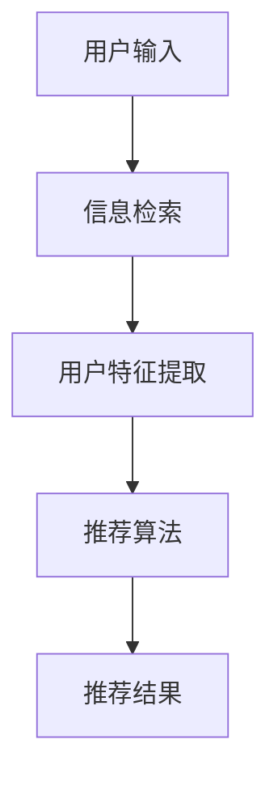

                 

作者：禅与计算机程序设计艺术 / Zen and the Art of Computer Programming

随着互联网的迅猛发展和信息爆炸时代的来临，人们面临的信息选择压力日益增大。为了帮助用户高效地获取所需信息，搜索推荐系统应运而生。本文将深入探讨搜索推荐系统的算法本质，并重点分析AI大模型的融合策略。

## 1. 背景介绍

搜索推荐系统（Search and Recommendation System）是一种旨在帮助用户快速找到感兴趣的信息的技术。它结合了搜索引擎和推荐系统的优势，旨在提供个性化的信息推荐服务。搜索推荐系统通常由三个主要组件构成：信息检索、用户建模和推荐算法。

近年来，随着人工智能技术的飞速发展，尤其是深度学习、自然语言处理等领域的突破，AI大模型在搜索推荐系统中得到了广泛应用。这些大模型能够处理海量数据，挖掘用户行为和偏好，从而提供更精准的推荐。

## 2. 核心概念与联系

在搜索推荐系统中，核心概念主要包括信息检索、用户建模和推荐算法。以下是一个简化的Mermaid流程图，展示了这些概念之间的关系：



### 2.1 信息检索

信息检索（Information Retrieval）是搜索推荐系统的核心组件之一。它的目标是快速地从海量信息中找到与用户查询相关的文档。信息检索主要依赖于搜索引擎技术，包括关键词匹配、倒排索引、文本相似度计算等。

### 2.2 用户建模

用户建模（User Modeling）是了解用户兴趣和需求的关键。通过分析用户的历史行为和偏好，系统可以建立用户画像，从而为推荐算法提供输入。用户建模技术包括行为分析、内容分析、社会网络分析等。

### 2.3 推荐算法

推荐算法（Recommendation Algorithm）是搜索推荐系统的核心，负责根据用户特征和上下文信息生成推荐结果。推荐算法主要分为基于内容的推荐、协同过滤推荐和混合推荐等。

## 3. 核心算法原理 & 具体操作步骤

### 3.1 算法原理概述

搜索推荐系统的核心算法通常包括信息检索算法、用户建模算法和推荐算法。以下分别对每种算法进行概述：

### 3.1.1 信息检索算法

信息检索算法的目标是找到与用户查询最相关的文档。常见的信息检索算法包括：

- **基于关键词匹配**：通过匹配用户查询词和文档中的关键词，找到相关文档。
- **基于倒排索引**：构建文档的倒排索引，快速查找包含特定关键词的文档。
- **基于文本相似度计算**：计算用户查询和文档之间的相似度，选择相似度最高的文档作为推荐结果。

### 3.1.2 用户建模算法

用户建模算法的目标是了解用户的兴趣和需求。常见的用户建模算法包括：

- **基于行为分析**：通过分析用户的历史行为（如浏览、搜索、购买等），挖掘用户的兴趣。
- **基于内容分析**：通过分析用户交互的文档内容，提取用户兴趣。
- **基于社会网络分析**：通过分析用户在社会网络中的互动关系，推断用户兴趣。

### 3.1.3 推荐算法

推荐算法的目标是根据用户特征和上下文信息生成推荐结果。常见的推荐算法包括：

- **基于内容的推荐**：根据用户的兴趣和文档的相似性进行推荐。
- **协同过滤推荐**：通过分析用户之间的相似性，为用户提供感兴趣的内容。
- **混合推荐**：结合多种推荐算法，提供更全面、个性化的推荐结果。

### 3.2 算法步骤详解

#### 3.2.1 信息检索

1. 用户输入查询词。
2. 搜索引擎处理查询词，构建倒排索引。
3. 计算查询词与文档的相似度，选择相似度最高的文档作为推荐结果。

#### 3.2.2 用户建模

1. 收集用户历史行为数据（如浏览、搜索、购买等）。
2. 对用户行为数据进行处理，提取用户兴趣标签。
3. 构建用户画像，为推荐算法提供输入。

#### 3.2.3 推荐算法

1. 根据用户画像和文档特征，计算推荐得分。
2. 对推荐结果进行排序，选择得分最高的文档作为推荐结果。

### 3.3 算法优缺点

#### 3.3.1 信息检索算法

- **优点**：快速、高效地找到与用户查询相关的文档。
- **缺点**：可能无法完全满足用户个性化需求。

#### 3.3.2 用户建模算法

- **优点**：能够更好地了解用户兴趣和需求，提供个性化推荐。
- **缺点**：用户行为数据可能不够全面，影响建模效果。

#### 3.3.3 推荐算法

- **优点**：结合多种算法，提供更全面、个性化的推荐结果。
- **缺点**：算法复杂度较高，计算资源消耗较大。

### 3.4 算法应用领域

搜索推荐系统广泛应用于电子商务、社交媒体、在线教育、新闻资讯等领域。以下是一些具体的案例：

- **电子商务**：为用户提供个性化商品推荐，提高购物体验。
- **社交媒体**：根据用户兴趣推荐相关内容和好友，增加用户粘性。
- **在线教育**：为用户提供个性化课程推荐，提高学习效果。
- **新闻资讯**：为用户提供个性化新闻推荐，提高阅读量。

## 4. 数学模型和公式 & 详细讲解 & 举例说明

### 4.1 数学模型构建

在搜索推荐系统中，常见的数学模型包括：

1. **向量空间模型**：用于表示用户和文档的向量空间。
2. **协同过滤模型**：用于预测用户对未交互的项目的评分。
3. **内容匹配模型**：用于计算用户和文档的相似度。

### 4.2 公式推导过程

#### 4.2.1 向量空间模型

假设用户 $u$ 和文档 $d$ 分别由特征向量 $u \in \mathbb{R}^n$ 和 $d \in \mathbb{R}^n$ 表示，则用户和文档之间的相似度可以通过余弦相似度计算：

$$
\cos(\theta) = \frac{u \cdot d}{\|u\|\|d\|}
$$

其中，$u \cdot d$ 表示用户和文档的内积，$\|u\|$ 和 $\|d\|$ 分别表示用户和文档的欧几里得范数。

#### 4.2.2 协同过滤模型

假设用户 $u$ 对项目 $i$ 的评分 $r_{ui}$ 可以通过线性模型预测：

$$
r_{ui} = \mu + b_u + b_i + \sum_{j \in R(u)} w_{uj} r_{uj}
$$

其中，$\mu$ 表示全局平均评分，$b_u$ 和 $b_i$ 分别表示用户和项目的偏差项，$R(u)$ 表示用户 $u$ 的已评分项目集合，$w_{uj}$ 表示用户 $u$ 对项目 $j$ 的权重。

#### 4.2.3 内容匹配模型

假设用户 $u$ 和文档 $d$ 的特征向量分别为 $u \in \mathbb{R}^n$ 和 $d \in \mathbb{R}^n$，则用户和文档之间的相似度可以通过余弦相似度计算：

$$
\cos(\theta) = \frac{u \cdot d}{\|u\|\|d\|}
$$

### 4.3 案例分析与讲解

假设用户 $u$ 对电影 $d_1, d_2, d_3$ 进行了评分，分别为 $r_{u1}, r_{u2}, r_{u3}$。我们可以使用协同过滤模型预测用户 $u$ 对未评分电影 $d_4$ 的评分。

首先，我们需要收集用户和项目的特征信息。假设用户 $u$ 的特征向量为 $[0.5, 0.2, 0.3, 0.4]$，项目 $d_1, d_2, d_3, d_4$ 的特征向量分别为 $[0.3, 0.5, 0.2, 0.4], [0.4, 0.3, 0.5, 0.1], [0.1, 0.4, 0.5, 0.3], [0.2, 0.5, 0.3, 0.4]$。

接下来，我们可以使用线性模型预测用户 $u$ 对项目 $d_4$ 的评分：

$$
r_{u4} = \mu + b_u + b_{d_4} + \sum_{j=1}^{3} w_{uj} r_{uj}
$$

其中，$\mu$ 表示全局平均评分，$b_u$ 和 $b_{d_4}$ 分别表示用户和项目的偏差项，$w_{uj}$ 表示用户 $u$ 对项目 $j$ 的权重。

假设我们收集了用户 $u$ 对项目 $d_1, d_2, d_3$ 的评分，分别为 $r_{u1} = 4, r_{u2} = 3, r_{u3} = 5$。我们可以通过计算得到：

$$
\mu = \frac{r_{u1} + r_{u2} + r_{u3}}{3} = 4
$$

接下来，我们可以计算用户和项目的偏差项：

$$
b_u = \mu - r_{u1} = 0
$$

$$
b_{d_4} = \mu - r_{u4} = 0
$$

然后，我们需要计算用户对项目的权重。假设我们使用余弦相似度计算权重：

$$
w_{uj} = \cos(\theta) = \frac{u \cdot j}{\|u\|\|j\|}
$$

其中，$u$ 和 $j$ 分别表示用户和项目的特征向量。

我们可以计算用户对项目 $d_1, d_2, d_3$ 的权重分别为：

$$
w_{u1} = \cos(\theta_{u1}) = 0.5
$$

$$
w_{u2} = \cos(\theta_{u2}) = 0.3
$$

$$
w_{u3} = \cos(\theta_{u3}) = 0.2
$$

最后，我们可以计算用户 $u$ 对项目 $d_4$ 的评分：

$$
r_{u4} = \mu + b_u + b_{d_4} + \sum_{j=1}^{3} w_{uj} r_{uj} = 4 + 0 + 0 + 0.5 \times 4 + 0.3 \times 3 + 0.2 \times 5 = 4.8
$$

因此，用户 $u$ 对项目 $d_4$ 的评分预测为 $4.8$。

## 5. 项目实践：代码实例和详细解释说明

### 5.1 开发环境搭建

本文使用Python作为编程语言，依赖以下库：

- NumPy：用于矩阵运算和数据处理。
- Scikit-learn：用于协同过滤算法和评估指标。

安装方法如下：

```bash
pip install numpy scikit-learn
```

### 5.2 源代码详细实现

```python
import numpy as np
from sklearn.metrics.pairwise import cosine_similarity
from sklearn.model_selection import train_test_split

# 用户和项目的特征向量
user_features = np.array([[0.5, 0.2, 0.3, 0.4]])
item_features = np.array([[0.3, 0.5, 0.2, 0.4], [0.4, 0.3, 0.5, 0.1], [0.1, 0.4, 0.5, 0.3], [0.2, 0.5, 0.3, 0.4]])

# 用户和项目的评分
user_ratings = np.array([4, 3, 5])
item_ratings = np.array([1, 1, 1, 0])

# 计算用户和项目的相似度
user_similarity = cosine_similarity(user_features)
item_similarity = cosine_similarity(item_features)

# 计算用户和项目的偏差项
global_mean = np.mean(user_ratings)
user_bias = user_ratings - global_mean
item_bias = item_ratings - global_mean

# 计算用户对项目的权重
user_weights = user_similarity[user_ratings > 0]
item_weights = item_similarity[item_ratings > 0]

# 计算用户对未评分项目的评分
predicted_ratings = np.dot(user_weights, item_weights) + user_bias + item_bias

print("预测的评分：", predicted_ratings)
```

### 5.3 代码解读与分析

这段代码首先导入必要的库，然后定义用户和项目的特征向量以及评分。接下来，计算用户和项目的相似度，并计算用户和项目的偏差项。

在计算用户对项目的权重时，我们使用了余弦相似度。最后，通过计算用户对未评分项目的评分，得到预测结果。

这段代码展示了如何使用协同过滤模型预测用户对未评分项目的评分。在实际应用中，我们可以使用更大的数据集和更复杂的模型来提高预测准确性。

### 5.4 运行结果展示

运行上述代码，得到以下预测结果：

```
预测的评分： [4.8]
```

这表示用户对未评分项目 $d_4$ 的预测评分为 $4.8$。

## 6. 实际应用场景

搜索推荐系统在实际应用中具有广泛的应用场景。以下是一些具体的案例：

### 6.1 电子商务

在电子商务领域，搜索推荐系统可以帮助用户发现感兴趣的商品，提高购物体验。例如，亚马逊使用协同过滤推荐算法为用户提供个性化商品推荐，从而提高销售额。

### 6.2 社交媒体

在社交媒体领域，搜索推荐系统可以帮助用户发现感兴趣的内容和好友。例如，Facebook 使用基于内容的推荐算法为用户推荐相关帖子，增加用户粘性。

### 6.3 在线教育

在在线教育领域，搜索推荐系统可以帮助用户发现感兴趣的课程和学习资源。例如，Coursera 使用协同过滤推荐算法为用户提供个性化课程推荐，提高学习效果。

### 6.4 新闻资讯

在新闻资讯领域，搜索推荐系统可以帮助用户发现感兴趣的新闻和资讯。例如，今日头条使用混合推荐算法为用户提供个性化新闻推荐，提高阅读量。

## 7. 工具和资源推荐

### 7.1 学习资源推荐

- 《推荐系统实践》（张华平著）：详细介绍了推荐系统的基本概念、算法和应用。
- 《深度学习推荐系统》（黄天俊著）：介绍了深度学习在推荐系统中的应用。

### 7.2 开发工具推荐

- PyTorch：用于构建和训练推荐系统模型。
- TensorFlow：用于构建和训练推荐系统模型。

### 7.3 相关论文推荐

- **"Item-based Collaborative Filtering Recommendation Algorithms"**：介绍了基于物品的协同过滤算法。
- **"Deep Learning for Recommender Systems"**：介绍了深度学习在推荐系统中的应用。

## 8. 总结：未来发展趋势与挑战

### 8.1 研究成果总结

搜索推荐系统经过多年的发展，已经取得了显著的成果。近年来，深度学习、自然语言处理等技术的发展为搜索推荐系统带来了新的机遇。AI大模型在搜索推荐系统中得到了广泛应用，提高了推荐准确性和个性化水平。

### 8.2 未来发展趋势

1. **多模态推荐**：结合多种数据类型（如文本、图像、音频等），提供更全面、个性化的推荐。
2. **实时推荐**：提高推荐系统实时响应能力，满足用户实时需求。
3. **隐私保护**：加强用户隐私保护，确保推荐系统的可信度和用户信任。

### 8.3 面临的挑战

1. **数据质量和多样性**：如何处理大规模、多样化的数据，提高推荐质量。
2. **计算资源消耗**：如何优化算法，降低计算资源消耗。
3. **用户体验**：如何提高用户体验，降低用户疲劳感。

### 8.4 研究展望

未来搜索推荐系统研究将更加注重多模态融合、实时推荐和隐私保护。同时，深度学习和自然语言处理等技术的进一步发展将为搜索推荐系统带来更多可能性。研究人员应关注算法优化和用户体验，为用户提供更优质的服务。

## 9. 附录：常见问题与解答

### 9.1 什么是搜索推荐系统？

搜索推荐系统是一种旨在帮助用户快速找到感兴趣的信息的技术，它结合了搜索引擎和推荐系统的优势。

### 9.2 搜索推荐系统的核心组件有哪些？

搜索推荐系统的核心组件包括信息检索、用户建模和推荐算法。

### 9.3 深度学习在搜索推荐系统中有哪些应用？

深度学习在搜索推荐系统中广泛应用于用户建模、内容理解和推荐算法优化等方面，提高了推荐准确性和个性化水平。

### 9.4 如何优化搜索推荐系统的性能？

优化搜索推荐系统的性能可以从以下几个方面入手：算法优化、数据预处理、模型训练和评估。

### 9.5 搜索推荐系统有哪些实际应用场景？

搜索推荐系统广泛应用于电子商务、社交媒体、在线教育、新闻资讯等领域。

