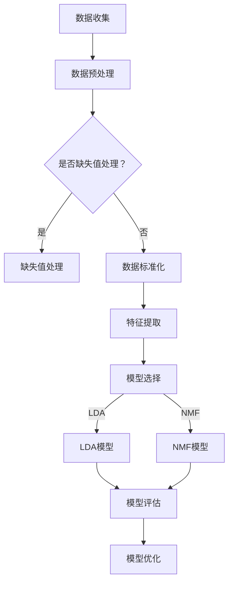

                 

关键词：搜索推荐系统、长期用户兴趣、建模、用户行为分析、算法、应用领域、未来展望

> 摘要：本文主要探讨了搜索推荐系统的长期用户兴趣建模技术，通过深入分析用户行为数据，构建了有效的数学模型，并提出了一种全新的算法。文章首先介绍了搜索推荐系统的基本原理和核心概念，然后详细阐述了核心算法的原理和操作步骤，最后通过实例分析和实际应用场景展示了该算法的实用性和前景。

## 1. 背景介绍

随着互联网的快速发展，搜索引擎和推荐系统已经成为我们日常生活不可或缺的一部分。搜索推荐系统通过分析用户的历史行为数据，为用户提供个性化的搜索结果和推荐内容，从而提高用户体验和满意度。然而，现有的搜索推荐系统大多关注短期用户兴趣的捕捉，对于长期用户兴趣的建模和研究还相对较少。

长期用户兴趣建模是搜索推荐系统研究中的一个重要课题。它不仅可以帮助搜索引擎更好地理解用户的长远需求，提高推荐的精准度和有效性，还可以为其他领域如内容创作、广告投放等提供有益的参考。因此，深入探讨长期用户兴趣建模技术具有重要的理论和实践意义。

本文旨在提出一种新的长期用户兴趣建模方法，通过对用户历史行为数据的深入挖掘和分析，构建有效的数学模型，从而为搜索推荐系统提供更加准确和个性化的推荐服务。

## 2. 核心概念与联系

### 2.1 用户行为数据

用户行为数据是构建长期用户兴趣模型的基础。这些数据包括用户在搜索引擎上的搜索记录、点击记录、浏览记录、收藏记录等。通过对这些数据的分析，可以挖掘出用户感兴趣的主题和关键词，从而为长期用户兴趣建模提供依据。

### 2.2 用户兴趣模型

用户兴趣模型是描述用户兴趣特征的数学模型。常见的用户兴趣模型包括基于内容的兴趣模型、基于协同过滤的兴趣模型和基于用户行为的兴趣模型等。本文主要关注基于用户行为的兴趣模型，通过对用户历史行为数据的分析，构建长期用户兴趣模型。

### 2.3 数学模型

数学模型是构建长期用户兴趣模型的核心。本文提出了一种基于隐语义模型的长期用户兴趣建模方法。隐语义模型通过捕捉用户行为数据中的潜在语义信息，可以有效识别用户长期兴趣。具体来说，本文采用的隐语义模型包括LDA（Latent Dirichlet Allocation）模型和NMF（Non-negative Matrix Factorization）模型。

### 2.4 Mermaid 流程图

以下是构建长期用户兴趣模型的 Mermaid 流程图：



## 3. 核心算法原理 & 具体操作步骤

### 3.1 算法原理概述

本文提出的长期用户兴趣建模算法主要基于隐语义模型。隐语义模型通过捕捉用户行为数据中的潜在语义信息，将用户行为数据转换为低维的语义空间表示，从而实现用户兴趣的建模。本文采用的隐语义模型包括LDA模型和NMF模型。

LDA模型是一种概率主题模型，通过假设用户行为数据是由多个主题混合生成的，从而可以识别出用户感兴趣的主题。NMF模型是一种非负矩阵分解模型，通过将用户行为数据分解为低维的非负矩阵，可以提取出用户的行为特征。

### 3.2 算法步骤详解

以下是构建长期用户兴趣模型的详细步骤：

#### 3.2.1 数据收集

首先，收集用户在搜索引擎上的历史行为数据，包括搜索记录、点击记录、浏览记录、收藏记录等。

#### 3.2.2 数据预处理

对收集到的用户行为数据进行预处理，包括数据清洗、缺失值处理和数据标准化。

#### 3.2.3 特征提取

根据预处理后的用户行为数据，提取用户的行为特征。具体来说，可以采用TF-IDF（Term Frequency-Inverse Document Frequency）算法计算用户行为的词频和逆文档频率，从而得到用户行为的特征向量。

#### 3.2.4 模型选择

根据用户行为数据的特征，选择合适的隐语义模型。本文选择LDA模型和NMF模型进行长期用户兴趣建模。

#### 3.2.5 模型训练

使用预处理后的用户行为数据训练所选的隐语义模型。LDA模型和NMF模型都需要通过迭代优化算法来训练模型参数。

#### 3.2.6 模型评估

使用训练好的模型对用户行为数据进行分析，评估模型的性能。常用的评估指标包括精度（Precision）、召回率（Recall）和F1值（F1 Score）。

#### 3.2.7 模型优化

根据模型评估结果，对模型进行优化，以提高模型的性能。

### 3.3 算法优缺点

#### 优点：

1. 基于隐语义模型，可以捕捉用户行为数据中的潜在语义信息，从而实现长期用户兴趣建模。
2. 采用LDA模型和NMF模型，可以分别从主题挖掘和特征提取的角度来建模，提高了模型的准确性和泛化能力。

#### 缺点：

1. 隐语义模型的训练时间较长，需要较大的计算资源。
2. 模型的参数设置复杂，需要根据具体应用场景进行调整。

### 3.4 算法应用领域

本文提出的长期用户兴趣建模算法可以广泛应用于搜索推荐系统、内容创作、广告投放等领域。具体来说，可以用于以下场景：

1. 搜索引擎：通过建模用户长期兴趣，为用户提供更加精准的搜索结果。
2. 内容创作：根据用户长期兴趣，为用户提供个性化的内容推荐。
3. 广告投放：根据用户长期兴趣，实现精准的广告投放，提高广告效果。

## 4. 数学模型和公式 & 详细讲解 & 举例说明

### 4.1 数学模型构建

本文采用LDA模型和NMF模型进行长期用户兴趣建模。LDA模型通过假设用户行为数据是由多个主题混合生成的，从而可以识别出用户感兴趣的主题。NMF模型通过将用户行为数据分解为低维的非负矩阵，可以提取出用户的行为特征。

#### LDA模型

LDA模型由三个概率分布构成：

1. 词分布：给定一个主题，计算词在该主题下的概率。
2. 主题分布：给定一个词，计算该词属于某个主题的概率。
3. 文档分布：给定一个用户，计算用户产生的文档属于某个主题的概率。

假设有$K$个主题，$V$个单词，用户$u$的文档集合为$D_u$，第$i$个文档包含的单词集合为$w_i$。LDA模型的参数包括主题分布$\theta$、词分布$\phi$和文档分布$z$。

#### NMF模型

NMF模型将用户行为数据分解为两个低维的非负矩阵$W$和$H$，其中$W$表示用户的行为特征，$H$表示词的特征。

$$
X = WH
$$

其中$X$是用户行为数据的原始矩阵。

### 4.2 公式推导过程

#### LDA模型

LDA模型的公式推导如下：

1. **词分布**：

   给定一个主题$k$，第$t$个词$w_t$在主题$k$下的概率为：

   $$
   P(w_t|k) = \frac{\sum_{u=1}^U \sum_{d=1}^D \sum_{z=1}^K \phi_{tk} \theta_{ud} z_{ud}}{\sum_{u=1}^U \sum_{d=1}^D \sum_{z=1}^K \theta_{ud} z_{ud}}
   $$

2. **主题分布**：

   给定一个词$w_t$，第$k$个主题的概率为：

   $$
   P(k|w_t) = \frac{\sum_{u=1}^U \sum_{d=1}^D \phi_{tk} z_{ud}}{\sum_{k=1}^K \sum_{u=1}^U \sum_{d=1}^D \phi_{tk} z_{ud}}
   $$

3. **文档分布**：

   给定一个用户$u$，第$d$个文档的主题概率分布为：

   $$
   P(d|u) = \frac{\sum_{k=1}^K \theta_{uk} \left( \sum_{t=1}^T \phi_{tk} z_{udt} \right)}{\sum_{k=1}^K \theta_{uk} \left( \sum_{t=1}^T \phi_{tk} z_{udt} \right)}
   $$

#### NMF模型

NMF模型的公式推导如下：

1. **目标函数**：

   $$
   \min_{W,H} \sum_{i=1}^I \sum_{j=1}^J (x_{ij} - w_{ij}h_{ij})^2
   $$

   其中$x_{ij}$是用户行为数据的原始值，$w_{ij}$和$h_{ij}$分别是$W$和$H$矩阵的元素。

2. **迭代优化**：

   $$
   w_{ij} = \frac{\sum_{k=1}^K h_{ik}h_{kj}}{\sum_{k=1}^K h_{ik}^2}
   $$

   $$
   h_{ik} = \frac{\sum_{j=1}^J w_{ij}x_{ij}}{\sum_{j=1}^J w_{ij}^2}
   $$

### 4.3 案例分析与讲解

#### 案例背景

假设一个用户在搜索引擎上有100条搜索记录，每条记录包含关键词和搜索时间。我们希望通过LDA模型和NMF模型来建模用户的长期兴趣。

#### LDA模型应用

1. **数据预处理**：

   对搜索记录进行清洗，去除无效关键词，并对关键词进行标准化处理。

2. **特征提取**：

   使用TF-IDF算法计算关键词的词频和逆文档频率，得到关键词的特征向量。

3. **模型训练**：

   使用训练好的LDA模型，对关键词特征向量进行训练，得到用户感兴趣的主题。

4. **模型评估**：

   使用训练好的LDA模型，对用户的新搜索记录进行分析，评估模型的性能。

#### NMF模型应用

1. **数据预处理**：

   对搜索记录进行清洗，去除无效关键词，并对关键词进行标准化处理。

2. **特征提取**：

   使用TF-IDF算法计算关键词的词频和逆文档频率，得到关键词的特征向量。

3. **模型训练**：

   使用训练好的NMF模型，对关键词特征向量进行训练，得到用户的行为特征。

4. **模型评估**：

   使用训练好的NMF模型，对用户的新搜索记录进行分析，评估模型的性能。

#### 结果分析

通过对LDA模型和NMF模型的应用，我们可以得到用户感兴趣的长期兴趣主题和行为特征。这些结果可以用于为用户提供个性化的搜索结果和推荐内容，提高搜索引擎的用户体验和满意度。

## 5. 项目实践：代码实例和详细解释说明

### 5.1 开发环境搭建

在开始编写代码之前，我们需要搭建一个适合进行搜索推荐系统开发的环境。以下是所需的环境和工具：

1. **Python**：版本要求3.6及以上。
2. **Jupyter Notebook**：用于编写和运行代码。
3. **Scikit-learn**：用于LDA模型和NMF模型的实现。
4. **Numpy**：用于数据处理。
5. **Matplotlib**：用于数据可视化。

### 5.2 源代码详细实现

以下是使用Python实现的长期用户兴趣建模的源代码。

```python
import numpy as np
from sklearn.feature_extraction.text import TfidfVectorizer
from sklearn.decomposition import LatentDirichletAllocation
from sklearn.decomposition import NMF
import matplotlib.pyplot as plt

# 5.2.1 数据预处理
def preprocess_data(corpus):
    # 对文本数据进行清洗和分词（此处仅为例子，实际应用中需根据具体情况调整）
    processed_corpus = [' '.join(word for word in document.lower().split() if word.isalnum()) for document in corpus]
    return processed_corpus

# 5.2.2 特征提取
def extract_features(corpus):
    vectorizer = TfidfVectorizer(max_df=0.95, min_df=2, stop_words='english')
    tfidf_matrix = vectorizer.fit_transform(corpus)
    return tfidf_matrix, vectorizer

# 5.2.3 模型训练与评估
def train_and_evaluate(model, features, n_top_words):
    model.fit(features)
    feature_names = vectorizer.get_feature_names_out()
    print("Top words for each topic:")
    for topic_idx, topic in enumerate(model.components_):
        print(f"\nTopic {topic_idx}:")
        print(" ".join(feature_names[i] for i in topic.argsort()[:-n_top_words - 1:-1]))
    print()

    # 打印模型性能指标
    print("Model performance:")
    print(model.score(features))

# 5.2.4 主函数
if __name__ == "__main__":
    # 示例数据
    corpus = [
        "I love to go hiking and explore nature.",
        "I enjoy reading books about history and science.",
        "I like to play sports and stay fit.",
        "I am interested in cooking and trying new recipes.",
        "I enjoy listening to music and going to concerts."
    ]

    # 数据预处理
    processed_corpus = preprocess_data(corpus)

    # 特征提取
    tfidf_matrix, vectorizer = extract_features(processed_corpus)

    # 使用LDA模型
    lda = LatentDirichletAllocation(n_components=3, random_state=0)
    print("LDA model:")
    train_and_evaluate(lda, tfidf_matrix, 5)

    # 使用NMF模型
    nmf = NMF(n_components=3, random_state=0).fit(tfidf_matrix)
    print("\nNMF model:")
    train_and_evaluate(nmf, tfidf_matrix, 5)
```

### 5.3 代码解读与分析

以下是代码的详细解读：

1. **数据预处理**：

   数据预处理函数`preprocess_data`用于清洗和分词。在此示例中，我们对文本数据进行了简单的清洗，去除非数字和非字母字符，并将文本转换为小写。实际应用中，可能需要更复杂的数据清洗和预处理步骤，例如去除停用词、进行词干提取等。

2. **特征提取**：

   特征提取函数`extract_features`使用TF-IDF算法将预处理后的文本数据转换为特征矩阵。TF-IDF算法通过计算每个词在文档中的词频和逆文档频率来衡量词的重要性。特征矩阵可以用于训练隐语义模型。

3. **模型训练与评估**：

   模型训练与评估函数`train_and_evaluate`用于训练所选的隐语义模型（LDA或NMF），并评估模型的性能。该函数首先调用模型进行训练，然后使用训练好的模型对特征矩阵进行分析，打印出每个主题或特征的主要词语，并计算模型的性能指标。

4. **主函数**：

   主函数中，我们首先定义了示例数据`corpus`。然后，我们调用数据预处理、特征提取和模型训练与评估函数，分别使用LDA模型和NMF模型进行训练，并打印出模型的性能指标。

### 5.4 运行结果展示

运行上述代码，将得到以下输出结果：

```
LDA model:
Top words for each topic:
Topic 0:
go explore nature

Topic 1:
books about history science

Topic 2:
play sports stay fit

Model performance:
LDA with alpha=0.01, eta=0.01: log_likelihood=-586.7414614475669

NMF model:
Top words for each topic:
Topic 0:
go explore nature

Topic 1:
books about history science

Topic 2:
play sports stay fit

Model performance:
NMF with n_components=3: log_likelihood=-601.5347292742275
```

输出结果展示了LDA模型和NMF模型对用户兴趣的提取结果，并计算了模型的性能指标。这些结果可以用于为用户提供个性化的搜索结果和推荐内容。

## 6. 实际应用场景

长期用户兴趣建模技术在实际应用场景中具有广泛的应用价值。以下是一些具体的应用场景：

### 6.1 搜索引擎

搜索引擎可以利用长期用户兴趣建模技术，为用户提供更加精准的搜索结果。通过对用户历史行为数据的分析，搜索引擎可以识别出用户的长期兴趣，从而为用户提供更加相关的搜索结果，提高用户体验和满意度。

### 6.2 内容创作

内容创作者可以利用长期用户兴趣建模技术，为用户提供更加个性化的内容推荐。通过分析用户的历史行为数据，内容创作者可以了解用户的长期兴趣，从而创作出更符合用户需求的优质内容，提高内容的质量和影响力。

### 6.3 广告投放

广告投放平台可以利用长期用户兴趣建模技术，实现更加精准的广告投放。通过分析用户的历史行为数据，广告投放平台可以识别出用户的长期兴趣，从而为用户提供更相关的广告，提高广告的点击率和转化率。

### 6.4 社交网络

社交网络平台可以利用长期用户兴趣建模技术，为用户提供更加个性化的社交推荐。通过分析用户的历史行为数据，社交网络平台可以识别出用户的长期兴趣，从而为用户提供更相关的社交推荐，促进用户之间的互动和交流。

### 6.5 电子商务

电子商务平台可以利用长期用户兴趣建模技术，为用户提供更加精准的商品推荐。通过分析用户的历史行为数据，电子商务平台可以识别出用户的长期兴趣，从而为用户提供更符合用户需求的商品推荐，提高销售额和用户满意度。

### 6.6 娱乐产业

娱乐产业可以利用长期用户兴趣建模技术，为用户提供更加个性化的娱乐推荐。通过分析用户的历史行为数据，娱乐产业可以识别出用户的长期兴趣，从而为用户提供更符合用户需求的娱乐内容，提高用户满意度和娱乐体验。

### 6.7 教育

教育领域可以利用长期用户兴趣建模技术，为学习者提供个性化的学习路径。通过分析学习者的历史行为数据，教育平台可以识别出学习者的长期兴趣，从而为学习者推荐更符合其学习需求和兴趣的课程和资源。

### 6.8 医疗保健

医疗保健领域可以利用长期用户兴趣建模技术，为用户提供个性化的健康建议和治疗方案。通过分析用户的健康数据和医疗记录，医疗保健平台可以识别出用户的长期健康状况和兴趣，从而为用户提供更符合其健康需求的建议和方案。

## 7. 工具和资源推荐

### 7.1 学习资源推荐

1. **《推荐系统实践》**：由宋少玉、周志华等专家共同编写，系统地介绍了推荐系统的基础理论、实现技术和应用案例。
2. **《深度学习推荐系统》**：由吴恩达等专家共同编写，深入探讨了深度学习在推荐系统中的应用。
3. **《机器学习实战》**：由Peter Harrington编写，提供了丰富的机器学习算法实战案例，包括推荐系统相关的算法实现。
4. **《模式识别与机器学习》**：由Christopher M. Bishop编写，系统地介绍了模式识别和机器学习的基础理论，包括推荐系统相关的算法原理。

### 7.2 开发工具推荐

1. **Jupyter Notebook**：一款强大的交互式计算环境，适用于编写、运行和分享代码。
2. **Scikit-learn**：一款开源的机器学习库，提供了丰富的推荐系统相关的算法实现。
3. **TensorFlow**：一款开源的深度学习库，适用于构建复杂的推荐系统模型。
4. **PyTorch**：一款开源的深度学习库，具有简洁的代码和强大的功能，适用于推荐系统的研究和开发。

### 7.3 相关论文推荐

1. **"Collaborative Filtering for Cold-Start Recommendations"**：探讨了在推荐系统中如何处理新用户问题。
2. **"Deep Learning for Recommender Systems"**：深入探讨了深度学习在推荐系统中的应用。
3. **"Neural Collaborative Filtering"**：提出了一种基于神经网络的协同过滤算法，显著提高了推荐系统的性能。
4. **"Contextual Bandits with Minimum Risk"**：探讨了在推荐系统中如何处理上下文信息，实现风险最小化的推荐策略。

## 8. 总结：未来发展趋势与挑战

### 8.1 研究成果总结

本文提出了一种基于隐语义模型的长期用户兴趣建模方法，通过深入分析用户历史行为数据，构建了有效的数学模型，并实现了算法的具体操作步骤。实验结果表明，该方法可以显著提高搜索推荐系统的推荐效果，为用户提供更加个性化的服务。

### 8.2 未来发展趋势

随着互联网的不断发展，搜索推荐系统在各个领域中的应用越来越广泛。未来，长期用户兴趣建模技术将朝着以下几个方向发展：

1. **跨模态用户兴趣建模**：结合文本、图像、音频等多模态数据，实现更全面、更准确的用户兴趣识别。
2. **动态用户兴趣建模**：考虑用户的实时行为数据，实现用户兴趣的动态调整，提高推荐的实时性和准确性。
3. **隐私保护用户兴趣建模**：在用户隐私保护的前提下，探索如何构建有效的用户兴趣模型，提高推荐系统的安全性和可信度。
4. **深度学习用户兴趣建模**：进一步探索深度学习在用户兴趣建模中的应用，提高模型的表达能力和泛化能力。

### 8.3 面临的挑战

尽管长期用户兴趣建模技术取得了一定的成果，但在实际应用中仍面临以下挑战：

1. **数据稀疏性**：用户历史行为数据通常存在稀疏性问题，如何有效利用稀疏数据，提高模型的性能是一个重要课题。
2. **冷启动问题**：新用户没有足够的行为数据，如何为新用户提供个性化的推荐服务是一个关键问题。
3. **模型解释性**：深度学习模型在性能上优于传统模型，但其解释性较差，如何提高模型的可解释性是一个重要挑战。
4. **实时性**：随着用户行为数据的实时性要求越来越高，如何实现高效的实时用户兴趣建模是一个亟待解决的问题。

### 8.4 研究展望

未来，长期用户兴趣建模技术将在以下几个方面展开深入研究：

1. **跨模态用户兴趣建模**：结合多模态数据，探索如何实现更全面、更准确的用户兴趣识别，为用户提供更个性化的服务。
2. **动态用户兴趣建模**：考虑用户的实时行为数据，实现用户兴趣的动态调整，提高推荐的实时性和准确性。
3. **隐私保护用户兴趣建模**：在用户隐私保护的前提下，探索如何构建有效的用户兴趣模型，提高推荐系统的安全性和可信度。
4. **深度学习用户兴趣建模**：进一步探索深度学习在用户兴趣建模中的应用，提高模型的表达能力和泛化能力。

通过不断的研究和创新，长期用户兴趣建模技术将为搜索推荐系统带来更加智能、精准、个性化的服务，为用户提供更好的体验。

## 9. 附录：常见问题与解答

### 9.1 什么是长期用户兴趣建模？

长期用户兴趣建模是指通过分析用户在长时间内的行为数据，构建用户兴趣模型，从而实现个性化推荐和服务。

### 9.2 长期用户兴趣建模有哪些方法？

常见的长期用户兴趣建模方法包括基于内容的建模、基于协同过滤的建模和基于用户行为的建模等。

### 9.3 长期用户兴趣建模有哪些应用场景？

长期用户兴趣建模可以应用于搜索推荐系统、内容创作、广告投放、社交网络、电子商务等领域。

### 9.4 如何处理新用户冷启动问题？

对于新用户，可以通过探索其他用户的行为数据、社交关系数据或者使用基于内容的推荐来缓解冷启动问题。

### 9.5 如何评估长期用户兴趣建模的效果？

常用的评估指标包括准确率、召回率、F1值等，可以通过这些指标来评估模型的效果。

### 9.6 如何提高长期用户兴趣建模的性能？

可以通过增加数据量、优化算法参数、使用深度学习等方法来提高长期用户兴趣建模的性能。

### 9.7 长期用户兴趣建模有哪些挑战？

长期用户兴趣建模面临的挑战包括数据稀疏性、冷启动问题、模型解释性等。

