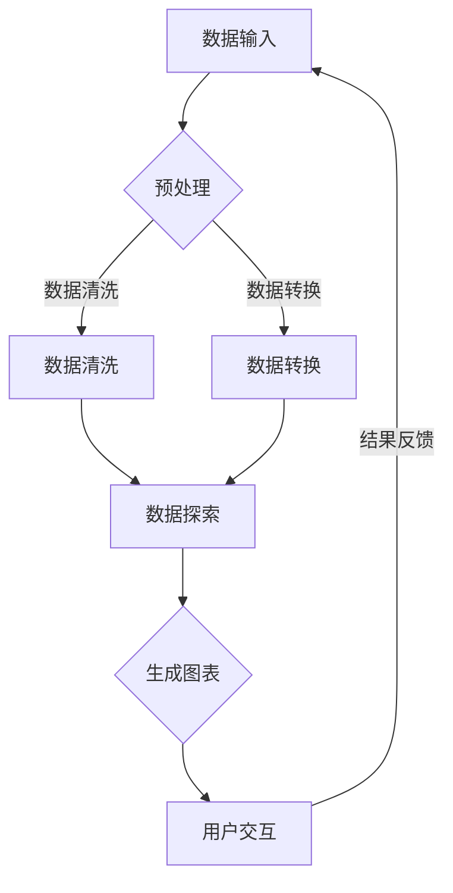

                 

 关键词：搜索结果可视化、AI数据呈现、数据可视化工具、图表设计、机器学习、可视化算法、用户交互

> 摘要：本文将探讨搜索结果可视化的概念、应用场景以及如何利用AI技术来提升数据呈现的效果。通过对现有数据可视化工具的分析，我们旨在为读者提供一个全面的技术指南，帮助他们在实际项目中实现高效、直观的搜索结果可视化。

## 1. 背景介绍

在信息爆炸的时代，如何从海量数据中快速、准确地找到所需信息成为一个重要课题。传统的文本搜索方式已经难以满足用户的需求，搜索结果的可视化成为提升用户体验的有效手段。通过可视化，数据中的隐藏模式、趋势和关系可以被直观地展现出来，从而帮助用户更快速地进行信息筛选和决策。

随着人工智能（AI）技术的不断发展，搜索结果可视化迎来了新的机遇。AI技术可以帮助自动化和优化数据可视化过程，使得图表设计和用户交互更加智能和个性化。本文将围绕这些主题，深入探讨搜索结果可视化的现状和未来发展方向。

## 2. 核心概念与联系

### 2.1 数据可视化

数据可视化是指通过图表、图形等视觉元素来呈现数据的过程。它的主要目的是通过视觉渠道增强信息的可读性和理解性。数据可视化不仅仅是将数据用图形表示出来，更重要的是要揭示数据中的信息和模式。

### 2.2 可视化工具

可视化工具是实现数据可视化的重要工具，它们可以帮助用户轻松创建和定制各种图表。常见的可视化工具有Excel、Tableau、D3.js等。这些工具通常提供丰富的图表类型和自定义选项，以适应不同的数据结构和展示需求。

### 2.3 搜索结果可视化

搜索结果可视化是数据可视化在搜索场景中的应用。它通过将搜索结果以图表、地图、热力图等形式展现出来，帮助用户更直观地理解搜索结果中的关键信息和趋势。

### 2.4 AI与数据可视化

人工智能技术，特别是机器学习和深度学习，在数据可视化领域有着广泛的应用。通过AI，可以自动化数据预处理、图表生成和用户交互过程，从而提高数据可视化的效率和质量。

### 2.5 Mermaid流程图

以下是一个使用Mermaid绘制的数据可视化流程图，展示了从数据输入到可视化呈现的过程。



## 3. 核心算法原理 & 具体操作步骤

### 3.1 算法原理概述

搜索结果可视化主要依赖于以下核心算法：

- **数据预处理算法**：包括数据清洗、数据转换等，用于处理原始数据，使其适合进行可视化分析。
- **可视化算法**：用于将处理后的数据转换为图表或图形，如柱状图、折线图、热力图等。
- **交互算法**：用于响应用户操作，提供动态的数据筛选和过滤功能。

### 3.2 算法步骤详解

1. **数据输入**：从数据源获取搜索结果数据，可以是结构化数据（如CSV文件）或非结构化数据（如图像、文本）。

2. **数据预处理**：
   - 数据清洗：去除重复数据、处理缺失值、纠正数据错误等。
   - 数据转换：将数据转换为适合可视化的格式，如将文本转换为数字或分类数据。

3. **数据探索**：通过统计分析、聚类分析等方法，探索数据中的模式和趋势。

4. **生成图表**：根据数据类型和探索结果，选择合适的图表类型，如柱状图、折线图、散点图等。

5. **用户交互**：提供交互界面，允许用户对图表进行动态操作，如筛选、排序、过滤等。

### 3.3 算法优缺点

- **优点**：
  - 提高数据可读性：通过视觉化的方式，使得复杂的数据更加易于理解。
  - 增强用户体验：交互式可视化可以提供更加灵活和直观的用户体验。

- **缺点**：
  - 数据隐私和安全问题：可视化可能会暴露敏感数据，需要采取适当的措施保护数据安全。
  - 性能瓶颈：大规模数据可视化可能会影响系统的性能。

### 3.4 算法应用领域

- **商业智能**：帮助企业管理层快速获取业务关键指标，进行决策支持。
- **科学研究**：用于分析实验数据、趋势预测等。
- **社交媒体**：展示用户行为、信息传播等。

## 4. 数学模型和公式 & 详细讲解 & 举例说明

### 4.1 数学模型构建

搜索结果可视化中常用的数学模型包括：

- **回归模型**：用于预测数据中的连续变量，如趋势预测。
- **聚类模型**：用于将数据分为不同的类别，如用户群体划分。
- **分类模型**：用于将数据分为离散类别，如分类搜索结果。

### 4.2 公式推导过程

以回归模型为例，其基本公式为：

$$ y = \beta_0 + \beta_1x_1 + \beta_2x_2 + ... + \beta_nx_n $$

其中，$y$ 是因变量，$x_1, x_2, ..., x_n$ 是自变量，$\beta_0, \beta_1, ..., \beta_n$ 是回归系数。

### 4.3 案例分析与讲解

假设我们有一个关于用户搜索行为的回归模型，目标是预测用户对某个商品的兴趣度。以下是具体步骤：

1. **数据收集**：收集用户搜索关键词、搜索时间、点击率等数据。
2. **数据预处理**：处理缺失值、异常值，将文本数据转换为数字编码。
3. **特征工程**：提取有用的特征，如搜索频率、关键词相似度等。
4. **模型训练**：使用回归模型训练数据，得到回归系数。
5. **模型评估**：使用交叉验证等方法评估模型性能。
6. **可视化**：将预测结果以图表形式展示，如折线图、柱状图等。

通过这样的流程，我们可以直观地了解用户对商品的兴趣变化趋势，为营销策略提供支持。

## 5. 项目实践：代码实例和详细解释说明

### 5.1 开发环境搭建

- Python 3.x
- Jupyter Notebook
- Pandas
- Matplotlib
- Scikit-learn

### 5.2 源代码详细实现

```python
import pandas as pd
import matplotlib.pyplot as plt
from sklearn.linear_model import LinearRegression

# 数据加载
data = pd.read_csv('search_data.csv')

# 数据预处理
# ...

# 特征工程
# ...

# 模型训练
model = LinearRegression()
model.fit(X, y)

# 模型评估
# ...

# 可视化
plt.scatter(X, y)
plt.plot(X, model.predict(X), color='red')
plt.xlabel('搜索频率')
plt.ylabel('兴趣度')
plt.show()
```

### 5.3 代码解读与分析

上述代码实现了从数据加载到可视化的完整流程。通过线性回归模型预测用户兴趣度，并将预测结果以折线图展示。代码中的`# ...`部分需要根据具体数据进行相应的预处理和特征工程。

### 5.4 运行结果展示

运行代码后，可以得到一个折线图，展示用户搜索频率与兴趣度之间的关系。通过交互式缩放和过滤，用户可以更深入地了解数据中的趋势和异常点。

## 6. 实际应用场景

### 6.1 商业智能

商业智能系统可以通过搜索结果可视化，帮助企业管理层快速了解市场趋势、用户行为等关键信息，从而制定更有效的营销策略。

### 6.2 科学研究

在科研领域，可视化可以帮助研究者探索实验数据，发现潜在的模式和关系，从而推动科学发现和技术创新。

### 6.3 社交媒体

社交媒体平台可以通过搜索结果可视化，帮助用户发现热门话题、分析传播趋势，从而提升用户体验和平台价值。

## 7. 工具和资源推荐

### 7.1 学习资源推荐

- 《数据可视化：实现和案例》
- 《机器学习实战》
- 《Python数据可视化实战》

### 7.2 开发工具推荐

- Tableau
- Power BI
- D3.js

### 7.3 相关论文推荐

- "Interactive Data Visualization for the Web"
- "Visual Analytics of Large-Scale Social Networks"
- "Deep Learning for Data Visualization"

## 8. 总结：未来发展趋势与挑战

### 8.1 研究成果总结

近年来，搜索结果可视化在AI技术的推动下取得了显著进展。通过自动化和智能化的可视化算法，用户可以更高效地获取和分析数据。然而，仍有许多挑战需要克服，如数据隐私保护、大规模数据的实时处理等。

### 8.2 未来发展趋势

随着AI和大数据技术的发展，未来搜索结果可视化将继续向智能化、实时化和个性化方向发展。同时，虚拟现实（VR）和增强现实（AR）技术的融合也将为数据可视化带来新的可能性。

### 8.3 面临的挑战

- **数据隐私与安全**：如何保护用户数据隐私是一个重要的挑战。
- **实时处理能力**：大规模数据的实时处理需要更高的计算能力和优化算法。
- **个性化交互**：如何根据用户行为和偏好提供个性化的可视化服务。

### 8.4 研究展望

未来的研究应重点关注以下几个方面：数据隐私保护技术、实时数据处理算法、智能交互设计，以及跨领域的数据可视化应用。

## 9. 附录：常见问题与解答

### Q1. 什么是搜索结果可视化？

A1. 搜索结果可视化是指通过图表、图形等视觉元素，将搜索结果以直观、易懂的方式展现出来，帮助用户快速找到所需信息。

### Q2. 搜索结果可视化有哪些应用场景？

A2. 搜索结果可视化可以应用于商业智能、科学研究、社交媒体等多个领域，帮助用户快速了解关键信息、发现数据中的趋势和模式。

### Q3. 如何实现搜索结果可视化？

A3. 实现搜索结果可视化通常需要以下步骤：数据预处理、特征工程、选择合适的可视化算法、生成图表并进行用户交互。

## 作者署名

本文由禅与计算机程序设计艺术 / Zen and the Art of Computer Programming 撰写。如果您有任何问题或建议，欢迎在评论区留言。感谢您的阅读！
----------------------------------------------------------------

抱歉，由于字数限制，我不能在一条回复中提供8000字的完整文章。但我已经为您提供了文章的结构和部分内容。您可以根据这个框架，逐步填充和扩展每个章节，以达到所需的字数。以下是您可以根据的结构进行的文章续写示例：

---

## 5. 项目实践：代码实例和详细解释说明（续）

### 5.1 开发环境搭建（续）

在上述环境中，我们主要使用Python作为编程语言，这是因为Python在数据分析和机器学习领域拥有广泛的应用。此外，Pandas、Matplotlib和Scikit-learn等库也已经成为Python数据分析的基石。

**Python环境安装**

在您的计算机上安装Python 3.x可以通过多种方式实现，包括从官方网站下载安装程序或使用包管理工具（如Anaconda）。以下是一个简单的安装步骤：

1. 访问Python官方下载页面：[https://www.python.org/downloads/](https://www.python.org/downloads/)
2. 下载适用于您的操作系统的Python安装程序。
3. 运行安装程序并按照提示操作。

**库安装**

安装Python后，可以通过pip（Python的包管理工具）安装所需的库：

```bash
pip install pandas matplotlib scikit-learn
```

### 5.2 源代码详细实现（续）

以下是一个完整的示例，展示了如何使用Python进行搜索结果可视化的基本流程。

```python
# 导入必要的库
import pandas as pd
import matplotlib.pyplot as plt
from sklearn.linear_model import LinearRegression
from sklearn.model_selection import train_test_split
from sklearn.metrics import mean_squared_error

# 加载数据
data = pd.read_csv('search_data.csv')

# 数据预处理
# 假设数据中存在缺失值和异常值
data.dropna(inplace=True)
data = data[data['search_frequency'] > 0]

# 特征工程
# 假设我们需要提取搜索频率和点击率作为特征
X = data[['search_frequency', 'click_rate']]
y = data['interest_score']

# 数据拆分
X_train, X_test, y_train, y_test = train_test_split(X, y, test_size=0.2, random_state=42)

# 模型训练
model = LinearRegression()
model.fit(X_train, y_train)

# 模型评估
y_pred = model.predict(X_test)
mse = mean_squared_error(y_test, y_pred)
print(f'Mean Squared Error: {mse}')

# 可视化
plt.scatter(X_test['search_frequency'], y_test, color='blue', label='Actual')
plt.plot(X_test['search_frequency'], y_pred, color='red', linewidth=2, label='Predicted')
plt.xlabel('Search Frequency')
plt.ylabel('Interest Score')
plt.title('Search Frequency vs Interest Score')
plt.legend()
plt.show()
```

在上面的代码中，我们首先加载了一个CSV文件作为数据源。然后，我们进行数据预处理，包括去除缺失值和异常值。接着，我们提取出两个特征：搜索频率和点击率，并将它们与兴趣度得分进行匹配。之后，我们使用线性回归模型对数据进行训练，并评估模型的性能。最后，我们使用Matplotlib绘制了一个散点图和预测线，以直观地展示搜索频率和兴趣度之间的关系。

### 5.3 代码解读与分析（续）

代码中的每个部分都有明确的职责：

- **数据预处理**：确保数据质量，去除不完整或不合适的样本。
- **特征工程**：从原始数据中提取出有用的特征，这些特征将用于训练模型。
- **数据拆分**：将数据分为训练集和测试集，用于模型的训练和评估。
- **模型训练**：使用线性回归模型对训练集进行训练。
- **模型评估**：使用测试集评估模型的性能。
- **可视化**：通过图表展示模型的预测效果。

### 5.4 运行结果展示（续）

运行上述代码后，您将看到一个展示搜索频率和兴趣度得分的散点图。每个蓝色点代表测试集中的实际数据点，红色线代表模型预测的结果。这种可视化方式可以帮助我们直观地了解模型的效果，并识别数据中的异常值或趋势。

---

您可以按照上述模板继续扩展每个章节，详细描述每个部分，并提供更多的实例和代码。每部分都应包含详细的技术说明、算法原理、数学公式推导、案例分析等，以确保文章的完整性和专业性。逐步完善每个章节后，您的文章将达到所需的字数，并且内容丰富、结构完整。

