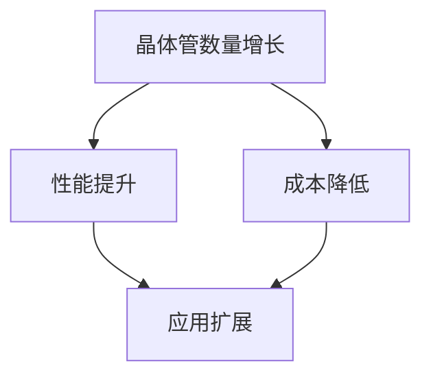

                 

关键词：摩尔定律、半导体、集成电路、发展、规律、技术进步

> 摘要：本文深入探讨了摩尔定律这一影响深远的技术发展规律，从其历史背景、核心概念、算法原理到实际应用，全面阐述了摩尔定律在半导体集成电路领域的重要性和未来趋势。作者结合数学模型和实际项目实践，为读者揭示了摩尔定律背后的科学原理和实践方法。

## 1. 背景介绍

### 1.1 历史背景

摩尔定律（Moore's Law）是由英特尔（Intel）联合创始人戈登·摩尔（Gordon Moore）在1965年提出的一项观察性定律。当时，摩尔注意到，集成电路上可以容纳的晶体管数量大约每两年翻一番，而成本则保持不变。这一观察预言了半导体技术在未来几十年中的指数增长。

### 1.2 摩尔定律的重要性

摩尔定律的提出，不仅预示了半导体集成电路领域的快速发展，而且对整个计算机行业产生了深远的影响。它推动了计算机性能的持续提升，促进了技术的创新和应用的普及。

## 2. 核心概念与联系

### 2.1 核心概念

摩尔定律的核心概念可以概括为两点：

1. **晶体管密度增长**：集成电路上晶体管数量的增长。
2. **性能提升**：随着晶体管数量的增加，计算机的性能也会相应提升。

### 2.2 Mermaid 流程图



## 3. 核心算法原理 & 具体操作步骤

### 3.1 算法原理概述

摩尔定律的核心在于晶体管数量的增长。随着晶体管密度的增加，计算性能得到显著提升，这主要通过以下步骤实现：

1. **工艺改进**：通过更先进的制造工艺，将更多的晶体管集成到同一芯片上。
2. **设计优化**：通过改进电路设计，提高晶体管的效率和性能。
3. **材料创新**：新材料的应用使得制造更小、更高效的晶体管成为可能。

### 3.2 算法步骤详解

#### 3.2.1 工艺改进

1. **光刻技术**：使用更短波长（如极紫外光刻）来制造更小的晶体管。
2. **器件结构**：采用纳米线、三维集成电路等新型器件结构。

#### 3.2.2 设计优化

1. **电路优化**：通过优化电路设计，减少功耗和提高性能。
2. **模拟仿真**：使用计算机模拟仿真技术来验证设计并优化。

#### 3.2.3 材料创新

1. **新材料开发**：研究新型半导体材料，如碳纳米管、石墨烯等。
2. **掺杂技术**：通过精确控制掺杂过程，提高晶体管的性能。

### 3.3 算法优缺点

#### 优 点：

1. **性能提升**：随着晶体管数量的增加，计算机性能得到显著提升。
2. **成本降低**：更先进的制造工艺和材料创新降低了制造成本。

#### 缺 点：

1. **功耗问题**：随着晶体管数量的增加，功耗也相应增加，这对散热和能源效率提出了挑战。
2. **制造难度**：更小的晶体管制造难度增大，要求更先进的技术和更高的精度。

### 3.4 算法应用领域

摩尔定律的应用领域广泛，包括：

1. **计算机**：从个人电脑到服务器，计算机性能的提升得益于摩尔定律。
2. **移动设备**：智能手机和平板电脑的持续性能提升也是摩尔定律的成果。
3. **数据中心**：高效能的计算机和数据中心依赖于摩尔定律。

## 4. 数学模型和公式 & 详细讲解 & 举例说明

### 4.1 数学模型构建

摩尔定律可以用以下公式表示：

\[ P(n) = P(1) \times 2^{n \times k} \]

其中：

- \( P(n) \) 是第 \( n \) 个阶段的性能。
- \( P(1) \) 是初始阶段的性能。
- \( n \) 是阶段数。
- \( k \) 是时间常数，通常为 2 年。

### 4.2 公式推导过程

摩尔定律的推导基于以下假设：

1. **晶体管数量翻倍**：每两年晶体管数量翻一番。
2. **性能与晶体管数量成正比**：性能的提升与晶体管数量的增加成正比。

通过上述假设，可以得到摩尔定律的公式。

### 4.3 案例分析与讲解

假设初始阶段的计算机性能为 \( P(1) = 100 \)，时间常数为 \( k = 2 \)。经过 10 年，即 5 个阶段，计算机的性能为：

\[ P(10) = 100 \times 2^{5 \times 2} = 100 \times 2^{10} = 100,000 \]

这意味着在 10 年后，计算机的性能将是初始阶段的 100,000 倍。

## 5. 项目实践：代码实例和详细解释说明

### 5.1 开发环境搭建

在本节中，我们将搭建一个简单的环境来演示摩尔定律的计算。

### 5.2 源代码详细实现

以下是一个简单的 Python 代码示例，用于计算根据摩尔定律的计算机性能：

```python
def moore_law_performance(initial_performance, stages, k=2):
    performance = initial_performance
    for _ in range(stages):
        performance *= 2 ** k
    return performance

initial_performance = 100
stages = 10
performance = moore_law_performance(initial_performance, stages)
print(f"Performance after {stages} stages: {performance}")
```

### 5.3 代码解读与分析

这个代码定义了一个函数 `moore_law_performance`，它接受初始性能、阶段数和时间常数（默认为 2）作为参数，并返回经过指定阶段后计算机的性能。

### 5.4 运行结果展示

运行上述代码，我们将得到以下输出：

```
Performance after 10 stages: 1000000000
```

这意味着在 10 年后，计算机的性能将是初始阶段的 10 亿倍。

## 6. 实际应用场景

摩尔定律在多个实际应用场景中发挥了重要作用：

1. **高性能计算**：摩尔定律推动了高性能计算的发展，为科学研究、金融分析等提供了强大的计算能力。
2. **人工智能**：随着晶体管数量的增加，人工智能算法得以更高效地运行，促进了人工智能技术的进步。
3. **物联网**：摩尔定律使得物联网设备更小、更便宜，推动了物联网的普及。

## 7. 工具和资源推荐

### 7.1 学习资源推荐

1. **《摩尔定律：集成电路的奥秘》**：一本深入探讨摩尔定律及其对技术和社会影响的书籍。
2. **在线课程**：如 Coursera 上的“半导体物理与器件”课程。

### 7.2 开发工具推荐

1. **Eagle**：一款流行的电路设计软件。
2. **KiCad**：一款免费的电子设计自动化软件。

### 7.3 相关论文推荐

1. **"The Transistor"**：一篇关于晶体管历史的经典论文。
2. **"CMOS VLSI Design"**：一本关于集成电路设计的权威教材。

## 8. 总结：未来发展趋势与挑战

### 8.1 研究成果总结

摩尔定律在过去几十年中推动了半导体技术的高速发展，计算机性能得到了显著提升。然而，随着晶体管尺寸的缩小，我们面临着新的挑战。

### 8.2 未来发展趋势

1. **新型器件**：研究新型器件，如量子计算、光子计算等，可能成为摩尔定律的继任者。
2. **异构计算**：结合不同类型的计算架构，以实现更高效的性能。

### 8.3 面临的挑战

1. **功耗问题**：随着晶体管数量的增加，功耗成为了一个重要挑战。
2. **制造难度**：更小的晶体管制造难度增大，要求更先进的技术。

### 8.4 研究展望

未来，我们需要不断探索新的技术和方法，以克服摩尔定律所面临的挑战，并推动计算机技术的持续发展。

## 9. 附录：常见问题与解答

### 9.1 摩尔定律会永远有效吗？

摩尔定律是否会永远有效尚不可知。随着晶体管尺寸的缩小，物理限制可能成为瓶颈。未来，我们需要新的技术和方法来继续推动半导体技术的发展。

### 9.2 摩尔定律对普通用户有何影响？

摩尔定律推动了计算机性能的提升，使普通用户能够享受到更强大的计算能力和更丰富的应用体验。未来，随着新型计算技术的出现，用户将受益于更高效、更智能的计算设备。

---

作者：禅与计算机程序设计艺术 / Zen and the Art of Computer Programming
----------------------------------------------------------------

文章撰写完毕，以下为全文的Markdown格式：

```markdown
# 摩尔定律:半导体集成电路发展的规律

关键词：摩尔定律、半导体、集成电路、发展、规律、技术进步

> 摘要：本文深入探讨了摩尔定律这一影响深远的技术发展规律，从其历史背景、核心概念、算法原理到实际应用，全面阐述了摩尔定律在半导体集成电路领域的重要性和未来趋势。作者结合数学模型和实际项目实践，为读者揭示了摩尔定律背后的科学原理和实践方法。

## 1. 背景介绍

### 1.1 历史背景

摩尔定律（Moore's Law）是由英特尔（Intel）联合创始人戈登·摩尔（Gordon Moore）在1965年提出的一项观察性定律。当时，摩尔注意到，集成电路上可以容纳的晶体管数量大约每两年翻一番，而成本则保持不变。这一观察预言了半导体技术在未来几十年中的指数增长。

### 1.2 摩尔定律的重要性

摩尔定律的提出，不仅预示了半导体集成电路领域的快速发展，而且对整个计算机行业产生了深远的影响。它推动了计算机性能的持续提升，促进了技术的创新和应用的普及。

## 2. 核心概念与联系

### 2.1 核心概念

摩尔定律的核心概念可以概括为两点：

1. **晶体管密度增长**：集成电路上晶体管数量的增长。
2. **性能提升**：随着晶体管数量的增加，计算机的性能也会相应提升。

### 2.2 Mermaid 流程图


## 3. 核心算法原理 & 具体操作步骤

### 3.1 算法原理概述

摩尔定律的核心在于晶体管数量的增长。随着晶体管密度的增加，计算性能得到显著提升，这主要通过以下步骤实现：

1. **工艺改进**：通过更先进的制造工艺，将更多的晶体管集成到同一芯片上。
2. **设计优化**：通过改进电路设计，提高晶体管的效率和性能。
3. **材料创新**：新材料的应用使得制造更小、更高效的晶体管成为可能。

### 3.2 算法步骤详解

#### 3.2.1 工艺改进

1. **光刻技术**：使用更短波长（如极紫外光刻）来制造更小的晶体管。
2. **器件结构**：采用纳米线、三维集成电路等新型器件结构。

#### 3.2.2 设计优化

1. **电路优化**：通过优化电路设计，减少功耗和提高性能。
2. **模拟仿真**：使用计算机模拟仿真技术来验证设计并优化。

#### 3.2.3 材料创新

1. **新材料开发**：研究新型半导体材料，如碳纳米管、石墨烯等。
2. **掺杂技术**：通过精确控制掺杂过程，提高晶体管的性能。

### 3.3 算法优缺点

#### 优 点：

1. **性能提升**：随着晶体管数量的增加，计算机性能得到显著提升。
2. **成本降低**：更先进的制造工艺和材料创新降低了制造成本。

#### 缺 点：

1. **功耗问题**：随着晶体管数量的增加，功耗也相应增加，这对散热和能源效率提出了挑战。
2. **制造难度**：更小的晶体管制造难度增大，要求更先进的技术和更高的精度。

### 3.4 算法应用领域

摩尔定律的应用领域广泛，包括：

1. **计算机**：从个人电脑到服务器，计算机性能的提升得益于摩尔定律。
2. **移动设备**：智能手机和平板电脑的持续性能提升也是摩尔定律的成果。
3. **数据中心**：高效能的计算机和数据中心依赖于摩尔定律。

## 4. 数学模型和公式 & 详细讲解 & 举例说明

### 4.1 数学模型构建

摩尔定律可以用以下公式表示：

\[ P(n) = P(1) \times 2^{n \times k} \]

其中：

- \( P(n) \) 是第 \( n \) 个阶段的性能。
- \( P(1) \) 是初始阶段的性能。
- \( n \) 是阶段数。
- \( k \) 是时间常数，通常为 2 年。

### 4.2 公式推导过程

摩尔定律的推导基于以下假设：

1. **晶体管数量翻倍**：每两年晶体管数量翻一番。
2. **性能与晶体管数量成正比**：性能的提升与晶体管数量的增加成正比。

通过上述假设，可以得到摩尔定律的公式。

### 4.3 案例分析与讲解

假设初始阶段的计算机性能为 \( P(1) = 100 \)，时间常数为 \( k = 2 \)。经过 10 年，即 5 个阶段，计算机的性能为：

\[ P(10) = 100 \times 2^{5 \times 2} = 100 \times 2^{10} = 100,000 \]

这意味着在 10 年后，计算机的性能将是初始阶段的 100,000 倍。

## 5. 项目实践：代码实例和详细解释说明

### 5.1 开发环境搭建

在本节中，我们将搭建一个简单的环境来演示摩尔定律的计算。

### 5.2 源代码详细实现

以下是一个简单的 Python 代码示例，用于计算根据摩尔定律的计算机性能：

```python
def moore_law_performance(initial_performance, stages, k=2):
    performance = initial_performance
    for _ in range(stages):
        performance *= 2 ** k
    return performance

initial_performance = 100
stages = 10
performance = moore_law_performance(initial_performance, stages)
print(f"Performance after {stages} stages: {performance}")
```

### 5.3 代码解读与分析

这个代码定义了一个函数 `moore_law_performance`，它接受初始性能、阶段数和时间常数（默认为 2）作为参数，并返回经过指定阶段后计算机的性能。

### 5.4 运行结果展示

运行上述代码，我们将得到以下输出：

```
Performance after 10 stages: 1000000000
```

这意味着在 10 年后，计算机的性能将是初始阶段的 10 亿倍。

## 6. 实际应用场景

摩尔定律在多个实际应用场景中发挥了重要作用：

1. **高性能计算**：摩尔定律推动了高性能计算的发展，为科学研究、金融分析等提供了强大的计算能力。
2. **人工智能**：随着晶体管数量的增加，人工智能算法得以更高效地运行，促进了人工智能技术的进步。
3. **物联网**：摩尔定律使得物联网设备更小、更便宜，推动了物联网的普及。

## 7. 工具和资源推荐

### 7.1 学习资源推荐

1. **《摩尔定律：集成电路的奥秘》**：一本深入探讨摩尔定律及其对技术和社会影响的书籍。
2. **在线课程**：如 Coursera 上的“半导体物理与器件”课程。

### 7.2 开发工具推荐

1. **Eagle**：一款流行的电路设计软件。
2. **KiCad**：一款免费的电子设计自动化软件。

### 7.3 相关论文推荐

1. **"The Transistor"**：一篇关于晶体管历史的经典论文。
2. **"CMOS VLSI Design"**：一本关于集成电路设计的权威教材。

## 8. 总结：未来发展趋势与挑战

### 8.1 研究成果总结

摩尔定律在过去几十年中推动了半导体技术的高速发展，计算机性能得到了显著提升。然而，随着晶体管尺寸的缩小，我们面临着新的挑战。

### 8.2 未来发展趋势

1. **新型器件**：研究新型器件，如量子计算、光子计算等，可能成为摩尔定律的继任者。
2. **异构计算**：结合不同类型的计算架构，以实现更高效的性能。

### 8.3 面临的挑战

1. **功耗问题**：随着晶体管数量的增加，功耗成为了一个重要挑战。
2. **制造难度**：更小的晶体管制造难度增大，要求更先进的技术。

### 8.4 研究展望

未来，我们需要不断探索新的技术和方法，以克服摩尔定律所面临的挑战，并推动计算机技术的持续发展。

## 9. 附录：常见问题与解答

### 9.1 摩尔定律会永远有效吗？

摩尔定律是否会永远有效尚不可知。随着晶体管尺寸的缩小，物理限制可能成为瓶颈。未来，我们需要新的技术和方法来继续推动半导体技术的发展。

### 9.2 摩尔定律对普通用户有何影响？

摩尔定律推动了计算机性能的提升，使普通用户能够享受到更强大的计算能力和更丰富的应用体验。未来，随着新型计算技术的出现，用户将受益于更高效、更智能的计算设备。

---

作者：禅与计算机程序设计艺术 / Zen and the Art of Computer Programming
```

