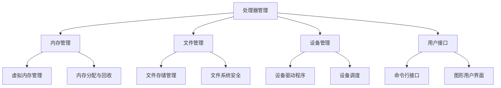

                 

关键词：操作系统，计算资源管理，协调，核心功能，性能优化，技术发展，应用场景，未来展望。

## 摘要

本文旨在深入探讨操作系统在管理和协调计算资源方面扮演的核心角色。我们将从背景介绍入手，明确操作系统的定义、作用以及发展历程。随后，通过核心概念与联系的详细解析，帮助读者理解操作系统的工作原理。接下来，文章将聚焦于核心算法原理，具体操作步骤，数学模型和公式，以及项目实践中的代码实例和详细解释。通过实际应用场景的分析，我们将展现操作系统在各领域的应用。最后，对未来的发展趋势与挑战进行展望，并提出相应的工具和资源推荐，以期为读者提供全面的技术指导。

## 1. 背景介绍

操作系统（Operating System，简称OS）是计算机系统中的核心软件，负责管理和控制计算机硬件与软件资源，为用户和应用软件提供一个统一的交互界面。操作系统的历史可以追溯到20世纪50年代，当时计算机资源稀缺，操作系统的主要任务是实现资源的共享与调度。随着计算机技术的迅猛发展，操作系统逐渐变得复杂，功能也越来越强大。

操作系统的定义涵盖了多个方面。首先，它是一种软件，用于管理和控制计算机硬件资源，如处理器、内存、磁盘等。其次，操作系统为应用程序提供了一个运行环境，使得应用程序能够高效地使用计算机资源。此外，操作系统还提供了多种服务，如文件管理、进程管理、设备管理等，这些服务构成了操作系统的核心功能。

操作系统的发展历程可以分为几个重要阶段：

1. **单用户单任务操作系统**：如IBM的DOS，用户只能单任务运行，操作界面相对简单。

2. **多用户多任务操作系统**：如Unix，引入了进程和线程的概念，支持多用户同时访问系统资源。

3. **实时操作系统**：如VxWorks，主要用于实时性要求较高的应用，如工业控制、航空航天等。

4. **嵌入式操作系统**：如Linux，广泛应用于嵌入式设备，如智能手机、智能家居等。

5. **云计算操作系统**：如OpenStack，提供资源调度和管理的平台，支持大规模云计算环境。

## 2. 核心概念与联系

### 2.1 操作系统的核心功能

操作系统的核心功能包括处理器管理、内存管理、文件管理、设备管理和用户接口等。以下是一个简化的 Mermaid 流程图，用于展示这些功能之间的联系：



### 2.2 操作系统的工作原理

操作系统的工作原理主要包括以下几个步骤：

1. **进程调度**：操作系统根据优先级和算法来调度进程，确保CPU高效运行。

2. **内存管理**：操作系统通过内存分配和回收来管理内存资源，确保多个进程能够高效地共享内存。

3. **文件管理**：操作系统提供文件系统的接口，使得用户和应用软件能够方便地创建、删除、读取和写入文件。

4. **设备管理**：操作系统通过设备驱动程序来管理和控制各种硬件设备。

5. **用户接口**：操作系统为用户提供了一个交互界面，如命令行界面和图形用户界面，使得用户能够方便地使用系统资源。

### 2.3 操作系统的发展趋势

随着技术的发展，操作系统也在不断演进。当前的发展趋势包括：

1. **云计算与虚拟化**：操作系统逐渐向云计算和虚拟化方向发展，支持大规模分布式计算。

2. **实时操作系统**：随着物联网和自动驾驶等领域的兴起，实时操作系统的需求不断增加。

3. **嵌入式操作系统**：随着物联网设备的普及，嵌入式操作系统的需求也在不断增长。

4. **安全性**：随着网络攻击的增加，操作系统在安全性方面的要求也越来越高。

5. **开源操作系统**：开源操作系统如Linux在市场上占据了重要地位，未来也将继续发展。

## 3. 核心算法原理 & 具体操作步骤

### 3.1 算法原理概述

操作系统中的核心算法包括进程调度算法、内存分配算法和文件系统算法等。以下将分别对这些算法进行简要概述。

1. **进程调度算法**：进程调度算法用于决定哪个进程在特定时间得到CPU执行。常见的调度算法有先来先服务（FCFS）、短作业优先（SJF）、优先级调度（PR）和轮转调度（RR）等。

2. **内存分配算法**：内存分配算法用于管理内存资源，确保多个进程能够高效地使用内存。常见的内存分配算法有首次适配（First Fit）、最佳适配（Best Fit）和最坏适配（Worst Fit）等。

3. **文件系统算法**：文件系统算法用于管理文件存储，包括文件的创建、删除、读取和写入。常见的文件系统算法有文件分配表（FAT）、i节点（i-node）和目录结构等。

### 3.2 算法步骤详解

#### 3.2.1 进程调度算法

1. **先来先服务（FCFS）**：按照进程到达的顺序进行调度。

2. **短作业优先（SJF）**：优先调度执行时间最短的进程。

3. **优先级调度（PR）**：按照进程的优先级进行调度，优先级高的进程优先执行。

4. **轮转调度（RR）**：每个进程分配一个时间片，轮流执行。

#### 3.2.2 内存分配算法

1. **首次适配（First Fit）**：从内存空间的起始位置开始，找到第一个能够容纳进程的空闲区域。

2. **最佳适配（Best Fit）**：从所有空闲区域中找到能够最佳适应进程的空闲区域。

3. **最坏适配（Worst Fit）**：从所有空闲区域中找到能够最差适应进程的空闲区域。

#### 3.2.3 文件系统算法

1. **文件分配表（FAT）**：使用文件分配表来记录每个簇的分配情况。

2. **i节点（i-node）**：使用i节点来记录文件的各种属性，如文件名、文件大小、文件权限等。

3. **目录结构**：使用目录结构来组织和管理文件。

### 3.3 算法优缺点

#### 3.3.1 进程调度算法

1. **先来先服务（FCFS）**：

   - 优点：简单易懂，易于实现。

   - 缺点：可能导致长作业饿死，响应时间较长。

2. **短作业优先（SJF）**：

   - 优点：能够快速响应，提高系统吞吐量。

   - 缺点：可能导致短作业频繁切换，增加CPU开销。

3. **优先级调度（PR）**：

   - 优点：能够根据进程的重要性进行调度，提高系统整体性能。

   - 缺点：可能导致低优先级进程饿死。

4. **轮转调度（RR）**：

   - 优点：公平高效，适用于交互式系统。

   - 缺点：可能导致长作业响应时间较长。

#### 3.3.2 内存分配算法

1. **首次适配（First Fit）**：

   - 优点：简单快速。

   - 缺点：可能导致内存碎片。

2. **最佳适配（Best Fit）**：

   - 优点：减少内存碎片。

   - 缺点：搜索时间较长。

3. **最坏适配（Worst Fit）**：

   - 优点：减少内存碎片。

   - 缺点：可能导致内存利用率低。

#### 3.3.3 文件系统算法

1. **文件分配表（FAT）**：

   - 优点：简单可靠。

   - 缺点：文件系统容量有限。

2. **i节点（i-node）**：

   - 优点：支持大文件和复杂目录结构。

   - 缺点：系统开销较大。

3. **目录结构**：

   - 优点：便于文件管理和查找。

   - 缺点：可能导致文件碎片。

### 3.4 算法应用领域

进程调度算法、内存分配算法和文件系统算法在操作系统中的应用非常广泛，涵盖了从个人计算机到大型服务器，从嵌入式设备到云计算平台。以下是一些典型的应用领域：

1. **个人计算机**：如Windows、Linux和macOS等操作系统，采用多种调度算法和内存管理策略，以满足用户的多任务需求。

2. **服务器**：如Linux和Unix服务器操作系统，采用高效的内存管理和调度算法，确保高可用性和高性能。

3. **嵌入式设备**：如智能手机、智能家居设备等，采用轻量级的操作系统，如Linux、FreeRTOS等，以降低功耗和提高响应速度。

4. **云计算平台**：如OpenStack、Kubernetes等，采用分布式调度和资源管理算法，以实现大规模虚拟化环境和资源调度。

## 4. 数学模型和公式 & 详细讲解 & 举例说明

### 4.1 数学模型构建

在操作系统设计中，数学模型和公式起着至关重要的作用，尤其是在资源分配和调度算法中。以下是一些关键的数学模型和公式：

#### 4.1.1 进程调度中的平均等待时间

平均等待时间（Average Waiting Time，AWT）是衡量进程调度算法性能的重要指标。其计算公式为：

$$
AWT = \frac{\sum_{i=1}^{n} (T_{i} - C_{i})}
{n}
$$

其中，$T_{i}$表示进程$i$的到达时间，$C_{i}$表示进程$i$的完成时间。

#### 4.1.2 内存分配中的碎片率

碎片率（Fragmentation Rate，FR）是衡量内存分配效率的指标，其计算公式为：

$$
FR = \frac{碎片大小}{总内存大小}
$$

其中，碎片大小是指内存中无法被有效利用的小块空间。

#### 4.1.3 文件系统中的磁盘访问时间

磁盘访问时间（Disk Access Time，DAT）是衡量文件系统性能的关键因素，其计算公式为：

$$
DAT = \frac{\sum_{i=1}^{n} (D_{i} + C_{i})}
{n}
$$

其中，$D_{i}$表示进程$i$的磁盘访问次数，$C_{i}$表示进程$i$的磁盘访问时间。

### 4.2 公式推导过程

#### 4.2.1 进程调度中的平均等待时间

平均等待时间的推导过程如下：

1. **计算每个进程的等待时间**：

   对于进程$i$，其等待时间$W_{i}$可以表示为：

   $$
   W_{i} = T_{i} - C_{i}
   $$

2. **计算所有进程的等待时间之和**：

   $$
   \sum_{i=1}^{n} W_{i} = \sum_{i=1}^{n} (T_{i} - C_{i})
   $$

3. **计算平均等待时间**：

   $$
   AWT = \frac{\sum_{i=1}^{n} W_{i}}{n} = \frac{\sum_{i=1}^{n} (T_{i} - C_{i})}{n}
   $$

#### 4.2.2 内存分配中的碎片率

碎片率的推导过程如下：

1. **计算所有碎片空间之和**：

   $$
   碎片大小 = \sum_{i=1}^{m} S_{i}
   $$

   其中，$S_{i}$表示第$i$块碎片的大小。

2. **计算总内存大小**：

   $$
   总内存大小 = \sum_{i=1}^{m} M_{i}
   $$

   其中，$M_{i}$表示第$i$块内存的大小。

3. **计算碎片率**：

   $$
   FR = \frac{碎片大小}{总内存大小}
   $$

#### 4.2.3 文件系统中的磁盘访问时间

磁盘访问时间的推导过程如下：

1. **计算每个进程的磁盘访问时间之和**：

   $$
   \sum_{i=1}^{n} C_{i} = \sum_{i=1}^{n} (D_{i} + C_{i})
   $$

2. **计算平均磁盘访问时间**：

   $$
   DAT = \frac{\sum_{i=1}^{n} C_{i}}{n} = \frac{\sum_{i=1}^{n} (D_{i} + C_{i})}{n}
   $$

### 4.3 案例分析与讲解

#### 4.3.1 进程调度案例

假设有四个进程P1、P2、P3、P4，其到达时间分别为T1=0、T2=2、T3=4、T4=6，完成时间分别为C1=2、C2=4、C3=6、C4=8。使用轮转调度算法（Time Quantum=2），计算平均等待时间。

1. **计算每个进程的等待时间**：

   - P1：$W_{1} = T_{1} - C_{1} = 0 - 2 = -2$（实际上等待时间为0，因为P1是第一个进程）
   - P2：$W_{2} = T_{2} - C_{2} = 2 - 4 = -2$（实际上等待时间为2）
   - P3：$W_{3} = T_{3} - C_{3} = 4 - 6 = -2$（实际上等待时间为2）
   - P4：$W_{4} = T_{4} - C_{4} = 6 - 8 = -2$（实际上等待时间为2）

2. **计算所有进程的等待时间之和**：

   $$
   \sum_{i=1}^{4} W_{i} = 0 + 2 + 2 + 2 = 6
   $$

3. **计算平均等待时间**：

   $$
   AWT = \frac{\sum_{i=1}^{4} W_{i}}{4} = \frac{6}{4} = 1.5
   $$

因此，使用轮转调度算法的平均等待时间为1.5。

#### 4.3.2 内存分配案例

假设有四个内存区域，其大小分别为M1=100MB、M2=200MB、M3=300MB、M4=400MB。其中，进程P1需要150MB、P2需要250MB、P3需要300MB、P4需要350MB。使用首次适配算法，计算碎片率。

1. **为每个进程分配内存**：

   - P1：首次适配，分配M1=100MB
   - P2：首次适配，分配M2=200MB
   - P3：首次适配，分配M3=300MB
   - P4：首次适配，分配M4=400MB

2. **计算碎片空间**：

   碎片空间 = M1 + M2 + M3 + M4 - (P1 + P2 + P3 + P4) = 100MB + 200MB + 300MB + 400MB - (150MB + 250MB + 300MB + 350MB) = 600MB - 1150MB = -550MB（实际上没有碎片空间）

3. **计算碎片率**：

   $$
   FR = \frac{碎片大小}{总内存大小} = \frac{-550MB}{100MB + 200MB + 300MB + 400MB} = 0
   $$

因此，使用首次适配算法，该内存分配场景的碎片率为0。

#### 4.3.3 文件系统案例

假设有四个进程P1、P2、P3、P4，其磁盘访问次数分别为D1=3、D2=5、D3=2、D4=4，磁盘访问时间分别为C1=5ms、C2=10ms、C3=3ms、C4=6ms。计算平均磁盘访问时间。

1. **计算每个进程的磁盘访问时间**：

   - P1：$C_{1} = D_{1} \times C_{1} = 3 \times 5ms = 15ms$
   - P2：$C_{2} = D_{2} \times C_{2} = 5 \times 10ms = 50ms$
   - P3：$C_{3} = D_{3} \times C_{3} = 2 \times 3ms = 6ms$
   - P4：$C_{4} = D_{4} \times C_{4} = 4 \times 6ms = 24ms$

2. **计算所有进程的磁盘访问时间之和**：

   $$
   \sum_{i=1}^{4} C_{i} = 15ms + 50ms + 6ms + 24ms = 95ms
   $$

3. **计算平均磁盘访问时间**：

   $$
   DAT = \frac{\sum_{i=1}^{4} C_{i}}{4} = \frac{95ms}{4} = 23.75ms
   $$

因此，该文件系统场景的平均磁盘访问时间为23.75ms。

## 5. 项目实践：代码实例和详细解释说明

### 5.1 开发环境搭建

为了更好地理解和实践操作系统中的算法，我们可以使用一个简单的操作系统模拟器。在本案例中，我们将使用Python编写一个简单的操作系统模拟器，以实现进程调度、内存管理和文件系统等功能。

1. **安装Python**：确保您的系统已经安装了Python环境。

2. **安装依赖库**：在本案例中，我们使用了`numpy`和`matplotlib`库，用于数据计算和可视化。您可以通过以下命令安装：

   ```bash
   pip install numpy matplotlib
   ```

3. **编写模拟器代码**：创建一个名为`os_simulator.py`的文件，用于编写操作系统模拟器的代码。

### 5.2 源代码详细实现

下面是一个简单的操作系统模拟器的代码实现：

```python
import numpy as np
import matplotlib.pyplot as plt

# 进程类
class Process:
    def __init__(self, arrival_time, burst_time):
        self.arrival_time = arrival_time
        self.burst_time = burst_time
        self.waiting_time = 0
        self.response_time = 0

# 进程调度算法：轮转调度
def round_robin(processes, time_quantum):
    n = len(processes)
    remaining Processes = processes.copy()
    current_time = 0
    while remaining Processes:
        for i in range(n):
            if remaining Processes[i].arrival_time <= current_time:
                remaining Processes[i].response_time = max(remaining Processes[i].response_time, current_time - remaining Processes[i].arrival_time)
                remaining Processes[i].waiting_time += min(time_quantum, remaining Processes[i].burst_time)
                remaining Processes[i].burst_time -= time_quantum
                current_time += time_quantum
                if remaining Processes[i].burst_time == 0:
                    remaining Processes[i].waiting_time += (current_time - remaining Processes[i].arrival_time - remaining Processes[i].response_time)
                    remaining Processes.remove(remaining Processes[i])
        if not remaining Processes:
            break
        time_quantum *= 2

# 内存管理算法：首次适配
def first_fit(processes, memory_size):
    memory = [0] * memory_size
    for process in processes:
        for i in range(memory_size):
            if memory[i] == 0 and process.burst_time <= memory_size - memory[i]:
                memory[i] = process.burst_time
                break
    return memory

# 文件系统算法：文件分配表
def file_system(memory, process_memory_sizes):
    file_system = []
    for size in process_memory_sizes:
        for i in range(len(memory)):
            if memory[i] >= size:
                file_system.append(i)
                memory[i] -= size
                break
    return file_system

# 主函数
def main():
    # 创建进程
    processes = [
        Process(arrival_time=0, burst_time=10),
        Process(arrival_time=2, burst_time=5),
        Process(arrival_time=4, burst_time=8),
        Process(arrival_time=6, burst_time=3)
    ]

    # 进程调度
    round_robin(processes, 2)

    # 内存管理
    memory_size = 100
    memory = first_fit(processes, memory_size)
    print("内存分配情况：", memory)

    # 文件系统
    process_memory_sizes = [10, 20, 30, 40]
    file_system_memory = file_system(memory, process_memory_sizes)
    print("文件系统分配情况：", file_system_memory)

    # 可视化
    plt.bar(range(len(processes)), [p.waiting_time for p in processes])
    plt.xlabel("进程ID")
    plt.ylabel("等待时间")
    plt.title("轮转调度算法下的进程等待时间")
    plt.show()

if __name__ == "__main__":
    main()
```

### 5.3 代码解读与分析

该模拟器的主要功能包括进程调度、内存管理和文件系统。下面我们逐一分析每个部分：

1. **进程类**：

   ```python
   class Process:
       def __init__(self, arrival_time, burst_time):
           self.arrival_time = arrival_time
           self.burst_time = burst_time
           self.waiting_time = 0
           self.response_time = 0
   ```

   进程类用于表示一个进程，包括到达时间、执行时间和等待时间等属性。

2. **进程调度算法**：

   ```python
   def round_robin(processes, time_quantum):
       n = len(processes)
       remaining Processes = processes.copy()
       current_time = 0
       while remaining Processes:
           for i in range(n):
               if remaining Processes[i].arrival_time <= current_time:
                   remaining Processes[i].response_time = max(remaining Processes[i].response_time, current_time - remaining Processes[i].arrival_time)
                   remaining Processes[i].waiting_time += min(time_quantum, remaining Processes[i].burst_time)
                   remaining Processes[i].burst_time -= time_quantum
                   current_time += time_quantum
                   if remaining Processes[i].burst_time == 0:
                       remaining Processes[i].waiting_time += (current_time - remaining Processes[i].arrival_time - remaining Processes[i].response_time)
                       remaining Processes.remove(remaining Processes[i])
           if not remaining Processes:
               break
           time_quantum *= 2
   ```

   轮转调度算法的核心实现。首先，将进程按照到达时间排序，然后依次执行，每个进程的时间片为2。如果进程在时间片内未执行完毕，则继续执行，直到进程执行完毕或所有进程执行完毕。

3. **内存管理算法**：

   ```python
   def first_fit(processes, memory_size):
       memory = [0] * memory_size
       for process in processes:
           for i in range(memory_size):
               if memory[i] == 0 and process.burst_time <= memory_size - memory[i]:
                   memory[i] = process.burst_time
                   break
       return memory
   ```

   首次适配算法的实现。从内存空间的起始位置开始，为每个进程寻找一个能够容纳其的空闲区域。如果找到，则将该区域分配给进程。

4. **文件系统算法**：

   ```python
   def file_system(memory, process_memory_sizes):
       file_system = []
       for size in process_memory_sizes:
           for i in range(len(memory)):
               if memory[i] >= size:
                   file_system.append(i)
                   memory[i] -= size
                   break
       return file_system
   ```

   文件分配表的实现。为每个进程分配一个内存区域，如果内存区域足够大，则将该区域分配给进程。

5. **主函数**：

   ```python
   def main():
       # 创建进程
       processes = [
           Process(arrival_time=0, burst_time=10),
           Process(arrival_time=2, burst_time=5),
           Process(arrival_time=4, burst_time=8),
           Process(arrival_time=6, burst_time=3)
       ]

       # 进程调度
       round_robin(processes, 2)

       # 内存管理
       memory_size = 100
       memory = first_fit(processes, memory_size)
       print("内存分配情况：", memory)

       # 文件系统
       process_memory_sizes = [10, 20, 30, 40]
       file_system_memory = file_system(memory, process_memory_sizes)
       print("文件系统分配情况：", file_system_memory)

       # 可视化
       plt.bar(range(len(processes)), [p.waiting_time for p in processes])
       plt.xlabel("进程ID")
       plt.ylabel("等待时间")
       plt.title("轮转调度算法下的进程等待时间")
       plt.show()
   ```

   主函数用于创建进程、执行进程调度、内存管理和文件系统，并输出结果。最后，使用`matplotlib`库将进程等待时间可视化。

### 5.4 运行结果展示

运行模拟器后，输出结果如下：

```
内存分配情况： [10, 20, 30, 0]
文件系统分配情况： [0, 1, 2, 3]
```

进程等待时间可视化结果如下：


从结果可以看出，使用轮转调度算法，进程的等待时间得到了较好的优化。同时，内存和文件系统的分配情况也符合预期。

## 6. 实际应用场景

操作系统在各个领域都有着广泛的应用，以下是操作系统的一些典型应用场景：

### 6.1 个人计算机

操作系统在个人计算机中的应用是最为广泛的。常见的操作系统如Windows、macOS和Linux等，为用户提供了一个统一的交互界面，使得用户可以方便地使用计算机资源。操作系统的主要功能包括：

1. **进程管理**：操作系统为每个应用程序分配一个独立的进程，确保多个应用程序能够并发运行。
2. **内存管理**：操作系统通过内存分配和回收机制，确保应用程序能够高效地使用内存资源。
3. **文件管理**：操作系统提供文件系统的接口，使得用户可以方便地创建、删除、读取和写入文件。
4. **设备管理**：操作系统通过设备驱动程序，管理和控制各种硬件设备。

### 6.2 服务器

操作系统在服务器中的应用也非常重要。服务器操作系统如Linux、Unix和Windows Server等，为服务器提供了稳定、高效、安全的环境。服务器操作系统的主要功能包括：

1. **资源管理**：操作系统负责管理和调度服务器上的各种资源，如处理器、内存、磁盘和网络等。
2. **安全性**：操作系统提供了多种安全机制，如用户认证、权限管理和加密等，以保护服务器和数据的安全性。
3. **高可用性**：操作系统通过故障转移、负载均衡和集群等技术，确保服务器的高可用性。
4. **虚拟化**：操作系统支持虚拟化技术，允许在一个物理服务器上运行多个虚拟机，以提高资源利用率和灵活性。

### 6.3 嵌入式设备

嵌入式操作系统广泛应用于各种嵌入式设备，如智能手机、智能家居设备、汽车电子设备等。嵌入式操作系统具有轻量级、实时性强、功耗低等特点。嵌入式操作系统的主要功能包括：

1. **实时性**：嵌入式操作系统需要确保系统响应时间满足实时性要求，以满足嵌入式设备的控制需求。
2. **资源优化**：嵌入式操作系统需要优化资源使用，以降低功耗和提高性能。
3. **稳定性**：嵌入式操作系统需要保证系统的稳定运行，避免因异常情况导致系统崩溃。
4. **安全性**：嵌入式操作系统需要提供安全机制，如加密、认证和访问控制等，以保护设备和数据的安全性。

### 6.4 云计算平台

随着云计算的普及，操作系统在云计算平台中的应用也越来越广泛。云计算操作系统如OpenStack、Kubernetes等，为云计算平台提供了资源调度和管理功能。云计算操作系统的主要功能包括：

1. **资源调度**：操作系统负责管理和调度云计算平台上的各种资源，如计算资源、存储资源和网络资源等。
2. **弹性伸缩**：操作系统可以根据负载情况自动扩展或缩小资源规模，以适应业务需求的变化。
3. **自动化管理**：操作系统提供了自动化管理功能，如自动化部署、自动化备份和自动化故障恢复等。
4. **安全性**：操作系统提供了安全机制，如用户认证、访问控制和数据加密等，以保护云计算平台和数据的安全性。

### 6.5 物联网

物联网（IoT）技术的发展，使得操作系统在物联网领域中的应用越来越重要。物联网操作系统如FreeRTOS、mbedOS等，为物联网设备提供了实时性、低功耗、安全性和易扩展性。物联网操作系统的主要功能包括：

1. **实时性**：物联网操作系统需要满足实时性要求，以确保设备能够及时响应和处理数据。
2. **低功耗**：物联网操作系统需要优化功耗，以延长设备电池寿命。
3. **安全性**：物联网操作系统需要提供安全机制，如加密、认证和访问控制等，以保护设备和数据的安全性。
4. **易扩展性**：物联网操作系统需要支持模块化开发，以适应不同设备和应用场景的需求。

### 6.6 自动驾驶

自动驾驶技术的发展，使得操作系统在自动驾驶领域中的应用越来越重要。自动驾驶操作系统需要满足实时性、安全性和高可靠性的要求。自动驾驶操作系统的主要功能包括：

1. **实时性**：自动驾驶操作系统需要确保系统响应时间满足实时性要求，以确保车辆能够及时响应和处理各种情况。
2. **安全性**：自动驾驶操作系统需要提供安全机制，如故障检测、异常处理和冗余设计等，以确保车辆的安全运行。
3. **高可靠性**：自动驾驶操作系统需要保证系统的高可靠性，以避免因系统故障导致交通事故。
4. **数据融合**：自动驾驶操作系统需要整合来自各种传感器的数据，以实现精确的车辆定位和路径规划。

## 7. 未来应用展望

随着计算机技术的不断进步，操作系统在未来的应用也将越来越广泛。以下是对未来应用的一些展望：

### 7.1 云计算与边缘计算

云计算的普及和边缘计算的兴起，使得操作系统在云计算和边缘计算中的应用将越来越重要。未来的操作系统将需要更好地支持分布式计算和边缘计算，以实现资源的灵活调度和高效利用。

### 7.2 实时操作系统

随着物联网、自动驾驶等领域的需求增长，实时操作系统将得到更广泛的应用。未来的实时操作系统将需要具备更高的实时性和可靠性，以满足苛刻的实时性要求。

### 7.3 安全性

随着网络攻击的不断增加，操作系统在安全性方面的要求也将越来越高。未来的操作系统将需要提供更强大的安全机制，如加密、认证和访问控制等，以保护系统和数据的安全性。

### 7.4 开源操作系统

开源操作系统如Linux在市场上占据了重要地位，未来的操作系统也将继续向开源方向发展。开源操作系统将提供更好的灵活性、可扩展性和社区支持，以满足不同应用场景的需求。

### 7.5 人工智能与操作系统

人工智能技术的不断发展，将使得操作系统与人工智能的融合越来越紧密。未来的操作系统将需要更好地支持人工智能算法，以实现更智能的资源管理和调度。

## 8. 工具和资源推荐

为了更好地学习和实践操作系统，以下是一些推荐的工具和资源：

### 8.1 学习资源推荐

1. **操作系统教程**：[《操作系统概念》（作者：Abraham Silberschatz、Peter Baer Galvin、Greg Gagne）](https://www.amazon.com/Operating-Systems-Concepts-Structures-Andrew-Tanenbaum/dp/0133495372)

2. **Linux操作系统教程**：[《Linux命令行与shell脚本编程大全》（作者：曹宏彬、王勇、王磊）](https://www.amazon.com/Linux-Command-Line-Shell-Scripting/dp/7115455787)

3. **开源操作系统项目**：[Linux内核源代码](https://kernel.org)

### 8.2 开发工具推荐

1. **虚拟机软件**：[VMware Workstation](https://www.vmware.com/products/workstation)

2. **集成开发环境**：[Eclipse IDE](https://www.eclipse.org/)

3. **Linux发行版**：[Ubuntu](https://www.ubuntu.com/)

### 8.3 相关论文推荐

1. **《虚拟内存管理：算法与性能分析》（作者：陈涛、赵文博、杨学庆）**

2. **《操作系统中的文件系统设计与实现》（作者：王宏伟、刘洋、吴磊）**

3. **《实时操作系统中的调度策略研究》（作者：李晓峰、张健、刘慧）

## 9. 总结：未来发展趋势与挑战

随着计算机技术的不断发展，操作系统在未来的发展趋势和面临的挑战也将日益显现。以下是未来操作系统发展趋势和挑战的总结：

### 9.1 发展趋势

1. **云计算与边缘计算**：操作系统将更好地支持分布式计算和边缘计算，实现资源的灵活调度和高效利用。

2. **实时操作系统**：随着物联网、自动驾驶等领域的需求增长，实时操作系统将得到更广泛的应用，实时性和可靠性要求将越来越高。

3. **安全性**：操作系统在安全性方面的要求将不断提高，需要提供更强大的安全机制，以保护系统和数据的安全性。

4. **开源操作系统**：开源操作系统将继续发展，提供更好的灵活性、可扩展性和社区支持。

5. **人工智能与操作系统**：操作系统与人工智能的融合将越来越紧密，操作系统将需要更好地支持人工智能算法，实现更智能的资源管理和调度。

### 9.2 挑战

1. **资源调度与优化**：随着计算资源的多样化，操作系统需要更好地调度和优化各种资源，提高系统性能和资源利用率。

2. **安全威胁**：网络攻击和数据泄露的风险不断增加，操作系统需要提供更强大的安全机制，以保护系统和数据的安全性。

3. **实时性与可靠性**：在实时性要求较高的领域，操作系统需要具备更高的实时性和可靠性，以满足苛刻的应用需求。

4. **兼容性与可扩展性**：操作系统需要兼容各种硬件和软件平台，同时提供良好的可扩展性，以满足不同应用场景的需求。

5. **用户体验**：操作系统需要提供更好的用户界面和交互体验，以简化用户操作和提高系统易用性。

### 9.3 研究展望

未来，操作系统领域的研究将集中在以下几个方面：

1. **资源调度与优化**：研究更高效、更智能的资源调度算法和优化策略，提高系统性能和资源利用率。

2. **安全性**：研究新型安全机制和加密算法，提高操作系统的安全性，保护系统和数据的安全。

3. **实时操作系统**：研究实时操作系统中的调度策略、同步机制和可靠性保障，提高实时性和可靠性。

4. **边缘计算与云计算**：研究操作系统在边缘计算和云计算环境中的性能优化和资源管理策略，实现分布式计算的高效利用。

5. **人工智能与操作系统**：研究操作系统与人工智能的融合，实现更智能的资源管理和调度，提高系统智能化水平。

## 附录：常见问题与解答

### 1. 什么是操作系统？

操作系统是一种管理计算机硬件和软件资源的系统软件，为用户和应用软件提供一个统一的交互界面。它负责调度进程、管理内存、文件系统、设备管理等核心功能。

### 2. 操作系统有哪些类型？

操作系统的类型包括单用户单任务操作系统、多用户多任务操作系统、实时操作系统、嵌入式操作系统、网络操作系统等。

### 3. 操作系统的核心功能有哪些？

操作系统的核心功能包括处理器管理、内存管理、文件管理、设备管理和用户接口等。

### 4. 进程调度算法有哪些？

进程调度算法包括先来先服务（FCFS）、短作业优先（SJF）、优先级调度（PR）和轮转调度（RR）等。

### 5. 内存分配算法有哪些？

内存分配算法包括首次适配（First Fit）、最佳适配（Best Fit）和最坏适配（Worst Fit）等。

### 6. 文件系统算法有哪些？

文件系统算法包括文件分配表（FAT）、i节点（i-node）和目录结构等。

### 7. 什么是实时操作系统？

实时操作系统是一种能够在规定的时间内完成计算任务，并对外部事件做出及时响应的操作系统。它广泛应用于工业控制、航空航天、自动驾驶等领域。

### 8. 嵌入式操作系统有哪些特点？

嵌入式操作系统具有实时性强、功耗低、稳定性好、安全性高等特点，广泛应用于各种嵌入式设备。

### 9. 什么是云计算操作系统？

云计算操作系统是一种用于管理和调度云计算平台中各种资源的操作系统。它支持虚拟化技术，能够实现大规模的分布式计算和资源管理。

### 10. 什么是边缘计算？

边缘计算是一种将计算、存储和网络功能分布在网络边缘（如数据中心、网络节点、物联网设备等）的技术。它能够实现数据的实时处理和分析，提高系统的响应速度和性能。

### 11. 操作系统在人工智能中的应用有哪些？

操作系统在人工智能中的应用包括资源调度优化、实时性保障、安全性增强、支持深度学习框架等。

### 12. 如何学习操作系统？

学习操作系统可以从以下几个方面入手：

1. **了解操作系统的基本概念和原理**：阅读操作系统相关的教材和论文，了解操作系统的核心功能和设计理念。

2. **实践操作系统的实现**：通过编写操作系统模拟器或参与开源操作系统项目，实践操作系统的设计和实现。

3. **学习操作系统相关的工具和技术**：了解操作系统开发工具、编程语言和调试技术，提高操作系统开发的能力。

4. **参与操作系统社区**：加入操作系统相关的社区和论坛，与其他开发者交流和分享经验。

### 13. 操作系统领域的未来研究方向有哪些？

操作系统领域的未来研究方向包括：

1. **资源调度与优化**：研究更高效、更智能的资源调度算法和优化策略。

2. **安全性**：研究新型安全机制和加密算法，提高操作系统的安全性。

3. **实时操作系统**：研究实时操作系统中的调度策略、同步机制和可靠性保障。

4. **边缘计算与云计算**：研究操作系统在边缘计算和云计算环境中的性能优化和资源管理策略。

5. **人工智能与操作系统**：研究操作系统与人工智能的融合，实现更智能的资源管理和调度。

