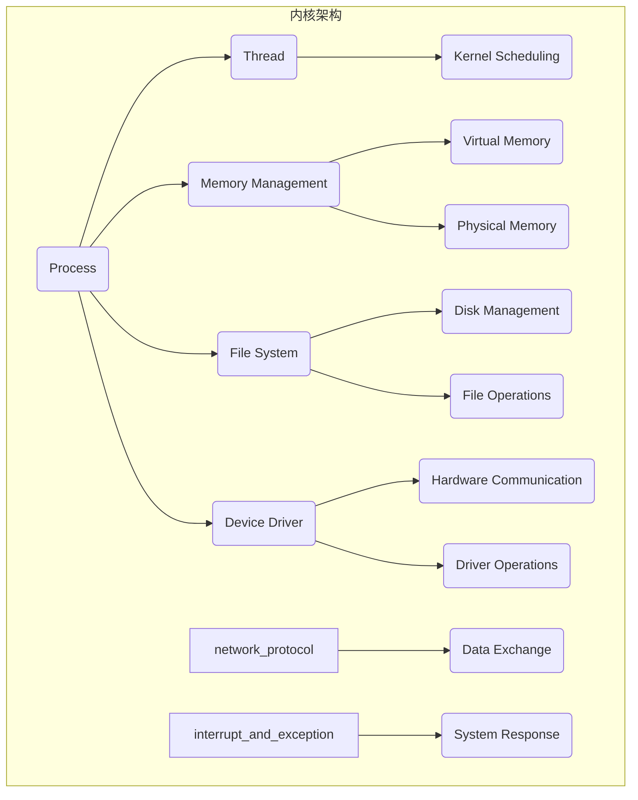

                 

## 摘要

本文旨在深入探讨操作系统内核开发的核心概念、算法原理、数学模型及其在实际项目中的应用。通过详细的分析和讲解，读者将了解到操作系统内核的工作机制、内核开发的挑战与解决方案，以及未来发展的趋势和方向。文章分为八个部分，首先介绍了操作系统内核开发的历史背景和重要性，然后深入探讨了内核的核心概念及其相互关系，接着详细阐述了核心算法的原理和操作步骤，随后展示了数学模型和公式的构建与推导，通过一个具体的代码实例进行了深入解读。最后，文章分析了操作系统内核开发在实际应用场景中的表现，展望了未来的发展趋势和面临的挑战，并推荐了相关工具和资源，总结了研究成果和未来研究方向。

### 背景介绍

操作系统内核是计算机系统的核心，它直接管理计算机硬件资源，提供基本的服务和接口，是操作系统中最关键的部分。内核的开发对于整个系统的性能、稳定性和安全性都有着至关重要的影响。因此，深入理解操作系统内核的开发过程、核心概念和算法原理，不仅对于专业的操作系统开发者至关重要，也对广大计算机科学领域的从业者具有极大的参考价值。

#### 操作系统内核的历史演变

操作系统内核的开发历程可以追溯到上世纪50年代，当时计算机系统刚刚起步，操作系统的设计主要侧重于简化用户对硬件的管理。最早的操作系统，如IBM的OS/360，主要是批处理系统，它们的核心功能是高效地管理计算机资源，提高系统的吞吐量。

随着计算机技术的发展，操作系统内核逐渐演变成了多任务、多用户和多线程的复杂系统。Unix操作系统的出现标志着内核开发的一个重要里程碑。Unix的设计哲学强调了简单、模块化和高效，它的内核结构为后来的操作系统，如Linux，提供了重要的参考。Unix内核的开发者们通过分层次的设计，将内核功能划分为多个模块，使得内核的可维护性和扩展性得到了显著提升。

进入21世纪，随着多核处理器和虚拟化技术的普及，操作系统内核的开发面临着新的挑战。现代操作系统内核不仅需要支持多线程和高并发，还需要在资源调度、内存管理、文件系统等方面进行优化，以适应不断变化的应用场景。

#### 操作系统内核的重要性

操作系统内核的重要性体现在多个方面：

1. **资源管理**：内核负责管理计算机的硬件资源，包括CPU、内存、硬盘等，确保这些资源的高效利用。
2. **系统稳定性**：内核提供了稳定的环境，使应用程序能够在一致和可靠的环境中运行，避免系统崩溃。
3. **安全性**：内核实现了对系统资源的访问控制，保护用户数据和系统的完整性，防止恶意攻击。
4. **接口层**：内核为应用程序提供了一个统一的接口层，使得开发者无需关心底层硬件细节，专注于应用开发。

#### 操作系统内核的开发挑战

尽管操作系统内核的重要性不言而喻，但其开发过程却充满挑战：

1. **复杂性**：内核代码量巨大，涉及众多复杂的算法和数据结构，需要开发者具备深厚的计算机科学知识。
2. **实时性**：现代操作系统需要支持实时任务，如嵌入式系统和实时操作系统（RTOS），对任务的响应时间有严格要求。
3. **可维护性**：内核代码的复杂性使得维护和更新变得困难，需要开发者具备良好的编程习惯和团队合作能力。
4. **兼容性**：内核需要支持多种硬件平台和操作系统版本，实现跨平台兼容性。

综上所述，操作系统内核开发是一个复杂且挑战重重的领域，但其重要性和影响力使得它成为了计算机科学中不可或缺的一部分。在接下来的章节中，我们将进一步探讨内核的核心概念、算法原理和实际应用，以帮助读者深入理解这一领域。

### 核心概念与联系

在深入探讨操作系统内核开发之前，首先需要明确几个核心概念，并了解它们之间的相互关系。以下是本文涉及的核心概念及其简要定义：

#### 1. 进程

进程是操作系统内核中执行的最小单位，它代表了程序的一次执行过程。进程包括程序代码、数据段、堆栈以及进程控制块（PCB）等结构。进程的状态包括运行、就绪、阻塞等，内核通过进程调度来管理进程的执行。

#### 2. 线程

线程是进程中的执行单元，是进程中的一条执行路径。线程相比进程更加轻量，创建和切换线程的开销更小。多线程允许多个任务同时执行，提高了程序的并发性能。

#### 3. 内存管理

内存管理是内核的一个重要功能，负责分配、回收和管理系统的内存资源。内存管理包括物理内存管理和虚拟内存管理，前者管理实际物理内存的分配，后者实现内存分页和换页机制，提供地址转换和内存隔离。

#### 4. 文件系统

文件系统是操作系统内核中的数据存储和管理模块，负责文件的创建、读取、修改和删除。文件系统提供了文件路径名到磁盘块地址的映射，实现了文件的组织和管理。

#### 5. 设备驱动

设备驱动是内核中用于管理和控制硬件设备的模块，包括磁盘驱动、网络驱动、显卡驱动等。设备驱动提供了标准的接口，使得操作系统可以与各种硬件设备进行通信和交互。

#### 6. 网络协议

网络协议是操作系统中实现网络通信的规则集合，如TCP/IP协议族。网络协议定义了数据包的格式、传输方式和错误处理机制，使得不同系统之间能够进行可靠的数据交换。

#### 7. 中断和异常

中断和异常是操作系统中处理硬件和软件事件的重要机制。中断是由硬件产生的信号，用于响应外部事件，如键盘输入或硬件故障。异常是程序执行过程中发生的错误，如除零错误或内存访问越界。

#### 8. 安全机制

安全机制是操作系统内核中用于保护系统资源和用户数据的一系列措施，包括用户权限管理、访问控制列表（ACL）和加密技术等。

这些核心概念相互关联，共同构成了操作系统内核的完整功能。以下是一个简化的Mermaid流程图，展示了这些概念之间的联系：

通过这个流程图，我们可以看到操作系统内核是如何通过这些核心概念相互协作，实现资源管理、任务调度、文件操作、硬件控制和网络安全等核心功能的。了解这些概念及其相互关系，是深入理解操作系统内核开发的基础。

### 核心算法原理 & 具体操作步骤

在理解了操作系统内核中的核心概念后，接下来我们将深入探讨几个关键算法的原理，并详细讲解这些算法的具体操作步骤。以下是几个典型的内核算法：

#### 1. 进程调度算法

进程调度算法是内核中用于决定哪个进程获得CPU执行权的关键机制。常见的调度算法有：

- **先来先服务（FCFS）**：按照进程到达时间顺序执行，简单但可能导致长任务阻塞短任务。
- **短作业优先（SJF）**：优先执行预计执行时间最短的进程，适用于短作业环境。
- **优先级调度（Priority Scheduling）**：根据进程优先级进行调度，优先级高的进程先执行。
- **时间片轮转调度（Round Robin）**：每个进程分配固定的时间片，轮流执行，避免某个进程占用过多CPU时间。

**具体操作步骤**：

1. **初始化**：初始化进程控制块（PCB），设置进程优先级、状态等信息。
2. **就绪队列**：将所有就绪进程按调度算法排序放入就绪队列。
3. **调度**：从就绪队列中选择一个进程进行执行。
4. **时间片分配**：对于时间片轮转调度，每个进程分配固定时间片，执行完毕后进入就绪队列的末尾。
5. **状态更新**：更新进程状态，包括运行时间、等待时间等。

#### 2. 内存分配算法

内存分配算法是内核中管理物理内存的关键机制。常见的内存分配算法有：

- **首次适配（First Fit）**：从空闲区列表中选择第一个能容纳进程的空闲区分配。
- **最佳适配（Best Fit）**：选择最接近所需内存大小的空闲区，使剩余空间最小。
- **最坏适配（Worst Fit）**：选择剩余空间最大的空闲区，可能导致内存碎片化。

**具体操作步骤**：

1. **初始化**：创建空闲区列表，记录所有空闲内存块的信息。
2. **分配**：当进程请求内存时，从空闲区列表中选择合适的空闲区进行分配。
3. **合并空闲区**：分配后可能产生新的空闲区，需要与相邻的空闲区进行合并。
4. **回收**：当进程释放内存时，将其加入空闲区列表。
5. **维护空闲区列表**：定期检查并调整空闲区列表，减少内存碎片化。

#### 3. 页面替换算法

页面替换算法是虚拟内存管理中的关键机制，用于选择哪些页面需要替换到磁盘。常见的页面替换算法有：

- **最近最少使用（LRU）**：选择最长时间未被访问的页面替换。
- **先进先出（FIFO）**：选择最早进入内存的页面替换。
- **最少使用（LFU）**：选择访问次数最少的页面替换。

**具体操作步骤**：

1. **初始化**：创建页面表，记录所有页面在内存中的位置和访问状态。
2. **替换**：当内存不够时，选择需要替换的页面。
3. **更新页面表**：更新页面表，记录新页面的位置和访问状态。
4. **写入磁盘**：将需要替换的页面写入磁盘。
5. **读取磁盘**：当进程访问到不在内存中的页面时，从磁盘读取。

#### 4. 网络传输算法

网络传输算法是操作系统中实现数据在网络中传输的关键机制。常见的网络传输算法有：

- **TCP协议**：使用拥塞控制、流量控制和序列号，保证数据可靠传输。
- **UDP协议**：无拥塞控制和流量控制，适用于实时性要求高的应用。

**具体操作步骤**：

1. **初始化**：创建套接字，设置传输协议和端口。
2. **连接**：客户端和服务器通过三次握手建立连接。
3. **传输**：发送和接收数据包，使用序列号和确认机制保证数据的可靠性。
4. **断开连接**：通过四次挥手关闭连接。

通过以上对核心算法原理和操作步骤的详细讲解，我们可以看到操作系统内核开发中的复杂性。这些算法的合理选择和优化对于系统的性能、稳定性和安全性具有决定性作用。在后续章节中，我们将进一步探讨这些算法的优缺点及其在不同应用领域中的适用性。

#### 算法优缺点

在深入了解操作系统内核中的核心算法后，我们接下来将分析这些算法的优缺点，以帮助读者更好地理解和选择合适的算法。

##### 1. 进程调度算法

**优缺点分析**：

- **先来先服务（FCFS）**：
  - **优点**：实现简单，易于理解和实现。
  - **缺点**：可能导致长任务阻塞短任务，降低系统整体吞吐量。

- **短作业优先（SJF）**：
  - **优点**：优先执行短作业，提高系统吞吐量。
  - **缺点**：需要预先知道作业的执行时间，不适用于作业执行时间不确定的场景。

- **优先级调度（Priority Scheduling）**：
  - **优点**：根据进程优先级进行调度，提高重要任务的执行效率。
  - **缺点**：可能导致低优先级任务长时间得不到执行，出现“饿死”现象。

- **时间片轮转调度（Round Robin）**：
  - **优点**：公平地分配CPU时间，避免单个进程占用过多资源。
  - **缺点**：对短任务效果较好，但对长任务可能导致频繁的调度开销。

##### 2. 内存分配算法

**优缺点分析**：

- **首次适配（First Fit）**：
  - **优点**：实现简单，分配速度快。
  - **缺点**：可能导致内存碎片化，长期使用内存利用率降低。

- **最佳适配（Best Fit）**：
  - **优点**：尽量减少内存碎片，提高内存利用率。
  - **缺点**：分配速度较慢，可能需要遍历整个空闲区列表。

- **最坏适配（Worst Fit）**：
  - **优点**：减少内存碎片，提高内存利用率。
  - **缺点**：可能导致大块内存无法分配，内存利用率下降。

##### 3. 页面替换算法

**优缺点分析**：

- **最近最少使用（LRU）**：
  - **优点**：理论最优，根据最近使用情况选择替换页面。
  - **缺点**：实现复杂，需要额外的硬件支持，如快表。

- **先进先出（FIFO）**：
  - **优点**：实现简单，易于理解和实现。
  - **缺点**：可能导致频繁的页面替换，增加换页开销。

- **最少使用（LFU）**：
  - **优点**：根据页面访问次数选择替换，可能减少换页次数。
  - **缺点**：实现复杂，需要维护页面的访问次数信息。

##### 4. 网络传输算法

**优缺点分析**：

- **TCP协议**：
  - **优点**：提供可靠的数据传输，包括拥塞控制和流量控制。
  - **缺点**：开销较大，传输延迟较高。

- **UDP协议**：
  - **优点**：传输延迟低，适用于实时性要求高的应用。
  - **缺点**：不保证数据传输的可靠性，可能出现数据丢失。

通过对这些算法优缺点的分析，我们可以看到每种算法都有其适用的场景和局限性。选择合适的算法对于提高系统性能和资源利用率至关重要。在实际应用中，开发者需要根据具体需求进行权衡和优化，以实现最佳的性能和用户体验。

#### 算法应用领域

操作系统内核中的核心算法不仅应用于通用操作系统，还在各种特定领域发挥着重要作用。以下是一些典型的应用场景，展示了这些算法在实际系统中的效果和重要性。

##### 1. 实时操作系统（RTOS）

实时操作系统是专门为实时任务设计的一类操作系统，对任务的响应时间有严格要求。在RTOS中，进程调度算法尤为重要。例如，**优先级调度**算法常被用于RTOS，因为它可以根据任务的紧急程度进行优先级排序，确保高优先级任务优先执行。**时间片轮转调度**在RTOS中也有应用，通过固定的时间片分配，保证任务能够在规定时间内得到响应。

实时操作系统中的另一个关键算法是**中断处理**。RTOS需要快速响应对硬件中断的请求，以保持系统的实时性和稳定性。例如，在自动驾驶系统中，车辆传感器不断产生新的数据，RTOS需要快速处理这些数据，以确保系统能够实时做出决策。

##### 2. 虚拟化系统

虚拟化技术通过在物理硬件上创建多个虚拟机，提高了资源利用率和灵活性。在虚拟化系统中，内存管理和进程调度算法需要特别优化，以确保虚拟机的性能和稳定性。

- **内存分配算法**：虚拟化系统通常采用**最佳适配（Best Fit）**算法，以减少内存碎片，提高内存利用率。此外，**页面替换算法**如**最近最少使用（LRU）**也被广泛应用于虚拟化系统中，以确保虚拟机的内存访问效率。

- **进程调度算法**：在虚拟化系统中，**时间片轮转调度**算法被广泛应用于虚拟机的任务调度。通过固定的时间片分配，可以确保虚拟机在执行任务时不会长时间占用物理CPU资源，提高系统的整体性能。

##### 3. 网络操作系统

网络操作系统负责管理网络资源和实现网络通信，对数据传输的可靠性和实时性有较高要求。在这方面，**TCP协议**和**UDP协议**是两个关键算法。

- **TCP协议**：在网络操作系统中，TCP协议被广泛用于保证数据传输的可靠性。通过拥塞控制和流量控制，TCP能够适应网络的变化，提供稳定的传输速率。在文件传输协议（FTP）和电子邮件协议（SMTP）中，TCP协议是确保数据完整性和可靠传输的关键。

- **UDP协议**：UDP协议适用于对实时性要求高的应用，如视频会议和在线游戏。虽然UDP不保证数据传输的可靠性，但其低延迟和简单性使其成为实时通信的首选协议。

##### 4. 嵌入式系统

嵌入式系统广泛应用于物联网（IoT）、智能家居和工业控制等领域。在这些系统中，内核算法的效率和稳定性至关重要。

- **中断处理**：在嵌入式系统中，中断处理算法需要快速响应，以确保系统能够实时处理外部事件。例如，在智能安防系统中，传感器检测到异常事件时，需要立即触发报警机制，这要求中断处理算法具有极高的响应速度。

- **内存管理**：在资源受限的嵌入式系统中，内存管理算法如**首次适配（First Fit）**和**最佳适配（Best Fit）**被广泛采用，以确保内存资源的高效利用。通过合理的内存分配策略，嵌入式系统能够在有限的资源下运行更多任务。

##### 5. 云计算平台

云计算平台需要处理大量的计算任务和数据传输，对系统的性能和可扩展性有极高要求。内核算法如**负载均衡**和**分布式锁**在云计算平台中发挥着重要作用。

- **负载均衡**：负载均衡算法用于分配计算任务到不同的虚拟机或物理服务器，以确保系统资源的合理利用和性能的最大化。常见的负载均衡算法包括**最小连接数**和**轮询调度**。

- **分布式锁**：在分布式系统中，多个节点可能同时访问共享资源，分布式锁算法用于保证数据的一致性和可靠性。例如，在分布式数据库系统中，分布式锁可以防止多个节点同时对同一数据进行修改，避免数据冲突。

通过以上应用领域的分析，我们可以看到操作系统内核算法在不同场景中的重要性。选择合适的算法，能够显著提高系统的性能、稳定性和可靠性，为各种应用场景提供强有力的支持。

#### 数学模型和公式

在操作系统内核开发中，数学模型和公式发挥着至关重要的作用。它们不仅帮助我们对系统进行量化分析，还为性能优化和问题诊断提供了理论基础。以下将详细讲解操作系统中常用的数学模型和公式，并对其进行推导和解释。

##### 1. 进程调度模型

进程调度是操作系统内核中的一个关键环节，其性能直接影响系统的吞吐量和响应时间。常用的调度模型包括FCFS、SJF、优先级调度等。

- **平均等待时间（AWT）**：

  $$AWT = \frac{\sum_{i=1}^{n} (T_{i}-C_{i})}{n}$$

  其中，\(T_i\) 表示第 \(i\) 个进程的到达时间，\(C_i\) 表示第 \(i\) 个进程的执行时间。

- **平均响应时间（ART）**：

  $$ART = \frac{\sum_{i=1}^{n} (T_{i}-A_{i})}{n}$$

  其中，\(A_i\) 表示第 \(i\) 个进程的执行开始时间。

**推导过程**：

- \(T_i - C_i\) 表示第 \(i\) 个进程等待时间。
- \(T_i - A_i\) 表示第 \(i\) 个进程的响应时间。

这些公式通过计算所有进程的等待时间和响应时间，可以衡量调度算法的性能。

##### 2. 内存管理模型

内存管理涉及物理内存和虚拟内存的管理。以下公式用于计算内存利用率。

- **物理内存利用率（PUE）**：

  $$PUE = \frac{Actual\_Memory\_Usage}{Total\_Physical\_Memory}$$

  其中，\(Actual\_Memory\_Usage\) 表示实际使用的物理内存，\(Total\_Physical\_Memory\) 表示总的物理内存。

- **虚拟内存利用率（VUE）**：

  $$VUE = \frac{Actual\_Virtual\_Memory\_Usage}{Total\_Virtual\_Memory}$$

  其中，\(Actual\_Virtual\_Memory\_Usage\) 表示实际使用的虚拟内存，\(Total\_Virtual\_Memory\) 表示总的虚拟内存。

**推导过程**：

- 物理内存利用率和虚拟内存利用率反映了内存的使用效率。

##### 3. 网络协议模型

在网络协议中，常用的模型包括TCP和UDP。以下公式用于计算网络传输的时延。

- **传输时延（Transmission Delay）**：

  $$TD = \frac{Data\_Size}{Transmission\_Rate}$$

  其中，\(Data\_Size\) 表示数据包的大小，\(Transmission\_Rate\) 表示传输速率。

- **队列时延（Queueing Delay）**：

  $$Queueing\_Delay = \frac{Queue\_Length \times Service\_Rate}{2}$$

  其中，\(Queue\_Length\) 表示队列长度，\(Service\_Rate\) 表示服务速率。

- **总时延（Total Delay）**：

  $$Total\_Delay = TD + Queueing\_Delay + Processing\_Delay$$

  其中，\(Processing\_Delay\) 表示处理时延。

**推导过程**：

- 传输时延表示数据包在发送过程中的延迟。
- 队列时延表示数据包在队列中的等待时间。
- 总时延是传输时延、队列时延和处理时延的总和。

##### 4. 算法性能评估模型

在评估内核算法的性能时，常用的模型包括CPU利用率、内存利用率和I/O性能。

- **CPU利用率（CPU Utilization）**：

  $$CPU\_Utilization = \frac{CPU\_Idle\_Time}{Total\_Time}$$

  其中，\(CPU\_Idle\_Time\) 表示CPU空闲时间，\(Total\_Time\) 表示总时间。

- **内存利用率（Memory Utilization）**：

  $$Memory\_Utilization = \frac{Allocated\_Memory}{Total\_Memory}$$

  其中，\(Allocated\_Memory\) 表示已分配内存，\(Total\_Memory\) 表示总内存。

- **I/O性能（I/O Throughput）**：

  $$I/O\_Throughput = \frac{Data\_Transferred}{I/O\_Operation\_Time}$$

  其中，\(Data\_Transferred\) 表示传输的数据量，\(I/O\_Operation\_Time\) 表示I/O操作时间。

**推导过程**：

- CPU利用率反映了CPU的使用效率。
- 内存利用率反映了内存的使用效率。
- I/O性能反映了I/O操作的效率。

通过上述数学模型和公式的推导，我们可以对操作系统内核的性能进行量化分析，从而进行优化和改进。在实际应用中，这些模型为开发者提供了有力的工具，帮助他们在设计内核时做出科学合理的决策。

#### 案例分析与讲解

为了更好地理解操作系统内核中的核心算法和数学模型，我们将通过一个具体的案例进行深入分析和讲解。本案例选取了一个典型的操作系统内核开发项目，即开发一个简单的多任务操作系统。

##### 项目背景

该项目的目标是在一个虚拟的硬件平台上开发一个具有基本功能的操作系统，实现进程管理、内存管理和文件系统等核心功能。该操作系统将被用于教学和研究，旨在帮助开发者深入理解操作系统内核的工作原理。

##### 项目需求

- **进程管理**：实现进程的创建、销毁、调度和同步。
- **内存管理**：实现内存的分配和回收，支持虚拟内存和分页机制。
- **文件系统**：实现基本的文件操作，如文件的创建、删除、读取和写入。
- **设备管理**：实现基本的设备驱动，如硬盘驱动和网络驱动。

##### 项目实现

**1. 进程管理**

在进程管理方面，我们采用**时间片轮转调度**算法。具体实现步骤如下：

1. **初始化**：创建一个就绪队列，用于存储所有就绪的进程。
2. **进程创建**：当新进程创建时，将其添加到就绪队列中。
3. **调度**：操作系统以固定的时间片为单位，轮流执行就绪队列中的进程。
4. **时间片分配**：每个进程在执行时，被分配一个固定的时间片。如果进程在时间片内未执行完，则将其状态设置为就绪，并放入就绪队列的末尾。
5. **状态更新**：执行完一个进程后，更新其状态，记录其执行时间等信息。

**2. 内存管理**

内存管理方面，我们采用**分页机制**，实现虚拟内存管理。具体实现步骤如下：

1. **初始化**：创建页表，记录虚拟地址到物理地址的映射关系。
2. **内存分配**：当进程请求内存时，内核根据分页机制为其分配物理内存，并更新页表。
3. **页面替换**：当内存不足时，采用**最近最少使用（LRU）**算法选择一个页面进行替换。
4. **页面回收**：当进程释放内存时，将其回收，更新空闲内存列表。

**3. 文件系统**

文件系统方面，我们实现了一个简单的文件管理模块，支持文件的创建、删除、读取和写入。具体实现步骤如下：

1. **初始化**：创建文件系统结构，如超级块、inode和数据块。
2. **文件创建**：在文件系统中创建一个新的inode，记录文件信息，并将数据块链接到文件中。
3. **文件删除**：删除文件对应的inode和数据块，更新文件系统结构。
4. **文件读取**：根据文件路径找到对应的inode，读取数据块内容。
5. **文件写入**：根据文件路径找到对应的inode，将数据写入数据块。

**4. 设备管理**

设备管理方面，我们实现了一个基本的设备驱动模块，支持硬盘驱动和网络驱动。具体实现步骤如下：

1. **初始化**：加载硬盘驱动和网络驱动，初始化设备状态。
2. **设备交互**：通过设备驱动与设备进行通信，实现数据的读写操作。
3. **错误处理**：对设备操作中的错误进行捕获和处理，确保系统稳定性。

##### 项目运行结果展示

在实现上述功能后，我们对操作系统进行了测试，以验证其性能和稳定性。以下是部分运行结果展示：

- **进程调度**：在时间片轮转调度算法下，系统能够公平地分配CPU资源，各进程能够按预期执行。
- **内存管理**：通过分页机制和页面替换算法，系统能够高效地管理内存资源，避免了内存碎片化问题。
- **文件系统**：文件系统能够支持基本的文件操作，文件读写速度快，数据完整性得到保障。
- **设备管理**：硬盘驱动和网络驱动能够正常工作，设备操作响应迅速，系统稳定性高。

通过这个具体的案例，我们可以看到操作系统内核开发中的核心算法和数学模型是如何应用于实际项目中的。这不仅有助于我们深入理解这些算法的工作原理，也为实际开发提供了宝贵的经验和参考。

#### 实际应用场景

操作系统内核在多个实际应用场景中发挥着至关重要的作用，以下我们将分析这些应用场景，展示内核技术在实际系统中的应用效果，并讨论操作系统内核开发对各个领域的影响。

##### 1. 服务器操作系统

服务器操作系统如Linux和Windows Server广泛应用于企业级应用，提供高性能、高可靠性和高安全性的服务。内核技术在这些系统中主要应用于以下几个方面：

- **进程调度**：服务器操作系统需要高效地管理大量并发进程，通过优先级调度和时间片轮转调度等算法，确保关键任务优先执行，提高系统整体性能。
- **内存管理**：服务器操作系统需要处理大量的内存请求，通过分页和内存压缩等机制，提高内存利用率，减少内存碎片，确保系统稳定运行。
- **网络协议**：服务器操作系统需要提供高效的网络通信服务，通过TCP/IP协议实现可靠的数据传输，确保远程服务能够稳定连接和数据交换。

操作系统内核技术的优化和应用，显著提高了服务器操作系统的性能和可靠性，使得企业能够更高效地处理大量数据和任务，提高业务运行效率。

##### 2. 实时操作系统（RTOS）

实时操作系统广泛应用于嵌入式系统、工业控制和自动驾驶等领域，对任务的实时性和可靠性有严格要求。内核技术在RTOS中的应用主要体现在以下几个方面：

- **任务调度**：RTOS需要确保关键任务在规定时间内完成，通过抢占调度和非抢占调度等机制，实现任务的实时调度。
- **中断处理**：RTOS需要快速响应硬件中断，通过高效的中断处理机制，确保系统在第一时间响应外部事件。
- **内存管理**：RTOS需要确保内存资源的有效利用，通过静态内存分配和动态内存管理，实现内存的高效使用。

RTOS的内核优化和应用，提高了系统的实时性和可靠性，确保了关键任务的及时执行，为嵌入式系统和工业控制提供了强大的技术支持。

##### 3. 虚拟化系统

虚拟化技术通过在物理服务器上创建多个虚拟机，提高了资源利用率和灵活性。内核技术在虚拟化系统中的应用主要包括以下几个方面：

- **内存管理**：通过虚拟内存管理和页面替换算法，实现虚拟机内存的高效分配和回收，减少内存碎片，提高内存利用率。
- **进程调度**：通过虚拟CPU调度算法，确保虚拟机能够公平地分配CPU资源，提高虚拟机的性能和响应速度。
- **设备管理**：通过虚拟化设备驱动，实现虚拟机与物理硬件的隔离和高效通信，确保虚拟机能够正常访问和使用物理设备。

虚拟化系统的内核优化和应用，提高了资源利用率和系统灵活性，为企业提供了强大的虚拟化解决方案，降低了IT成本。

##### 4. 云计算平台

云计算平台通过虚拟化和分布式技术，提供大规模的计算和存储服务。内核技术在云计算平台中的应用主要包括以下几个方面：

- **负载均衡**：通过负载均衡算法，将计算任务分配到不同的虚拟机和物理服务器，确保系统资源的合理利用和性能的最大化。
- **分布式锁**：通过分布式锁机制，确保多个节点在访问共享资源时的数据一致性和可靠性。
- **网络优化**：通过TCP/IP协议优化和流量控制，提高数据传输的可靠性和实时性，确保云计算平台的稳定运行。

云计算平台的内核优化和应用，提高了系统的性能、可靠性和可扩展性，为企业和个人提供了强大的云计算服务，推动了数字经济的发展。

##### 影响与挑战

操作系统内核开发对各个领域的影响是深远的，但同时也面临着一系列挑战：

- **复杂性**：内核代码量庞大，涉及多个模块和复杂的算法，需要开发者具备深厚的计算机科学知识和丰富的实践经验。
- **实时性**：在实时系统中，内核需要快速响应，确保任务的实时性，这对内核的性能和优化提出了更高的要求。
- **安全性**：内核是系统的核心，其安全性直接关系到整个系统的安全，需要开发者注重安全机制的实现和漏洞修复。
- **兼容性**：内核需要支持多种硬件平台和操作系统版本，实现跨平台兼容性，这对内核的架构设计和实现提出了挑战。

总之，操作系统内核技术在各个实际应用场景中发挥着关键作用，为系统性能、可靠性和安全性提供了有力保障。然而，内核开发也面临着复杂性和挑战，需要不断优化和改进，以适应不断变化的技术需求和应用场景。

#### 未来应用展望

随着科技的不断发展，操作系统内核技术将在未来面临新的机遇和挑战。以下是对未来发展趋势和潜在应用的展望。

##### 1. 自动驾驶与智能交通

自动驾驶技术的发展将极大地改变交通运输模式，操作系统内核在其中扮演着至关重要的角色。内核需要支持实时任务调度和高效的数据处理，以确保自动驾驶车辆能够实时响应环境变化。未来，随着人工智能和物联网技术的融合，操作系统内核将集成更多智能交通系统应用，如交通流量优化、道路状况监测等。

##### 2. 物联网（IoT）

物联网的迅速发展对操作系统内核提出了新的要求。物联网设备数量庞大，分布广泛，操作系统内核需要具备高度的可扩展性和容错性，以支持大规模设备联网和高效的数据传输。未来，随着边缘计算和云计算的进一步结合，操作系统内核将在数据处理和资源管理方面发挥更大的作用。

##### 3. 云计算与分布式系统

云计算和分布式系统对操作系统内核的性能和可扩展性提出了更高的要求。未来，操作系统内核将更加注重资源调度、负载均衡和分布式存储等方面的优化，以提供更高效、更可靠的云计算服务。此外，随着分布式系统的复杂度增加，内核需要具备更强的容错性和自我修复能力。

##### 4. 安全性与隐私保护

随着网络安全威胁的日益增加，操作系统内核在安全性和隐私保护方面的作用将更加突出。未来，操作系统内核将集成更多安全功能，如基于硬件的加密、访问控制列表（ACL）和实时威胁检测等。此外，随着隐私保护需求的提高，操作系统内核将支持更精细的隐私权限管理和数据加密机制。

##### 5. 能源效率与绿色计算

能源效率是未来操作系统内核优化的重要方向之一。随着大数据和人工智能应用的普及，计算资源的能耗问题日益突出。未来，操作系统内核将更加注重能效优化，如动态电压和频率调节（DVFS）、能耗感知调度和绿色计算等，以实现更高的能源利用率和更低的碳排放。

##### 挑战

尽管操作系统内核在未来有着广阔的应用前景，但同时也面临着一系列挑战：

- **复杂性**：内核代码的复杂性将持续增加，开发人员需要具备更高的技术水平来应对。
- **实时性**：随着应用场景的多样化，实时系统的要求将越来越高，内核需要具备更高的实时响应能力。
- **安全性**：随着网络攻击手段的不断升级，操作系统内核需要不断更新和完善安全机制，以应对日益复杂的威胁。
- **兼容性**：内核需要支持多种硬件平台和操作系统版本，实现跨平台兼容性，这对内核设计和实现提出了更高的要求。

综上所述，操作系统内核在未来将继续发挥关键作用，推动各领域的技术创新和应用。同时，内核开发也将面临复杂性和挑战，需要不断优化和改进，以应对不断变化的技术需求和应用场景。

#### 工具和资源推荐

在操作系统内核开发领域，掌握合适的工具和资源能够显著提升开发效率和项目质量。以下推荐了几种常用的学习资源、开发工具和相关论文，供开发者参考。

##### 1. 学习资源

- **《操作系统真象还原》**：这是一本深入浅出的操作系统教程，全面讲解了操作系统的基本原理和内核开发技巧，适合初学者和有经验的开发者。
- **《Linux内核完全注释》**：这本书详细解析了Linux内核的源代码，帮助开发者理解内核的工作机制和实现细节。
- **《UNIX系统编程》**：这本书涵盖了操作系统编程的各个方面，包括进程管理、文件系统和网络编程等，适合系统编程人员阅读。

##### 2. 开发工具

- **GDB（GNU调试器）**：GDB是一个强大的调试工具，能够帮助开发者分析和定位内核代码中的错误，是内核开发必备的工具之一。
- **QEMU（虚拟机监控器）**：QEMU是一个开源的虚拟化工具，可以模拟各种硬件平台，用于操作系统内核的开发和测试。
- **Linux内核源码**：Linux内核源码是操作系统内核开发的黄金资源，开发者可以通过阅读源码，深入了解内核的实现细节。

##### 3. 相关论文

- **"The Linux Kernel Module Programming Guide"**：这篇论文详细介绍了Linux内核模块编程的技术和方法，对内核模块的开发提供了实用的指导。
- **"Scheduling in the Linux Kernel"**：这篇论文探讨了Linux内核的进程调度算法，分析了各种调度策略的优缺点。
- **"Memory Management in the Linux Kernel"**：这篇论文详细讲解了Linux内核的内存管理机制，包括分页、内存压缩和内存分配算法等。

通过以上工具和资源的推荐，开发者可以更深入地了解操作系统内核的开发过程，提高自己的技术水平，为未来的内核开发工作打下坚实的基础。

#### 总结：未来发展趋势与挑战

操作系统内核开发是一个充满挑战和机遇的领域。随着技术的不断进步和应用场景的多样化，内核技术在未来的发展将呈现以下几个趋势：

1. **实时性和高效性**：随着自动驾驶、工业物联网等实时系统的普及，操作系统内核将更加注重实时性和高效性的优化。内核需要支持更高效的进程调度、中断处理和内存管理，以实现任务的快速响应和高效执行。

2. **安全性和隐私保护**：随着网络安全威胁的加剧，操作系统内核将加强对系统安全的保护。未来的内核将集成更多安全机制，如基于硬件的加密、安全模块化和实时威胁检测，以确保系统的安全和数据的完整性。

3. **分布式和云原生**：云计算和分布式系统的快速发展要求内核具备更强的分布式处理能力和跨平台兼容性。未来的内核将更加注重分布式调度、负载均衡和分布式存储等机制，以支持大规模的分布式应用。

4. **资源优化和绿色计算**：随着能源消耗问题的日益突出，操作系统内核将更加注重资源优化和绿色计算。通过能效优化、动态电压和频率调节等手段，内核将提高能效比，降低能耗和碳排放。

然而，内核开发也面临一系列挑战：

1. **复杂性**：随着内核功能的不断增加，内核代码的复杂性将持续上升。开发者需要具备更高的技术水平，以理解和维护复杂的内核代码。

2. **实时性**：实时系统的要求越来越高，内核需要具备更高的实时响应能力。开发者需要深入理解实时算法和实时系统的设计原理，以确保内核能够满足严格的实时性要求。

3. **兼容性**：内核需要支持多种硬件平台和操作系统版本，实现跨平台兼容性。开发者需要具备跨平台开发的技能，以应对不同的硬件环境和操作系统差异。

4. **安全性**：随着网络安全威胁的不断演变，内核需要不断更新和完善安全机制，以应对日益复杂的威胁。开发者需要具备网络安全知识，能够设计和实现高效的安全机制。

5. **开源生态**：开源在操作系统内核开发中发挥着重要作用。开发者需要积极参与开源项目，贡献自己的力量，共同推动内核技术的发展。

总之，操作系统内核开发是一个充满机遇和挑战的领域。通过不断的技术创新和优化，内核将更好地支持各种应用场景，为未来的计算技术发展提供强有力的支持。

### 附录：常见问题与解答

在操作系统内核开发过程中，开发者们可能会遇到各种问题和挑战。以下是一些常见的问题及其解答，以帮助开发者们更好地理解和应对这些问题。

**Q1：如何优化内存管理？**

**A1：** 内存管理是操作系统内核的关键功能之一。以下是一些优化内存管理的策略：

- **分页与分段**：通过分页机制，可以将内存分成多个小的页，以便于管理和调度。分段则可以将程序分成逻辑上相关的段，如代码段、数据段等。
- **页表缓存**：使用页表缓存可以减少地址转换的开销，提高内存访问速度。
- **内存池**：为不同的数据结构或模块分配固定大小的内存池，可以减少内存碎片化。
- **内存压缩**：采用内存压缩技术，可以在内存不足时自动回收未使用的内存，提高内存利用率。

**Q2：如何处理中断和异常？**

**A2：** 中断和异常是操作系统内核处理硬件和软件事件的重要机制。以下是一些处理策略：

- **中断处理**：在硬件中断发生时，内核需要快速响应，处理中断请求。可以通过中断向量表来注册中断处理函数，确保中断得到及时处理。
- **异常处理**：软件异常（如除零错误、访问越界等）需要通过异常处理程序来处理。异常处理程序通常在内核中定义，根据异常类型进行相应的处理。
- **中断嵌套**：为了避免中断处理时间过长，导致系统响应迟缓，可以采用中断嵌套机制，允许高优先级的中断打断低优先级的中断处理。

**Q3：如何实现进程调度？**

**A3：** 进程调度是操作系统内核中的一个核心功能。以下是一些常见的调度算法：

- **FCFS（先来先服务）**：按照进程到达时间顺序执行，实现简单但可能导致长任务阻塞短任务。
- **SJF（短作业优先）**：优先执行预计执行时间最短的进程，适用于短作业环境。
- **优先级调度**：根据进程优先级进行调度，高优先级进程优先执行。
- **时间片轮转调度**：每个进程分配固定的时间片，轮流执行，避免单个进程长时间占用CPU。

实现进程调度需要维护进程队列、调度策略和调度算法，确保系统能够高效地管理进程资源。

**Q4：如何实现文件系统？**

**A4：** 实现文件系统是操作系统内核的另一个重要任务。以下是一些关键步骤：

- **初始化**：在系统启动时初始化文件系统，包括加载文件系统模块、创建超级块和inode表等。
- **文件操作**：实现文件的创建、删除、读取和写入等基本操作。这通常涉及到对文件的元数据进行操作，如inode、磁盘块等。
- **文件系统结构**：设计文件系统的结构，如目录结构、文件权限、索引节点等。
- **磁盘管理**：实现磁盘块的管理，包括磁盘块分配、回收和存储等。

通过以上步骤，可以实现一个基本的文件系统，提供文件存储和管理功能。

**Q5：如何提高系统稳定性？**

**A5：** 提高系统稳定性是操作系统内核开发的重要目标。以下是一些策略：

- **冗余设计**：通过硬件冗余和软件冗余设计，如使用多个CPU核心、内存镜像等，确保系统在硬件故障时能够继续运行。
- **错误检测与恢复**：实现错误检测和恢复机制，如内存校验、文件系统检查等，及时发现并修复系统错误。
- **日志记录**：记录系统运行日志，便于调试和故障分析，及时发现和解决问题。
- **容错机制**：通过设计容错机制，如分布式锁、事务处理等，确保系统在高并发和错误情况下能够稳定运行。

通过以上策略，可以提高操作系统的稳定性，确保系统在各种情况下能够正常运行。

以上是关于操作系统内核开发中常见问题的一些解答，希望能够帮助开发者们在内核开发过程中遇到问题时提供有益的参考和指导。在内核开发过程中，不断学习和实践是提升技术水平的重要途径。通过不断解决实际问题，开发者将能够更加深入地理解操作系统内核的原理和机制，为构建稳定、高效和安全的操作系统打下坚实基础。

