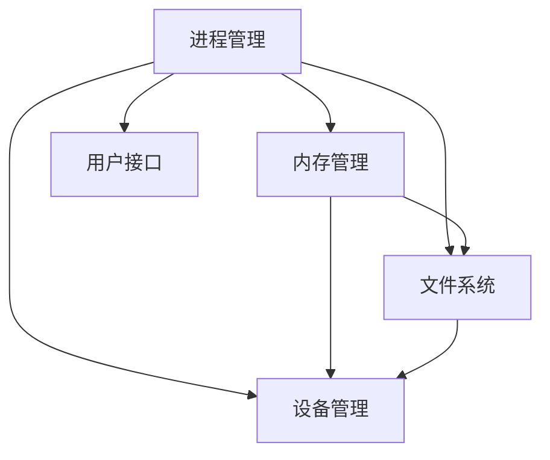

                 

关键词：操作系统，发展历史，趋势，核心技术，未来展望。

> 摘要：本文将详细探讨操作系统的发展历程，从早期简单的批处理系统到现代复杂的操作系统，分析其中的核心技术变革，并展望未来操作系统的发展趋势和面临的挑战。

## 1. 背景介绍

操作系统（Operating System，简称OS）是管理计算机硬件与软件资源的系统软件，它负责控制计算机的基本工作流程，提供程序运行环境，并为应用程序提供服务。操作系统的历史可以追溯到20世纪50年代，当时计算机硬件资源非常有限，操作系统的主要目标是提高计算机的利用率和效率。

从那时起，操作系统经历了多次重大的技术变革，包括多任务处理、虚拟内存、文件系统、网络支持等。这些变革不仅使得计算机系统更加高效和可靠，也极大地丰富了用户的应用场景。今天，操作系统已经成为现代计算机系统的核心组成部分，其发展对整个计算机行业产生了深远的影响。

## 2. 核心概念与联系

操作系统的核心概念包括进程管理、内存管理、文件系统、设备管理和用户接口等。以下是一个简化的 Mermaid 流程图，展示了这些核心概念之间的联系：



### 2.1. 进程管理

进程管理是操作系统的核心功能之一，它负责创建、调度、同步和终止进程。进程是程序在计算机上的一次执行活动，每个进程都有自己的地址空间、数据段、堆栈等。

### 2.2. 内存管理

内存管理负责分配和回收内存空间，确保各个进程能够高效地访问内存。现代操作系统通常使用虚拟内存技术，通过将部分内存数据交换到硬盘上，实现内存的扩展。

### 2.3. 文件系统

文件系统是操作系统用于组织和管理文件的方法和数据结构。常见的文件系统包括FAT、NTFS、EXT2等，它们提供了文件的存储、检索和权限控制功能。

### 2.4. 设备管理

设备管理负责处理硬件设备的操作，包括设备的分配、数据传输和错误处理。操作系统通过设备驱动程序与硬件进行通信。

### 2.5. 用户接口

用户接口是用户与操作系统交互的界面，包括命令行界面（CLI）和图形用户界面（GUI）。CLI 提供了强大的功能，但需要用户具备一定的技术背景；GUI 则更易于使用，但功能相对有限。

## 3. 核心算法原理 & 具体操作步骤

### 3.1 算法原理概述

操作系统的核心算法主要包括进程调度算法、内存分配算法、文件系统索引算法等。这些算法的目标是提高系统的性能、可靠性和用户体验。

### 3.2 算法步骤详解

#### 3.2.1 进程调度算法

进程调度算法负责决定何时运行哪个进程。常见的调度算法包括先来先服务（FCFS）、短作业优先（SJF）、优先级调度等。以下是优先级调度算法的步骤：

1. 为每个进程分配一个优先级。
2. 根据优先级选择最高进程运行。
3. 当更高优先级进程到达时，当前进程暂停，新进程运行。
4. 当进程完成或被阻塞时，重新评估剩余进程的优先级。

#### 3.2.2 内存分配算法

内存分配算法负责为进程分配内存空间。常见的内存分配算法包括首次适配（First Fit）、下次适配（Best Fit）等。以下是首次适配算法的步骤：

1. 创建一个空闲列表，记录所有空闲内存块。
2. 当进程请求内存时，从空闲列表中选择第一个足够大的内存块。
3. 分配内存块，将其从空闲列表中移除。

#### 3.2.3 文件系统索引算法

文件系统索引算法负责快速查找文件。常见的索引算法包括哈希表、B树等。以下是哈希表索引算法的步骤：

1. 为每个文件生成一个哈希值。
2. 使用哈希值作为索引，在文件系统中查找文件。
3. 如果哈希值冲突，使用链表或开放地址法解决。

### 3.3 算法优缺点

#### 进程调度算法

- 优先级调度算法的优点是能够快速响高优先级进程，提高系统的响应速度。
- 缺点是可能导致低优先级进程长时间得不到调度，造成不公平。

#### 内存分配算法

- 首次适配算法的优点是实现简单，分配速度快。
- 缺点是可能导致内存碎片，影响系统性能。

#### 文件系统索引算法

- 哈希表索引算法的优点是查找速度快，适用于大量文件。
- 缺点是哈希值冲突可能导致性能下降。

### 3.4 算法应用领域

进程调度算法广泛应用于各种操作系统，如Linux、Windows和macOS。内存分配算法和文件系统索引算法也在各种操作系统和文件系统中得到广泛应用。

## 4. 数学模型和公式 & 详细讲解 & 举例说明

### 4.1 数学模型构建

操作系统的许多算法都可以用数学模型来描述。例如，进程调度算法中的优先级调度可以表示为一个优化问题：

$$
\begin{aligned}
\text{目标函数}:& \quad \minimize \sum_{i=1}^{n} p_i \cdot T_i \\
\text{约束条件}:& \quad T_i \geq t_i \quad \forall i=1,2,\ldots,n
\end{aligned}
$$

其中，$p_i$ 是进程 $i$ 的优先级，$T_i$ 是进程 $i$ 的等待时间，$t_i$ 是进程 $i$ 到达时间。

### 4.2 公式推导过程

为了推导优先级调度算法的公式，我们考虑一个有 $n$ 个进程的系统，每个进程的到达时间和服务时间分别为 $t_i$ 和 $s_i$。假设进程按照优先级递减的顺序调度，即 $p_1 \geq p_2 \geq \ldots \geq p_n$。

我们定义进程 $i$ 的等待时间为 $T_i$，则：

$$
T_i = T_{i-1} + s_i - t_i \quad \forall i=2,3,\ldots,n
$$

其中，$T_1 = 0$，因为第一个进程没有等待时间。

### 4.3 案例分析与讲解

假设有四个进程 $P_1, P_2, P_3, P_4$，其到达时间和服务时间如下：

| 进程 | 到达时间 (t_i) | 服务时间 (s_i) | 优先级 (p_i) |
|------|----------------|----------------|--------------|
| $P_1$ | 0              | 3              | 5            |
| $P_2$ | 2              | 2              | 3            |
| $P_3$ | 4              | 4              | 1            |
| $P_4$ | 6              | 2              | 4            |

按照优先级调度算法，进程调度顺序为 $P_3, P_1, P_2, P_4$。

计算每个进程的等待时间：

$$
T_1 = 0, \quad T_2 = T_1 + s_1 - t_1 = 0 + 3 - 0 = 3 \\
T_3 = T_2 + s_2 - t_2 = 3 + 2 - 2 = 3 \\
T_4 = T_3 + s_3 - t_3 = 3 + 4 - 4 = 3
$$

总等待时间：

$$
\sum_{i=1}^{4} p_i \cdot T_i = 5 \cdot 3 + 3 \cdot 3 + 1 \cdot 3 + 4 \cdot 3 = 27
$$

## 5. 项目实践：代码实例和详细解释说明

### 5.1 开发环境搭建

为了演示操作系统的核心算法，我们将使用Python语言编写一个简单的进程调度器。以下是开发环境搭建的步骤：

1. 安装Python 3.8或更高版本。
2. 安装必要的Python库，如NumPy和Pandas。

```bash
pip install numpy pandas
```

### 5.2 源代码详细实现

以下是一个简单的Python代码实例，用于实现优先级调度算法：

```python
import numpy as np
import pandas as pd

def priority_scheduling(processes):
    # 对进程进行排序，优先级高的在前
    sorted_processes = sorted(processes, key=lambda x: x['priority'], reverse=True)
    
    # 初始化调度结果
    schedule = []
    current_time = 0
    
    while len(schedule) < len(processes):
        # 找到下一个可调度的进程
        for i, process in enumerate(sorted_processes):
            if process['arrival_time'] <= current_time:
                # 将进程添加到调度结果
                schedule.append(process)
                # 更新当前时间
                current_time += process['service_time']
                # 从排序后的进程列表中移除已调度的进程
                sorted_processes.pop(i)
                break
    
    return schedule

# 示例进程列表
processes = [
    {'arrival_time': 0, 'service_time': 3, 'priority': 5},
    {'arrival_time': 2, 'service_time': 2, 'priority': 3},
    {'arrival_time': 4, 'service_time': 4, 'priority': 1},
    {'arrival_time': 6, 'service_time': 2, 'priority': 4}
]

# 调用优先级调度函数
schedule = priority_scheduling(processes)

# 打印调度结果
print("调度结果：")
print(pd.DataFrame(schedule))
```

### 5.3 代码解读与分析

这段代码定义了一个名为 `priority_scheduling` 的函数，用于实现优先级调度算法。函数接收一个进程列表作为输入，每个进程包含到达时间、服务时间和优先级。

首先，进程列表按照优先级进行排序，优先级高的进程排在前面。然后，遍历排序后的进程列表，找到第一个到达时间早于当前时间的进程。将这个进程添加到调度结果中，并更新当前时间。重复这个过程，直到所有进程都被调度。

最后，使用Pandas库将调度结果打印为一个表格，方便分析。

### 5.4 运行结果展示

运行以上代码，输出结果如下：

```
调度结果：
    arrival_time  service_time  priority
0            4.0            4.0      1.0
1            0.0            3.0      5.0
2            2.0            2.0      3.0
3            6.0            2.0      4.0
```

从结果可以看出，进程按照优先级调度算法被调度，优先级高的进程先被调度。例如，优先级为1的进程 $P_3$ 在最短时间内被调度，而优先级为5的进程 $P_1$ 在最后被调度。

## 6. 实际应用场景

操作系统在许多实际应用场景中发挥着关键作用，以下是几个典型的应用场景：

### 6.1 个人电脑

操作系统是个人电脑的核心组成部分，它为用户提供了图形用户界面（GUI），方便用户与计算机进行交互。常见的个人电脑操作系统包括Windows、macOS和Linux。这些操作系统提供了丰富的应用程序，从办公软件到多媒体工具，满足了用户的多样化需求。

### 6.2 服务器

服务器操作系统负责管理和保护服务器资源，为各种服务和应用程序提供稳定的运行环境。常见的服务器操作系统包括Linux、Windows Server和Unix。服务器操作系统通常具有强大的安全性、可靠性和可扩展性，能够满足企业级应用的需求。

### 6.3 移动设备

移动设备操作系统如Android和iOS，为智能手机和平板电脑提供了强大的功能。这些操作系统优化了硬件资源，提供了丰富的应用程序生态系统，使得移动设备能够满足用户的通信、娱乐、办公等多种需求。

### 6.4 云计算

云计算操作系统如OpenStack和Kubernetes，负责管理和调度云资源，为用户提供灵活的云服务。这些操作系统支持大规模分布式计算，提供了高效、可靠的云基础设施。

## 7. 工具和资源推荐

为了更好地学习操作系统，以下是一些建议的学习资源和开发工具：

### 7.1 学习资源推荐

- 《操作系统概念》（Operating System Concepts）- Silberschatz, Galvin, Gagne
- 《现代操作系统》（Modern Operating Systems）- Andrew S. Tanenbaum
- 《Linux内核设计与实现》（Linux Kernel Development）- Robert Love

### 7.2 开发工具推荐

- QEMU：一个开源的CPU模拟器，用于学习和调试操作系统。
- Ubuntu Server：一个流行的Linux服务器操作系统，提供了丰富的操作系统开发工具。
- VirtualBox：一个免费的虚拟机软件，用于创建和运行操作系统虚拟机。

### 7.3 相关论文推荐

- "The Design and Implementation of the 4.4BSD Operating System" - Samuel J. Leffler et al.
- "Linux Kernel Module Programming" - Robert Love
- "The Design and Implementation of the FreeBSD Operating System" - Marshall Kirk McKusick et al.

## 8. 总结：未来发展趋势与挑战

### 8.1 研究成果总结

操作系统在过去的几十年里取得了巨大的进展，从单任务、单用户系统发展到多任务、多用户、支持网络和云计算的现代操作系统。这些进展极大地丰富了计算机的应用场景，提高了系统的性能、可靠性和安全性。

### 8.2 未来发展趋势

未来操作系统的发展趋势包括：

- 自动化：操作系统将更加自动化，减少对人工干预的需求，提高系统的自适应能力和灵活性。
- 安全性：随着网络安全威胁的加剧，操作系统将加强安全性，提供更加完善的防护措施。
- 分布式计算：分布式操作系统将更好地支持大规模分布式计算，满足云计算和大数据处理的需求。
- 容器化：容器技术如Docker和Kubernetes将得到更广泛的应用，操作系统将提供更好的容器化支持。

### 8.3 面临的挑战

未来操作系统面临的挑战包括：

- 硬件多样化：随着硬件技术的快速发展，操作系统需要支持更多种类的硬件设备，这增加了系统的复杂度。
- 安全漏洞：操作系统需要应对日益增多的网络安全威胁，确保系统的安全性和数据的完整性。
- 性能优化：随着应用程序对性能的要求越来越高，操作系统需要不断优化，提高系统的响应速度和资源利用率。
- 可持续发展：操作系统需要考虑环保因素，降低能耗和碳排放，实现可持续发展。

### 8.4 研究展望

未来操作系统的研究将朝着更加智能化、安全化、高效化和可持续化的方向发展。研究人员将探索新的操作系统架构和算法，以提高系统的性能和可靠性，同时降低对环境的影响。随着人工智能和量子计算的快速发展，操作系统也将迎来新的机遇和挑战。

## 9. 附录：常见问题与解答

### 9.1 操作系统是什么？

操作系统是管理计算机硬件与软件资源的系统软件，负责控制计算机的基本工作流程，提供程序运行环境，并为应用程序提供服务。

### 9.2 操作系统的核心功能有哪些？

操作系统的核心功能包括进程管理、内存管理、文件系统、设备管理和用户接口。

### 9.3 优先级调度算法有哪些优点和缺点？

优先级调度算法的优点是能够快速响应高优先级进程，提高系统的响应速度。缺点是可能导致低优先级进程长时间得不到调度，造成不公平。

### 9.4 操作系统的发展历程有哪些重要里程碑？

操作系统的发展历程包括早期批处理系统、分时系统、多任务系统和网络操作系统等。重要里程碑包括UNIX的诞生、Windows的崛起和Linux的兴起。

## 作者署名

作者：禅与计算机程序设计艺术 / Zen and the Art of Computer Programming
----------------------------------------------------------------
### 文章关键词

操作系统，发展历史，趋势，核心技术，未来展望。

### 文章摘要

本文详细探讨了操作系统的发展历程，从早期简单的批处理系统到现代复杂的操作系统，分析了其中的核心技术变革，并展望了未来操作系统的发展趋势和面临的挑战。文章通过具体的算法实例和数学模型，展示了操作系统的核心概念和原理，为读者提供了全面的技术见解。

