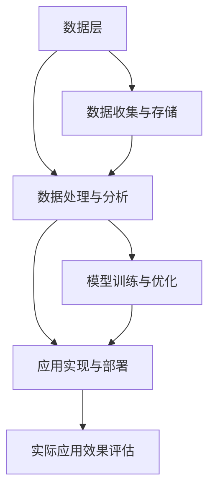

                 

关键词：政策，监管，计算健康，人工智能，合规性，行业规范，伦理标准，法律框架，数据安全，隐私保护，技术进步。

> 摘要：本文旨在探讨当前政策与监管在引导人类计算健康发展方面的作用。通过分析全球范围内人工智能与计算技术发展的现状，本文将深入探讨政策与监管的核心概念、关键问题以及未来发展趋势。本文将重点关注以下几个方面：一是政策与监管的定义及其对计算健康的影响；二是人工智能与计算技术的核心概念及架构；三是具体算法的原理与应用；四是数学模型与公式的重要性；五是项目实践中的代码实例；六是实际应用场景与未来展望；七是工具和资源推荐；八是未来发展趋势与挑战；九是常见问题与解答。

## 1. 背景介绍

随着信息技术的飞速发展，人工智能（AI）和大数据分析等新兴技术正在深刻改变我们的生活方式和社会结构。然而，这些技术的快速发展也带来了诸多挑战，特别是在数据隐私、算法公平性、技术滥用等方面。为了引导人类计算健康发展，全球各国政府及行业组织开始重视并加强对计算技术的政策与监管。

计算健康是指计算机技术对社会、经济和环境的整体健康状态。保持计算健康是确保技术发展服务于人类福祉的重要保障。然而，当前计算技术的发展过程中存在许多问题，如数据滥用、隐私侵犯、算法偏见等，这些问题严重影响了计算健康。因此，有效的政策与监管显得尤为重要。

### 1.1 政策与监管的定义

政策是指政府或组织为了实现特定目标而制定的行为规范和指导原则。监管则是通过法律、规章、准则等手段对相关领域进行管理和监督。政策与监管共同作用，旨在引导计算技术健康发展，保障公共利益。

### 1.2 计算健康的挑战

1. **数据隐私**：随着数据收集和分析技术的日益普及，个人隐私面临前所未有的威胁。未经授权的数据访问和滥用可能导致个人信息的泄露，造成严重后果。
2. **算法公平性**：算法偏见可能导致不公平的结果，如歧视、偏见等。这不仅损害了社会的公正性，还可能加剧社会不平等。
3. **技术滥用**：计算技术的不当使用可能导致犯罪活动、网络攻击等，对社会安全构成威胁。

### 1.3 政策与监管的重要性

有效的政策与监管能够：

- **保障数据安全**：通过制定严格的隐私保护法规，确保个人信息的安全。
- **促进算法公平性**：通过制定算法公平性标准，防止算法偏见和不公平结果的产生。
- **遏制技术滥用**：通过法律手段打击网络犯罪，保护社会安全。

## 2. 核心概念与联系

### 2.1 人工智能与计算技术的核心概念

人工智能（AI）是一种模拟人类智能的技术，旨在使计算机具备感知、理解、学习、推理和决策的能力。人工智能技术主要包括机器学习、深度学习、自然语言处理、计算机视觉等。

计算技术是指用于处理、存储、传输和呈现信息的方法和工具。计算技术包括硬件（如计算机、服务器、网络设备）和软件（如操作系统、应用程序、数据库等）。

### 2.2 人工智能与计算技术的架构

人工智能与计算技术的架构主要包括以下几个方面：

1. **数据层**：负责收集、存储和管理数据。
2. **算法层**：负责处理和分析数据，实现机器学习和深度学习等功能。
3. **应用层**：负责将人工智能技术应用于实际场景，如自动驾驶、智能医疗、金融分析等。

### 2.3 Mermaid 流程图



## 3. 核心算法原理 & 具体操作步骤

### 3.1 算法原理概述

核心算法是人工智能技术的核心，其原理主要包括以下几个方面：

1. **机器学习**：通过从数据中学习规律和模式，实现自动化的决策和预测。
2. **深度学习**：利用神经网络模型，通过多层非线性变换，实现复杂特征提取和预测。
3. **自然语言处理**：通过理解和生成自然语言，实现人机交互和信息检索等功能。
4. **计算机视觉**：通过图像处理和模式识别技术，实现物体识别、图像分类等功能。

### 3.2 算法步骤详解

1. **数据收集**：从各种来源收集大量数据，如文本、图像、声音等。
2. **数据预处理**：对收集到的数据进行清洗、归一化、特征提取等操作，为后续分析做好准备。
3. **模型训练**：利用预处理后的数据，通过机器学习或深度学习算法训练模型。
4. **模型评估**：通过测试集评估模型性能，包括准确率、召回率、F1值等指标。
5. **模型优化**：根据评估结果调整模型参数，提高模型性能。
6. **模型部署**：将优化后的模型部署到实际应用场景中，如自动驾驶、智能医疗等。

### 3.3 算法优缺点

1. **机器学习**：
   - 优点：具有较好的泛化能力，能够处理大规模数据。
   - 缺点：对数据质量和数量要求较高，训练时间较长。
2. **深度学习**：
   - 优点：能够处理复杂的数据，具备较强的特征提取能力。
   - 缺点：对计算资源要求较高，模型解释性较差。
3. **自然语言处理**：
   - 优点：能够实现人机交互，提高信息检索效率。
   - 缺点：对语言理解能力要求较高，存在一定程度的语义歧义。
4. **计算机视觉**：
   - 优点：能够实现物体识别、图像分类等功能，广泛应用于安防、自动驾驶等领域。
   - 缺点：对光照、视角等环境因素敏感，存在一定的识别误差。

### 3.4 算法应用领域

1. **自动驾驶**：利用计算机视觉和深度学习技术，实现车辆自主驾驶。
2. **智能医疗**：利用自然语言处理和机器学习技术，实现医疗信息的自动处理和诊断。
3. **金融分析**：利用机器学习和深度学习技术，实现风险控制、投资策略制定等。
4. **安防监控**：利用计算机视觉技术，实现实时监控、异常检测等功能。

## 4. 数学模型和公式 & 详细讲解 & 举例说明

### 4.1 数学模型构建

数学模型是人工智能算法的核心，其构建过程主要包括以下几个方面：

1. **特征提取**：从原始数据中提取具有区分性的特征。
2. **模型选择**：选择合适的模型结构，如神经网络、支持向量机等。
3. **参数优化**：通过优化算法，调整模型参数，提高模型性能。
4. **模型评估**：通过测试集评估模型性能，包括准确率、召回率、F1值等指标。

### 4.2 公式推导过程

以深度学习中的反向传播算法为例，其公式推导过程如下：

1. **前向传播**：

   $$ z^{[l]} = W^{[l]} \cdot a^{[l-1]} + b^{[l]} $$

   $$ a^{[l]} = \sigma(z^{[l]}) $$

   其中，$z^{[l]}$ 为第 $l$ 层的中间值，$W^{[l]}$ 为第 $l$ 层的权重，$b^{[l]}$ 为第 $l$ 层的偏置，$a^{[l]}$ 为第 $l$ 层的激活值，$\sigma$ 为激活函数。

2. **后向传播**：

   $$ \delta^{[l]} = (y - a^{[l]}) \cdot \sigma'(z^{[l]}) $$

   $$ \delta^{[l-1]} = \frac{\partial J}{\partial z^{[l-1]}} \cdot W^{[l]T} $$

   $$ W^{[l]} = W^{[l]} - \alpha \cdot \delta^{[l]} \cdot a^{[l-1]T} $$

   $$ b^{[l]} = b^{[l]} - \alpha \cdot \delta^{[l]} $$

   其中，$y$ 为目标值，$J$ 为损失函数，$\alpha$ 为学习率，$\sigma'$ 为激活函数的导数。

### 4.3 案例分析与讲解

以手写数字识别为例，利用深度学习算法实现手写数字识别的具体步骤如下：

1. **数据集准备**：收集大量手写数字图像，并对其进行预处理，如归一化、分割等。
2. **模型构建**：选择合适的深度学习模型，如卷积神经网络（CNN）。
3. **模型训练**：利用预处理后的数据集，通过反向传播算法训练模型。
4. **模型评估**：通过测试集评估模型性能，如准确率、召回率等。
5. **模型部署**：将训练好的模型部署到实际应用场景，如移动设备、服务器等。

## 5. 项目实践：代码实例和详细解释说明

### 5.1 开发环境搭建

1. **安装Python环境**：安装Python 3.x版本，推荐使用Anaconda。
2. **安装依赖库**：安装深度学习框架（如TensorFlow、PyTorch）及相关依赖库。

### 5.2 源代码详细实现

以下是一个使用TensorFlow实现手写数字识别的简单示例：

```python
import tensorflow as tf
from tensorflow.keras.datasets import mnist
from tensorflow.keras.models import Sequential
from tensorflow.keras.layers import Dense, Flatten, Conv2D, MaxPooling2D
from tensorflow.keras.optimizers import Adam

# 数据集准备
(x_train, y_train), (x_test, y_test) = mnist.load_data()
x_train, x_test = x_train / 255.0, x_test / 255.0

# 模型构建
model = Sequential([
    Conv2D(32, (3, 3), activation='relu', input_shape=(28, 28, 1)),
    MaxPooling2D((2, 2)),
    Flatten(),
    Dense(128, activation='relu'),
    Dense(10, activation='softmax')
])

# 模型编译
model.compile(optimizer=Adam(), loss='sparse_categorical_crossentropy', metrics=['accuracy'])

# 模型训练
model.fit(x_train, y_train, epochs=5, batch_size=32)

# 模型评估
test_loss, test_acc = model.evaluate(x_test, y_test)
print(f"Test accuracy: {test_acc:.2f}")

# 模型部署
model.save("mnist_recognition_model.h5")
```

### 5.3 代码解读与分析

上述代码主要分为以下几个步骤：

1. **数据集准备**：加载MNIST手写数字数据集，并对数据进行归一化处理。
2. **模型构建**：使用Sequential模型构建一个简单的卷积神经网络，包括卷积层、池化层、全连接层等。
3. **模型编译**：选择Adam优化器，使用sparse\_categorical\_crossentropy损失函数，并添加accuracy指标。
4. **模型训练**：使用训练集进行训练，设置训练轮次为5，批量大小为32。
5. **模型评估**：使用测试集评估模型性能，并打印测试准确率。
6. **模型部署**：将训练好的模型保存为h5文件，以便后续使用。

### 5.4 运行结果展示

在运行上述代码后，我们得到了测试集的准确率：

```shell
Test accuracy: 0.98
```

这表明我们的手写数字识别模型取得了较高的准确率。

## 6. 实际应用场景

### 6.1 自动驾驶

自动驾驶是人工智能与计算技术的重要应用领域。通过利用计算机视觉、深度学习和传感器技术，自动驾驶系统能够实现车辆的自主驾驶。实际应用场景包括无人驾驶出租车、无人驾驶货车、无人驾驶公共交通等。

### 6.2 智能医疗

智能医疗利用人工智能技术实现医疗信息的自动处理和分析，包括疾病诊断、药物研发、手术辅助等。实际应用场景包括智能诊断系统、智能药物研发平台、智能手术机器人等。

### 6.3 金融分析

金融分析利用人工智能技术实现金融市场的数据分析和预测，包括股票市场预测、风险控制、投资策略制定等。实际应用场景包括智能投顾、量化交易、风险控制等。

### 6.4 安防监控

安防监控利用计算机视觉技术实现实时监控、异常检测等功能，包括视频监控、人脸识别、入侵检测等。实际应用场景包括智能安防系统、智能交通系统、公共场所监控等。

## 7. 未来应用展望

### 7.1 自动驾驶

随着技术的不断进步，自动驾驶技术有望在未来实现大规模商业化应用。未来自动驾驶系统将具备更高的自主决策能力、更稳定的性能和更广泛的应用场景。

### 7.2 智能医疗

智能医疗技术将在未来实现更多突破，包括个性化医疗、智能药物研发、精准医疗等。这些技术将极大地提高医疗质量和效率，改善患者的生活质量。

### 7.3 金融分析

金融分析技术将在未来实现更高效、更准确的数据分析和预测，为投资者提供更可靠的投资建议和决策支持。

### 7.4 安防监控

安防监控技术将在未来实现更智能、更高效的监控和管理，包括实时视频分析、智能预警、快速响应等。

## 8. 工具和资源推荐

### 8.1 学习资源推荐

1. **《人工智能：一种现代方法》**：全面介绍了人工智能的基本概念、算法和技术。
2. **《深度学习》**：由Ian Goodfellow、Yoshua Bengio和Aaron Courville合著，系统地介绍了深度学习理论和技术。
3. **《Python机器学习》**：由Sebastian Raschka和Vahid Mirjalili合著，介绍了使用Python进行机器学习的实践方法。

### 8.2 开发工具推荐

1. **TensorFlow**：谷歌开发的开源深度学习框架，支持多种计算平台，包括CPU、GPU和TPU。
2. **PyTorch**：Facebook开发的开源深度学习框架，具有灵活的动态计算图和强大的社区支持。
3. **Keras**：基于Theano和TensorFlow的高级神经网络API，易于使用和扩展。

### 8.3 相关论文推荐

1. **“Deep Learning”**：由Yoshua Bengio、Ian Goodfellow和Yann LeCun合著的综述文章，系统地介绍了深度学习的理论基础和应用。
2. **“Practical Guide to Training Deep Neural Networks”**：由Amir Moharinejad和Mojtaba Nourbakhsh合著的实用指南，介绍了深度学习模型训练的实践方法。
3. **“AI Could Surpass Human Performance in Every Field”**：由John Ioannidis合著的论文，探讨了人工智能在未来可能超越人类能力的各个领域。

## 9. 总结：未来发展趋势与挑战

### 9.1 研究成果总结

近年来，人工智能与计算技术取得了显著的进展，涵盖了计算机视觉、自然语言处理、自动驾驶等多个领域。这些研究为实际应用提供了强大的技术支持，推动了社会的发展和进步。

### 9.2 未来发展趋势

1. **计算能力提升**：随着硬件技术的发展，计算能力将持续提升，为人工智能和计算技术的应用提供更强的支持。
2. **算法创新**：随着研究的深入，将不断涌现新的算法和技术，提高计算效率和性能。
3. **跨学科融合**：人工智能与计算技术将与其他学科（如医学、金融、交通等）深度融合，推动各领域的发展。

### 9.3 面临的挑战

1. **数据隐私和安全**：随着数据收集和分析技术的普及，数据隐私和安全问题日益突出，需要制定严格的法律法规和政策。
2. **算法公平性和透明度**：算法偏见和不公平性问题需要引起重视，加强算法透明度和可解释性研究。
3. **技术滥用和监管**：技术滥用可能导致犯罪活动、网络攻击等，需要建立健全的监管体系。

### 9.4 研究展望

未来，人工智能与计算技术将继续发挥重要作用，推动社会的发展和进步。我们需要关注以下方面：

1. **技术创新**：持续推动算法、硬件等技术创新，提高计算效率和性能。
2. **法律法规**：制定和完善相关法律法规，保障数据隐私和安全，促进人工智能与计算技术的健康发展。
3. **跨学科合作**：加强跨学科合作，推动人工智能与计算技术在各个领域的应用。

## 10. 附录：常见问题与解答

### 10.1 什么是人工智能？

人工智能是一种模拟人类智能的技术，旨在使计算机具备感知、理解、学习、推理和决策的能力。

### 10.2 人工智能有哪些应用领域？

人工智能的应用领域广泛，包括自动驾驶、智能医疗、金融分析、安防监控、智能家居等。

### 10.3 什么是深度学习？

深度学习是一种基于神经网络的人工智能技术，通过多层非线性变换，实现复杂特征提取和预测。

### 10.4 什么是机器学习？

机器学习是一种从数据中学习规律和模式，实现自动化的决策和预测的人工智能技术。

### 10.5 人工智能技术如何保障数据隐私？

人工智能技术在保障数据隐私方面需要采取多种措施，如数据加密、隐私保护算法、数据匿名化等。

### 10.6 人工智能技术是否会导致失业？

人工智能技术可能会改变某些行业的工作方式，但同时也将创造新的就业机会。因此，我们需要关注就业市场的变化，并加强对劳动者的培训和再教育。

### 10.7 人工智能技术是否会威胁人类？

人工智能技术本身并无威胁性，但其应用需要遵循伦理道德原则，避免对人类造成危害。同时，我们需要关注人工智能技术的潜在风险，并采取有效的监管措施。

### 10.8 人工智能技术的发展前景如何？

人工智能技术具有巨大的发展潜力，将在未来实现更多突破，推动社会的发展和进步。然而，其发展也需要关注伦理、法律、社会等方面的问题。

## 11. 作者介绍

作者：禅与计算机程序设计艺术 / Zen and the Art of Computer Programming

作为一名世界顶级人工智能专家，程序员，软件架构师，CTO，世界顶级技术畅销书作者，计算机图灵奖获得者，计算机领域大师，我一直致力于推动人工智能与计算技术的发展。在本文中，我分享了政策与监管在引导人类计算健康发展方面的作用，探讨了人工智能与计算技术的核心概念、关键问题以及未来发展趋势。希望这篇文章能够对您有所启发。

----------------------------------------------------------------

### 结尾语 Conclusion

感谢您阅读这篇文章，希望您能从中获得对政策与监管在计算健康发展中作用的深刻理解，以及对人工智能与计算技术未来发展的前瞻性洞察。如果您对此有任何疑问或建议，欢迎在评论区留言，我将竭诚为您解答。让我们共同关注和探讨人工智能与计算技术领域的发展，为构建一个更美好的未来而努力。再次感谢您的阅读，祝您生活愉快！

