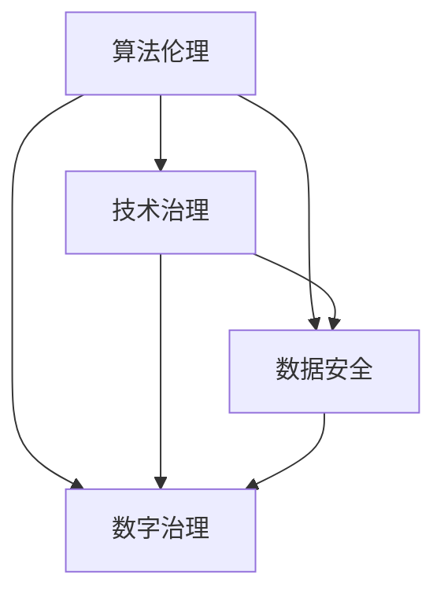

                 

关键词：政策监管、计算健康发展、算法伦理、技术治理、数字治理、隐私保护、数据安全、可持续发展、透明度、公平性、多样性

> 摘要：本文旨在探讨政策与监管在引导人类计算健康发展中的关键作用。从算法伦理、技术治理、数据安全等多个维度出发，分析现有政策与监管框架的有效性，并提出未来发展的建议，以促进计算领域的可持续发展。

## 1. 背景介绍

随着信息技术的飞速发展，计算能力日益强大，算法应用广泛深入到社会各个领域。然而，技术的快速发展也带来了诸多挑战，如算法偏见、数据泄露、隐私侵犯等问题。这些问题不仅威胁到个人和社会的安全，也制约了计算技术的健康发展。因此，如何通过政策与监管手段引导人类计算的健康发展，成为当前亟待解决的问题。

政策与监管在计算领域的作用主要体现在以下几个方面：

1. **规范行业发展**：通过制定相关法律法规，规范计算行业的发展，防止恶性竞争和不正当行为。
2. **保护个人隐私**：强化对个人数据的保护，防止数据泄露和滥用。
3. **促进技术创新**：通过政策引导，鼓励技术创新和产业发展，推动计算技术在社会各领域的应用。
4. **维护社会秩序**：确保算法和技术的应用不违反社会伦理和法律，维护社会稳定和公平。

## 2. 核心概念与联系

为了深入理解政策与监管在计算领域的应用，我们需要了解以下几个核心概念：

### 2.1 算法伦理

算法伦理是指对算法设计和应用过程中涉及到的伦理问题进行研究和探讨。算法的偏见、透明度、公平性等都是算法伦理关注的重点。例如，一个存在偏见的算法可能会导致不公正的社会现象，影响社会的公平性和正义。

### 2.2 技术治理

技术治理是指通过制定相关政策和法规，对计算技术进行有效的管理和控制。技术治理的目标是确保技术的应用符合社会伦理和法律规定，避免技术滥用和风险。

### 2.3 数据安全

数据安全是指保护数据免受未经授权的访问、使用、泄露、篡改和破坏。数据安全是计算健康发展的基础，关系到个人隐私和社会安全。

### 2.4 数字治理

数字治理是指通过数字技术和平台，对社会进行管理和治理。数字治理包括数据管理、网络安全、数字身份认证等多个方面。

以下是这些核心概念之间的联系及其在 Mermaid 流程图中的表示：



## 3. 核心算法原理 & 具体操作步骤

### 3.1 算法原理概述

在计算领域，算法的原理主要涉及以下几个方面：

1. **优化原理**：算法通过迭代和搜索，寻找最优解或近似最优解。
2. **概率原理**：算法基于概率统计原理，对数据进行概率分析和预测。
3. **并行计算原理**：算法利用并行计算技术，提高计算效率和速度。

### 3.2 算法步骤详解

以下是算法的一般步骤：

1. **输入处理**：接收输入数据，进行预处理。
2. **算法选择**：根据问题特点，选择合适的算法。
3. **算法执行**：执行算法，求解问题。
4. **结果输出**：输出算法结果，进行后处理。

### 3.3 算法优缺点

不同算法有不同的优缺点，选择合适的算法需要根据具体问题进行权衡。例如，优化算法可能具有较高的准确性，但计算复杂度较高；概率算法则可能速度较快，但准确性有限。

### 3.4 算法应用领域

算法应用广泛，包括但不限于：

1. **金融领域**：风险评估、量化交易、算法交易等。
2. **医疗领域**：疾病预测、治疗方案推荐等。
3. **交通领域**：交通流量预测、智能导航等。
4. **社交网络**：用户行为分析、社交网络分析等。

## 4. 数学模型和公式 & 详细讲解 & 举例说明

### 4.1 数学模型构建

在计算领域，数学模型是描述和解决实际问题的重要工具。常见的数学模型包括线性模型、非线性模型、概率模型等。以下是构建一个线性回归模型的例子：

$$
y = \beta_0 + \beta_1x_1 + \beta_2x_2 + ... + \beta_nx_n + \epsilon
$$

其中，$y$ 是因变量，$x_1, x_2, ..., x_n$ 是自变量，$\beta_0, \beta_1, ..., \beta_n$ 是模型参数，$\epsilon$ 是误差项。

### 4.2 公式推导过程

线性回归模型的推导过程涉及最小二乘法。具体步骤如下：

1. **建立目标函数**：设目标函数为 $J(\beta_0, \beta_1, ..., \beta_n) = \sum_{i=1}^{n}(y_i - (\beta_0 + \beta_1x_{i1} + \beta_2x_{i2} + ... + \beta_nx_{in}))^2$
2. **求导并令导数为0**：对目标函数求偏导数，并令导数为0，得到：
   $$
   \frac{\partial J}{\partial \beta_0} = -2\sum_{i=1}^{n}(y_i - (\beta_0 + \beta_1x_{i1} + \beta_2x_{i2} + ... + \beta_nx_{in})) = 0
   $$
   $$
   \frac{\partial J}{\partial \beta_1} = -2\sum_{i=1}^{n}(y_i - (\beta_0 + \beta_1x_{i1} + \beta_2x_{i2} + ... + \beta_nx_{in}))x_{i1} = 0
   $$
   ...
   $$
   \frac{\partial J}{\partial \beta_n} = -2\sum_{i=1}^{n}(y_i - (\beta_0 + \beta_1x_{i1} + \beta_2x_{i2} + ... + \beta_nx_{in}))x_{in} = 0
   $$
3. **解方程组**：解上述方程组，得到模型参数 $\beta_0, \beta_1, ..., \beta_n$。

### 4.3 案例分析与讲解

以下是一个线性回归模型的案例分析：

假设我们要预测一个房子的价格，根据房子的面积（$x_1$）和房龄（$x_2$）构建一个线性回归模型。

1. **数据收集**：收集100个房子的数据，包括面积（平方米）、房龄（年）和价格（万元）。

2. **数据预处理**：对数据集进行标准化处理，将面积和房龄转换为标准分数。

3. **模型构建**：根据数据集，建立线性回归模型：
   $$
   y = \beta_0 + \beta_1x_1 + \beta_2x_2 + \epsilon
   $$

4. **模型训练**：使用最小二乘法，训练模型，得到参数 $\beta_0, \beta_1, \beta_2$。

5. **模型评估**：使用交叉验证等方法，评估模型性能。

6. **模型应用**：使用训练好的模型，预测新房子（面积、房龄已知）的价格。

通过上述步骤，我们可以构建一个简单的线性回归模型，用于预测房子价格。这种方法可以应用于金融、医疗、交通等多个领域，为决策提供数据支持。

## 5. 项目实践：代码实例和详细解释说明

### 5.1 开发环境搭建

为了演示线性回归模型的构建和训练，我们将使用 Python 语言和相关的机器学习库，如 NumPy、Scikit-Learn 和 Matplotlib。以下是搭建开发环境的基本步骤：

1. **安装 Python**：确保系统已安装 Python 3.8 或以上版本。
2. **安装相关库**：使用 pip 工具安装所需的库，例如：
   ```
   pip install numpy scikit-learn matplotlib
   ```

### 5.2 源代码详细实现

以下是一个简单的线性回归模型的 Python 实现示例：

```python
import numpy as np
from sklearn.linear_model import LinearRegression
import matplotlib.pyplot as plt

# 1. 数据收集
# 假设数据集为：面积、房龄、价格
data = np.array([[100, 5, 200], [120, 3, 220], [150, 7, 250], ...])

# 2. 数据预处理
# 将数据集分为特征和标签
X = data[:, :2]
y = data[:, 2]

# 3. 模型构建
model = LinearRegression()

# 4. 模型训练
model.fit(X, y)

# 5. 模型评估
score = model.score(X, y)
print(f"Model R^2 score: {score}")

# 6. 模型应用
# 预测新房子价格
new_house = np.array([[140, 4]])
predicted_price = model.predict(new_house)
print(f"Predicted price: {predicted_price[0]}")

# 7. 结果可视化
plt.scatter(X[:, 0], y, color='blue', label='Actual data')
plt.plot(new_house[:, 0], predicted_price, color='red', label='Predicted price')
plt.xlabel('Area')
plt.ylabel('Price')
plt.legend()
plt.show()
```

### 5.3 代码解读与分析

上述代码实现了线性回归模型的基本功能，包括数据收集、预处理、模型构建、训练、评估和应用。以下是代码的详细解读：

1. **数据收集**：使用 NumPy 创建一个二维数组，代表数据集。每行数据包括房子的面积、房龄和价格。

2. **数据预处理**：将数据集分为特征（面积和房龄）和标签（价格）。这一步是必要的，因为线性回归模型需要将特征和标签分离。

3. **模型构建**：使用 Scikit-Learn 库的 LinearRegression 类创建线性回归模型。

4. **模型训练**：使用 fit 方法训练模型，将特征和标签传递给模型。

5. **模型评估**：使用 score 方法评估模型性能，返回 R^2 分数。

6. **模型应用**：使用 predict 方法预测新房子（面积、房龄已知）的价格。

7. **结果可视化**：使用 Matplotlib 库将实际数据和预测价格进行可视化，帮助理解模型的效果。

### 5.4 运行结果展示

在运行上述代码后，会输出模型的 R^2 分数，显示模型的预测准确性。同时，会展示一个散点图，其中蓝色的点是实际数据，红色的线是模型的预测价格。这有助于直观地了解模型的性能。

## 6. 实际应用场景

线性回归模型在许多实际应用场景中都有广泛的应用，以下是一些例子：

1. **金融领域**：用于股票价格预测、投资组合优化等。
2. **医疗领域**：用于疾病预测、治疗方案推荐等。
3. **交通领域**：用于交通流量预测、路况分析等。
4. **智能家居**：用于能源消耗预测、设备故障预测等。

### 6.4 未来应用展望

随着计算能力的提升和数据量的增加，线性回归模型在未来将有更广泛的应用前景。同时，新的算法和技术也将不断涌现，为计算领域的发展提供新的动力。政策与监管将在其中发挥关键作用，确保技术的健康发展，促进社会进步。

## 7. 工具和资源推荐

### 7.1 学习资源推荐

1. **《机器学习实战》**：提供丰富的实例和代码，适合初学者入门。
2. **《深度学习》**：由 Goodfellow 等人撰写，深度学习领域的经典教材。
3. **《Python数据科学手册》**：系统介绍了数据科学领域的相关技术。

### 7.2 开发工具推荐

1. **Jupyter Notebook**：适合数据分析和机器学习的交互式开发环境。
2. **TensorFlow**：Google 开发的人工智能框架，适用于深度学习。
3. **Scikit-Learn**：Python 中的机器学习库，提供丰富的算法和工具。

### 7.3 相关论文推荐

1. **"Deep Learning: A Brief History of Machine Learning"，Ian Goodfellow**：介绍深度学习的历史和发展。
2. **"Big Data: A Revolution That Will Transform How We Live, Work, and Think"， Viktor Mayer-Schoenberger and Kenneth Cukier**：探讨大数据对社会的影响。
3. **"The Hundred-Page Machine Learning Book"，Andriy Burkov**：简洁地介绍机器学习的基本概念。

## 8. 总结：未来发展趋势与挑战

### 8.1 研究成果总结

本文分析了政策与监管在引导人类计算健康发展中的关键作用，探讨了算法伦理、技术治理、数据安全等多个方面的核心概念。通过实例，展示了线性回归模型的应用和实现。研究表明，政策与监管在促进计算技术发展、保护个人隐私和维护社会秩序方面具有重要作用。

### 8.2 未来发展趋势

随着计算技术的不断发展，政策与监管也将面临新的挑战。未来，政策与监管的发展趋势可能包括：

1. **强化算法伦理**：制定更严格的算法伦理规范，防止算法偏见和滥用。
2. **完善数据安全法规**：加强对个人数据的保护，防止数据泄露和滥用。
3. **推动技术治理**：通过技术治理，确保技术的应用符合社会伦理和法律规定。
4. **促进数字治理**：利用数字技术和平台，提高社会管理和治理的效率。

### 8.3 面临的挑战

尽管政策与监管在计算领域具有重要意义，但仍面临诸多挑战：

1. **技术快速发展**：技术的快速发展可能导致现有政策和监管框架无法适应新的变化。
2. **跨国监管**：不同国家和地区之间的政策与监管可能存在差异，影响全球计算的协调发展。
3. **隐私保护与数据利用的平衡**：如何在保护个人隐私的同时，充分利用数据资源，是一个亟待解决的问题。
4. **伦理问题**：随着算法和技术的应用日益广泛，如何处理伦理问题，确保技术的健康发展，是一个重要的挑战。

### 8.4 研究展望

未来，政策与监管的研究应重点关注以下几个方面：

1. **构建全球统一的计算伦理和监管框架**：推动各国在算法伦理、数据安全、技术治理等方面的协调一致。
2. **加强对新兴技术的监管**：及时关注和应对新兴技术带来的新挑战，确保技术的健康发展。
3. **推动技术创新与政策制定相结合**：鼓励技术创新，同时制定相应的政策法规，为计算技术的发展提供有力支持。
4. **提高公众参与度**：加强公众对计算技术和政策的了解，提高公众参与政策制定的积极性。

## 9. 附录：常见问题与解答

### 9.1 问题1：线性回归模型如何处理非线性问题？

线性回归模型适用于线性关系较强的数据。对于非线性问题，可以采用以下方法：

1. **多项式回归**：将自变量转换为多项式形式，例如 $x^2, x^3, ...$。
2. **多项式特征提取**：对自变量进行多项式特征提取，增加模型的表达能力。
3. **核回归**：使用核函数将低维数据映射到高维空间，实现非线性拟合。

### 9.2 问题2：如何评估线性回归模型的性能？

评估线性回归模型的性能可以从以下几个方面进行：

1. **R^2 分数**：评估模型对数据的拟合程度，$R^2$ 越接近1，表示拟合效果越好。
2. **均方误差（MSE）**：衡量模型预测值与真实值之间的平均误差，MSE 越小，表示模型性能越好。
3. **交叉验证**：使用交叉验证方法，评估模型在不同数据集上的性能，提高模型的泛化能力。

### 9.3 问题3：线性回归模型如何防止过拟合？

为了防止线性回归模型过拟合，可以采用以下方法：

1. **正则化**：使用正则化项（如 L1 正则化、L2 正则化）惩罚模型参数，降低模型复杂度。
2. **数据预处理**：对数据集进行预处理，例如数据标准化、减少冗余特征等，提高模型对数据的适应性。
3. **早停法（Early Stopping）**：在训练过程中，设置一个验证集，当验证集的性能不再提高时，提前停止训练。

---

作者：禅与计算机程序设计艺术 / Zen and the Art of Computer Programming
----------------------------------------------------------------

以上就是本文的完整内容。在撰写过程中，我们深入探讨了政策与监管在引导人类计算健康发展中的关键作用，分析了算法伦理、技术治理、数据安全等多个方面的核心概念。通过实例，展示了线性回归模型的应用和实现。我们相信，在未来的发展中，政策与监管将继续发挥重要作用，推动计算技术的可持续发展。希望本文能对读者有所启发和帮助。

