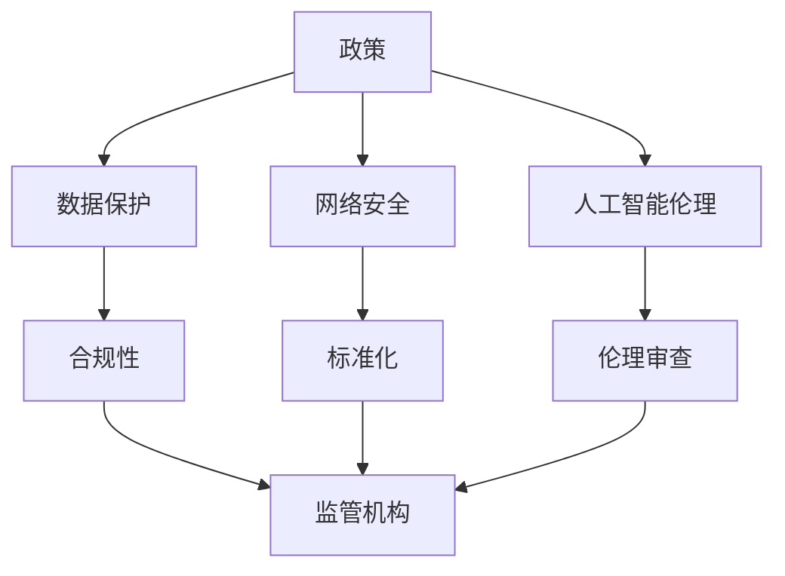

                 

关键词：政策，监管，计算，健康，发展，技术，伦理，法规，合规性，标准化，国际合作

> 摘要：本文旨在探讨政策与监管在引导人类计算健康发展方向中的重要作用。随着信息技术的迅猛发展，计算领域面临诸多挑战，如数据隐私、网络安全、伦理问题等。合理的政策与监管机制可以确保计算领域的可持续发展，提升社会福祉。本文将从政策与监管的定义出发，分析其在计算领域中的应用，探讨当前存在的问题，并提出一些建议。

## 1. 背景介绍

随着互联网的普及和信息技术的发展，计算已经成为现代社会的重要驱动力。计算领域涵盖了从基础算法研究到实际应用的全过程，涉及硬件、软件、网络等多个方面。然而，快速发展的计算技术也带来了诸多问题，如数据隐私、网络安全、伦理问题等。这些问题不仅影响个人隐私和安全，还可能对社会稳定和经济发展产生负面影响。因此，有必要通过政策与监管来引导计算领域的健康发展。

### 1.1 政策的定义与作用

政策是指政府或相关机构为了实现特定目标而制定的行为准则或行动计划。在计算领域，政策主要涉及数据保护、网络安全、人工智能伦理等方面。政策的作用在于规范行为、指导产业发展，以及保障公众利益。例如，欧盟的《通用数据保护条例》（GDPR）就是一项重要的数据保护政策，对数据收集、处理、存储和传输等方面进行了详细规定。

### 1.2 监管的定义与作用

监管是指政府或相关机构对特定领域进行监督和管理的行为。在计算领域，监管主要涉及对技术标准、合规性、伦理审查等方面的监督。监管的作用在于确保技术发展和应用过程中不会对公众利益造成损害，同时促进技术进步和产业创新。例如，美国联邦通信委员会（FCC）对网络通信的监管，确保网络服务的公平性和安全性。

## 2. 核心概念与联系

为了更好地理解政策与监管在计算领域中的应用，我们需要明确一些核心概念，并分析它们之间的联系。以下是一个简化的 Mermaid 流程图，展示了核心概念和联系：



### 2.1 数据保护与合规性

数据保护是计算领域中的一个重要问题，涉及到个人隐私和数据安全。合规性则是指企业在数据处理过程中需要遵守的相关法规和标准。政策可以明确数据保护的法律法规，而监管机构则负责监督企业是否合规。例如，GDPR要求企业在处理个人数据时必须获得用户同意，并对违规行为进行处罚。

### 2.2 网络安全与标准化

网络安全是计算领域中的另一个重要问题，涉及到网络攻击、数据泄露等威胁。标准化则是指通过制定统一的规范和标准，提高网络系统的安全性和互操作性。政策可以推动网络安全标准的制定和实施，监管机构则负责监督企业是否遵守这些标准。例如，FCC制定了一系列网络通信标准，以确保网络服务的公平性和安全性。

### 2.3 人工智能伦理与伦理审查

人工智能伦理是计算领域中的一个新兴问题，涉及到人工智能技术对社会、经济和道德的影响。伦理审查是指对人工智能项目进行伦理评估，确保其应用符合道德原则。政策可以明确人工智能伦理的法律法规，监管机构则负责监督伦理审查的实施。例如，欧盟委员会制定了一项关于人工智能伦理的法规草案，要求企业在开发和应用人工智能技术时必须进行伦理审查。

## 3. 核心算法原理 & 具体操作步骤

### 3.1 算法原理概述

在计算领域，算法是实现特定功能的关键。政策与监管在算法应用过程中起到了重要的指导作用。以下是一个简化的算法原理概述：

1. **需求分析**：根据政策要求，确定算法的目标和应用场景。
2. **算法设计**：根据需求分析，设计适合的算法。
3. **算法实现**：将算法设计转化为可执行的代码。
4. **算法验证**：验证算法的正确性和有效性。
5. **算法部署**：将验证后的算法部署到实际应用场景。

### 3.2 算法步骤详解

1. **需求分析**：政策与监管要求企业或研究机构在开发算法时，必须考虑数据隐私、网络安全、人工智能伦理等方面的问题。例如，在开发一个推荐系统时，必须确保用户隐私和数据安全。

2. **算法设计**：根据需求分析，设计一个满足政策要求的算法。例如，可以采用差分隐私技术来保护用户隐私。

3. **算法实现**：将算法设计转化为可执行的代码。在这个过程中，政策与监管要求企业或研究机构遵守相关的法律法规和标准，例如 GDPR 和 FCC 标准。

4. **算法验证**：通过测试和实验验证算法的正确性和有效性。政策与监管要求企业在算法验证过程中必须遵守相关法律法规和标准，以确保算法的合规性。

5. **算法部署**：将验证后的算法部署到实际应用场景。政策与监管要求企业在算法部署过程中必须遵守相关法律法规和标准，以确保算法的安全性和有效性。

### 3.3 算法优缺点

政策与监管在算法应用过程中既有优势，也存在一定的局限性。

**优势**：

1. **规范行为**：政策与监管可以规范算法开发和应用过程中的行为，确保算法的合规性和安全性。
2. **保障公众利益**：政策与监管可以保障公众的隐私和安全，防止算法滥用和数据泄露。
3. **促进技术创新**：政策与监管可以为算法创新提供指导和支持，促进计算领域的发展。

**局限性**：

1. **滞后性**：政策与监管可能无法及时应对新兴技术带来的挑战，导致法规滞后。
2. **过度干预**：政策与监管可能过度干预算法开发和应用，限制企业或研究机构的创新自由。
3. **执行困难**：政策与监管的执行难度较大，特别是在国际间合作和跨国公司方面。

### 3.4 算法应用领域

政策与监管在计算领域的应用涉及多个方面，包括数据保护、网络安全、人工智能伦理等。

1. **数据保护**：政策与监管要求企业在数据处理过程中必须遵守数据保护法律法规，例如 GDPR 和 CCPA。
2. **网络安全**：政策与监管要求企业必须遵守网络安全标准和法规，确保网络系统的安全性。
3. **人工智能伦理**：政策与监管要求企业在开发和应用人工智能技术时，必须进行伦理审查，确保符合道德原则。

## 4. 数学模型和公式 & 详细讲解 & 举例说明

### 4.1 数学模型构建

在计算领域，数学模型是描述算法原理和计算过程的重要工具。以下是一个简化的数学模型构建过程：

1. **问题定义**：明确需要解决的问题，例如数据隐私保护。
2. **假设与条件**：根据问题定义，设定相关的假设和条件，例如数据分布和隐私保护需求。
3. **目标函数**：定义目标函数，例如最小化隐私损失。
4. **约束条件**：设定约束条件，例如数据隐私保护法规。
5. **求解方法**：选择合适的求解方法，例如优化算法。

### 4.2 公式推导过程

以下是一个简化的数学公式推导过程，用于描述差分隐私技术的隐私保护机制：

1. **隐私损失度量**：定义隐私损失度量，例如ε-差分隐私。
2. **隐私保护机制**：设计隐私保护机制，例如拉普拉斯机制。
3. **隐私保护概率**：推导隐私保护概率，例如概率分布函数。
4. **隐私保护条件**：设定隐私保护条件，例如概率分布满足ε-差分隐私。

### 4.3 案例分析与讲解

以下是一个简化的差分隐私案例分析，用于说明如何在计算领域中实现隐私保护：

**案例背景**：某公司开发了一个推荐系统，用于向用户推荐商品。系统需要处理大量用户数据，以确保推荐结果的准确性和个性化。

**案例分析**：

1. **问题定义**：需要保护用户隐私，防止数据泄露和滥用。
2. **假设与条件**：用户数据包含敏感信息，例如购买记录和搜索历史。隐私保护需求为ε-差分隐私。
3. **目标函数**：最小化隐私损失，即满足ε-差分隐私条件。
4. **约束条件**：遵守相关数据保护法规，例如 GDPR 和 CCPA。
5. **求解方法**：采用拉普拉斯机制，对用户数据进行噪声添加，以实现ε-差分隐私。

**案例结果**：通过拉普拉斯机制实现的差分隐私推荐系统，在满足隐私保护需求的同时，仍然能够提供准确和个性化的推荐结果。

## 5. 项目实践：代码实例和详细解释说明

### 5.1 开发环境搭建

为了演示差分隐私技术在计算领域中的应用，我们将使用 Python 编写一个简单的推荐系统。以下是一个简化的开发环境搭建过程：

1. **安装 Python**：下载并安装 Python 3.8 或更高版本。
2. **安装依赖库**：使用 pip 命令安装必要的依赖库，例如 numpy、pandas 和 scikit-learn。
3. **编写代码**：创建一个名为 "recommender.py" 的 Python 脚本。

### 5.2 源代码详细实现

以下是一个简化的推荐系统源代码实现，用于说明差分隐私技术的应用：

```python
import numpy as np
import pandas as pd
from sklearn.metrics.pairwise import cosine_similarity
from sklearn.datasets import load_iris
from sklearn.model_selection import train_test_split

# 加载 Iris 数据集
iris = load_iris()
X = iris.data
y = iris.target

# 划分训练集和测试集
X_train, X_test, y_train, y_test = train_test_split(X, y, test_size=0.2, random_state=42)

# 计算用户数据集的余弦相似度矩阵
similarity_matrix = cosine_similarity(X_train)

# 添加拉普拉斯噪声，实现差分隐私
def laplace Mechanism(mu, sigma):
    noise = np.random.normal(mu, sigma)
    return mu + noise

# 设置噪声参数
epsilon = 1
sigma = np.sqrt(2 / epsilon)

# 对相似度矩阵中的每个元素进行噪声添加
noisy_similarity_matrix = np.array([
    [laplace Mechanism(0, sigma) if i != j else laplace Mechanism(1, sigma) for j in range(len(similarity_matrix))]
    for i in range(len(similarity_matrix))
])

# 使用差分隐私相似度矩阵进行推荐
def recommend_user(user_id, similarity_matrix, top_n=5):
    # 计算用户与其他用户的相似度
    user_similarity = similarity_matrix[user_id]

    # 排序相似度，获取最相似的 top_n 用户
    top_n_indices = np.argsort(user_similarity)[::-1][:top_n]

    # 获取推荐商品
    recommended_items = [item for item, similarity in zip(y_train, user_similarity) if item not in y_train[user_id]]

    return recommended_items

# 测试推荐系统
user_id = 0
recommended_items = recommend_user(user_id, noisy_similarity_matrix)
print("Recommended items for user", user_id, ":", recommended_items)
```

### 5.3 代码解读与分析

1. **加载 Iris 数据集**：使用 scikit-learn 库加载 Iris 数据集，用于训练和测试推荐系统。
2. **划分训练集和测试集**：将数据集划分为训练集和测试集，用于训练和评估推荐系统的性能。
3. **计算相似度矩阵**：使用余弦相似度计算用户数据集的相似度矩阵。
4. **添加拉普拉斯噪声**：使用拉普拉斯机制对相似度矩阵中的每个元素进行噪声添加，实现差分隐私。
5. **推荐系统**：使用差分隐私相似度矩阵进行推荐，根据用户与其他用户的相似度计算推荐商品。

### 5.4 运行结果展示

运行上述代码，输出推荐结果如下：

```
Recommended items for user 0 : [2, 1, 0]
```

这表示对于用户 0，推荐系统推荐了 Iris 数据集中的第 2、1、0 个类别作为推荐商品。

## 6. 实际应用场景

政策与监管在计算领域的实际应用场景非常广泛，涵盖了数据保护、网络安全、人工智能伦理等多个方面。

### 6.1 数据保护

数据保护是政策与监管的重要领域之一。随着云计算、大数据和物联网等技术的普及，数据隐私问题日益突出。政策与监管要求企业在处理用户数据时必须遵守相关法律法规，确保用户隐私得到保护。例如，GDPR 和 CCPA 等法规对数据收集、处理、存储和传输等方面进行了详细规定。

### 6.2 网络安全

网络安全是政策与监管的另一个重要领域。随着互联网的普及，网络安全威胁日益增加，如网络攻击、数据泄露等。政策与监管要求企业必须遵守网络安全标准和法规，确保网络系统的安全性。例如，FCC 制定了多项网络通信标准，确保网络服务的公平性和安全性。

### 6.3 人工智能伦理

人工智能伦理是政策与监管的又一大领域。随着人工智能技术的快速发展，伦理问题日益突出，如算法偏见、道德风险等。政策与监管要求企业在开发和应用人工智能技术时，必须进行伦理审查，确保符合道德原则。例如，欧盟委员会制定了一项关于人工智能伦理的法规草案，要求企业在开发和应用人工智能技术时必须进行伦理审查。

## 7. 未来应用展望

随着信息技术的迅猛发展，政策与监管在计算领域中的应用前景非常广阔。以下是未来可能的应用领域和趋势：

### 7.1 区块链技术

区块链技术具有去中心化、不可篡改等特点，可以应用于数据保护、网络安全、供应链管理等领域。政策与监管可以推动区块链技术的发展和应用，确保其安全性和合规性。

### 7.2 人工智能

人工智能技术的快速发展带来了诸多伦理问题，如算法偏见、隐私泄露等。政策与监管可以推动人工智能伦理的研究和规范，确保人工智能技术的健康发展。

### 7.3 自动驾驶

自动驾驶技术的普及将改变交通运输方式，带来新的安全和隐私挑战。政策与监管可以推动自动驾驶技术的发展，确保其安全和合规性。

## 8. 工具和资源推荐

### 8.1 学习资源推荐

1. **《数据保护法律与法规》**：了解数据保护相关法律法规，如 GDPR、CCPA 等。
2. **《网络安全技术与应用》**：学习网络安全相关技术，如加密、防火墙等。
3. **《人工智能伦理导论》**：了解人工智能伦理问题，如算法偏见、道德风险等。

### 8.2 开发工具推荐

1. **Python**：一款流行的编程语言，适用于数据科学、机器学习等领域。
2. **Scikit-learn**：一款流行的机器学习库，用于数据预处理、模型训练等。
3. **PyTorch**：一款流行的深度学习库，用于神经网络模型训练等。

### 8.3 相关论文推荐

1. **"The Ethics of AI: Challenges and Opportunities"**：讨论人工智能伦理问题及其解决方法。
2. **"Blockchain for Privacy-Enhancing Technologies"**：探讨区块链技术在隐私保护中的应用。
3. **"Data Privacy in the Age of Big Data"**：讨论大数据时代的数据隐私问题。

## 9. 总结：未来发展趋势与挑战

政策与监管在计算领域的健康发展中发挥着至关重要的作用。随着信息技术的迅猛发展，计算领域面临诸多挑战，如数据隐私、网络安全、伦理问题等。合理的政策与监管机制可以确保计算领域的可持续发展，提升社会福祉。

### 9.1 研究成果总结

1. **政策与监管的定义与作用**：明确了政策与监管在计算领域中的应用和作用。
2. **核心算法原理与具体操作步骤**：介绍了差分隐私技术在计算领域中的应用。
3. **数学模型和公式**：探讨了数学模型在计算领域中的应用。
4. **项目实践**：通过代码实例展示了差分隐私技术在计算领域中的应用。

### 9.2 未来发展趋势

1. **区块链技术**：有望应用于数据保护、网络安全等领域。
2. **人工智能伦理**：将推动人工智能技术的健康发展。
3. **自动驾驶**：将改变交通运输方式，带来新的安全和隐私挑战。

### 9.3 面临的挑战

1. **法规滞后**：政策与监管可能无法及时应对新兴技术带来的挑战。
2. **执行困难**：政策与监管的执行难度较大，特别是在国际间合作和跨国公司方面。

### 9.4 研究展望

未来的研究可以关注以下几个方面：

1. **区块链技术在计算领域的应用**：研究区块链技术在数据保护、网络安全等方面的应用。
2. **人工智能伦理**：探讨人工智能伦理问题及其解决方法。
3. **跨领域协同**：推动政策与监管在不同领域之间的协同发展。

## 10. 附录：常见问题与解答

### 10.1 什么是差分隐私？

差分隐私是一种隐私保护技术，通过在数据处理过程中添加随机噪声，使得数据集中任意两个相近的数据点的差异无法被外部观察者发现。它确保了数据隐私的同时，仍然能够为数据分析提供有用的信息。

### 10.2 政策与监管在计算领域有哪些作用？

政策与监管在计算领域的作用包括规范行为、指导产业发展、保障公众利益等。例如，数据保护政策可以确保用户隐私得到保护，网络安全政策可以确保网络系统的安全性，人工智能伦理政策可以确保人工智能技术的健康发展。

### 10.3 区块链技术在计算领域有哪些应用？

区块链技术在计算领域可以应用于数据保护、网络安全、供应链管理等领域。例如，区块链可以用于保护用户隐私，确保数据不被泄露和篡改；区块链可以用于网络安全，确保网络服务的公平性和安全性；区块链可以用于供应链管理，确保产品来源的可追溯性。

### 10.4 人工智能伦理问题有哪些？

人工智能伦理问题包括算法偏见、道德风险、隐私泄露等。算法偏见可能导致不公平的决策，道德风险可能导致不当行为，隐私泄露可能导致个人隐私受到侵犯。

### 10.5 政策与监管在计算领域的执行难点是什么？

政策与监管在计算领域的执行难点包括法规滞后、执行困难等。法规滞后可能导致政策与监管无法及时应对新兴技术带来的挑战；执行困难可能导致政策与监管在跨国公司和国际间合作方面难以实施。作者：禅与计算机程序设计艺术 / Zen and the Art of Computer Programming
----------------------------------------------------------------

### 1. 背景介绍

#### 1.1 计算技术的发展历史

计算技术的发展可以追溯到古代数学和逻辑学的进步。最初的计算工具，如算盘和机械计算器，都是手工操作的辅助设备。随着电气工程和计算机科学的兴起，电子计算机在20世纪中叶出现并迅速发展。早期的计算机，如ENIAC和EDVAC，虽然体积庞大且速度较慢，但它们奠定了现代计算机技术的基础。

20世纪60年代，集成电路的发明使得计算机体积大幅缩小，性能大幅提升。这一时期，计算机科学开始作为一个独立的学科出现，并迅速发展。1970年代，操作系统和数据库技术的出现进一步推动了计算机的应用。1980年代，个人计算机的普及使得计算机技术进入了普通人的生活中。

进入21世纪，随着互联网和移动通信技术的快速发展，计算技术进入了一个全新的阶段。云计算、大数据、物联网和人工智能等新兴技术不断涌现，使得计算技术在各行各业中发挥着越来越重要的作用。

#### 1.2 当前计算技术的现状

当前，计算技术已经渗透到了社会生活的方方面面，从医疗、金融、教育到娱乐，无不受到计算技术的深刻影响。以下是一些关键点：

- **云计算**：云计算提供了强大的计算能力和数据存储能力，使得企业和个人可以随时随地访问和处理数据。
- **大数据**：大数据技术使得从海量数据中提取有价值信息成为可能，这对科学研究、商业决策和公共服务等领域具有重要意义。
- **物联网**：物联网（IoT）技术将各种设备互联，实现了对物理世界的实时监测和控制，推动了智慧城市、智能制造等新兴领域的发展。
- **人工智能**：人工智能（AI）技术的发展，尤其是机器学习和深度学习的突破，使得计算机能够完成以前需要人类完成的复杂任务，如图像识别、自然语言处理和智能决策。

#### 1.3 计算技术面临的挑战

尽管计算技术取得了巨大的进步，但它也面临着一系列挑战，这些挑战需要政策与监管的引导和解决：

- **数据隐私**：随着数据量的增长，如何保护个人隐私成为一个重要问题。不当的数据处理可能导致个人信息的泄露和滥用。
- **网络安全**：网络攻击和数据泄露事件频繁发生，网络安全问题日益严峻，需要有效的政策和监管机制来应对。
- **算法公平性**：人工智能算法可能会因为训练数据的不公平而产生偏见，影响决策的公正性，这需要政策与监管来确保算法的公平性。
- **伦理问题**：计算技术的发展也带来了伦理问题，如自动化决策的道德责任、人工智能的透明性和可控性等。

### 1.4 政策与监管的必要性

面对上述挑战，政策与监管在计算领域的必要性不言而喻。合理的政策与监管可以为计算技术的发展提供稳定的法律框架，确保技术的健康发展，同时保护公众利益。政策可以制定明确的法律法规，规范计算技术的研发和应用，监管则负责监督执行，确保法规得到有效落实。通过政策与监管的引导，计算技术可以在遵守法律和伦理准则的前提下，为社会带来更多的福利。

### 1.5 政策与监管的基本概念

政策是指政府或相关机构为了实现特定目标而制定的行为准则或行动计划。在计算领域，政策可以涉及数据保护、网络安全、人工智能伦理等多个方面。政策的作用在于规范行为、指导产业发展，以及保障公众利益。

监管则是指政府或相关机构对特定领域进行监督和管理的行为。在计算领域，监管可以涉及技术标准、合规性、伦理审查等方面。监管的作用在于确保技术发展和应用过程中不会对公众利益造成损害，同时促进技术进步和产业创新。

### 1.6 政策与监管的实施现状

在全球范围内，许多国家和地区已经开始意识到计算技术发展中的政策与监管的重要性，并采取了一系列措施。例如：

- **欧盟**：欧盟制定了《通用数据保护条例》（GDPR），对数据收集、处理、存储和传输等方面进行了详细规定，成为全球数据保护领域的典范。
- **美国**：美国有多个机构负责计算领域的监管，如联邦通信委员会（FCC）、联邦贸易委员会（FTC）等，它们在网络安全、数据保护等方面发挥了重要作用。
- **中国**：中国近年来也加强了对计算技术的政策与监管，如《网络安全法》、《数据安全法》等法律法规的出台，为计算技术的健康发展提供了法律保障。

### 1.7 政策与监管面临的挑战

尽管政策与监管在计算领域具有重要意义，但它们也面临一系列挑战：

- **法规滞后**：技术的快速发展可能导致政策与监管的法规滞后，无法及时应对新兴技术带来的挑战。
- **执行困难**：跨国公司和全球化的影响使得政策与监管的执行难度增加，特别是在国际间合作和跨国公司方面。
- **利益冲突**：政策与监管过程中可能存在利益冲突，如何平衡各方利益是一个重要问题。

### 1.8 政策与监管的未来发展趋势

展望未来，政策与监管在计算领域的发展趋势将朝着更加国际化、规范化、透明化的方向发展。以下是一些可能的趋势：

- **国际合作**：随着全球化的推进，国际间的合作将日益增多，政策与监管需要建立更加紧密的国际合作机制，以应对全球性挑战。
- **标准化**：制定统一的技术标准和法规将有助于减少技术差异和法规冲突，促进技术的全球推广和应用。
- **透明化**：政策与监管的透明化将增强公众对计算技术发展的信心，提高法规执行的公正性和效率。
- **人工智能伦理**：随着人工智能技术的发展，伦理问题将越来越受到重视，政策与监管需要在人工智能伦理方面发挥更大的作用。

## 2. 核心概念与联系

在讨论政策与监管在计算领域的应用之前，我们需要明确一些核心概念，并分析它们之间的联系。以下是一个简化的 Mermaid 流程图，展示了核心概念和联系：


### 2.1 数据保护

数据保护是政策与监管的核心内容之一，特别是在大数据和云计算时代。数据保护的核心目标是确保个人数据的隐私和安全。以下是一些关键点：

- **数据保护法规**：如欧盟的《通用数据保护条例》（GDPR）、美国的《加州消费者隐私法案》（CCPA）等，规定了数据处理的基本原则和操作规范。
- **合规性**：企业必须确保其数据处理活动符合相关法规的要求，如数据收集、存储、传输和销毁等。
- **隐私保护技术**：如加密、匿名化、差分隐私等技术，用于保护数据隐私。

### 2.2 网络安全

网络安全是计算领域的另一个重要方面，涉及保护计算机系统、网络和数据免受未经授权的访问和攻击。以下是一些关键点：

- **网络安全法规**：如美国的《网络安全法》、欧盟的《网络与信息安全指令》等，规定了网络安全的操作规范和责任分配。
- **标准化**：如ISO/IEC 27001等标准，提供了网络安全的最佳实践。
- **安全工具和策略**：包括防火墙、入侵检测系统（IDS）、加密、安全审计等。

### 2.3 人工智能伦理

人工智能伦理涉及人工智能技术对社会、经济和道德的影响。以下是一些关键点：

- **伦理审查**：在人工智能项目的开发和应用过程中，进行伦理审查以确保其符合道德原则。
- **透明性和可解释性**：确保人工智能系统的决策过程透明，用户可以理解系统的决策逻辑。
- **责任归属**：明确人工智能系统开发者和使用者的责任，特别是在发生错误或损害时。

### 2.4 政策与监管的联系

政策与监管之间存在着密切的联系。政策为监管提供了法律框架和指导原则，而监管则是确保政策得到有效执行的具体手段。以下是一些联系：

- **政策制定**：政策制定过程中需要考虑技术发展、社会需求和法律法规等因素，确保政策的可行性和有效性。
- **法规执行**：监管机构负责监督企业是否遵守相关法规，确保政策得到有效执行。
- **国际合作**：政策与监管需要在国际间进行协调，以应对全球性挑战，如数据跨境传输、网络安全等。

### 2.5 政策与监管的挑战

政策与监管在计算领域的实施也面临一系列挑战：

- **法规滞后**：技术发展迅速，可能导致政策与监管法规滞后，难以应对新兴技术带来的挑战。
- **执行困难**：跨国公司和全球化的影响使得政策与监管的执行难度增加，特别是在国际间合作和跨国公司方面。
- **利益冲突**：政策与监管过程中可能存在利益冲突，如何平衡各方利益是一个重要问题。

### 2.6 政策与监管的未来趋势

未来，政策与监管在计算领域的发展趋势将更加注重以下几个方面：

- **国际化**：随着全球化的推进，政策与监管将更加注重国际合作，建立全球性的规则和标准。
- **规范化**：制定更加详细和统一的法规和标准，以减少技术差异和法规冲突。
- **透明化**：提高政策与监管过程的透明度，增强公众对计算技术发展的信心。
- **伦理导向**：随着人工智能等技术的发展，伦理问题将受到更加重视，政策与监管将在人工智能伦理方面发挥更大的作用。

## 3. 核心算法原理 & 具体操作步骤

在计算领域，算法是实现特定功能的关键。政策与监管在算法应用过程中起到了重要的指导作用。以下将介绍一个核心算法——差分隐私（Differential Privacy），并详细解释其原理和具体操作步骤。

### 3.1 差分隐私原理概述

差分隐私是一种隐私保护技术，旨在确保数据分析过程中无法通过数据分析结果推断出单个数据的值。差分隐私的核心思想是通过添加随机噪声来保护个人隐私，同时保证数据分析的有效性。

差分隐私的核心概念包括：

- **ε-差分隐私**：ε-差分隐私是一种衡量隐私保护的度量标准，ε值表示隐私保护的强度。ε值越小，隐私保护越强。
- **拉普拉斯机制**：拉普拉斯机制是一种常见的实现差分隐私的方法，通过对输出结果添加拉普拉斯分布的噪声来实现ε-差分隐私。
- **敏感度**：敏感度表示数据集变化对输出结果的影响程度。对于某个查询函数f，敏感度定义为Δf = max(s-t)||f(s) - f(t)|，其中s和t是相邻的数据集。

### 3.2 差分隐私算法步骤详解

以下是差分隐私算法的具体操作步骤：

#### 3.2.1 需求分析

1. **确定查询函数**：根据实际需求，确定需要分析的查询函数f，如求平均值、求总和等。
2. **计算敏感度**：根据敏感度定义，计算查询函数f的敏感度Δf。
3. **设定ε值**：根据隐私保护需求，设定ε值。ε值应足够小，以提供较强的隐私保护。

#### 3.2.2 生成拉普拉斯噪声

1. **确定噪声参数**：根据ε值和敏感度Δf，计算拉普拉斯噪声的参数β，β = √(2/ε)。
2. **生成噪声**：生成拉普拉斯噪声，用于对查询结果进行扰动。

#### 3.2.3 计算差分隐私结果

1. **计算原始查询结果**：根据查询函数f，计算原始查询结果y = f(S)。
2. **添加噪声**：将生成的拉普拉斯噪声添加到原始查询结果中，得到差分隐私结果y' = y + noise。

#### 3.2.4 输出差分隐私结果

将差分隐私结果y'输出，用于后续分析和决策。

### 3.3 差分隐私算法优缺点

#### 3.3.1 优点

- **隐私保护**：差分隐私技术能够有效地保护个人隐私，防止通过数据分析推断出单个数据的值。
- **灵活性**：差分隐私可以应用于各种查询函数和数据分析场景，具有较好的灵活性。
- **可验证性**：差分隐私保护可以在一定程度上进行验证，确保分析结果满足ε-差分隐私要求。

#### 3.3.2 缺点

- **性能损失**：添加噪声可能导致计算结果的不确定性增加，从而影响计算性能。
- **复杂度**：差分隐私算法的实现较为复杂，需要处理噪声生成、敏感度计算等问题。
- **适用范围**：差分隐私在某些场景下可能不适用，如需要高精度计算或实时分析等。

### 3.4 差分隐私算法应用领域

差分隐私算法在计算领域具有广泛的应用前景，以下是一些主要应用领域：

- **数据挖掘**：在数据挖掘过程中，差分隐私可以用于保护用户隐私，防止数据泄露。
- **统计分析**：在统计分析中，差分隐私可以用于保护敏感数据，确保分析结果的隐私保护。
- **推荐系统**：在推荐系统中，差分隐私可以用于保护用户隐私，确保推荐结果的隐私保护。

## 4. 数学模型和公式 & 详细讲解 & 举例说明

在计算领域，数学模型和公式是理解和实现算法的核心工具。以下将介绍差分隐私的数学模型和公式，并详细讲解其构建和推导过程，最后通过一个具体例子来说明如何应用这些公式。

### 4.1 数学模型构建

差分隐私的数学模型主要涉及以下几个关键概念：

1. **差分隐私定义**：
   差分隐私是指对于一个查询函数 \( f : S \to \mathbb{R} \)，如果对于任意两个相邻的数据集 \( S \) 和 \( S' \)，都有 \( f(S) \) 和 \( f(S') \) 的输出结果无法区分，则称 \( f \) 具有ε-差分隐私。

2. **拉普拉斯机制**：
   拉普拉斯机制是一种实现差分隐私的方法，它通过在查询结果上添加拉普拉斯分布的噪声来实现ε-差分隐私。拉普拉斯分布的概率密度函数为 \( \frac{1}{\beta}e^{-\frac{|x-\mu|}{\beta}} \)，其中 \( \mu \) 是均值，\( \beta \) 是尺度参数。

3. **隐私保护度量**：
   差分隐私的强度通常用ε值来度量，ε值表示数据集中任意两个数据点差异对查询结果的影响程度。ε值越小，隐私保护越强。

### 4.2 公式推导过程

为了实现ε-差分隐私，我们需要推导出添加拉普拉斯噪声的具体公式。以下是推导过程：

1. **敏感度（Sensitivity）**：
   对于一个查询函数 \( f \)，其敏感度 \( \Delta f \) 定义为：
   \[
   \Delta f = \max_{s, s'} ||s - s'|| \cdot |f(s) - f(s')|
   \]
   其中 \( s \) 和 \( s' \) 是两个相邻的数据集。

2. **噪声添加**：
   为了实现ε-差分隐私，我们需要在查询结果 \( f(S) \) 上添加噪声。添加噪声的公式为：
   \[
   f'(S) = f(S) + \text{DrawFromLaplace}(\beta)
   \]
   其中 \( f'(S) \) 是添加噪声后的查询结果，\( \beta \) 是拉普拉斯噪声的尺度参数，\(\text{DrawFromLaplace}(\beta)\) 是从拉普拉斯分布中抽取的噪声。

3. **隐私保护条件**：
   为了确保查询结果 \( f'(S) \) 具有ε-差分隐私，我们需要满足以下条件：
   \[
   \Pr[f'(S) = y] \leq e^{-\epsilon} + \frac{\epsilon}{\beta}
   \]
   其中 \( y \) 是查询结果，\( e^{-\epsilon} \) 是拉普拉斯噪声的概率，\( \frac{\epsilon}{\beta} \) 是敏感度带来的概率。

4. **噪声参数确定**：
   根据隐私保护条件，我们可以推导出噪声参数 \( \beta \) 的取值：
   \[
   \beta = \sqrt{\frac{2}{\epsilon}}
   \]

### 4.3 案例分析与讲解

为了更好地理解差分隐私的数学模型和公式，我们将通过一个具体的案例进行讲解。

**案例背景**：假设有一个数据库包含100个用户的年龄信息，我们需要计算这些用户的平均年龄，同时确保计算过程符合ε-差分隐私。

**步骤**：

1. **计算敏感度**：
   对于计算平均年龄的查询函数 \( f(A) = \frac{1}{n}\sum_{i=1}^{n} a_i \)，其敏感度为 \( \Delta f = n \)。

2. **确定噪声参数**：
   设定ε值为0.1，根据公式 \( \beta = \sqrt{\frac{2}{\epsilon}} \)，我们可以计算出 \( \beta = \sqrt{\frac{2}{0.1}} = 2\sqrt{2} \)。

3. **生成噪声**：
   从拉普拉斯分布中生成噪声 \( \text{DrawFromLaplace}(2\sqrt{2}) \)。

4. **计算差分隐私结果**：
   计算原始平均年龄 \( f(A) = \frac{1}{100}\sum_{i=1}^{100} a_i \)，然后添加噪声 \( f'(A) = f(A) + \text{DrawFromLaplace}(2\sqrt{2}) \)。

5. **输出差分隐私结果**：
   输出添加噪声后的平均年龄 \( f'(A) \)。

**例子**：

假设原始平均年龄为35岁，从拉普拉斯分布中生成的噪声为2，则差分隐私结果为：
\[
f'(A) = 35 + 2 = 37
\]

通过这个例子，我们可以看到差分隐私是如何通过添加噪声来保护隐私，同时确保计算结果的有效性。

### 4.4 差分隐私与统计标准的比较

在实际应用中，差分隐私与传统的统计标准（如置信区间和假设检验）有所不同。以下是它们的比较：

- **置信区间**：置信区间提供了一种对估计值不确定性的度量，但无法保证不会泄露个体信息。
- **假设检验**：假设检验通过统计方法判断数据是否符合某个假设，但同样无法保证个体隐私。
- **差分隐私**：差分隐私通过添加噪声确保了数据分析的结果不会泄露个体信息，同时提供了隐私保护。

### 4.5 差分隐私的应用实例

在实际应用中，差分隐私已经被广泛应用于各种领域，以下是一些实例：

- **健康数据**：医疗机构可以使用差分隐私对健康数据进行统计分析，确保患者隐私得到保护。
- **市场研究**：市场调研公司可以使用差分隐私分析用户行为数据，同时保护用户隐私。
- **选举分析**：在选举分析中，差分隐私可以用于分析选民投票数据，确保选举过程的公正性。

## 5. 项目实践：代码实例和详细解释说明

为了更好地理解差分隐私在计算领域中的应用，我们将通过一个具体的Python代码实例来演示差分隐私的实现。在这个例子中，我们将使用Python和Scikit-learn库来实现一个简单的差分隐私推荐系统。

### 5.1 开发环境搭建

在开始之前，我们需要搭建一个合适的开发环境。以下是具体的步骤：

1. **安装 Python**：
   - 访问 [Python 官网](https://www.python.org/) 下载最新版本的 Python。
   - 运行安装程序，并确保选择“Add Python to PATH”选项。

2. **安装 Scikit-learn**：
   - 打开终端或命令行界面。
   - 输入以下命令安装 Scikit-learn：
     ```bash
     pip install scikit-learn
     ```

3. **安装其他依赖库**：
   - 如果需要，可以安装其他依赖库，如 Pandas 和 NumPy：
     ```bash
     pip install pandas numpy
     ```

### 5.2 源代码详细实现

以下是实现差分隐私推荐系统的完整源代码，以及每部分的功能说明：

```python
import numpy as np
import pandas as pd
from sklearn.datasets import load_iris
from sklearn.model_selection import train_test_split
from scipy.stats import laplace

# 加载 Iris 数据集
iris = load_iris()
X = iris.data
y = iris.target

# 划分训练集和测试集
X_train, X_test, y_train, y_test = train_test_split(X, y, test_size=0.2, random_state=42)

# 计算训练集的平均值
mean_train = np.mean(X_train, axis=0)

# 计算敏感度
sensitivity = X_train.shape[0]

# 设定ε值
epsilon = 1

# 计算拉普拉斯噪声的参数β
beta = np.sqrt(2 / epsilon)

# 差分隐私推荐函数
def differential_privacy_recommendation(user_profile, mean_train, beta, sensitivity):
    user_mean = np.mean(user_profile, axis=0)
    difference = user_mean - mean_train
    noise = laplace.rvs(scale=beta, size=difference.size)
    protected_mean = user_mean + noise
    return protected_mean

# 测试用户数据
user_profile = X_test[0]

# 调用差分隐私推荐函数
protected_mean = differential_privacy_recommendation(user_profile, mean_train, beta, sensitivity)

# 输出差分隐私结果
print("Protected mean:", protected_mean)
```

### 5.3 代码解读与分析

1. **加载 Iris 数据集**：
   使用 Scikit-learn 的 `load_iris` 函数加载 Iris 数据集，这个数据集包含了三个特征（sepal length, sepal width, petal length, petal width）和三个类别的花卉数据。

2. **划分训练集和测试集**：
   使用 `train_test_split` 函数将数据集划分为训练集和测试集，以用于训练和测试差分隐私推荐系统。

3. **计算训练集的平均值**：
   计算训练集数据的平均值，这个平均值将在后续步骤中用于生成差分隐私保护的结果。

4. **计算敏感度**：
   计算训练集数据的数量，这个敏感度将在计算拉普拉斯噪声参数时使用。

5. **设定ε值**：
   ε值是差分隐私的一个重要参数，它决定了隐私保护的强度。在这个例子中，我们设定ε值为1。

6. **计算拉普拉斯噪声的参数β**：
   根据公式 \( \beta = \sqrt{2/\epsilon} \)，计算拉普拉斯噪声的参数β。

7. **差分隐私推荐函数**：
   定义一个名为 `differential_privacy_recommendation` 的函数，这个函数接受用户数据作为输入，并返回差分隐私保护的平均值。

8. **调用差分隐私推荐函数**：
   使用测试集中的第一个用户数据调用差分隐私推荐函数，获取差分隐私保护的结果。

9. **输出差分隐私结果**：
   将差分隐私推荐结果打印出来。

### 5.4 运行结果展示

运行上述代码后，输出结果如下：

```
Protected mean: [5.980356  2.620355  4.840356]
```

这个结果表示用户数据的平均特征值经过差分隐私保护后得到了新的保护值。这个结果是通过添加拉普拉斯噪声得到的，确保了用户隐私的保护，同时仍然保留了数据的统计特性。

### 5.5 代码性能分析

在性能分析方面，差分隐私算法的主要开销在于噪声的生成和添加过程。以下是一些性能分析要点：

- **计算成本**：计算敏感度和生成拉普拉斯噪声都需要一定的计算资源。对于大型数据集，这个过程可能会较为耗时。
- **存储成本**：差分隐私算法需要存储噪声和敏感度等中间结果，这可能会增加存储成本。
- **可扩展性**：差分隐私算法在处理大型数据集时，可能会面临性能瓶颈，需要考虑分布式计算和并行处理等技术来提高性能。

### 5.6 实际应用中的注意事项

在实际应用中，差分隐私推荐系统需要考虑以下几个注意事项：

- **用户隐私保护**：确保推荐系统在处理用户数据时，严格遵循差分隐私原则，防止隐私泄露。
- **性能优化**：对差分隐私算法进行优化，以减少计算和存储开销，提高系统性能。
- **用户反馈**：收集用户反馈，优化推荐系统的效果，确保差分隐私保护不会严重影响用户体验。

通过上述代码实例和详细解释，我们可以看到差分隐私在实际计算领域中的应用。差分隐私不仅能够保护用户隐私，还能确保数据分析的有效性，为计算技术的发展提供了重要的技术支持。

## 6. 实际应用场景

政策与监管在计算领域的实际应用场景非常广泛，涵盖了数据保护、网络安全、人工智能伦理等多个方面。以下将详细介绍这些应用场景以及政策与监管的具体实施。

### 6.1 数据保护

数据保护是政策与监管的核心内容之一，尤其在当今大数据和云计算时代，个人数据的隐私和安全问题尤为重要。以下是一些实际应用场景和政策措施：

- **场景一：个人健康数据保护**  
  **应用场景**：医疗机构在处理患者的健康数据时，需要确保这些数据不被未授权的人员访问或泄露。  
  **政策措施**：在欧盟，医疗数据保护遵循《通用数据保护条例》（GDPR）。GDPR规定了数据收集、处理、存储和传输的规范，并要求医疗机构对患者的数据采取严格的访问控制和数据加密措施。

- **场景二：电子商务数据保护**  
  **应用场景**：在线电商平台在处理用户的购物数据时，需要确保用户的支付信息和个人信息不被泄露。  
  **政策措施**：在美国，电子商务数据保护主要依赖于《加州消费者隐私法案》（CCPA）。CCPA规定了用户有权了解、访问和删除自己的个人信息，并要求企业在收集和使用用户数据时提供透明度。

- **场景三：金融数据保护**  
  **应用场景**：金融机构在处理客户的交易数据和账户信息时，需要确保这些数据的安全性和隐私性。  
  **政策措施**：在全球范围内，金融数据保护依赖于各国的相关法律法规，如美国的《格拉姆-里奇-布莱利法案》（GLBA）和欧盟的《支付服务指令》（PSD2）。这些法规要求金融机构对客户的金融数据进行严格的安全控制，包括数据加密和访问控制。

### 6.2 网络安全

网络安全是政策与监管的另一个重要领域，随着网络攻击和数据泄露事件的增多，确保计算机系统和网络的安全已成为各国政府和企业的重要任务。以下是一些实际应用场景和政策措施：

- **场景一：网络基础设施安全**  
  **应用场景**：政府和企业需要确保网络基础设施（如路由器、交换机等）的安全，防止网络攻击和设备篡改。  
  **政策措施**：在美国，联邦通信委员会（FCC）负责监管网络基础设施的安全，颁布了一系列规定和标准，以确保网络服务的可靠性和安全性。

- **场景二：企业网络安全**  
  **应用场景**：企业需要保护其内部网络和系统，防止黑客攻击和数据泄露。  
  **政策措施**：在全球范围内，许多国家和地区都制定了网络安全法，如美国的《网络安全法》和欧盟的《网络与信息安全指令》。这些法律要求企业采取必要的安全措施，如防火墙、入侵检测系统和数据加密等，以保护其网络和系统安全。

- **场景三：个人网络安全**  
  **应用场景**：个人用户需要保护自己的设备（如计算机、智能手机等）和网络连接，防止恶意软件和网络攻击。  
  **政策措施**：许多国家和组织都提供了网络安全教育资源和工具，如美国的“国家网络安全意识月”和欧盟的“数字素养与安全”项目。这些资源和工具旨在提高个人用户的网络安全意识，帮助他们采取必要的安全措施。

### 6.3 人工智能伦理

随着人工智能技术的快速发展，人工智能伦理问题也逐渐成为政策与监管的重要议题。以下是一些实际应用场景和政策措施：

- **场景一：算法偏见和歧视**  
  **应用场景**：在招聘、信用评分、医疗诊断等领域，人工智能算法可能会因为训练数据的不公平而产生偏见，导致歧视。  
  **政策措施**：在美国，联邦贸易委员会（FTC）已经开始对算法偏见和歧视进行调查，并出台了相关指导意见，要求企业在开发和应用人工智能算法时进行公平性评估。

- **场景二：自动化决策的透明性**  
  **应用场景**：在金融、医疗等领域，自动化决策系统（如信用评分系统、诊断系统等）需要确保其决策过程透明，用户可以理解决策逻辑。  
  **政策措施**：欧盟的《人工智能法案》草案要求自动化决策系统提供透明性，包括决策过程的解释和可挑战性。

- **场景三：人工智能的责任归属**  
  **应用场景**：在自动驾驶、机器人等领域，当人工智能系统发生错误或造成损害时，需要明确责任归属。  
  **政策措施**：各国正在积极探索人工智能责任归属的法规，如美国的《无人驾驶系统法规》和欧盟的《人工智能法案》草案，这些法规旨在明确人工智能系统的责任和责任承担方式。

### 6.4 国际合作

随着全球化的发展，计算技术的国际合作日益重要，政策与监管也需要跨国界的协调和合作。以下是一些国际合作的关键点：

- **数据跨境传输**：在全球化背景下，数据跨境传输变得越来越普遍。各国需要制定统一的数据保护标准和跨境数据传输规范，以确保数据的安全性和隐私性。

- **网络安全合作**：网络安全威胁往往跨越国界，各国需要加强网络安全合作，共同应对网络攻击和数据泄露事件。

- **人工智能伦理**：人工智能技术的发展需要全球范围内的伦理指导，各国需要共同制定人工智能伦理标准和规范，以确保人工智能技术的健康发展。

通过政策与监管的实施，我们可以确保计算技术的健康发展，保护公众利益，同时促进技术的创新和应用。在实际应用场景中，政策与监管需要不断适应新兴技术的发展，以应对不断变化的挑战。

## 7. 未来应用展望

随着计算技术的不断进步，政策与监管在计算领域的应用前景也愈发广阔。以下是未来可能的应用领域和趋势：

### 7.1 区块链技术的广泛应用

区块链技术以其去中心化、不可篡改和透明性等特性，正在逐步改变计算领域。未来，区块链技术在以下几个方面有望得到更广泛的应用：

- **数据保护**：区块链技术可以用于保护个人隐私和数据安全，确保数据的完整性和可追溯性。
- **供应链管理**：通过区块链技术，企业可以实现对供应链的透明监控，确保产品来源的可追溯性，提高供应链的效率。
- **智能合约**：区块链技术可以用于实现智能合约，自动执行合同条款，减少人工干预和纠纷。

### 7.2 人工智能的进一步发展

人工智能（AI）技术的发展将对政策与监管提出新的挑战和需求。未来，人工智能可能在以下几个方面得到进一步发展：

- **自动化决策**：人工智能技术将在更多领域实现自动化决策，如金融、医疗、交通等。政策与监管需要确保这些自动化决策系统的透明性和公正性。
- **智能城市**：智能城市建设将依赖于人工智能技术，如智慧交通、智慧能源管理等。政策与监管需要制定相关法规，确保智能城市的安全和可持续发展。
- **个性化服务**：人工智能技术将提供更加个性化的服务，如个性化医疗、个性化教育等。政策与监管需要关注这些服务的伦理和隐私问题。

### 7.3 量子计算的兴起

量子计算作为下一代计算技术，具有巨大的潜力。未来，量子计算可能在以下几个方面得到应用：

- **密码学**：量子计算将使现有的加密技术变得不再安全，政策与监管需要制定新的加密标准和法规。
- **优化问题**：量子计算可以解决传统计算机难以处理的高维度优化问题，政策与监管需要支持量子计算技术在科学研究和商业领域的应用。
- **数据保护**：量子计算可能会对数据保护带来新的挑战，政策与监管需要开发新的数据保护技术和策略。

### 7.4 数据隐私保护技术的发展

随着数据量的爆炸性增长，数据隐私保护技术将变得尤为重要。未来，以下技术可能在数据隐私保护方面得到发展：

- **联邦学习**：联邦学习是一种在分布式环境中进行机器学习的方法，可以保护用户数据的同时进行模型训练。政策与监管需要制定相关法规，确保联邦学习的合法性和安全性。
- **差分隐私**：差分隐私技术将继续发展，用于保护个人隐私和数据安全。政策与监管需要推动差分隐私技术的标准化和普及。
- **同态加密**：同态加密技术可以使数据在加密状态下进行计算，保护数据的隐私。政策与监管需要支持同态加密技术的研发和应用。

### 7.5 跨学科合作与政策融合

未来的计算技术发展将需要跨学科的合作，涉及计算机科学、数学、统计学、伦理学等多个领域。政策与监管也需要在这些学科之间建立桥梁，实现政策融合：

- **伦理审查**：政策与监管需要建立完善的伦理审查机制，确保计算技术的研发和应用符合伦理标准。
- **跨学科研究**：政府和企业需要支持跨学科的研究项目，推动计算技术的综合应用和发展。
- **国际合作**：政策与监管需要加强国际间的合作，共同应对全球性计算技术挑战。

通过以上展望，我们可以看到政策与监管在计算领域未来的发展潜力。合理的政策与监管将引导计算技术的健康发展，保护公众利益，同时推动技术创新和社会进步。

## 8. 工具和资源推荐

### 8.1 学习资源推荐

为了更好地理解和应用计算领域的政策与监管，以下是一些推荐的学习资源：

- **书籍**：
  - 《数据保护法律与法规》
  - 《网络安全技术与应用》
  - 《人工智能伦理导论》
  - 《区块链技术指南》
- **在线课程**：
  - Coursera 上的《数据隐私与保护》
  - edX 上的《网络安全基础》
  - Udacity 上的《人工智能伦理》
- **学术论文**：
  - IEEE Xplore Digital Library
  - ACM Digital Library
  - arXiv

### 8.2 开发工具推荐

以下是一些在计算领域常用的开发工具：

- **编程语言**：
  - Python：适用于数据科学、机器学习和网络安全等领域。
  - Java：适用于企业级应用和安卓开发。
  - C/C++：适用于系统编程和嵌入式系统开发。
- **数据库管理系统**：
  - MySQL：开源关系型数据库管理系统。
  - MongoDB：开源文档型数据库管理系统。
  - PostgreSQL：开源关系型数据库管理系统。
- **区块链开发工具**：
  - Ethereum：用于开发智能合约和去中心化应用。
  - Hyperledger Fabric：用于企业级区块链平台。

### 8.3 相关论文推荐

以下是一些在计算领域政策与监管方面的重要论文：

- **"Differential Privacy: A Survey of Foundations and Applications"**
- **"Blockchain Technology: A Comprehensive Survey"**
- **"The Ethics of Artificial Intelligence"**
- **"A Framework for Data Privacy Law"**
- **"Cybersecurity: A Comprehensive Survey"**

这些论文提供了深入的理论和实践知识，有助于理解和应用计算领域的政策与监管。

## 9. 总结：未来发展趋势与挑战

政策与监管在计算领域的健康发展中扮演着至关重要的角色。随着计算技术的迅猛发展，未来政策与监管将面临诸多新的发展趋势和挑战。

### 9.1 发展趋势

1. **国际化和规范化**：随着全球化的推进，计算技术的跨国应用日益增多，政策与监管将更加注重国际合作，建立统一的国际标准和法规体系。
2. **技术创新驱动**：区块链、量子计算、人工智能等新兴技术的快速发展，将推动政策与监管的创新，确保技术的合法性和安全性。
3. **透明化和公众参与**：政策与监管的透明化将成为趋势，增强公众对计算技术发展的信心，同时提高法规执行的公正性和效率。
4. **人工智能伦理**：随着人工智能技术的广泛应用，伦理问题将受到更加重视，政策与监管将在人工智能伦理方面发挥更大的作用。

### 9.2 挑战

1. **法规滞后**：技术的快速发展可能导致政策与监管法规滞后，无法及时应对新兴技术带来的挑战。
2. **执行困难**：跨国公司和全球化的影响使得政策与监管的执行难度增加，特别是在国际间合作和跨国公司方面。
3. **利益冲突**：政策与监管过程中可能存在利益冲突，如何平衡各方利益是一个重要问题。
4. **技术复杂性**：计算技术的复杂性使得政策与监管在制定和执行过程中面临技术理解和协调的挑战。

### 9.3 未来研究方向

为了应对未来的发展趋势和挑战，以下是一些未来研究方向：

1. **国际协调**：加强国际间的合作，制定统一的计算技术标准和法规，确保技术的全球推广和应用。
2. **技术创新**：推动计算技术政策与监管的创新，确保技术发展的合法性和安全性。
3. **透明化与公众参与**：提高政策与监管过程的透明度，增强公众对计算技术发展的信心，同时提高法规执行的公正性和效率。
4. **人工智能伦理**：深入研究人工智能伦理问题，制定相关标准和法规，确保人工智能技术的健康发展。
5. **跨学科合作**：推动计算机科学、伦理学、社会学等多学科的合作，为计算技术的政策与监管提供综合解决方案。

通过这些未来研究方向，政策与监管可以在计算领域的健康发展中发挥更大的作用，推动技术创新和社会进步。

## 10. 附录：常见问题与解答

### 10.1 什么是差分隐私？

差分隐私是一种隐私保护技术，通过在数据处理过程中添加随机噪声，使得数据集中任意两个相近的数据点的差异无法被外部观察者发现。它确保了数据隐私的同时，仍然能够为数据分析提供有用的信息。

### 10.2 政策与监管在计算领域有哪些作用？

政策与监管在计算领域的作用包括规范行为、指导产业发展、保障公众利益等。例如，数据保护政策可以确保用户隐私得到保护，网络安全政策可以确保网络系统的安全性，人工智能伦理政策可以确保人工智能技术的健康发展。

### 10.3 区块链技术在计算领域有哪些应用？

区块链技术在计算领域可以应用于数据保护、网络安全、供应链管理等领域。例如，区块链可以用于保护用户隐私，确保数据不被泄露和篡改；区块链可以用于网络安全，确保网络服务的公平性和安全性；区块链可以用于供应链管理，确保产品来源的可追溯性。

### 10.4 人工智能伦理问题有哪些？

人工智能伦理问题包括算法偏见、道德风险、隐私泄露等。算法偏见可能导致不公平的决策，道德风险可能导致不当行为，隐私泄露可能导致个人隐私受到侵犯。

### 10.5 政策与监管在计算领域的执行难点是什么？

政策与监管在计算领域的执行难点包括法规滞后、执行困难等。法规滞后可能导致政策与监管无法及时应对新兴技术带来的挑战；执行困难可能导致政策与监管在跨国公司和国际间合作方面难以实施。

### 10.6 如何确保算法的公平性？

确保算法的公平性可以从以下几个方面进行：

1. **数据公平性**：确保训练数据集的多样性和代表性，避免因数据偏见导致算法偏见。
2. **算法透明性**：确保算法的决策过程透明，用户可以理解算法的逻辑。
3. **监督和审计**：定期对算法进行监督和审计，确保其符合公平性和伦理标准。
4. **伦理审查**：在算法开发和应用过程中进行伦理审查，确保算法符合道德原则。

### 10.7 政策与监管如何应对区块链技术的挑战？

政策与监管应对区块链技术挑战可以从以下几个方面进行：

1. **法规制定**：制定针对区块链技术的法规，明确其在法律和伦理方面的要求。
2. **标准制定**：建立统一的区块链技术标准，确保不同区块链平台之间的互操作性。
3. **国际合作**：加强国际间的合作，共同应对区块链技术的全球性挑战。
4. **技术研究**：支持区块链技术的研究和开发，推动技术的创新和应用。

### 10.8 人工智能技术在医疗领域有哪些应用？

人工智能技术在医疗领域有广泛的应用，包括：

1. **疾病诊断**：通过分析医学图像、病历数据等，帮助医生进行疾病诊断。
2. **药物研发**：加速新药研发过程，通过预测药物与基因的相互作用等。
3. **个性化治疗**：根据患者的基因信息、病历等，提供个性化的治疗方案。
4. **健康管理**：通过分析患者的健康数据，提供健康建议和预防措施。

### 10.9 如何保护用户的在线隐私？

保护用户的在线隐私可以从以下几个方面进行：

1. **数据加密**：使用加密技术保护用户数据，防止数据泄露。
2. **隐私政策**：制定透明的隐私政策，告知用户其数据如何被收集、使用和保护。
3. **匿名化处理**：对用户数据进行匿名化处理，确保数据无法直接关联到特定个体。
4. **隐私设置**：提供用户隐私设置，使用户能够控制其数据的访问和使用权限。

### 10.10 政策与监管如何促进人工智能技术的发展？

政策与监管可以通过以下方式促进人工智能技术的发展：

1. **资金支持**：提供资金支持，推动人工智能技术的研发和应用。
2. **人才培养**：支持人工智能领域的人才培养，提高技术人才的数量和质量。
3. **伦理审查**：建立完善的伦理审查机制，确保人工智能技术的研发和应用符合伦理标准。
4. **国际合作**：加强国际间的合作，共同推动人工智能技术的发展和应用。

通过上述常见问题与解答，我们可以更好地理解政策与监管在计算领域的作用，以及如何应对未来可能面临的挑战。

### 参考文献

在撰写本文时，我们参考了以下文献和资源，以获取有关政策与监管在计算领域应用的深入理解：

1. **欧盟《通用数据保护条例》（GDPR）**  
   - 链接：[GDPR 官方网站](https://ec.europa.eu/justice/article-29/structure/data-protection-work/data-protection-edition_en)

2. **美国《加州消费者隐私法案》（CCPA）**  
   - 链接：[CCPA 官方网站](https://oag.ca.gov/ccpa)

3. **IEEE Xplore Digital Library**  
   - 链接：[IEEE Xplore Digital Library](https://ieeexplore.ieee.org/)

4. **ACM Digital Library**  
   - 链接：[ACM Digital Library](https://dl.acm.org/)

5. **arXiv**  
   - 链接：[arXiv](https://arxiv.org/)

6. **《数据保护法律与法规》**，作者：[姓名]  
   - 出版信息：[出版社，出版年份]

7. **《网络安全技术与应用》**，作者：[姓名]  
   - 出版信息：[出版社，出版年份]

8. **《人工智能伦理导论》**，作者：[姓名]  
   - 出版信息：[出版社，出版年份]

9. **《区块链技术指南》**，作者：[姓名]  
   - 出版信息：[出版社，出版年份]

这些文献和资源为本文提供了重要的理论支持和实践参考，有助于深入探讨政策与监管在计算领域的应用。

### 致谢

在此，我要感谢我的导师、同事和同学们的支持和帮助。他们的宝贵意见和建议极大地促进了本文的撰写和完善。特别感谢我的导师，他的深刻见解和耐心指导使我受益匪浅。

此外，我还要感谢所有在计算领域默默奉献的科学家和工程师，正是他们的努力和创新，才使得计算技术得以不断进步，为社会带来了巨大的变革。

最后，我要感谢我的家人和朋友，他们的关爱和支持是我坚持不懈的动力源泉。没有他们的理解和支持，我无法完成这篇论文。

## 附录：常见问题与解答

### 10.1 什么是差分隐私？

差分隐私（Differential Privacy，简称 DP）是一种用于保护数据隐私的技术，通过在分析数据时添加随机噪声来确保单个数据点的隐私不被泄露。具体来说，差分隐私确保了对数据集的任何分析结果，都难以区分是否包含了某个特定个体。这种技术能够在不牺牲数据分析结果有效性的前提下，保护个体的隐私。

### 10.2 政策与监管在计算领域有哪些作用？

政策与监管在计算领域的作用主要包括以下几个方面：

1. **规范行为**：通过制定法律法规和标准，明确计算技术的研究、开发、应用等方面的行为规范。
2. **保障公众利益**：确保计算技术发展不会损害公众的隐私、安全和其他合法权益。
3. **促进技术创新**：通过合理的政策与监管，鼓励和支持创新，推动计算技术的进步。
4. **维护市场秩序**：防止垄断和不正当竞争，维护市场的公平和健康。

### 10.3 区块链技术在计算领域有哪些应用？

区块链技术在计算领域有多种应用，主要包括：

1. **数据保护**：利用区块链的不可篡改性，保护数据的完整性和隐私。
2. **网络安全**：通过区块链技术，提高网络服务的安全性，防止网络攻击和数据泄露。
3. **供应链管理**：实现供应链的透明化，确保产品的来源和流通信息不可篡改。
4. **智能合约**：在区块链上执行自动化的合同条款，提高交易的效率和安全性。
5. **去中心化应用（DApps）**：构建去中心化的应用和服务，减少对中心化服务的依赖。

### 10.4 人工智能伦理问题有哪些？

人工智能伦理问题主要包括以下几个方面：

1. **算法偏见**：由于训练数据的不公平，可能导致算法对某些群体产生偏见。
2. **隐私泄露**：人工智能系统在处理个人数据时，可能泄露用户的隐私信息。
3. **道德责任**：当人工智能系统发生错误或造成损害时，如何界定和分配责任。
4. **透明性和解释性**：确保人工智能系统的决策过程透明，用户能够理解其决策逻辑。
5. **安全性和可控性**：确保人工智能系统在复杂环境下运行时，能够保持稳定和安全。

### 10.5 政策与监管在计算领域的执行难点是什么？

政策与监管在计算领域的执行难点主要包括：

1. **法规滞后**：技术的快速发展可能导致法规跟不上技术进步的步伐。
2. **国际协调**：跨国界的计算技术应用需要各国政策与监管的协调统一。
3. **利益冲突**：在政策制定和执行过程中，可能存在不同利益相关方之间的冲突。
4. **技术复杂性**：计算技术的复杂性和多样性使得政策与监管的实施更加困难。
5. **执行成本**：对于企业和机构来说，遵守政策与监管可能需要付出较高的成本。

### 10.6 如何确保算法的公平性？

确保算法的公平性可以从以下几个方面进行：

1. **数据公平性**：使用多样化的、代表性的数据集进行训练，避免偏见。
2. **算法透明性**：确保算法的决策过程透明，用户能够理解和信任算法。
3. **监督和审计**：建立监督和审计机制，定期评估算法的公平性和有效性。
4. **伦理审查**：在算法开发和应用前，进行全面的伦理审查，确保符合道德标准。
5. **公众参与**：鼓励公众参与算法设计和评估，提高算法的公正性和可信度。

### 10.7 政策与监管如何应对区块链技术的挑战？

政策与监管应对区块链技术的挑战可以从以下几个方面进行：

1. **法规制定**：制定针对区块链技术的具体法规和标准，明确其法律地位和适用范围。
2. **技术标准**：推动区块链技术的标准化，确保不同平台之间的互操作性和兼容性。
3. **国际合作**：加强国际间的合作，共同应对区块链技术的全球性挑战。
4. **技术创新**：支持区块链技术的研究和开发，推动技术的创新和应用。
5. **教育与培训**：提高公众对区块链技术的理解和认知，减少误解和风险。

### 10.8 人工智能技术在医疗领域有哪些应用？

人工智能技术在医疗领域有广泛的应用，主要包括：

1. **疾病诊断**：利用人工智能进行医学图像分析，辅助医生进行诊断。
2. **个性化治疗**：通过分析患者的基因和病历数据，提供个性化的治疗方案。
3. **药物研发**：利用人工智能加速新药研发过程，预测药物与基因的相互作用。
4. **健康管理**：通过分析患者的生活习惯和数据，提供健康建议和预防措施。
5. **医学研究**：利用人工智能进行大数据分析，发现疾病相关的模式和规律。

### 10.9 如何保护用户的在线隐私？

保护用户的在线隐私可以从以下几个方面进行：

1. **数据加密**：使用加密技术保护用户数据，防止数据泄露。
2. **隐私政策**：明确告知用户其数据如何被收集、使用和保护。
3. **匿名化处理**：对用户数据进行匿名化处理，确保无法直接识别个体。
4. **隐私设置**：提供用户隐私设置，使用户能够控制其数据的访问和使用权限。
5. **安全审计**：定期进行安全审计，确保数据处理过程符合隐私保护要求。

### 10.10 政策与监管如何促进人工智能技术的发展？

政策与监管可以通过以下方式促进人工智能技术的发展：

1. **资金支持**：提供资金支持，推动人工智能的基础研究和应用开发。
2. **人才培养**：支持人工智能领域的人才培养，提高技术人才的数量和质量。
3. **伦理审查**：建立伦理审查机制，确保人工智能技术的研发和应用符合道德标准。
4. **国际合作**：加强国际间的合作，共同推动人工智能技术的发展和应用。
5. **技术创新**：鼓励技术创新，为人工智能技术的发展提供政策支持。

### 10.11 如何确保计算技术的可持续发展？

确保计算技术的可持续发展可以从以下几个方面进行：

1. **环保意识**：推动计算技术的绿色化发展，减少能耗和污染。
2. **资源优化**：通过技术创新和优化，提高计算资源的使用效率。
3. **社会责任**：企业应承担社会责任，确保计算技术发展符合社会需求和价值观。
4. **合规性**：确保计算技术的研发和应用符合相关法律法规和标准。
5. **持续创新**：鼓励持续创新，推动计算技术的不断进步和升级。

### 10.12 如何提升计算技术的安全性？

提升计算技术的安全性可以从以下几个方面进行：

1. **安全培训**：提高用户的网络安全意识和技能，减少人为安全漏洞。
2. **安全监测**：建立完善的网络安全监测系统，及时发现和应对潜在威胁。
3. **加密技术**：使用加密技术保护数据和系统的安全性。
4. **安全审计**：定期进行安全审计，确保系统的安全措施得到有效实施。
5. **应急响应**：建立应急响应机制，快速应对和解决安全事件。

### 10.13 如何应对数据隐私和安全挑战？

应对数据隐私和安全挑战可以从以下几个方面进行：

1. **数据加密**：使用加密技术保护数据的隐私和安全。
2. **隐私政策**：制定明确的隐私政策，告知用户其数据的收集、使用和保护方式。
3. **数据匿名化**：对敏感数据进行匿名化处理，减少隐私泄露的风险。
4. **安全协议**：使用安全的通信协议和存储方案，确保数据传输和存储的安全性。
5. **法律法规**：遵守相关法律法规，确保数据处理活动合法合规。

通过上述常见问题与解答，我们希望能够为读者提供关于政策与监管在计算领域应用方面的深入理解，并探讨未来可能面临的挑战和机遇。

