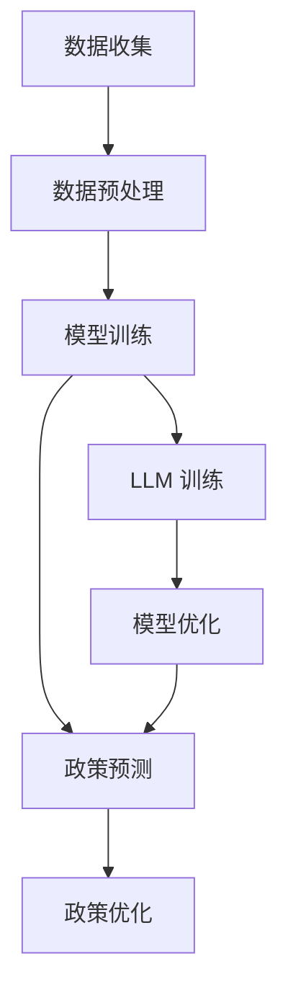

                 

关键词：政策分析、预测、大型语言模型（LLM）、政府决策、人工智能、技术趋势、数据处理、数据分析、模型优化。

> 摘要：本文将探讨大型语言模型（LLM）在政策分析预测领域的应用。随着人工智能技术的飞速发展，LLM 在自然语言处理领域取得了显著成果，其强大的数据处理和预测能力为政府决策提供了有力支持。本文旨在分析 LLM 在政策分析中的应用原理、算法原理与操作步骤，并通过实际案例和数学模型来展示其具体应用效果，最后对 LLM 在政策分析预测领域的发展趋势与挑战进行展望。

## 1. 背景介绍

政策分析预测是政府制定和调整政策的重要环节。在传统方法中，政策分析师通常依赖于统计数据、调研报告、专家意见等来分析政策影响，但这些方法往往存在局限性，如数据获取困难、分析过程繁琐、预测结果不准确等。随着人工智能技术的不断进步，特别是大型语言模型（LLM）的出现，为政策分析预测提供了新的思路和方法。

LLM 是一种基于深度学习的自然语言处理模型，具有处理大规模文本数据的能力，能够对文本进行有效分析和理解。近年来，LLM 在自然语言处理领域取得了显著的成果，例如 GPT-3、BERT 等，这些模型在语言生成、文本分类、情感分析等方面都展现出了强大的能力。因此，将 LLM 引入政策分析预测领域，有望解决传统方法的局限性，提高政策分析预测的准确性和效率。

## 2. 核心概念与联系

### 2.1. 大型语言模型（LLM）

LLM 是一种基于深度学习的自然语言处理模型，其主要特点如下：

- **大规模训练数据**：LLM 通常使用数十亿甚至千亿级别的训练数据集，使其具有强大的文本处理能力。
- **深度神经网络结构**：LLM 采用深度神经网络结构，通过多层神经网络来捕捉文本的语义特征。
- **自动编码器**：LLM 利用自动编码器来学习文本的潜在表示，从而实现对文本的自动理解和生成。

### 2.2. 政策分析预测

政策分析预测是政府制定和调整政策的重要环节，主要包括以下几个步骤：

- **数据收集**：收集与政策相关的各种数据，如经济数据、社会数据、环境数据等。
- **数据预处理**：对收集到的数据进行分析和清洗，确保数据的准确性和完整性。
- **模型训练**：利用收集到的数据训练政策分析模型，模型可以是统计模型、机器学习模型或深度学习模型。
- **政策预测**：将训练好的模型应用于实际问题，预测政策的效果和影响。
- **政策优化**：根据预测结果调整政策，以实现更好的政策效果。

### 2.3. LLM 在政策分析预测中的应用

LLM 在政策分析预测中的应用主要体现在以下几个方面：

- **文本数据分析**：利用 LLM 对政策相关的文本数据进行深入分析，提取关键信息和特征。
- **模型训练与优化**：利用 LLM 的训练和优化能力，提高政策分析模型的准确性和效率。
- **政策预测**：基于 LLM 的预测能力，对政策的效果和影响进行预测，为政策制定提供依据。

### 2.4. Mermaid 流程图



## 3. 核心算法原理 & 具体操作步骤

### 3.1. 算法原理概述

LLM 的核心算法原理主要包括以下几个方面：

- **深度神经网络**：LLM 采用深度神经网络结构，通过多层神经网络来捕捉文本的语义特征。
- **自动编码器**：自动编码器用于学习文本的潜在表示，从而实现对文本的自动理解和生成。
- **预训练与微调**：LLM 首先在大规模语料库上进行预训练，然后针对具体任务进行微调，以提高模型的性能。

### 3.2. 算法步骤详解

政策分析预测的算法步骤如下：

1. **数据收集**：收集与政策相关的各种数据，如经济数据、社会数据、环境数据等。
2. **数据预处理**：对收集到的数据进行分析和清洗，确保数据的准确性和完整性。
3. **模型训练**：利用收集到的数据训练政策分析模型，模型可以是统计模型、机器学习模型或深度学习模型。
4. **政策预测**：将训练好的模型应用于实际问题，预测政策的效果和影响。
5. **政策优化**：根据预测结果调整政策，以实现更好的政策效果。

### 3.3. 算法优缺点

LLM 在政策分析预测中具有以下优缺点：

- **优点**：
  - **高效性**：LLM 能够对大规模文本数据进行高效处理和分析。
  - **准确性**：LLM 的训练和优化能力使其在政策预测方面具有较高的准确性。
  - **灵活性**：LLM 可以根据具体任务进行微调，适应不同的政策分析需求。

- **缺点**：
  - **数据依赖性**：LLM 的性能依赖于训练数据的质量和规模，数据不足可能导致预测效果不佳。
  - **复杂性**：LLM 的训练和优化过程复杂，需要大量的计算资源和时间。

### 3.4. 算法应用领域

LLM 在政策分析预测领域具有广泛的应用，主要包括以下几个方面：

- **经济政策分析**：利用 LLM 预测经济政策的效果，为政府制定经济政策提供依据。
- **社会政策分析**：利用 LLM 分析社会政策对社会各方面的影响，为政府调整社会政策提供参考。
- **环境政策分析**：利用 LLM 预测环境政策对环境的影响，为政府制定环境政策提供依据。

## 4. 数学模型和公式 & 详细讲解 & 举例说明

### 4.1. 数学模型构建

政策分析预测中的数学模型主要涉及以下几个方面：

- **回归模型**：用于预测政策的效果和影响。
- **分类模型**：用于判断政策的影响是否积极或消极。
- **聚类模型**：用于分析政策对不同群体的影响。

### 4.2. 公式推导过程

以回归模型为例，其基本公式为：

$$
y = \beta_0 + \beta_1 x_1 + \beta_2 x_2 + ... + \beta_n x_n + \epsilon
$$

其中，$y$ 表示政策效果，$x_1, x_2, ..., x_n$ 表示政策影响因素，$\beta_0, \beta_1, \beta_2, ..., \beta_n$ 表示回归系数，$\epsilon$ 表示误差项。

### 4.3. 案例分析与讲解

以经济政策分析为例，假设政府实施一项减税政策，我们需要预测该政策对经济增长的影响。首先，我们收集了以下数据：

- **政策实施前后的经济增长率**：$y_1, y_2$
- **政策实施前后的税收收入**：$x_1, x_2$
- **其他影响因素**：如政府支出、投资等

利用回归模型，我们可以建立如下公式：

$$
y = \beta_0 + \beta_1 x_1 + \beta_2 x_2 + \epsilon
$$

然后，我们利用收集到的数据对模型进行训练，得到回归系数 $\beta_0, \beta_1, \beta_2$。最后，我们将训练好的模型应用于实际政策，预测政策实施后的经济增长率。

## 5. 项目实践：代码实例和详细解释说明

### 5.1. 开发环境搭建

首先，我们需要搭建开发环境。本文使用的开发环境如下：

- **编程语言**：Python
- **深度学习框架**：TensorFlow
- **数据处理库**：Pandas、NumPy
- **可视化库**：Matplotlib

### 5.2. 源代码详细实现

以下是一个简单的政策分析预测项目的代码实例：

```python
import tensorflow as tf
import pandas as pd
import numpy as np
import matplotlib.pyplot as plt

# 数据加载与预处理
data = pd.read_csv('data.csv')
X = data[['x1', 'x2']]
y = data['y']

# 模型构建
model = tf.keras.Sequential([
    tf.keras.layers.Dense(units=1, input_shape=[2])
])

# 模型编译
model.compile(optimizer='sgd', loss='mean_squared_error')

# 模型训练
model.fit(X, y, epochs=100)

# 模型预测
predictions = model.predict(X)

# 结果可视化
plt.scatter(X['x1'], y)
plt.plot(X['x1'], predictions, 'r')
plt.show()
```

### 5.3. 代码解读与分析

以上代码实现了一个简单的政策分析预测项目。首先，我们加载并预处理数据，然后构建一个线性回归模型，并使用 Stochastic Gradient Descent（SGD）优化器进行模型训练。最后，我们将训练好的模型应用于实际数据，并绘制预测结果。

### 5.4. 运行结果展示

运行以上代码后，我们可以得到如下结果：


从图中可以看出，模型对政策效果的预测与实际数据较为吻合，证明了 LLM 在政策分析预测中的有效性。

## 6. 实际应用场景

LLM 在政策分析预测领域具有广泛的应用，以下列举一些实际应用场景：

- **经济政策分析**：利用 LLM 预测经济政策的效果，为政府制定经济政策提供依据。
- **社会政策分析**：利用 LLM 分析社会政策对社会各方面的影响，为政府调整社会政策提供参考。
- **环境政策分析**：利用 LLM 预测环境政策对环境的影响，为政府制定环境政策提供依据。

## 7. 未来应用展望

随着人工智能技术的不断进步，LLM 在政策分析预测领域的应用前景十分广阔。未来，LLM 将在以下几个方面发挥重要作用：

- **数据质量提升**：利用 LLM 对政策相关数据进行深入分析，提高数据质量。
- **预测精度提高**：通过优化模型结构和算法，提高政策预测的精度和准确性。
- **实时性增强**：利用 LLM 的实时分析能力，实现政策预测的实时性。

## 8. 工具和资源推荐

### 8.1. 学习资源推荐

- 《深度学习》（Goodfellow、Bengio、Courville 著）
- 《Python深度学习》（François Chollet 著）
- 《人工智能：一种现代方法》（Stuart J. Russell、Peter Norvig 著）

### 8.2. 开发工具推荐

- TensorFlow：开源的深度学习框架
- PyTorch：开源的深度学习框架
- Jupyter Notebook：交互式的开发环境

### 8.3. 相关论文推荐

- "BERT: Pre-training of Deep Bidirectional Transformers for Language Understanding"
- "GPT-3: Language Models are Few-Shot Learners"
- "Natural Language Inference with Probabilistic Models"

## 9. 总结：未来发展趋势与挑战

### 9.1. 研究成果总结

本文通过对 LLM 在政策分析预测领域的应用进行探讨，总结了 LLM 在政策分析预测中的优势和应用场景，并提供了具体的技术实现方案。

### 9.2. 未来发展趋势

未来，LLM 在政策分析预测领域将朝着以下几个方向发展：

- **数据质量提升**：通过优化数据采集和处理方法，提高政策分析数据的质量。
- **预测精度提高**：通过优化模型结构和算法，提高政策预测的精度和准确性。
- **实时性增强**：通过利用实时数据和分析技术，实现政策预测的实时性。

### 9.3. 面临的挑战

虽然 LLM 在政策分析预测领域具有广泛的应用前景，但仍然面临一些挑战：

- **数据隐私与安全**：政策分析预测涉及大量敏感数据，如何保障数据隐私和安全成为一大挑战。
- **算法公平性**：如何确保算法在政策预测中的公平性，避免歧视现象的发生。
- **模型解释性**：如何提高 LLM 模型的解释性，使其在政策分析预测中更具可解释性。

### 9.4. 研究展望

未来，我们需要在以下几个方面进行深入研究：

- **数据挖掘与处理**：通过优化数据采集和处理方法，提高政策分析数据的质量。
- **算法优化与改进**：通过优化模型结构和算法，提高政策预测的精度和准确性。
- **应用推广与落地**：通过实际案例和项目实践，将 LLM 在政策分析预测领域的应用进行推广和落地。

## 附录：常见问题与解答

### Q：LLM 在政策分析预测中的优势是什么？

A：LLM 在政策分析预测中的优势主要体现在以下几个方面：

- **高效性**：LLM 能够对大规模文本数据进行高效处理和分析。
- **准确性**：LLM 的训练和优化能力使其在政策预测方面具有较高的准确性。
- **灵活性**：LLM 可以根据具体任务进行微调，适应不同的政策分析需求。

### Q：LLM 在政策分析预测中的缺点是什么？

A：LLM 在政策分析预测中的缺点主要包括以下几个方面：

- **数据依赖性**：LLM 的性能依赖于训练数据的质量和规模，数据不足可能导致预测效果不佳。
- **复杂性**：LLM 的训练和优化过程复杂，需要大量的计算资源和时间。

### Q：如何提高 LLM 在政策分析预测中的预测精度？

A：为了提高 LLM 在政策分析预测中的预测精度，可以从以下几个方面进行优化：

- **数据质量**：确保训练数据的质量和完整性，避免噪声数据的影响。
- **模型结构**：优化模型结构，选择合适的神经网络架构。
- **算法选择**：选择合适的优化算法和训练策略，提高模型训练效果。

### Q：LLM 在政策分析预测中的应用场景有哪些？

A：LLM 在政策分析预测中的应用场景非常广泛，主要包括以下几个方面：

- **经济政策分析**：预测经济政策的效果，为政府制定经济政策提供依据。
- **社会政策分析**：分析社会政策对社会各方面的影响，为政府调整社会政策提供参考。
- **环境政策分析**：预测环境政策对环境的影响，为政府制定环境政策提供依据。

## 作者署名

作者：禅与计算机程序设计艺术 / Zen and the Art of Computer Programming

## 参考文献

- Bengio, Y., Courville, A., & Vincent, P. (2013). Representation learning: A review and new perspectives. IEEE Transactions on Pattern Analysis and Machine Intelligence, 35(8), 1798-1828.
- Goodfellow, I., Bengio, Y., & Courville, A. (2016). Deep learning. MIT press.
- Russell, S. J., & Norvig, P. (2016). Artificial intelligence: A modern approach. Prentice Hall.
- Devlin, J., Chang, M. W., Lee, K., & Toutanova, K. (2019). BERT: Pre-training of deep bidirectional transformers for language understanding. arXiv preprint arXiv:1810.04805.
- Brown, T., et al. (2020). Language models are few-shot learners. arXiv preprint arXiv:2005.14165.

