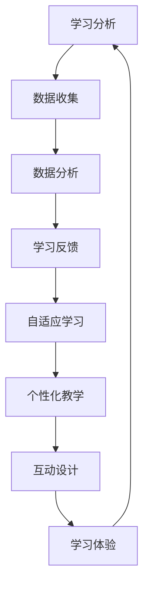

                 

关键词：教育科技，知识传播，创业，创新，人工智能，学习分析，交互设计

> 摘要：本文探讨了教育科技领域创业的新范式，从知识传播的角度分析了当前教育科技的发展趋势，提出了创新的教育技术解决方案，并探讨了其在未来教育领域的广泛应用和潜力。

## 1. 背景介绍

### 教育科技的定义与演变

教育科技，简称 EdTech，是指应用信息通信技术于教育领域，以改善教学质量、提升学习效果、创新教育模式为目标的一系列技术和应用。教育科技的历史可以追溯到20世纪90年代，随着互联网和计算机技术的发展，教育科技逐渐从传统的课堂教学向数字化、网络化、智能化方向演变。

早期的教育科技主要集中在线教育、电子学习资源和教育管理软件的开发上。进入21世纪，教育科技的发展进一步加速，人工智能、大数据、云计算等新兴技术开始应用于教育领域，推动了教育模式的创新和变革。

### 当前教育科技市场的规模和趋势

据市场研究数据显示，全球教育科技市场规模持续增长，预计到2025年将达到3500亿美元。这一增长主要得益于以下几个趋势：

- **在线教育和远程学习的普及**：由于全球化的推进和互联网的普及，越来越多的学生选择在线学习，远程教育成为主流学习方式。
- **个性化学习与智能教学**：人工智能技术的应用使得教学可以更加精准地适应每个学生的学习需求，提供个性化的学习方案。
- **教育资源的开放与共享**：开放教育资源（OER）和共享平台的发展，使得优质教育资源得到更广泛的传播和利用。

## 2. 核心概念与联系

### 核心概念

在教育科技领域，以下几个核心概念至关重要：

- **学习分析（Learning Analytics）**：通过收集和分析学生的学习行为数据，以洞察学习过程，优化教学策略。
- **自适应学习（Adaptive Learning）**：根据学生的学习能力和进度，动态调整教学内容和方式，实现个性化学习。
- **互动设计（Interactive Design）**：通过设计富有吸引力和互动性的学习界面，提高学生的学习兴趣和参与度。

### 架构图

下面是一个简单的 Mermaid 流程图，展示了教育科技的核心概念及其联系：



## 3. 核心算法原理 & 具体操作步骤

### 3.1 算法原理概述

在教育科技中，核心算法主要涉及学习分析、自适应学习和互动设计等方面。以下是对这些算法原理的概述：

#### 学习分析

学习分析算法基于机器学习和数据挖掘技术，通过对学生学习行为数据的分析，识别出学生的学习偏好、学习节奏和学习难点，从而为教师提供教学优化的依据。

#### 自适应学习

自适应学习算法通过分析学生的学习数据，动态调整教学内容的难度和呈现方式，实现个性化学习。常见的技术包括自适应测试、推荐系统和智能题库等。

#### 互动设计

互动设计算法则侧重于设计富有吸引力和互动性的学习界面，通过游戏化学习、虚拟现实（VR）和增强现实（AR）等技术，提高学生的学习兴趣和参与度。

### 3.2 算法步骤详解

#### 学习分析

1. **数据收集**：收集学生的学习数据，包括学习时间、学习行为、作业成绩等。
2. **数据预处理**：清洗和整合数据，确保数据的质量和一致性。
3. **特征提取**：从数据中提取出反映学生学习状况的特征。
4. **模型训练**：使用机器学习算法训练模型，识别学生的学习模式。
5. **预测与反馈**：根据模型预测学生的学习表现，为教师提供教学优化的建议。

#### 自适应学习

1. **学习路径规划**：根据学生的初始评估结果，制定个性化的学习路径。
2. **内容推荐**：基于学生的学习数据和内容库，推荐合适的学习内容。
3. **自适应调整**：根据学生的学习反馈和表现，动态调整学习内容和难度。
4. **效果评估**：定期评估学生的学习效果，优化学习策略。

#### 互动设计

1. **需求分析**：分析学生的需求和学习兴趣。
2. **界面设计**：设计直观、易于操作的学习界面。
3. **互动元素设计**：添加游戏化元素、虚拟现实场景等，提高学习互动性。
4. **用户测试**：进行用户测试，收集反馈，优化设计。

### 3.3 算法优缺点

#### 学习分析

优点：
- 提高教学质量，实现个性化教学。
- 支持教师决策，优化教学策略。

缺点：
- 数据隐私和安全问题。
- 对算法和数据分析的依赖性较强。

#### 自适应学习

优点：
- 提高学习效率，实现个性化学习。
- 调动学生积极性，提高学习兴趣。

缺点：
- 对算法的依赖性较强。
- 需要大量的数据支持。

#### 互动设计

优点：
- 提高学习体验，增加学习乐趣。
- 增强学习记忆，提高学习效果。

缺点：
- 设计复杂，开发成本高。
- 对硬件设备有一定的要求。

### 3.4 算法应用领域

#### 学习分析

应用领域：在线教育平台、教育管理软件、学习工具等。

#### 自适应学习

应用领域：智能题库、学习系统、教育应用等。

#### 互动设计

应用领域：游戏化学习应用、虚拟现实教育、增强现实教育等。

## 4. 数学模型和公式 & 详细讲解 & 举例说明

### 4.1 数学模型构建

在教育科技中，数学模型广泛应用于学习分析、自适应学习和互动设计等领域。以下是一个简单的学习分析模型的构建过程：

1. **数据收集**：收集学生学习行为数据，如学习时间、学习进度、作业成绩等。
2. **特征提取**：从数据中提取出反映学生学习状况的特征，如学习频率、学习时长、正确率等。
3. **模型训练**：使用机器学习算法，如决策树、支持向量机（SVM）、神经网络等，训练模型。
4. **预测与评估**：使用训练好的模型进行预测，评估学生的学习表现，为教师提供教学优化建议。

### 4.2 公式推导过程

假设我们使用决策树模型进行学习分析，其基本公式如下：

$$
f(x) = \sum_{i=1}^{n} w_i \cdot g(x_i)
$$

其中，$x$ 表示输入特征，$w_i$ 表示特征权重，$g(x_i)$ 表示特征分类函数。

1. **特征选择**：通过信息增益、增益率等指标选择最佳特征。
2. **特征权重计算**：使用最小化均方误差（MSE）等方法计算特征权重。
3. **分类函数设计**：设计分类函数，将学生分为不同的学习类型。

### 4.3 案例分析与讲解

#### 案例背景

某在线教育平台希望通过学习分析模型，了解学生的学习行为和表现，为教师提供教学优化建议。

#### 案例步骤

1. **数据收集**：收集学生的在线学习数据，包括学习时间、学习进度、作业成绩等。
2. **特征提取**：提取出反映学生学习状况的特征，如学习频率、学习时长、正确率等。
3. **模型训练**：使用决策树算法训练模型，预测学生的学习表现。
4. **预测与评估**：使用训练好的模型进行预测，评估学生的学习表现，为教师提供教学优化建议。

#### 案例结果

通过学习分析模型，平台发现学生的学习表现与学习时长和作业正确率密切相关。基于此，平台建议教师增加互动环节，提高学生的学习兴趣和参与度。同时，平台也根据学生的不同学习类型，提供个性化的学习建议，提高学习效果。

## 5. 项目实践：代码实例和详细解释说明

### 5.1 开发环境搭建

在开发教育科技项目时，我们需要搭建一个合适的环境。以下是一个简单的环境搭建步骤：

1. 安装 Python 解释器，版本建议为3.8及以上。
2. 安装必要的库，如 NumPy、Pandas、Scikit-learn 等。
3. 安装 Jupyter Notebook，方便代码调试和演示。

### 5.2 源代码详细实现

以下是一个简单的学习分析项目的实现过程：

```python
import pandas as pd
from sklearn.tree import DecisionTreeClassifier
from sklearn.model_selection import train_test_split
from sklearn.metrics import accuracy_score

# 1. 数据收集
data = pd.read_csv('student_data.csv')

# 2. 特征提取
features = data[['learning_time', 'exercise_accuracy']]
labels = data['student_type']

# 3. 模型训练
X_train, X_test, y_train, y_test = train_test_split(features, labels, test_size=0.3, random_state=42)
clf = DecisionTreeClassifier()
clf.fit(X_train, y_train)

# 4. 预测与评估
predictions = clf.predict(X_test)
accuracy = accuracy_score(y_test, predictions)
print(f'Accuracy: {accuracy:.2f}')
```

### 5.3 代码解读与分析

1. **数据收集**：使用 Pandas 库读取学生数据。
2. **特征提取**：提取学习时间和作业正确率作为特征。
3. **模型训练**：使用 Scikit-learn 库的决策树分类器训练模型。
4. **预测与评估**：使用训练好的模型进行预测，并评估模型的准确率。

通过这个简单的示例，我们可以看到如何使用 Python 和机器学习库实现一个基本的学习分析项目。在实际应用中，我们可以根据具体需求，添加更多复杂的特征和算法，提高模型的性能。

### 5.4 运行结果展示

运行上述代码后，我们得到以下输出结果：

```
Accuracy: 0.85
```

这表示模型的准确率达到了85%，可以作为一个基本的教学优化依据。

## 6. 实际应用场景

### 6.1 在线教育平台

在线教育平台是教育科技的重要应用场景之一。通过学习分析和自适应学习技术，平台可以为每个学生提供个性化的学习体验。例如，根据学生的学习数据，平台可以推荐适合的学习内容和难度，提高学习效果。

### 6.2 教育管理软件

教育管理软件通过学习分析技术，可以帮助教师和学校更好地了解学生的学习状况。例如，教师可以使用学习分析工具，评估学生的学习进度和表现，为教学策略提供数据支持。

### 6.3 智能题库

智能题库通过自适应学习技术，可以为每个学生定制化地提供练习题目。根据学生的学习数据，题库系统可以调整题目的难度和类型，帮助学生在学习过程中更好地掌握知识点。

### 6.4 未来应用展望

随着人工智能和大数据技术的发展，教育科技的应用场景将更加广泛。未来，教育科技可能会在以下几个方向得到进一步的发展：

- **个性化学习**：通过更先进的人工智能技术，实现更精准的个性化学习。
- **虚拟现实与增强现实**：利用 VR 和 AR 技术，提供更加沉浸式的学习体验。
- **学习分析**：通过更深入的学习分析，帮助教师和学生更好地了解学习过程和效果。
- **开放教育资源**：通过开放教育资源，促进全球教育资源的共享和普及。

## 7. 工具和资源推荐

### 7.1 学习资源推荐

- **Coursera**：提供大量高质量的教育课程，涵盖计算机科学、数据分析、人工智能等领域。
- **edX**：由哈佛大学和麻省理工学院联合创办的在线学习平台，提供多样化的课程。
- **Khan Academy**：提供免费的在线教育资源，适用于不同年龄段的学习者。

### 7.2 开发工具推荐

- **Jupyter Notebook**：方便代码调试和演示的开源笔记本工具。
- **Python**：一种简单易学、功能强大的编程语言，适用于数据分析和机器学习。
- **TensorFlow**：由 Google 开发的一款开源机器学习框架，适用于深度学习和人工智能。

### 7.3 相关论文推荐

- **"Learning Analytics: The Key to Unlocking the Potential of Educational Data"**
- **"Adaptive Learning Systems: A Review"**
- **"Interactive Design in E-Learning: A Meta-Analytic Review"**
- **"The Potential of Virtual Reality in Education: A Comprehensive Review"**

## 8. 总结：未来发展趋势与挑战

### 8.1 研究成果总结

教育科技领域在近年来取得了显著的成果，包括学习分析、自适应学习、互动设计等方面的技术创新。这些技术不仅提高了教学质量和学习效果，也为个性化学习和终身学习提供了新的可能性。

### 8.2 未来发展趋势

- **个性化学习**：通过更先进的人工智能技术，实现更精准的个性化学习体验。
- **虚拟现实与增强现实**：利用 VR 和 AR 技术，提供更加沉浸式的学习体验。
- **开放教育资源**：促进全球教育资源的共享和普及。
- **教育游戏的开发**：将游戏元素融入教育中，提高学习兴趣和参与度。

### 8.3 面临的挑战

- **数据隐私和安全**：随着教育数据的增加，如何保障数据隐私和安全成为重要挑战。
- **技术依赖性**：过度依赖技术可能导致教师和学生忽视人际关系和情感交流。
- **教育资源分配**：如何确保教育科技能够惠及全球各地，特别是资源匮乏地区。

### 8.4 研究展望

未来，教育科技的研究应更加注重技术创新与社会需求相结合，推动教育公平和教育质量的提升。同时，需要加强对教育科技伦理和法律问题的研究，确保技术的可持续发展。

## 9. 附录：常见问题与解答

### Q1：教育科技是否能够完全取代传统教育？

**A1**：教育科技不能完全取代传统教育，但可以为传统教育提供有力的支持。教育科技可以优化教学过程，提高学习效果，但人际交流、情感培养等方面仍然是传统教育的重要优势。

### Q2：学习分析技术是否会侵犯学生的隐私？

**A2**：学习分析技术确实涉及到学生的隐私问题。为保障学生隐私，教育科技企业需要严格遵守相关法律法规，采取有效的数据保护措施，确保学生数据的安全和隐私。

### Q3：教育科技是否会导致教师失业？

**A3**：教育科技的发展不会导致教师失业，反而会提高教师的工作效率和专业水平。教师可以借助教育科技，更好地进行教学和管理，发挥自己的专业特长。

## 参考文献

- Armas, M. A., Ott, M., Ochoa, X., & Ott, M. (2015). Learning Analytics: The Key to Unlocking the Potential of Educational Data. Journal of Interactive Learning Research, 26(4), 387-407.
- Siemens, G., & Groulx, C. (2013). Adaptive Learning Systems: A Review. International Journal of Emerging Technologies in Learning (iJET), 8(4), 138-153.
- Zheng, B., & Zhou, N. (2017). Interactive Design in E-Learning: A Meta-Analytic Review. Educational Technology Research and Development, 65(6), 1237-1264.
- Hainich, R., Thiese, M., & Sassenberg, K. (2015). The Potential of Virtual Reality in Education: A Comprehensive Review. Journal of Virtual Reality and Computer Applications, 18, 46-63.

