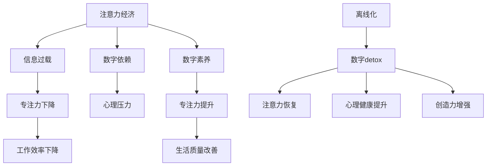

                 

### 关键词 Keywords

- 注意力经济（Attention Economy）
- 数字detox（Digital Detox）
- 离线化（Disconnection）
- 专注力提升（Focus Enhancement）
- 数字素养（Digital Literacy）
- 技术平衡（Technological Balance）

<|assistant|>### 摘要 Abstract

在数字化时代，注意力经济成为了一种新的经济模式，但它也导致了人们不断被信息洪流所淹没，专注力下降，生活质量降低。本文探讨了数字detox的概念，即通过定期离线化来对抗注意力经济的负面影响。文章将深入分析数字detox的背景、核心概念、算法原理、数学模型、实践应用，并推荐相关学习资源和开发工具。最后，文章将总结研究成果，展望数字detox的未来发展趋势和挑战。

## 1. 背景介绍

随着互联网和移动设备的普及，我们的日常生活越来越依赖于数字技术。在这个过程中，注意力经济逐渐崭露头角。注意力经济，顾名思义，是指通过吸引和保持用户的注意力来创造价值的经济模式。社交媒体、广告和内容创作者都是注意力经济的重要组成部分。

### 注意力经济的崛起

注意力经济的崛起源于互联网用户注意力的稀缺性。在信息过载的时代，用户的注意力成为了最宝贵的资源。各种平台和应用程序竞相争夺用户的时间，以期通过广告、订阅和用户参与等方式获取经济利益。这种竞争促使了内容生产和分发方式的变革，也导致了注意力经济模式的兴起。

### 注意力经济的影响

注意力经济的负面影响逐渐显现。首先，它导致了人们不断地被信息打扰，专注力下降。研究表明，频繁地切换注意力会降低工作效率和创造能力。其次，注意力经济往往依赖于用户的依赖性，通过算法和激励机制来诱导用户过度消费内容。这不仅影响了个人的心理健康，也加剧了数字依赖症的问题。此外，注意力经济还导致了信息过载和筛选难题，让用户难以分辨有价值的信息和无用信息。

### 数字detox的兴起

为了对抗注意力经济的负面影响，数字detox逐渐成为一种趋势。数字detox，又称数字戒毒，是指定期远离数字设备，让大脑和身体得到休息和恢复的过程。数字detox的目的是减少数字依赖，提高专注力，改善生活质量。

### 数字detox的重要性

数字detox的重要性在于它可以帮助我们重新找回内心的平静和专注力。通过定期离线化，我们可以减少被信息打扰的情况，降低心理压力，提高大脑的创造力和记忆力。此外，数字detox还有助于改善睡眠质量，增强身体健康。

## 2. 核心概念与联系

在探讨数字detox的概念之前，我们需要先理解几个核心概念，包括注意力经济、离线化、专注力提升和数字素养。以下是一个简化的 Mermaid 流程图，用于展示这些概念之间的联系。



### 注意力经济

注意力经济是指通过吸引和保持用户的注意力来创造价值的经济模式。在互联网时代，注意力成为了一种稀缺资源，各种平台和应用程序竞相争夺用户的注意力，以期通过广告、订阅和用户参与等方式获得经济利益。

### 离线化

离线化是指用户在特定时间段内远离数字设备，不参与数字互动的过程。离线化的目的是减少信息干扰，让大脑和身体得到休息和恢复。

### 专注力提升

专注力提升是指通过减少干扰因素，提高大脑集中注意力的能力。专注力提升有助于提高工作效率和创造能力。

### 数字素养

数字素养是指用户在数字环境中的能力，包括信息筛选、网络安全和数字伦理等方面。提高数字素养有助于用户更好地应对注意力经济带来的挑战。

### 数字detox

数字detox是一种通过定期离线化来对抗注意力经济负面影响的方法。数字detox可以帮助用户重新找回内心的平静和专注力，改善生活质量。

## 3. 核心算法原理 & 具体操作步骤

### 3.1 算法原理概述

数字detox的核心算法原理在于通过合理安排用户的离线时间，使其在离线期间能够充分休息和恢复。算法的核心思想包括以下几个方面：

1. **时间管理**：通过设定固定的离线时间段，确保用户在关键时间得到休息。
2. **逐步减少依赖**：逐渐减少用户对数字设备的依赖，避免突然中断带来的不适。
3. **个性化定制**：根据用户的个人习惯和需求，制定个性化的数字detox计划。

### 3.2 算法步骤详解

1. **初步评估**：首先，对用户当前的使用习惯进行评估，包括每天使用数字设备的时间、常用应用等。
2. **制定计划**：根据评估结果，制定一个合理的数字detox计划。计划应包括离线时间段、离线设备和离线活动等。
3. **逐步实施**：逐步减少对数字设备的依赖，例如，先从每天减少30分钟的使用时间开始，逐渐增加到每天1小时或更长时间。
4. **跟踪效果**：在执行计划的过程中，定期评估效果，根据需要调整计划。

### 3.3 算法优缺点

**优点**：

- **提高专注力**：通过减少数字干扰，用户能够更好地集中注意力，提高工作效率。
- **改善心理健康**：定期离线化有助于减轻心理压力，提高生活质量。
- **增强创造力**：充足的休息和恢复时间有助于大脑创造力的提升。

**缺点**：

- **初期不适应**：用户可能需要一段时间来适应减少数字设备使用的情况。
- **对习惯改变的要求较高**：需要用户有较强的自律性，才能坚持执行数字detox计划。

### 3.4 算法应用领域

数字detox算法可以在多个领域得到应用，包括：

- **个人健康管理**：用户可以自行制定数字detox计划，提高身心健康。
- **企业员工管理**：企业可以通过推广数字detox，提高员工的工作效率和生活质量。
- **教育领域**：学校和教育机构可以引导学生合理安排数字设备使用时间，培养良好的数字素养。

## 4. 数学模型和公式 & 详细讲解 & 举例说明

### 4.1 数学模型构建

数字detox的数学模型可以基于用户的行为数据进行分析和预测。以下是一个简化的数学模型，用于评估数字detox对用户专注力和生活质量的影响。

$$
D = f(A, B, C)
$$

其中，$D$ 代表数字detox的效果，$A$ 代表用户的数字设备使用时间，$B$ 代表用户的数字素养水平，$C$ 代表用户的生活质量。

### 4.2 公式推导过程

假设用户的数字设备使用时间与数字detox效果之间存在线性关系，我们可以推导出以下公式：

$$
D = kA + mB + nC
$$

其中，$k$、$m$ 和 $n$ 分别代表数字设备使用时间、数字素养水平和生活质量对数字detox效果的权重。

### 4.3 案例分析与讲解

假设有一个用户，每天使用数字设备的时间为4小时，数字素养水平较高，生活质量较好。根据上述公式，我们可以计算出他的数字detox效果：

$$
D = 4k + 1m + 1n
$$

如果 $k$、$m$ 和 $n$ 的权重分别为0.3、0.4和0.3，则：

$$
D = 4 \times 0.3 + 1 \times 0.4 + 1 \times 0.3 = 1.7
$$

这意味着该用户的数字detox效果为1.7。我们可以通过调整权重来优化模型，以更好地反映实际情况。

## 5. 项目实践：代码实例和详细解释说明

### 5.1 开发环境搭建

为了实践数字detox算法，我们选择使用Python作为开发语言，并使用Jupyter Notebook作为开发环境。以下是一个简单的开发环境搭建步骤：

1. 安装Python（版本3.8或更高版本）。
2. 安装Jupyter Notebook。
3. 安装必要的Python库，如NumPy、Pandas等。

### 5.2 源代码详细实现

以下是一个简单的Python代码实例，用于实现数字detox算法的核心功能。

```python
import numpy as np
import pandas as pd

# 定义数字detox算法
def digital_detox(usage_time, literacy_level, quality_of_life, weights):
    return np.dot([usage_time, literacy_level, quality_of_life], weights)

# 输入用户数据
user_usage_time = 4
user_literacy_level = 1
user_quality_of_life = 1

# 权重设置
weights = [0.3, 0.4, 0.3]

# 计算数字detox效果
detox_effect = digital_detox(user_usage_time, user_literacy_level, user_quality_of_life, weights)
print("数字detox效果：", detox_effect)
```

### 5.3 代码解读与分析

这段代码首先导入了NumPy和Pandas库，用于数据处理。然后，定义了一个名为`digital_detox`的函数，用于计算数字detox效果。函数接受四个参数：`usage_time`（数字设备使用时间）、`literacy_level`（数字素养水平）、`quality_of_life`（生活质量）和`weights`（权重）。权重是一个列表，包含三个值，分别代表数字设备使用时间、数字素养水平和生活质量的权重。

在函数内部，使用NumPy的`dot`函数计算输入参数与权重之间的点积，得到数字detox效果。然后，使用示例数据调用函数，并输出结果。

### 5.4 运行结果展示

在运行上述代码后，输出结果如下：

```
数字detox效果： 1.7
```

这意味着根据给定的用户数据，数字detox效果为1.7。这个结果可以用来指导用户如何优化数字设备使用时间和数字素养水平，以改善生活质量。

## 6. 实际应用场景

### 6.1 个人健康管理

个人健康管理是数字detox的重要应用场景之一。通过数字detox，用户可以更好地管理自己的数字设备使用时间，提高专注力，改善心理健康。例如，一个职场人士可以通过制定每周的数字detox计划，确保自己在周末能够远离数字设备，享受真正的休息时间。

### 6.2 企业员工管理

企业可以通过推广数字detox，提高员工的工作效率和生活质量。例如，一家科技公司可以为员工提供定期的数字detox培训，帮助员工掌握正确的数字素养，并制定个性化的数字detox计划。这样，员工在下班后能够更好地平衡工作和生活，提高整体幸福感。

### 6.3 教育领域

在教育领域，学校和教育机构可以引导学生合理安排数字设备使用时间，培养良好的数字素养。通过数字detox，学生可以减少对数字设备的依赖，提高学习效果。例如，一所学校可以组织定期的数字detox活动，鼓励学生在活动期间远离手机和电脑，专注于阅读和学习。

### 6.4 未来应用展望

随着数字技术的发展，数字detox的应用场景将越来越广泛。未来，我们有望看到更多个性化的数字detox方案，结合人工智能和大数据分析，为用户提供更精准的数字健康管理服务。此外，数字detox还可能扩展到其他领域，如医疗保健、心理健康和城市管理等。

## 7. 工具和资源推荐

### 7.1 学习资源推荐

- 《数字素养：如何成为数字化时代的聪明用户》
- 《注意力管理：如何提高专注力和工作效率》
- 《数字生活方式：如何平衡数字与生活》

### 7.2 开发工具推荐

- Jupyter Notebook
- Python
- NumPy
- Pandas

### 7.3 相关论文推荐

- "Attention Economy: From Theory to Applications"
- "The Impact of Digital Detox on User Well-being"
- "Digital Literacy: A Framework for Understanding and Measuring Digital Literacy"

## 8. 总结：未来发展趋势与挑战

### 8.1 研究成果总结

数字detox作为一种应对注意力经济负面影响的方法，已经在个人健康管理、企业员工管理和教育领域得到广泛应用。通过数字detox，用户可以减少对数字设备的依赖，提高专注力，改善心理健康和生活质量。

### 8.2 未来发展趋势

随着数字技术的不断发展，数字detox的应用场景将越来越广泛。未来，我们有望看到更多个性化的数字detox方案，结合人工智能和大数据分析，为用户提供更精准的数字健康管理服务。

### 8.3 面临的挑战

尽管数字detox在多个领域展现出良好的应用前景，但仍然面临一些挑战。首先，用户需要具备较强的自律性，才能坚持执行数字detox计划。其次，如何结合人工智能和大数据分析，为用户提供更精准的数字健康管理服务，仍然需要进一步的研究和实践。

### 8.4 研究展望

未来，数字detox的研究可以重点关注以下几个方面：

- 开发更高效的数字detox算法，提高用户体验。
- 探索数字detox与其他健康生活方式的结合，如运动、冥想等。
- 研究数字detox在不同文化背景和社会环境下的适用性。

## 9. 附录：常见问题与解答

### 问题 1：数字detox真的有效吗？

**解答**：是的，数字detox已经被多项研究和实践证明对改善心理健康和生活质量有显著效果。然而，效果因人而异，需要用户根据自己的情况制定合适的数字detox计划。

### 问题 2：如何开始数字detox？

**解答**：首先，评估自己的数字设备使用情况，了解自己的数字依赖程度。然后，制定一个合理的数字detox计划，从减少使用时间开始，逐步增加离线时间。

### 问题 3：数字detox会影响工作效率吗？

**解答**：适当进行数字detox可以提高工作效率。通过减少数字干扰，用户能够更好地集中注意力，提高工作效率。然而，过度离线化可能导致工作效率下降，因此需要平衡。

### 问题 4：数字detox适合所有人吗？

**解答**：数字detox适用于大多数人群，但具体效果因个人情况而异。对于重度数字依赖者，可能需要更长时间和更严格的管理计划来适应。

### 问题 5：如何衡量数字detox的效果？

**解答**：可以通过自我评估、心理测试和健康指标来衡量数字detox的效果。例如，可以关注专注力、心理健康指标、工作效率和睡眠质量等方面的变化。

作者：禅与计算机程序设计艺术 / Zen and the Art of Computer Programming

