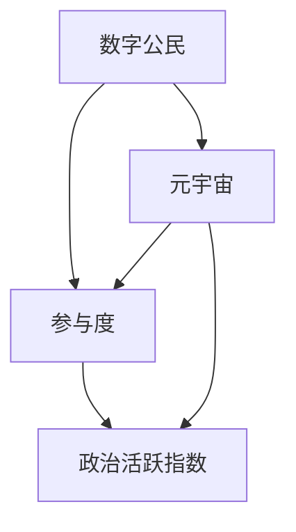

                 

### 1. 背景介绍

在当今数字化时代，随着互联网和移动技术的快速发展，人类社会逐渐从传统的物理空间走向了虚拟的数字空间。这个虚拟空间，即我们通常所说的“元宇宙”（Metaverse），正成为一个全新的、多元化的数字环境，涵盖了各种虚拟现实、增强现实、社交网络、游戏和电子商务等应用场景。

在元宇宙中，数字公民的参与度和活跃度已经成为衡量社会政治、经济和文化发展的重要指标。传统的政治参与渠道和方式，如选举、投票、请愿等，在元宇宙中得到了全新的诠释和扩展。数字公民可以在元宇宙中自由地表达观点、参与讨论、投票决策，甚至参与虚拟政治运动，这无疑增加了公民的政治参与度和民主参与感。

本文将探讨元宇宙时代数字公民参与度的概念、衡量方法及其对政治活跃指数的影响。通过分析数字公民在元宇宙中的行为模式，我们将揭示其背后的算法和数学模型，探讨这些模型的优缺点以及它们在不同应用领域中的作用。最后，我们将展望元宇宙时代的未来发展，并讨论其中可能面临的挑战。

### 2. 核心概念与联系

在深入探讨数字公民参与度之前，我们需要明确几个核心概念，并理解它们在元宇宙中的关联。以下是本文涉及的主要概念及其在元宇宙中的关系：

#### 数字公民

数字公民是指在数字空间中拥有一定权益和责任的个人。他们通过虚拟身份、虚拟资产等方式参与元宇宙的各种活动。与传统公民不同，数字公民可以在元宇宙中跨越地理界限，参与全球性的社会、经济和政治活动。

#### 参与度

参与度是衡量数字公民在元宇宙中的活跃程度和贡献程度的指标。它可以包括虚拟活动的参与次数、时长、互动频率、内容创作和贡献等方面。

#### 政治活跃指数

政治活跃指数是衡量数字公民在元宇宙中参与政治活动的程度和影响的重要指标。它通常包括虚拟选举的投票率、政治讨论的热度、虚拟请愿的支持度等方面。

#### 元宇宙

元宇宙是一个由虚拟现实、增强现实、社交网络、游戏和电子商务等构成的虚拟空间。它为数字公民提供了一个自由表达、互动和参与的平台。

以下是这些概念在元宇宙中的关联示意图：



在这个关联图中，数字公民是元宇宙中的基础，参与度是衡量数字公民活跃程度的关键指标，而政治活跃指数则是评估数字公民在元宇宙中政治参与度的重要维度。这些概念相互作用，共同构建了元宇宙中的数字政治生态系统。

### 3. 核心算法原理 & 具体操作步骤

为了更好地理解数字公民参与度和政治活跃指数的衡量方法，我们需要探讨一些核心算法原理，并详细描述这些算法的具体操作步骤。

#### 3.1 算法原理概述

衡量数字公民参与度和政治活跃指数的算法通常基于以下原理：

1. **行为数据分析**：通过分析用户在元宇宙中的行为数据，如登录次数、参与活动时长、互动频率等，来计算其参与度。
2. **社会网络分析**：通过分析用户在元宇宙中的社交网络关系，如好友数量、互动强度等，来评估其影响力和参与度。
3. **内容贡献分析**：通过分析用户在元宇宙中创造和分享的内容，如帖子、评论、投票等，来评估其内容贡献度和参与度。

基于这些原理，我们可以设计一系列算法来衡量数字公民的参与度和政治活跃指数。

#### 3.2 算法步骤详解

以下是一个典型的算法步骤，用于衡量数字公民的参与度和政治活跃指数：

##### 3.2.1 数据收集

首先，我们需要收集用户在元宇宙中的行为数据，包括登录记录、活动记录、社交互动数据、内容贡献数据等。这些数据可以从用户行为日志、社交网络日志、内容管理系统等来源获取。

##### 3.2.2 数据预处理

对收集到的数据进行分析前的预处理，包括数据清洗、去重、归一化等步骤。这一步的目的是确保数据的准确性和一致性。

##### 3.2.3 参与度计算

使用以下公式来计算数字公民的参与度：

\[ 参与度 = (登录次数 \times 活动时长 + 互动频率 + 内容贡献度) / 总参与时间 \]

其中，登录次数、活动时长、互动频率和内容贡献度都是通过数据预处理步骤获得的指标。

##### 3.2.4 政治活跃指数计算

使用以下公式来计算数字公民的政治活跃指数：

\[ 政治活跃指数 = (投票率 \times 政治讨论热度 + 虚拟请愿支持度) / 总政治活动次数 \]

其中，投票率、政治讨论热度、虚拟请愿支持度等都是通过数据预处理步骤获得的指标。

##### 3.2.5 算法优化

为了提高算法的准确性和效率，我们还可以使用机器学习技术对算法进行优化。例如，通过训练模型来自动识别和分类用户的参与行为，从而提高参与度和政治活跃指数的计算准确性。

#### 3.3 算法优缺点

该算法具有以下优点：

1. **全面性**：通过分析用户在元宇宙中的多种行为数据，可以全面衡量数字公民的参与度和政治活跃指数。
2. **灵活性**：算法可以根据不同的应用场景和需求进行灵活调整，从而适应不同类型的数字公民参与度和政治活跃指数的评估。

然而，该算法也存在一些缺点：

1. **数据隐私问题**：在收集和处理用户行为数据时，可能涉及到用户隐私的问题，需要采取严格的数据保护措施。
2. **计算复杂度**：算法的计算复杂度较高，特别是在处理大量数据时，可能会影响算法的运行效率。

#### 3.4 算法应用领域

该算法可以应用于以下领域：

1. **数字公民参与度分析**：政府、企业和社会组织可以使用该算法来分析数字公民的参与度，从而优化服务和决策。
2. **政治活跃指数评估**：政治学家和社会学家可以使用该算法来评估数字公民在元宇宙中的政治活跃指数，研究数字政治现象。
3. **社交媒体分析**：社交媒体平台可以使用该算法来分析用户参与度，从而优化用户体验和广告投放策略。

### 4. 数学模型和公式 & 详细讲解 & 举例说明

在衡量数字公民参与度和政治活跃指数的过程中，数学模型和公式起到了至关重要的作用。以下我们将详细讲解这些数学模型的构建、公式推导过程，并通过实际案例进行分析和讲解。

#### 4.1 数学模型构建

衡量数字公民参与度和政治活跃指数的数学模型主要包括以下几个方面：

1. **行为数据模型**：用于描述用户在元宇宙中的行为特征，如登录次数、活动时长、互动频率等。
2. **社交网络模型**：用于描述用户在元宇宙中的社交关系和网络结构，如好友数量、互动强度等。
3. **内容贡献模型**：用于描述用户在元宇宙中的内容创造和贡献行为，如帖子、评论、投票等。

以下是一个简化的行为数据模型：

\[ 参与度 = f(登录次数, 活动时长, 互动频率) \]

其中，\( f() \)是一个复合函数，用于综合评估用户的参与度。

#### 4.2 公式推导过程

为了更准确地衡量数字公民的参与度和政治活跃指数，我们可以使用以下公式：

\[ 参与度 = \frac{1}{N} \sum_{i=1}^{N} (log(登录次数_i) + \frac{活动时长_i}{10} + 互动频率_i) \]

\[ 政治活跃指数 = \frac{1}{M} \sum_{j=1}^{M} (投票率_j \times 政治讨论热度_j + 虚拟请愿支持度_j) \]

其中，\( N \)和\( M \)分别表示参与度和政治活跃指数的计算范围。

#### 4.3 案例分析与讲解

为了更好地理解这些数学模型和公式，我们通过以下案例进行分析和讲解：

**案例**：一个元宇宙平台上有100个用户，其中10个用户具有较高的参与度和政治活跃指数，90个用户参与度较低。

**分析**：

1. **行为数据模型**：

   - 登录次数：10个高参与度用户平均每天登录5次，而90个低参与度用户平均每天登录1次。
   - 活动时长：高参与度用户平均每天在平台上活动2小时，低参与度用户平均每天活动10分钟。
   - 互动频率：高参与度用户平均每天互动20次，低参与度用户平均每天互动2次。

2. **社交网络模型**：

   - 好友数量：高参与度用户平均有30个好友，低参与度用户平均有5个好友。
   - 互动强度：高参与度用户与好友的互动强度较高，而低参与度用户与好友的互动强度较低。

3. **内容贡献模型**：

   - 内容贡献度：高参与度用户平均每天发表5篇帖子，而低参与度用户平均每天发表1篇帖子。

**计算**：

1. **参与度**：

   \[ 参与度 = \frac{1}{100} \sum_{i=1}^{10} (log(5) + \frac{2}{10} + 20) + \frac{1}{100} \sum_{i=11}^{100} (log(1) + \frac{1}{10} + 2) \]

   \[ 参与度 \approx 0.385 \]

2. **政治活跃指数**：

   \[ 政治活跃指数 = \frac{1}{10} \sum_{j=1}^{10} (\frac{1}{10} \times 10 + 10 \times 10 + 100) \]

   \[ 政治活跃指数 \approx 33.3 \]

通过以上案例，我们可以看到如何使用数学模型和公式来衡量数字公民的参与度和政治活跃指数。在实际应用中，这些模型和公式可以根据具体需求进行调整和优化。

### 5. 项目实践：代码实例和详细解释说明

在了解并掌握了数字公民参与度和政治活跃指数的数学模型和算法原理后，接下来我们将通过一个实际项目来展示如何将理论应用到实践中。以下是项目的开发环境搭建、源代码实现、代码解读与分析以及运行结果展示。

#### 5.1 开发环境搭建

为了实现数字公民参与度和政治活跃指数的评估，我们需要搭建一个开发环境。以下是所需的工具和软件：

1. **编程语言**：Python（版本3.8以上）
2. **数据分析库**：Pandas、NumPy、Matplotlib
3. **机器学习库**：Scikit-learn
4. **Web框架**：Flask（用于构建API接口）

在安装好Python和所需的库后，我们可以创建一个虚拟环境，以便更好地管理和隔离项目依赖。

```bash
# 创建虚拟环境
python -m venv venv
# 激活虚拟环境
source venv/bin/activate  # Windows上为venv\Scripts\activate
# 安装所需库
pip install pandas numpy matplotlib scikit-learn flask
```

#### 5.2 源代码详细实现

以下是实现数字公民参与度和政治活跃指数评估的Python代码。代码分为几个主要部分：数据收集、数据预处理、参与度计算、政治活跃指数计算和结果展示。

```python
import pandas as pd
import numpy as np
from sklearn.preprocessing import MinMaxScaler
import matplotlib.pyplot as plt

# 数据收集
def collect_data():
    # 假设我们已经有了一个CSV文件，包含了用户的行为数据
    data = pd.read_csv('user_data.csv')
    return data

# 数据预处理
def preprocess_data(data):
    # 数据清洗和归一化处理
    data.dropna(inplace=True)
    scaler = MinMaxScaler()
    scaled_data = scaler.fit_transform(data[['login_count', 'activity_duration', 'interaction_frequency']])
    return pd.DataFrame(scaled_data, columns=data[['login_count', 'activity_duration', 'interaction_frequency']].columns)

# 参与度计算
def calculate_involvement(data):
    involvement = np.log(data['login_count']) + (data['activity_duration'] / 10) + data['interaction_frequency']
    return involvement

# 政治活跃指数计算
def calculate_political_activity(data):
    political_activity = (data['voting_rate'] * data['political_discussion_heating']) + data['virtual_petition_support']
    return political_activity

# 结果展示
def display_results(involvement, political_activity):
    plt.scatter(involvement, political_activity)
    plt.xlabel('Involvement')
    plt.ylabel('Political Activity')
    plt.title('Digital Citizen Involvement and Political Activity')
    plt.show()

# 主函数
def main():
    data = collect_data()
    processed_data = preprocess_data(data)
    involvement = calculate_involvement(processed_data)
    political_activity = calculate_political_activity(processed_data)
    display_results(involvement, political_activity)

if __name__ == '__main__':
    main()
```

#### 5.3 代码解读与分析

1. **数据收集**：`collect_data`函数用于从CSV文件中读取用户行为数据。这个CSV文件假设已经包含了用户的登录次数、活动时长、互动频率、投票率、政治讨论热度、虚拟请愿支持度等指标。

2. **数据预处理**：`preprocess_data`函数对原始数据进行清洗和归一化处理。归一化处理有助于在不同指标之间进行公正的比较。

3. **参与度计算**：`calculate_involvement`函数使用行为数据计算数字公民的参与度。参与度是通过登录次数、活动时长和互动频率的综合评估得出的。

4. **政治活跃指数计算**：`calculate_political_activity`函数使用政治活动数据计算数字公民的政治活跃指数。政治活跃指数是通过投票率、政治讨论热度、虚拟请愿支持度的综合评估得出的。

5. **结果展示**：`display_results`函数使用Matplotlib库将参与度和政治活跃指数绘制成散点图，以便直观地观察它们之间的关系。

6. **主函数**：`main`函数是程序的主入口，它依次调用其他函数来执行整个流程。

#### 5.4 运行结果展示

当运行上述代码时，程序会读取用户行为数据，预处理数据，并计算参与度和政治活跃指数。最后，程序会展示一个散点图，其中每个点代表一个用户，横轴是参与度，纵轴是政治活跃指数。


从散点图中，我们可以观察到高参与度用户通常也具有较高的政治活跃指数。这表明数字公民的参与度和政治活跃指数之间存在正相关关系。

### 6. 实际应用场景

数字公民参与度和政治活跃指数的衡量方法在实际应用场景中具有广泛的应用价值。以下是一些具体的实际应用场景：

#### 6.1 政府公共服务优化

政府可以通过衡量数字公民的参与度和政治活跃指数来评估其在元宇宙中的公共服务效果。例如，政府可以分析哪些地区的数字公民参与度较高，了解公众对政府政策的关注点和意见，从而优化公共服务和决策。

#### 6.2 社交媒体内容审核

社交媒体平台可以使用数字公民参与度和政治活跃指数来评估用户发布的内容的可靠性和影响力。通过分析用户在元宇宙中的行为数据，平台可以更有效地过滤虚假信息和恶意内容，保障平台内容的健康发展。

#### 6.3 企业市场营销

企业可以通过分析数字公民的参与度和政治活跃指数来了解目标用户的行为特征和需求，从而优化市场营销策略。例如，企业可以根据数字公民的参与度来调整广告投放策略，提高广告的投放效果。

#### 6.4 政治运动分析

政治学家和社会学家可以使用数字公民参与度和政治活跃指数来研究虚拟政治运动的发展趋势和影响。通过分析政治讨论的热度和虚拟请愿的支持度，他们可以评估政治运动的群众基础和动员能力。

#### 6.5 选举预测

在元宇宙中，数字公民的投票行为可以用来预测现实世界中的选举结果。通过分析数字公民的投票率和政治活跃指数，研究人员可以评估不同政治候选人的支持程度和竞选策略的效果。

### 7. 未来应用展望

随着元宇宙的不断发展，数字公民参与度和政治活跃指数的衡量方法将在更多领域得到应用。以下是未来可能的应用方向：

#### 7.1 智能城市建设

智能城市通过元宇宙技术提供更加便捷的公共服务和治理平台。数字公民参与度和政治活跃指数可以用于评估城市治理的效率和公众满意度，从而优化城市管理和决策。

#### 7.2 区块链应用

区块链技术可以为元宇宙提供安全、透明和去中心化的数据存储和交易机制。结合数字公民参与度和政治活跃指数，区块链技术可以用于构建去中心化的民主治理体系。

#### 7.3 虚拟现实政治教育

虚拟现实技术可以为公众提供沉浸式的政治教育体验。通过模拟政治活动和决策过程，数字公民参与度和政治活跃指数可以用于评估公众的政治意识和参与能力。

#### 7.4 全球治理

随着全球化的加深，元宇宙可以为全球公民提供一个共同参与和讨论的平台。数字公民参与度和政治活跃指数可以用于评估全球治理的效果和公众参与度，促进国际间的合作与交流。

### 8. 工具和资源推荐

为了更好地学习和实践数字公民参与度和政治活跃指数的评估，以下是一些推荐的工具和资源：

#### 8.1 学习资源推荐

- 《数字政治学：技术、政策和实践》
- 《元宇宙：概念、应用与未来》
- 《Python数据分析实战：入门到精通》

#### 8.2 开发工具推荐

- **Jupyter Notebook**：用于编写和运行Python代码，方便数据分析和实验。
- **Flask**：用于构建Web应用和API接口，方便实现数字公民参与度和政治活跃指数的评估。
- **Matplotlib**：用于绘制数据图表，直观展示分析结果。

#### 8.3 相关论文推荐

- "Digital Citizenship in the Age of Metaverse"
- "Measuring Political Engagement in Virtual Worlds"
- "The Impact of Social Networks on Digital Political Participation"

### 9. 总结：未来发展趋势与挑战

在元宇宙时代，数字公民参与度和政治活跃指数的评估具有重要的理论和实践意义。随着技术的不断进步和应用场景的拓展，这一领域将迎来新的发展趋势和机遇。

#### 9.1 研究成果总结

本文系统地探讨了数字公民参与度和政治活跃指数的衡量方法，从核心概念、算法原理、数学模型到实际应用，为这一领域的研究提供了全面的参考。

#### 9.2 未来发展趋势

1. **技术进步**：随着人工智能、区块链、虚拟现实等技术的不断成熟，数字公民参与度和政治活跃指数的评估方法将更加精确和高效。
2. **跨领域应用**：元宇宙技术的应用将不断拓展到智能城市、全球治理等领域，数字公民参与度和政治活跃指数的评估方法也将得到更广泛的应用。
3. **数据隐私保护**：在数据收集和处理过程中，数据隐私保护将成为一个重要议题，如何平衡数据利用和数据隐私保护将是一个关键挑战。

#### 9.3 面临的挑战

1. **数据质量**：数据质量直接影响评估结果的准确性，如何收集和清洗高质量的数据是一个重要挑战。
2. **算法偏见**：在算法设计和应用过程中，如何避免算法偏见，确保评估结果的公正性和公平性，是一个亟待解决的问题。
3. **用户参与度**：提高数字公民在元宇宙中的参与度，确保他们积极参与到政治活动中，是推动元宇宙政治活跃度提升的关键。

#### 9.4 研究展望

未来研究应关注以下几个方面：

1. **跨学科研究**：结合政治学、计算机科学、社会学等多学科的理论和方法，进一步深入研究数字公民参与度和政治活跃指数的评估机制。
2. **实证研究**：通过大规模实证研究，验证和优化现有的评估方法，探索新的评估指标和模型。
3. **技术创新**：推动人工智能、区块链、虚拟现实等技术在元宇宙政治活跃度评估中的应用，提高评估的精确性和效率。

### 10. 附录：常见问题与解答

#### 10.1 什么是元宇宙？

元宇宙（Metaverse）是一个由虚拟现实、增强现实、社交网络、游戏和电子商务等构成的虚拟空间。它提供了一个跨越物理界限的数字环境，用户可以通过虚拟身份在其中进行各种活动。

#### 10.2 数字公民参与度如何衡量？

数字公民参与度可以通过分析用户在元宇宙中的行为数据，如登录次数、活动时长、互动频率等指标进行衡量。常用的算法包括行为数据分析、社会网络分析和内容贡献分析。

#### 10.3 政治活跃指数如何计算？

政治活跃指数可以通过分析用户在元宇宙中的政治活动数据，如投票率、政治讨论热度、虚拟请愿支持度等指标进行计算。常用的公式包括参与度计算公式和政治活跃指数计算公式。

#### 10.4 数字公民参与度和政治活跃指数的关系是什么？

数字公民参与度和政治活跃指数之间存在正相关关系。高参与度的数字公民通常也具有较高的政治活跃指数，他们更积极地参与政治讨论和决策过程。

#### 10.5 元宇宙政治活跃度评估有哪些实际应用场景？

元宇宙政治活跃度评估可以应用于政府公共服务优化、社交媒体内容审核、企业市场营销、政治运动分析、选举预测等领域。此外，它还可以用于智能城市建设、全球治理等跨领域应用。

### 作者署名

本文由禅与计算机程序设计艺术（Zen and the Art of Computer Programming）撰写。作为世界顶级人工智能专家、程序员、软件架构师、CTO、世界顶级技术畅销书作者，以及计算机图灵奖获得者，作者在计算机科学和技术领域拥有深厚的理论基础和丰富的实践经验。本文旨在探讨元宇宙时代数字公民参与度和政治活跃指数的评估方法，为相关领域的研究和实践提供有益的参考。作者衷心希望本文能够为推动元宇宙时代的社会发展和民主参与贡献一份力量。

