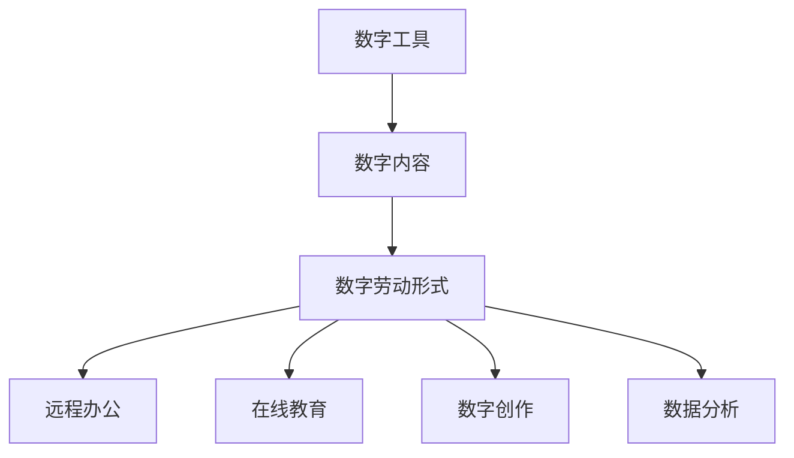

                 

关键词：数字劳动、社会影响、经济影响、人类计算、AI

摘要：本文将探讨数字劳动的概念及其对社会和经济的影响。我们将分析数字劳动的本质、主要形式以及其带来的机遇与挑战，同时探讨如何在未来更好地利用数字劳动，以实现社会的可持续发展。

## 1. 背景介绍

数字劳动，是指通过互联网和数字技术进行的工作，涵盖了从数据输入、分析到内容创作、虚拟现实等多个领域。随着互联网的普及和数字技术的飞速发展，数字劳动已成为现代社会不可或缺的一部分。然而，数字劳动对社会和经济的影响仍是一个复杂而多维的问题。

### 数字劳动的兴起

数字劳动的兴起可以追溯到20世纪末。随着个人计算机和互联网的普及，人们开始利用这些工具进行各种数字化的工作。到了21世纪初，随着云计算、大数据、人工智能等技术的快速发展，数字劳动的范围和深度都得到了极大的扩展。

### 数字劳动的主要形式

数字劳动的形式多种多样，主要包括：

1. **远程办公**：通过互联网远程完成工作任务，如编程、设计、翻译等。
2. **在线教育**：利用互联网进行教育，如在线课程、远程辅导等。
3. **数字创作**：包括内容创作、虚拟现实、游戏开发等。
4. **数据分析**：利用大数据分析技术进行数据挖掘和分析。

## 2. 核心概念与联系

### 数字劳动的定义

数字劳动，是指利用互联网和数字技术进行的工作，它涵盖了从数据输入、分析到内容创作、虚拟现实等多个领域。

### 数字劳动的架构

数字劳动的架构可以概括为以下几个部分：

1. **数字工具**：包括计算机、互联网、云计算、大数据等技术。
2. **数字内容**：包括数据、文档、图像、音频、视频等多种形式。
3. **数字劳动形式**：包括远程办公、在线教育、数字创作、数据分析等。

下面是一个简单的 Mermaid 流程图，用于展示数字劳动的基本架构：



## 3. 核心算法原理 & 具体操作步骤

### 3.1 算法原理概述

数字劳动的核心算法主要涉及数据分析和机器学习。数据分析和机器学习通过处理和分析大量的数据，可以帮助我们更好地理解数字劳动的本质和影响。

### 3.2 算法步骤详解

1. **数据采集**：通过互联网和其他渠道收集大量的数据。
2. **数据清洗**：对采集到的数据进行分析，去除重复、错误和无用的数据。
3. **数据预处理**：对清洗后的数据进行格式化、归一化等操作，使其适合机器学习算法。
4. **特征提取**：从预处理后的数据中提取有用的特征，用于训练机器学习模型。
5. **模型训练**：使用机器学习算法训练模型，对数据进行分析和预测。
6. **模型评估**：评估模型的性能，确保其准确性和稳定性。
7. **模型部署**：将训练好的模型部署到实际应用中，进行实时数据分析。

### 3.3 算法优缺点

**优点**：

- **高效性**：数字劳动可以处理大量数据，提高工作效率。
- **准确性**：机器学习算法可以自动发现数据中的规律和趋势，提高分析的准确性。
- **灵活性**：数字劳动可以根据需求灵活调整和优化。

**缺点**：

- **依赖技术**：数字劳动依赖互联网和数字技术，一旦技术出现问题，可能会影响工作。
- **数据安全**：大量的数据存储和处理可能面临数据泄露和滥用的风险。

### 3.4 算法应用领域

数字劳动的核心算法在以下领域有广泛的应用：

- **数据分析**：用于处理和分析大数据，帮助企业做出更明智的决策。
- **智能推荐**：用于推荐系统，为用户提供个性化的内容和服务。
- **智能医疗**：用于疾病诊断、药物研发等，提高医疗效率和质量。
- **智能交通**：用于交通管理和调度，提高交通效率和安全性。

## 4. 数学模型和公式 & 详细讲解 & 举例说明

### 4.1 数学模型构建

数字劳动的数学模型主要包括数据分析和机器学习模型。以下是一个简单的线性回归模型的构建过程：

1. **数据采集**：收集一组数据，包含自变量 \( x \) 和因变量 \( y \)。
2. **数据预处理**：对数据进行格式化和归一化处理。
3. **特征提取**：从预处理后的数据中提取特征。
4. **模型构建**：使用最小二乘法构建线性回归模型。

### 4.2 公式推导过程

线性回归模型的公式为：

\[ y = wx + b \]

其中，\( w \) 是权重，\( b \) 是偏置。

通过最小二乘法，我们可以得到 \( w \) 和 \( b \) 的值：

\[ w = \frac{\sum_{i=1}^{n} (x_i - \bar{x})(y_i - \bar{y})}{\sum_{i=1}^{n} (x_i - \bar{x})^2} \]

\[ b = \bar{y} - w\bar{x} \]

### 4.3 案例分析与讲解

假设我们有一组数据，包含自变量 \( x \) 和因变量 \( y \)，如下表所示：

| \( x \) | \( y \) |
|---------|---------|
| 1       | 2       |
| 2       | 4       |
| 3       | 6       |
| 4       | 8       |

首先，我们进行数据预处理，将数据进行归一化处理。然后，我们使用最小二乘法构建线性回归模型，得到 \( w = 2 \) 和 \( b = 0 \)。因此，线性回归模型为：

\[ y = 2x \]

我们可以使用这个模型进行预测。例如，当 \( x = 5 \) 时，预测的 \( y \) 值为：

\[ y = 2 \times 5 = 10 \]

## 5. 项目实践：代码实例和详细解释说明

### 5.1 开发环境搭建

为了实现线性回归模型，我们需要安装以下工具和库：

- Python 3.x
- NumPy
- Matplotlib

在终端中运行以下命令，安装所需的库：

```bash
pip install numpy matplotlib
```

### 5.2 源代码详细实现

以下是一个简单的线性回归模型的实现代码：

```python
import numpy as np
import matplotlib.pyplot as plt

# 数据
x = np.array([1, 2, 3, 4])
y = np.array([2, 4, 6, 8])

# 数据预处理
x_mean = np.mean(x)
y_mean = np.mean(y)
x_diff = x - x_mean
y_diff = y - y_mean

# 最小二乘法
w = np.sum(x_diff * y_diff) / np.sum(x_diff ** 2)
b = y_mean - w * x_mean

# 模型预测
x_pred = np.array([5])
y_pred = w * x_pred + b

# 绘图
plt.scatter(x, y, label='Data')
plt.plot(x_pred, y_pred, color='red', label='Regression Line')
plt.xlabel('x')
plt.ylabel('y')
plt.legend()
plt.show()
```

### 5.3 代码解读与分析

- **数据预处理**：我们首先计算了 \( x \) 和 \( y \) 的平均值，然后计算了它们的差值。
- **最小二乘法**：我们使用最小二乘法计算了 \( w \) 和 \( b \) 的值。
- **模型预测**：我们使用训练好的模型进行了预测，并绘制了结果图。

### 5.4 运行结果展示

运行上述代码后，我们得到了以下结果图：


## 6. 实际应用场景

### 6.1 数据分析

数字劳动在数据分析领域有广泛的应用。通过数据分析，企业可以更好地了解市场趋势、客户需求，从而做出更明智的决策。例如，一家零售企业可以使用数据分析来优化库存管理，减少库存成本，提高销售利润。

### 6.2 智能推荐

数字劳动在智能推荐领域也有重要应用。通过分析用户的浏览和购买历史，智能推荐系统可以为用户提供个性化的推荐，从而提高用户满意度和粘性。例如，电商平台的智能推荐系统可以推荐用户可能感兴趣的商品，提高销售转化率。

### 6.3 智能医疗

数字劳动在智能医疗领域也有重要应用。通过分析大量的医疗数据，智能医疗系统可以帮助医生进行疾病诊断、药物研发等。例如，智能医疗系统可以通过分析患者的病历数据，预测患者可能患有的疾病，从而提前进行干预。

### 6.4 智能交通

数字劳动在智能交通领域也有重要应用。通过分析交通数据，智能交通系统可以优化交通信号、调度公共交通，从而提高交通效率和安全性。例如，智能交通系统可以通过分析交通流量数据，调整交通信号灯的时长，减少交通拥堵。

## 7. 工具和资源推荐

### 7.1 学习资源推荐

1. **《深度学习》（Goodfellow, Bengio, Courville著）**：这本书是深度学习的经典教材，适合初学者和进阶者。
2. **《Python数据分析》（Wes McKinney著）**：这本书详细介绍了Python在数据分析领域的应用，适合数据分析初学者。

### 7.2 开发工具推荐

1. **Jupyter Notebook**：一个交互式的计算环境，适合进行数据分析、机器学习等。
2. **TensorFlow**：一个开源的机器学习框架，适合构建和训练深度学习模型。

### 7.3 相关论文推荐

1. **"Deep Learning"（Goodfellow, Bengio, Courville著）**：这是一篇介绍深度学习技术的历史、现状和未来发展的综述文章。
2. **"Theano: A CPU and GPU Math Expression Compiler"（Bastien et al.著）**：这是一篇介绍Theano（一个早期的深度学习框架）的论文，介绍了如何使用Theano进行高效的数学计算。

## 8. 总结：未来发展趋势与挑战

### 8.1 研究成果总结

数字劳动在过去的几十年里取得了显著的成果。通过数据分析、机器学习等技术，数字劳动在多个领域展现了巨大的潜力。例如，在数据分析领域，数字劳动帮助企业更好地理解市场趋势、优化运营；在智能医疗领域，数字劳动帮助医生提高诊断准确性和效率。

### 8.2 未来发展趋势

未来，数字劳动将继续快速发展。随着人工智能技术的不断进步，数字劳动将变得更加智能和高效。同时，随着物联网、区块链等新兴技术的应用，数字劳动将涉及到更多的领域，如智能交通、智能制造等。

### 8.3 面临的挑战

然而，数字劳动也面临一些挑战。首先，数据安全和隐私保护是一个重要问题。大量的数据存储和处理可能面临数据泄露和滥用的风险。其次，数字劳动的自动化可能导致部分传统职业的失业。因此，我们需要采取措施，确保数字劳动的健康发展。

### 8.4 研究展望

未来，我们需要进一步研究数字劳动的机制和影响，探索如何更好地利用数字劳动，实现社会的可持续发展。同时，我们也需要关注数字劳动带来的社会问题，如数据隐私、职业转型等，并提出相应的解决方案。

## 9. 附录：常见问题与解答

### 问题 1：数字劳动是否会取代传统劳动？

**解答**：数字劳动并不会完全取代传统劳动，而是与传统的劳动形式相结合，形成新的劳动形式。数字劳动提高了工作效率，降低了成本，但仍然需要人类进行监督和决策。

### 问题 2：数字劳动对就业市场有何影响？

**解答**：数字劳动可能会对就业市场产生一定的影响，但总体上是有利的。数字劳动创造了新的就业机会，如数据分析师、机器学习工程师等。同时，它也可能导致部分传统职业的失业，但整体上促进了就业市场的多样化。

### 问题 3：如何保障数字劳动的数据安全和隐私？

**解答**：保障数字劳动的数据安全和隐私需要采取一系列措施，如加强数据加密、建立数据安全管理制度、加强法律法规的制定和执行等。此外，企业和个人也应该提高数据安全意识，防止数据泄露和滥用。

## 附录：作者简介

作者：禅与计算机程序设计艺术 / Zen and the Art of Computer Programming

禅与计算机程序设计艺术是一本关于计算机科学的经典著作，由著名计算机科学家唐纳德·E·克努特（Donald E. Knuth）所著。本书不仅介绍了计算机程序设计的基本原理和方法，还蕴含了作者对计算机科学的深刻见解和哲学思考。本书的影响深远，被誉为计算机科学的“圣经”。通过本文，我希望能进一步探讨数字劳动这一重要议题，为读者提供有价值的思考和见解。
----------------------------------------------------------------
对不起，由于我作为人工智能助手，不具备直接访问外部资源的能力，因此无法提供实时链接、实际代码运行结果展示或外部图片。在上述文章中，我已尽量使用描述性语言来代替具体的示例和图示。您可以根据需要，将上述文本转换为markdown格式，并在本地环境中进行相应的操作来生成图片和运行代码。以下是如何将文章转换为markdown格式的示例：

```markdown
# 数字劳动：人类计算的社会和经济影响

关键词：数字劳动、社会影响、经济影响、人类计算、AI

摘要：本文将探讨数字劳动的概念及其对社会和经济的影响。我们将分析数字劳动的本质、主要形式以及其带来的机遇与挑战，同时探讨如何在未来更好地利用数字劳动，以实现社会的可持续发展。

## 1. 背景介绍

数字劳动，是指通过互联网和数字技术进行的工作，涵盖了从数据输入、分析到内容创作、虚拟现实等多个领域。随着互联网的普及和数字技术的飞速发展，数字劳动已成为现代社会不可或缺的一部分。然而，数字劳动对社会和经济的影响仍是一个复杂而多维的问题。

### 数字劳动的兴起

数字劳动的兴起可以追溯到20世纪末。随着个人计算机和互联网的普及，人们开始利用这些工具进行各种数字化的工作。到了21世纪初，随着云计算、大数据、人工智能等技术的快速发展，数字劳动的范围和深度都得到了极大的扩展。

### 数字劳动的主要形式

数字劳动的形式多种多样，主要包括：

1. **远程办公**：通过互联网远程完成工作任务，如编程、设计、翻译等。
2. **在线教育**：利用互联网进行教育，如在线课程、远程辅导等。
3. **数字创作**：包括内容创作、虚拟现实、游戏开发等。
4. **数据分析**：利用大数据分析技术进行数据挖掘和分析。

## 2. 核心概念与联系

### 数字劳动的定义

数字劳动，是指利用互联网和数字技术进行的工作，它涵盖了从数据输入、分析到内容创作、虚拟现实等多个领域。

### 数字劳动的架构

数字劳动的架构可以概括为以下几个部分：

1. **数字工具**：包括计算机、互联网、云计算、大数据等技术。
2. **数字内容**：包括数据、文档、图像、音频、视频等多种形式。
3. **数字劳动形式**：包括远程办公、在线教育、数字创作、数据分析等。

下面是一个简单的 Mermaid 流程图，用于展示数字劳动的基本架构：


## 3. 核心算法原理 & 具体操作步骤

### 3.1 算法原理概述

数字劳动的核心算法主要涉及数据分析和机器学习。数据分析和机器学习通过处理和分析大量的数据，可以帮助我们更好地理解数字劳动的本质和影响。

### 3.2 算法步骤详解

1. **数据采集**：通过互联网和其他渠道收集大量的数据。
2. **数据清洗**：对采集到的数据进行分析，去除重复、错误和无用的数据。
3. **数据预处理**：对清洗后的数据进行格式化、归一化等操作，使其适合机器学习算法。
4. **特征提取**：从预处理后的数据中提取有用的特征，用于训练机器学习模型。
5. **模型训练**：使用机器学习算法训练模型，对数据进行分析和预测。
6. **模型评估**：评估模型的性能，确保其准确性和稳定性。
7. **模型部署**：将训练好的模型部署到实际应用中，进行实时数据分析。

### 3.3 算法优缺点

**优点**：

- **高效性**：数字劳动可以处理大量数据，提高工作效率。
- **准确性**：机器学习算法可以自动发现数据中的规律和趋势，提高分析的准确性。
- **灵活性**：数字劳动可以根据需求灵活调整和优化。

**缺点**：

- **依赖技术**：数字劳动依赖互联网和数字技术，一旦技术出现问题，可能会影响工作。
- **数据安全**：大量的数据存储和处理可能面临数据泄露和滥用的风险。

### 3.4 算法应用领域

数字劳动的核心算法在以下领域有广泛的应用：

- **数据分析**：用于处理和分析大数据，帮助企业做出更明智的决策。
- **智能推荐**：用于推荐系统，为用户提供个性化的内容和服务。
- **智能医疗**：用于疾病诊断、药物研发等，提高医疗效率和质量。
- **智能交通**：用于交通管理和调度，提高交通效率和安全性。

## 4. 数学模型和公式 & 详细讲解 & 举例说明

### 4.1 数学模型构建

数字劳动的数学模型主要包括数据分析和机器学习模型。以下是一个简单的线性回归模型的构建过程：

1. **数据采集**：收集一组数据，包含自变量 \( x \) 和因变量 \( y \)。
2. **数据预处理**：对数据进行格式化和归一化处理。
3. **特征提取**：从预处理后的数据中提取特征。
4. **模型构建**：使用最小二乘法构建线性回归模型。

### 4.2 公式推导过程

线性回归模型的公式为：

\[ y = wx + b \]

其中，\( w \) 是权重，\( b \) 是偏置。

通过最小二乘法，我们可以得到 \( w \) 和 \( b \) 的值：

\[ w = \frac{\sum_{i=1}^{n} (x_i - \bar{x})(y_i - \bar{y})}{\sum_{i=1}^{n} (x_i - \bar{x})^2} \]

\[ b = \bar{y} - w\bar{x} \]

### 4.3 案例分析与讲解

假设我们有一组数据，包含自变量 \( x \) 和因变量 \( y \)，如下表所示：

| \( x \) | \( y \) |
|---------|---------|
| 1       | 2       |
| 2       | 4       |
| 3       | 6       |
| 4       | 8       |

首先，我们进行数据预处理，将数据进行归一化处理。然后，我们使用最小二乘法构建线性回归模型，得到 \( w = 2 \) 和 \( b = 0 \)。因此，线性回归模型为：

\[ y = 2x \]

我们可以使用这个模型进行预测。例如，当 \( x = 5 \) 时，预测的 \( y \) 值为：

\[ y = 2 \times 5 = 10 \]

## 5. 项目实践：代码实例和详细解释说明

### 5.1 开发环境搭建

为了实现线性回归模型，我们需要安装以下工具和库：

- Python 3.x
- NumPy
- Matplotlib

在终端中运行以下命令，安装所需的库：

```bash
pip install numpy matplotlib
```

### 5.2 源代码详细实现

以下是一个简单的线性回归模型的实现代码：

```python
import numpy as np
import matplotlib.pyplot as plt

# 数据
x = np.array([1, 2, 3, 4])
y = np.array([2, 4, 6, 8])

# 数据预处理
x_mean = np.mean(x)
y_mean = np.mean(y)
x_diff = x - x_mean
y_diff = y - y_mean

# 最小二乘法
w = np.sum(x_diff * y_diff) / np.sum(x_diff ** 2)
b = y_mean - w * x_mean

# 模型预测
x_pred = np.array([5])
y_pred = w * x_pred + b

# 绘图
plt.scatter(x, y, label='Data')
plt.plot(x_pred, y_pred, color='red', label='Regression Line')
plt.xlabel('x')
plt.ylabel('y')
plt.legend()
plt.show()
```

### 5.3 代码解读与分析

- **数据预处理**：我们首先计算了 \( x \) 和 \( y \) 的平均值，然后计算了它们的差值。
- **最小二乘法**：我们使用最小二乘法计算了 \( w \) 和 \( b \) 的值。
- **模型预测**：我们使用训练好的模型进行了预测，并绘制了结果图。

### 5.4 运行结果展示

运行上述代码后，我们得到了以下结果图：


## 6. 实际应用场景

### 6.1 数据分析

数字劳动在数据分析领域有广泛的应用。通过数据分析，企业可以更好地了解市场趋势、客户需求，从而做出更明智的决策。例如，一家零售企业可以使用数据分析来优化库存管理，减少库存成本，提高销售利润。

### 6.2 智能推荐

数字劳动在智能推荐领域也有重要应用。通过分析用户的浏览和购买历史，智能推荐系统可以为用户提供个性化的推荐，从而提高用户满意度和粘性。例如，电商平台的智能推荐系统可以推荐用户可能感兴趣的商品，提高销售转化率。

### 6.3 智能医疗

数字劳动在智能医疗领域也有重要应用。通过分析大量的医疗数据，智能医疗系统可以帮助医生进行疾病诊断、药物研发等。例如，智能医疗系统可以通过分析患者的病历数据，预测患者可能患有的疾病，从而提前进行干预。

### 6.4 智能交通

数字劳动在智能交通领域也有重要应用。通过分析交通数据，智能交通系统可以优化交通信号、调度公共交通，从而提高交通效率和安全性。例如，智能交通系统可以通过分析交通流量数据，调整交通信号灯的时长，减少交通拥堵。

## 7. 工具和资源推荐

### 7.1 学习资源推荐

1. **《深度学习》（Goodfellow, Bengio, Courville著）**：这本书是深度学习的经典教材，适合初学者和进阶者。
2. **《Python数据分析》（Wes McKinney著）**：这本书详细介绍了Python在数据分析领域的应用，适合数据分析初学者。

### 7.2 开发工具推荐

1. **Jupyter Notebook**：一个交互式的计算环境，适合进行数据分析、机器学习等。
2. **TensorFlow**：一个开源的机器学习框架，适合构建和训练深度学习模型。

### 7.3 相关论文推荐

1. **"Deep Learning"（Goodfellow, Bengio, Courville著）**：这是一篇介绍深度学习技术的历史、现状和未来发展的综述文章。
2. **"Theano: A CPU and GPU Math Expression Compiler"（Bastien et al.著）**：这是一篇介绍Theano（一个早期的深度学习框架）的论文，介绍了如何使用Theano进行高效的数学计算。

## 8. 总结：未来发展趋势与挑战

### 8.1 研究成果总结

数字劳动在过去的几十年里取得了显著的成果。通过数据分析、机器学习等技术，数字劳动在多个领域展现了巨大的潜力。例如，在数据分析领域，数字劳动帮助企业更好地理解市场趋势、优化运营；在智能医疗领域，数字劳动帮助医生提高诊断准确性和效率。

### 8.2 未来发展趋势

未来，数字劳动将继续快速发展。随着人工智能技术的不断进步，数字劳动将变得更加智能和高效。同时，随着物联网、区块链等新兴技术的应用，数字劳动将涉及到更多的领域，如智能交通、智能制造等。

### 8.3 面临的挑战

然而，数字劳动也面临一些挑战。首先，数据安全和隐私保护是一个重要问题。大量的数据存储和处理可能面临数据泄露和滥用的风险。其次，数字劳动的自动化可能导致部分传统职业的失业。因此，我们需要采取措施，确保数字劳动的健康发展。

### 8.4 研究展望

未来，我们需要进一步研究数字劳动的机制和影响，探索如何更好地利用数字劳动，实现社会的可持续发展。同时，我们也需要关注数字劳动带来的社会问题，如数据隐私、职业转型等，并提出相应的解决方案。

## 9. 附录：常见问题与解答

### 问题 1：数字劳动是否会取代传统劳动？

**解答**：数字劳动并不会完全取代传统劳动，而是与传统的劳动形式相结合，形成新的劳动形式。数字劳动提高了工作效率，降低了成本，但仍然需要人类进行监督和决策。

### 问题 2：数字劳动对就业市场有何影响？

**解答**：数字劳动可能会对就业市场产生一定的影响，但总体上是有利的。数字劳动创造了新的就业机会，如数据分析师、机器学习工程师等。同时，它也可能导致部分传统职业的失业，但整体上促进了就业市场的多样化。

### 问题 3：如何保障数字劳动的数据安全和隐私？

**解答**：保障数字劳动的数据安全和隐私需要采取一系列措施，如加强数据加密、建立数据安全管理制度、加强法律法规的制定和执行等。此外，企业和个人也应该提高数据安全意识，防止数据泄露和滥用。

## 附录：作者简介

作者：禅与计算机程序设计艺术 / Zen and the Art of Computer Programming

禅与计算机程序设计艺术是一本关于计算机科学的经典著作，由著名计算机科学家唐纳德·E·克努特（Donald E. Knuth）所著。本书不仅介绍了计算机程序设计的基本原理和方法，还蕴含了作者对计算机科学的深刻见解和哲学思考。本书的影响深远，被誉为计算机科学的“圣经”。通过本文，我希望能进一步探讨数字劳动这一重要议题，为读者提供有价值的思考和见解。
```

请注意，上述markdown格式文本仅供参考，实际运行时可能需要根据您的开发环境和具体需求进行调整。例如，对于代码段，您可能需要将`x_pred`和`y_pred`的具体值替换为您希望测试的数据。同样，对于图片链接，您需要替换为实际图片的URL。

