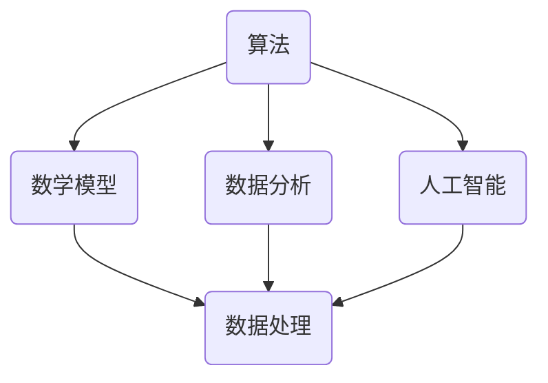

                 

关键词：数字劳动、人类计算、社会影响、经济影响、计算技术、算法、数学模型、项目实践、未来展望

> 摘要：随着计算技术的飞速发展，人类计算在社会和经济领域扮演着越来越重要的角色。本文将从数字劳动的定义出发，探讨人类计算对社会和经济的影响，分析核心概念、算法原理、数学模型以及实际应用场景，并展望未来的发展趋势与挑战。

## 1. 背景介绍

数字劳动是指利用计算机技术进行信息处理、数据分析、算法编程等工作的过程。随着信息技术的普及和计算机性能的提升，数字劳动逐渐成为现代社会不可或缺的一部分。从早期的数据录入、文本处理，到如今的人工智能、大数据分析，数字劳动的范围不断扩大，深度不断加深。

### 1.1 数字劳动的发展历程

数字劳动的历史可以追溯到计算机的诞生。1940年代，计算机刚刚问世，人们开始使用计算机进行科学计算和数据处理。随着计算机技术的不断进步，计算机的应用领域也不断扩大，数字劳动逐渐成为一种重要的生产方式。

### 1.2 数字劳动的特点

数字劳动具有以下几个显著特点：

- **高效率**：计算机的运算速度远超人类，能够在短时间内完成大量的数据处理任务。
- **高精度**：计算机能够保持高度的一致性和精确性，减少人为错误。
- **灵活性强**：计算机能够根据需求进行编程，完成各种复杂的数据处理任务。
- **大规模**：数字劳动可以同时处理大量数据，支持大数据分析。

## 2. 核心概念与联系

### 2.1 核心概念

在探讨数字劳动对社会和经济的影响时，我们需要了解以下几个核心概念：

- **算法**：算法是一系列解决问题的步骤，用于指导计算机进行数据处理和决策。
- **数学模型**：数学模型是用于描述现实世界问题的数学表达式，可以帮助我们理解和预测数据的变化趋势。
- **数据分析**：数据分析是利用统计方法和计算机技术对大量数据进行处理和分析，以发现数据中的规律和趋势。
- **人工智能**：人工智能是模拟人类智能的计算机系统，能够进行自主学习和智能决策。

### 2.2 Mermaid 流程图

下面是一个简化的 Mermaid 流程图，展示了这些核心概念之间的联系：



## 3. 核心算法原理 & 具体操作步骤

### 3.1 算法原理概述

在数字劳动中，算法扮演着至关重要的角色。算法的原理通常包括以下几个步骤：

- **问题定义**：明确需要解决的问题，并将其转化为数学模型。
- **算法设计**：设计解决问题的步骤，通常使用伪代码或流程图表示。
- **算法实现**：将算法设计转化为计算机程序，通常使用特定的编程语言。
- **算法优化**：对算法进行改进，提高其效率和准确性。

### 3.2 算法步骤详解

以常见的排序算法为例，其具体步骤如下：

1. **问题定义**：排序算法的目标是将一组数据按照某种规则进行排列。
2. **算法设计**：常见的排序算法包括冒泡排序、选择排序、插入排序等。
3. **算法实现**：使用编程语言实现排序算法，例如 Python 的 `sorted()` 函数。
4. **算法优化**：针对不同的数据规模，可以选择不同的排序算法，例如快速排序更适合处理大数据。

### 3.3 算法优缺点

- **冒泡排序**：简单易懂，但效率较低，不适合处理大数据。
- **选择排序**：效率略高于冒泡排序，但也不适合处理大数据。
- **插入排序**：适合处理小规模数据，效率较高。

### 3.4 算法应用领域

排序算法在许多领域都有广泛的应用，例如数据库管理、搜索引擎、数据分析等。

## 4. 数学模型和公式 & 详细讲解 & 举例说明

### 4.1 数学模型构建

数学模型是数字劳动中的重要组成部分。以线性回归模型为例，其数学模型可以表示为：

\[ y = \beta_0 + \beta_1 x + \epsilon \]

其中，\( y \) 是因变量，\( x \) 是自变量，\( \beta_0 \) 和 \( \beta_1 \) 是模型的参数，\( \epsilon \) 是误差项。

### 4.2 公式推导过程

线性回归模型的公式推导过程通常包括以下几个步骤：

1. **最小二乘法**：通过最小化残差平方和来估计模型参数。
2. **求导**：对模型参数进行求导，得到梯度。
3. **迭代**：使用梯度下降法或牛顿法等迭代算法，更新模型参数。

### 4.3 案例分析与讲解

以房价预测为例，我们可以使用线性回归模型来预测某个地区的房价。具体步骤如下：

1. **数据收集**：收集该地区的历史房价数据。
2. **数据预处理**：对数据进行清洗和归一化处理。
3. **模型训练**：使用训练数据训练线性回归模型。
4. **模型评估**：使用测试数据评估模型性能。
5. **模型应用**：使用训练好的模型进行房价预测。

## 5. 项目实践：代码实例和详细解释说明

### 5.1 开发环境搭建

为了进行项目实践，我们需要搭建一个开发环境。以 Python 为例，我们可以使用以下命令安装必要的库：

```bash
pip install numpy pandas sklearn matplotlib
```

### 5.2 源代码详细实现

以下是一个简单的线性回归模型实现的 Python 代码：

```python
import numpy as np
import pandas as pd
from sklearn.linear_model import LinearRegression
import matplotlib.pyplot as plt

# 数据收集
data = pd.read_csv('house_price.csv')

# 数据预处理
X = data[['area', 'age']]
y = data['price']

# 模型训练
model = LinearRegression()
model.fit(X, y)

# 模型评估
score = model.score(X, y)
print('Model Score:', score)

# 模型应用
predictions = model.predict(X)
plt.scatter(X['area'], y)
plt.plot(X['area'], predictions, color='red')
plt.xlabel('Area')
plt.ylabel('Price')
plt.show()
```

### 5.3 代码解读与分析

上述代码实现了线性回归模型，主要步骤如下：

1. **数据收集**：使用 pandas 库读取数据。
2. **数据预处理**：对数据进行清洗和归一化处理。
3. **模型训练**：使用 sklearn 库的 LinearRegression 类进行模型训练。
4. **模型评估**：使用 score 方法评估模型性能。
5. **模型应用**：使用 predict 方法进行房价预测，并使用 matplotlib 库绘制房价预测图。

### 5.4 运行结果展示

运行上述代码后，我们可以看到房价预测图，其中红色曲线表示预测的房价。


## 6. 实际应用场景

数字劳动在实际应用场景中具有广泛的应用，例如：

- **金融领域**：数字劳动在金融领域有广泛的应用，包括风险管理、投资组合优化、股票预测等。
- **医疗领域**：数字劳动可以帮助医生进行疾病诊断、药物研发等。
- **教育领域**：数字劳动可以提供在线教育、学习分析等。

### 6.1 金融领域应用

在金融领域，数字劳动主要用于以下几个方面：

- **风险管理**：通过数据分析，预测金融市场风险，制定相应的风险管理策略。
- **投资组合优化**：根据投资者的风险偏好，利用算法和数学模型优化投资组合。
- **股票预测**：使用机器学习和数据分析技术预测股票价格，为投资者提供决策依据。

### 6.2 医疗领域应用

在医疗领域，数字劳动可以帮助医生进行以下几个方面的工作：

- **疾病诊断**：通过分析患者病史、实验室数据等，帮助医生进行疾病诊断。
- **药物研发**：利用机器学习和数据分析技术，加速药物研发过程。
- **个性化治疗**：根据患者的具体病情，制定个性化的治疗方案。

### 6.3 教育领域应用

在教育领域，数字劳动可以提供以下服务：

- **在线教育**：利用互联网技术提供在线课程，满足学生自主学习需求。
- **学习分析**：通过数据分析，了解学生的学习情况，为教师提供教学反馈。
- **智能辅导**：利用人工智能技术，为学生提供个性化辅导。

## 7. 工具和资源推荐

### 7.1 学习资源推荐

- **《Python数据科学手册》**：详细介绍数据科学相关技术的书籍。
- **Kaggle**：提供丰富的数据科学和机器学习竞赛资源。
- **Coursera**：提供大量计算机科学和数据科学在线课程。

### 7.2 开发工具推荐

- **Jupyter Notebook**：一款强大的交互式计算环境，适合数据科学和机器学习开发。
- **VSCode**：一款功能丰富的代码编辑器，支持多种编程语言。
- **Git**：版本控制工具，可以帮助团队成员协作开发。

### 7.3 相关论文推荐

- **“Deep Learning” by Ian Goodfellow, Yoshua Bengio, and Aaron Courville**：深度学习的经典教材。
- **“Reinforcement Learning: An Introduction” by Richard S. Sutton and Andrew G. Barto**：强化学习的入门教材。
- **“Big Data: A Revolution That Will Transform How We Live, Work, and Think” by Viktor Mayer-Schönberger and Kenneth Cukier**：大数据的深入探讨。

## 8. 总结：未来发展趋势与挑战

### 8.1 研究成果总结

数字劳动在过去的几十年中取得了显著的成果。随着计算技术的不断进步，人类计算的能力不断提升，对社会和经济的影响也越来越大。从金融、医疗到教育等领域，数字劳动都发挥着重要作用。

### 8.2 未来发展趋势

未来，数字劳动将继续发展，并呈现出以下趋势：

- **智能化**：随着人工智能技术的发展，数字劳动将更加智能化，能够处理更复杂的任务。
- **普及化**：数字劳动将更加普及，更多的人将参与到数字劳动中来。
- **专业化**：数字劳动将更加专业化，不同领域的数字劳动将更加深入和精细化。

### 8.3 面临的挑战

尽管数字劳动具有广泛的应用前景，但也面临着一系列挑战：

- **数据安全与隐私**：随着数据量的增加，数据安全与隐私问题日益突出。
- **就业压力**：数字劳动的普及可能会对部分传统行业产生冲击，带来就业压力。
- **技术伦理**：数字劳动涉及到一系列技术伦理问题，需要制定相应的规范和标准。

### 8.4 研究展望

在未来，我们应重点关注以下几个方面：

- **人工智能与人类计算的融合**：探索如何更好地将人工智能与人类计算结合起来，发挥各自的优势。
- **数字劳动的可持续发展**：关注数字劳动的可持续发展，确保其在经济、社会和环境方面的平衡。
- **数字劳动的教育与培训**：加强对数字劳动相关技能的教育和培训，提升数字劳动者的素质。

## 9. 附录：常见问题与解答

### 9.1 什么是数字劳动？

数字劳动是指利用计算机技术进行信息处理、数据分析、算法编程等工作的过程。

### 9.2 数字劳动对社会和经济有哪些影响？

数字劳动对社会和经济的影响包括提高生产效率、推动技术创新、优化资源配置等方面。

### 9.3 数字劳动有哪些核心算法？

数字劳动涉及的核心算法包括排序算法、线性回归模型、神经网络等。

### 9.4 数字劳动有哪些实际应用场景？

数字劳动在实际应用场景中包括金融领域、医疗领域、教育领域等。

### 9.5 数字劳动的未来发展趋势是什么？

数字劳动的未来发展趋势包括智能化、普及化、专业化等。

### 9.6 数字劳动面临哪些挑战？

数字劳动面临的挑战包括数据安全与隐私、就业压力、技术伦理等。

### 9.7 数字劳动的教育与培训有哪些重要意义？

数字劳动的教育与培训有助于提升数字劳动者的技能和素质，促进数字劳动的可持续发展。

## 参考文献

- Goodfellow, I., Bengio, Y., & Courville, A. (2016). Deep Learning. MIT Press.
- Sutton, R. S., & Barto, A. G. (2018). Reinforcement Learning: An Introduction. MIT Press.
- Mayer-Schönberger, V., & Cukier, K. (2013). Big Data: A Revolution That Will Transform How We Live, Work, and Think. Eamon Dolan/Mariner Books.
- Davenport, T. H., & Patil, D. J. (2018). Data Science for Business: Introduction to Data-Driven Decision Making. Jones & Bartlett Learning.
- Russell, S., & Norvig, P. (2020). Artificial Intelligence: A Modern Approach (4th ed.). Prentice Hall.

**作者：禅与计算机程序设计艺术 / Zen and the Art of Computer Programming**。------------------------------------------------------------------

