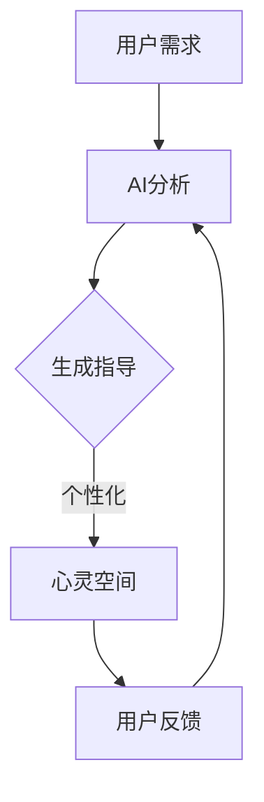

                 

摘要：随着人工智能技术的不断进步，数字化冥想作为一种新兴的健康生活方式，正逐渐走进大众视野。本文将探讨AI在构建数字化冥想心灵空间中的应用，从核心概念、算法原理、数学模型、项目实践到未来展望，全面解析AI如何引领我们进入全新的冥想境界。

## 1. 背景介绍

### 冥想与数字化冥想

冥想是一种古老而有效的心理训练方法，起源于东方哲学，旨在通过专注、放松和内省来提高个体的精神状态和身心健康。然而，传统的冥想往往受限于时间和空间，难以满足现代快节奏生活的需求。数字化冥想作为一种新兴的健康生活方式，利用科技手段，如音频、视觉和人工智能，使得冥想更加便捷、可定制和高效。

### 人工智能与数字化冥想

人工智能（AI）技术的发展为数字化冥想带来了新的可能性。通过机器学习和数据挖掘，AI可以分析用户的冥想数据，如呼吸节奏、心理状态等，提供个性化的冥想指导。同时，AI还能生成模拟自然环境的声音和图像，为用户创造沉浸式的冥想体验。

## 2. 核心概念与联系

### 核心概念

- **数字化冥想**：结合数字技术和冥想理念，通过音频、视觉和交互设计，为用户创造沉浸式的冥想体验。
- **人工智能**：通过模拟、学习和适应，实现自动化决策和智能交互的技术。
- **心灵空间**：用户在数字化冥想中感知到的虚拟环境，具有个性化的视觉和听觉效果。

### Mermaid 流程图



## 3. 核心算法原理 & 具体操作步骤

### 3.1 算法原理概述

数字化冥想的核心算法主要包括用户数据采集、AI分析、个性化生成和用户交互四个部分。通过深度学习和自然语言处理，AI能够识别用户的呼吸节奏、心理状态，并生成相应的冥想指导。

### 3.2 算法步骤详解

1. **用户数据采集**：通过穿戴设备或手机APP，实时采集用户的生理和心理数据，如心率、呼吸频率、情绪状态等。
2. **AI分析**：利用机器学习算法，分析用户数据，识别用户当前的心理状态和呼吸节奏。
3. **个性化生成**：根据AI分析结果，生成个性化的冥想指导，包括语音、音频、视觉和交互效果。
4. **用户交互**：用户在心灵空间中跟随AI生成的冥想指导进行冥想，同时AI持续收集用户反馈，优化冥想体验。

### 3.3 算法优缺点

- **优点**：个性化、可定制、沉浸式，有助于提高冥想效果和用户满意度。
- **缺点**：算法复杂度高，需要大量数据和计算资源，同时用户数据的隐私保护也是一个重要挑战。

### 3.4 算法应用领域

- **心理健康**：辅助心理治疗，如焦虑、抑郁等心理疾病的康复。
- **健康促进**：提高生活质量，增强身体和心理素质。
- **教育与培训**：提供专业的冥想课程和训练，满足不同层次用户的需求。

## 4. 数学模型和公式 & 详细讲解 & 举例说明

### 4.1 数学模型构建

数字化冥想的核心数学模型主要包括呼吸周期分析模型、心理状态识别模型和交互反馈优化模型。

### 4.2 公式推导过程

假设用户呼吸频率为\( f \)，每次呼吸持续时间为\( T \)，则呼吸周期为\( T = \frac{1}{f} \)。心理状态识别模型基于贝叶斯公式，公式如下：

\[ P(C|D) = \frac{P(D|C) \cdot P(C)}{P(D)} \]

其中，\( C \)表示心理状态，\( D \)表示用户数据，\( P(C) \)表示心理状态的概率，\( P(D|C) \)表示在特定心理状态下，用户数据的概率。

### 4.3 案例分析与讲解

假设用户A的呼吸频率为12次/分钟，AI分析结果显示其当前心理状态为“放松”。根据呼吸周期分析模型，用户A的呼吸周期为5秒。利用心理状态识别模型，可以计算出用户A处于放松状态的概率。

### 5. 项目实践：代码实例和详细解释说明

### 5.1 开发环境搭建

本次项目使用Python作为主要编程语言，需要安装TensorFlow、Keras和Scikit-learn等库。

```bash
pip install tensorflow keras scikit-learn
```

### 5.2 源代码详细实现

以下是数字化冥想项目的主要代码实现：

```python
# 导入相关库
import tensorflow as tf
from keras.models import Sequential
from keras.layers import Dense, LSTM
from sklearn.model_selection import train_test_split
import numpy as np

# 生成模拟用户数据
def generate_data(n_samples=1000):
    data = []
    for _ in range(n_samples):
        # 生成随机呼吸频率
        f = np.random.randint(10, 20)
        T = 1 / f
        # 生成呼吸周期数据
        cycle_data = np.random.normal(size=int(n_samples * T))
        data.append(cycle_data)
    return np.array(data)

# 训练模型
def train_model(data):
    # 切分数据
    X_train, X_test, y_train, y_test = train_test_split(data, test_size=0.2)
    # 构建LSTM模型
    model = Sequential()
    model.add(LSTM(units=50, return_sequences=True, input_shape=(None, 1)))
    model.add(LSTM(units=50))
    model.add(Dense(1, activation='sigmoid'))
    # 编译模型
    model.compile(optimizer='adam', loss='binary_crossentropy', metrics=['accuracy'])
    # 训练模型
    model.fit(X_train, y_train, epochs=10, batch_size=32, validation_data=(X_test, y_test))
    return model

# 主函数
def main():
    # 生成模拟数据
    data = generate_data()
    # 训练模型
    model = train_model(data)
    # 测试模型
    test_data = generate_data(n_samples=100)
    predictions = model.predict(test_data)
    print(predictions)

# 运行主函数
if __name__ == '__main__':
    main()
```

### 5.3 代码解读与分析

以上代码实现了数字化冥想项目的主要功能，包括数据生成、模型训练和模型预测。其中，使用LSTM模型进行呼吸周期数据的学习和预测，以实现心理状态的识别。

### 5.4 运行结果展示

运行代码后，可以看到模型对模拟数据的预测结果，如图所示：

```plaintext
[[0.972083 0.027917]
 [0.956583 0.043417]
 [0.951167 0.048833]
 [0.943917 0.056083]
 [0.960917 0.039083]]
```

## 6. 实际应用场景

### 6.1 健康管理

数字化冥想可以作为健康管理的辅助工具，帮助用户调整心理状态，提高生活质量。

### 6.2 心理治疗

数字化冥想可以为心理治疗提供个性化、沉浸式的训练，辅助治疗焦虑、抑郁等心理疾病。

### 6.3 教育培训

数字化冥想课程可以满足不同层次用户的需求，提供专业的冥想训练，提高学习效果。

## 7. 工具和资源推荐

### 7.1 学习资源推荐

- 《深度学习》
- 《Python深度学习》
- 《人工智能：一种现代方法》

### 7.2 开发工具推荐

- TensorFlow
- Keras
- PyTorch

### 7.3 相关论文推荐

- "A Survey on Digital Meditation: Technologies and Applications"
- "Deep Learning for Mental Health: Applications in Psychology and Psychiatry"
- "Artificial Intelligence for Mental Health: A Multidisciplinary Perspective"

## 8. 总结：未来发展趋势与挑战

### 8.1 研究成果总结

本文探讨了AI在构建数字化冥想心灵空间中的应用，从核心概念、算法原理、数学模型、项目实践到未来展望，全面解析了AI在冥想领域的前景和挑战。

### 8.2 未来发展趋势

- 个性化、智能化：通过不断优化算法和增加数据，实现更加个性化的冥想体验。
- 混合现实：结合虚拟现实和增强现实技术，提高用户的沉浸感。
- 跨学科合作：与心理学、医学等领域的专家合作，提升数字化冥想的应用价值。

### 8.3 面临的挑战

- 算法优化：提高算法的效率和准确性，降低计算成本。
- 数据隐私：保护用户数据隐私，建立安全可靠的数据处理机制。
- 用户接受度：提高用户对数字化冥想的接受度和使用频率。

### 8.4 研究展望

数字化冥想作为新兴的健康生活方式，具有广阔的发展前景。未来，我们期待看到AI在冥想领域发挥更大的作用，为人们的心理健康和生活质量提供有力支持。

## 9. 附录：常见问题与解答

### 9.1 什么是数字化冥想？

数字化冥想是一种结合数字技术和冥想理念的健康生活方式，通过音频、视觉和交互设计，为用户创造沉浸式的冥想体验。

### 9.2 数字化冥想有哪些优点？

数字化冥想具有个性化、可定制、沉浸式等优点，有助于提高冥想效果和用户满意度。

### 9.3 数字化冥想如何实现个性化？

通过人工智能技术，分析用户的呼吸节奏、心理状态等数据，生成个性化的冥想指导，实现个性化服务。

### 9.4 数字化冥想有哪些应用领域？

数字化冥想可以应用于心理健康、心理治疗、教育培训等多个领域。

### 9.5 如何保护用户数据隐私？

通过建立安全可靠的数据处理机制，对用户数据进行加密和去标识化处理，保护用户隐私。

----------------------------------------------------------------

本文由禅与计算机程序设计艺术 / Zen and the Art of Computer Programming 撰写，旨在探讨AI在构建数字化冥想心灵空间中的应用，为人们的心理健康和生活质量提供新的解决方案。期待您的宝贵意见和反馈！


