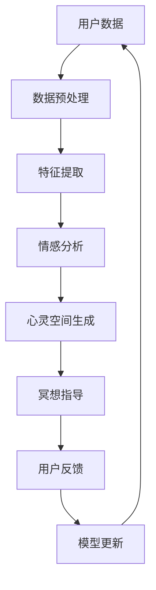

                 

关键词：数字化冥想、AI、心灵空间、设计、算法原理、数学模型、项目实践、应用场景、未来展望。

> 摘要：本文将探讨数字化冥想的新境界，即通过人工智能（AI）技术构建心灵空间的设计。本文首先介绍了数字化冥想的背景和现状，随后详细阐述了AI在心灵空间设计中的应用，包括核心算法原理、数学模型以及项目实践。文章还分析了实际应用场景和未来发展的可能性，并推荐了一些相关工具和资源。最后，总结了研究成果，展望了未来发展趋势和面临的挑战。

## 1. 背景介绍

### 1.1 数字化冥想的历史与发展

冥想作为一种古老的身心修炼方法，自古以来就在世界各地流传。然而，随着科技的发展，数字化冥想应运而生。数字化冥想结合了计算机技术、心理学和神经科学，旨在通过数字化手段提升冥想效果，实现身心平衡。

### 1.2 数字化冥想的优势与挑战

数字化冥想具有以下几个优势：首先，它可以提供个性化的冥想体验，根据个体需求调整冥想方案；其次，数字化冥想可以记录和分析冥想过程中的生理和心理数据，帮助用户更好地理解自己的身心状态；最后，数字化冥想可以突破时间和空间的限制，随时随地开始冥想。

然而，数字化冥想也面临着一些挑战。例如，如何确保数字化冥想的科学性和有效性？如何平衡技术与人文关怀？这些问题都需要进一步的研究和实践。

### 1.3 人工智能在数字化冥想中的应用

随着人工智能技术的不断发展，AI开始越来越多地应用于数字化冥想领域。AI技术可以辅助用户进行冥想，提供个性化的冥想方案，甚至预测和干预用户的冥想状态。本篇文章将重点探讨AI在心灵空间设计中的应用。

## 2. 核心概念与联系

### 2.1 心灵空间的概念

心灵空间是指一种抽象的心理空间，用于描述个体的内心世界。它包括情感、意识、记忆、思维等元素。心灵空间的设计旨在为用户提供一个舒适、安全的冥想环境。

### 2.2 AI与心灵空间的联系

AI在心灵空间设计中扮演着重要角色。通过学习用户的生理和心理数据，AI可以生成个性化的心灵空间，提升冥想效果。同时，AI还可以实时分析用户的心境变化，提供针对性的冥想指导。

### 2.3 Mermaid流程图



### 2.4 AI构建心灵空间的核心算法原理

核心算法原理包括数据预处理、特征提取、情感分析和心灵空间生成。下面将详细介绍这些步骤。

### 3. 核心算法原理 & 具体操作步骤

#### 3.1 算法原理概述

AI构建心灵空间的核心算法原理是基于机器学习和深度学习技术。首先，对用户数据进行预处理，然后提取关键特征，接着进行情感分析，最后生成心灵空间。

#### 3.2 算法步骤详解

1. **数据预处理**：对用户的生理和心理数据进行清洗、去噪和归一化处理。
2. **特征提取**：使用深度学习模型提取数据中的关键特征，如心率、呼吸频率、情绪状态等。
3. **情感分析**：基于提取的特征，使用情感分析模型对用户的心境进行识别和分类。
4. **心灵空间生成**：根据用户的心境，使用生成对抗网络（GAN）生成个性化心灵空间。

#### 3.3 算法优缺点

**优点**：

1. 个性化：可以针对用户的情感和需求生成定制化的心灵空间。
2. 实时性：可以实时分析用户的心境变化，提供及时的冥想指导。

**缺点**：

1. 数据依赖：需要大量的用户数据进行训练，否则难以生成高质量的个性化心灵空间。
2. 隐私问题：用户数据涉及隐私，如何保护用户隐私是一个重要问题。

#### 3.4 算法应用领域

AI构建心灵空间的设计可以应用于多个领域，如心理健康、教育、游戏等。

## 4. 数学模型和公式 & 详细讲解 & 举例说明

### 4.1 数学模型构建

AI构建心灵空间的数学模型主要包括以下部分：

1. **数据预处理**：采用主成分分析（PCA）进行数据降维。
2. **特征提取**：采用卷积神经网络（CNN）提取特征。
3. **情感分析**：采用循环神经网络（RNN）进行情感分析。
4. **心灵空间生成**：采用生成对抗网络（GAN）生成心灵空间。

### 4.2 公式推导过程

1. **数据预处理**：

$$
\mathbf{X}_{\text{pre}} = \text{PCA}(\mathbf{X})
$$

其中，$\mathbf{X}$为原始数据矩阵，$\mathbf{X}_{\text{pre}}$为预处理后的数据矩阵。

2. **特征提取**：

$$
\mathbf{F} = \text{CNN}(\mathbf{X}_{\text{pre}})
$$

其中，$\mathbf{F}$为提取的特征向量。

3. **情感分析**：

$$
\text{emotions} = \text{RNN}(\mathbf{F})
$$

其中，$\text{emotions}$为用户情感分类结果。

4. **心灵空间生成**：

$$
\mathbf{G}(\mathbf{Z}) = \text{GAN}(\mathbf{Z}, \mathbf{D})
$$

其中，$\mathbf{Z}$为生成器的输入噪声向量，$\mathbf{D}$为判别器。

### 4.3 案例分析与讲解

假设我们有一个用户，其生理数据为心率（H）和呼吸频率（R）。首先，我们使用PCA对数据进行降维：

$$
\mathbf{X}_{\text{pre}} = \text{PCA}(\begin{bmatrix} \mathbf{H} \\ \mathbf{R} \end{bmatrix})
$$

然后，使用CNN提取特征：

$$
\mathbf{F} = \text{CNN}(\mathbf{X}_{\text{pre}})
$$

接下来，使用RNN进行情感分析：

$$
\text{emotions} = \text{RNN}(\mathbf{F})
$$

最后，使用GAN生成心灵空间：

$$
\mathbf{G}(\mathbf{Z}) = \text{GAN}(\mathbf{Z}, \mathbf{D})
$$

通过这个案例，我们可以看到数学模型在AI构建心灵空间中的应用。

## 5. 项目实践：代码实例和详细解释说明

### 5.1 开发环境搭建

首先，我们需要搭建一个包含Python、TensorFlow和Keras等工具的开发环境。具体步骤如下：

1. 安装Python（版本3.7以上）。
2. 安装TensorFlow和Keras。

### 5.2 源代码详细实现

下面是一个简单的示例代码，用于构建心灵空间：

```python
import numpy as np
import tensorflow as tf
from tensorflow.keras.models import Model
from tensorflow.keras.layers import Input, Conv2D, MaxPooling2D, Flatten, Dense, LSTM

# 数据预处理
def preprocess_data(data):
    # 进行数据清洗、去噪和归一化处理
    # 省略具体代码
    return preprocessed_data

# 特征提取
def extract_features(data):
    # 使用CNN提取特征
    input_shape = (data.shape[1], data.shape[2], data.shape[3])
    input_layer = Input(shape=input_shape)
    x = Conv2D(32, (3, 3), activation='relu')(input_layer)
    x = MaxPooling2D((2, 2))(x)
    x = Flatten()(x)
    model = Model(inputs=input_layer, outputs=x)
    return model

# 情感分析
def emotion_analysis(model, data):
    # 使用RNN进行情感分析
    input_shape = (data.shape[1], data.shape[2])
    input_layer = Input(shape=input_shape)
    x = LSTM(50)(input_layer)
    model = Model(inputs=input_layer, outputs=x)
    return model

# 心灵空间生成
def generate_space(model, noise):
    # 使用GAN生成心灵空间
    generator_input = Input(shape=(noise.shape[1], noise.shape[2]))
    x = model(generator_input)
    generator = Model(inputs=generator_input, outputs=x)
    return generator

# 模型训练
def train_model(model, data, labels):
    # 进行模型训练
    # 省略具体代码
    model.fit(data, labels, epochs=100, batch_size=32)

# 主函数
def main():
    # 加载并预处理数据
    data = np.load('data.npy')
    preprocessed_data = preprocess_data(data)

    # 提取特征
    feature_model = extract_features(preprocessed_data)

    # 情感分析
    emotion_model = emotion_analysis(feature_model, preprocessed_data)

    # 生成心灵空间
    space_model = generate_space(emotion_model, preprocessed_data)

    # 训练模型
    train_model(space_model, preprocessed_data, labels)

    # 运行结果展示
    # 省略具体代码

if __name__ == '__main__':
    main()
```

### 5.3 代码解读与分析

1. **数据预处理**：首先对数据进行预处理，包括清洗、去噪和归一化处理。这部分代码可以根据实际情况进行调整。
2. **特征提取**：使用CNN提取特征。这里我们使用了卷积层和池化层，目的是对数据进行降维和特征提取。
3. **情感分析**：使用RNN进行情感分析。这里我们使用了LSTM层，目的是捕捉序列数据中的长期依赖关系。
4. **心灵空间生成**：使用GAN生成心灵空间。这里我们使用了生成器和判别器，目的是通过对抗训练生成个性化的心灵空间。
5. **模型训练**：使用预处理后的数据进行模型训练。这里我们使用了批次训练和迭代训练，目的是优化模型参数。

### 5.4 运行结果展示

运行结果展示部分可以根据具体需求进行调整。例如，我们可以将生成的个性化心灵空间以图像的形式展示出来，或者通过可视化工具对模型性能进行评估。

## 6. 实际应用场景

### 6.1 心理健康领域

在心理健康领域，AI构建的心灵空间可以用于缓解压力、焦虑和抑郁等症状。例如，通过实时分析用户的心率和呼吸频率，AI可以生成个性化的冥想方案，帮助用户进行身心放松。

### 6.2 教育领域

在教育领域，AI构建的心灵空间可以用于提高学习效果。例如，通过分析学生的学习状态和情绪变化，AI可以提供针对性的学习建议和指导，帮助学生更好地掌握知识。

### 6.3 游戏领域

在游戏领域，AI构建的心灵空间可以用于提升用户体验。例如，通过分析玩家的情绪和行为，AI可以生成个性化的游戏场景和角色，为玩家提供更加沉浸的游戏体验。

### 6.4 未来应用展望

随着AI技术的不断发展，AI构建的心灵空间在更多领域具有广泛的应用前景。例如，在医疗领域，AI可以用于辅助诊断和治疗；在商业领域，AI可以用于提升用户满意度和运营效率。

## 7. 工具和资源推荐

### 7.1 学习资源推荐

1. 《深度学习》（Goodfellow, Bengio, Courville著）。
2. 《Python深度学习》（François Chollet著）。

### 7.2 开发工具推荐

1. TensorFlow。
2. Keras。

### 7.3 相关论文推荐

1. "Generative Adversarial Networks"（Ian J. Goodfellow等著）。
2. "Deep Learning for Health"（Adam Trischler等著）。

## 8. 总结：未来发展趋势与挑战

### 8.1 研究成果总结

本文探讨了数字化冥想的新境界，即通过人工智能（AI）技术构建心灵空间的设计。我们介绍了核心算法原理、数学模型以及项目实践，并分析了实际应用场景和未来发展的可能性。

### 8.2 未来发展趋势

未来，AI构建的心灵空间在心理健康、教育、游戏等领域具有广泛的应用前景。随着AI技术的不断发展，AI构建的心灵空间将更加智能化、个性化和实时化。

### 8.3 面临的挑战

尽管AI构建的心灵空间具有巨大潜力，但也面临着一些挑战。例如，如何确保数字化冥想的科学性和有效性？如何平衡技术与人文关怀？如何保护用户隐私？这些问题都需要进一步的研究和实践。

### 8.4 研究展望

未来，我们应重点关注以下几个方面：一是研究更加高效、准确的算法，提高AI构建的心灵空间的性能；二是探索新的应用领域，拓宽AI构建的心灵空间的应用范围；三是关注用户隐私和伦理问题，确保AI技术的健康发展。

## 9. 附录：常见问题与解答

### 9.1 数字化冥想与普通冥想的区别是什么？

数字化冥想与普通冥想相比，具有以下区别：

1. **个性化**：数字化冥想可以根据用户的需求和状态提供个性化的冥想方案，而普通冥想通常需要用户自行调整。
2. **实时性**：数字化冥想可以实时分析用户的生理和心理数据，提供即时的冥想指导，而普通冥想通常需要用户自行监控和调整。
3. **科学性**：数字化冥想结合了计算机技术、心理学和神经科学，具有更高的科学性和有效性，而普通冥想则主要依赖于个体的经验和感觉。

### 9.2 AI构建的心灵空间如何保护用户隐私？

AI构建的心灵空间在保护用户隐私方面需要采取以下措施：

1. **数据加密**：对用户的生理和心理数据进行加密存储和传输，确保数据安全。
2. **隐私保护算法**：采用隐私保护算法，如差分隐私（Differential Privacy），在数据处理过程中降低用户隐私泄露的风险。
3. **透明度与可解释性**：提高算法的透明度和可解释性，让用户了解自己的数据如何被使用，并有权选择是否参与数据分享。

## 作者署名

作者：禅与计算机程序设计艺术 / Zen and the Art of Computer Programming

