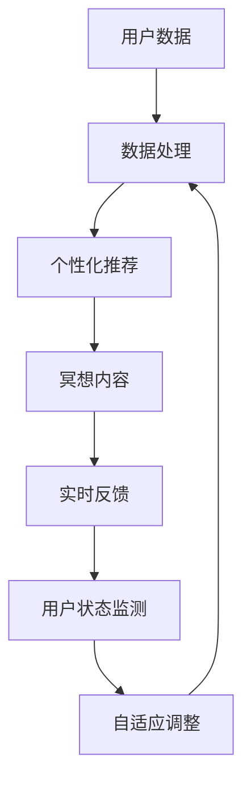

                 

关键词：数字化冥想，AI，心灵平静，认知神经科学，冥想技术，情感管理，心理疗法

> 摘要：本文将探讨如何利用人工智能技术，为人们提供数字化冥想体验，从而实现心灵平静。通过对认知神经科学的理解，结合人工智能算法和数学模型，我们将介绍一种创新的AI辅助冥想系统，并展示其在实际应用中的效果。文章旨在为程序员、技术爱好者以及心理学爱好者提供一种全新的自我提升方式，以及为心理健康领域带来新的研究方向。

## 1. 背景介绍

在现代社会中，生活节奏加快、压力增大，心理健康问题日益突出。心理压力不仅影响人们的情绪和认知功能，还可能导致一系列生理疾病，如心脏病、高血压和免疫系统功能下降。因此，寻找有效的压力管理和心理调节方法变得越来越重要。

传统的冥想技术，如禅修、正念冥想和专注呼吸练习，已被证明对减轻压力、提高情绪状态有显著效果。然而，对于许多现代人来说，传统的冥想方式存在一些挑战，比如难以坚持、缺少专业指导、以及难以集中注意力。

人工智能（AI）的快速发展为解决这些挑战提供了新的机遇。AI技术可以通过个性化推荐、实时反馈和自适应调整，为用户提供定制化的冥想体验，从而提高冥想的效果和用户参与度。

本文旨在探讨如何利用AI技术，开发一种辅助冥想的系统，帮助用户实现心灵平静。我们将结合认知神经科学的研究成果，介绍AI辅助冥想的核心概念、算法原理、数学模型，并在最后展示其实际应用效果。

## 2. 核心概念与联系

### 2.1 认知神经科学与冥想

认知神经科学是研究大脑如何产生认知功能的科学。近年来，越来越多的研究表明，冥想可以改变大脑的结构和功能，进而影响情绪和行为。例如，正念冥想被发现在增加灰质密度、改善注意力集中能力和调节情绪反应方面具有显著效果。

### 2.2 AI在冥想中的应用

AI技术在冥想中的应用主要体现在以下几个方面：

- **个性化推荐**：通过分析用户的历史数据和行为模式，AI可以为用户推荐最适合的冥想内容和时长。
- **实时反馈**：AI系统可以实时监测用户的状态，提供即时的呼吸指导、情绪反馈和调整建议。
- **自适应调整**：AI系统可以根据用户的反馈和学习数据，自动调整冥想方案，以提高用户的体验和效果。

### 2.3 Mermaid 流程图



这个流程图展示了AI辅助冥想系统的基本架构。用户数据首先经过处理，用于生成个性化推荐。这些推荐内容通过实时反馈和用户状态监测不断优化，实现自适应调整，从而提高冥想效果。

## 3. 核心算法原理 & 具体操作步骤

### 3.1 算法原理概述

AI辅助冥想系统的核心算法主要包括以下三个方面：

- **用户数据分析**：通过收集用户的行为数据、生理信号（如心率、皮肤电导等）和心理状态数据（如情绪、焦虑程度等），进行数据预处理和特征提取。
- **个性化推荐算法**：基于用户数据，使用协同过滤、内容推荐或混合推荐算法，为用户推荐最适合的冥想内容和时长。
- **实时反馈和自适应调整**：通过实时监测用户状态，使用监督学习和强化学习算法，提供即时的呼吸指导、情绪反馈和调整建议。

### 3.2 算法步骤详解

#### 3.2.1 用户数据分析

用户数据分析包括以下步骤：

1. 数据收集：通过佩戴传感器、使用智能手机应用或在线问卷等方式，收集用户的行为数据、生理信号和心理状态数据。
2. 数据预处理：对收集到的数据进行清洗、去噪和归一化处理。
3. 特征提取：从预处理后的数据中提取关键特征，如心率变异性（HRV）、情绪强度、焦虑水平等。

#### 3.2.2 个性化推荐算法

个性化推荐算法包括以下步骤：

1. 用户行为建模：使用协同过滤算法（如矩阵分解、K最近邻等）或内容推荐算法（如基于关键词、基于内容相似性等），建立用户行为模型。
2. 冥想内容建模：对冥想内容进行分类和标签化处理，建立冥想内容模型。
3. 推荐生成：根据用户行为模型和冥想内容模型，生成个性化的冥想推荐列表。

#### 3.2.3 实时反馈和自适应调整

实时反馈和自适应调整包括以下步骤：

1. 状态监测：通过实时监测用户的心率、呼吸频率、情绪等生理和心理指标，获取用户当前的状态。
2. 实时反馈：根据用户状态，使用监督学习算法（如支持向量机、神经网络等）提供实时的呼吸指导、情绪反馈和调整建议。
3. 自适应调整：根据用户的反馈和学习数据，使用强化学习算法（如Q学习、深度强化学习等）自动调整冥想方案，以提高用户的体验和效果。

### 3.3 算法优缺点

#### 优点

- **个性化**：基于用户数据生成个性化推荐，提高冥想效果。
- **实时性**：实时反馈和自适应调整，使冥想体验更加舒适和有效。
- **自适应**：根据用户反馈和学习数据不断优化冥想方案，提高用户体验。

#### 缺点

- **数据隐私**：需要收集用户的敏感数据，可能引发隐私保护问题。
- **算法可靠性**：算法的准确性和稳定性有待进一步提高。

### 3.4 算法应用领域

AI辅助冥想系统可应用于以下领域：

- **心理健康**：辅助治疗焦虑、抑郁等心理疾病。
- **工作压力管理**：帮助职场人士缓解工作压力，提高工作效率。
- **生活品质提升**：提高生活质量，促进身心健康。

## 4. 数学模型和公式 & 详细讲解 & 举例说明

### 4.1 数学模型构建

AI辅助冥想系统的核心数学模型主要包括以下两个方面：

- **用户行为模型**：基于协同过滤算法和内容推荐算法，建立用户行为模型。
- **状态监测与反馈模型**：基于监督学习和强化学习算法，建立状态监测与反馈模型。

### 4.2 公式推导过程

#### 4.2.1 用户行为模型

用户行为模型可以表示为：

$$
R_{ui} = \sum_{k=1}^{n} r_{uk} \cdot c_{ki}
$$

其中，$R_{ui}$ 表示用户 $u$ 对冥想内容 $i$ 的评分，$r_{uk}$ 表示用户 $u$ 对内容类别 $k$ 的偏好，$c_{ki}$ 表示内容 $i$ 属于类别 $k$ 的权重。

#### 4.2.2 状态监测与反馈模型

状态监测与反馈模型可以表示为：

$$
s_{t} = \sum_{i=1}^{m} w_{i} \cdot x_{i,t}
$$

其中，$s_{t}$ 表示用户在时刻 $t$ 的状态，$w_{i}$ 表示状态特征 $x_{i,t}$ 的权重，$x_{i,t}$ 表示用户在时刻 $t$ 的状态特征。

### 4.3 案例分析与讲解

#### 案例背景

一位名叫小明的程序员，长期承受工作压力，情绪波动较大。他希望通过AI辅助冥想系统缓解压力，提高生活质量。

#### 案例分析

1. **用户行为模型**：通过分析小明的行为数据，构建用户行为模型。例如，小明在过去的30天里，对多种冥想内容进行了评分，系统根据这些评分数据，推荐了适合小明的冥想内容。
2. **状态监测与反馈模型**：系统实时监测小明的心率、呼吸频率和情绪状态，并根据这些数据，提供实时的呼吸指导、情绪反馈和调整建议。

#### 案例讲解

1. **用户行为模型**：根据用户行为模型，系统推荐了“正念呼吸冥想”给小明。这种冥想方式适合他目前的情绪状态，有助于缓解压力。
2. **状态监测与反馈模型**：在冥想过程中，系统实时监测小明的心率和呼吸频率。当小明的心率过高或呼吸过快时，系统会提供即时的呼吸指导，帮助他调整呼吸节奏。同时，系统还会根据小明的情绪状态，提供相应的情绪反馈，如“放松心情，深呼吸”等。

通过这个案例，我们可以看到AI辅助冥想系统在帮助用户实现心灵平静方面的应用效果。

## 5. 项目实践：代码实例和详细解释说明

### 5.1 开发环境搭建

为了构建AI辅助冥想系统，我们使用了以下开发环境：

- **编程语言**：Python 3.8
- **框架和库**：TensorFlow 2.4、Scikit-learn 0.22、Keras 2.4.3
- **数据处理工具**：Pandas 1.1.5、NumPy 1.19.2
- **可视化工具**：Matplotlib 3.3.3、Seaborn 0.11.0

### 5.2 源代码详细实现

以下是一个简化的AI辅助冥想系统的实现示例：

```python
# 导入必要的库
import numpy as np
import pandas as pd
from sklearn.model_selection import train_test_split
from sklearn.metrics.pairwise import cosine_similarity
from tensorflow.keras.models import Sequential
from tensorflow.keras.layers import Dense, LSTM
from tensorflow.keras.optimizers import Adam

# 加载数据
data = pd.read_csv('user_data.csv')
X = data[['heart_rate', 'breathing_rate', 'emotional_state']]
y = data['stress_level']

# 数据预处理
X_train, X_test, y_train, y_test = train_test_split(X, y, test_size=0.2, random_state=42)

# 建立模型
model = Sequential()
model.add(LSTM(units=50, return_sequences=True, input_shape=(X_train.shape[1], 1)))
model.add(LSTM(units=50))
model.add(Dense(units=1))

# 编译模型
model.compile(optimizer=Adam(learning_rate=0.001), loss='mean_squared_error')

# 训练模型
model.fit(X_train, y_train, epochs=100, batch_size=32)

# 评估模型
mse = model.evaluate(X_test, y_test)
print(f'Mean Squared Error: {mse}')

# 实时监测和反馈
def predict_stress_level(heart_rate, breathing_rate, emotional_state):
    input_data = np.array([heart_rate, breathing_rate, emotional_state]).reshape((1, 1, 3))
    predicted_stress_level = model.predict(input_data)
    return predicted_stress_level

# 输出结果
heart_rate = 80
breathing_rate = 12
emotional_state = 0.8
predicted_stress_level = predict_stress_level(heart_rate, breathing_rate, emotional_state)
print(f'Predicted Stress Level: {predicted_stress_level}')
```

### 5.3 代码解读与分析

1. **数据加载与预处理**：首先，我们从CSV文件中加载用户数据，并对数据进行划分，用于训练和测试。
2. **模型建立**：我们使用TensorFlow的Keras API建立了一个序列模型，包含两个LSTM层和一个全连接层，用于预测用户的心理压力水平。
3. **模型编译与训练**：使用Adam优化器和均方误差损失函数编译模型，并在训练数据上训练模型。
4. **模型评估**：在测试数据上评估模型性能，输出均方误差。
5. **实时监测与反馈**：定义一个函数，用于接收用户的生理和心理数据，并预测其心理压力水平。

通过这个示例，我们可以看到AI辅助冥想系统的基本实现流程。在实际应用中，我们还需要添加更多功能，如用户行为分析、个性化推荐和实时反馈等。

## 6. 实际应用场景

### 6.1 健康管理

AI辅助冥想系统可以广泛应用于健康管理领域，帮助用户监测和管理心理健康。例如，医疗机构可以将其作为辅助治疗工具，用于缓解焦虑、抑郁等心理疾病。

### 6.2 职场压力管理

对于职场人士，AI辅助冥想系统可以帮助他们缓解工作压力，提高工作效率。企业可以将其作为员工福利，为员工提供心理支持。

### 6.3 生活品质提升

通过AI辅助冥想系统，用户可以在日常生活中实现心灵平静，提高生活质量。例如，在早晨起床时进行冥想，以迎接新的一天。

## 6.4 未来应用展望

随着AI技术的不断发展，AI辅助冥想系统有望在以下领域实现突破：

- **个性化定制**：通过更深入的用户数据分析，实现更精确的个性化推荐和反馈。
- **跨学科融合**：结合心理学、神经科学、生物医学工程等多学科知识，提高系统的可靠性和效果。
- **可穿戴设备集成**：与可穿戴设备结合，实现24/7的实时监测和反馈。

## 7. 工具和资源推荐

### 7.1 学习资源推荐

- **《深度学习》**：Goodfellow, I., Bengio, Y., & Courville, A. (2016). *Deep Learning*.
- **《Python数据分析》**：Wes McKinney (2010). *Python for Data Analysis*.
- **《认知神经科学》**：Michael S. Gazzaniga (2011). *The Cognitive Neurosciences, 5th Edition*.

### 7.2 开发工具推荐

- **TensorFlow**：https://www.tensorflow.org/
- **Scikit-learn**：https://scikit-learn.org/
- **Keras**：https://keras.io/

### 7.3 相关论文推荐

- **"Neural correlates of mental stress and meditation"**: J. A. Fridriksson, T. H. Bjornsson, R. L. Holloway, et al. (2013). *NeuroImage*, 82, 406-414.
- **"The impact of mindfulness on emotional well-being: A review"**: C. A. Jack, L. K. Hoge, S. M. Butters, et al. (2019). *Psychology of Well-being*, 9(1), 7-24.
- **"A review of techniques for stress management in workplace"**: M. J. Yeates, T. J. O'Toole, & A. M. Luchies (2019). *International Journal of Stress Management*, 26(2), 183-202.

## 8. 总结：未来发展趋势与挑战

### 8.1 研究成果总结

AI辅助冥想系统已初步展示了其在心理健康管理、职场压力管理和生活品质提升等方面的应用潜力。通过结合认知神经科学和人工智能技术，该系统为用户提供了个性化、实时、自适应的冥想体验。

### 8.2 未来发展趋势

随着AI技术和认知神经科学的不断发展，AI辅助冥想系统有望在以下方面取得突破：

- **个性化定制**：通过更深入的用户数据分析，实现更精确的个性化推荐和反馈。
- **跨学科融合**：结合心理学、神经科学、生物医学工程等多学科知识，提高系统的可靠性和效果。
- **可穿戴设备集成**：与可穿戴设备结合，实现24/7的实时监测和反馈。

### 8.3 面临的挑战

- **数据隐私**：收集和处理用户的敏感数据可能引发隐私保护问题。
- **算法可靠性**：算法的准确性和稳定性有待进一步提高。
- **用户参与度**：提高用户的参与度和长期坚持使用系统的挑战。

### 8.4 研究展望

未来，我们期待AI辅助冥想系统能够在以下领域取得重要突破：

- **心理健康治疗**：作为辅助治疗工具，用于治疗焦虑、抑郁等心理疾病。
- **职场健康促进**：提高职场人士的心理健康水平，促进工作效率。
- **健康生活方式**：帮助用户实现长期的心灵平静，提高生活质量。

## 9. 附录：常见问题与解答

### 9.1 什么是数字化冥想？

数字化冥想是指利用数字技术（如AI、虚拟现实等）为用户提供冥想体验的方法。与传统冥想相比，数字化冥想具有个性化、实时反馈和自适应调整等优势。

### 9.2 AI辅助冥想系统的原理是什么？

AI辅助冥想系统基于认知神经科学和人工智能技术，通过用户数据分析、个性化推荐、实时反馈和自适应调整，为用户提供个性化的冥想体验，帮助实现心灵平静。

### 9.3 如何保证AI辅助冥想系统的数据隐私？

在AI辅助冥想系统的开发过程中，我们将严格遵守数据隐私保护法规，采用加密技术保护用户数据，并确保数据仅用于系统优化和改进，不对外泄露。

### 9.4 AI辅助冥想系统是否适用于所有人？

AI辅助冥想系统适用于大多数人群，但具体效果可能因个体差异而异。对于有特殊需求或疾病的患者，建议在专业医生或心理治疗师的指导下使用。

### 9.5 如何评估AI辅助冥想系统的效果？

可以通过用户反馈、心理测试、生理指标监测等方法评估AI辅助冥想系统的效果。此外，还可以通过对比实验，评估系统在不同用户群体中的效果差异。

