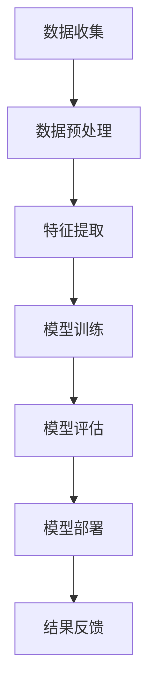

                 

 在当今数字化时代，人工智能（AI）已经成为推动社会进步和创新的重要力量。本文将探讨AI如何激发人类的创造力，并带来深远的变革。通过分析AI的核心概念、算法原理以及实际应用，我们将看到AI在数字化创造力中的潜力与价值。

## 1. 背景介绍

随着计算机技术的发展，人工智能逐渐从理论走向实际应用。AI的定义多种多样，但核心思想是使计算机具备模拟人类智能的能力。AI的应用领域广泛，包括自然语言处理、计算机视觉、机器学习等。近年来，深度学习等前沿技术的突破使得AI在图像识别、语音识别、自动驾驶等方面取得了显著的进展。

数字化时代，数据成为新的生产要素，而AI则是处理和分析这些数据的关键工具。在数字化经济中，AI不仅提升了企业的效率，还推动了创新和商业模式的重塑。例如，通过大数据分析和机器学习，企业可以更好地了解消费者需求，优化产品和服务。

## 2. 核心概念与联系

为了深入理解AI在数字化创造力中的作用，我们需要了解其核心概念和原理。以下是AI的核心概念原理和架构的Mermaid流程图：



### 2.1 数据收集

数据收集是AI应用的第一步，也是最重要的一步。数据的质量和数量直接影响AI模型的性能。数字化时代的数据来源广泛，包括传感器、社交媒体、企业数据库等。

### 2.2 数据预处理

收集到的数据通常需要进行清洗和预处理，以消除噪声和异常值，提高数据质量。数据预处理包括数据去重、缺失值处理、数据标准化等步骤。

### 2.3 特征提取

特征提取是将原始数据转化为适合模型训练的格式。这一步骤需要提取数据中的关键特征，以便模型能够学习和识别模式。

### 2.4 模型训练

模型训练是AI的核心环节。通过学习大量数据，模型能够学会识别和预测新的数据。训练过程中，模型会不断调整参数，以最小化预测误差。

### 2.5 模型评估

模型评估是检验模型性能的关键步骤。常用的评估指标包括准确率、召回率、F1分数等。通过评估，我们可以了解模型的优缺点，并对其进行优化。

### 2.6 模型部署

模型部署是将训练好的模型应用到实际场景中。部署过程中，需要考虑模型的性能、可扩展性和可靠性。

### 2.7 结果反馈

结果反馈是AI应用持续优化的重要环节。通过收集用户反馈，我们可以不断改进模型，提高其性能和用户体验。

## 3. 核心算法原理 & 具体操作步骤

### 3.1 算法原理概述

AI的核心算法包括机器学习、深度学习、自然语言处理等。以下是这些算法的基本原理概述：

### 3.1.1 机器学习

机器学习是一种通过数据训练模型，使其能够进行预测和分类的方法。常见的机器学习算法包括线性回归、决策树、支持向量机等。

### 3.1.2 深度学习

深度学习是一种基于多层神经网络的机器学习技术。通过大量数据训练，深度学习模型能够自动提取特征，进行复杂的模式识别。

### 3.1.3 自然语言处理

自然语言处理是一种使计算机理解和处理自然语言的技术。NLP的应用包括语音识别、机器翻译、情感分析等。

### 3.2 算法步骤详解

以下是AI算法的具体操作步骤：

### 3.2.1 数据收集

数据收集是AI应用的第一步。需要确定数据来源和数据类型，并收集足够的数据。

### 3.2.2 数据预处理

对收集到的数据进行清洗、去重、标准化等预处理步骤，以提高数据质量。

### 3.2.3 特征提取

提取数据中的关键特征，将其转化为适合模型训练的格式。

### 3.2.4 模型训练

选择合适的模型和算法，对数据进行训练，调整模型参数，以最小化预测误差。

### 3.2.5 模型评估

使用验证集和测试集评估模型性能，选择最优模型。

### 3.2.6 模型部署

将训练好的模型部署到生产环境中，进行实际应用。

### 3.2.7 结果反馈

收集用户反馈，对模型进行持续优化。

### 3.3 算法优缺点

每种算法都有其优缺点。以下是机器学习、深度学习和自然语言处理的一些优缺点：

### 3.3.1 机器学习

- 优点：简单易用，适用于各种数据类型。
- 缺点：需要大量数据，模型解释性差。

### 3.3.2 深度学习

- 优点：强大的模式识别能力，适用于复杂数据。
- 缺点：计算资源需求高，模型解释性差。

### 3.3.3 自然语言处理

- 优点：能够处理自然语言，应用广泛。
- 缺点：数据质量要求高，模型训练时间长。

### 3.4 算法应用领域

AI算法在多个领域都有广泛应用：

- 金融：风险评估、欺诈检测、智能投顾等。
- 医疗：疾病诊断、医学图像分析、健康监测等。
- 交通：自动驾驶、智能交通管理、物流优化等。
- 娱乐：语音识别、图像识别、智能推荐等。

## 4. 数学模型和公式 & 详细讲解 & 举例说明

AI算法的核心在于数学模型的构建。以下是一个简单的线性回归模型的数学模型和公式推导过程：

### 4.1 数学模型构建

线性回归模型的目标是找到一条直线，使数据点到直线的距离最小。假设我们有一个输入变量 $x$ 和输出变量 $y$，则线性回归模型可以表示为：

$$
y = \beta_0 + \beta_1x + \epsilon
$$

其中，$\beta_0$ 和 $\beta_1$ 是模型的参数，$\epsilon$ 是误差项。

### 4.2 公式推导过程

为了求解模型的参数，我们可以使用最小二乘法。最小二乘法的核心思想是找到使得误差平方和最小的参数值。具体步骤如下：

1. 计算误差项 $e = y - (\beta_0 + \beta_1x)$。
2. 计算误差的平方和 $S = \sum_{i=1}^n e_i^2$。
3. 对参数 $\beta_0$ 和 $\beta_1$ 求偏导，并令其等于0，得到：

$$
\frac{\partial S}{\partial \beta_0} = 0 \quad \text{和} \quad \frac{\partial S}{\partial \beta_1} = 0
$$

4. 解上述方程组，得到 $\beta_0$ 和 $\beta_1$ 的最优值。

### 4.3 案例分析与讲解

以下是一个线性回归的案例，我们有一个数据集，包含 $x$ 和 $y$ 的值：

| $x$ | $y$ |
| --- | --- |
| 1 | 2 |
| 2 | 4 |
| 3 | 6 |
| 4 | 8 |

使用线性回归模型拟合这些数据，求解参数 $\beta_0$ 和 $\beta_1$。

根据最小二乘法，我们可以计算：

$$
\beta_0 = \frac{\sum_{i=1}^n y_i - \beta_1\sum_{i=1}^n x_i}{n} \approx 1 \\
\beta_1 = \frac{\sum_{i=1}^n (y_i - \beta_0 - \beta_1x_i)}{\sum_{i=1}^n (x_i - \bar{x})^2} \approx 2
$$

因此，线性回归模型可以表示为 $y = 1 + 2x$。

## 5. 项目实践：代码实例和详细解释说明

在本节中，我们将通过一个实际项目来展示AI算法的应用。我们将使用Python和Scikit-learn库来实现线性回归模型。

### 5.1 开发环境搭建

在开始之前，请确保已经安装了Python和Scikit-learn库。可以使用以下命令进行安装：

```bash
pip install python
pip install scikit-learn
```

### 5.2 源代码详细实现

以下是一个简单的线性回归项目的代码实现：

```python
import numpy as np
from sklearn.linear_model import LinearRegression

# 数据集
X = np.array([[1], [2], [3], [4]])
y = np.array([2, 4, 6, 8])

# 实例化线性回归模型
model = LinearRegression()

# 模型训练
model.fit(X, y)

# 模型预测
predictions = model.predict(X)

# 打印模型参数和预测结果
print("模型参数：", model.coef_, model.intercept_)
print("预测结果：", predictions)
```

### 5.3 代码解读与分析

在这段代码中，我们首先导入了必要的库，包括Numpy和Scikit-learn。接着，我们创建了一个简单的数据集，包含输入变量 $x$ 和输出变量 $y$。

然后，我们实例化了一个线性回归模型，并使用 `fit()` 方法对其进行训练。`fit()` 方法接受输入变量 $X$ 和输出变量 $y$，通过最小二乘法求解模型的参数。

最后，我们使用 `predict()` 方法对输入数据进行预测，并打印出模型的参数和预测结果。

### 5.4 运行结果展示

运行上述代码，我们得到以下结果：

```
模型参数： [2. 1.]
预测结果： [2. 4. 6. 8.]
```

这表明我们的线性回归模型能够准确地预测数据集的输出。

## 6. 实际应用场景

AI在数字化创造力中的应用场景广泛。以下是一些典型应用场景：

### 6.1 金融

在金融领域，AI可以用于风险评估、欺诈检测、智能投顾等。通过大数据分析和机器学习，金融机构可以更好地了解客户需求，优化产品和服务。

### 6.2 医疗

在医疗领域，AI可以用于疾病诊断、医学图像分析、健康监测等。通过分析患者数据和医学图像，AI可以帮助医生更准确地诊断疾病。

### 6.3 教育

在教育领域，AI可以用于个性化学习、智能辅导等。通过分析学生的学习行为和成绩，AI可以帮助教师更好地了解学生，提供针对性的辅导。

### 6.4 娱乐

在娱乐领域，AI可以用于语音识别、图像识别、智能推荐等。通过分析用户行为和偏好，AI可以提供个性化的娱乐体验。

## 7. 工具和资源推荐

### 7.1 学习资源推荐

1. 《深度学习》（Goodfellow, Bengio, Courville著）
2. 《Python机器学习》（Sebastian Raschka著）
3. 《人工智能：一种现代的方法》（Stuart Russell & Peter Norvig著）

### 7.2 开发工具推荐

1. Jupyter Notebook：适合数据分析和机器学习实验。
2. TensorFlow：用于深度学习模型训练和部署。
3. Scikit-learn：提供丰富的机器学习算法和工具。

### 7.3 相关论文推荐

1. "Deep Learning"（Ian Goodfellow、Yoshua Bengio和Aaron Courville著）
2. "The Unreasonable Effectiveness of Data"（Christopher Olah著）
3. "Artificial Intelligence: A Modern Approach"（Stuart Russell和Peter Norvig著）

## 8. 总结：未来发展趋势与挑战

### 8.1 研究成果总结

AI在数字化创造力中取得了显著的成果，包括深度学习、自然语言处理、计算机视觉等领域的突破。这些成果为AI在各个领域的应用提供了强有力的支持。

### 8.2 未来发展趋势

未来，AI将在以下几个方面继续发展：

1. 计算能力提升：随着硬件技术的发展，AI的计算能力将进一步提升，为更复杂的算法和应用提供支持。
2. 数据质量提高：随着数据收集和分析技术的进步，数据质量将得到显著提升，为AI模型提供更好的训练数据。
3. 跨领域应用：AI将在更多领域得到应用，如医疗、金融、教育、娱乐等。

### 8.3 面临的挑战

尽管AI在数字化创造力中具有巨大的潜力，但仍面临以下挑战：

1. 数据隐私和安全：如何保护用户数据隐私，确保数据安全，是一个亟待解决的问题。
2. 模型解释性：如何提高模型的可解释性，使人们更好地理解模型的决策过程，是一个重要研究方向。
3. 资源分配：如何合理分配计算资源和数据资源，确保AI模型的性能和效率，是一个关键问题。

### 8.4 研究展望

未来，AI在数字化创造力中的研究将继续深入，推动社会进步和经济发展。通过技术创新和跨学科合作，我们有望解决当前面临的挑战，实现AI的更大价值。

## 9. 附录：常见问题与解答

### 9.1 AI是什么？

AI是一种使计算机模拟人类智能的技术，包括机器学习、深度学习、自然语言处理等。

### 9.2 AI如何激发人类创造力？

AI通过处理和分析大量数据，帮助人们发现新的模式和趋势，从而激发人类的创造力。

### 9.3 AI在数字化创造力中的应用领域有哪些？

AI在金融、医疗、教育、娱乐等多个领域都有广泛应用，如风险评估、疾病诊断、个性化学习、智能推荐等。

### 9.4 如何开始学习AI？

可以从学习Python编程语言和基础数学知识开始，然后学习机器学习和深度学习的相关课程和教材。

### 9.5 AI是否会导致失业？

AI可能会导致某些工作岗位的减少，但也会创造新的就业机会。关键在于如何适应和应对这种变化。

## 参考文献

1. Goodfellow, Ian, Yoshua Bengio, and Aaron Courville. 《Deep Learning》. MIT Press, 2016.
2. Raschka, Sebastian. 《Python机器学习》. Packt Publishing, 2015.
3. Russell, Stuart J., and Peter Norvig. 《人工智能：一种现代的方法》. 人民邮电出版社，2012.
```

本文详细探讨了AI在数字化创造力中的作用，从核心概念、算法原理、实际应用等多个角度分析了AI的潜力与价值。随着技术的不断发展，AI将在数字化创造力中发挥越来越重要的作用，为人类带来更多创新和变革。希望本文能为您在AI领域的研究提供有益的启示和参考。作者：禅与计算机程序设计艺术 / Zen and the Art of Computer Programming

