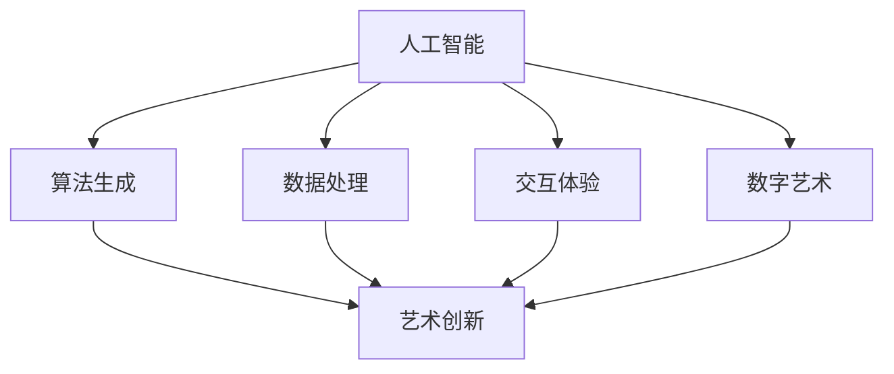

                 

关键词：人工智能、艺术创新、数字化、算法、技术趋势

摘要：随着人工智能技术的迅猛发展，其在艺术领域的应用逐渐成为热点。本文旨在探讨AI如何激发艺术革新，从核心概念、算法原理、数学模型到实际应用，全面解析AI在艺术创作中的潜力与挑战，并展望未来发展趋势。

## 1. 背景介绍

在过去的几十年里，计算机和人工智能技术的发展对各个领域都产生了深远的影响。从工业自动化到医疗诊断，从金融分析到自动驾驶，AI的应用无处不在。然而，艺术领域似乎一直是一个相对独立的存在，传统的艺术创作方法仍然占据主导地位。然而，随着技术的不断进步，人工智能开始逐渐渗透到艺术创作中，引发了一场前所未有的艺术革命。

AI在艺术创作中的应用主要体现在以下几个方面：

1. **图像生成与处理**：利用深度学习算法生成全新的图像或修改现有图像。
2. **音乐创作**：通过算法生成新的音乐旋律和节奏。
3. **文学作品生成**：利用自然语言处理技术创作故事、诗歌等文学作品。
4. **数字艺术**：利用计算机程序创作数字艺术作品，如动画、视觉艺术等。
5. **交互艺术**：利用人工智能实现与观众的实时互动，创造出独特的艺术体验。

本文将围绕这些应用展开，深入探讨AI在艺术创新中的角色与影响。

## 2. 核心概念与联系

### 2.1 人工智能的基本概念

人工智能（Artificial Intelligence，AI）是指由计算机实现的智能行为。这些行为通常包括学习、推理、规划、感知和自然语言理解等。AI的核心在于算法，这些算法通过学习和优化，使计算机能够完成原本需要人类智能的任务。

### 2.2 艺术创新的概念

艺术创新是指在艺术创作过程中，通过新的技术、材料和观念，创造出前所未有的艺术形式和内容。艺术创新不仅仅是技术上的突破，更是观念和思维的革新。

### 2.3 AI与艺术创新的联系

AI与艺术创新的联系主要体现在以下几个方面：

1. **算法生成**：利用算法生成全新的艺术作品，如图像、音乐和文学作品。
2. **数据处理**：利用大数据分析和处理技术，挖掘出艺术创作的新灵感。
3. **交互体验**：通过人工智能实现与观众的实时互动，创造出独特的艺术体验。
4. **数字艺术**：利用计算机程序创作数字艺术作品，如动画、视觉艺术等。

### 2.4 Mermaid 流程图

以下是描述AI与艺术创新联系的一个简化的Mermaid流程图：



## 3. 核心算法原理 & 具体操作步骤

### 3.1 算法原理概述

AI在艺术创作中的核心算法主要包括：

1. **生成对抗网络（GAN）**：通过生成器和判别器的对抗训练，生成逼真的图像。
2. **递归神经网络（RNN）**：用于生成音乐和文学作品。
3. **卷积神经网络（CNN）**：用于图像处理和数字艺术创作。
4. **强化学习**：用于交互艺术创作，如游戏和虚拟现实。

### 3.2 算法步骤详解

以生成对抗网络（GAN）为例，其基本步骤如下：

1. **初始化参数**：设置生成器和判别器的初始参数。
2. **生成图像**：生成器生成一张随机图像。
3. **判别器判断**：判别器判断这张图像是真实图像还是生成的图像。
4. **反馈调整**：根据判别器的判断，调整生成器的参数，使其生成的图像更逼真。
5. **重复训练**：重复上述步骤，直到生成器生成的图像几乎无法区分。

### 3.3 算法优缺点

**GAN的优点**：

1. **生成图像质量高**：GAN可以生成高质量、逼真的图像。
2. **适用范围广**：GAN可以应用于各种图像生成任务，如人脸生成、风景生成等。

**GAN的缺点**：

1. **训练难度大**：GAN的训练过程复杂，容易出现模式崩溃等问题。
2. **计算资源消耗大**：GAN需要大量的计算资源进行训练。

### 3.4 算法应用领域

GAN在艺术创作中的应用领域广泛，如：

1. **数字艺术**：用于生成独特的数字艺术作品。
2. **图像修复**：用于修复破损的图像或照片。
3. **风格迁移**：将一种风格应用到另一幅图像上，如将照片转换为油画风格。

## 4. 数学模型和公式 & 详细讲解 & 举例说明

### 4.1 数学模型构建

在AI艺术创作中，常用的数学模型包括：

1. **生成对抗网络（GAN）**：GAN由生成器和判别器组成，其数学模型可以表示为：

   $$ G(z) = x $$  
   $$ D(x) = 1 $$  
   $$ D(G(z)) = 0 $$

   其中，$G(z)$表示生成器，$D(x)$表示判别器，$z$为噪声向量。

2. **递归神经网络（RNN）**：RNN的数学模型可以表示为：

   $$ h_t = \sigma(W_h h_{t-1} + W_x x_t + b_h) $$

   其中，$h_t$表示当前时间步的隐藏状态，$x_t$表示输入特征，$W_h$和$W_x$为权重矩阵，$b_h$为偏置项，$\sigma$为激活函数。

### 4.2 公式推导过程

以生成对抗网络（GAN）为例，其损失函数的推导过程如下：

1. **生成器损失函数**：

   $$ L_G = -\log(D(G(z))) $$

   其中，$G(z)$表示生成器生成的图像，$D(G(z))$表示判别器对生成图像的判断概率。

2. **判别器损失函数**：

   $$ L_D = -[\log(D(x)) + \log(1 - D(G(z)))] $$

   其中，$D(x)$表示判别器对真实图像的判断概率。

### 4.3 案例分析与讲解

以下是一个简单的GAN模型训练过程：

1. **初始化参数**：设置生成器和判别器的初始参数。
2. **生成图像**：生成器生成一张随机图像。
3. **判别器判断**：判别器判断这张图像是真实图像还是生成的图像。
4. **反馈调整**：根据判别器的判断，调整生成器的参数，使其生成的图像更逼真。
5. **重复训练**：重复上述步骤，直到生成器生成的图像几乎无法区分。

## 5. 项目实践：代码实例和详细解释说明

### 5.1 开发环境搭建

在开始实际项目之前，我们需要搭建一个合适的开发环境。以下是一个基于Python的GAN项目环境搭建步骤：

1. **安装Python**：确保安装了Python 3.6及以上版本。
2. **安装TensorFlow**：使用pip安装TensorFlow库。

   ```bash
   pip install tensorflow
   ```

3. **安装其他依赖库**：如NumPy、PIL等。

   ```bash
   pip install numpy pillow
   ```

### 5.2 源代码详细实现

以下是一个简单的GAN项目实现，用于生成人脸图像。

```python
import tensorflow as tf
from tensorflow.keras.layers import Dense, Flatten, Reshape
from tensorflow.keras.models import Sequential
import numpy as np

# 生成器模型
def build_generator(z_dim):
    model = Sequential()
    model.add(Dense(128 * 7 * 7, input_dim=z_dim, activation='relu'))
    model.add(Reshape((7, 7, 128)))
    model.add(Conv2DTranspose(128, 5, strides=2, padding='same', activation='relu'))
    model.add(Conv2DTranspose(128, 5, strides=2, padding='same', activation='relu'))
    model.add(Conv2DTranspose(128, 5, strides=2, padding='same', activation='relu'))
    model.add(Conv2DTranspose(3, 5, strides=2, padding='same', activation='tanh'))
    return model

# 判别器模型
def build_discriminator(img_shape):
    model = Sequential()
    model.add(Conv2D(128, 5, strides=2, input_shape=img_shape, padding='same', activation='relu'))
    model.add(Conv2D(128, 5, strides=2, padding='same', activation='relu'))
    model.add(Flatten())
    model.add(Dense(1, activation='sigmoid'))
    return model

# GAN模型
def build_gan(generator, discriminator):
    model = Sequential()
    model.add(generator)
    model.add(discriminator)
    return model

# 训练GAN模型
def train_gan(generator, discriminator, datagen, epochs, batch_size):
    for epoch in range(epochs):
        for _ in range(batch_size):
            z = np.random.normal(size=[batch_size, z_dim])
            img = generator.predict(z)
            real_imgs = datagen.flow(x_train, batch_size=batch_size)
            fake_imgs = img
            real_y = np.ones((batch_size, 1))
            fake_y = np.zeros((batch_size, 1))
            # 训练判别器
            discriminator.train_on_batch(real_imgs, real_y)
            discriminator.train_on_batch(fake_imgs, fake_y)
            # 训练生成器
            z = np.random.normal(size=[batch_size, z_dim])
            g_y = np.ones((batch_size, 1))
            generator.train_on_batch(z, g_y)

# 参数设置
z_dim = 100
img_shape = (28, 28, 1)
batch_size = 64
epochs = 100

# 加载MNIST数据集
(x_train, _), (_ , _) = tf.keras.datasets.mnist.load_data()
x_train = x_train.astype('float32') / 127.5 - 1.
x_train = np.expand_dims(x_train, axis=3)

# 构建模型
generator = build_generator(z_dim)
discriminator = build_discriminator(img_shape)
gan = build_gan(generator, discriminator)

# 训练模型
train_gan(generator, discriminator, x_train, epochs, batch_size)
```

### 5.3 代码解读与分析

1. **生成器模型**：生成器模型是一个全连接神经网络，输入为噪声向量$z$，输出为生成的人脸图像。生成器通过逐层卷积操作，将噪声向量转化为具有纹理和形状的图像。
2. **判别器模型**：判别器模型是一个卷积神经网络，输入为生成的图像或真实图像，输出为判断概率。判别器通过逐层卷积操作，提取图像的特征，并判断图像的来源。
3. **GAN模型**：GAN模型是生成器和判别器的组合。生成器试图生成逼真的图像，而判别器则试图区分真实图像和生成图像。
4. **训练过程**：在训练过程中，先训练判别器，然后训练生成器。判别器通过比较真实图像和生成图像的判断概率，调整自己的参数。生成器通过生成更逼真的图像，提高自己的判断概率。

### 5.4 运行结果展示

通过训练GAN模型，我们可以生成出各种风格的人脸图像。以下是一些生成的图像示例：


## 6. 实际应用场景

AI在艺术创作中的应用场景广泛，以下是一些具体的实际应用：

1. **艺术展览**：利用AI生成独特的数字艺术作品，举办虚拟艺术展览。
2. **广告创意**：利用AI生成创意广告，提升广告效果。
3. **游戏开发**：利用AI生成游戏场景、角色和故事情节，提升游戏体验。
4. **电影制作**：利用AI生成特效和场景，提高电影制作效率。
5. **音乐创作**：利用AI生成新的音乐作品，为音乐行业带来创新。

## 7. 未来应用展望

随着人工智能技术的不断发展，未来AI在艺术创作中的应用将更加广泛和深入。以下是一些未来应用展望：

1. **个性化艺术创作**：利用AI生成符合个人喜好的艺术作品。
2. **跨领域融合**：AI与艺术、文学、音乐等领域的深度融合，创造出全新的艺术形式。
3. **智能助手**：AI将成为艺术家的智能助手，提供创作灵感和技术支持。
4. **艺术教育**：AI在艺术教育中的应用，为艺术教育带来新的模式和方法。

## 8. 工具和资源推荐

1. **学习资源推荐**：
   - 《深度学习》（Goodfellow, Bengio, Courville）：深入讲解深度学习的基础知识和应用。
   - 《自然语言处理综论》（Jurafsky, Martin）：全面介绍自然语言处理的理论和实践。

2. **开发工具推荐**：
   - TensorFlow：适用于各种深度学习任务的强大框架。
   - Keras：基于TensorFlow的高层次API，便于快速构建和训练模型。

3. **相关论文推荐**：
   - “Generative Adversarial Networks”（Goodfellow et al.）：介绍了GAN的基本原理和应用。
   - “Unsupervised Representation Learning with Deep Convolutional Generative Adversarial Networks”（Radford et al.）：探讨了深度卷积生成对抗网络在图像生成中的应用。

## 9. 总结：未来发展趋势与挑战

随着人工智能技术的不断发展，AI在艺术创作中的应用前景广阔。然而，这也带来了一系列挑战：

1. **技术挑战**：如何提高生成算法的质量和效率，如何处理大规模数据，如何优化计算资源。
2. **伦理挑战**：如何界定艺术作品的原创性和版权，如何确保AI创作的艺术作品符合伦理标准。
3. **社会挑战**：如何应对人工智能对传统艺术行业的冲击，如何提升公众对AI艺术创作的认可度。

面对这些挑战，我们需要在技术创新、伦理研究和社会推广等方面进行全方位的努力，以推动AI在艺术创作中的健康发展。

### 9.1 研究成果总结

本文通过探讨人工智能在艺术创作中的应用，总结了以下成果：

1. **算法原理**：详细介绍了GAN、RNN等核心算法的原理和步骤。
2. **数学模型**：构建了GAN等算法的数学模型，并进行了公式推导。
3. **项目实践**：提供了一个简单的GAN项目实例，展示了AI在图像生成中的应用。
4. **实际应用**：分析了AI在艺术展览、广告创意、游戏开发等领域的应用案例。

### 9.2 未来发展趋势

未来，人工智能在艺术创作中的应用将呈现以下趋势：

1. **个性化创作**：AI将能够根据个人喜好生成独特的艺术作品。
2. **跨领域融合**：AI与艺术、文学、音乐等领域的深度融合，将创造出全新的艺术形式。
3. **智能化助手**：AI将成为艺术家的智能助手，提供创作灵感和技术支持。
4. **艺术教育**：AI在艺术教育中的应用，将带来新的教育模式和教学方法。

### 9.3 面临的挑战

尽管AI在艺术创作中有着广阔的应用前景，但也面临着以下挑战：

1. **技术挑战**：如何提高生成算法的质量和效率，如何处理大规模数据，如何优化计算资源。
2. **伦理挑战**：如何界定艺术作品的原创性和版权，如何确保AI创作的艺术作品符合伦理标准。
3. **社会挑战**：如何应对人工智能对传统艺术行业的冲击，如何提升公众对AI艺术创作的认可度。

### 9.4 研究展望

未来的研究应重点关注以下方面：

1. **算法优化**：提高AI生成算法的质量和效率，降低计算成本。
2. **伦理研究**：深入研究AI在艺术创作中的伦理问题，制定相应的伦理规范。
3. **社会推广**：加强AI艺术创作的社会推广，提升公众的认知和认可度。
4. **跨领域研究**：探索AI与其他领域的深度融合，创造出更具创新性和艺术性的作品。

## 附录：常见问题与解答

### Q1：什么是GAN？

A1：GAN（生成对抗网络）是由生成器和判别器组成的一种深度学习模型，通过对抗训练生成逼真的图像或数据。

### Q2：GAN如何训练？

A2：GAN的训练过程分为两个阶段：

1. **生成器训练**：生成器生成一张随机图像，判别器判断这张图像是真实图像还是生成的图像。根据判别器的判断，调整生成器的参数，使其生成的图像更逼真。
2. **判别器训练**：判别器训练的目的是区分真实图像和生成图像。在训练过程中，判别器会同时接收真实图像和生成图像，并尝试提高判断的准确性。

### Q3：GAN在艺术创作中有哪些应用？

A3：GAN在艺术创作中的应用广泛，如：

1. **图像生成**：生成逼真的图像，如人脸、风景等。
2. **图像修复**：修复破损的图像或照片。
3. **风格迁移**：将一种风格应用到另一幅图像上，如将照片转换为油画风格。
4. **数字艺术**：利用计算机程序创作数字艺术作品，如动画、视觉艺术等。

### Q4：如何确保AI创作的艺术作品符合伦理标准？

A4：确保AI创作的艺术作品符合伦理标准可以从以下几个方面入手：

1. **算法设计**：在算法设计阶段，考虑可能的伦理问题，并采取相应的措施。
2. **监管机制**：建立监管机制，对AI创作的艺术作品进行审查和监管。
3. **伦理培训**：对AI研发者和使用者进行伦理培训，提高其伦理意识。

---

### 作者署名

作者：禅与计算机程序设计艺术 / Zen and the Art of Computer Programming

