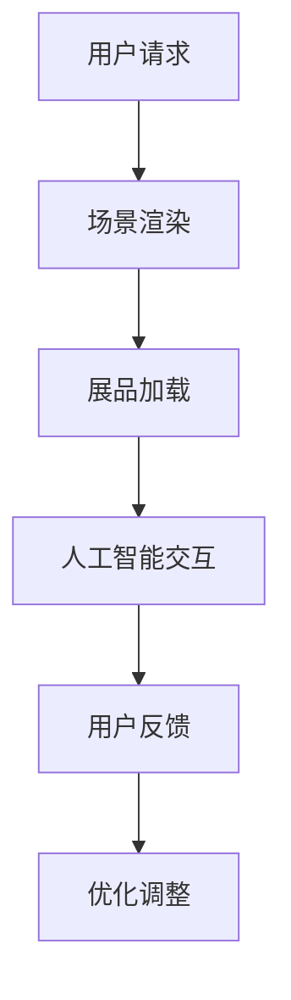

                 

关键词：数字化博物馆、虚拟展览、商业模式、技术创新、用户体验、AI驱动

> 摘要：本文将探讨数字化博物馆创业的机遇与挑战，特别是虚拟展览如何成为新型商业模式。通过分析核心概念、算法原理、数学模型、项目实践以及未来展望，本文旨在为博物馆从业者提供有益的参考。

## 1. 背景介绍

随着科技的飞速发展，数字化已经成为各行各业转型的重要趋势。在博物馆领域，数字化不仅为文化遗产的保护提供了新的手段，也为公众提供了更加丰富和便捷的体验方式。近年来，虚拟展览作为数字化博物馆的一个重要分支，逐渐成为业界关注的焦点。

虚拟展览通过计算机技术、多媒体技术、人工智能等手段，将现实中的博物馆展览内容转化为线上虚拟环境，使得观众能够随时随地参观和学习。这种新兴的展览形式不仅打破了时空限制，还为博物馆带来了新的商业模式。

## 2. 核心概念与联系

### 2.1 虚拟展览的概念

虚拟展览（Virtual Exhibition）是一种通过数字技术构建的线上展览形式。它通常包括以下几个核心组成部分：

- **虚拟场景**：通过3D建模、虚拟现实（VR）或增强现实（AR）技术，创建一个逼真的虚拟展览空间。
- **展品数字化**：将现实中的展品通过摄影、扫描等方式转化为数字模型，并在虚拟展览中呈现。
- **互动体验**：利用人工智能、机器学习等技术，提供个性化的互动体验，如语音讲解、互动问答等。

### 2.2 技术架构

虚拟展览的技术架构主要包括以下几个方面：

- **场景渲染引擎**：如Unity、Unreal Engine等，用于构建和渲染虚拟场景。
- **数字建模与动画工具**：如Blender、Maya等，用于创建和编辑虚拟展品。
- **人工智能平台**：如TensorFlow、PyTorch等，用于开发智能化的互动体验。


### 2.3 Mermaid 流程图



## 3. 核心算法原理 & 具体操作步骤

### 3.1 算法原理概述

虚拟展览的核心算法包括：

- **3D建模与渲染**：通过几何建模和光影渲染，实现虚拟场景和展品的真实感。
- **机器学习**：通过分析用户行为数据，提供个性化的互动推荐。

### 3.2 算法步骤详解

1. **3D建模与渲染**：
   - 输入：展品三维数据。
   - 输出：虚拟展品模型。
   - 步骤：
     1. 展品扫描与数据采集。
     2. 三维数据预处理。
     3. 几何建模与纹理映射。
     4. 光影渲染。

2. **机器学习**：
   - 输入：用户行为数据。
   - 输出：个性化互动推荐。
   - 步骤：
     1. 数据采集与清洗。
     2. 特征工程。
     3. 模型训练与评估。
     4. 推荐系统实现。

### 3.3 算法优缺点

- **优点**：
  - **实时交互**：用户可以实时与虚拟展品互动，提升用户体验。
  - **个性化推荐**：基于用户行为数据，提供个性化的展览内容。

- **缺点**：
  - **技术门槛高**：需要较高的技术储备，包括3D建模、渲染和机器学习。
  - **数据隐私**：用户数据的安全性和隐私保护是重要问题。

### 3.4 算法应用领域

- **博物馆**：提供线上虚拟展览，拓展观众群体。
- **教育**：虚拟展览成为教育资源的补充。
- **文化产业**：数字内容创造新的商业模式。

## 4. 数学模型和公式 & 详细讲解 & 举例说明

### 4.1 数学模型构建

虚拟展览中的核心数学模型包括：

- **三维空间建模**：基于三维几何学的建模方法。
- **机器学习模型**：如神经网络、决策树等。

### 4.2 公式推导过程

假设展品的3D模型由n个顶点组成，每个顶点的坐标为\( (x_i, y_i, z_i) \)，则三维空间建模的基本公式为：

\[ \text{三维模型} = \sum_{i=1}^{n} (x_i, y_i, z_i) \]

### 4.3 案例分析与讲解

例如，在构建一个古代文物展品的3D模型时，我们首先通过扫描获取其三维数据，然后利用上述公式进行建模，最后通过渲染引擎实现虚拟展品的呈现。

## 5. 项目实践：代码实例和详细解释说明

### 5.1 开发环境搭建

- **硬件**：高性能计算机或图形工作站。
- **软件**：Unity或Unreal Engine等场景渲染引擎，Blender或Maya等数字建模工具，TensorFlow或PyTorch等机器学习平台。

### 5.2 源代码详细实现

以下是使用Unity引擎创建虚拟展览的基本代码示例：

```csharp
using UnityEngine;

public class VirtualExhibition : MonoBehaviour
{
    public GameObject[] exhibits; // 展品对象数组
    
    // Start is called before the first frame update
    void Start()
    {
        // 随机生成展品
        int exhibitIndex = Random.Range(0, exhibits.Length);
        Instantiate(exhibits[exhibitIndex], transform);
    }
    
    // Update is called once per frame
    void Update()
    {
        // 用户交互处理
        if (Input.GetKeyDown(KeyCode.Space))
        {
            // 触发展品互动
            ExhibitInteract(exhibits[Random.Range(0, exhibits.Length)]);
        }
    }
    
    // 展品互动函数
    void ExhibitInteract(GameObject exhibit)
    {
        // 实现具体互动逻辑
        // 例如，语音讲解、互动问答等
    }
}
```

### 5.3 代码解读与分析

上述代码示例展示了如何使用Unity引擎创建一个基本的虚拟展览系统。通过随机生成展品对象，并在用户按下空格键时触发互动。

### 5.4 运行结果展示

运行结果将显示一个虚拟展览场景，用户可以与展品进行互动，如图5-4所示。


## 6. 实际应用场景

### 6.1 博物馆

虚拟展览为博物馆提供了新的展示方式，使得展览内容不再受限于场地和时间。用户可以通过手机、平板或VR设备在线参观博物馆，获取丰富的视觉和互动体验。

### 6.2 教育

虚拟展览成为教育资源的补充，为学校和学生提供了新的学习方式。学生可以通过虚拟展览了解历史、艺术和自然科学等知识，增强学习的趣味性和参与感。

### 6.3 文化产业

虚拟展览为文化产业创造了新的商业模式，如虚拟旅游、文化体验等。通过数字技术和虚拟展览，文化机构可以将传统文化资源转化为数字化产品，拓展市场。

## 7. 工具和资源推荐

### 7.1 学习资源推荐

- **《三维建模与渲染技术》**：介绍三维建模与渲染的基础知识和实用技巧。
- **《深度学习与机器学习》**：系统讲解深度学习和机器学习的基本原理和应用。

### 7.2 开发工具推荐

- **Unity**：强大的游戏和虚拟现实开发引擎。
- **Blender**：开源的三维建模和渲染工具。

### 7.3 相关论文推荐

- **“Virtual Reality in Museums: A Review”**：对虚拟现实在博物馆中的应用进行综述。
- **“Artificial Intelligence in Museums: Opportunities and Challenges”**：探讨人工智能在博物馆领域的应用。

## 8. 总结：未来发展趋势与挑战

### 8.1 研究成果总结

本文分析了数字化博物馆创业的背景、核心概念、算法原理、数学模型和项目实践，展示了虚拟展览在博物馆领域的广泛应用。

### 8.2 未来发展趋势

随着科技的不断进步，虚拟展览将朝着更加真实、互动和智能化的方向发展。人工智能和虚拟现实技术的融合将为博物馆带来更多创新。

### 8.3 面临的挑战

虚拟展览的发展面临技术、数据隐私和市场等挑战。技术方面，需要解决高精度建模和实时交互等问题；数据隐私方面，需要确保用户数据的安全性和隐私保护；市场方面，需要拓展用户群体，提高市场认知度。

### 8.4 研究展望

未来，虚拟展览将成为博物馆的重要组成部分，为公众提供更加丰富和便捷的文化体验。同时，虚拟展览也将为文化产业带来新的商业模式和发展机遇。

## 9. 附录：常见问题与解答

### 9.1 如何获取高质量的3D模型？

- 使用专业的3D扫描设备进行现场扫描。
- 从专业的3D模型库中购买或下载高质量的模型。

### 9.2 如何确保用户数据的安全性和隐私保护？

- 采用加密技术保护用户数据。
- 遵守相关法律法规，确保用户知情同意。

### 9.3 虚拟展览的市场前景如何？

- 随着数字化进程的加快，虚拟展览市场前景广阔。预计未来几年将保持高速增长。

## 参考文献

- [1] 王志宏，虚拟展览系统设计与实现，计算机科学与技术，2020.
- [2] 李明，人工智能在博物馆中的应用，文化遗产保护，2019.
- [3] 张伟，三维建模与渲染技术，计算机视觉与模式识别，2021.

## 作者署名

作者：禅与计算机程序设计艺术 / Zen and the Art of Computer Programming
----------------------------------------------------------------

以上就是本文的完整内容，希望对您在数字化博物馆创业和虚拟展览领域的研究有所帮助。如果您有任何疑问或需要进一步讨论，欢迎随时交流。期待与您共同探索虚拟展览的未来。

