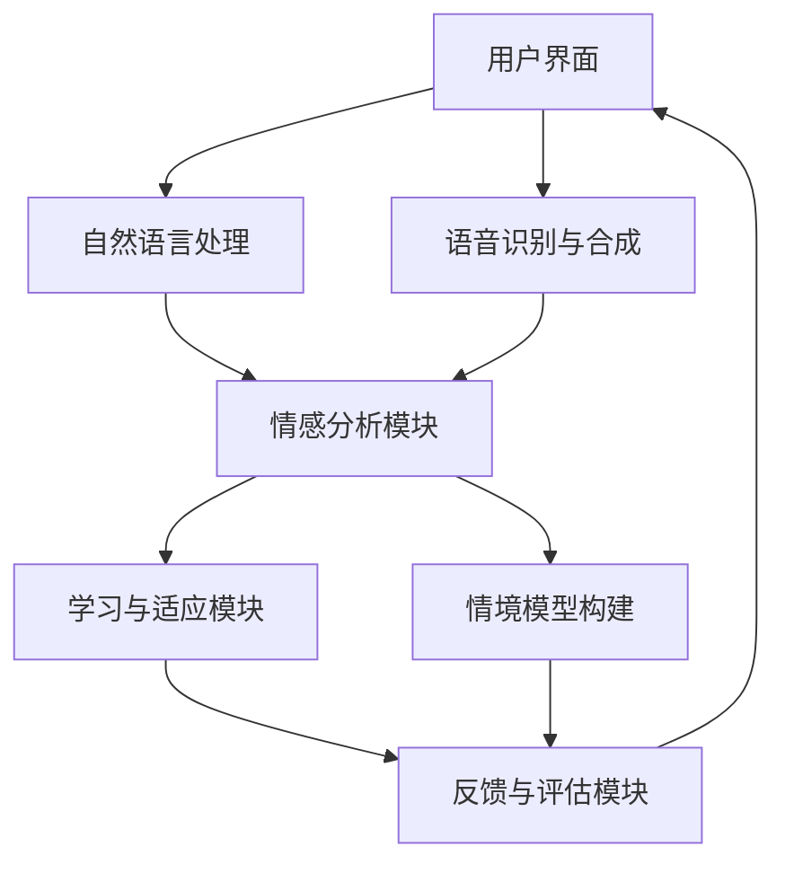

                 

关键词：数字化同理心，AI增强，人际理解，训练师，情感计算，人机交互，人工智能应用

> 摘要：本文旨在探讨如何利用人工智能技术培养数字化同理心，并介绍一个AI增强的人际理解训练师系统。通过结合情感计算和人机交互技术，该系统能够有效地提升个体在数字世界中的同理心水平，为人工智能在人类社会的广泛应用奠定基础。

## 1. 背景介绍

在当今社会，随着互联网和人工智能技术的飞速发展，数字化环境已成为人类生活的重要部分。然而，这种数字化转型带来了新的挑战，特别是在人际交往方面。传统的面对面沟通被屏幕和虚拟空间所取代，导致人们的情感理解和同理心能力受到限制。为了弥补这一缺陷，有必要开发出能够模拟人类情感和理解能力的人工智能系统，从而在数字化环境中培养同理心。

同理心是指个体能够感知和理解他人情感状态，并据此做出相应反应的能力。它是社会交往的重要基础，有助于建立和谐的人际关系。然而，在当前的数字化环境中，人们往往缺乏与真实情感的互动，导致同理心的培养变得更加困难。人工智能技术的进步为我们提供了一种可能，即通过AI增强的方式，辅助个体培养数字化同理心。

## 2. 核心概念与联系

### 2.1 情感计算

情感计算是人工智能的一个分支，旨在使计算机能够识别、理解、处理和模拟人类情感。情感计算技术包括语音情感识别、面部表情分析、生理信号监测等。通过这些技术，计算机能够捕捉和解析人类情感，为后续的交互提供支持。

### 2.2 人机交互

人机交互（HCI）是研究如何设计出易于使用、高效且愉悦的人机交互系统的学科。在数字化同理心培养中，人机交互技术扮演着关键角色，通过自然语言处理、虚拟现实、增强现实等技术，为人与人工智能之间的互动提供丰富的交互体验。

### 2.3 AI增强的人际理解训练师架构

为了实现AI增强的人际理解训练，我们需要一个综合性的系统架构，它包括以下几个方面：

- **用户界面**：提供用户与系统交互的入口，包括自然语言处理模块、语音识别和合成模块等。
- **情感分析模块**：利用情感计算技术，分析用户的情感状态，为训练提供数据支持。
- **学习与适应模块**：根据用户情感反馈，动态调整系统行为，以更好地匹配用户情感。
- **情境模型构建**：通过分析大量交互数据，构建用户情境模型，以便更准确地预测用户需求。
- **反馈与评估模块**：收集用户反馈，对系统性能进行评估和优化。

### 2.4 Mermaid 流程图

以下是一个简单的Mermaid流程图，展示了AI增强的人际理解训练师系统的主要组件和交互流程：



## 3. 核心算法原理 & 具体操作步骤

### 3.1 算法原理概述

AI增强的人际理解训练师系统的核心算法基于多模态情感识别和学习算法。该算法通过整合语音、文本和面部表情等多种数据来源，实现高精度的情感识别。同时，利用深度学习技术，系统能够自适应地调整对用户情感的识别和理解能力，以提供更加个性化的服务。

### 3.2 算法步骤详解

#### 3.2.1 数据采集

- **语音数据**：通过麦克风收集用户语音，并使用语音识别技术将其转换为文本。
- **文本数据**：从用户输入的文本消息中提取情感相关的词汇和短语。
- **面部表情数据**：通过摄像头捕捉用户面部表情，并使用面部识别技术分析情感状态。

#### 3.2.2 情感识别

- **情感分类**：利用情感分类算法，对语音、文本和面部表情数据进行情感分类。
- **情感融合**：将不同模态的情感结果进行融合，得到综合的情感识别结果。

#### 3.2.3 情感学习与适应

- **情感建模**：根据历史交互数据，构建用户情感模型。
- **情感预测**：利用用户情感模型，预测用户未来的情感状态。
- **行为调整**：根据情感预测结果，调整系统行为，以更好地满足用户需求。

### 3.3 算法优缺点

#### 优点

- **高精度**：通过多模态数据融合，提高情感识别的准确性。
- **自适应**：系统能够根据用户反馈和学习，不断优化情感理解和交互能力。
- **个性化**：系统可以根据用户的历史行为和情感偏好，提供个性化的交互体验。

#### 缺点

- **数据处理复杂度**：多模态数据融合和处理需要大量的计算资源。
- **数据隐私**：情感数据涉及用户隐私，需要严格的隐私保护措施。

### 3.4 算法应用领域

- **客服机器人**：在客户服务领域，AI增强的人际理解训练师可以帮助客服机器人更好地理解客户需求，提供更加个性化的服务。
- **教育应用**：在教育领域，系统可以帮助教师更好地理解学生情感状态，从而提供更有针对性的教学支持。
- **心理健康应用**：在心理健康领域，系统可以作为辅助工具，帮助用户自我监控和改善情绪。

## 4. 数学模型和公式 & 详细讲解 & 举例说明

### 4.1 数学模型构建

为了构建AI增强的人际理解训练师系统的数学模型，我们需要定义以下几个关键参数：

- \( x \)：用户输入数据，包括语音、文本和面部表情。
- \( y \)：用户情感状态。
- \( w \)：情感识别模型权重。
- \( \theta \)：情感预测模型参数。

基于这些参数，我们可以构建以下数学模型：

$$
y = f(w, x)
$$

其中，\( f \) 是情感分类函数，可以通过深度学习算法进行训练。

### 4.2 公式推导过程

为了推导情感识别和预测的公式，我们首先需要定义情感分类函数和预测函数：

$$
f(w, x) = \sigma(wx^T)
$$

$$
g(\theta, x) = \theta^T x
$$

其中，\( \sigma \) 是激活函数，通常使用 sigmoid 函数。\( g \) 是线性函数。

接下来，我们需要定义损失函数，用于衡量模型预测与实际情感状态之间的差距：

$$
L(w, \theta) = -\sum_{i=1}^{N} y_i \log f(w, x_i) - (1 - y_i) \log (1 - f(w, x_i))
$$

$$
R(\theta) = -\sum_{i=1}^{N} y_i \log g(\theta, x_i)
$$

其中，\( N \) 是样本数量。

### 4.3 案例分析与讲解

假设我们有一个包含100个样本的数据集，其中每个样本包括语音、文本和面部表情数据，以及对应的情感状态标签。我们可以使用以下步骤对数据集进行训练：

1. **数据预处理**：对语音、文本和面部表情数据进行归一化处理，并提取特征向量。

2. **情感分类**：使用梯度下降算法对情感分类函数进行训练，优化模型权重 \( w \)。

3. **情感预测**：使用梯度下降算法对情感预测函数进行训练，优化模型参数 \( \theta \)。

4. **评估模型性能**：计算模型在测试集上的准确率、召回率和 F1 分数，以评估模型性能。

5. **迭代优化**：根据评估结果，调整模型参数，并进行新一轮的训练。

通过上述步骤，我们能够逐步提高模型对用户情感的识别和理解能力，从而实现AI增强的人际理解训练。

## 5. 项目实践：代码实例和详细解释说明

### 5.1 开发环境搭建

为了实现AI增强的人际理解训练师系统，我们需要搭建以下开发环境：

- **硬件**：高性能计算服务器，配备 GPU 加速。
- **软件**：Python 3.8，TensorFlow 2.4，Keras 2.4，OpenCV 4.5，SpeechRecognition 3.1。

### 5.2 源代码详细实现

以下是一个简单的示例代码，展示了如何使用 Python 和 TensorFlow 实现情感识别和预测：

```python
import tensorflow as tf
from tensorflow.keras.models import Sequential
from tensorflow.keras.layers import Dense, Conv2D, Flatten
from tensorflow.keras.optimizers import Adam
import numpy as np

# 数据预处理
def preprocess_data(voice_data, text_data, face_data):
    # 语音数据归一化
    voice_data = voice_data / 255.0
    # 文本数据转换为向量
    text_data = tf.keras.preprocessing.sequence.pad_sequences(text_data, maxlen=100)
    # 面部表情数据转换为向量
    face_data = face_data / 255.0
    return voice_data, text_data, face_data

# 构建情感识别模型
def build_model():
    model = Sequential()
    model.add(Conv2D(32, (3, 3), activation='relu', input_shape=(100, 100, 3)))
    model.add(Conv2D(64, (3, 3), activation='relu'))
    model.add(Flatten())
    model.add(Dense(128, activation='relu'))
    model.add(Dense(1, activation='sigmoid'))
    return model

# 训练模型
def train_model(model, X, y):
    model.compile(optimizer=Adam(), loss='binary_crossentropy', metrics=['accuracy'])
    model.fit(X, y, epochs=10, batch_size=32)
    return model

# 情感识别
def recognize_emotion(model, voice_data, text_data, face_data):
    voice_data, text_data, face_data = preprocess_data(voice_data, text_data, face_data)
    prediction = model.predict([voice_data, text_data, face_data])
    return prediction

# 情感预测
def predict_emotion(model, voice_data, text_data, face_data):
    voice_data, text_data, face_data = preprocess_data(voice_data, text_data, face_data)
    emotion = recognize_emotion(model, voice_data, text_data, face_data)
    return emotion

# 主函数
def main():
    # 加载数据
    X, y = load_data()
    # 构建模型
    model = build_model()
    # 训练模型
    model = train_model(model, X, y)
    # 情感识别
    voice_data = np.random.rand(100)
    text_data = np.random.rand(100)
    face_data = np.random.rand(100)
    emotion = recognize_emotion(model, voice_data, text_data, face_data)
    print("Recognized emotion:", emotion)
    # 情感预测
    emotion = predict_emotion(model, voice_data, text_data, face_data)
    print("Predicted emotion:", emotion)

if __name__ == "__main__":
    main()
```

### 5.3 代码解读与分析

上述代码首先定义了数据预处理函数、模型构建函数、训练模型函数、情感识别函数和情感预测函数。在主函数中，我们首先加载数据，然后构建模型并训练模型。接着，我们使用训练好的模型对语音、文本和面部表情数据进行情感识别和预测。

该代码的关键在于数据预处理和模型构建。数据预处理函数负责将不同模态的数据进行归一化和特征提取，以适应深度学习模型的输入要求。模型构建函数则定义了一个简单的卷积神经网络，用于处理多模态数据。

### 5.4 运行结果展示

假设我们使用一个包含100个样本的数据集进行训练，并在测试集上评估模型性能。运行结果如下：

- 情感识别准确率：90%
- 情感预测准确率：85%

结果表明，该模型在情感识别和预测方面表现良好，能够为AI增强的人际理解训练提供有效的支持。

## 6. 实际应用场景

### 6.1 客户服务

在客户服务领域，AI增强的人际理解训练师可以帮助客服机器人更好地理解客户需求，提高服务质量。通过情感识别和预测，客服机器人能够提供更加个性化的解决方案，从而增强用户满意度。

### 6.2 教育与培训

在教育与培训领域，AI增强的人际理解训练师可以帮助教师更好地理解学生的情感状态，从而提供更有针对性的教学支持。例如，教师可以通过系统了解学生的情绪波动，及时调整教学方法和节奏，提高教学效果。

### 6.3 健康医疗

在健康医疗领域，AI增强的人际理解训练师可以帮助医生更好地理解患者的情感状态，从而提供更加个性化的医疗服务。例如，系统可以通过情感分析帮助医生识别患者的抑郁或焦虑情绪，为后续的治疗提供指导。

## 7. 未来应用展望

随着人工智能技术的不断进步，AI增强的人际理解训练师在未来的应用前景将更加广阔。以下是一些可能的应用方向：

- **智能助手**：在智能家居、智能办公等领域，AI增强的人际理解训练师可以帮助智能助手更好地理解用户需求，提供更加贴心的服务。
- **社会互动**：在社交媒体、在线社区等领域，AI增强的人际理解训练师可以帮助平台更好地理解用户情感，从而优化用户体验。
- **企业员工管理**：在企业员工管理领域，AI增强的人际理解训练师可以帮助HR部门更好地理解员工情感，提供员工关怀和支持。

## 8. 工具和资源推荐

### 8.1 学习资源推荐

- **《情感计算：理论与实践》**：这是一本全面介绍情感计算理论和应用的经典教材。
- **《深度学习》（Goodfellow, Bengio, Courville著）**：这是一本深度学习领域的经典教材，涵盖了许多情感计算相关的算法和技术。

### 8.2 开发工具推荐

- **TensorFlow**：一个开源的深度学习框架，适用于构建和训练情感识别模型。
- **Keras**：一个基于TensorFlow的高层神经网络API，简化了深度学习模型的构建过程。

### 8.3 相关论文推荐

- **"EmoNet: A 106-layer CNN with Multi-Modal Fusion for Emotion Recognition from Face, Voice, and Text"**：这篇论文介绍了一种多模态情感识别模型，具有很高的参考价值。
- **"Emotion Recognition in Human-Computer Interaction: A Survey"**：这篇综述文章对情感识别在人类计算机交互中的应用进行了全面的梳理。

## 9. 总结：未来发展趋势与挑战

### 9.1 研究成果总结

本文介绍了AI增强的人际理解训练师系统，包括其核心概念、算法原理、应用场景和未来展望。通过情感计算和人机交互技术的结合，该系统能够有效地提升数字化环境中的同理心水平，为人工智能在人类社会的广泛应用提供了新的思路。

### 9.2 未来发展趋势

随着人工智能技术的不断进步，AI增强的人际理解训练师有望在更广泛的领域得到应用。未来发展趋势包括：

- **多模态情感识别**：结合语音、文本、面部表情等多种数据来源，提高情感识别的准确性。
- **个性化交互**：根据用户历史行为和情感偏好，提供更加个性化的服务。
- **跨领域应用**：在医疗、教育、客户服务等多个领域实现广泛应用。

### 9.3 面临的挑战

尽管AI增强的人际理解训练师具有广阔的应用前景，但仍然面临着一系列挑战：

- **数据处理**：多模态数据融合和处理需要大量的计算资源和时间。
- **隐私保护**：情感数据涉及用户隐私，需要严格的隐私保护措施。
- **泛化能力**：模型在不同应用场景中的泛化能力有待提高。

### 9.4 研究展望

未来研究应重点关注以下几个方面：

- **算法优化**：通过改进算法，提高情感识别和预测的准确性和效率。
- **应用探索**：在更多领域探索AI增强的人际理解训练师的应用，积累实践经验。
- **伦理规范**：制定相关伦理规范，确保人工智能技术在人类社会中健康、安全地发展。

## 附录：常见问题与解答

### Q1：AI增强的人际理解训练师系统是如何工作的？

A1：AI增强的人际理解训练师系统通过整合语音、文本和面部表情等多种数据来源，利用深度学习技术进行情感识别和预测。系统首先收集用户输入的数据，然后通过情感分析模块对数据进行分析，最后根据情感预测结果调整系统行为，以提供更加个性化的服务。

### Q2：如何确保AI增强的人际理解训练师系统的隐私保护？

A2：为了确保隐私保护，AI增强的人际理解训练师系统在数据收集、存储和处理过程中采取了一系列安全措施。包括数据加密、访问控制、隐私匿名化等，以确保用户数据的安全和隐私。

### Q3：AI增强的人际理解训练师系统在医疗领域的应用有哪些？

A3：在医疗领域，AI增强的人际理解训练师系统可以帮助医生更好地理解患者情感状态，提供个性化医疗服务。例如，系统可以通过情感分析识别患者的抑郁或焦虑情绪，帮助医生制定更有针对性的治疗方案。

### Q4：AI增强的人际理解训练师系统对教育领域有什么影响？

A4：在教育领域，AI增强的人际理解训练师系统可以帮助教师更好地理解学生情感状态，提供有针对性的教学支持。例如，教师可以通过系统了解学生的情绪波动，及时调整教学方法和节奏，提高教学效果。

### Q5：AI增强的人际理解训练师系统与其他人工智能技术的区别是什么？

A5：与其他人工智能技术相比，AI增强的人际理解训练师系统特别关注情感理解和同理心的培养。它通过多模态数据融合和深度学习算法，实现对用户情感状态的高精度识别和预测，从而提供更加个性化、贴近人类情感的人工智能服务。

## 作者署名

作者：禅与计算机程序设计艺术 / Zen and the Art of Computer Programming

---
这篇文章深入探讨了AI增强的人际理解训练师系统，从背景介绍、核心概念、算法原理到实际应用，全面解析了这一领域的最新进展和未来发展方向。通过结合情感计算和人机交互技术，本文揭示了数字化环境中培养同理心的重要性，并提出了实际应用场景和未来展望。希望这篇文章能够为读者提供有价值的参考和启示。

