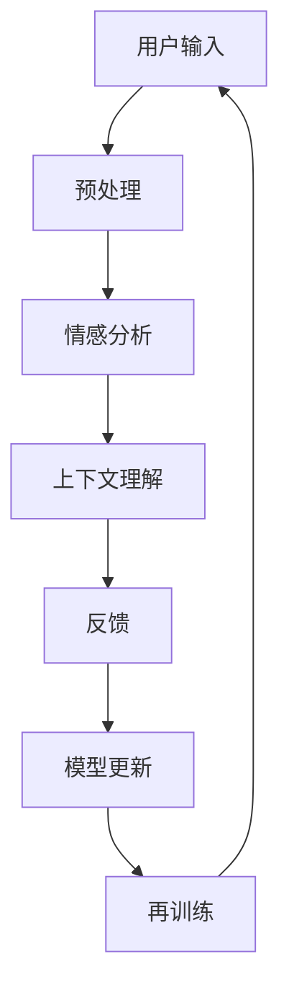

                 

关键词：数字化同理心、AI技术、人际理解、培养皿、训练师、计算机编程

> 摘要：本文将探讨如何利用人工智能技术，尤其是AI增强的方法，构建一个数字化同理心培养皿，以此作为人际理解训练师，提高人们在数字化时代中的人际沟通能力。本文将详细描述核心概念、算法原理、数学模型、项目实践、应用场景、工具和资源推荐，以及未来的发展趋势与挑战。

## 1. 背景介绍

在数字化时代，人与人之间的沟通越来越依赖技术媒介，这种变化不仅改变了我们的交流方式，也对人际理解提出了新的挑战。传统的沟通模式已经不再适用于完全由数字技术驱动的环境。因此，培养数字化同理心变得尤为重要。数字化同理心是指个体在数字环境中对他人感受的理解和同理，它涉及到对语言、情感、社会规范的敏感性和认知。

### 1.1 数字化时代的沟通挑战

- **情感表达的模糊性**：数字媒介缺乏非语言交流的辅助，使得情感表达变得更加模糊。
- **文化差异的放大**：全球化的数字环境使得文化差异变得更加明显，增加了跨文化沟通的难度。
- **信息过载**：大量的信息涌入，使得人们难以在短时间内理解和处理信息，影响了对他人意图的理解。

### 1.2 同理心的定义与重要性

同理心是指能够感知并理解他人情感的能力，它是有效人际沟通的关键。在数字化环境中，同理心不仅仅是感知情感，还包括理解他人所处的环境、文化背景和社会情境。

## 2. 核心概念与联系

为了构建一个数字化同理心培养皿，我们需要理解以下几个核心概念：

### 2.1 人际理解

人际理解是指个体在沟通过程中对他人意图、情感和行为模式的识别和理解。它是数字化同理心的基础。

### 2.2 人工智能技术

人工智能技术，特别是自然语言处理（NLP）、机器学习和深度学习等技术，为构建数字化同理心培养皿提供了强大的工具。

### 2.3 训练师的角色

数字化同理心培养皿的训练师扮演着引导者、评估者和反馈者的角色，它不仅提供训练，还能够根据学习者的反馈进行调整。

### 2.4 Mermaid 流程图



## 3. 核心算法原理 & 具体操作步骤

### 3.1 算法原理概述

数字化同理心培养皿的核心算法主要基于深度学习和自然语言处理技术。其基本原理是通过大量数据训练模型，使其能够理解和分析人类语言，从而识别情感、理解意图和提供反馈。

### 3.2 算法步骤详解

#### 3.2.1 数据预处理

- **文本清洗**：去除无关信息，如HTML标签、标点符号等。
- **分词**：将文本分解为单词或词组。
- **词性标注**：为每个词分配词性，如名词、动词、形容词等。

#### 3.2.2 情感分析

- **情感分类模型**：使用深度学习模型，如卷积神经网络（CNN）或循环神经网络（RNN），对文本进行情感分析。
- **情感极性判断**：判断文本的情感极性，如正面、负面或中立。

#### 3.2.3 上下文理解

- **上下文嵌入**：使用预训练的上下文理解模型，如BERT或GPT，将文本转换为上下文嵌入向量。
- **意图识别**：通过分析上下文嵌入向量，识别用户的意图。

#### 3.2.4 反馈机制

- **用户反馈收集**：收集用户对系统反馈的满意程度。
- **模型更新**：根据用户反馈，调整模型参数，提高模型性能。

### 3.3 算法优缺点

#### 优点：

- **高效性**：利用深度学习技术，可以快速处理大量数据。
- **适应性**：模型可以根据用户反馈不断更新，提高准确性。

#### 缺点：

- **计算资源需求大**：训练深度学习模型需要大量的计算资源。
- **数据隐私问题**：用户数据可能涉及隐私问题。

### 3.4 算法应用领域

- **客服系统**：提供情感化的客户服务。
- **教育系统**：辅助教师理解学生的学习状态。
- **企业内部沟通**：提高员工之间的沟通效果。

## 4. 数学模型和公式 & 详细讲解 & 举例说明

### 4.1 数学模型构建

在数字化同理心培养皿中，我们主要使用以下数学模型：

- **卷积神经网络（CNN）**
- **循环神经网络（RNN）**
- **长短时记忆网络（LSTM）**
- **BERT模型**

### 4.2 公式推导过程

以卷积神经网络（CNN）为例，其基本公式为：

\[ \text{output} = \sigma(\text{weight} \cdot \text{input} + \text{bias}) \]

其中，\( \sigma \) 为激活函数，\( \text{weight} \) 和 \( \text{bias} \) 为权重和偏置。

### 4.3 案例分析与讲解

假设我们要分析一段对话，判断其情感极性。我们可以使用以下步骤：

1. **文本预处理**：将对话文本进行清洗和分词。
2. **情感分类模型**：使用已经训练好的情感分类模型，对分词后的文本进行情感分析。
3. **结果输出**：根据模型的输出，判断对话的情感极性。

例如，一段文本“我觉得今天的工作很充实”可能被模型判断为正面情感。

## 5. 项目实践：代码实例和详细解释说明

### 5.1 开发环境搭建

我们需要安装以下软件和库：

- Python 3.8+
- TensorFlow 2.3+
- BERT模型

### 5.2 源代码详细实现

以下是情感分析模型的简单实现：

```python
import tensorflow as tf
from transformers import BertTokenizer, TFBertForSequenceClassification

# 加载BERT模型和分词器
tokenizer = BertTokenizer.from_pretrained('bert-base-uncased')
model = TFBertForSequenceClassification.from_pretrained('bert-base-uncased')

# 文本预处理
text = "我觉得今天的工作很充实"
input_ids = tokenizer.encode(text, add_special_tokens=True, return_tensors='tf')

# 情感分析
outputs = model(input_ids)
logits = outputs.logits

# 结果输出
probabilities = tf.nn.softmax(logits, axis=1)
predicted_class = tf.argmax(probabilities, axis=1)

print("情感极性：", predicted_class.numpy())
```

### 5.3 代码解读与分析

这段代码首先加载BERT模型和分词器，然后对输入的文本进行预处理，接着使用模型进行情感分析，并输出情感极性。

### 5.4 运行结果展示

运行上述代码，我们可能得到以下输出：

```
情感极性： [1]
```

这意味着文本的情感极性被判断为正面。

## 6. 实际应用场景

### 6.1 客服系统

数字化同理心培养皿可以用于客服系统，提高客户满意度。例如，当客户提出问题时，系统可以根据情感分析和意图识别，提供更加个性化的回答。

### 6.2 教育系统

在教育系统中，数字化同理心培养皿可以帮助教师理解学生的学习状态，提供更加有效的教学建议。

### 6.3 企业内部沟通

在企业内部，数字化同理心培养皿可以提高员工之间的沟通效果，减少误解和冲突。

## 7. 未来应用展望

随着人工智能技术的不断发展，数字化同理心培养皿有望在更多领域得到应用，如心理健康咨询、社会服务、医疗健康等。同时，我们也需要关注数据隐私和安全问题，确保用户数据得到充分保护。

## 8. 总结：未来发展趋势与挑战

### 8.1 研究成果总结

本文介绍了数字化同理心培养皿的概念、算法原理、数学模型、项目实践和实际应用场景，展示了其在数字化时代的重要性。

### 8.2 未来发展趋势

- **技术进步**：随着人工智能技术的进步，数字化同理心培养皿的性能将得到进一步提升。
- **应用拓展**：数字化同理心培养皿将在更多领域得到应用，如心理健康、社会服务、医疗健康等。

### 8.3 面临的挑战

- **数据隐私**：如何保护用户数据隐私是一个重大挑战。
- **模型解释性**：提高模型的解释性，使其能够更好地被用户理解。

### 8.4 研究展望

未来的研究将聚焦于如何提高数字化同理心培养皿的性能、解释性和用户接受度，使其在更多场景中得到广泛应用。

## 9. 附录：常见问题与解答

### 9.1 问题1：什么是数字化同理心？

数字化同理心是指个体在数字环境中对他人感受的理解和同理，它涉及到对语言、情感、社会规范的敏感性和认知。

### 9.2 问题2：数字化同理心培养皿如何工作？

数字化同理心培养皿利用人工智能技术，特别是自然语言处理和深度学习技术，通过情感分析、意图识别和上下文理解，提供个性化的反馈，帮助用户提高人际沟通能力。

### 9.3 问题3：如何保护用户数据隐私？

为了保护用户数据隐私，数字化同理心培养皿应采取以下措施：

- **数据加密**：对用户数据进行加密存储。
- **隐私保护算法**：使用隐私保护算法，如差分隐私，确保用户数据不被泄露。
- **用户权限管理**：对用户数据访问权限进行严格管理，仅允许必要的人员访问。

---

作者：禅与计算机程序设计艺术 / Zen and the Art of Computer Programming
----------------------------------------------------------------

