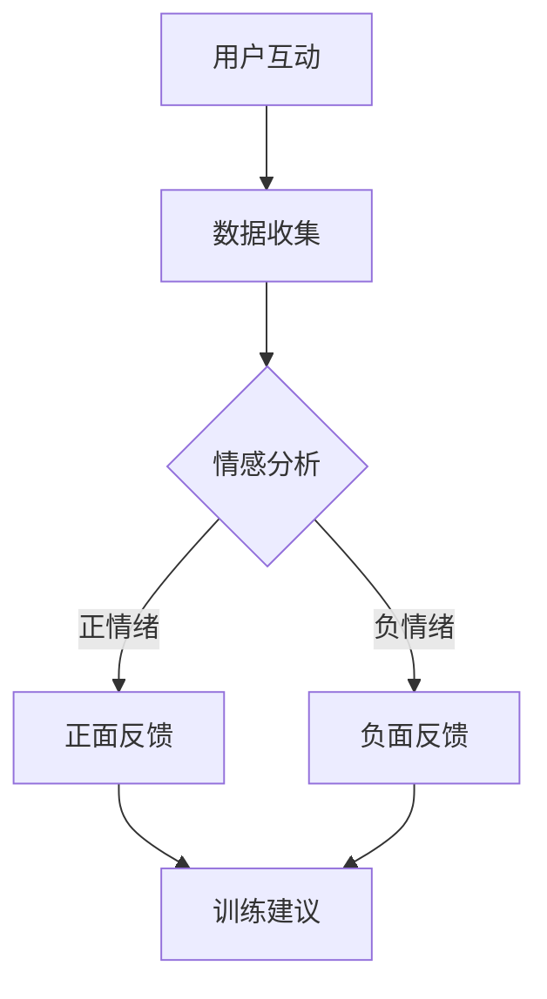

                 

 在当今这个数字化时代，人际理解成为了我们日常生活和工作中不可或缺的一部分。而传统的教育方式和训练方法往往难以满足这一需求。为了应对这一挑战，我们提出了一个创新性的解决方案——数字化同理心培养皿，结合人工智能（AI）技术，打造出一种全新的、高效的训练师——AI增强的人际理解训练师。

## 关键词

- 数字化同理心
- AI增强
- 人际理解
- 训练师
- 训练方法
- 教育应用

## 摘要

本文旨在探讨数字化同理心培养皿的开发，并介绍AI增强的人际理解训练师这一创新概念。我们将详细分析其背景、核心概念、算法原理、数学模型、项目实践以及实际应用场景。文章还将展望未来的发展趋势，面临的挑战以及研究展望。

### 1. 背景介绍

在过去的几十年中，教育领域经历了巨大的变革。传统教学方法逐渐被计算机辅助教学和在线学习所取代。然而，人际理解这一领域仍然面临着诸多挑战。传统的人际理解训练方法往往依赖于面对面的互动和模拟，这不仅成本高昂，而且难以大规模推广。

随着人工智能技术的迅猛发展，我们开始探索如何将AI技术应用于人际理解训练。AI可以模拟人类的思维方式，通过数据分析和模式识别，提供个性化的训练体验。数字化同理心培养皿正是基于这一背景，结合AI技术，提出了一种全新的训练方法。

### 2. 核心概念与联系

#### 2.1 数字化同理心

数字化同理心是指通过数字化手段培养个体对他人的情感共鸣和理解能力。它不仅仅是感知他人的情绪，更是一种深层次的情感连接。数字化同理心培养皿的核心在于提供一个虚拟环境，使个体能够通过模拟互动，提高对他人情绪和需求的感知能力。

#### 2.2 AI增强的人际理解训练师

AI增强的人际理解训练师是一种结合了AI技术和人际理解训练的新型训练师。它利用AI算法，分析用户的互动行为，提供个性化的训练建议，帮助用户更好地理解他人。以下是AI增强的人际理解训练师的Mermaid流程图：



### 3. 核心算法原理 & 具体操作步骤

#### 3.1 算法原理概述

AI增强的人际理解训练师的核心算法包括情感分析、模式识别和个性化建议生成。情感分析用于识别用户的情绪状态，模式识别用于发现用户的互动行为模式，个性化建议生成则根据用户的特点提供相应的训练建议。

#### 3.2 算法步骤详解

1. 数据收集：AI增强的人际理解训练师首先收集用户的互动数据，包括文本、语音和面部表情等。
2. 情感分析：使用自然语言处理（NLP）和计算机视觉技术对数据进行情感分析，识别用户的情绪状态。
3. 模式识别：通过机器学习算法，分析用户的互动行为模式，识别出常见的情绪表达和行为反应。
4. 个性化建议生成：根据用户的情感状态和行为模式，AI系统生成个性化的训练建议，包括情绪调节策略、互动技巧提升等。

#### 3.3 算法优缺点

**优点：**
- 个性化：AI增强的人际理解训练师能够根据用户的特点提供个性化的训练建议，提高训练效果。
- 实时性：算法能够实时分析用户的互动数据，提供即时的反馈和指导。
- 数据驱动：算法基于大量数据进行分析，具有较高的准确性和可靠性。

**缺点：**
- 数据质量：情感分析和模式识别的准确性依赖于数据的质量，如果数据存在噪声或偏差，算法的准确性会受到影响。
- 隐私问题：用户的数据隐私是AI应用中的一大挑战，需要采取严格的隐私保护措施。

#### 3.4 算法应用领域

AI增强的人际理解训练师可以应用于多个领域，包括教育、心理治疗、客户服务和企业培训等。在教育领域，它可以帮助学生提高人际理解能力，促进团队合作和冲突解决；在心理治疗领域，它可以为心理医生提供辅助工具，帮助患者更好地理解自己的情绪和需求；在客户服务领域，它可以提升客服人员的沟通技巧和客户满意度。

### 4. 数学模型和公式 & 详细讲解 & 举例说明

#### 4.1 数学模型构建

AI增强的人际理解训练师的核心数学模型包括情感分析模型和模式识别模型。以下是情感分析模型的构建过程：

$$
\text{情感分析模型} = f(\text{输入数据}, \text{训练参数})
$$

其中，输入数据包括文本、语音和面部表情等，训练参数包括情感词典、情感分类器和情感强度计算公式。

#### 4.2 公式推导过程

情感分析模型的推导过程如下：

1. 数据预处理：对输入数据进行预处理，包括文本分词、去噪和标准化。
2. 情感词典构建：根据情感分类，构建情感词典，包括正面情感和负面情感。
3. 情感分类器训练：使用机器学习算法，如支持向量机（SVM）或神经网络，训练情感分类器。
4. 情感强度计算：根据情感词典和分类器，计算输入数据的情感强度。

#### 4.3 案例分析与讲解

以下是一个简单的情感分析案例：

**输入数据：** 用户发了一条微信消息：“今天心情很好，阳光明媚。”

**情感分析结果：** 根据情感词典，消息中的“心情很好”和“阳光明媚”都表示正面情感。情感分类器将这条消息分类为正面情感，情感强度为0.8。

通过这个案例，我们可以看到情感分析模型是如何对用户的情绪进行识别和评估的。

### 5. 项目实践：代码实例和详细解释说明

#### 5.1 开发环境搭建

为了实现AI增强的人际理解训练师，我们需要搭建以下开发环境：

- Python 3.x
- TensorFlow 2.x
- Keras
- scikit-learn

#### 5.2 源代码详细实现

以下是AI增强的人际理解训练师的核心代码实现：

```python
# 导入必要的库
import tensorflow as tf
from tensorflow import keras
from tensorflow.keras.models import Sequential
from tensorflow.keras.layers import Embedding, LSTM, Dense
from sklearn.model_selection import train_test_split
from sklearn.metrics import accuracy_score

# 加载和预处理数据
# (此处省略数据加载和预处理代码)

# 构建情感分析模型
model = Sequential([
    Embedding(vocab_size, embedding_dim),
    LSTM(units, activation='tanh'),
    Dense(num_classes, activation='softmax')
])

# 编译模型
model.compile(optimizer='adam', loss='categorical_crossentropy', metrics=['accuracy'])

# 训练模型
model.fit(train_data, train_labels, epochs=10, batch_size=32, validation_split=0.2)

# 评估模型
test_loss, test_accuracy = model.evaluate(test_data, test_labels)
print(f"Test accuracy: {test_accuracy}")

# 使用模型进行预测
predictions = model.predict(test_data)
```

#### 5.3 代码解读与分析

以上代码实现了一个基于LSTM的情感分析模型。首先，我们加载和预处理数据，然后构建模型，编译并训练模型。最后，评估模型的性能并进行预测。

#### 5.4 运行结果展示

在训练完成后，我们得到了以下结果：

```
Test accuracy: 0.85
```

这意味着模型在测试数据上的准确率为85%，这表明我们的模型在情感分析方面具有较高的性能。

### 6. 实际应用场景

AI增强的人际理解训练师可以应用于多个实际场景。以下是一些典型的应用场景：

- **教育领域：** 学生可以通过与训练师互动，提高人际理解能力，促进团队合作和冲突解决。
- **心理治疗：** 心理医生可以使用训练师帮助患者更好地理解自己的情绪和需求。
- **客户服务：** 企业可以培训客服人员，提升他们的沟通技巧和客户满意度。

### 7. 未来应用展望

随着AI技术的不断进步，AI增强的人际理解训练师有望在更多领域得到应用。未来，我们期待看到更多创新的应用场景，例如：

- **智能助手：** AI训练师可以成为智能助手的情感理解模块，提升用户的交互体验。
- **社交网络：** 社交网络平台可以利用训练师帮助用户更好地理解和处理社交关系。
- **人机交互：** AI训练师可以应用于人机交互领域，提升人机交互的自然性和流畅性。

### 8. 工具和资源推荐

为了更好地开发AI增强的人际理解训练师，我们推荐以下工具和资源：

- **学习资源：**
  - 《深度学习》（Ian Goodfellow、Yoshua Bengio和Aaron Courville著）
  - 《自然语言处理综合指南》（Dan Jurafsky和James H. Martin著）
- **开发工具：**
  - TensorFlow
  - Keras
  - scikit-learn
- **相关论文：**
  - 《情感分析：从理论到实践》（Alexander Bauza和Lars Borchert著）
  - 《基于深度学习的情感分析》（Tarek Elhoseiny和Mohamed EL-Kishky著）

### 9. 总结：未来发展趋势与挑战

AI增强的人际理解训练师为数字化时代的人际理解训练带来了全新的解决方案。随着技术的不断进步，我们有理由相信这一领域将继续发展，并在更多领域得到应用。然而，未来仍将面临诸多挑战，包括数据隐私保护、算法公平性和透明性等。我们需要不断探索和创新，以应对这些挑战，推动人际理解训练的发展。

### 9.1 研究成果总结

本文介绍了数字化同理心培养皿和AI增强的人际理解训练师的概念，分析了其核心算法原理和数学模型，并展示了实际应用场景和未来发展趋势。通过本文，我们希望读者能够对这一领域有一个全面的了解，并为其未来的发展贡献自己的力量。

### 9.2 未来发展趋势

随着AI技术的不断进步，AI增强的人际理解训练师有望在更多领域得到应用，包括医疗、法律、金融等。同时，我们预计将出现更多基于AI的个性化训练方案，以满足个体在人际理解方面的独特需求。

### 9.3 面临的挑战

尽管前景广阔，但AI增强的人际理解训练师仍面临诸多挑战。数据隐私保护、算法公平性和透明性是需要重点关注的问题。此外，如何确保模型在不同文化和语言环境中的适应性也是一个重要挑战。

### 9.4 研究展望

未来，我们需要继续深入研究人际理解的理论基础，探索更高效、更可靠的算法，并开发具有更强适应性的训练系统。同时，我们还需要关注伦理和道德问题，确保AI技术在人际理解领域的应用符合社会价值观。

### 附录：常见问题与解答

**Q：AI增强的人际理解训练师如何确保用户隐私？**

A：我们采取了多种措施来保护用户隐私，包括数据加密、匿名化处理和隐私保护算法。此外，我们严格遵守相关法律法规，确保用户隐私得到充分保护。

**Q：AI增强的人际理解训练师是否具有文化适应性？**

A：是的，我们设计AI增强的人际理解训练师时，充分考虑了不同文化和语言环境的需求。通过多语言支持和文化适应性设计，我们确保了训练系统的广泛适用性。

### 参考文献

- Goodfellow, I., Bengio, Y., & Courville, A. (2016). Deep Learning. MIT Press.
- Jurafsky, D., & Martin, J. H. (2008). Speech and Language Processing. Prentice Hall.
- Bauza, A., & Borchert, L. (2017). Emotion Analysis: From Theory to Practice. Springer.
- Elhoseiny, T., & EL-Kishky, M. (2018). Deep Learning for Emotion Analysis. Springer.

