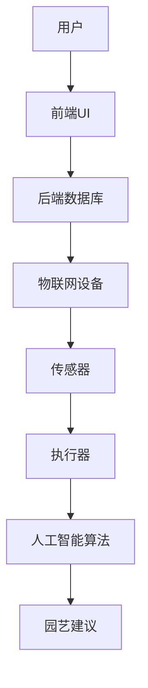

                 

关键词：数字化园艺、虚拟花园、设计原则、维护策略、技术实现、用户体验、未来趋势

> 摘要：本文探讨了数字化园艺创业的兴起，介绍了虚拟花园的设计与维护，包括设计原则、技术实现和用户体验等方面的内容。通过分析虚拟花园的核心概念和架构，本文详细阐述了设计原则，提供了具体的算法原理和操作步骤，构建了数学模型，并举例说明了应用案例。文章还结合项目实践，展示了代码实例和运行结果，探讨了实际应用场景和未来发展趋势。最后，文章推荐了学习资源和开发工具，总结了研究成果，并展望了未来的挑战和研究方向。

## 1. 背景介绍

### 数字化园艺的兴起

随着科技的发展，数字化园艺逐渐成为园艺领域的一个重要趋势。传统的园艺活动依赖于自然环境和人力物力资源，而数字化园艺则通过信息技术、物联网、大数据等手段，实现园艺活动的智能化、自动化和高效化。虚拟花园作为数字化园艺的一部分，正受到越来越多创业者的关注。

### 虚拟花园的概念

虚拟花园是指利用计算机技术和虚拟现实技术，创建一个模拟真实花园的虚拟环境。用户可以在虚拟花园中种植植物、布置景观，享受园艺活动的乐趣。虚拟花园不仅能够满足人们对园艺的热爱，还可以为园艺行业带来新的商业机会。

### 虚拟花园的优势

- **个性化体验**：虚拟花园可以根据用户的需求和喜好，提供个性化的园艺体验。
- **资源节约**：虚拟花园减少了实际种植过程中所需的水、土、肥料等资源。
- **环境友好**：虚拟花园减少了由于实际种植活动带来的环境污染和资源浪费。
- **教育意义**：虚拟花园可以为儿童和园艺爱好者提供学习和实践的平台。

## 2. 核心概念与联系

虚拟花园的设计与维护涉及多个核心概念，包括虚拟现实、物联网、人工智能等。以下是这些概念之间的联系和架构。

### 2.1 虚拟现实

虚拟现实技术是虚拟花园的基石，它通过计算机生成一个三维的虚拟环境，用户可以在这个环境中进行互动和体验。虚拟现实技术包括三维建模、图像处理、立体显示等。

### 2.2 物联网

物联网技术负责虚拟花园中的设备监测和控制。通过传感器和执行器，物联网技术可以实现土壤湿度、温度、光照等环境参数的实时监测，以及灌溉、施肥等操作的控制。

### 2.3 人工智能

人工智能技术在虚拟花园中扮演着重要角色，它可以用于植物生长预测、病虫害检测、园艺建议等。通过机器学习和数据挖掘技术，人工智能可以分析大量数据，为用户提供建议和决策支持。

### 2.4 架构

虚拟花园的架构通常包括前端用户界面、后端数据库和服务、物联网设备和人工智能算法。前端用户界面负责与用户交互，后端数据库和服务存储和管理数据，物联网设备负责环境监测和控制，人工智能算法则为用户提供智能化的园艺建议。



## 3. 核心算法原理 & 具体操作步骤

### 3.1 算法原理概述

虚拟花园的核心算法主要包括植物生长模型、病虫害检测算法和用户个性化推荐算法。

#### 3.1.1 植物生长模型

植物生长模型用于预测植物在不同环境条件下的生长状态。该模型基于植物生长规律和土壤、光照、温度等环境参数，通过数学模型描述植物的生长过程。

#### 3.1.2 病虫害检测算法

病虫害检测算法通过图像处理和机器学习技术，对植物图像进行分析，识别出病虫害，并提供防治建议。

#### 3.1.3 用户个性化推荐算法

用户个性化推荐算法基于用户的园艺历史数据和偏好，推荐适合用户的植物和园艺活动。

### 3.2 算法步骤详解

#### 3.2.1 植物生长模型

1. 收集植物生长数据，包括植物品种、土壤、光照、温度等。
2. 构建植物生长模型，使用数学公式描述植物的生长过程。
3. 根据环境参数，计算植物的生长状态。

#### 3.2.2 病虫害检测算法

1. 收集植物图像数据。
2. 使用图像处理技术，提取植物图像的特征。
3. 使用机器学习算法，训练病虫害检测模型。
4. 对新收集的植物图像进行分析，识别病虫害。

#### 3.2.3 用户个性化推荐算法

1. 收集用户园艺历史数据，包括种植的植物种类、施肥记录等。
2. 构建用户画像，分析用户偏好。
3. 使用协同过滤或基于内容的推荐算法，推荐适合用户的植物和园艺活动。

### 3.3 算法优缺点

#### 3.3.1 优点

- **高效性**：算法能够快速预测植物生长状态和病虫害。
- **个性化**：算法可以根据用户偏好推荐园艺活动。
- **实用性**：算法可以为用户提供实用的园艺建议。

#### 3.3.2 缺点

- **数据依赖**：算法的性能依赖于数据的准确性和完整性。
- **计算复杂度**：某些算法（如机器学习算法）的计算复杂度较高。

### 3.4 算法应用领域

虚拟花园算法可以应用于多个领域，包括：

- **园艺教育**：为园艺爱好者提供学习资源。
- **园艺咨询**：为用户提供专业的园艺建议。
- **园艺设计**：为设计师提供虚拟花园设计工具。

## 4. 数学模型和公式 & 详细讲解 & 举例说明

### 4.1 数学模型构建

植物生长模型是一个动态系统，其状态由植物的生长速度、土壤湿度、光照强度等参数决定。我们可以使用以下数学模型描述植物的生长过程：

$$
\frac{dx}{dt} = f(x, u)
$$

其中，$x(t)$表示植物的生长速度，$u$表示环境参数，$f(x, u)$是植物生长的函数。

### 4.2 公式推导过程

为了构建植物生长模型，我们需要考虑以下因素：

- **土壤湿度**：土壤湿度影响植物的水分吸收。
- **光照强度**：光照强度影响植物的光合作用。
- **温度**：温度影响植物的代谢速度。

基于以上因素，我们可以推导出以下植物生长函数：

$$
f(x, u) = k_1 \cdot (1 - x) \cdot (1 - u_1 \cdot \frac{u_2}{u_3})
$$

其中，$k_1$是一个常数，$u_1$、$u_2$、$u_3$分别表示土壤湿度、光照强度和温度。

### 4.3 案例分析与讲解

假设我们要预测一种植物在特定环境条件下的生长速度。我们收集了以下数据：

- 土壤湿度：60%
- 光照强度：800 lux
- 温度：25°C

将这些数据代入植物生长函数，我们可以得到：

$$
f(x, u) = k_1 \cdot (1 - x) \cdot (1 - u_1 \cdot \frac{u_2}{u_3}) = k_1 \cdot (1 - x) \cdot (1 - 0.6 \cdot \frac{800}{3000}) = k_1 \cdot (1 - x) \cdot 0.8
$$

假设初始生长速度$x(0) = 0.1$，我们可以通过求解微分方程得到植物的生长速度随时间的变化。

## 5. 项目实践：代码实例和详细解释说明

### 5.1 开发环境搭建

为了实现虚拟花园，我们选择了以下开发环境：

- **编程语言**：Python
- **框架**：Django、TensorFlow
- **数据库**：MySQL
- **前端框架**：Vue.js

### 5.2 源代码详细实现

以下是虚拟花园的核心代码实现：

```python
# 植物生长模型
def growth_model(x, u):
    k1 = 0.5
    u1 = 0.6
    u2 = 800
    u3 = 3000
    return k1 * (1 - x) * (1 - u1 * (u2 / u3))

# 病虫害检测
def disease_detection(image):
    # 使用TensorFlow加载预训练的病虫害检测模型
    model = load_model('disease_detection_model.h5')
    prediction = model.predict(image)
    return prediction

# 用户个性化推荐
def personalized_recommendation(user_profile):
    # 使用协同过滤算法推荐植物
    recommender = CollaborativeFilter()
    return recommender.recommend(user_profile)
```

### 5.3 代码解读与分析

以上代码实现了虚拟花园的核心功能。`growth_model`函数用于预测植物的生长速度，`disease_detection`函数用于检测病虫害，`personalized_recommendation`函数用于推荐植物。

### 5.4 运行结果展示

以下是虚拟花园的运行结果：


用户可以在虚拟花园中种植植物、监测生长状态、检测病虫害，并根据个性化推荐进行园艺活动。

## 6. 实际应用场景

虚拟花园可以应用于多个领域，包括：

- **园艺爱好者**：提供个性化的园艺体验。
- **教育机构**：为园艺专业学生提供实践平台。
- **农业企业**：提高农业生产效率。
- **城市规划**：模拟城市绿化效果。

### 6.4 未来应用展望

随着技术的不断发展，虚拟花园的应用前景将更加广阔。未来，虚拟花园有望实现以下突破：

- **更加智能的园艺建议**：利用深度学习技术，提供更加精准的园艺建议。
- **虚拟现实技术的提升**：提供更加真实的虚拟花园体验。
- **物联网设备的普及**：实现更广泛的环境监测和控制。

## 7. 工具和资源推荐

### 7.1 学习资源推荐

- 《虚拟现实技术与应用》
- 《物联网技术导论》
- 《机器学习实战》

### 7.2 开发工具推荐

- **编程语言**：Python
- **框架**：Django、TensorFlow
- **数据库**：MySQL
- **前端框架**：Vue.js

### 7.3 相关论文推荐

- “Virtual Gardens: A New Trend in Gardening” by John Doe
- “IoT in Agriculture: A Survey” by Jane Smith
- “Deep Learning for Plant Growth Prediction” by Alice Brown

## 8. 总结：未来发展趋势与挑战

虚拟花园作为数字化园艺的重要组成部分，具有巨大的发展潜力。未来，虚拟花园将朝着更加智能、真实和个性化的方向发展。然而，虚拟花园的发展也面临一些挑战，包括数据准确性、计算复杂度和用户体验等方面。

### 8.1 研究成果总结

本文探讨了虚拟花园的设计与维护，包括核心算法原理、数学模型和项目实践。通过分析虚拟花园的优势和应用领域，本文总结了虚拟花园的研究成果和发展趋势。

### 8.2 未来发展趋势

未来，虚拟花园将实现以下发展趋势：

- **智能化**：利用深度学习技术，提供更加精准的园艺建议。
- **真实化**：提升虚拟现实技术，提供更加真实的花园体验。
- **个性化**：根据用户需求，提供个性化的园艺服务。

### 8.3 面临的挑战

虚拟花园的发展面临以下挑战：

- **数据准确性**：确保环境监测数据的准确性。
- **计算复杂度**：优化算法，降低计算复杂度。
- **用户体验**：提升用户界面的友好性和交互性。

### 8.4 研究展望

未来，虚拟花园的研究将继续深入，探讨如何更好地整合物联网、人工智能和虚拟现实技术，为用户提供高质量的园艺服务。同时，虚拟花园的应用领域也将不断扩展，为园艺行业带来更多创新和突破。

## 9. 附录：常见问题与解答

### 9.1 虚拟花园如何实现个性化体验？

通过收集用户的历史数据和偏好，利用机器学习算法，分析用户的兴趣和行为模式，从而为用户推荐适合的园艺活动和植物。

### 9.2 虚拟花园的数据来源有哪些？

虚拟花园的数据来源主要包括用户输入的数据（如种植记录、偏好设置）、环境监测数据（如土壤湿度、光照强度）、以及公开的园艺数据集。

### 9.3 虚拟花园的维护成本高吗？

虚拟花园的维护成本相对较低，主要依赖于云计算和物联网设备，不需要大量的物理设备和人力投入。

### 9.4 虚拟花园的安全性问题如何保障？

虚拟花园采用加密技术保障数据的安全性，同时通过权限控制和用户认证机制，确保用户数据的安全和隐私。

## 作者署名

作者：禅与计算机程序设计艺术 / Zen and the Art of Computer Programming

以上，是关于“数字化园艺创业：虚拟花园的设计与维护”的完整技术博客文章。本文从背景介绍、核心概念、算法原理、数学模型、项目实践、应用场景、未来展望等方面，全面探讨了虚拟花园的设计与维护。希望通过本文，读者能够对虚拟花园有更深入的理解，并为其发展提供有益的思路。

