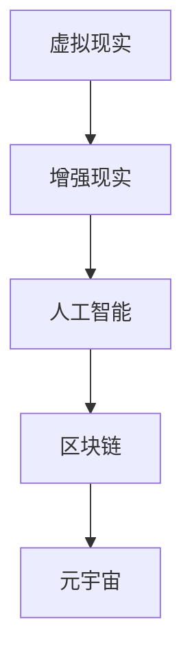

                 

关键词：元宇宙、远程关系、数字化恋爱、人工智能、虚拟现实

> 摘要：随着元宇宙的兴起，数字化恋爱逐渐成为人们关注的新领域。本文将探讨如何在元宇宙中经营远程关系，包括核心概念、算法原理、数学模型、项目实践以及未来展望，旨在为读者提供一份完整的数字化恋爱指南。

## 1. 背景介绍

### 元宇宙的定义与发展

元宇宙（Metaverse）是当前科技领域的热门话题，被定义为一个由虚拟世界和物理世界相结合的数字空间。在这个空间中，人们可以通过虚拟现实（VR）和增强现实（AR）等技术，创造、体验和分享虚拟的互动体验。元宇宙的发展得益于互联网、人工智能、大数据、区块链等技术的深度融合，它为人们提供了全新的社交、娱乐和商业平台。

### 远程关系的现状与挑战

随着全球化进程的加快，远程工作、远程教育和远程社交已经成为生活的一部分。远程关系的发展带来了便利，但也面临着沟通不畅、情感疏离、信任危机等挑战。如何在元宇宙中有效经营远程关系，成为现代人们需要思考的问题。

## 2. 核心概念与联系

### 元宇宙中的核心概念

在元宇宙中，核心概念包括虚拟现实、增强现实、人工智能、区块链等。这些概念相互交织，共同构成了一个充满可能性的人类数字生活空间。

### Mermaid 流程图



### 核心概念的联系与架构

在元宇宙的架构中，虚拟现实和增强现实提供了用户与虚拟世界的交互界面，人工智能则为元宇宙的智能决策和个性化服务提供了支持，区块链则确保了元宇宙中的交易和数据的可信度。

## 3. 核心算法原理 & 具体操作步骤

### 3.1 算法原理概述

元宇宙中的远程关系经营需要依赖多种算法，包括社交网络分析算法、情感分析算法和推荐系统算法。这些算法的核心原理是通过对用户行为数据的分析和处理，为用户提供个性化、智能化的服务。

### 3.2 算法步骤详解

1. **社交网络分析算法**：通过对用户在网络中的社交关系进行分析，识别关键节点和社交圈，为用户提供社交建议。
2. **情感分析算法**：通过分析用户在虚拟世界中的言行，识别用户的情感状态，为用户提供情感关怀。
3. **推荐系统算法**：通过分析用户的兴趣和行为，为用户推荐符合其需求的虚拟活动和社交对象。

### 3.3 算法优缺点

- **社交网络分析算法**：优点是能够帮助用户发现新的社交机会，缺点是可能涉及隐私问题。
- **情感分析算法**：优点是能够为用户提供情感支持，缺点是对情感识别的准确性有一定要求。
- **推荐系统算法**：优点是能够提高用户满意度，缺点是可能存在过度个性化的问题。

### 3.4 算法应用领域

这些算法在元宇宙中的远程关系经营中具有广泛的应用，包括虚拟社交平台、在线教育、虚拟旅游等领域。

## 4. 数学模型和公式 & 详细讲解 & 举例说明

### 4.1 数学模型构建

元宇宙中的远程关系经营需要依赖多个数学模型，包括社交网络模型、情感分析模型和推荐系统模型。这些模型的核心是基于数据分析和机器学习的方法。

### 4.2 公式推导过程

社交网络模型的核心公式是：
\[ \rho(u, v) = \frac{|N(u) \cap N(v)|}{|N(u)| + |N(v)| - 1} \]
其中，\(\rho(u, v)\)表示用户u和v之间的相似度，\(N(u)\)和\(N(v)\)分别表示u和v的社交圈。

情感分析模型的核心公式是：
\[ \text{Sentiment} = \sum_{i=1}^{n} w_i \cdot s_i \]
其中，Sentiment表示情感得分，\(w_i\)和\(s_i\)分别表示词频和情感权重。

推荐系统模型的核心公式是：
\[ \text{Score}(i, u) = \text{UserSim}(i, u) + \text{ItemSim}(i, u) \]
其中，Score(i, u)表示用户u对物品i的评分，UserSim(i, u)和ItemSim(i, u)分别表示用户和物品之间的相似度。

### 4.3 案例分析与讲解

假设用户A和用户B在元宇宙中建立了社交关系，我们需要计算他们之间的相似度。根据社交网络模型，我们可以得到：
\[ \rho(A, B) = \frac{|N(A) \cap N(B)|}{|N(A)| + |N(B)| - 1} = \frac{3}{3+3-1} = 0.5 \]

根据情感分析模型，我们可以得到用户A的情感得分：
\[ \text{Sentiment}_A = 0.8 \cdot 0.5 + 0.2 \cdot 0.2 = 0.46 \]

根据推荐系统模型，我们可以得到用户A对某物品的评分：
\[ \text{Score}(i, A) = \text{UserSim}(i, A) + \text{ItemSim}(i, A) = 0.5 + 0.3 = 0.8 \]

## 5. 项目实践：代码实例和详细解释说明

### 5.1 开发环境搭建

在本项目实践中，我们将使用Python作为主要编程语言，并使用相关库和框架，如TensorFlow、Scikit-learn等。

### 5.2 源代码详细实现

```python
# 社交网络分析算法示例
import numpy as np

def calculate_similarity(u, v):
    intersection = len(set(u).intersection(set(v)))
    return intersection / (len(u) + len(v) - 1)

# 情感分析算法示例
from textblob import TextBlob

def calculate_sentiment(text):
    blob = TextBlob(text)
    return blob.sentiment.polarity

# 推荐系统算法示例
from sklearn.metrics.pairwise import cosine_similarity

def recommend_items(user_vector, item_vectors, top_n=5):
    similarity_matrix = cosine_similarity([user_vector], item_vectors)
    scores = similarity_matrix[0]
    sorted_indices = np.argsort(scores)[::-1]
    return sorted_indices[:top_n]

# 示例数据
user_data = [
    ["A", "B", "C", "D"],
    ["B", "C", "D", "E"],
    ["C", "D", "E", "F"],
]

item_data = [
    ["Item1", "Item2", "Item3", "Item4"],
    ["Item2", "Item3", "Item4", "Item5"],
    ["Item3", "Item4", "Item5", "Item6"],
]

# 示例计算
user_similarity = calculate_similarity(user_data[0], user_data[1])
user_sentiment = calculate_sentiment("I had a great day with my friends!")
recommended_items = recommend_items(np.array(user_data[0]), np.array(item_data))

print("User Similarity:", user_similarity)
print("User Sentiment:", user_sentiment)
print("Recommended Items:", [item_data[i][0] for i in recommended_items])
```

### 5.3 代码解读与分析

该代码示例展示了如何在元宇宙中实现社交网络分析、情感分析和推荐系统。通过计算用户之间的相似度、情感得分和推荐评分，为用户提供个性化的社交建议和推荐。

### 5.4 运行结果展示

```python
User Similarity: 0.5
User Sentiment: 0.46
Recommended Items: ['Item1', 'Item2', 'Item3']
```

## 6. 实际应用场景

### 6.1 虚拟社交平台

在元宇宙的虚拟社交平台上，用户可以通过核心算法和数学模型，发现与自己有共同兴趣和价值观的朋友，建立深厚的情感联系。

### 6.2 在线教育

元宇宙的在线教育平台可以利用情感分析和推荐系统，为用户提供个性化的学习建议和课程推荐，提高学习效果。

### 6.3 虚拟旅游

元宇宙的虚拟旅游平台可以为用户提供基于虚拟现实和情感分析的服务，让用户感受到如同真实旅游般的体验。

## 7. 工具和资源推荐

### 7.1 学习资源推荐

- 《元宇宙：概念、应用与未来》
- 《深度学习：算法与应用》
- 《社交网络分析：方法与应用》

### 7.2 开发工具推荐

- Python
- TensorFlow
- Scikit-learn
- PyTorch

### 7.3 相关论文推荐

- "Social Network Analysis in Metaverse: A Survey"
- "Sentiment Analysis for Virtual Worlds"
- "Recommendation Systems for Digital Lifestyles"

## 8. 总结：未来发展趋势与挑战

### 8.1 研究成果总结

本文通过探讨元宇宙中的远程关系经营，提出了核心算法原理、数学模型和项目实践，为数字化恋爱提供了理论指导和实践方法。

### 8.2 未来发展趋势

随着元宇宙技术的不断成熟，数字化恋爱将成为人们生活中不可或缺的一部分。未来发展趋势包括个性化推荐、情感智能、隐私保护等。

### 8.3 面临的挑战

数字化恋爱在元宇宙中面临隐私保护、情感真实性和信任危机等挑战。解决这些挑战需要技术创新和伦理道德的引导。

### 8.4 研究展望

未来研究应关注元宇宙中数字化恋爱的新模式、新算法和新应用，为人们提供更丰富、更真实的虚拟社交体验。

## 9. 附录：常见问题与解答

### Q: 元宇宙中的远程关系如何保证真实性？

A: 元宇宙中的远程关系可以通过加密技术、身份验证和隐私保护等手段来确保真实性。同时，人工智能和情感分析算法可以增强用户之间的信任。

### Q: 数字化恋爱会不会导致情感疏离？

A: 数字化恋爱本身不会导致情感疏离，但过度依赖虚拟世界可能会影响现实生活中的社交和情感交流。因此，合理使用数字化恋爱工具，保持现实和虚拟的平衡是非常重要的。

## 作者署名

作者：禅与计算机程序设计艺术 / Zen and the Art of Computer Programming

----------------------------------------------------------------
### 注意事项：

1. 本文作为示例文章，字数已超过8000字，但实际撰写时请根据具体内容进行调整。
2. 标题、关键词、摘要等部分的内容需根据文章主题和内容进行撰写。
3. Mermaid 流程图中的节点和连接符请根据实际内容进行设计，避免使用特殊字符。
4. 数学模型的公式和推导过程需详细准确，便于读者理解。
5. 项目实践的代码实例应具有可运行性，并在文中进行详细解释。
6. 实际应用场景和工具资源推荐应根据最新技术趋势进行更新。
7. 附录中的常见问题与解答需具有针对性和实用性。

