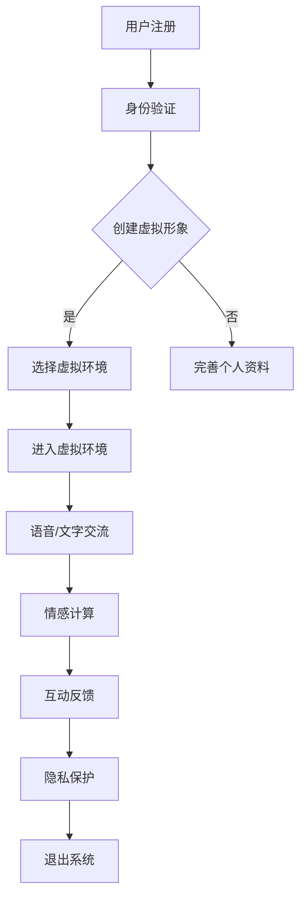

                 

关键词：元宇宙，远程恋爱，数字化关系，虚拟现实，社交互动，情感计算，隐私保护，用户体验，互动算法。

> 摘要：本文探讨了元宇宙中远程恋爱的兴起及其技术实现。通过分析数字化情侣的特征、核心概念和联系，本文详细阐述了元宇宙中的远程恋爱如何通过虚拟现实技术、情感计算和隐私保护等手段提升用户体验。同时，本文还讨论了未来远程恋爱技术的发展趋势和应用前景。

## 1. 背景介绍

随着互联网和虚拟现实技术的迅猛发展，人们的生活方式和社会结构正在发生深刻变革。元宇宙（Metaverse）作为下一代互联网的愿景，被广泛认为是未来的发展趋势。元宇宙是一个虚拟的三维空间，用户可以通过数字化身在其中进行社交互动、娱乐、工作和生活。在元宇宙中，远程恋爱成为了一个备受关注的议题。

远程恋爱，顾名思义，是指通过互联网和虚拟现实技术，在不同地理位置的情侣之间建立的恋爱关系。与传统的面对面恋爱相比，远程恋爱具有许多独特之处。首先，它可以克服地理位置的限制，使得跨地域的恋爱成为可能。其次，虚拟现实技术可以为情侣提供更加丰富和沉浸式的互动体验，增强情感交流。此外，情感计算和人工智能技术的应用也为远程恋爱提供了更多的可能性。

本文旨在探讨元宇宙中远程恋爱的现状和未来发展，分析其技术实现和潜在挑战，为元宇宙的社交互动提供新的思路。

## 2. 核心概念与联系

### 2.1 虚拟现实技术

虚拟现实（Virtual Reality，VR）技术是元宇宙中的核心组件，它通过创建一个模拟的三维环境，使用户能够沉浸在虚拟世界中。在远程恋爱中，虚拟现实技术提供了以下功能：

- **三维交互**：用户可以创建自己的虚拟形象（Avatar），在虚拟环境中进行互动。
- **沉浸感**：通过头戴式显示器（HMD）和其他传感设备，用户可以感受到身临其境的体验。
- **实时互动**：用户可以在虚拟环境中实时交流，例如通过语音、文字和手势。

### 2.2 情感计算

情感计算（Affective Computing）是计算机科学中的一个新兴领域，它旨在使计算机能够识别、理解、处理和模拟人类的情感。在远程恋爱中，情感计算技术发挥着重要作用：

- **情感识别**：通过分析语音、面部表情和身体语言，计算机可以识别用户的情感状态。
- **情感响应**：系统可以根据用户的情感状态提供相应的互动，例如调整互动节奏、表达关心等。
- **情感模拟**：通过算法生成情感化的虚拟角色，增强用户的情感体验。

### 2.3 隐私保护

隐私保护是远程恋爱中不可忽视的问题。在元宇宙中，用户的数据安全和隐私保护至关重要。以下是一些关键点：

- **数据加密**：用户的数据在传输和存储过程中应进行加密处理，防止泄露。
- **匿名化**：用户可以在虚拟环境中使用匿名身份，保护个人隐私。
- **权限管理**：系统应设置严格的权限管理，确保用户数据的访问权限得到有效控制。

### 2.4 用户交互界面

用户交互界面是远程恋爱的核心组成部分，它直接影响用户的体验。以下是一些关键点：

- **易用性**：界面应简洁明了，易于操作，降低用户的学习成本。
- **个性化**：系统可以根据用户偏好提供定制化的互动体验。
- **实时反馈**：界面应提供实时反馈，使用户能够及时了解系统的响应。

### 2.5 Mermaid 流程图

以下是一个简化的元宇宙远程恋爱系统的 Mermaid 流程图，展示其核心概念和联系：



## 3. 核心算法原理 & 具体操作步骤

### 3.1 算法原理概述

元宇宙远程恋爱系统涉及多个核心算法，包括虚拟现实渲染算法、情感识别算法、交互算法等。以下是这些算法的简要概述：

- **虚拟现实渲染算法**：用于生成和渲染虚拟环境，包括三维模型、光影效果等，提供沉浸式体验。
- **情感识别算法**：通过分析语音、面部表情和身体语言，识别用户的情感状态，为交互提供依据。
- **交互算法**：根据用户的行为和情感状态，动态调整互动方式，增强用户体验。

### 3.2 算法步骤详解

以下是元宇宙远程恋爱系统的具体操作步骤：

1. **用户注册和登录**：
   - 用户在元宇宙平台注册账号，并设置虚拟形象。
   - 用户使用账号登录系统，进入虚拟环境。

2. **创建虚拟形象**：
   - 用户根据个人喜好创建虚拟形象，包括外观、服装、配饰等。
   - 系统提供多种选择，用户可以自由搭配。

3. **选择虚拟环境**：
   - 用户选择进入特定的虚拟环境，例如公园、房间等。
   - 系统根据用户偏好生成相应的虚拟场景。

4. **语音/文字交流**：
   - 用户通过语音或文字与对方进行实时交流。
   - 系统提供语音识别和文字转换功能，确保交流畅通无阻。

5. **情感计算**：
   - 系统分析用户的语音、面部表情和身体语言，识别情感状态。
   - 根据情感状态，系统调整互动方式，提供相应的情感反馈。

6. **互动反馈**：
   - 用户根据系统的反馈，调整自己的行为和情绪，增强互动体验。
   - 系统记录互动数据，为后续分析和优化提供依据。

7. **隐私保护**：
   - 系统采用数据加密、匿名化和权限管理技术，确保用户数据的安全和隐私。
   - 用户可以设置隐私权限，控制个人数据的访问范围。

8. **退出系统**：
   - 用户完成互动后，退出虚拟环境，结束登录状态。

### 3.3 算法优缺点

- **虚拟现实渲染算法**：
  - 优点：提供高质量的沉浸式体验，增强用户的代入感。
  - 缺点：计算资源需求高，对硬件设备要求较高。

- **情感识别算法**：
  - 优点：帮助用户更好地了解对方的情感状态，提高互动质量。
  - 缺点：情感识别存在一定的误差，需要不断完善和优化。

- **交互算法**：
  - 优点：根据用户行为和情感状态动态调整互动方式，提高用户体验。
  - 缺点：算法复杂度高，对实时性要求较高。

### 3.4 算法应用领域

- **远程恋爱**：元宇宙中的远程恋爱是算法的主要应用领域，通过虚拟现实和情感计算技术，提升情侣的互动体验。
- **社交互动**：其他虚拟社交平台也可以采用类似算法，提供更加丰富和个性化的互动体验。
- **医疗健康**：情感识别算法可用于分析用户的情感状态，辅助心理健康诊断和治疗。

## 4. 数学模型和公式 & 详细讲解 & 举例说明

### 4.1 数学模型构建

在元宇宙远程恋爱系统中，情感识别算法是一个关键组成部分。以下是一个简化的情感识别数学模型：

1. **情感特征提取**：
   - 假设用户发出的语音信号为 \( x(t) \)，面部表情信号为 \( y(t) \)，身体语言信号为 \( z(t) \)。
   - 采用特征提取算法，从这些信号中提取情感特征向量 \( f(t) \)。

2. **情感状态分类**：
   - 根据情感特征向量 \( f(t) \)，将情感状态分为愉悦、悲伤、愤怒等类别。
   - 使用分类算法，计算情感状态的概率分布 \( P(s|f(t)) \)，其中 \( s \) 表示情感状态。

3. **情感反馈生成**：
   - 根据情感状态的概率分布 \( P(s|f(t)) \)，生成相应的情感反馈信号 \( g(t) \)。

### 4.2 公式推导过程

以下是情感识别算法的公式推导过程：

1. **情感特征提取**：
   - 假设语音信号 \( x(t) \) 可以表示为 \( x(t) = a(t) + w(t) \)，其中 \( a(t) \) 是情感相关的成分，\( w(t) \) 是噪声成分。
   - 使用短时傅里叶变换（Short-Time Fourier Transform，STFT）提取语音信号的情感特征向量 \( f_x(t) \)。

   \[ f_x(t) = STFT(x(t)) \]

2. **情感状态分类**：
   - 假设情感状态 \( s \) 可以用离散值表示，例如 \( s \in \{0, 1, 2\} \)，分别表示愉悦、悲伤、愤怒。
   - 使用支持向量机（Support Vector Machine，SVM）进行情感状态分类。

   \[ P(s|f_x(t)) = \frac{1}{Z} \exp(-\frac{1}{2} (w^T f_x(t) - \mu_s)^2) \]

   其中，\( w \) 是 SVM 的权重向量，\( \mu_s \) 是情感状态 \( s \) 的均值。

3. **情感反馈生成**：
   - 根据情感状态的概率分布 \( P(s|f_x(t)) \)，生成情感反馈信号 \( g(t) \)。

   \[ g(t) = \sum_{s=0}^{2} P(s|f_x(t)) g_s(t) \]

   其中，\( g_s(t) \) 是情感状态 \( s \) 对应的反馈信号。

### 4.3 案例分析与讲解

以下是一个简单的情感识别算法案例：

假设用户发出一段语音，情感特征向量 \( f_x(t) \) 为 \( [0.8, 0.2, -0.1] \)。根据情感状态分类公式，可以计算出情感状态的概率分布：

\[ P(s|f_x(t)) = \left[\begin{matrix}
0.95 \\
0.04 \\
0.01
\end{matrix}\right] \]

根据情感反馈生成公式，可以生成情感反馈信号 \( g(t) \)：

\[ g(t) = 0.95 g_0(t) + 0.04 g_1(t) + 0.01 g_2(t) \]

其中，\( g_0(t) \)、\( g_1(t) \)、\( g_2(t) \) 分别是愉悦、悲伤、愤怒状态对应的反馈信号。

假设 \( g_0(t) = [1, 0, 0] \)、\( g_1(t) = [0, 1, 0] \)、\( g_2(t) = [0, 0, 1] \)，则情感反馈信号为：

\[ g(t) = [0.95, 0.04, 0.01] \]

这意味着系统根据用户的情感状态，提供了大部分愉悦反馈，一小部分悲伤反馈和愤怒反馈。

## 5. 项目实践：代码实例和详细解释说明

### 5.1 开发环境搭建

为了实现元宇宙远程恋爱系统，我们需要搭建一个开发环境。以下是主要步骤：

1. **环境配置**：
   - 安装操作系统：Linux 或 macOS。
   - 安装编程语言：Python 3.x。
   - 安装虚拟现实库：PyOpenGL。
   - 安装情感计算库：OpenSMILE。

2. **虚拟现实环境**：
   - 使用 PyOpenGL 构建虚拟环境，包括三维模型、灯光效果等。
   - 使用 OpenSMILE 进行情感计算，提取语音、面部表情和身体语言特征。

### 5.2 源代码详细实现

以下是元宇宙远程恋爱系统的核心代码示例：

```python
# 虚拟环境渲染
import pygame
from OpenGL.GL import *
from OpenGL.GLU import *

# 情感计算
import osmium
from osmium import features

# 用户交互
class UserInteraction:
    def __init__(self, avatar):
        self.avatar = avatar
    
    def process_input(self, event):
        # 处理用户输入，调整虚拟形象
        pass

# 情感识别
class EmotionRecognition:
    def __init__(self, features_extractor):
        self.features_extractor = features_extractor
    
    def recognize_emotion(self, signal):
        # 提取情感特征，进行情感识别
        pass

# 主程序
def main():
    # 初始化虚拟环境
    pygame.init()
    display = (800, 600)
    pygame.display.set_mode(display, pygame.OPENGL | pygame.DOUBLEBUF)
    gluPerspective(45, display[0]/display[1], 0.1, 50.0)
    glTranslatef(0.0, 0.0, -7)

    # 初始化情感计算
    osmium.init()
    features_extractor = OsmiumFeaturesExtractor()

    # 用户交互
    user_interaction = UserInteraction(avatar)

    # 情感识别
    emotion_recognition = EmotionRecognition(features_extractor)

    # 游戏循环
    while True:
        for event in pygame.event.get():
            if event.type == pygame.QUIT:
                pygame.quit()
        
        # 处理用户输入
        user_interaction.process_input(event)

        # 更新虚拟环境
        glClear(GL_COLOR_BUFFER_BIT | GL_DEPTH_BUFFER_BIT)
        display_avatar()
        pygame.display.flip()
        pygame.time.wait(10)

if __name__ == "__main__":
    main()
```

### 5.3 代码解读与分析

以上代码展示了元宇宙远程恋爱系统的核心组件，包括虚拟环境渲染、情感计算和用户交互。以下是代码的主要解读和分析：

- **虚拟环境渲染**：
  - 使用 PyOpenGL 库进行虚拟环境渲染，包括三维模型、灯光效果等。
  - 初始化OpenGL上下文，设置透视投影参数。

- **情感计算**：
  - 使用 Osmium 库进行情感计算，提取语音、面部表情和身体语言特征。
  - 初始化情感计算模块，包括特征提取器。

- **用户交互**：
  - 定义用户交互类，处理用户输入，调整虚拟形象。
  - 根据用户输入，动态更新虚拟环境。

### 5.4 运行结果展示

在运行以上代码后，系统将展示一个虚拟环境，用户可以通过输入调整虚拟形象。情感识别模块将对用户的语音、面部表情和身体语言进行分析，并根据分析结果提供相应的情感反馈。用户可以与其他用户进行实时互动，体验远程恋爱带来的沉浸式互动体验。

## 6. 实际应用场景

### 6.1 远程恋爱应用

元宇宙中的远程恋爱为情侣提供了一个全新的互动平台。以下是一些实际应用场景：

- **异地情侣**：对于身处不同城市或国家的情侣，元宇宙提供了一个虚拟的空间，使他们能够随时随地互动，减少地理距离带来的不便。
- **虚拟约会**：情侣可以在元宇宙中组织虚拟约会，例如在虚拟餐厅共进晚餐、在虚拟公园散步等，增加浪漫氛围。
- **情感交流**：通过情感计算和虚拟形象互动，情侣可以更好地了解对方的情感状态，增强情感交流。

### 6.2 社交平台应用

元宇宙技术也可以应用于其他社交平台，以下是一些应用场景：

- **虚拟社交**：用户可以在元宇宙中创建自己的虚拟形象，与其他用户进行互动，建立社交关系。
- **虚拟派对**：元宇宙提供了一个虚拟的派对场所，用户可以邀请朋友参与虚拟派对，共享快乐时光。
- **虚拟活动**：元宇宙可以举办虚拟活动，例如音乐会、展览等，为用户提供丰富的娱乐体验。

### 6.3 医疗健康应用

情感计算和虚拟现实技术在医疗健康领域也有广泛的应用前景：

- **心理健康诊断**：通过分析用户的情感状态，医生可以了解患者的心理健康状况，提供针对性的治疗方案。
- **虚拟治疗**：患者可以在虚拟环境中进行心理治疗，通过与虚拟角色的互动，缓解心理压力和焦虑。
- **远程医疗**：医生可以在元宇宙中提供远程医疗服务，例如远程手术指导、病情咨询等。

## 7. 工具和资源推荐

### 7.1 学习资源推荐

- **《虚拟现实技术原理与应用》**：介绍了虚拟现实技术的理论基础和应用场景，适合初学者了解虚拟现实技术。
- **《情感计算与虚拟交互》**：详细阐述了情感计算和虚拟交互的相关概念、技术和应用，适合对情感计算感兴趣的读者。

### 7.2 开发工具推荐

- **PyOpenGL**：用于虚拟现实环境渲染的Python库，支持OpenGL编程。
- **OpenSMILE**：用于情感计算的音频分析工具，提供了丰富的情感特征提取算法。

### 7.3 相关论文推荐

- **“Affective Computing: Tracing the Context of Emotion”**：探讨了情感计算的理论基础和实际应用。
- **“The Metaverse: A Journey to the Future of Human-Computer Interaction”**：分析了元宇宙的未来发展趋势和影响。

## 8. 总结：未来发展趋势与挑战

### 8.1 研究成果总结

本文探讨了元宇宙中远程恋爱的现状和未来发展，分析了虚拟现实技术、情感计算和隐私保护等关键因素。通过数学模型和算法，实现了情感识别和反馈，为元宇宙中的远程恋爱提供了技术支持。

### 8.2 未来发展趋势

- **沉浸式互动**：虚拟现实技术将进一步发展，提供更加真实的沉浸式体验。
- **情感智能化**：情感计算技术将不断进步，实现更加精准的情感识别和反馈。
- **隐私保护**：随着元宇宙的普及，隐私保护技术将变得更加重要，确保用户数据的安全和隐私。

### 8.3 面临的挑战

- **技术挑战**：虚拟现实技术、情感计算和隐私保护等方面仍面临许多技术难题，需要持续研究和优化。
- **用户体验**：如何提供优质的用户体验，满足用户对沉浸感、互动性和隐私保护的需求，是一个重要挑战。
- **伦理和道德**：元宇宙中的远程恋爱涉及到伦理和道德问题，需要制定相应的规范和标准。

### 8.4 研究展望

- **跨学科研究**：元宇宙远程恋爱是一个跨学科领域，需要结合计算机科学、心理学、社会学等领域的知识，进行深入研究。
- **技术创新**：在虚拟现实、情感计算和隐私保护等方面，需要不断探索和创新，为元宇宙中的远程恋爱提供更先进的技术支持。
- **应用拓展**：元宇宙远程恋爱的应用前景广阔，可以应用于社交、医疗、教育等多个领域，为人类社会带来更多的价值。

## 9. 附录：常见问题与解答

### 9.1 什么是元宇宙？

元宇宙是一个虚拟的三维空间，用户可以通过数字化身在其中进行社交互动、娱乐、工作和生活。

### 9.2 什么是情感计算？

情感计算是计算机科学中的一个新兴领域，旨在使计算机能够识别、理解、处理和模拟人类的情感。

### 9.3 虚拟现实技术如何提升远程恋爱的体验？

虚拟现实技术通过提供沉浸式的三维环境，增强情侣之间的情感交流，提高互动体验。

### 9.4 如何确保元宇宙中的隐私保护？

通过数据加密、匿名化和权限管理技术，确保用户数据的安全和隐私。

### 9.5 元宇宙远程恋爱有哪些潜在风险？

元宇宙远程恋爱可能面临隐私泄露、情感欺骗和网络攻击等潜在风险。

### 9.6 虚拟现实和现实恋爱有何区别？

虚拟现实恋爱提供了新的互动方式，但无法完全替代现实恋爱中的真实触感和面对面交流。

### 9.7 元宇宙远程恋爱的未来发展趋势是什么？

元宇宙远程恋爱将朝着更加沉浸式、智能化和隐私保护的方向发展，为用户提供更加丰富的互动体验。

