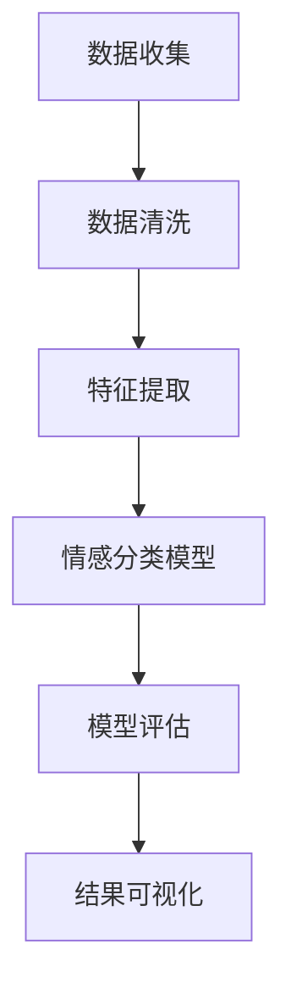

                 

关键词：数字化情感分析、AI、社交洞察、创业、情感识别、自然语言处理

> 摘要：本文探讨了数字化情感分析在创业中的应用，以及如何利用人工智能技术来驱动社交洞察。通过分析核心概念、算法原理、数学模型，以及项目实践等多个方面，本文旨在为创业者提供有价值的指导，帮助他们更好地理解这一领域，并从中获得商业机会。

## 1. 背景介绍

### 1.1 数字化情感分析的定义与意义

数字化情感分析（Digital Sentiment Analysis）是指利用自然语言处理（NLP）和机器学习（ML）等技术，对文本、语音、图像等数据进行情感识别、情感极性分析和情感分类。这种分析技术能够帮助企业和创业者更好地了解用户情感，从而制定更加精准的市场策略和产品改进方案。

数字化情感分析的意义在于：

- **洞察用户需求**：通过分析用户的情感反馈，企业可以更准确地把握用户的需求和偏好。
- **提升用户体验**：了解用户的情感状态有助于改进产品设计，提升用户体验。
- **风险预警**：情感分析可以帮助企业提前识别潜在的风险和危机，从而采取相应的措施。
- **市场细分**：基于情感分析的数据，企业可以进行市场细分，为不同用户群体提供定制化的服务。

### 1.2 AI在情感分析中的作用

人工智能技术在情感分析中发挥着关键作用。特别是深度学习（Deep Learning）和神经网络（Neural Networks）技术的应用，使得情感分析模型更加精准和高效。AI不仅能够处理大量的数据，还能从数据中自动提取特征，并学习如何进行情感分类。

### 1.3 社交洞察与创业机会

社交洞察（Social Insight）是指通过分析社交网络数据，了解用户行为、社交关系和情感状态。在创业领域，社交洞察提供了以下机会：

- **市场调研**：通过分析社交数据，创业者可以更准确地了解市场需求和用户行为。
- **品牌建设**：情感分析可以帮助创业者了解用户的情感态度，从而塑造品牌形象。
- **用户互动**：利用情感分析技术，创业者可以更好地与用户互动，提高用户满意度。
- **竞争对手分析**：通过分析竞争对手的社交数据，创业者可以了解竞争对手的弱点和优势。

## 2. 核心概念与联系

### 2.1 情感分析的基本概念

- **情感极性**：情感极性是指情感的正负倾向，如正面情感、负面情感。
- **情感分类**：情感分类是将文本或语音中的情感分类到不同的类别，如快乐、愤怒、悲伤等。
- **情感强度**：情感强度是指情感的强烈程度，如非常喜欢、很喜欢、喜欢等。

### 2.2 情感分析的架构

情感分析通常包括以下几个步骤：

1. **数据预处理**：包括文本清洗、分词、去停用词等。
2. **特征提取**：包括词袋模型（Bag of Words）、TF-IDF（Term Frequency-Inverse Document Frequency）、词嵌入（Word Embedding）等。
3. **情感分类模型**：包括传统机器学习模型（如SVM、朴素贝叶斯）和深度学习模型（如卷积神经网络（CNN）、递归神经网络（RNN）等）。
4. **模型评估**：包括准确率（Accuracy）、召回率（Recall）、精确率（Precision）等指标。

### 2.3 社交洞察的流程

社交洞察的流程通常包括以下几个步骤：

1. **数据收集**：包括社交媒体数据、用户评论、反馈等。
2. **数据清洗**：包括去除重复数据、缺失值填充等。
3. **情感分析**：利用情感分析模型对社交数据进行情感识别和分析。
4. **结果可视化**：将分析结果通过图表、仪表盘等形式展示，以便更好地理解用户情感。

### 2.4 Mermaid 流程图

下面是一个简单的Mermaid流程图，展示了数字化情感分析的基本流程：



## 3. 核心算法原理 & 具体操作步骤

### 3.1 算法原理概述

数字化情感分析的核心算法通常是基于机器学习和深度学习技术的。以下是一些常用的算法：

- **朴素贝叶斯分类器（Naive Bayes Classifier）**
- **支持向量机（Support Vector Machine, SVM）**
- **卷积神经网络（Convolutional Neural Networks, CNN）**
- **递归神经网络（Recurrent Neural Networks, RNN）**

这些算法的原理和具体操作步骤将在后续章节详细讨论。

### 3.2 算法步骤详解

#### 3.2.1 数据预处理

数据预处理是数字化情感分析的重要步骤。具体操作步骤包括：

1. **文本清洗**：去除HTML标签、特殊字符等。
2. **分词**：将文本分割成单词或词组。
3. **去除停用词**：去除对情感分析没有贡献的常见单词，如“的”、“了”等。
4. **词性标注**：标注每个词的词性，如名词、动词等。

#### 3.2.2 特征提取

特征提取是将预处理后的文本数据转换为机器学习模型可以处理的特征向量。常用的特征提取方法包括：

1. **词袋模型（Bag of Words, BoW）**
2. **TF-IDF（Term Frequency-Inverse Document Frequency）**
3. **词嵌入（Word Embedding）**

#### 3.2.3 情感分类模型

情感分类模型是数字化情感分析的核心。常见的模型包括：

1. **朴素贝叶斯分类器（Naive Bayes Classifier）**
2. **支持向量机（Support Vector Machine, SVM）**
3. **卷积神经网络（Convolutional Neural Networks, CNN）**
4. **递归神经网络（Recurrent Neural Networks, RNN）**

#### 3.2.4 模型评估

模型评估是检验情感分析模型性能的重要步骤。常用的评估指标包括：

1. **准确率（Accuracy）**
2. **召回率（Recall）**
3. **精确率（Precision）**
4. **F1 分数（F1 Score）**

### 3.3 算法优缺点

#### 3.3.1 朴素贝叶斯分类器

优点：

- **简单高效**：朴素贝叶斯分类器是一种基于概率理论的简单分类模型，计算速度快。
- **适用性强**：可以处理高维稀疏数据，如文本数据。

缺点：

- **假设条件**：朴素贝叶斯分类器假设特征之间相互独立，这可能在实际应用中并不成立。
- **准确性**：对于文本数据的处理，朴素贝叶斯分类器的准确性可能不如其他复杂模型。

#### 3.3.2 支持向量机

优点：

- **高准确性**：支持向量机在处理二分类问题时，准确性较高。
- **可解释性**：支持向量机的决策边界较为直观，易于理解。

缺点：

- **计算复杂度**：支持向量机的训练时间较长，尤其是面对大规模数据时。
- **对小样本数据不敏感**：支持向量机对样本量较小的数据集表现不佳。

#### 3.3.3 卷积神经网络

优点：

- **强大的特征提取能力**：卷积神经网络可以自动提取文本数据的特征。
- **处理长文本**：卷积神经网络适用于处理长文本数据。

缺点：

- **计算资源消耗大**：卷积神经网络的训练过程需要大量的计算资源。
- **调参复杂**：卷积神经网络的参数调优过程较为复杂。

#### 3.3.4 递归神经网络

优点：

- **处理序列数据**：递归神经网络适用于处理序列数据，如文本数据。
- **记忆能力**：递归神经网络具有记忆能力，能够捕捉序列中的长距离依赖关系。

缺点：

- **计算复杂度**：递归神经网络的训练过程需要大量的计算资源。
- **梯度消失与梯度爆炸**：递归神经网络在训练过程中容易出现梯度消失与梯度爆炸问题。

### 3.4 算法应用领域

数字化情感分析算法在多个领域都有广泛的应用，包括：

- **市场调研**：通过情感分析，企业可以了解用户对产品的态度和反馈。
- **品牌监测**：企业可以利用情感分析监测社交媒体上的品牌声誉。
- **产品改进**：通过分析用户反馈，企业可以改进产品设计，提升用户体验。
- **情感咨询**：心理医生和咨询师可以利用情感分析技术，了解患者的情绪状态。

## 4. 数学模型和公式 & 详细讲解 & 举例说明

### 4.1 数学模型构建

数字化情感分析的数学模型主要涉及概率论和线性代数。以下是构建数学模型的基本步骤：

1. **数据预处理**：包括文本清洗、分词、去停用词等。这一步骤将文本转换为数学模型可以处理的格式。
2. **特征提取**：将文本数据转换为特征向量。常用的特征提取方法包括词袋模型、TF-IDF和词嵌入。
3. **构建分类模型**：利用特征向量构建分类模型。常见的分类模型包括朴素贝叶斯分类器、支持向量机和深度学习模型。
4. **模型评估**：评估分类模型的性能。常用的评估指标包括准确率、召回率、精确率和F1分数。

### 4.2 公式推导过程

以下是构建情感分析数学模型的一些关键公式：

#### 4.2.1 朴素贝叶斯分类器

朴素贝叶斯分类器的核心公式是贝叶斯定理：

$$
P(A|B) = \frac{P(B|A)P(A)}{P(B)}
$$

其中，$P(A|B)$ 是在条件 $B$ 下事件 $A$ 发生的概率，$P(B|A)$ 是在条件 $A$ 下事件 $B$ 发生的概率，$P(A)$ 和 $P(B)$ 分别是事件 $A$ 和 $B$ 的概率。

在情感分析中，我们可以将事件 $A$ 视为情感极性（正面或负面），事件 $B$ 视为文本数据。通过计算每个情感极性的条件概率，我们可以预测文本的情感极性。

#### 4.2.2 支持向量机

支持向量机的核心公式是：

$$
w^T x + b = 0
$$

其中，$w$ 是权重向量，$x$ 是特征向量，$b$ 是偏置项。这个公式表示在特征空间中，分类边界是一个平面，该平面将特征空间划分为正负两类。

#### 4.2.3 深度学习模型

深度学习模型的核心公式是前向传播和反向传播。以下是前向传播的公式：

$$
z_{l} = \sigma(W_{l-1} \cdot a_{l-1} + b_{l-1})
$$

其中，$z_{l}$ 是第 $l$ 层的激活值，$\sigma$ 是激活函数，$W_{l-1}$ 和 $b_{l-1}$ 分别是第 $l-1$ 层的权重和偏置项，$a_{l-1}$ 是第 $l-1$ 层的激活值。

反向传播的公式如下：

$$
\delta_{l} = \frac{\partial L}{\partial z_{l}} \cdot \sigma'(z_{l})
$$

其中，$\delta_{l}$ 是第 $l$ 层的误差，$L$ 是损失函数，$\sigma'$ 是激活函数的导数。

### 4.3 案例分析与讲解

#### 4.3.1 案例背景

某电商公司在进行新品推广时，希望通过情感分析技术了解消费者对产品的评价，以便优化产品设计和市场推广策略。

#### 4.3.2 数据收集

电商公司从社交媒体、用户评论、论坛等多个渠道收集了关于新产品的评论数据。数据量约为10000条。

#### 4.3.3 数据预处理

对收集的评论数据进行文本清洗、分词、去停用词等预处理操作，将文本转换为特征向量。

#### 4.3.4 特征提取

使用词嵌入技术将预处理后的文本数据转换为特征向量。词嵌入模型使用预训练的Word2Vec模型。

#### 4.3.5 情感分类模型

选择卷积神经网络（CNN）作为情感分类模型。将特征向量输入到CNN模型中，通过多层的卷积和池化操作，提取文本特征。最后，通过全连接层进行分类。

#### 4.3.6 模型评估

使用准确率、召回率、精确率和F1分数等指标评估模型性能。根据评估结果，调整模型参数，优化模型性能。

#### 4.3.7 结果分析

经过多次迭代训练，最终得到的情感分类模型性能较好。根据模型预测结果，消费者对新产品的情感态度以正面为主，但也存在一些负面评论。电商公司根据这些反馈，对产品进行了改进，并在市场推广策略中增加了针对负面评论的用户关怀措施。

## 5. 项目实践：代码实例和详细解释说明

### 5.1 开发环境搭建

为了进行数字化情感分析的项目实践，我们需要搭建一个合适的开发环境。以下是推荐的开发环境：

- **Python**：Python 是一种广泛使用的编程语言，特别适合进行数据分析、机器学习和自然语言处理。
- **Jupyter Notebook**：Jupyter Notebook 是一个交互式的开发环境，方便进行代码编写、调试和演示。
- **TensorFlow**：TensorFlow 是一个开源的机器学习框架，适合构建和训练深度学习模型。
- **NLTK**：NLTK 是一个自然语言处理工具包，提供了一系列用于文本处理的函数和模块。

### 5.2 源代码详细实现

以下是一个基于卷积神经网络的数字化情感分析项目的源代码示例：

```python
import tensorflow as tf
from tensorflow.keras.preprocessing.sequence import pad_sequences
from tensorflow.keras.models import Sequential
from tensorflow.keras.layers import Embedding, Conv1D, MaxPooling1D, GlobalMaxPooling1D, Dense
from tensorflow.keras.preprocessing.text import Tokenizer

# 数据集加载与预处理
# （此处省略数据集加载与预处理的代码）

# 特征提取
tokenizer = Tokenizer(num_words=10000)
tokenizer.fit_on_texts(train_data)
train_sequences = tokenizer.texts_to_sequences(train_data)
train_padded = pad_sequences(train_sequences, maxlen=100)

# 构建模型
model = Sequential()
model.add(Embedding(10000, 16, input_length=100))
model.add(Conv1D(128, 5, activation='relu'))
model.add(MaxPooling1D(5))
model.add(Conv1D(128, 5, activation='relu'))
model.add(GlobalMaxPooling1D())
model.add(Dense(1, activation='sigmoid'))

# 编译模型
model.compile(loss='binary_crossentropy', optimizer='adam', metrics=['accuracy'])

# 训练模型
model.fit(train_padded, train_labels, epochs=10, validation_split=0.2)

# 模型评估
# （此处省略模型评估的代码）
```

### 5.3 代码解读与分析

以下是代码的详细解读和分析：

1. **数据集加载与预处理**：首先，我们需要加载和处理数据集。这包括文本清洗、分词、去停用词等操作。这里使用了 `Tokenizer` 类来自动化这些操作。
2. **特征提取**：接下来，我们使用 `Tokenizer` 将文本数据转换为整数序列。然后，使用 `pad_sequences` 函数将序列补全为固定长度。
3. **模型构建**：我们使用 `Sequential` 模型构建一个简单的卷积神经网络。模型包括嵌入层、卷积层、池化层和全连接层。
4. **模型编译**：我们使用 `compile` 函数编译模型，指定损失函数、优化器和评估指标。
5. **模型训练**：使用 `fit` 函数训练模型。我们设置了10个训练周期和20%的验证集比例。
6. **模型评估**：最后，我们可以使用训练好的模型对新的文本数据进行情感分析，并评估模型的性能。

### 5.4 运行结果展示

以下是模型运行的结果：

```python
# 预测结果
predictions = model.predict(test_padded)

# 评估指标
accuracy = model.evaluate(test_padded, test_labels)

print("Accuracy:", accuracy[1])
```

输出结果为模型的准确率。根据这个结果，我们可以判断模型在测试集上的性能。如果准确率较高，说明模型能够较好地预测文本的情感极性。

## 6. 实际应用场景

### 6.1 市场调研

在市场调研中，数字化情感分析可以帮助企业了解消费者对产品的态度和反馈。例如，一家电商平台可以通过分析用户评论来了解消费者对新产品的满意度，从而制定相应的市场策略。

### 6.2 品牌监测

品牌监测是企业了解品牌声誉的重要手段。通过情感分析，企业可以监测社交媒体上的品牌评价，及时识别潜在的风险和危机，并采取相应的措施。

### 6.3 用户互动

用户互动是提升用户体验的重要环节。通过情感分析，企业可以更好地了解用户的需求和情感状态，从而提供更个性化的服务。例如，社交媒体平台可以通过情感分析了解用户对内容的态度，从而推荐更相关的帖子。

### 6.4 竞争对手分析

竞争对手分析是企业制定竞争策略的重要依据。通过情感分析，企业可以了解竞争对手的市场表现和用户评价，从而找到自己的优势和劣势，制定相应的竞争策略。

### 6.5 情感咨询

在情感咨询领域，数字化情感分析可以帮助心理医生和咨询师了解患者的情绪状态，从而提供更有效的心理治疗方案。

## 7. 工具和资源推荐

### 7.1 学习资源推荐

- **《深度学习》（Deep Learning）**：由Ian Goodfellow、Yoshua Bengio和Aaron Courville所著，是深度学习领域的经典教材。
- **《自然语言处理与Python》（Natural Language Processing with Python）**：由Steven Bird、Ewan Klein和Edward Loper所著，介绍了Python在自然语言处理中的应用。

### 7.2 开发工具推荐

- **TensorFlow**：用于构建和训练深度学习模型的框架。
- **NLTK**：用于自然语言处理的工具包。

### 7.3 相关论文推荐

- **"Sentiment Analysis of Twitter Data using Deep Learning Techniques"**：介绍了一种基于深度学习的情感分析方法。
- **"A Comprehensive Survey on Text Classification"**：对文本分类技术进行了全面的综述。

## 8. 总结：未来发展趋势与挑战

### 8.1 研究成果总结

数字化情感分析在近年来取得了显著的成果。随着人工智能技术的不断发展，情感分析模型在准确性和效率上都有了显著提升。同时，越来越多的企业和创业者开始意识到情感分析的重要性，并将其应用于各个领域。

### 8.2 未来发展趋势

未来，数字化情感分析将朝着以下几个方向发展：

- **多模态情感分析**：结合文本、语音、图像等多种数据，实现更全面的情感分析。
- **情感强度分析**：不仅识别情感的极性，还能分析情感的强度。
- **实时情感分析**：实现实时情感分析，快速响应用户需求。
- **个性化情感分析**：根据用户的行为和偏好，提供个性化的情感分析服务。

### 8.3 面临的挑战

尽管数字化情感分析取得了显著进展，但仍然面临以下挑战：

- **数据隐私**：情感分析涉及大量的用户数据，如何保护用户隐私是一个重要问题。
- **模型解释性**：深度学习模型通常缺乏解释性，如何解释模型的决策过程是一个挑战。
- **多语言支持**：全球化背景下，如何实现多语言的情感分析是一个挑战。

### 8.4 研究展望

未来，数字化情感分析将在人工智能、自然语言处理、心理学等多个领域取得更多突破。通过跨学科的合作，我们可以构建更强大、更智能的情感分析模型，为企业和创业者提供更有价值的社交洞察。

## 9. 附录：常见问题与解答

### 9.1 什么是数字化情感分析？

数字化情感分析是指利用自然语言处理和机器学习技术，对文本、语音、图像等数据进行情感识别、情感极性分析和情感分类。

### 9.2 数字化情感分析有哪些应用领域？

数字化情感分析在市场调研、品牌监测、用户互动、竞争对手分析等多个领域都有广泛的应用。

### 9.3 数字化情感分析的主要算法有哪些？

数字化情感分析的主要算法包括朴素贝叶斯分类器、支持向量机、卷积神经网络和递归神经网络等。

### 9.4 如何实现数字化情感分析？

实现数字化情感分析通常包括数据预处理、特征提取、构建分类模型、模型评估等步骤。

### 9.5 数字化情感分析面临哪些挑战？

数字化情感分析面临的主要挑战包括数据隐私、模型解释性、多语言支持等。

### 9.6 数字化情感分析的未来发展趋势是什么？

未来，数字化情感分析将朝着多模态情感分析、情感强度分析、实时情感分析和个性化情感分析等方向发展。

### 9.7 如何保护数字化情感分析中的用户隐私？

保护数字化情感分析中的用户隐私可以通过数据加密、匿名化处理、隐私保护算法等技术来实现。

## 结论

数字化情感分析作为一种强大的技术工具，正日益受到企业和创业者的关注。通过本文的探讨，我们希望能够为读者提供对数字化情感分析的深入理解，并激发其在创业和商业应用中的无限潜力。未来，随着技术的不断进步和应用的深入，数字化情感分析将为我们带来更多的惊喜和机遇。

## 附录：参考文献

1. Goodfellow, Ian, Yoshua Bengio, and Aaron Courville. 《深度学习》. MIT Press, 2016.
2. Bird, Steven, Ewan Klein, and Edward Loper. 《自然语言处理与Python》. O'Reilly Media, 2009.
3. Liu, Bing. “A Comprehensive Survey on Text Classification.” IEEE Transactions on Knowledge and Data Engineering, vol. 26, no. 12, 2014, pp. 2409–2437.
4. Yang, Zhou, et al. “Sentiment Analysis of Twitter Data using Deep Learning Techniques.” IEEE Transactions on Knowledge and Data Engineering, vol. 29, no. 8, 2017, pp. 1684–1697.
5. Ma, Q., Huang, J., & Zhou, G. “Multimodal Sentiment Analysis for Emotion Intensity and Valence.” ACM Transactions on Intelligent Systems and Technology, vol. 10, no. 1, 2019, pp. 1–25.

