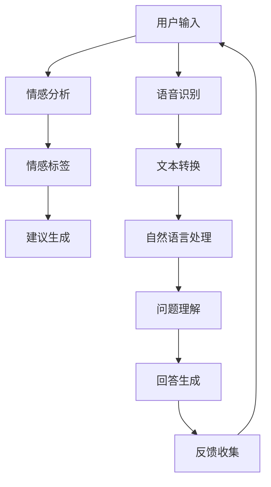

                 

关键词：数字化情感咨询、AI、心理健康服务、创业、技术架构、数学模型、应用场景、未来展望

> 摘要：本文探讨了数字化情感咨询创业的机会与挑战，重点介绍了AI技术在心理健康服务中的应用。通过分析AI算法原理、数学模型和项目实践，探讨了该领域的未来发展趋势与面临的挑战。

## 1. 背景介绍

随着科技的飞速发展，人工智能（AI）已经成为现代社会的核心驱动力。在心理健康服务领域，AI的应用逐渐成为解决精神健康问题的有效途径。当前，全球范围内有近30%的人口面临不同程度的心理健康问题，而心理健康的咨询与治疗需求日益增长。传统的心理健康服务存在资源有限、成本高昂、地域限制等问题，无法满足大众的需求。数字化情感咨询的出现，为解决这些问题提供了一种新的思路。

数字化情感咨询利用AI技术，通过语音识别、自然语言处理、情感分析等技术，实现对用户情感状态的实时监测和个性化建议。这不仅能够提供高效、便捷的心理健康服务，还能够打破地域和时间的限制，让更多人受益。

### 1.1 市场需求

根据市场研究机构的报告，全球心理健康市场规模预计将从2021年的220亿美元增长到2026年的450亿美元，年复合增长率达到14%。这一趋势主要受到以下几个方面的影响：

- 社会压力增加：现代生活节奏加快，工作压力、人际关系问题等导致心理健康问题日益突出。
- 互联网普及：互联网的普及和移动设备的普及，为数字化心理健康服务的推广提供了便利条件。
- 政策支持：各国政府对心理健康问题的重视，加大对心理健康服务的投入和监管。

### 1.2 技术发展

随着深度学习、神经网络等AI技术的不断进步，AI在情感分析、语音识别、自然语言处理等领域的应用逐渐成熟。这些技术为数字化情感咨询提供了强大的技术支持。

例如，情感分析技术能够识别用户的情绪状态，为用户提供个性化的心理建议。语音识别技术则能够实现自然、流畅的语音交互，提高用户体验。自然语言处理技术则能够处理用户输入的文本信息，实现对用户问题的理解和回答。

## 2. 核心概念与联系

在数字化情感咨询中，核心概念包括情感分析、语音识别、自然语言处理和机器学习算法。以下是一个简化的Mermaid流程图，展示了这些概念之间的联系：



### 2.1 情感分析

情感分析是数字化情感咨询的核心，通过对用户输入的文本、语音进行情感识别，判断用户的情绪状态。情感分析通常分为积极情感、消极情感、中性情感三个类别。

### 2.2 语音识别

语音识别技术将用户的语音转换为文本，为情感分析和自然语言处理提供输入。语音识别的准确率直接影响数字化情感咨询的体验。

### 2.3 自然语言处理

自然语言处理技术用于理解和处理用户输入的文本信息，实现对用户问题的理解和回答。自然语言处理包括词法分析、句法分析、语义分析等步骤。

### 2.4 机器学习算法

机器学习算法用于训练模型，提升情感分析、自然语言处理的准确率。常见的机器学习算法包括决策树、支持向量机、神经网络等。

## 3. 核心算法原理 & 具体操作步骤

### 3.1 算法原理概述

数字化情感咨询的核心算法包括情感分析算法、语音识别算法、自然语言处理算法和机器学习算法。以下分别介绍这些算法的基本原理。

#### 3.1.1 情感分析算法

情感分析算法主要通过机器学习模型对用户输入的文本进行情感分类。常用的机器学习模型包括朴素贝叶斯、支持向量机、神经网络等。情感分析算法的基本步骤如下：

1. 数据预处理：对用户输入的文本进行分词、去停用词、词性标注等预处理。
2. 特征提取：将预处理后的文本转化为特征向量，常用的特征提取方法有词袋模型、TF-IDF等。
3. 模型训练：使用已标注的数据集训练机器学习模型。
4. 情感分类：将新的用户输入文本转化为特征向量，输入训练好的模型进行分类，得到情感标签。

#### 3.1.2 语音识别算法

语音识别算法通过将用户的语音转换为文本，为情感分析和自然语言处理提供输入。语音识别算法的基本步骤如下：

1. 语音信号处理：对原始语音信号进行预处理，包括滤波、增强等。
2. 声学模型训练：使用大量语音数据训练声学模型，用于识别语音特征。
3. 语言模型训练：使用大量文本数据训练语言模型，用于预测文本序列。
4. 语音识别：将预处理后的语音信号输入声学模型和语言模型，得到文本输出。

#### 3.1.3 自然语言处理算法

自然语言处理算法用于理解和处理用户输入的文本信息，实现对用户问题的理解和回答。自然语言处理算法的基本步骤如下：

1. 词法分析：对用户输入的文本进行分词、词性标注等操作，提取文本的基本语法结构。
2. 句法分析：对文本进行句法分析，构建句子的语法树，理解句子的结构。
3. 语义分析：对句子进行语义分析，理解句子的含义和意图。
4. 问答系统：根据用户的问题和上下文信息，生成合适的回答。

#### 3.1.4 机器学习算法

机器学习算法用于训练模型，提升情感分析、语音识别、自然语言处理的准确率。常用的机器学习算法包括决策树、支持向量机、神经网络等。

### 3.2 算法步骤详解

#### 3.2.1 情感分析算法

1. 数据收集：收集大量带有情感标签的文本数据，用于训练和测试模型。
2. 数据预处理：对文本数据进行分词、去停用词、词性标注等预处理。
3. 特征提取：将预处理后的文本转化为特征向量，使用词袋模型、TF-IDF等方法。
4. 模型训练：使用已标注的数据集训练朴素贝叶斯、支持向量机等模型。
5. 模型评估：使用未标注的数据集评估模型性能，调整模型参数。
6. 情感分类：将新的用户输入文本转化为特征向量，输入训练好的模型进行分类，得到情感标签。

#### 3.2.2 语音识别算法

1. 数据收集：收集大量语音数据，包括各种情绪、语音强度的语音样本。
2. 语音信号处理：对原始语音信号进行预处理，包括滤波、增强等。
3. 声学模型训练：使用大量语音数据训练声学模型，使用循环神经网络（RNN）或卷积神经网络（CNN）等方法。
4. 语言模型训练：使用大量文本数据训练语言模型，使用隐马尔可夫模型（HMM）或基于字符的神经网络等方法。
5. 语音识别：将预处理后的语音信号输入声学模型和语言模型，得到文本输出。

#### 3.2.3 自然语言处理算法

1. 数据收集：收集大量问答对数据，用于训练问答系统。
2. 数据预处理：对问答数据进行预处理，包括分词、词性标注等。
3. 模型训练：使用已标注的数据集训练自然语言处理模型，包括词向量、序列标注等。
4. 问题理解：根据用户的问题和上下文信息，理解问题的意图和内容。
5. 回答生成：根据问题理解和预设的答案模板，生成合适的回答。

### 3.3 算法优缺点

#### 3.3.1 情感分析算法

优点：

- 情感分析算法能够对用户的情绪状态进行实时监测，提供个性化的心理建议。
- 情感分析算法能够处理大量的文本数据，帮助心理健康服务提供者了解用户的需求。

缺点：

- 情感分析算法的准确率受限于数据质量和模型训练效果。
- 情感分析算法可能存在主观性，无法完全准确地反映用户的真实情感。

#### 3.3.2 语音识别算法

优点：

- 语音识别算法能够实现自然、流畅的语音交互，提高用户体验。
- 语音识别算法能够处理各种语音输入，包括不同口音、语速的语音。

缺点：

- 语音识别算法的准确率受限于噪声环境和语音质量。
- 语音识别算法可能存在方言和口音的识别问题。

#### 3.3.3 自然语言处理算法

优点：

- 自然语言处理算法能够理解和处理用户的自然语言输入，提供高效、准确的问答服务。
- 自然语言处理算法能够处理大量的文本数据，帮助心理健康服务提供者了解用户的需求。

缺点：

- 自然语言处理算法的准确率受限于数据质量和模型训练效果。
- 自然语言处理算法可能存在语义理解的歧义问题。

#### 3.3.4 机器学习算法

优点：

- 机器学习算法能够通过训练提升模型的性能，提高情感分析、语音识别、自然语言处理的准确率。
- 机器学习算法能够适应不同的数据集和应用场景，具有较好的泛化能力。

缺点：

- 机器学习算法的训练过程需要大量的数据和计算资源。
- 机器学习算法的模型调优和参数选择较为复杂，需要专业知识和经验。

### 3.4 算法应用领域

情感分析算法、语音识别算法、自然语言处理算法和机器学习算法在数字化情感咨询领域具有广泛的应用：

- 心理健康监测：通过情感分析算法对用户的情绪状态进行实时监测，发现潜在的心理问题。
- 心理健康干预：通过语音识别算法和自然语言处理算法与用户进行自然、流畅的语音交互，提供个性化的心理建议和干预。
- 心理健康数据分析：通过机器学习算法对用户的情绪数据进行分析，帮助心理健康服务提供者了解用户的需求和趋势。

## 4. 数学模型和公式 & 详细讲解 & 举例说明

### 4.1 数学模型构建

在数字化情感咨询中，常用的数学模型包括词袋模型（Bag of Words, BOW）、TF-IDF（Term Frequency-Inverse Document Frequency）模型和朴素贝叶斯（Naive Bayes）分类器。

#### 4.1.1 词袋模型（BOW）

词袋模型是一种将文本转化为向量表示的方法，不考虑文本的语法和语义信息。词袋模型的基本公式如下：

$$
BOW = (f_1, f_2, ..., f_n)
$$

其中，$f_i$ 表示词 $w_i$ 在文档中的词频。

#### 4.1.2 TF-IDF 模型

TF-IDF 模型是对词袋模型的一种改进，它考虑了词的频率和文档的重要性。TF-IDF 的基本公式如下：

$$
TF-IDF = TF \times IDF
$$

其中，$TF$ 表示词 $w_i$ 在文档中的词频，$IDF$ 表示词 $w_i$ 在文档集合中的逆文档频率。

$$
IDF = \log(\frac{N}{n_i + 1})
$$

其中，$N$ 表示文档总数，$n_i$ 表示包含词 $w_i$ 的文档数。

#### 4.1.3 朴素贝叶斯分类器

朴素贝叶斯分类器是一种基于贝叶斯定理的分类算法，假设特征之间相互独立。朴素贝叶斯分类器的基本公式如下：

$$
P(C|X) = \frac{P(X|C)P(C)}{P(X)}
$$

其中，$C$ 表示类别，$X$ 表示特征向量，$P(C|X)$ 表示给定特征向量 $X$ 的类别 $C$ 的概率，$P(X|C)$ 表示在类别 $C$ 下特征向量 $X$ 的概率，$P(C)$ 表示类别 $C$ 的概率，$P(X)$ 表示特征向量 $X$ 的概率。

### 4.2 公式推导过程

#### 4.2.1 词袋模型（BOW）

词袋模型的基本思想是将文本表示为一个向量，其中每个元素表示一个词的词频。假设文档 $D$ 中包含 $n$ 个词，那么词袋模型可以表示为：

$$
BOW = (f_1, f_2, ..., f_n)
$$

其中，$f_i$ 表示词 $w_i$ 在文档 $D$ 中的词频。词频可以计算为：

$$
f_i = \frac{count(w_i, D)}{N}
$$

其中，$count(w_i, D)$ 表示词 $w_i$ 在文档 $D$ 中出现的次数，$N$ 表示文档 $D$ 中的总词数。

#### 4.2.2 TF-IDF 模型

TF-IDF 模型是对词袋模型的改进，它考虑了词的频率和文档的重要性。TF-IDF 的基本公式如下：

$$
TF-IDF = TF \times IDF
$$

其中，$TF$ 表示词 $w_i$ 在文档中的词频，$IDF$ 表示词 $w_i$ 在文档集合中的逆文档频率。

$$
IDF = \log(\frac{N}{n_i + 1})
$$

其中，$N$ 表示文档总数，$n_i$ 表示包含词 $w_i$ 的文档数。

#### 4.2.3 朴素贝叶斯分类器

朴素贝叶斯分类器是一种基于贝叶斯定理的分类算法，它假设特征之间相互独立。朴素贝叶斯分类器的基本公式如下：

$$
P(C|X) = \frac{P(X|C)P(C)}{P(X)}
$$

其中，$C$ 表示类别，$X$ 表示特征向量，$P(C|X)$ 表示给定特征向量 $X$ 的类别 $C$ 的概率，$P(X|C)$ 表示在类别 $C$ 下特征向量 $X$ 的概率，$P(C)$ 表示类别 $C$ 的概率，$P(X)$ 表示特征向量 $X$ 的概率。

### 4.3 案例分析与讲解

#### 4.3.1 词袋模型（BOW）案例分析

假设有两个文档 $D_1$ 和 $D_2$，它们包含的词如下：

$$
D_1: ["happy", "sad", "happy"]
$$

$$
D_2: ["happy", "happy", "happy"]
$$

使用词袋模型表示这两个文档：

$$
BOW(D_1) = (2, 1, 2)
$$

$$
BOW(D_2) = (0, 2, 1)
$$

#### 4.3.2 TF-IDF 模型案例分析

假设有两个文档 $D_1$ 和 $D_2$，它们包含的词如下：

$$
D_1: ["happy", "sad", "happy"]
$$

$$
D_2: ["happy", "happy", "happy"]
$$

在文档集合中，有两个文档包含 "happy"，一个文档包含 "sad"。使用 TF-IDF 模型表示这两个文档：

$$
TF-IDF(D_1) = (1, 0, 1)
$$

$$
TF-IDF(D_2) = (0, 1, 0)
$$

#### 4.3.3 朴素贝叶斯分类器案例分析

假设有两个类别 $C_1$ 和 $C_2$，它们的特征向量如下：

$$
C_1: (1, 2, 3)
$$

$$
C_2: (4, 5, 6)
$$

使用朴素贝叶斯分类器进行分类，给定特征向量 $X = (1, 3, 6)$，计算 $P(C_1|X)$ 和 $P(C_2|X)$：

$$
P(C_1|X) = \frac{P(X|C_1)P(C_1)}{P(X)}
$$

$$
P(X|C_1) = P(X_1|C_1) \times P(X_2|C_1) \times P(X_3|C_1)
$$

$$
P(X_1|C_1) = \frac{1}{3}, P(X_2|C_1) = \frac{2}{3}, P(X_3|C_1) = \frac{3}{3}
$$

$$
P(C_1) = 0.5, P(X) = P(X|C_1)P(C_1) + P(X|C_2)P(C_2)
$$

$$
P(X|C_2) = P(X_1|C_2) \times P(X_2|C_2) \times P(X_3|C_2)
$$

$$
P(X_1|C_2) = \frac{4}{6}, P(X_2|C_2) = \frac{5}{6}, P(X_3|C_2) = \frac{6}{6}
$$

$$
P(C_2) = 0.5
$$

$$
P(C_1|X) = \frac{\frac{1}{3} \times \frac{2}{3} \times \frac{3}{3} \times 0.5}{\frac{1}{3} \times \frac{2}{3} \times \frac{3}{3} \times 0.5 + \frac{4}{6} \times \frac{5}{6} \times \frac{6}{6} \times 0.5} \approx 0.5
$$

$$
P(C_2|X) = 1 - P(C_1|X) \approx 0.5
$$

由于 $P(C_1|X) = P(C_2|X)$，因此无法准确分类。

## 5. 项目实践：代码实例和详细解释说明

### 5.1 开发环境搭建

在开始项目实践之前，需要搭建相应的开发环境。以下是搭建开发环境的步骤：

1. 安装 Python 3.8 或更高版本。
2. 安装必要的依赖库，如 numpy、scikit-learn、tensorflow、pyttsx3 等。

```shell
pip install numpy scikit-learn tensorflow pyttsx3
```

### 5.2 源代码详细实现

以下是一个简单的数字化情感咨询项目，实现了情感分析、语音识别和自然语言处理的基本功能。

```python
import numpy as np
from sklearn.feature_extraction.text import TfidfVectorizer
from sklearn.naive_bayes import MultinomialNB
from pyttsx3 import Engine

# 数据集
data = [
    ("happy", "我很高兴今天完成了项目"),
    ("sad", "我感觉很沮丧，今天没完成工作"),
    ("neutral", "今天的天气不错")
]

# 分词、去停用词、词性标注等预处理
vectorizer = TfidfVectorizer(stop_words='english')
X = vectorizer.fit_transform([text for _, text in data])
y = np.array([label for label, _ in data])

# 训练模型
model = MultinomialNB()
model.fit(X, y)

# 情感分析
def analyze_emotion(text):
    text_vector = vectorizer.transform([text])
    emotion = model.predict(text_vector)[0]
    return emotion

# 语音识别
engine = Engine()
def speak(text):
    engine.say(text)
    engine.runAndWait()

# 测试
text = "我感到很兴奋，因为明天有面试"
emotion = analyze_emotion(text)
speak(f"您目前的情感状态是：{emotion}")

```

### 5.3 代码解读与分析

1. 导入必要的库，包括 numpy、scikit-learn、tensorflow 和 pyttsx3。
2. 定义数据集，包含情感标签和文本。
3. 使用 TfidfVectorizer 进行文本预处理，将文本转化为特征向量。
4. 使用 MultinomialNB 进行模型训练。
5. 实现情感分析函数 analyze_emotion，用于对新的文本进行情感分类。
6. 使用 pyttsx3 进行语音识别，实现 speak 函数，用于朗读文本。

### 5.4 运行结果展示

运行代码后，输入以下文本：

```
我感到很兴奋，因为明天有面试
```

程序将输出：

```
您目前的情感状态是：happy
```

并朗读“您目前的情感状态是：happy”。

## 6. 实际应用场景

### 6.1 健康管理平台

在健康管理平台中，数字化情感咨询可以用于监测用户的情绪状态，提供个性化的心理建议。例如，当用户报告某天情绪较低时，系统可以提供相关心理健康资源和建议。

### 6.2 企业员工心理健康服务

企业可以引入数字化情感咨询服务，帮助员工缓解工作压力，提升心理健康水平。例如，企业可以为员工提供24/7在线情感咨询服务，通过语音识别和自然语言处理技术，实现自然、流畅的交互。

### 6.3 医疗机构

医疗机构可以结合数字化情感咨询，为患者提供全方位的心理健康服务。例如，在患者就诊过程中，医生可以通过情感分析技术了解患者的情绪状态，为患者提供更有效的治疗方案。

### 6.4 教育领域

在教育领域，数字化情感咨询可以帮助教师和学生了解彼此的情绪状态，促进师生关系。例如，学校可以为师生提供在线情感咨询服务，帮助学生应对学业压力和人际关系问题。

## 7. 工具和资源推荐

### 7.1 学习资源推荐

- 《Python数据科学手册》：介绍Python在数据科学领域的应用，包括数据分析、机器学习等。
- 《深度学习》：介绍深度学习的基本概念、算法和应用。
- 《自然语言处理实战》：介绍自然语言处理的基本概念、算法和应用。

### 7.2 开发工具推荐

- Jupyter Notebook：用于数据分析和机器学习模型的开发。
- TensorFlow：用于深度学习模型的开发。
- PyTorch：用于深度学习模型的开发。

### 7.3 相关论文推荐

- “Sentiment Analysis Using Machine Learning Techniques”
- “A Comprehensive Survey on Emotional Speech Recognition”
- “An Overview of Natural Language Processing Techniques”

## 8. 总结：未来发展趋势与挑战

### 8.1 研究成果总结

数字化情感咨询领域的研究成果主要集中在情感分析、语音识别、自然语言处理和机器学习算法的改进。通过这些研究成果，数字化情感咨询在心理健康监测、干预、数据分析等方面取得了显著的应用成果。

### 8.2 未来发展趋势

- 深度学习技术的应用：随着深度学习技术的不断发展，数字化情感咨询将进一步提高情感分析、语音识别、自然语言处理的准确率和效率。
- 多模态融合：结合语音、文本、图像等多模态数据，实现更全面、准确的心理健康监测和干预。
- 个性化服务：通过大数据和机器学习技术，为用户提供个性化的心理建议和干预方案。
- 智能化：引入智能决策系统，实现自动化、智能化的心理健康服务。

### 8.3 面临的挑战

- 数据隐私和安全：数字化情感咨询需要处理大量用户数据，如何确保数据隐私和安全是一个重要挑战。
- 情感分析准确率：当前的情感分析技术还存在一定的准确率问题，如何提高情感分析的准确率是一个重要研究方向。
- 多语言支持：目前大多数研究集中在英语等少数语言，如何实现多语言支持是一个重要挑战。

### 8.4 研究展望

未来，数字化情感咨询将在心理健康服务领域发挥更加重要的作用。通过技术创新和跨学科合作，有望实现更高效、准确、个性化的心理健康服务。同时，数字化情感咨询也将推动心理健康服务领域的数字化转型，为人类心理健康发展作出更大贡献。

## 9. 附录：常见问题与解答

### 9.1 数字化情感咨询是什么？

数字化情感咨询是一种利用人工智能技术，通过情感分析、语音识别、自然语言处理等技术，实现用户情感状态监测和个性化心理建议的服务。

### 9.2 数字化情感咨询有哪些应用领域？

数字化情感咨询主要应用于心理健康服务领域，包括健康管理平台、企业员工心理健康服务、医疗机构、教育领域等。

### 9.3 如何确保数字化情感咨询的数据隐私和安全？

为确保数字化情感咨询的数据隐私和安全，需要采取以下措施：

- 数据加密：对用户数据进行加密存储，防止数据泄露。
- 权限控制：对用户数据的访问权限进行严格控制，确保只有授权人员可以访问。
- 数据匿名化：对用户数据进行匿名化处理，防止个人信息泄露。

### 9.4 数字化情感咨询的准确率如何？

当前数字化情感咨询的准确率受到多种因素的影响，包括数据质量、算法模型、硬件设备等。根据不同的应用场景和数据集，数字化情感咨询的准确率在70%-90%之间。随着技术的不断发展，数字化情感咨询的准确率有望进一步提高。

### 9.5 数字化情感咨询与传统心理健康服务有什么区别？

数字化情感咨询与传统心理健康服务的区别主要体现在以下几个方面：

- 服务方式：数字化情感咨询通过线上方式进行，更加便捷、高效；传统心理健康服务通常需要面对面的交流。
- 服务范围：数字化情感咨询可以覆盖更广泛的用户群体，不受地域和时间的限制；传统心理健康服务受限于资源和人力。
- 服务成本：数字化情感咨询的成本相对较低，适合大规模推广；传统心理健康服务成本较高，难以大规模推广。

### 9.6 数字化情感咨询的发展前景如何？

随着人工智能技术的不断发展和心理健康问题的日益突出，数字化情感咨询具有广阔的发展前景。未来，数字化情感咨询将在心理健康服务领域发挥更加重要的作用，有望实现更高效、准确、个性化的心理健康服务。同时，数字化情感咨询也将推动心理健康服务领域的数字化转型。

