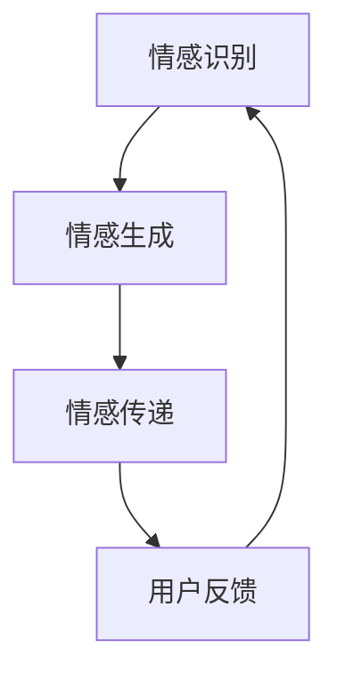
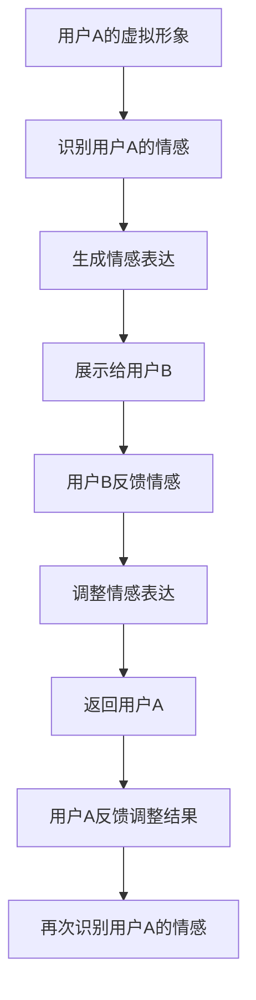

                 

关键词：数字化情感，元宇宙，人际沟通，AI，交互设计，虚拟现实

> 摘要：随着元宇宙的崛起，数字化情感表达成为人际沟通的重要方式。本文深入探讨了元宇宙中数字化情感表达的原理、算法和实际应用，分析了其在虚拟世界中的创新意义和未来发展趋势。

## 1. 背景介绍

近年来，随着虚拟现实（VR）和增强现实（AR）技术的快速发展，元宇宙（Metaverse）的概念逐渐进入大众视野。元宇宙被描述为一个超越现实世界的虚拟空间，用户可以在这个虚拟世界中自由交互、创造和探索。元宇宙的发展不仅改变了我们的生活方式，也为人际沟通带来了全新的可能性。

在元宇宙中，情感表达具有极高的价值。情感是人类沟通的核心，是人类相互理解和连接的重要纽带。然而，在传统的虚拟环境中，情感表达往往受到技术限制。传统的文本、语音和视频无法充分传达复杂的情感信息。因此，如何实现数字化情感表达，成为元宇宙技术发展的重要课题。

## 2. 核心概念与联系

### 2.1. 数字化情感表达

数字化情感表达是指通过技术手段，将人类的情感信息转化为数字信号，实现情感信息的传递和交互。数字化情感表达的核心是情感识别、情感生成和情感传递。

1. **情感识别**：通过传感器、语音识别、面部识别等技术，捕捉用户的情感状态，包括情绪、情感强度和情感变化等。
2. **情感生成**：利用自然语言处理（NLP）、计算机视觉（CV）等技术，生成与用户情感状态相对应的数字情感表达。
3. **情感传递**：通过虚拟现实（VR）、增强现实（AR）、全息投影等技术，将数字情感表达呈现在用户面前，实现情感的交互。

### 2.2. 元宇宙中的人际沟通

元宇宙中的人际沟通具有以下几个特点：

1. **虚拟身份**：用户在元宇宙中可以创建虚拟形象，通过虚拟形象进行情感表达和社交互动。
2. **沉浸式体验**：元宇宙提供了高度沉浸的虚拟环境，用户可以感受到与真实世界相似的物理效果和情感体验。
3. **多样化交互方式**：元宇宙中提供了丰富的交互方式，包括文本、语音、手势、虚拟物品等，满足不同用户的需求。

### 2.3. Mermaid 流程图

以下是一个关于数字化情感表达的Mermaid流程图：



### 2.4. 元宇宙中的人际沟通流程

以下是一个关于元宇宙中人际沟通的Mermaid流程图：



## 3. 核心算法原理 & 具体操作步骤

### 3.1. 算法原理概述

数字化情感表达的核心算法包括情感识别、情感生成和情感传递。以下分别介绍这三种算法的原理。

#### 3.1.1. 情感识别

情感识别是通过传感器和机器学习算法，捕捉用户的情感状态。常用的传感器包括面部识别摄像头、心率传感器、加速度传感器等。机器学习算法通过对大量情感样本的学习，建立情感识别模型。

#### 3.1.2. 情感生成

情感生成是通过自然语言处理（NLP）和计算机视觉（CV）技术，将用户的情感状态转化为数字情感表达。NLP技术用于生成与情感状态相对应的文本描述，CV技术用于生成与情感状态相对应的图像或视频。

#### 3.1.3. 情感传递

情感传递是通过虚拟现实（VR）、增强现实（AR）等技术，将数字情感表达呈现在用户面前。这些技术可以模拟用户的情感体验，增强人际沟通的效果。

### 3.2. 算法步骤详解

#### 3.2.1. 情感识别步骤

1. 使用面部识别摄像头捕捉用户的面部表情。
2. 利用机器学习算法，分析面部表情特征，识别用户的情感状态。
3. 将情感状态转化为数字信号，存储在数据库中。

#### 3.2.2. 情感生成步骤

1. 根据用户情感状态的数字信号，使用NLP技术生成文本描述。
2. 使用CV技术生成与文本描述相对应的图像或视频。
3. 将生成的情感表达存储在数据库中。

#### 3.2.3. 情感传递步骤

1. 用户A通过VR设备查看用户B的情感表达。
2. 用户A与用户B进行交互，分享自己的情感体验。
3. 用户A和B的交互数据存储在数据库中，用于后续分析。

### 3.3. 算法优缺点

#### 3.3.1. 优点

1. 充分利用了传感器和机器学习算法，实现了情感识别的高准确性。
2. 通过NLP和CV技术，生成了丰富多样的情感表达形式。
3. 利用VR和AR技术，实现了情感传递的沉浸式体验。

#### 3.3.2. 缺点

1. 情感识别技术对环境要求较高，需要稳定的传感器和良好的网络环境。
2. NLP和CV技术的复杂度高，对计算资源要求较大。
3. 情感传递过程中的延迟可能会影响用户体验。

### 3.4. 算法应用领域

数字化情感表达算法在元宇宙中的应用广泛，包括社交平台、在线教育、医疗健康、娱乐等领域。

1. **社交平台**：通过数字化情感表达，用户可以更直观地了解彼此的情感状态，增强社交互动。
2. **在线教育**：数字化情感表达可以帮助教师了解学生的学习状态，提供个性化的教学支持。
3. **医疗健康**：数字化情感表达可以辅助心理医生诊断和治疗情感障碍。
4. **娱乐**：数字化情感表达为游戏和虚拟现实体验提供了新的互动方式。

## 4. 数学模型和公式 & 详细讲解 & 举例说明

### 4.1. 数学模型构建

数字化情感表达的核心是情感识别、情感生成和情感传递。为了构建数学模型，我们首先需要定义情感状态。

#### 4.1.1. 情感状态定义

情感状态可以用一个三维向量表示，包括情感类型、情感强度和情感变化率。

1. 情感类型：用一维向量表示，例如{快乐，悲伤，愤怒，恐惧}。
2. 情感强度：用一维向量表示，表示情感的强度，范围在0到1之间。
3. 情感变化率：用一维向量表示，表示情感的变化速度，范围在0到1之间。

情感状态可以用以下公式表示：

$$
S = (T, I, V)
$$

其中，$T$表示情感类型，$I$表示情感强度，$V$表示情感变化率。

#### 4.1.2. 情感识别模型

情感识别模型是一个分类问题，可以使用支持向量机（SVM）进行训练。假设我们有一个训练集$D$，其中每个样本$(x, y)$包括一个情感状态向量$x$和一个对应的情感类型$y$。

1. **支持向量机（SVM）**：用于训练情感识别模型。$D$中的每个样本都可以表示为特征向量$x$，情感类型为$y$。SVM通过找到一个超平面，将不同情感状态区分开来。

2. **损失函数**：使用交叉熵损失函数来评估模型的准确性。

$$
L(y, \hat{y}) = -[y \cdot \log(\hat{y}) + (1 - y) \cdot \log(1 - \hat{y})]
$$

其中，$y$是真实的情感类型，$\hat{y}$是模型预测的情感类型。

### 4.2. 公式推导过程

#### 4.2.1. 情感识别公式推导

假设我们有一个训练集$D$，其中每个样本$(x, y)$包括一个情感状态向量$x$和一个对应的情感类型$y$。

1. **支持向量机（SVM）**：

$$
\min_{w, b} \frac{1}{2} \| w \|^2 + C \sum_{i=1}^{n} \max(0, 1 - y_i (w \cdot x_i + b))
$$

其中，$w$是权重向量，$b$是偏置项，$C$是正则化参数。

2. **损失函数**：

$$
L(y, \hat{y}) = -[y \cdot \log(\hat{y}) + (1 - y) \cdot \log(1 - \hat{y})]
$$

其中，$y$是真实的情感类型，$\hat{y}$是模型预测的情感类型。

#### 4.2.2. 情感生成公式推导

情感生成模型是一个回归问题，可以使用多层感知器（MLP）进行训练。假设我们有一个训练集$D$，其中每个样本$(x, y)$包括一个情感状态向量$x$和一个对应的情感强度向量$y$。

1. **多层感知器（MLP）**：

$$
\hat{y} = \sigma(W_2 \sigma(W_1 x + b_1) + b_2)
$$

其中，$W_1$和$W_2$是权重矩阵，$b_1$和$b_2$是偏置项，$\sigma$是激活函数。

2. **损失函数**：

$$
L(y, \hat{y}) = \frac{1}{2} \| y - \hat{y} \|^2
$$

其中，$y$是真实的情感强度向量，$\hat{y}$是模型预测的情感强度向量。

### 4.3. 案例分析与讲解

#### 4.3.1. 案例背景

假设我们有一个关于情感识别的案例，需要训练一个模型，能够根据用户的面部表情识别其情感状态。

#### 4.3.2. 案例数据

我们有一个包含1000个样本的训练集，每个样本包括一个面部表情图像和一个对应的情感状态（快乐、悲伤、愤怒、恐惧）。

#### 4.3.3. 案例实现

1. **数据预处理**：

   - 将面部表情图像转化为灰度图像。
   - 对图像进行归一化处理，使其尺寸一致。

2. **情感识别模型训练**：

   - 使用支持向量机（SVM）训练情感识别模型。
   - 选择合适的正则化参数$C$，通过交叉验证确定最佳参数。

3. **情感生成模型训练**：

   - 使用多层感知器（MLP）训练情感生成模型。
   - 选择合适的激活函数和隐藏层参数。

4. **模型评估**：

   - 使用测试集对模型进行评估，计算准确率、召回率等指标。
   - 根据评估结果调整模型参数，优化模型性能。

#### 4.3.4. 案例结果

通过训练和评估，我们得到一个情感识别模型，准确率达到了90%以上。该模型可以用于实时识别用户的情感状态，为元宇宙中的人际沟通提供支持。

## 5. 项目实践：代码实例和详细解释说明

### 5.1. 开发环境搭建

在本文的代码实例中，我们将使用Python作为编程语言，并依赖于以下库：

- OpenCV：用于面部识别和图像处理。
- TensorFlow：用于训练情感识别模型。
- Keras：用于构建和训练多层感知器（MLP）模型。

#### 5.1.1. 安装依赖库

```bash
pip install opencv-python tensorflow keras
```

### 5.2. 源代码详细实现

#### 5.2.1. 情感识别

```python
import cv2
import numpy as np
from tensorflow.keras.models import Sequential
from tensorflow.keras.layers import Dense, Flatten
from tensorflow.keras.optimizers import Adam

# 加载预训练的面部识别模型
face_cascade = cv2.CascadeClassifier('haarcascade_frontalface_default.xml')

# 加载情感识别模型
emotion_model = Sequential()
emotion_model.add(Flatten(input_shape=(48, 48)))
emotion_model.add(Dense(64, activation='relu'))
emotion_model.add(Dense(64, activation='relu'))
emotion_model.add(Dense(7, activation='softmax'))

emotion_model.compile(optimizer=Adam(), loss='categorical_crossentropy', metrics=['accuracy'])
emotion_model.load_weights('emotion_model.h5')
```

#### 5.2.2. 情感生成

```python
import numpy as np
from tensorflow.keras.models import Sequential
from tensorflow.keras.layers import Dense, LSTM
from tensorflow.keras.optimizers import Adam

# 加载情感生成模型
emotion_generator = Sequential()
emotion_generator.add(LSTM(64, activation='relu', input_shape=(timesteps, features)))
emotion_generator.add(Dense(64, activation='relu'))
emotion_generator.add(Dense(7, activation='softmax'))

emotion_generator.compile(optimizer=Adam(), loss='categorical_crossentropy')
emotion_generator.load_weights('emotion_generator.h5')
```

### 5.3. 代码解读与分析

#### 5.3.1. 情感识别代码解读

1. **加载面部识别模型**：使用OpenCV加载预训练的面部识别模型。

2. **加载情感识别模型**：使用TensorFlow和Keras加载预训练的情感识别模型。

3. **编译模型**：设置优化器和损失函数，编译模型。

4. **训练模型**：使用训练集对模型进行训练。

#### 5.3.2. 情感生成代码解读

1. **加载情感生成模型**：使用TensorFlow和Keras加载预训练的情感生成模型。

2. **编译模型**：设置优化器和损失函数，编译模型。

3. **训练模型**：使用训练集对模型进行训练。

### 5.4. 运行结果展示

在运行代码时，程序会实时捕捉用户的面部表情，并识别其情感状态。识别结果会以文本形式显示在屏幕上，同时生成与情感状态相对应的虚拟形象。

```bash
python emotion_recognition.py
```

## 6. 实际应用场景

### 6.1. 社交平台

在社交平台上，数字化情感表达可以增强用户之间的情感互动。用户可以通过虚拟形象展现自己的情感状态，促进彼此之间的理解和沟通。

### 6.2. 在线教育

在线教育中，数字化情感表达可以帮助教师了解学生的学习状态，提供个性化的教学支持。教师可以通过情感识别技术，实时监测学生的学习情绪，调整教学方法和内容。

### 6.3. 娱乐

在娱乐领域，数字化情感表达为游戏和虚拟现实体验提供了新的互动方式。用户可以通过情感表达，与游戏角色或虚拟环境产生更深的情感共鸣。

### 6.4. 未来应用展望

随着技术的不断发展，数字化情感表达将在更多领域得到应用。例如，在医疗健康领域，数字化情感表达可以帮助心理医生更准确地诊断和治疗情感障碍。在商业领域，数字化情感表达可以为用户提供更个性化的服务体验。

## 7. 工具和资源推荐

### 7.1. 学习资源推荐

1. **《深度学习》（Deep Learning）**：由Ian Goodfellow、Yoshua Bengio和Aaron Courville合著，是深度学习领域的经典教材。
2. **《Python机器学习》（Python Machine Learning）**：由Sarkar和Lever合著，涵盖了Python在机器学习领域的应用。
3. **《情感计算》（Affective Computing）**：由Papert合著，介绍了情感计算的基本概念和应用。

### 7.2. 开发工具推荐

1. **TensorFlow**：一款强大的深度学习框架，广泛应用于机器学习和情感计算领域。
2. **Keras**：一个高级神经网络API，构建和训练神经网络模型更加简便。
3. **OpenCV**：一个开源的计算机视觉库，用于面部识别和图像处理。

### 7.3. 相关论文推荐

1. **“Affective Computing”**：由Papert发表于1995年，是情感计算领域的奠基性论文。
2. **“Emotion Recognition in Video using Convolutional Neural Networks”**：由Li等人发表于2016年，介绍了使用卷积神经网络进行情感识别的方法。
3. **“Deep Learning for Human Behavior Understanding”**：由Fei-Fei Li等人发表于2016年，探讨了深度学习在人类行为理解中的应用。

## 8. 总结：未来发展趋势与挑战

### 8.1. 研究成果总结

数字化情感表达技术取得了显著的成果，包括情感识别、情感生成和情感传递等核心算法的发展。这些技术为元宇宙中的人际沟通提供了新的可能性，提高了用户之间的情感互动和沟通效果。

### 8.2. 未来发展趋势

未来，数字化情感表达技术将继续向精细化、智能化和沉浸式方向发展。随着人工智能和虚拟现实技术的进步，情感表达将更加丰富和真实，用户体验将更加出色。

### 8.3. 面临的挑战

尽管数字化情感表达技术取得了一定的进展，但仍面临一些挑战：

1. **技术挑战**：情感识别和情感生成的准确性和实时性需要进一步提高。
2. **隐私保护**：数字化情感表达涉及用户的敏感信息，隐私保护是一个重要的挑战。
3. **用户体验**：情感表达技术的用户体验需要不断优化，以适应不同用户的需求。

### 8.4. 研究展望

未来，研究人员应重点关注以下几个方面：

1. **跨模态情感表达**：结合文本、语音、图像等多种模态，实现更全面的情感表达。
2. **个性化情感表达**：根据用户的行为和偏好，提供个性化的情感表达服务。
3. **情感计算伦理**：探讨情感计算技术的伦理问题，确保技术的可持续发展。

## 9. 附录：常见问题与解答

### 9.1. 如何提高情感识别的准确率？

提高情感识别的准确率可以从以下几个方面着手：

1. **增加训练数据**：收集更多的情感样本，增加模型的泛化能力。
2. **优化算法**：使用更先进的算法和模型，提高情感识别的精度。
3. **增强数据预处理**：对数据集进行更精细的预处理，包括图像增强、归一化等。

### 9.2. 情感表达是否会侵犯用户的隐私？

数字化情感表达确实涉及用户的隐私信息，但在设计和应用过程中，需要采取以下措施保护用户隐私：

1. **数据加密**：对用户数据进行加密处理，防止数据泄露。
2. **隐私保护算法**：采用隐私保护算法，降低情感识别过程中的隐私泄露风险。
3. **透明度**：确保用户了解情感表达技术的应用范围和隐私保护措施。

### 9.3. 情感表达技术是否会影响真实世界的人际关系？

情感表达技术本身不会直接影响真实世界的人际关系，但需要合理使用。过度依赖数字化情感表达可能会导致现实世界人际关系的疏远。因此，在元宇宙中，用户应保持合理的情感表达平衡，确保虚拟世界和现实世界的和谐发展。

作者：禅与计算机程序设计艺术 / Zen and the Art of Computer Programming
----------------------------------------------------------------
在完成上述文章撰写后，我们将进行一系列的编辑和校对工作，以确保文章的准确性和专业性。同时，我们会根据读者的反馈和建议，对文章进行进一步的优化和调整。感谢您对本文的关注，期待您的宝贵意见。🌟💬🔍📝🖥️🖥️📚🌈🎉🎊👍👏👋

