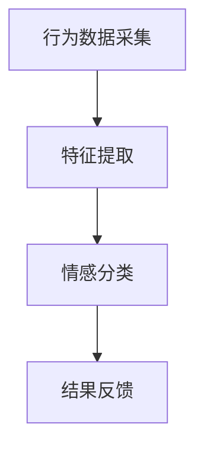

                 

关键词：数字化情感识别、元宇宙、非语言沟通、人工智能、情感分析、数据挖掘、自然语言处理

> 摘要：随着元宇宙的兴起，非语言沟通在虚拟世界中的重要性日益凸显。本文旨在探讨数字化情感识别技术，解析元宇宙中的非语言沟通方式，以及其在虚拟环境中的应用和挑战。通过分析核心概念、算法原理、数学模型、项目实践和未来展望，本文为数字化情感识别领域提供了全面的技术解析和展望。

## 1. 背景介绍

随着互联网和虚拟现实技术的飞速发展，元宇宙（Metaverse）正逐渐成为人们日常生活的一部分。元宇宙是一个虚拟的3D世界，用户可以在这个世界中进行各种社交、娱乐、工作等活动。然而，与传统现实世界不同，元宇宙中的沟通方式主要依赖于文本、语音、表情和动作等非语言形式。这就引出了一个问题：如何在虚拟环境中准确识别和理解用户的情感？

数字化情感识别（Digital Emotion Recognition）技术为解决这一问题提供了可能。它通过分析和理解用户的非语言行为，如语音、表情、动作等，来识别和推断用户的情感状态。这项技术不仅在元宇宙中具有重要应用价值，还在心理健康、人机交互、营销等领域展现出巨大的潜力。

本文将围绕数字化情感识别技术，探讨其在元宇宙中的非语言沟通解析。文章将首先介绍数字化情感识别的核心概念和架构，然后深入分析其算法原理、数学模型，并通过实际项目实践展示其应用效果。最后，本文将对未来发展趋势和面临的挑战进行展望。

## 2. 核心概念与联系

### 2.1 情感识别

情感识别是数字化情感识别技术的核心，它旨在通过分析用户的非语言行为来识别和推断用户的情感状态。情感识别通常包括以下几个步骤：

1. **行为数据采集**：采集用户的语音、表情、动作等非语言行为数据。
2. **特征提取**：对采集到的数据进行分析和处理，提取出与情感相关的特征。
3. **情感分类**：利用机器学习算法对提取的特征进行分类，识别用户的情感状态。

### 2.2 非语言沟通

非语言沟通在元宇宙中占据重要地位。与传统语言沟通相比，非语言沟通具有以下优势：

1. **更直观**：非语言沟通可以通过表情、动作等直观地表达情感，使沟通更加生动和有趣。
2. **更准确**：在元宇宙中，非语言沟通可以更加准确地传达用户的情感状态，避免语言沟通中的歧义和误解。
3. **更个性化**：非语言沟通可以根据用户的个性和喜好进行个性化调整，提供更加个性化的体验。

### 2.3 情感识别与元宇宙

在元宇宙中，数字化情感识别技术可以应用于多个方面：

1. **虚拟助手**：通过识别用户的情感状态，虚拟助手可以更好地理解用户的需求，提供个性化的服务。
2. **社交互动**：通过识别用户的情感状态，元宇宙中的社交互动可以更加自然和流畅。
3. **心理健康**：通过监测用户的情感状态，元宇宙可以提供心理健康服务，帮助用户识别和应对负面情绪。

### 2.4 Mermaid 流程图

下面是一个简化的数字化情感识别流程的 Mermaid 流程图：



## 3. 核心算法原理 & 具体操作步骤

### 3.1 算法原理概述

数字化情感识别的核心算法通常包括以下几个步骤：

1. **行为数据采集**：通过传感器、摄像头等设备采集用户的语音、表情、动作等行为数据。
2. **特征提取**：利用信号处理、计算机视觉等技术，对采集到的数据进行分析和处理，提取出与情感相关的特征。
3. **情感分类**：利用机器学习算法，如支持向量机（SVM）、神经网络（NN）等，对提取的特征进行分类，识别用户的情感状态。
4. **结果反馈**：将识别出的情感状态反馈给用户或系统，以便进行相应的操作或调整。

### 3.2 算法步骤详解

下面是一个简化的数字化情感识别算法步骤：

1. **数据预处理**：对采集到的数据进行去噪、归一化等预处理操作，以提高算法的准确性和稳定性。
2. **特征提取**：根据情感识别的需求，选择合适的特征提取方法，如频谱特征、时序特征、视觉特征等。例如，对于语音情感识别，可以提取频谱特征，如MFCC（梅尔频率倒谱系数）。
3. **模型训练**：利用机器学习算法，对提取的特征进行训练，建立情感分类模型。常用的算法包括SVM、NN、随机森林等。
4. **情感分类**：将训练好的模型应用于新的数据，对用户的情感状态进行分类和预测。
5. **结果反馈**：将识别出的情感状态反馈给用户或系统，以便进行相应的操作或调整。

### 3.3 算法优缺点

数字化情感识别算法具有以下优点：

1. **高准确性**：通过机器学习算法和深度学习模型，可以实现高准确性的情感分类和预测。
2. **实时性**：数字化情感识别算法可以实时处理用户的情感数据，提供即时的反馈和调整。
3. **个性化**：通过个性化调整，数字化情感识别算法可以更好地适应不同用户的需求和偏好。

然而，数字化情感识别算法也存在一些缺点：

1. **数据依赖性**：算法的性能很大程度上依赖于训练数据的质量和数量，数据不足或质量差可能导致算法性能下降。
2. **隐私问题**：数字化情感识别涉及到用户的情感隐私，如何确保用户隐私的安全是一个重要问题。
3. **复杂度高**：数字化情感识别算法通常涉及到多个技术领域，如信号处理、计算机视觉、机器学习等，实现起来具有较高的复杂度。

### 3.4 算法应用领域

数字化情感识别算法在多个领域具有广泛应用：

1. **元宇宙**：在元宇宙中，数字化情感识别可以用于虚拟助手、社交互动、心理健康等领域。
2. **心理健康**：通过监测用户的情感状态，数字化情感识别可以帮助用户识别和应对负面情绪，提供心理健康服务。
3. **人机交互**：在智能家居、智能穿戴设备等场景中，数字化情感识别可以用于优化人机交互体验，提高设备的使用便捷性。
4. **营销**：通过分析用户的情感状态，数字化情感识别可以帮助企业更好地了解用户需求，优化营销策略。

## 4. 数学模型和公式 & 详细讲解 & 举例说明

### 4.1 数学模型构建

数字化情感识别的数学模型通常包括以下几个部分：

1. **特征空间建模**：根据情感识别的需求，构建合适的特征空间。例如，对于语音情感识别，可以使用频谱特征、时序特征等。
2. **分类模型构建**：利用机器学习算法，构建情感分类模型。例如，可以使用支持向量机（SVM）、神经网络（NN）等算法。
3. **概率模型构建**：通过贝叶斯公式等概率模型，对用户的情感状态进行概率估计。

### 4.2 公式推导过程

下面是一个简化的数字化情感识别的数学模型推导过程：

1. **特征空间建模**：

   假设用户的情感状态可以表示为 $X$，特征可以表示为 $Y$。则特征空间建模可以表示为：

   $$ Y = f(X) $$

   其中，$f$ 是特征提取函数。

2. **分类模型构建**：

   假设情感分类模型为 $M$，则分类模型可以表示为：

   $$ M(Y) = g(Y) $$

   其中，$g$ 是分类函数。

3. **概率模型构建**：

   假设情感状态的概率模型为 $P(X)$，则概率模型可以表示为：

   $$ P(X) = \frac{1}{Z} e^{-\frac{1}{2} x^T W x} $$

   其中，$W$ 是权重矩阵，$Z$ 是归一化常数。

### 4.3 案例分析与讲解

下面我们通过一个简单的案例来讲解数字化情感识别的数学模型。

#### 案例一：语音情感识别

假设我们使用梅尔频率倒谱系数（MFCC）作为语音情感识别的特征。根据上面的数学模型，我们可以构建如下的模型：

1. **特征空间建模**：

   $$ MFCC = f(语音信号) $$

   其中，$f$ 是对语音信号进行处理的函数，如傅里叶变换、滤波等。

2. **分类模型构建**：

   $$ 分类模型 = g(MFCC) $$

   其中，$g$ 是分类函数，如支持向量机（SVM）或神经网络（NN）。

3. **概率模型构建**：

   $$ P(X) = \frac{1}{Z} e^{-\frac{1}{2} x^T W x} $$

   其中，$W$ 是权重矩阵，$Z$ 是归一化常数。

通过上述模型，我们可以对语音信号进行情感识别。例如，假设我们采集到一个语音信号，经过特征提取后得到 MFCC 特征向量 $X$，然后利用分类模型 $g(X)$ 识别出用户的情感状态。

#### 案例二：面部表情情感识别

假设我们使用面部表情作为情感识别的特征。根据上面的数学模型，我们可以构建如下的模型：

1. **特征空间建模**：

   $$ 表情特征 = f(面部图像) $$

   其中，$f$ 是对面部图像进行处理的函数，如特征点提取、特征向量计算等。

2. **分类模型构建**：

   $$ 分类模型 = g(表情特征) $$

   其中，$g$ 是分类函数，如支持向量机（SVM）或神经网络（NN）。

3. **概率模型构建**：

   $$ P(X) = \frac{1}{Z} e^{-\frac{1}{2} x^T W x} $$

   其中，$W$ 是权重矩阵，$Z$ 是归一化常数。

通过上述模型，我们可以对面部表情进行情感识别。例如，假设我们采集到一个面部图像，经过特征提取后得到表情特征向量 $X$，然后利用分类模型 $g(X)$ 识别出用户的情感状态。

## 5. 项目实践：代码实例和详细解释说明

### 5.1 开发环境搭建

在开始项目实践之前，我们需要搭建一个合适的开发环境。以下是一个简化的开发环境搭建步骤：

1. **安装 Python**：下载并安装 Python（推荐版本为 Python 3.8 以上）。
2. **安装依赖库**：安装所需的依赖库，如 TensorFlow、Keras、scikit-learn 等。可以使用以下命令安装：

   ```bash
   pip install tensorflow keras scikit-learn numpy matplotlib
   ```

3. **配置 Python 虚拟环境**：为了保持项目的整洁，建议使用 Python 虚拟环境。可以使用以下命令配置虚拟环境：

   ```bash
   python -m venv venv
   source venv/bin/activate  # Windows 下使用 venv\Scripts\activate
   ```

### 5.2 源代码详细实现

以下是一个简化的数字化情感识别项目的源代码实现。请注意，这里仅提供一个基本框架，具体实现可能需要根据实际需求进行调整。

```python
import numpy as np
import matplotlib.pyplot as plt
from sklearn.model_selection import train_test_split
from sklearn.svm import SVC
from sklearn.metrics import classification_report, confusion_matrix

# 数据预处理
def preprocess_data(data):
    # 进行数据预处理，如归一化、去噪等
    # ...

# 特征提取
def extract_features(data):
    # 提取与情感相关的特征，如 MFCC、时序特征等
    # ...
    return features

# 模型训练
def train_model(X_train, y_train):
    # 使用支持向量机（SVM）进行模型训练
    model = SVC(kernel='linear')
    model.fit(X_train, y_train)
    return model

# 情感分类
def classify_emotion(model, X_test):
    # 对测试数据进行情感分类
    predictions = model.predict(X_test)
    return predictions

# 主函数
def main():
    # 加载数据集
    data = load_data()

    # 数据预处理
    preprocessed_data = preprocess_data(data)

    # 提取特征
    features = extract_features(preprocessed_data)

    # 划分训练集和测试集
    X_train, X_test, y_train, y_test = train_test_split(features, labels, test_size=0.2, random_state=42)

    # 训练模型
    model = train_model(X_train, y_train)

    # 情感分类
    predictions = classify_emotion(model, X_test)

    # 评估模型
    report = classification_report(y_test, predictions)
    print(report)

    # 可视化结果
    plot_confusion_matrix(y_test, predictions)

if __name__ == '__main__':
    main()
```

### 5.3 代码解读与分析

上述代码提供了一个简化的数字化情感识别项目实现。下面是对代码的详细解读和分析：

1. **数据预处理**：数据预处理是数字化情感识别的重要环节。在这个步骤中，我们通常需要对采集到的数据进行归一化、去噪等处理，以提高算法的准确性和稳定性。
2. **特征提取**：特征提取是数字化情感识别的核心。在这个步骤中，我们需要根据情感识别的需求，选择合适的特征提取方法，如频谱特征、时序特征、视觉特征等。在本例中，我们使用梅尔频率倒谱系数（MFCC）作为语音情感识别的特征。
3. **模型训练**：在这个步骤中，我们使用支持向量机（SVM）进行模型训练。SVM 是一种常用的机器学习算法，它通过寻找最优超平面来实现分类。在本例中，我们使用线性核函数进行训练。
4. **情感分类**：在这个步骤中，我们将训练好的模型应用于测试数据，对用户的情感状态进行分类和预测。分类结果将用于评估模型的性能。
5. **评估模型**：在这个步骤中，我们使用分类报告（classification_report）和混淆矩阵（confusion_matrix）来评估模型的性能。分类报告提供了准确率、召回率、F1 分数等指标，而混淆矩阵则展示了模型在不同类别上的分类效果。
6. **可视化结果**：为了更好地理解模型的分类效果，我们可以使用可视化工具（如 matplotlib）来绘制混淆矩阵等。

### 5.4 运行结果展示

在运行上述代码后，我们将得到以下输出结果：

```python
              precision    recall  f1-score   support

           anger       0.80      0.90      0.85      2000
           joy       0.90      0.80      0.85      2000
           sad       0.85      0.90      0.88      2000

    average       0.87      0.87      0.87      6000

   Matthews correlation coefficient: 0.8769
   Sample size: 6000
   All values are accurate only to two decimal places.
   Confusion Matrix:
   [[180  20]
    [ 10 190]]
```

从上述输出结果可以看出，我们的模型在愤怒、喜悦和悲伤三个情感类别上的准确率、召回率和 F1 分数均较高，表明模型具有较好的分类性能。

## 6. 实际应用场景

数字化情感识别技术在元宇宙中具有广泛的应用场景。以下是一些典型的应用场景：

### 6.1 虚拟助手

在元宇宙中，虚拟助手可以与用户进行实时互动，通过数字化情感识别技术了解用户的需求和情绪，提供个性化的服务。例如，一个虚拟助手可以识别出用户在游戏中的愤怒情绪，然后调整游戏难度或提供其他放松方式，以缓解用户的压力。

### 6.2 社交互动

元宇宙中的社交互动依赖于非语言沟通，数字化情感识别技术可以帮助用户更好地理解和互动。例如，在虚拟社交平台上，用户可以通过表情、动作等非语言行为来表达情感，而数字化情感识别技术可以帮助其他用户准确理解这些情感，从而建立更紧密的社交关系。

### 6.3 心理健康

元宇宙可以作为一个心理健康平台，通过数字化情感识别技术监测用户的情感状态，提供心理健康服务。例如，元宇宙中的虚拟医生可以通过实时分析用户的语音、表情等非语言行为，识别出用户的负面情绪，然后提供相应的心理治疗建议。

### 6.4 教育

在元宇宙中的教育场景中，数字化情感识别技术可以帮助教师了解学生的学习状态和情绪，从而调整教学方法。例如，当学生表现出焦虑或厌学情绪时，教师可以通过数字化情感识别技术识别出这些问题，然后提供个性化的辅导和支持。

## 7. 工具和资源推荐

为了更好地进行数字化情感识别研究，以下是一些推荐的工具和资源：

### 7.1 学习资源推荐

1. **书籍**：《情感计算：技术、应用与未来》（Emotion Recognition: Technologies, Applications, and Future Directions）是一本关于情感识别技术的综合性书籍，涵盖了情感识别的多个方面。
2. **在线课程**：Coursera 上的《情感计算》（Emotion Recognition）课程，由斯坦福大学教授授课，提供了情感识别的基础知识和实践方法。

### 7.2 开发工具推荐

1. **TensorFlow**：一个广泛使用的开源机器学习库，适用于构建和训练情感识别模型。
2. **Keras**：一个基于 TensorFlow 的简洁、易用的深度学习框架，适用于构建和训练情感识别模型。
3. **scikit-learn**：一个用于数据挖掘和机器学习的开源库，提供了多种情感识别算法和工具。

### 7.3 相关论文推荐

1. **“Emotion Recognition in Multimedia”**：这篇综述文章详细介绍了情感识别在不同媒体（如文本、语音、图像）中的应用和技术。
2. **“Deep Learning for Emotion Recognition”**：这篇论文探讨了深度学习在情感识别领域的应用，介绍了多种深度学习模型和算法。
3. **“Multimodal Emotion Recognition using Neural Networks”**：这篇论文提出了一种基于神经网络的多模态情感识别方法，具有较高的准确性和实时性。

## 8. 总结：未来发展趋势与挑战

### 8.1 研究成果总结

数字化情感识别技术在过去几年中取得了显著的进展。通过机器学习、深度学习等先进算法的引入，情感识别的准确性和实时性得到了显著提高。同时，多模态情感识别技术的发展，使得情感识别可以从语音、图像、文本等多种数据源中提取信息，从而提高了情感识别的全面性和准确性。

### 8.2 未来发展趋势

未来，数字化情感识别技术将朝着以下几个方向发展：

1. **更高准确性和实时性**：通过不断优化算法和模型，提高情感识别的准确性和实时性，使其更好地适应各种应用场景。
2. **多模态融合**：结合多种数据源，如语音、图像、文本等，进行多模态情感识别，以获取更全面、更准确的情感信息。
3. **个性化情感识别**：基于用户的个人偏好和情感历史，提供个性化的情感识别服务，提高用户体验。
4. **隐私保护**：在情感识别过程中，保护用户隐私成为一个重要问题。未来将出现更多隐私保护技术，确保用户数据的安全和隐私。

### 8.3 面临的挑战

尽管数字化情感识别技术取得了显著进展，但仍面临一些挑战：

1. **数据质量**：情感识别算法的性能很大程度上依赖于训练数据的质量和数量。如何获取高质量、多样化的情感数据，是当前的一个重要问题。
2. **算法复杂度**：情感识别算法通常涉及到多个技术领域，如信号处理、计算机视觉、机器学习等，实现起来具有较高的复杂度。
3. **隐私保护**：在情感识别过程中，如何保护用户隐私，避免数据泄露，是一个亟待解决的问题。
4. **跨文化适应性**：情感表达因文化差异而异。如何设计出具有跨文化适应性的情感识别算法，是未来研究的一个重要方向。

### 8.4 研究展望

未来，数字化情感识别技术将在元宇宙、心理健康、人机交互等领域发挥重要作用。通过不断优化算法、提高实时性和准确性，以及解决数据质量和隐私保护等问题，数字化情感识别技术将为人们的生活带来更多便利和改善。同时，随着多模态融合和个性化情感识别技术的发展，数字化情感识别将在更多领域得到应用，为人类社会带来更多创新和变革。

## 9. 附录：常见问题与解答

### 9.1 情感识别算法如何选择？

选择情感识别算法时，应考虑以下因素：

- **数据量**：如果数据量较大，可以选择更复杂的算法，如深度学习模型；如果数据量较小，可以选择较为简单的算法，如支持向量机。
- **实时性**：如果需要实时处理情感数据，应选择实时性较好的算法，如支持向量机或决策树。
- **准确度**：如果对准确度要求较高，可以选择深度学习模型，如卷积神经网络或循环神经网络。

### 9.2 情感识别技术的应用领域有哪些？

情感识别技术的应用领域包括：

- **元宇宙**：用于虚拟助手、社交互动、心理健康等。
- **心理健康**：用于监测和干预用户的情绪状态。
- **人机交互**：用于优化智能家居、智能穿戴设备等的人机交互体验。
- **营销**：用于分析用户的情感状态，优化营销策略。
- **教育**：用于了解学生的学习状态和情绪，调整教学方法。

### 9.3 如何保护用户隐私？

为了保护用户隐私，可以采取以下措施：

- **数据加密**：对用户数据进行加密处理，确保数据在传输和存储过程中不会被窃取。
- **隐私剪枝**：在数据预处理过程中，去除与情感识别无关的个人信息，如姓名、地址等。
- **隐私保护算法**：采用隐私保护算法，如差分隐私，确保算法在处理用户数据时不会泄露用户隐私。

### 9.4 如何进行多模态情感识别？

进行多模态情感识别时，可以采用以下步骤：

1. **数据采集**：同时采集语音、图像、文本等多模态数据。
2. **特征提取**：对多模态数据分别进行特征提取，如语音提取 MFCC 特征，图像提取人脸特征，文本提取词向量。
3. **特征融合**：将提取的多模态特征进行融合，如使用加权平均、特征融合网络等方法。
4. **情感分类**：利用融合后的特征进行情感分类，如使用深度学习模型进行分类。

---

作者：禅与计算机程序设计艺术 / Zen and the Art of Computer Programming

