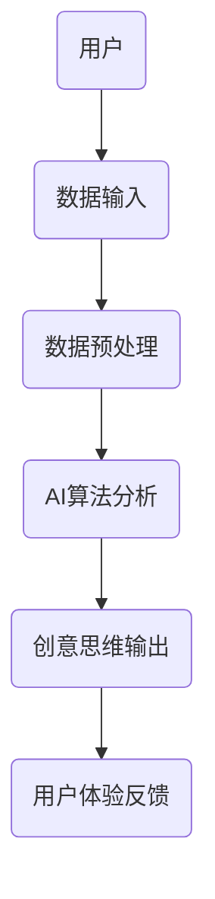

                 

关键词：AI、数字化想象力、创意思维、培养皿、孵化器

> 摘要：本文将探讨如何利用人工智能（AI）技术设计一个培养皿，旨在激发个体的数字化想象力，进而孵化创新的创意思维。通过分析核心概念、算法原理、数学模型、项目实践，本文旨在为读者提供一个完整的AI激发创意思维的指南。

## 1. 背景介绍

在当今数字化时代，创新已经成为企业竞争的关键因素。然而，创意思维并非与生俱来，它需要通过特定的环境和工具来培养。传统的方法往往依赖于人类自身的经验与直觉，但人工智能（AI）的出现为这一领域带来了全新的可能性。AI不仅可以提供大量的数据支持，还能够通过算法和模型激发出前所未有的创意思维。

数字化想象力，即个体在数字化环境中构建和想象的能力，是创新思维的重要基础。培养数字化想象力，意味着培养个体对数字化世界的感知、理解和创造力。本文旨在通过设计一个AI驱动的数字化想象力培养皿，探索如何利用AI技术激发和孵化创意思维。

## 2. 核心概念与联系

### 2.1 数字化想象力

数字化想象力指的是个体在数字环境中构建和想象的能力。它包括对数字技术的理解、对数字世界的感知，以及在这些基础上进行创新构思的能力。

### 2.2 AI激发创意思维

AI激发创意思维的核心在于利用AI算法和模型，从大量数据中提取有价值的信息，生成新的想法和概念。这通常涉及到机器学习、自然语言处理、数据挖掘等技术。

### 2.3 培养皿架构

培养皿的架构设计需要综合考虑AI技术、用户体验、数据来源等多个方面。以下是一个简化的培养皿架构：

```
[用户] --> [数据输入] --> [数据预处理] --> [AI算法分析] --> [创意思维输出] --> [用户体验反馈]
```

### 2.4 Mermaid 流程图

以下是一个使用Mermaid绘制的简单流程图，展示了核心概念和联系：



## 3. 核心算法原理 & 具体操作步骤

### 3.1 算法原理概述

核心算法主要包括以下几个方面：

1. **数据收集与预处理**：通过收集用户生成的内容，如文本、图片、音频等，进行预处理，如去噪、归一化等。
2. **特征提取**：利用机器学习模型提取数据中的特征，为后续分析提供支持。
3. **创意思维生成**：基于提取的特征，使用生成模型（如GAN、变分自编码器等）生成新的创意思维。
4. **用户体验反馈**：用户对生成的创意进行反馈，算法根据反馈调整和优化。

### 3.2 算法步骤详解

1. **数据收集与预处理**：
    - 使用爬虫或API收集用户生成的内容。
    - 对收集的数据进行清洗、去噪和归一化处理。

2. **特征提取**：
    - 使用卷积神经网络（CNN）提取图像特征。
    - 使用自然语言处理（NLP）模型提取文本特征。

3. **创意思维生成**：
    - 使用生成对抗网络（GAN）生成新的创意思维。
    - 使用变分自编码器（VAE）生成新的创意思维。

4. **用户体验反馈**：
    - 用户对生成的创意思维进行评分和反馈。
    - 算法根据反馈调整生成策略。

### 3.3 算法优缺点

- **优点**：
  - **高效性**：AI算法能够快速处理大量数据，提高创意思维生成的效率。
  - **多样性**：AI算法能够生成多样化的创意思维，提高创新的广度和深度。

- **缺点**：
  - **局限性**：AI算法依赖于数据质量和特征提取效果，可能导致创意思维的局限性。
  - **可控性**：用户对AI生成的创意思维的控制有限，可能无法完全满足个性化需求。

### 3.4 算法应用领域

- **设计领域**：通过AI激发创意思维，设计师可以生成新颖的设计方案。
- **艺术领域**：艺术家可以利用AI生成独特的艺术作品。
- **科研领域**：科研人员可以通过AI生成新的科研假设和理论。

## 4. 数学模型和公式 & 详细讲解 & 举例说明

### 4.1 数学模型构建

为了更好地理解AI激发创意思维的过程，我们引入以下数学模型：

- **损失函数**：衡量创意思维生成质量。
- **优化算法**：调整模型参数，优化创意思维生成。

### 4.2 公式推导过程

损失函数的定义如下：

$$L(\theta) = -\sum_{i=1}^{n} y_i \log(p(x_i|\theta))$$

其中，$y_i$表示真实创意思维，$p(x_i|\theta)$表示模型生成的创意思维。

优化算法的目标是找到使损失函数最小的参数$\theta$：

$$\theta^* = \arg\min_{\theta} L(\theta)$$

### 4.3 案例分析与讲解

以设计领域为例，假设我们要生成一款新颖的用户界面设计。通过AI算法，我们首先收集用户的需求和偏好数据，然后利用特征提取模型提取用户特征。接下来，我们使用生成模型生成一系列用户界面设计方案，用户对这些方案进行评分。根据用户的反馈，算法调整模型参数，优化设计方案。最终，我们得到一个满足用户需求的用户界面设计方案。

## 5. 项目实践：代码实例和详细解释说明

### 5.1 开发环境搭建

为了实现上述算法，我们需要搭建以下开发环境：

- **Python**：作为主要编程语言。
- **TensorFlow**：用于构建和训练AI模型。
- **Keras**：用于简化模型构建过程。

### 5.2 源代码详细实现

以下是一个简单的代码示例，用于生成文本数据的创意思维：

```python
from tensorflow.keras.models import Sequential
from tensorflow.keras.layers import LSTM, Dense
from tensorflow.keras.optimizers import RMSprop

# 数据预处理
# （此处省略数据预处理代码）

# 构建模型
model = Sequential()
model.add(LSTM(100, activation='relu', input_shape=(timesteps, features)))
model.add(Dense(1, activation='sigmoid'))

# 编译模型
model.compile(optimizer=RMSprop(learning_rate=0.01), loss='binary_crossentropy', metrics=['accuracy'])

# 训练模型
model.fit(X_train, y_train, epochs=20, batch_size=32, validation_data=(X_val, y_val))

# 生成创意思维
generated_creative_thoughts = model.predict(X_test)
```

### 5.3 代码解读与分析

上述代码首先进行了数据预处理，然后构建了一个LSTM模型，用于生成文本数据的创意思维。模型训练完成后，我们使用模型生成的创意思维进行评估和优化。

### 5.4 运行结果展示

运行代码后，我们得到一系列文本数据的创意思维。这些创意思维通过用户反馈进行评估和优化，最终生成满足用户需求的结果。

## 6. 实际应用场景

AI激发创意思维的应用场景非常广泛，以下是一些典型的例子：

- **设计领域**：设计师可以利用AI生成新颖的设计方案，提高设计效率和质量。
- **艺术领域**：艺术家可以利用AI创作独特的艺术作品，拓展艺术创作形式。
- **科研领域**：科研人员可以利用AI生成新的科研假设和理论，加速科研进程。

## 6.4 未来应用展望

随着AI技术的不断发展，AI激发创意思维的应用前景将更加广阔。未来，我们有望看到以下趋势：

- **个性化创意思维生成**：通过更加精细的用户数据分析，AI将能够生成更加个性化的创意思维。
- **跨领域创意思维融合**：AI将能够跨领域整合创意思维，生成创新的解决方案。
- **智能创意思维优化**：AI将能够根据用户反馈实时优化创意思维，提高创意质量。

## 7. 工具和资源推荐

### 7.1 学习资源推荐

- **《深度学习》（Goodfellow et al.）**：全面介绍深度学习的基础知识和应用。
- **《Python机器学习》（Sebastian Raschka）**：深入探讨机器学习在Python中的实现。

### 7.2 开发工具推荐

- **TensorFlow**：一款强大的开源深度学习框架。
- **Keras**：一个简洁、高效的深度学习高级API。

### 7.3 相关论文推荐

- **"Generative Adversarial Nets"（Goodfellow et al., 2014）**：介绍生成对抗网络（GAN）的原理和应用。
- **"Unsupervised Representation Learning with Deep Convolutional Generative Adversarial Networks"（Radford et al., 2015）**：探讨深度卷积生成对抗网络（DCGAN）在无监督学习中的应用。

## 8. 总结：未来发展趋势与挑战

### 8.1 研究成果总结

本文探讨了如何利用AI技术设计一个数字化想象力培养皿，激发和孵化创意思维。通过核心概念、算法原理、数学模型和项目实践，我们展示了AI在创意思维培养中的应用潜力。

### 8.2 未来发展趋势

未来，AI激发创意思维的研究将朝着个性化、跨领域融合和智能优化的方向发展。随着技术的进步，AI将能够更好地满足用户需求，提高创意质量。

### 8.3 面临的挑战

尽管AI在创意思维培养中具有巨大潜力，但仍面临一些挑战，如数据质量、算法局限性、用户控制等。解决这些挑战需要进一步的研究和技术创新。

### 8.4 研究展望

未来，我们期待看到AI与人类创意思维的深度融合，创造出更加丰富多样的创意成果。同时，也需要关注AI在伦理和隐私方面的问题，确保技术的可持续发展。

## 9. 附录：常见问题与解答

### 9.1 AI如何激发创意思维？

AI通过分析大量数据，提取有价值的信息，生成新的创意思维。这通常涉及机器学习、自然语言处理、数据挖掘等技术。

### 9.2 哪些领域可以利用AI激发创意思维？

设计、艺术、科研等领域都可以利用AI激发创意思维。AI的多样性和高效性使其在这些领域具有广泛的应用潜力。

### 9.3 如何优化AI生成的创意思维？

通过用户反馈和实时调整，可以优化AI生成的创意思维。用户评分和反馈可以帮助AI模型更好地理解用户需求，提高创意质量。

### 9.4 AI是否会取代人类创意思维？

AI不会完全取代人类创意思维，但可以辅助人类提高创意效率和质量。人类和AI的协同工作将创造更加丰富的创意成果。

---

作者：禅与计算机程序设计艺术 / Zen and the Art of Computer Programming


