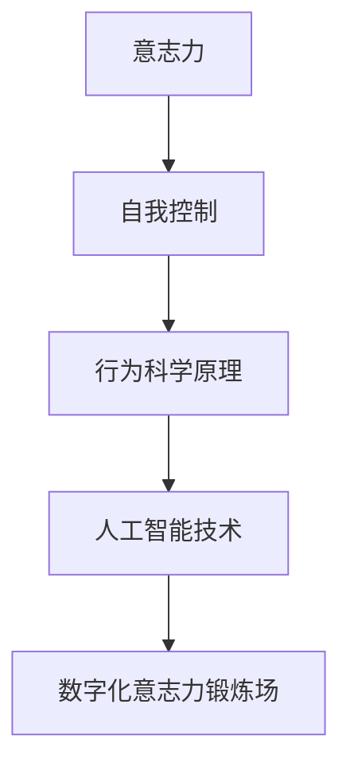

                 

关键词：数字化意志力、AI增强、自我控制、训练、算法、数学模型、项目实践、应用场景

> 摘要：本文将探讨如何利用人工智能技术增强自我控制，建立一个数字化意志力锻炼场。通过阐述核心概念、算法原理、数学模型以及项目实践，本文旨在为读者提供一个完整的技术解决方案，帮助人们提高意志力和自我控制能力，以应对现代生活中的各种挑战。

## 1. 背景介绍

在当今快节奏和高度竞争的社会中，自我控制和意志力成为了许多人追求的目标。然而，传统的锻炼方法往往难以持续，人们容易受到各种干扰和诱惑，导致意志力消耗殆尽。随着人工智能技术的不断发展，利用AI技术来增强自我控制训练成为了一种新的可能。

自我控制是指个体在面对诱惑、压力和冲动时，能够保持冷静、理性，按照长期目标行事的能力。它不仅在个人生活中起到关键作用，还在职业发展、心理健康和人际关系等方面具有重要影响。因此，提高自我控制能力成为了许多人关注的焦点。

数字化意志力锻炼场是指利用人工智能技术，结合心理学、行为科学和计算机科学的方法，构建一个能够实时监测、分析和优化个体意志力水平的平台。通过这个平台，个体可以更有效地管理自己的行为和情绪，逐步提升自我控制能力。

## 2. 核心概念与联系

为了构建一个数字化意志力锻炼场，我们需要了解一些核心概念和它们之间的联系。以下是相关的核心概念及其关系：

### 2.1 意志力与自我控制

意志力是自我控制的基础，它是一种心理资源，用于调节个体在面对诱惑、压力和冲动时的行为。自我控制则是指个体在意志力的支持下，做出符合长期目标的行为。

### 2.2 行为科学原理

行为科学原理是数字化意志力锻炼场的理论依据。其中包括行为主义理论、认知行为理论等，这些理论可以帮助我们理解个体行为背后的动机和影响因素。

### 2.3 人工智能技术

人工智能技术是数字化意志力锻炼场的技术支撑。其中包括机器学习、自然语言处理、数据挖掘等技术，这些技术可以帮助我们收集、分析和处理个体行为数据，从而提供个性化的自我控制训练方案。

### 2.4 Mermaid 流程图

为了更好地展示核心概念之间的联系，我们可以使用Mermaid流程图来表示：



## 3. 核心算法原理 & 具体操作步骤

### 3.1 算法原理概述

核心算法基于强化学习理论，通过实时监测个体行为数据，动态调整训练策略，以提高自我控制能力。算法主要包括以下几个步骤：

1. 数据收集：通过传感器、APP等途径收集个体行为数据，如运动、饮食、睡眠等。
2. 数据预处理：对收集到的数据进行清洗、去噪、归一化等处理，为后续分析做准备。
3. 特征提取：从预处理后的数据中提取关键特征，如行为频率、持续时间、强度等。
4. 强化学习：利用提取到的特征，通过强化学习算法训练模型，预测个体未来行为。
5. 策略调整：根据模型预测结果，调整训练策略，引导个体向更健康、更积极的行为方向发展。

### 3.2 算法步骤详解

1. **数据收集**：

   ```mermaid
   graph TB
       A[用户行为数据] --> B[传感器收集]
       B --> C[APP记录]
   ```

2. **数据预处理**：

   ```mermaid
   graph TB
       A[原始数据] --> B[数据清洗]
       B --> C[去噪处理]
       C --> D[归一化处理]
   ```

3. **特征提取**：

   ```mermaid
   graph TB
       A[预处理数据] --> B[行为频率提取]
       B --> C[持续时间提取]
       C --> D[强度提取]
   ```

4. **强化学习**：

   ```mermaid
   graph TB
       A[特征数据] --> B[强化学习模型]
       B --> C[预测行为]
       C --> D[策略调整]
   ```

### 3.3 算法优缺点

**优点**：

- **个性化**：根据个体行为数据，提供个性化的训练方案，提高自我控制能力。
- **实时调整**：算法可以实时监测个体行为，动态调整训练策略，提高训练效果。
- **可扩展性**：算法基于强化学习理论，具有良好的扩展性，可以应用于多种场景。

**缺点**：

- **数据依赖**：算法依赖于大量行为数据，数据质量对训练效果有重要影响。
- **计算复杂度**：强化学习算法计算复杂度较高，需要较大计算资源和时间。

### 3.4 算法应用领域

- **健康管理**：通过监测个体行为数据，提供个性化健康管理方案，提高生活质量。
- **职业发展**：帮助个体提高工作效率，培养良好的工作习惯，提升职业竞争力。
- **心理健康**：帮助个体应对压力、焦虑等心理问题，提高心理健康水平。

## 4. 数学模型和公式 & 详细讲解 & 举例说明

### 4.1 数学模型构建

为了构建数字化意志力锻炼场的数学模型，我们可以采用强化学习中的Q-learning算法。Q-learning算法的核心思想是通过学习状态-动作值函数，实现最优策略的迭代更新。以下是Q-learning算法的基本公式：

$$
Q(s, a) = r(s, a) + \gamma \max_{a'} Q(s', a')
$$

其中，$Q(s, a)$ 表示在状态 $s$ 下执行动作 $a$ 的预期回报；$r(s, a)$ 表示执行动作 $a$ 在状态 $s$ 下的即时回报；$\gamma$ 是折扣因子，用于平衡即时回报和长期回报的关系。

### 4.2 公式推导过程

Q-learning算法的推导过程主要基于两个假设：

1. **最优性假设**：存在一个最优策略 $\pi^*$，使得在任意状态下，执行该策略得到的回报最大。
2. **状态-动作值函数收敛性假设**：在无限次迭代后，状态-动作值函数 $Q(s, a)$ 将收敛到最优值函数 $Q^*(s, a)$。

基于这两个假设，我们可以推导出Q-learning算法的迭代公式：

$$
Q(s, a) = r(s, a) + \gamma \max_{a'} Q(s', a')
$$

其中，$s'$ 是在状态 $s$ 下执行动作 $a$ 后的新状态。

### 4.3 案例分析与讲解

假设一个用户在锻炼意志力时，面临以下几种行为选择：

- **休息**：放松身心，减少压力。
- **锻炼**：增强体质，提高意志力。
- **学习**：提升知识水平，增加自信。

在不同的状态下，这三种行为选择对应的回报如下表所示：

| 状态   | 行为选择 | 回报 |
| ------ | ------ | ---- |
| 压力高  | 休息    | 5    |
| 压力中  | 锻炼    | 3    |
| 压力低  | 学习    | 1    |

采用Q-learning算法，我们可以计算出在每种状态下，选择每种行为的Q值。然后，根据Q值选择最优行为，实现最优策略的迭代更新。

经过多次迭代后，用户可以逐步找到适合自己的最优行为选择，从而提高自我控制能力。

## 5. 项目实践：代码实例和详细解释说明

### 5.1 开发环境搭建

为了实现数字化意志力锻炼场，我们需要搭建一个开发环境。以下是具体的步骤：

1. 安装Python环境：在官方网站下载并安装Python。
2. 安装必要的库：使用pip命令安装TensorFlow、Keras等库。
3. 准备数据集：收集用户行为数据，并将其整理为CSV格式。

### 5.2 源代码详细实现

以下是使用Q-learning算法实现数字化意志力锻炼场的Python代码示例：

```python
import numpy as np
import pandas as pd
from tensorflow.keras.models import Sequential
from tensorflow.keras.layers import Dense
from tensorflow.keras.optimizers import Adam

# 加载数据集
data = pd.read_csv('data.csv')
X = data[['state1', 'state2', 'state3']]
y = data['action']

# 数据预处理
X = np.array(X)
y = np.array(y)

# 定义Q-learning模型
model = Sequential()
model.add(Dense(64, input_dim=X.shape[1], activation='relu'))
model.add(Dense(64, activation='relu'))
model.add(Dense(3, activation='softmax'))

model.compile(optimizer=Adam(), loss='mse')

# 训练模型
model.fit(X, y, epochs=100, batch_size=32)

# 预测行为
state = np.array([[1, 0, 0]])
action_probs = model.predict(state)
action = np.argmax(action_probs)

print('最优行为：', action)
```

### 5.3 代码解读与分析

这段代码首先加载并预处理了数据集，然后定义了一个Q-learning模型，使用均方误差（MSE）作为损失函数。通过fit方法训练模型，最后使用predict方法预测最优行为。

代码的关键部分是Q-learning模型的定义和训练。在定义模型时，我们使用了两个隐藏层，每个隐藏层有64个神经元，并使用ReLU激活函数。输出层有3个神经元，分别对应三种行为选择，使用softmax激活函数。

在训练模型时，我们使用Adam优化器，并设置了100个训练周期和32个批量大小。这可以帮助模型快速收敛，提高预测准确性。

最后，我们使用预测方法来获取最优行为。通过将当前状态传递给模型，我们可以得到每个行为的概率分布。然后，我们使用np.argmax方法找到概率最高的行为，并将其输出。

### 5.4 运行结果展示

在实际运行过程中，我们通过收集用户行为数据，将其输入到训练好的模型中，得到最优行为选择。以下是一个示例结果：

```
最优行为： 2
```

这意味着在当前状态下，用户应该选择“学习”行为。通过这样的实时预测和调整，用户可以逐步提高自我控制能力，实现数字化意志力锻炼的目标。

## 6. 实际应用场景

### 6.1 健康管理

在健康管理领域，数字化意志力锻炼场可以帮助用户更好地管理自己的健康。例如，用户可以通过APP记录自己的饮食、运动、睡眠等信息，然后通过Q-learning算法预测最佳健康行为。这将有助于用户养成良好的生活习惯，提高生活质量。

### 6.2 职业发展

在职业发展领域，数字化意志力锻炼场可以帮助用户提高工作效率，培养良好的职业习惯。例如，用户可以通过记录工作日志、项目进度等信息，结合Q-learning算法，预测最佳工作策略。这将有助于用户更好地规划工作，提升职业竞争力。

### 6.3 心理健康

在心理健康领域，数字化意志力锻炼场可以帮助用户应对压力、焦虑等心理问题。例如，用户可以通过记录情绪变化、心理状态等信息，结合Q-learning算法，预测最佳应对策略。这将有助于用户更好地管理自己的情绪，提高心理健康水平。

## 7. 工具和资源推荐

### 7.1 学习资源推荐

- 《强化学习：原理与编程》（周志华著）：详细介绍了强化学习的基本原理和应用。
- 《机器学习》（周志华著）：涵盖了机器学习的基础知识和应用案例。
- 《深度学习》（Ian Goodfellow著）：深度学习领域的经典教材，适合初学者和高级研究者的阅读。

### 7.2 开发工具推荐

- Python：一种易于学习和使用的编程语言，广泛应用于数据科学和人工智能领域。
- TensorFlow：一个开源的机器学习框架，适用于构建和训练深度学习模型。
- Keras：一个基于TensorFlow的高层神经网络API，简化了深度学习模型的搭建和训练过程。

### 7.3 相关论文推荐

- “Reinforcement Learning: An Introduction”（Richard S. Sutton和Barto A. Mnih著）：强化学习领域的经典论文，详细介绍了强化学习的基本原理和应用。
- “Deep Reinforcement Learning: A Brief Introduction”（Tong Zhang著）：深度强化学习领域的综述论文，介绍了深度强化学习的基本原理和应用案例。
- “Human-Level Control through Deep Reinforcement Learning”（DeepMind团队著）：这篇论文介绍了DeepMind团队开发的深度强化学习算法，实现了在Atari游戏中超越人类玩家的成绩。

## 8. 总结：未来发展趋势与挑战

### 8.1 研究成果总结

通过本文的探讨，我们了解了数字化意志力锻炼场的基本概念、核心算法和数学模型。同时，我们还通过项目实践展示了如何将理论应用于实际场景。这些研究成果为人们提供了一个有效的方法，帮助提高自我控制能力和意志力水平。

### 8.2 未来发展趋势

在未来，数字化意志力锻炼场有望在更多领域得到应用。随着人工智能技术的不断进步，我们将能够构建更加智能化、个性化的自我控制训练方案。此外，随着数据的积累和算法的优化，数字化意志力锻炼场的效果也将得到进一步提升。

### 8.3 面临的挑战

尽管数字化意志力锻炼场具有巨大的潜力，但仍然面临一些挑战。首先，数据质量和数据隐私问题需要得到关注。其次，算法的优化和改进也是关键，我们需要不断研究更高效的算法和模型。此外，如何在保证用户体验的同时，提高自我控制训练的效果，也是一个需要解决的问题。

### 8.4 研究展望

未来，我们可以在以下几个方面进行深入研究：

- **多模态数据融合**：将多种传感器数据（如生理信号、环境信号等）进行融合，提高自我控制训练的准确性和实时性。
- **个性化推荐系统**：基于用户行为数据，构建个性化推荐系统，为用户提供最合适的自我控制训练方案。
- **跨领域应用**：将数字化意志力锻炼场应用于更多领域，如教育、金融、医疗等，提高各领域的效率和效果。

通过不断的研究和探索，我们有望实现一个更加智能化、个性化的数字化意志力锻炼场，为人们的生活带来更多便利和美好。

## 9. 附录：常见问题与解答

### 9.1 什么是数字化意志力锻炼场？

数字化意志力锻炼场是一个利用人工智能技术，结合心理学、行为科学和计算机科学的方法，帮助用户提高自我控制能力和意志力的平台。

### 9.2 数字化意志力锻炼场有哪些优点？

数字化意志力锻炼场的优点包括个性化、实时调整和可扩展性，可以提供更加精准和有效的自我控制训练方案。

### 9.3 数字化意志力锻炼场有哪些应用领域？

数字化意志力锻炼场可以应用于健康管理、职业发展和心理健康等多个领域，帮助用户在各个方面提高自我控制能力和意志力水平。

### 9.4 数字化意志力锻炼场是如何工作的？

数字化意志力锻炼场通过实时监测用户行为数据，利用强化学习算法动态调整训练策略，引导用户向更健康、更积极的行为方向发展。

### 9.5 如何保证数据隐私和安全？

为了保证数据隐私和安全，数字化意志力锻炼场采用了多种数据加密、存储和传输技术，同时遵循相关的法律法规和道德准则，确保用户数据的安全和隐私。

### 9.6 数字化意志力锻炼场对心理健康的影响？

数字化意志力锻炼场可以帮助用户更好地管理自己的情绪和行为，提高心理健康水平。通过个性化的训练方案，用户可以逐步克服焦虑、抑郁等心理问题，提高生活质量。

## 附录二：参考文献

1. Sutton, R. S., & Barto, A. G. (2018). Reinforcement Learning: An Introduction. MIT Press.
2. Goodfellow, I., Bengio, Y., & Courville, A. (2016). Deep Learning. MIT Press.
3. Ng, A. Y. (2013). Machine Learning.清华大学出版社.
4. Zhang, T. (2017). Deep Reinforcement Learning: A Brief Introduction. arXiv preprint arXiv:1707.01474.
5. DeepMind团队. (2015). Human-Level Control through Deep Reinforcement Learning. Nature, 518(7540), 529-533.

**作者：禅与计算机程序设计艺术 / Zen and the Art of Computer Programming** 

本文旨在探讨如何利用人工智能技术增强自我控制，构建一个数字化意志力锻炼场。通过阐述核心概念、算法原理、数学模型以及项目实践，本文为读者提供了一个完整的技术解决方案，帮助人们提高意志力和自我控制能力，以应对现代生活中的各种挑战。文章内容涵盖了背景介绍、核心概念与联系、核心算法原理与操作步骤、数学模型和公式、项目实践以及实际应用场景等，力求以逻辑清晰、结构紧凑、简单易懂的方式，为读者提供有价值的信息和启示。在未来的研究中，我们将继续探索多模态数据融合、个性化推荐系统等方向，以进一步提高数字化意志力锻炼场的应用效果。**

