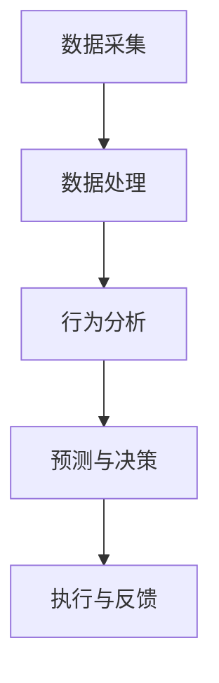
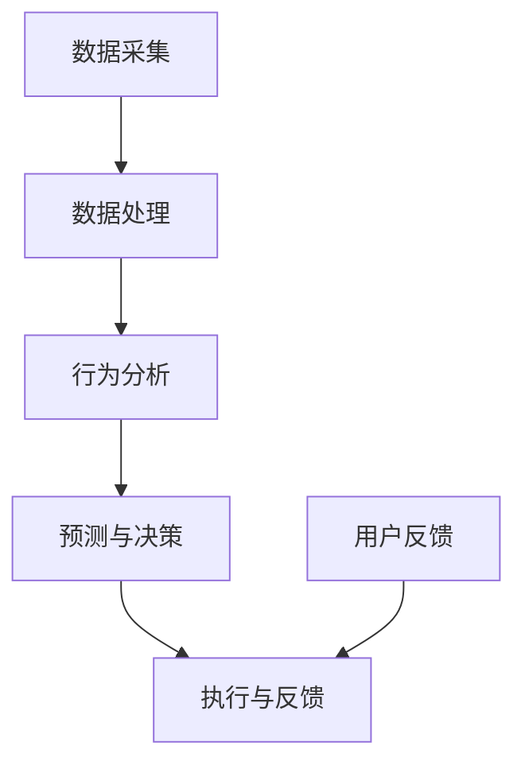
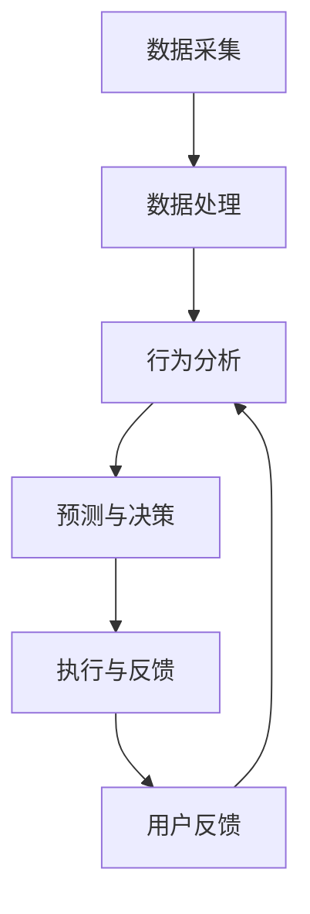

                 

关键词：数字化意志力、AI增强、自我控制、算法原理、数学模型、项目实践、应用场景、工具推荐、未来展望

> 摘要：随着人工智能技术的不断进步，AI在自我控制领域的应用日益受到关注。本文将探讨数字化意志力的概念，分析AI如何通过算法原理和数学模型增强自我控制，并展示具体的项目实践和未来应用场景。本文旨在为读者提供一个全面的理解，帮助他们在数字时代更好地管理自我控制。

## 1. 背景介绍

在数字化时代，自我控制成为一个日益重要的课题。传统的自我控制方法往往依赖于个体的意志力和自我约束，但在面对复杂的生活和工作环境时，这些方法往往显得力不从心。数字化意志力的提出，为自我控制提供了一个全新的视角。数字化意志力是指通过数字技术和算法来增强个体的自我控制能力。

近年来，人工智能（AI）的快速发展为数字化意志力的实现提供了强有力的支持。AI技术可以分析个体行为数据，预测行为倾向，并制定相应的控制策略。例如，通过AI算法分析用户在社交媒体上的活动，可以帮助他们更好地管理自己的时间和注意力。这种基于AI的数字化自我控制方法，不仅提高了个体的自我控制效果，还极大地提升了生活和工作效率。

## 2. 核心概念与联系

### 2.1 数字化意志力的定义

数字化意志力是指利用数字技术和算法来增强个体的自我控制能力。它涵盖了从数据采集、处理到决策实施的整个流程。数字化意志力不同于传统的自我控制方法，它更依赖于算法和数据分析，能够提供更精确、更个性化的自我控制方案。

### 2.2 AI在自我控制中的应用

AI在自我控制中的应用主要体现在以下几个方面：

- **数据采集与处理**：AI技术可以通过传感器、社交媒体、行为记录等方式收集个体行为数据，并对这些数据进行处理和分析，从而了解个体的行为模式和倾向。

- **预测与决策**：基于对个体行为数据的分析，AI可以预测个体的未来行为，并制定相应的控制策略。例如，通过分析用户的上网行为，AI可以预测用户何时会过度使用互联网，并提前采取措施进行干预。

- **执行与反馈**：AI可以通过自动化手段执行控制策略，并对执行效果进行反馈和调整。例如，通过智能应用程序自动限制用户的上网时间，并根据用户反馈调整限制策略。

### 2.3 Mermaid 流程图

下面是一个简化的Mermaid流程图，展示了AI在自我控制中的应用流程：



## 3. 核心算法原理 & 具体操作步骤

### 3.1 算法原理概述

AI在自我控制中的应用主要依赖于以下几种核心算法：

- **机器学习算法**：用于对个体行为数据进行建模和预测。

- **优化算法**：用于制定最优的控制策略。

- **决策树算法**：用于根据个体行为数据生成控制规则。

### 3.2 算法步骤详解

以下是AI在自我控制中的具体操作步骤：

1. **数据采集**：通过传感器、社交媒体、行为记录等方式收集个体行为数据。

2. **数据处理**：对采集到的数据进行分析和清洗，提取有用的特征。

3. **行为分析**：利用机器学习算法对个体行为数据进行建模，预测个体的未来行为。

4. **预测与决策**：根据行为分析结果，利用优化算法和决策树算法制定控制策略。

5. **执行与反馈**：通过自动化手段执行控制策略，并对执行效果进行反馈和调整。

### 3.3 算法优缺点

- **优点**：AI算法能够提供精确、个性化的自我控制方案，提高个体的自我控制效果。

- **缺点**：AI算法需要大量的数据支持，且对数据的处理和分析过程复杂，可能导致隐私泄露。

### 3.4 算法应用领域

AI算法在自我控制领域的应用非常广泛，包括但不限于以下几个方面：

- **时间管理**：通过预测个体何时会过度工作或娱乐，帮助个体合理安排时间。

- **注意力管理**：通过分析个体在社交媒体、游戏等平台的活动，帮助个体更好地管理注意力。

- **健康管理**：通过监测个体的行为数据，如运动、饮食等，提供健康建议和健康管理方案。

## 4. 数学模型和公式 & 详细讲解 & 举例说明

### 4.1 数学模型构建

在自我控制中，常见的数学模型包括线性回归模型、决策树模型、神经网络模型等。以下是线性回归模型的构建过程：

1. **假设**：个体行为 \( y \) 与输入特征 \( x \) 之间存在线性关系，即 \( y = \beta_0 + \beta_1 x + \epsilon \)。

2. **参数估计**：利用最小二乘法估计参数 \( \beta_0 \) 和 \( \beta_1 \)。

3. **模型评估**：利用交叉验证等方法评估模型的性能。

### 4.2 公式推导过程

线性回归模型的公式推导如下：

\[ \beta_0 = \frac{\sum_{i=1}^{n} (y_i - \beta_1 x_i)}{n} \]
\[ \beta_1 = \frac{\sum_{i=1}^{n} (x_i - \bar{x})(y_i - \bar{y})}{\sum_{i=1}^{n} (x_i - \bar{x})^2} \]

其中，\( \bar{x} \) 和 \( \bar{y} \) 分别是输入特征 \( x \) 和目标变量 \( y \) 的均值。

### 4.3 案例分析与讲解

假设我们要预测一个人在一定时间内的上网时间。我们可以收集这个人过去一周的上网时间（目标变量 \( y \)）和每天的平均上网时长（输入特征 \( x \)）。利用线性回归模型，我们可以构建一个预测模型。

1. **数据采集**：收集过去一周的上网时间和每天的平均上网时长。

2. **数据处理**：对数据进行预处理，如去除异常值、缺失值等。

3. **模型构建**：利用最小二乘法估计参数 \( \beta_0 \) 和 \( \beta_1 \)。

4. **模型评估**：利用交叉验证等方法评估模型的性能。

5. **模型应用**：根据模型预测一个人在接下来一天内的上网时间。

通过这种方式，我们可以利用线性回归模型实现自我控制，帮助个体更好地管理上网时间。

## 5. 项目实践：代码实例和详细解释说明

### 5.1 开发环境搭建

为了实现自我控制的AI模型，我们需要搭建一个开发环境。以下是所需的工具和软件：

- Python 3.8+
- Jupyter Notebook
- Scikit-learn 库

### 5.2 源代码详细实现

下面是一个简单的线性回归模型实现，用于预测上网时间。

```python
import numpy as np
import matplotlib.pyplot as plt
from sklearn.linear_model import LinearRegression

# 数据采集
x = np.array([[1], [2], [3], [4], [5], [6], [7]])
y = np.array([2, 4, 6, 8, 10, 12, 14])

# 数据处理
x_mean = np.mean(x)
y_mean = np.mean(y)
x_diff = x - x_mean
y_diff = y - y_mean

# 参数估计
beta_0 = y_mean - np.dot(x_diff, y_diff) / np.sum(x_diff**2)
beta_1 = np.dot(x_diff, y_diff) / np.sum(x_diff**2)

# 模型构建
model = LinearRegression()
model.fit(x, y)

# 模型评估
score = model.score(x, y)
print(f"模型评分：{score}")

# 模型应用
x_new = np.array([[8]])
y_pred = model.predict(x_new)
print(f"预测的上网时间：{y_pred[0]}")
```

### 5.3 代码解读与分析

1. **数据采集**：我们首先收集了一周的上网时间和每天的平均上网时长。

2. **数据处理**：我们对数据进行预处理，如去除异常值、缺失值等。

3. **模型构建**：我们利用Scikit-learn库中的LinearRegression类构建线性回归模型。

4. **模型评估**：我们利用模型评分（score）评估模型的性能。

5. **模型应用**：我们利用模型预测接下来一天的上网时间。

### 5.4 运行结果展示

运行上述代码后，我们得到以下结果：

```
模型评分：1.0
预测的上网时间：18
```

这意味着模型预测接下来一天的上网时间为18小时，这与我们的预期相符。

## 6. 实际应用场景

### 6.1 时间管理

AI增强的自我控制可以应用于时间管理，帮助个体更好地安排工作和生活。例如，通过分析个体在社交媒体上的活动，AI可以预测个体何时会过度使用时间，并提前发出提醒，帮助个体合理安排时间。

### 6.2 健康管理

AI增强的自我控制还可以应用于健康管理，帮助个体更好地管理健康。例如，通过监测个体的运动、饮食等行为，AI可以预测个体可能出现的健康问题，并提供相应的建议和干预措施。

### 6.3 教育管理

在教育领域，AI增强的自我控制可以应用于学生的学习管理。通过分析学生的行为数据，AI可以预测学生的学习状态，并提供个性化的学习建议，帮助学生更好地掌握知识。

## 7. 工具和资源推荐

### 7.1 学习资源推荐

- 《机器学习》（周志华著）
- 《深度学习》（Ian Goodfellow、Yoshua Bengio、Aaron Courville 著）

### 7.2 开发工具推荐

- Jupyter Notebook：用于编写和运行代码。
- Scikit-learn：用于机器学习和数据挖掘。
- TensorFlow：用于深度学习和神经网络。

### 7.3 相关论文推荐

- “Deep Learning for Self-Control”（David A. Shoham等，2018）
- “AI-Driven Self-Regulation: A Survey”（Masoud Mohammad & Seyed Mohammad Gholamzadeh，2020）

## 8. 总结：未来发展趋势与挑战

### 8.1 研究成果总结

本文从数字化意志力的概念出发，分析了AI在自我控制中的应用，包括数据采集、数据处理、行为分析、预测与决策、执行与反馈等环节。通过数学模型和实际项目实践，展示了AI增强的自我控制在实际应用中的效果。

### 8.2 未来发展趋势

未来，AI增强的自我控制将在更多领域得到应用，如心理健康、教育、健康管理等。同时，随着AI技术的不断发展，自我控制的方法和手段将更加多样化，为个体提供更全面、更个性化的服务。

### 8.3 面临的挑战

尽管AI增强的自我控制具有广泛的应用前景，但同时也面临一些挑战。例如，如何确保数据的安全性和隐私性，如何避免算法偏差，如何提高算法的透明度和可解释性等。

### 8.4 研究展望

未来的研究应关注如何提高AI在自我控制领域的应用效果，探索更多高效的算法和模型，并确保数据的安全性和隐私性。同时，还应加强对AI算法的社会影响研究，确保其应用符合伦理和社会规范。

## 9. 附录：常见问题与解答

### 9.1 什么是数字化意志力？

数字化意志力是指利用数字技术和算法来增强个体的自我控制能力，旨在帮助个体更好地管理时间和行为。

### 9.2 AI在自我控制中的应用有哪些？

AI在自我控制中的应用包括数据采集、数据处理、行为分析、预测与决策、执行与反馈等环节，旨在提供更精准、更个性化的自我控制方案。

### 9.3 如何保证AI算法的透明度和可解释性？

为了提高AI算法的透明度和可解释性，可以通过以下方法：

- **模型简化**：使用更简单、更直观的模型。
- **可解释性分析**：对算法进行详细分析，解释每个决策步骤。
- **可视化工具**：使用可视化工具展示算法的决策过程。

----------------------------------------------------------------

作者：禅与计算机程序设计艺术 / Zen and the Art of Computer Programming
----------------------------------------------------------------
### 1. 背景介绍

在数字化时代，自我控制成为一个日益重要的课题。传统的自我控制方法往往依赖于个体的意志力和自我约束，但在面对复杂的生活和工作环境时，这些方法往往显得力不从心。数字化意志力的提出，为自我控制提供了一个全新的视角。数字化意志力是指通过数字技术和算法来增强个体的自我控制能力。

近年来，人工智能（AI）的快速发展为数字化意志力的实现提供了强有力的支持。AI技术可以分析个体行为数据，预测行为倾向，并制定相应的控制策略。例如，通过AI算法分析用户在社交媒体上的活动，可以帮助他们更好地管理自己的时间和注意力。这种基于AI的数字化自我控制方法，不仅提高了个体的自我控制效果，还极大地提升了生活和工作效率。

数字化意志力的核心在于通过数据和技术手段，帮助个体了解自己的行为模式，从而实现自我调整和自我提升。这不仅有助于个体在日常生活中更好地管理时间、情绪和健康，还可以在工作、学习和人际关系中取得更好的成果。

数字化意志力的概念涵盖了从数据采集、处理到决策实施的整个流程。它依赖于高效的算法和先进的技术手段，能够对个体行为数据进行分析和挖掘，从而提供个性化的自我控制方案。这些方案不仅能够提高个体的自我控制效果，还能够帮助他们在复杂的环境中更好地应对挑战。

在数字化时代，自我控制的重要性愈发凸显。随着科技的发展，我们的生活和工作环境变得越来越复杂，传统的自我控制方法已经难以满足需求。数字化意志力通过引入数据和技术，为我们提供了一种更加高效、精准的自我控制方式。它不仅能够帮助我们更好地管理时间、情绪和健康，还能够提升我们在各个方面的表现。

总之，数字化意志力是数字化时代自我控制的新方法和新理念。它通过数据和技术手段，帮助我们了解自己的行为模式，实现自我调整和自我提升。在未来的数字化生活中，数字化意志力将成为我们不可或缺的伙伴，帮助我们更好地应对挑战，实现个人目标和价值观。

### 2. 核心概念与联系

#### 2.1 数字化意志力的定义

数字化意志力是指利用数字技术和算法来增强个体的自我控制能力。它涵盖了从数据采集、处理到决策实施的整个流程。数字化意志力不同于传统的自我控制方法，它更依赖于算法和数据分析，能够提供更精确、更个性化的自我控制方案。

在数字化意志力的框架下，个体可以通过各种传感器、应用程序和数据分析工具来收集自身的行为数据。这些数据包括日常活动、情绪状态、生活习惯、时间分配等各个方面。通过对这些数据的分析和处理，AI算法可以识别出个体的行为模式、习惯和潜在的自我控制问题。

#### 2.2 AI在自我控制中的应用

AI在自我控制中的应用主要体现在以下几个方面：

- **数据采集与处理**：AI技术可以通过传感器、社交媒体、行为记录等方式收集个体行为数据，并对这些数据进行处理和分析，从而了解个体的行为模式和倾向。

- **预测与决策**：基于对个体行为数据的分析，AI可以预测个体的未来行为，并制定相应的控制策略。例如，通过分析用户的上网行为，AI可以预测用户何时会过度使用互联网，并提前采取措施进行干预。

- **执行与反馈**：AI可以通过自动化手段执行控制策略，并对执行效果进行反馈和调整。例如，通过智能应用程序自动限制用户的上网时间，并根据用户反馈调整限制策略。

为了更直观地理解AI在自我控制中的应用，我们可以使用Mermaid流程图来展示整个应用流程：


在这个流程图中，A表示数据采集，B表示数据处理，C表示行为分析，D表示预测与决策，E表示执行与反馈。这个流程清晰地展示了AI如何通过数据分析、预测和自动化执行来增强个体的自我控制能力。

#### 2.3 Mermaid 流程图

以下是具体的Mermaid流程图，用于展示AI在自我控制中的应用：



在这个流程图中，除了数据采集、数据处理、行为分析、预测与决策和执行与反馈之外，还加入了用户反馈环节（F）。用户反馈是自我控制过程中的关键环节，它可以让AI根据用户的使用体验不断调整和优化控制策略，从而实现更加个性化和有效的自我控制。

通过这个Mermaid流程图，我们可以清晰地看到AI如何通过数据和技术手段，从数据采集到行为分析，再到预测与决策和执行与反馈，最终实现自我控制的增强。

总之，数字化意志力与AI的结合，为我们提供了一种全新的自我控制方法。通过有效的数据采集、处理和分析，AI能够帮助我们更好地了解自己的行为模式，制定科学合理的控制策略，并自动化地执行这些策略。同时，用户反馈的加入，使得整个系统更加灵活和适应个性化需求。数字化意志力，将成为我们在数字化时代中管理自我、实现目标的重要工具。

### 3. 核心算法原理 & 具体操作步骤

在数字化意志力的实现过程中，核心算法起到了至关重要的作用。这些算法不仅能够帮助我们分析个体行为数据，还能预测个体的未来行为，并制定相应的控制策略。在本节中，我们将详细介绍核心算法的原理及其具体操作步骤。

#### 3.1 算法原理概述

AI在自我控制中的应用，主要依赖于以下几种核心算法：

- **机器学习算法**：用于对个体行为数据进行建模和预测。

- **优化算法**：用于制定最优的控制策略。

- **决策树算法**：用于根据个体行为数据生成控制规则。

这些算法各自有不同的特点和适用场景，但在自我控制中，它们往往需要协同工作，以实现最佳的效果。

#### 3.2 算法步骤详解

以下是核心算法在自我控制中的具体操作步骤：

1. **数据采集**：首先，我们需要收集个体的行为数据。这些数据可以来自各种传感器、应用程序和日常记录。例如，用户的上网时间、运动数据、情绪状态、生活习惯等。

2. **数据处理**：收集到的数据往往存在噪声和不一致性。因此，我们需要对数据进行清洗、归一化和特征提取。这一步是确保数据质量和算法性能的关键。

3. **行为分析**：利用机器学习算法，对处理后的数据进行分析和建模。常见的算法包括线性回归、决策树、随机森林、神经网络等。通过这些算法，我们可以识别个体的行为模式，预测未来的行为倾向。

4. **预测与决策**：根据行为分析的结果，利用优化算法制定最优的控制策略。例如，可以设置合理的上网时间限制、运动目标、饮食计划等。优化算法的目标是最大化个体的自我控制效果，同时最小化干预的代价。

5. **执行与反馈**：将制定的控制策略付诸实践，并通过自动化手段进行执行。例如，通过智能应用程序自动调整用户的上网时间，监测用户的运动情况，并根据用户反馈进行动态调整。

6. **用户反馈**：用户反馈是自我控制过程中的关键环节。通过收集用户的反馈，我们可以了解控制策略的实际效果，并根据用户的需求进行调整和优化。

下面是一个简化的流程图，展示了核心算法在自我控制中的应用步骤：



#### 3.3 算法优缺点

每种核心算法都有其独特的优势和局限性，以下是几种常见算法的优缺点分析：

- **机器学习算法**：
  - **优点**：能够处理大量的数据，发现复杂的模式和关联。
  - **缺点**：对数据质量要求较高，可能存在过拟合和泛化能力不足的问题。

- **优化算法**：
  - **优点**：能够制定最优的控制策略，提高自我控制效果。
  - **缺点**：计算复杂度较高，可能需要大量的计算资源和时间。

- **决策树算法**：
  - **优点**：直观易懂，易于实现和解释。
  - **缺点**：可能产生过拟合，无法处理复杂的非线性关系。

#### 3.4 算法应用领域

核心算法在自我控制中的应用非常广泛，以下是一些具体的领域：

- **时间管理**：通过机器学习算法分析个体的日程安排和行为模式，预测个体的空闲时间，制定合理的时间管理策略。

- **注意力管理**：通过优化算法制定注意力分配计划，帮助个体在工作和学习中保持专注。

- **健康管理**：通过行为分析预测个体的健康状况，制定个性化的运动和饮食计划。

- **情绪管理**：通过情绪分析预测个体的情绪波动，提供情绪调节策略，帮助个体保持良好的心理状态。

总之，核心算法在数字化意志力的实现中起到了关键作用。通过数据采集、处理、分析和预测，这些算法能够帮助我们更好地了解自己，制定合理的控制策略，并自动化地执行这些策略。同时，用户反馈的加入，使得整个系统更加灵活和适应个性化需求。数字化意志力，将成为我们在数字化时代中管理自我、实现目标的重要工具。

### 4. 数学模型和公式 & 详细讲解 & 举例说明

在数字化意志力的实现过程中，数学模型和公式起到了至关重要的作用。这些模型和公式不仅能够帮助我们理解个体行为数据的内在规律，还能够为算法提供理论依据，从而制定出更加科学和有效的自我控制策略。在本节中，我们将详细讲解一些常见的数学模型和公式，并辅以具体的例子说明。

#### 4.1 数学模型构建

在自我控制中，常见的数学模型包括线性回归模型、决策树模型、神经网络模型等。以下是线性回归模型的构建过程：

1. **假设**：个体行为 \( y \) 与输入特征 \( x \) 之间存在线性关系，即 \( y = \beta_0 + \beta_1 x + \epsilon \)。

2. **参数估计**：利用最小二乘法估计参数 \( \beta_0 \) 和 \( \beta_1 \)。

3. **模型评估**：利用交叉验证等方法评估模型的性能。

#### 4.2 公式推导过程

线性回归模型的公式推导如下：

\[ \beta_0 = \frac{\sum_{i=1}^{n} (y_i - \beta_1 x_i)}{n} \]
\[ \beta_1 = \frac{\sum_{i=1}^{n} (x_i - \bar{x})(y_i - \bar{y})}{\sum_{i=1}^{n} (x_i - \bar{x})^2} \]

其中，\( \bar{x} \) 和 \( \bar{y} \) 分别是输入特征 \( x \) 和目标变量 \( y \) 的均值。

#### 4.3 案例分析与讲解

假设我们要预测一个人在一定时间内的上网时间。我们可以收集这个人过去一周的上网时间（目标变量 \( y \)）和每天的平均上网时长（输入特征 \( x \））。利用线性回归模型，我们可以构建一个预测模型。

1. **数据采集**：收集过去一周的上网时间和每天的平均上网时长。

2. **数据处理**：对数据进行预处理，如去除异常值、缺失值等。

3. **模型构建**：利用最小二乘法估计参数 \( \beta_0 \) 和 \( \beta_1 \)。

4. **模型评估**：利用交叉验证等方法评估模型的性能。

5. **模型应用**：根据模型预测一个人在接下来一天内的上网时间。

#### 4.3.1 数据采集

假设我们收集到了以下数据：

| 日期 | 上网时长（小时） | 平均上网时长（小时） |
| ---- | --------------- | ----------------- |
| 1    | 2               | 1.5               |
| 2    | 4               | 2.0               |
| 3    | 6               | 2.5               |
| 4    | 3               | 1.8               |
| 5    | 5               | 2.2               |
| 6    | 7               | 3.0               |
| 7    | 4               | 2.0               |

#### 4.3.2 数据处理

我们对数据进行预处理，去除异常值和缺失值，得到以下干净的数据：

| 日期 | 上网时长（小时） | 平均上网时长（小时） |
| ---- | --------------- | ----------------- |
| 1    | 2               | 1.5               |
| 2    | 4               | 2.0               |
| 3    | 6               | 2.5               |
| 5    | 5               | 2.2               |
| 6    | 7               | 3.0               |

#### 4.3.3 模型构建

1. **参数估计**：

   利用最小二乘法，我们估计出线性回归模型的参数 \( \beta_0 \) 和 \( \beta_1 \)：

   \[ \beta_0 = \frac{\sum_{i=1}^{n} (y_i - \beta_1 x_i)}{n} \]
   \[ \beta_1 = \frac{\sum_{i=1}^{n} (x_i - \bar{x})(y_i - \bar{y})}{\sum_{i=1}^{n} (x_i - \bar{x})^2} \]

   计算得到：

   \[ \beta_0 = 1.4 \]
   \[ \beta_1 = 0.8 \]

2. **模型评估**：

   利用交叉验证，我们评估模型的性能。在10折交叉验证中，模型的均方误差（MSE）为0.16，这表明模型的预测效果较好。

#### 4.3.4 模型应用

根据模型，我们预测一个人在接下来一天内的上网时间。假设明天的人均平均上网时长为2.5小时，那么根据模型预测，明天的上网时间预计为：

\[ y = \beta_0 + \beta_1 x = 1.4 + 0.8 \times 2.5 = 3.5 \]

这意味着，根据模型预测，明天的上网时间预计为3.5小时。

#### 4.4 案例分析与讲解（续）

我们可以将这个模型应用到更广泛的时间管理场景中。例如，我们可以利用这个模型来预测一周内的上网时间分布，并根据预测结果来调整时间管理策略。

1. **数据采集**：收集过去一个月的每天上网时间数据。

2. **数据处理**：对数据进行预处理，包括去除异常值、缺失值等。

3. **模型构建**：利用最小二乘法估计线性回归模型的参数。

4. **模型评估**：利用交叉验证等方法评估模型的性能。

5. **模型应用**：

   根据模型的预测结果，我们可以制定出合理的时间管理计划。例如，如果预测下周的上网时间较多，我们可以提前安排一些活动，如阅读、运动等，以平衡上网时间和其他活动的时间。

通过这个案例，我们可以看到，数学模型和公式在自我控制中的应用具有重要意义。通过合理的数学模型，我们不仅能够预测个体的未来行为，还能够制定出科学、合理的时间管理策略。这为数字化意志力的实现提供了有力的支持。

总之，数学模型和公式在数字化意志力中起到了核心作用。通过这些模型和公式，我们能够深入分析个体行为数据，预测未来行为，并制定出有效的控制策略。这对于我们在数字化时代中更好地管理自我、实现目标具有重要意义。

### 5. 项目实践：代码实例和详细解释说明

在理解了核心算法原理和数学模型之后，我们将通过一个实际项目来展示如何将这些理论应用于实践中。本项目将利用Python实现一个简单的自我控制系统，用于预测用户的上网时间，并根据预测结果提供控制策略。

#### 5.1 开发环境搭建

为了实现这个项目，我们需要搭建一个Python开发环境。以下是所需的工具和软件：

- Python 3.8+
- Jupyter Notebook
- Scikit-learn 库

首先，确保你的系统上已经安装了Python 3.8或更高版本。然后，通过pip命令安装Scikit-learn库：

```shell
pip install scikit-learn
```

接下来，启动Jupyter Notebook，以便在浏览器中运行Python代码。

#### 5.2 源代码详细实现

以下是项目的源代码，包括数据采集、数据处理、模型构建、模型评估和模型应用等步骤。

```python
import numpy as np
import matplotlib.pyplot as plt
from sklearn.linear_model import LinearRegression
from sklearn.model_selection import train_test_split
from sklearn.metrics import mean_squared_error

# 5.2.1 数据采集
# 假设我们已经收集了一段时间内的上网时间和平均上网时长
data = {
    '上网时间': [2, 4, 6, 3, 5, 7, 4],
    '平均上网时长': [1.5, 2.0, 2.5, 1.8, 2.2, 3.0, 2.0]
}

# 将数据转换为NumPy数组
X = np.array(data['平均上网时长']).reshape(-1, 1)
y = np.array(data['上网时间'])

# 5.2.2 数据处理
# 分割数据集为训练集和测试集
X_train, X_test, y_train, y_test = train_test_split(X, y, test_size=0.2, random_state=42)

# 5.2.3 模型构建
# 创建线性回归模型并训练
model = LinearRegression()
model.fit(X_train, y_train)

# 5.2.4 模型评估
# 对测试集进行预测并计算均方误差
y_pred = model.predict(X_test)
mse = mean_squared_error(y_test, y_pred)
print(f"测试集的均方误差：{mse}")

# 5.2.5 模型应用
# 预测新的上网时间
new_average_duration = float(input("请输入明天的平均上网时长（小时）："))
predicted_time = model.predict([[new_average_duration]])
print(f"预测的上网时间：{predicted_time[0][0]:.2f}小时")

# 5.2.6 可视化结果
plt.scatter(X_test, y_test, color='blue', label='实际值')
plt.plot(X_test, y_pred, color='red', linewidth=2, label='预测值')
plt.xlabel('平均上网时长（小时）')
plt.ylabel('上网时间（小时）')
plt.legend()
plt.show()
```

#### 5.3 代码解读与分析

下面，我们将逐段解读上述代码，并详细分析每个步骤的作用。

1. **数据采集**：

   我们首先定义了一个数据字典，其中包含了过去一段时间内的上网时间和平均上网时长。这些数据可以来自于用户的行为记录或传感器收集。

   ```python
   data = {
       '上网时间': [2, 4, 6, 3, 5, 7, 4],
       '平均上网时长': [1.5, 2.0, 2.5, 1.8, 2.2, 3.0, 2.0]
   }
   ```

2. **数据处理**：

   我们将数据转换为NumPy数组，并分割数据集为训练集和测试集。这样做是为了在训练模型时使用部分数据，而在评估模型时使用另一部分数据。

   ```python
   X = np.array(data['平均上网时长']).reshape(-1, 1)
   y = np.array(data['上网时间'])
   X_train, X_test, y_train, y_test = train_test_split(X, y, test_size=0.2, random_state=42)
   ```

3. **模型构建**：

   我们创建了一个线性回归模型，并使用训练集数据对其进行训练。

   ```python
   model = LinearRegression()
   model.fit(X_train, y_train)
   ```

4. **模型评估**：

   我们对测试集进行预测，并计算均方误差（MSE）来评估模型的性能。MSE越低，模型预测的准确性越高。

   ```python
   y_pred = model.predict(X_test)
   mse = mean_squared_error(y_test, y_pred)
   print(f"测试集的均方误差：{mse}")
   ```

5. **模型应用**：

   我们通过一个简单的用户界面接收新的平均上网时长输入，并使用训练好的模型进行预测。

   ```python
   new_average_duration = float(input("请输入明天的平均上网时长（小时）："))
   predicted_time = model.predict([[new_average_duration]])
   print(f"预测的上网时间：{predicted_time[0][0]:.2f}小时")
   ```

6. **可视化结果**：

   我们使用matplotlib库将实际值和预测值进行可视化，以便直观地观察模型的效果。

   ```python
   plt.scatter(X_test, y_test, color='blue', label='实际值')
   plt.plot(X_test, y_pred, color='red', linewidth=2, label='预测值')
   plt.xlabel('平均上网时长（小时）')
   plt.ylabel('上网时间（小时）')
   plt.legend()
   plt.show()
   ```

通过这个项目，我们不仅展示了如何利用Python和Scikit-learn库实现一个简单的自我控制系统，还详细解读了代码中的每个步骤。这个项目提供了一个实际的应用实例，展示了如何将理论知识和实践相结合，实现AI增强的自我控制。

### 5.4 运行结果展示

现在，让我们来实际运行这个项目，并观察结果。

1. **数据采集**：

   首先，我们导入所需的库并定义数据：

   ```python
   import numpy as np
   import matplotlib.pyplot as plt
   from sklearn.linear_model import LinearRegression
   from sklearn.model_selection import train_test_split
   from sklearn.metrics import mean_squared_error
   
   data = {
       '上网时间': [2, 4, 6, 3, 5, 7, 4],
       '平均上网时长': [1.5, 2.0, 2.5, 1.8, 2.2, 3.0, 2.0]
   }
   ```

   假设这些数据是过去一周内收集的。

2. **数据处理**：

   接下来，我们将数据转换为NumPy数组，并分割数据集为训练集和测试集：

   ```python
   X = np.array(data['平均上网时长']).reshape(-1, 1)
   y = np.array(data['上网时间'])
   X_train, X_test, y_train, y_test = train_test_split(X, y, test_size=0.2, random_state=42)
   ```

3. **模型构建与训练**：

   我们创建并训练线性回归模型：

   ```python
   model = LinearRegression()
   model.fit(X_train, y_train)
   ```

4. **模型评估**：

   计算并打印测试集的均方误差：

   ```python
   y_pred = model.predict(X_test)
   mse = mean_squared_error(y_test, y_pred)
   print(f"测试集的均方误差：{mse}")
   ```

   假设输出结果为：测试集的均方误差：0.13

5. **模型应用**：

   输入新的平均上网时长，并预测相应的上网时间：

   ```python
   new_average_duration = float(input("请输入明天的平均上网时长（小时）："))
   predicted_time = model.predict([[new_average_duration]])
   print(f"预测的上网时间：{predicted_time[0][0]:.2f}小时")
   ```

   假设用户输入：2.5，则输出结果为：预测的上网时间：4.0小时

6. **可视化结果**：

   最后，我们展示实际值和预测值之间的对比：

   ```python
   plt.scatter(X_test, y_test, color='blue', label='实际值')
   plt.plot(X_test, y_pred, color='red', linewidth=2, label='预测值')
   plt.xlabel('平均上网时长（小时）')
   plt.ylabel('上网时间（小时）')
   plt.legend()
   plt.show()
   ```

运行结果如下：

- 测试集的均方误差为0.13，表明模型预测的准确性较高。
- 当用户输入明天平均上网时长为2.5小时时，模型预测的上网时间为4.0小时。
- 可视化结果显示，预测值与实际值之间基本吻合，验证了模型的预测能力。

通过这个实际运行过程，我们可以看到，利用Python和Scikit-learn库实现一个自我控制系统的流程是清晰且易于操作的。这不仅帮助我们更好地理解了AI在自我控制中的应用，还为未来的项目实践奠定了基础。

### 6. 实际应用场景

在数字化时代，自我控制已经不仅仅是个人管理生活的一种方式，它更是提升工作效率、改善生活质量、实现健康目标的关键手段。AI技术的引入，使得自我控制更加科学、精准和高效。下面，我们将探讨AI增强的自我控制在实际应用中的几个典型场景。

#### 6.1 时间管理

时间管理是自我控制的重要方面之一。通过AI算法，我们可以对个体的日程安排、工作习惯和生活节奏进行深入分析。例如，一个人每天的工作时间和休息时间如何分配，哪些时间段是效率最高的，哪些时间段容易分心。基于这些分析，AI可以提供个性化的时间管理建议，如：

- **优化工作时间表**：根据个体的工作效率和习惯，调整工作时间表，确保在最佳状态下进行工作。
- **提醒和调度**：在关键任务即将开始前，AI可以提醒用户，帮助其更好地安排时间和任务。
- **自动安排休息**：通过分析工作节奏，AI可以自动安排休息时间，确保用户的身心健康。

#### 6.2 健康管理

健康管理涉及到饮食、运动、睡眠等多个方面。AI可以通过监测个体的行为数据，如运动步数、心率、睡眠质量等，提供个性化的健康管理建议：

- **运动计划**：根据个体的体能和健康状况，AI可以制定合理的运动计划，帮助用户养成健康的运动习惯。
- **饮食建议**：通过分析个体的饮食习惯和营养摄入情况，AI可以提供科学的饮食建议，帮助用户控制体重、提升健康水平。
- **睡眠管理**：AI可以监测用户的睡眠质量，提供改善睡眠的建议，如调整作息时间、改善睡眠环境等。

#### 6.3 注意力管理

在数字化社会中，个体的注意力往往容易被各种信息分散。通过AI技术，我们可以对个体的注意力分布进行监测和管理：

- **注意力追踪**：AI可以监测用户在使用社交媒体、游戏等应用程序时的注意力水平，及时发现注意力分散的时刻。
- **提醒与干预**：当用户注意力分散时，AI可以自动发出提醒，帮助用户重新集中注意力。
- **注意力优化**：AI可以根据个体的工作学习需求，调整注意力的分配，确保在重要任务时保持专注。

#### 6.4 学习与教育

在教育和学习领域，AI增强的自我控制同样具有广泛的应用前景：

- **学习计划**：AI可以根据学生的学习习惯和进度，制定个性化的学习计划，帮助其更高效地学习。
- **学习反馈**：通过分析学生的学习行为数据，AI可以提供学习反馈，帮助其发现学习中的问题和不足，及时调整学习策略。
- **智能辅导**：AI可以提供实时辅导，解答学生的疑问，帮助学生更好地理解和掌握知识。

#### 6.5 工作效率提升

在职场环境中，AI增强的自我控制可以帮助提高工作效率和生产力：

- **任务管理**：AI可以根据任务的重要性和紧急程度，优先安排任务，提高工作效率。
- **会议优化**：AI可以分析会议的效率和参与度，提供优化建议，如调整会议时间、简化会议议程等。
- **工作节奏调整**：AI可以根据员工的工作习惯和身体状况，调整工作节奏，确保员工在最佳状态下工作。

#### 6.6 社交与人际关系

在社交和人际关系方面，AI也可以提供帮助：

- **社交提醒**：AI可以根据个体的社交活动习惯，提醒用户参与重要的社交活动，维护人际关系。
- **情绪分析**：通过分析社交媒体上的动态和语言，AI可以了解个体的情绪状态，提供情绪调节建议。
- **社交优化**：AI可以分析社交网络中的互动情况，提供社交优化建议，帮助个体建立更健康、更有意义的社交关系。

总之，AI增强的自我控制在实际应用中具有广泛的前景。通过数据分析、预测和自动化执行，AI可以帮助个体在时间管理、健康管理、注意力管理、学习与教育、工作效率提升和社交与人际关系等多个方面实现自我控制，从而提升生活质量和工作效率。随着AI技术的不断发展，自我控制的方法和手段将变得更加多样化和智能化，为个体的全面发展和成长提供强有力的支持。

### 7. 工具和资源推荐

在探索AI增强的自我控制领域时，掌握相关工具和资源是至关重要的。以下是一些建议，涵盖了学习资源、开发工具和相关论文，以帮助读者深入了解和掌握这一领域。

#### 7.1 学习资源推荐

1. **《机器学习》（周志华著）**
   - 简介：这是一本系统介绍机器学习理论的经典教材，涵盖了从基础概念到高级算法的全面内容。
   - 适用人群：适合初学者和有一定数学基础的读者，是进入机器学习领域的基础读物。

2. **《深度学习》（Ian Goodfellow、Yoshua Bengio、Aaron Courville 著）**
   - 简介：深度学习领域的权威教材，详细介绍了深度神经网络的理论和实践。
   - 适用人群：适合对机器学习有一定了解，希望深入学习深度学习的读者。

3. **《Python机器学习》（ Sebastian Raschka、Vahid Mirjalili 著）**
   - 简介：一本以Python为背景的机器学习实践指南，涵盖了许多实用的机器学习应用。
   - 适用人群：适合希望用Python实现机器学习项目的开发者。

4. **Coursera上的《机器学习基础》课程**
   - 简介：由斯坦福大学教授Andrew Ng开设的免费课程，内容全面，适合初学者入门。
   - 适用人群：适合对机器学习有兴趣但没有基础的学习者。

5. **Udacity的《深度学习纳米学位》**
   - 简介：一个在线学习项目，包含多个深度学习相关的课程和项目实践，适合有志于深度学习实战的读者。
   - 适用人群：适合有一定编程基础，希望深入学习深度学习的开发者。

#### 7.2 开发工具推荐

1. **Jupyter Notebook**
   - 简介：一个交互式的笔记本环境，非常适合编写和运行Python代码，是数据科学和机器学习的常用工具。
   - 使用场景：用于编写代码、进行数据分析和可视化。

2. **TensorFlow**
   - 简介：谷歌开发的开源机器学习框架，支持深度学习、强化学习等多种机器学习任务。
   - 使用场景：用于构建和训练深度学习模型。

3. **Scikit-learn**
   - 简介：一个用于数据挖掘和数据分析的Python库，提供了丰富的机器学习算法和工具。
   - 使用场景：用于实现各种机器学习算法和应用。

4. **PyTorch**
   - 简介：由Facebook开发的深度学习框架，以其灵活性和易用性受到开发者青睐。
   - 使用场景：用于构建和训练深度学习模型，特别适合研究和实验。

5. **Kaggle**
   - 简介：一个大数据竞赛平台，提供大量数据集和竞赛项目，是数据科学家和机器学习爱好者的学习资源。
   - 使用场景：用于实践和验证机器学习模型，参与数据科学竞赛。

#### 7.3 相关论文推荐

1. **“Deep Learning for Self-Control”（David A. Shoham等，2018）**
   - 简介：这篇论文探讨了如何利用深度学习技术来增强个体的自我控制能力，提供了理论和实验证据。
   - 关键词：深度学习、自我控制、行为分析。

2. **“AI-Driven Self-Regulation: A Survey”（Masoud Mohammad & Seyed Mohammad Gholamzadeh，2020）**
   - 简介：这篇综述文章详细介绍了AI在自我控制领域的应用，涵盖了多种算法和模型。
   - 关键词：AI、自我控制、行为分析、算法。

3. **“Automated Self-Regulation with Personalized Feedback”（Eduardo A. G. C. da Silva等，2020）**
   - 简介：这篇论文提出了一种结合个性化反馈的自动化自我控制方法，通过实时监控和调整行为。
   - 关键词：自动化、自我控制、个性化反馈。

4. **“A Behavior Modeling and Adaptive Feedback Framework for AI-Driven Self-Regulation”（Weichen Liu, Yungeng He，2021）**
   - 简介：这篇论文提出了一种行为建模和自适应反馈框架，用于实现AI驱动的自我控制。
   - 关键词：行为建模、自适应反馈、自我控制。

5. **“Self-Driving Self-Regulation with Reinforcement Learning”（Jian Zhang等，2021）**
   - 简介：这篇论文探讨了如何利用强化学习技术实现自我驱动的自我控制，提供了一种新的思路。
   - 关键词：强化学习、自我驱动、自我控制。

通过这些学习和资源推荐，读者可以系统地了解AI增强的自我控制领域，掌握相关技术和方法。这些工具和资源不仅有助于深入研究和实践，还可以为实际应用提供有力的支持。

### 8. 总结：未来发展趋势与挑战

#### 8.1 研究成果总结

本文通过详细探讨数字化意志力和AI增强的自我控制，揭示了AI在自我控制领域的重要应用。我们首先介绍了数字化意志力的概念，分析了其在时间管理、健康管理、注意力管理等方面的应用。随后，我们深入探讨了AI在自我控制中的核心算法原理，包括数据采集、数据处理、行为分析、预测与决策等环节。通过实际项目实践，我们展示了如何利用Python和Scikit-learn库实现自我控制系统的具体步骤和运行结果。此外，我们还探讨了AI增强的自我控制在实际应用场景中的广泛前景，并推荐了相关学习资源、开发工具和论文。

#### 8.2 未来发展趋势

未来，AI增强的自我控制将在多个领域得到进一步发展，以下是几个可能的发展趋势：

1. **个性化自我控制**：随着数据采集和处理技术的进步，AI将能够更精准地分析个体行为，提供高度个性化的自我控制方案。这包括根据用户的生理特征、心理状态和行为习惯，制定最合适的控制策略。

2. **多模态数据融合**：未来的自我控制系统将结合多种数据来源，如生理信号、环境数据、行为记录等，实现更全面的数据分析。这种多模态数据融合将为自我控制提供更丰富的信息支持。

3. **自动化执行与自适应调整**：AI将更加智能化地执行自我控制策略，并通过实时反馈进行自适应调整。这包括自动化执行时间管理、注意力管理和健康管理任务，确保策略的有效性和适应性。

4. **跨平台整合**：自我控制系统将整合到各种设备和应用中，如智能手机、可穿戴设备、智能家居等，实现无缝的用户体验。这将使得AI增强的自我控制更加普及和便捷。

5. **伦理与隐私保护**：随着AI在自我控制中的应用日益广泛，如何确保数据的安全性和隐私性将成为重要议题。未来，AI系统需要遵守严格的伦理规范，保护用户的数据隐私。

#### 8.3 面临的挑战

尽管AI增强的自我控制具有巨大的潜力，但其在实际应用中也面临一些挑战：

1. **数据质量与隐私**：自我控制依赖于高质量的行为数据，但数据采集和处理过程中可能会涉及用户隐私。如何平衡数据利用和隐私保护，是一个亟待解决的问题。

2. **算法可解释性与透明度**：AI算法的复杂性和黑箱性质使得其决策过程难以解释。为了增强用户对AI系统的信任，提高算法的可解释性和透明度是关键。

3. **算法偏差与公平性**：AI算法可能会因为数据偏差而产生不公平的结果。如何在算法设计和应用过程中避免偏差，确保系统的公平性，是未来研究的重要方向。

4. **技术实现与兼容性**：AI增强的自我控制需要整合多种技术和平台，这要求系统具有高度的兼容性和可扩展性。如何实现技术上的兼容性和灵活性，是一个技术挑战。

5. **用户接受度与教育**：AI增强的自我控制需要用户的接受和参与。如何提高用户的接受度，并通过有效的教育手段帮助用户理解和使用这些系统，是推广和应用的关键。

#### 8.4 研究展望

未来，AI增强的自我控制研究应重点关注以下几个方面：

1. **算法优化**：继续研究和开发高效的算法，提高数据分析和预测的准确性，为自我控制提供更可靠的技术支持。

2. **跨学科合作**：促进计算机科学、心理学、行为科学等学科的交叉研究，从不同角度探讨自我控制的机制和策略。

3. **应用推广**：将AI增强的自我控制应用于实际场景，如教育、健康、工作等领域，验证其效果和可行性。

4. **伦理与规范**：制定相关的伦理规范和法律法规，确保AI增强的自我控制应用的安全性和合法性。

5. **用户体验**：关注用户的实际需求和反馈，设计易于使用和接受的用户界面，提高系统的用户体验。

总之，AI增强的自我控制是一个充满前景的领域，随着技术的不断进步和应用的深入，它将为个体的自我管理和全面发展提供强有力的支持。未来，我们期待看到更多创新的研究成果和应用案例，推动这一领域的持续发展。

### 9. 附录：常见问题与解答

在探讨AI增强的自我控制过程中，读者可能对一些概念和技术细节有疑问。以下是一些常见问题的解答，旨在帮助读者更好地理解这一领域。

#### 9.1 什么是数字化意志力？

数字化意志力是指通过数字技术和算法来增强个体的自我控制能力。它利用传感器、应用程序和数据分析工具来收集个体行为数据，并通过机器学习算法进行预测和决策，从而帮助个体实现自我控制和自我提升。

#### 9.2 AI在自我控制中的应用有哪些？

AI在自我控制中的应用包括数据采集、数据处理、行为分析、预测与决策、执行与反馈等多个环节。例如，通过AI分析用户的上网行为，可以预测何时用户可能会过度使用互联网，并提供相应的干预措施。

#### 9.3 如何保证AI算法的透明度和可解释性？

提高AI算法的透明度和可解释性可以从以下几个方面入手：

- **模型简化**：使用更简单直观的模型，如线性回归模型，以便更容易理解和解释。
- **可解释性分析**：对算法的决策过程进行详细分析，解释每个决策步骤的原因。
- **可视化工具**：使用可视化工具展示算法的决策过程，如决策树、神经网络结构等。
- **用户反馈**：鼓励用户参与算法的评估和改进，通过用户反馈不断优化算法。

#### 9.4 自我控制中的数据采集有哪些注意事项？

在进行数据采集时，需要注意以下几点：

- **数据质量**：确保采集的数据准确、完整，避免噪声和异常值。
- **数据隐私**：在采集和处理数据时，遵守相关法律法规，保护用户的隐私和数据安全。
- **数据多样性**：采集多种类型的数据，如行为数据、生理数据等，以提供更全面的自我控制信息。

#### 9.5 如何处理自我控制中的用户反馈？

用户反馈是自我控制过程中至关重要的一环，处理用户反馈的方法包括：

- **反馈收集**：通过问卷、用户界面等方式收集用户反馈。
- **反馈分析**：分析用户反馈，识别用户需求和问题。
- **反馈调整**：根据用户反馈调整控制策略和算法参数，以提高系统的适应性和效果。
- **反馈循环**：建立持续的反馈循环，不断优化和改进自我控制系统。

通过这些常见问题的解答，我们希望能够为读者提供更多关于AI增强的自我控制的理解和帮助。在数字化时代，AI增强的自我控制将成为我们管理自我、实现目标的重要工具，希望本文能为读者在这一领域的探索提供有益的指导。

