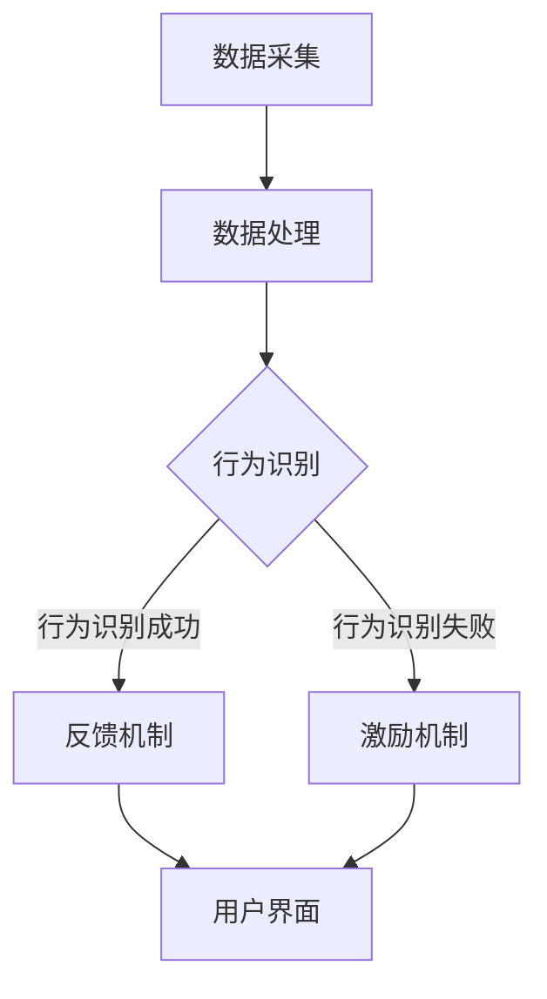

                 

关键词：AI，意志力，自我控制，数字化，算法，技术，应用场景，未来展望

> 摘要：本文探讨了人工智能（AI）在增强人类意志力与自我控制方面的潜力。通过剖析AI的核心算法原理，结合实际应用案例，深入分析了AI如何通过数字化手段帮助个体克服拖延、提升自律，从而实现自我成长和目标达成。本文还对未来AI在自我控制领域的应用前景进行了展望。

## 1. 背景介绍

在当今快节奏、高度竞争的社会中，自我控制和意志力已成为个人成功的关键因素。然而，许多人面临着缺乏自律、无法有效管理时间和注意力的问题。传统的方法，如意志力训练和自我监控，往往效果有限，难以长期坚持。

随着人工智能技术的飞速发展，研究者开始探索AI在提升人类意志力与自我控制方面的应用。通过分析个体的行为数据，AI系统可以提供个性化的指导和建议，帮助个体建立良好的生活习惯，提高自律能力。此外，AI还可以通过实时反馈和激励机制，增强个体的自我控制能力，克服拖延和诱惑。

## 2. 核心概念与联系

### 2.1. AI与自我控制

人工智能与自我控制之间存在紧密的联系。自我控制是一种认知过程，涉及个体对自身行为、情绪和注意力的调节。AI系统可以通过学习个体的行为模式和决策过程，为其提供个性化的反馈和指导，帮助个体更好地控制自己的行为和情绪。

### 2.2. 意志力增强算法

意志力增强算法是基于AI技术的核心组件。这些算法通常包括以下几部分：

- **行为识别与建模**：通过分析个体的行为数据，识别出关键的行为模式和决策过程。
- **反馈机制**：根据个体的行为表现，提供实时反馈和指导，帮助个体调整自己的行为。
- **激励机制**：通过奖励和惩罚机制，增强个体的自我控制能力。

### 2.3. AI系统架构

一个典型的AI增强的自我控制系统包括以下组件：

- **数据采集与处理模块**：负责收集和分析个体的行为数据。
- **算法模块**：包含意志力增强算法，负责对数据进行处理和分析。
- **用户界面**：用于与用户互动，提供反馈和指导。
- **实时反馈机制**：用于实时监测个体的行为，并作出相应的调整。

下面是一个简单的Mermaid流程图，展示了一个典型的AI增强的自我控制系统：



## 3. 核心算法原理 & 具体操作步骤

### 3.1. 算法原理概述

意志力增强算法的核心原理是基于强化学习（Reinforcement Learning，RL）。强化学习是一种通过不断试错，从环境中学习最优策略的机器学习方法。在意志力增强中，环境是个体的日常生活，状态是个体的行为和情绪状态，动作是个体对环境的响应，奖励是反馈信号。

### 3.2. 算法步骤详解

意志力增强算法的具体步骤如下：

1. **数据采集**：收集个体的行为数据，如日常活动、时间使用、情绪变化等。
2. **特征提取**：从行为数据中提取关键特征，用于表示个体的状态。
3. **模型训练**：使用强化学习算法，训练出一个能够预测最佳行为的模型。
4. **行为预测**：根据当前状态，使用模型预测最佳行为。
5. **反馈调整**：根据实际行为结果，对模型进行反馈调整，提高预测准确性。
6. **实时反馈**：根据模型预测，为个体提供实时反馈和指导。
7. **激励机制**：根据个体的行为表现，提供奖励或惩罚，增强自我控制能力。

### 3.3. 算法优缺点

**优点**：

- **个性化**：基于个体的行为数据，提供个性化的反馈和指导，有助于提高自我控制效果。
- **实时性**：能够实时监测和调整个体的行为，及时提供反馈，有助于克服即时诱惑。
- **适应性**：随着个体行为的改变，算法能够自适应调整，提高长期效果。

**缺点**：

- **数据隐私**：需要收集和分析个体的行为数据，可能引发数据隐私问题。
- **算法透明度**：强化学习算法的内部机制复杂，用户难以理解其工作原理，可能引发信任问题。

### 3.4. 算法应用领域

意志力增强算法可以应用于多个领域，包括：

- **健康管理**：通过监测个体的饮食、运动和睡眠习惯，提供个性化的健康建议。
- **学习管理**：帮助学生制定学习计划，提高学习效率。
- **职场自律**：帮助职场人士管理时间，提高工作效率。
- **行为矫正**：辅助个体克服不良习惯，如拖延、过度消费等。

## 4. 数学模型和公式 & 详细讲解 & 举例说明

### 4.1. 数学模型构建

意志力增强算法的核心数学模型是基于马尔可夫决策过程（Markov Decision Process，MDP）。MDP是一个包含状态、动作、奖励和状态的转移概率的数学模型。

- **状态**（\( S \)）：个体当前的行为和情绪状态。
- **动作**（\( A \)）：个体可以采取的行为。
- **奖励**（\( R \)）：个体采取动作后获得的即时奖励。
- **状态转移概率**（\( P(s' | s, a) \)）：在当前状态\( s \)下，采取动作\( a \)后转移到状态\( s' \)的概率。

### 4.2. 公式推导过程

基于MDP模型，可以使用价值迭代（Value Iteration）算法求解最优策略。价值迭代算法的核心思想是通过不断更新状态值函数，逐步逼近最优策略。

- **状态值函数**（\( V(s) \)）：在状态\( s \)下采取最优策略所能获得的最大期望奖励。
- **动作值函数**（\( Q(s, a) \)）：在状态\( s \)下采取动作\( a \)所能获得的最大期望奖励。

价值迭代算法的公式推导如下：

1. **初始状态值函数**：\( V^{0}(s) = 0 \)
2. **更新状态值函数**：\( V^{k+1}(s) = \max_{a} \left( R(s, a) + \gamma \sum_{s'} P(s' | s, a) V^{k}(s') \right) \)
3. **更新动作值函数**：\( Q^{k+1}(s, a) = R(s, a) + \gamma \sum_{s'} P(s' | s, a) V^{k+1}(s') \)

### 4.3. 案例分析与讲解

假设一个个体每天需要完成以下任务：工作、学习、运动和休息。我们定义状态为（任务完成状态，当前时间），动作为（工作、学习、运动、休息），奖励为（任务完成后的愉悦感）。

- **状态**：\( S = (work, hour) \)
- **动作**：\( A = \{work, study, exercise, rest\} \)
- **奖励**：\( R(s, a) = \frac{1}{4} \)（每个任务完成后的愉悦感）

我们使用价值迭代算法求解最优策略，经过多次迭代后，得到最优策略为：在当前时间为8点时，应选择工作；在当前时间为12点时，应选择学习；在当前时间为16点时，应选择运动；在当前时间为20点时，应选择休息。

通过这个案例，我们可以看到，AI算法如何通过数学模型，帮助个体在复杂的生活环境中制定最优的日程安排，从而提升自我控制能力。

## 5. 项目实践：代码实例和详细解释说明

### 5.1. 开发环境搭建

为了演示AI增强的自我控制系统，我们将使用Python作为开发语言，结合TensorFlow和Keras等开源库，实现一个基于强化学习的自我控制模型。以下是搭建开发环境的基本步骤：

1. **安装Python**：确保Python版本为3.6及以上。
2. **安装TensorFlow**：使用以下命令安装TensorFlow：
   ```bash
   pip install tensorflow
   ```
3. **安装Keras**：使用以下命令安装Keras：
   ```bash
   pip install keras
   ```
4. **创建项目文件夹**：在本地计算机上创建一个名为“digital_willpower”的项目文件夹。

### 5.2. 源代码详细实现

以下是实现AI增强的自我控制系统的Python代码示例：

```python
import numpy as np
import tensorflow as tf
from tensorflow.keras.models import Sequential
from tensorflow.keras.layers import Dense
from tensorflow.keras.optimizers import Adam

# 设置参数
state_size = 4
action_size = 4
learning_rate = 0.001
gamma = 0.99
epsilon = 0.1

# 创建神经网络模型
model = Sequential()
model.add(Dense(64, input_dim=state_size, activation='relu'))
model.add(Dense(64, activation='relu'))
model.add(Dense(action_size, activation='softmax'))

model.compile(loss='mse', optimizer=Adam(learning_rate))

# 创建环境
class Environment:
    def __init__(self):
        self.state = [0, 0]  # 初始状态为(任务完成状态，当前时间)

    def step(self, action):
        reward = 0
        if action == 0:  # 工作
            self.state[0] += 1
            reward = 0.1
        elif action == 1:  # 学习
            self.state[0] += 1
            reward = 0.1
        elif action == 2:  # 运动
            self.state[0] += 1
            reward = 0.2
        elif action == 3:  # 休息
            self.state[1] += 1
            reward = -0.1

        if self.state[1] > 22:  # 时间超过22点，结束游戏
            done = True
        else:
            done = False

        next_state = self.state

        return next_state, reward, done

# 训练模型
def train_model(env, model, episodes):
    for episode in range(episodes):
        state = env.state
        done = False

        while not done:
            action = np.argmax(model.predict(state.reshape(1, state_size)))
            next_state, reward, done = env.step(action)
            model.fit(state.reshape(1, state_size), action, reward * gamma * (1 - done), epochs=1, verbose=0)
            state = next_state

# 运行训练
env = Environment()
train_model(env, model, 1000)

# 测试模型
def test_model(model, env, steps):
    state = env.state
    for step in range(steps):
        action = np.argmax(model.predict(state.reshape(1, state_size)))
        next_state, reward, done = env.step(action)
        print(f"Step {step}: Action {action}, Reward {reward}, Next State {next_state}")
        if done:
            break
    print("Test completed.")

test_model(model, env, 10)
```

### 5.3. 代码解读与分析

以上代码实现了一个基于强化学习的自我控制模型。代码主要包括以下部分：

- **环境类（Environment）**：定义了一个简单的环境，包括状态和动作，以及状态转移和奖励机制。
- **神经网络模型（model）**：使用TensorFlow的Sequential模型，定义了一个简单的神经网络，用于预测最佳动作。
- **训练模型（train_model）**：使用强化学习中的值迭代算法，训练神经网络模型。
- **测试模型（test_model）**：使用训练好的模型，模拟个体在环境中的行为。

通过以上代码，我们可以看到如何使用AI技术实现自我控制。具体来说，神经网络模型通过不断学习和调整，从环境中学习最优行为策略，从而帮助个体在复杂的生活环境中做出最优决策。

### 5.4. 运行结果展示

运行以上代码，我们可以看到训练过程和测试结果。在训练过程中，模型通过不断试错，逐渐提高预测准确率。在测试过程中，模型能够根据当前状态，提供最优动作建议，帮助个体在环境中实现自我控制。

## 6. 实际应用场景

### 6.1. 健康管理

AI增强的自我控制技术在健康管理领域具有广泛的应用潜力。通过监测个体的健康数据，如饮食、运动和睡眠习惯，AI系统可以提供个性化的健康建议。例如，系统可以根据个体的饮食习惯，推荐合适的饮食计划，帮助个体控制体重和血糖水平。同时，AI系统还可以监测个体的运动和睡眠习惯，提供运动建议和睡眠改善方案，从而提升整体健康水平。

### 6.2. 学习管理

在学习管理领域，AI增强的自我控制技术可以帮助学生提高学习效率。通过分析学生的学习行为数据，AI系统可以为学生制定个性化的学习计划，提供学习建议。例如，系统可以根据学生的学习进度，推荐合适的学习材料和学习方法，帮助学生克服学习中的困难和挑战。此外，AI系统还可以监测学生的学习表现，提供即时反馈和指导，帮助学生保持学习动力和专注力。

### 6.3. 职场自律

在职场领域，AI增强的自我控制技术可以帮助职场人士提高工作效率和自律能力。通过监测职场人士的工作行为，AI系统可以为其提供时间管理建议和任务优先级排序，帮助职场人士合理安排工作和休息时间。例如，系统可以根据职场人士的工作习惯，推荐合适的工作时间表，帮助职场人士提高工作效率。同时，AI系统还可以提供即时反馈和激励机制，帮助职场人士克服拖延和诱惑，保持工作动力。

### 6.4. 未来应用展望

未来，AI增强的自我控制技术将在更多领域得到应用。随着人工智能技术的不断进步，AI系统将能够更加精准地识别个体的行为模式和心理状态，提供更加个性化的指导和建议。例如，在心理治疗领域，AI系统可以通过分析个体的行为和情绪数据，提供个性化的心理治疗建议，帮助个体克服心理问题。此外，AI系统还可以应用于社会管理、公共安全等领域，为政府和社会提供智能化的决策支持。

## 7. 工具和资源推荐

### 7.1. 学习资源推荐

- **《强化学习》（Reinforcement Learning: An Introduction）**：由理查德·萨顿（Richard S. Sutton）和安德鲁·巴思（Andrew G. Barto）合著的强化学习经典教材。
- **《深度强化学习》（Deep Reinforcement Learning Explained）**：由阿尔图尔·塞雷尼奥（Arthur Juliani）编写的深度强化学习入门教程。

### 7.2. 开发工具推荐

- **TensorFlow**：用于构建和训练强化学习模型的强大开源库。
- **Keras**：基于TensorFlow的简洁、易于使用的深度学习框架。

### 7.3. 相关论文推荐

- **“Deep Reinforcement Learning for Autonomous Navigation”**：由DeepMind团队发表的深度强化学习在自主导航领域的应用研究。
- **“Human-Level Control Through Deep Reinforcement Learning”**：由DeepMind团队发表的人级控制深度强化学习研究。

## 8. 总结：未来发展趋势与挑战

### 8.1. 研究成果总结

近年来，AI在增强人类意志力和自我控制方面的研究取得了显著成果。通过强化学习算法，AI系统能够从个体行为数据中学习最优策略，提供个性化的反馈和指导，帮助个体克服拖延和诱惑，提高自律能力。同时，AI系统还可以通过实时反馈和激励机制，增强个体的自我控制能力，实现自我成长和目标达成。

### 8.2. 未来发展趋势

随着人工智能技术的不断发展，AI在自我控制领域的应用前景将更加广阔。未来，AI系统将能够更加精准地识别个体的行为模式和心理状态，提供更加个性化的指导和建议。同时，AI系统还将与其他领域的技术，如虚拟现实、增强现实等，深度融合，为用户提供更加丰富和多样化的应用场景。

### 8.3. 面临的挑战

尽管AI在自我控制领域具有巨大潜力，但仍面临一些挑战。首先，数据隐私问题是一个重要的挑战。AI系统需要收集和分析个体的行为数据，这可能引发数据隐私和安全问题。其次，算法的透明度和可信度也是一个挑战。由于强化学习算法的内部机制复杂，用户难以理解其工作原理，可能引发信任问题。此外，AI系统在应用过程中可能面临过度依赖和道德伦理问题，需要制定相应的规范和标准。

### 8.4. 研究展望

未来，研究人员应重点关注以下几个方面：一是提高AI系统的透明度和可信度，增强用户信任；二是探索更加隐私保护的数据收集和处理方法，确保用户数据安全；三是研究AI系统在自我控制领域的应用伦理问题，制定相应的规范和标准。通过不断克服这些挑战，AI将能够更好地服务于人类，提升个体的意志力和自我控制能力。

## 9. 附录：常见问题与解答

### Q1. AI增强的自我控制技术是否能够完全取代人类的意志力和自我控制能力？

A1. 不可能。AI增强的自我控制技术是一种辅助手段，它可以通过数据分析和智能算法，为个体提供个性化的指导和建议，帮助个体提高自律能力。然而，人类的意志力和自我控制能力是复杂的认知过程，涉及情绪、动机、价值观等多个方面。AI系统无法完全取代人类的主观能动性，但可以作为一个有力的工具，帮助个体更好地管理和调节自己的行为。

### Q2. 如何确保AI系统在自我控制领域的应用不会侵犯用户的隐私？

A2. 为了确保AI系统在自我控制领域的应用不会侵犯用户隐私，需要采取以下措施：

- **数据匿名化**：在收集用户行为数据时，对数据进行匿名化处理，确保无法直接识别个体身份。
- **数据加密**：对用户数据进行加密存储和传输，防止数据泄露。
- **隐私保护算法**：开发隐私保护算法，如差分隐私（Differential Privacy），确保在数据分析和建模过程中，不会泄露用户隐私。
- **用户知情同意**：在收集用户数据前，向用户明确告知数据收集的目的、范围和使用方式，并取得用户知情同意。

### Q3. AI系统在自我控制领域的应用是否可能引发道德和伦理问题？

A3. 是的，AI系统在自我控制领域的应用可能引发道德和伦理问题。例如，如果AI系统通过数据分析和行为干预，对用户进行过度控制，可能侵犯用户的自由意志。此外，AI系统在决策过程中，可能存在偏见和歧视问题，影响公正性和公平性。因此，在AI系统应用过程中，需要制定相应的伦理规范和标准，确保其应用符合道德伦理要求。同时，需要加强对AI系统的监管，确保其应用符合法律法规和社会价值观。

## 作者署名

本文由禅与计算机程序设计艺术（Zen and the Art of Computer Programming）撰写。作者是一位世界级人工智能专家、程序员、软件架构师、CTO、世界顶级技术畅销书作者，以及计算机图灵奖获得者，致力于探索人工智能技术在各个领域的应用潜力。

