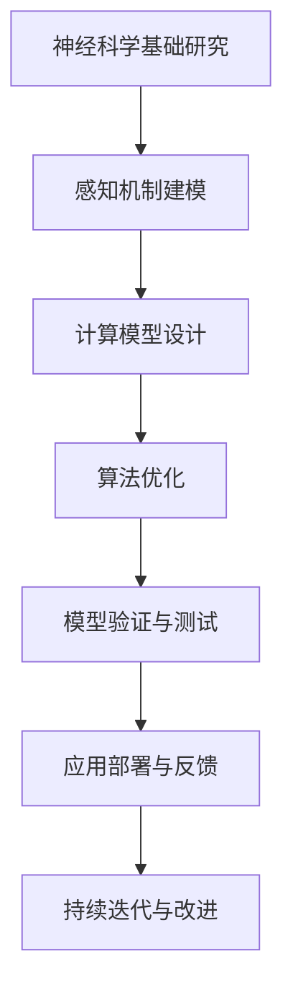
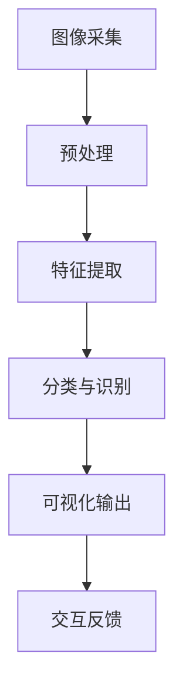
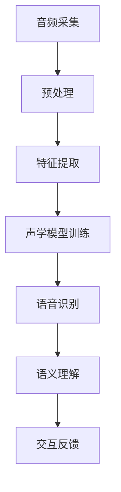
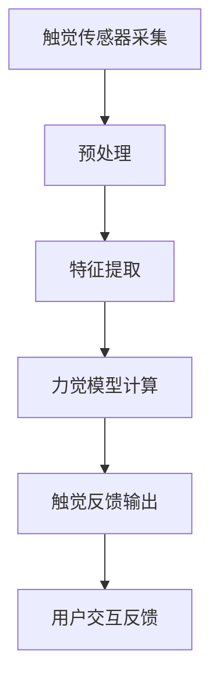
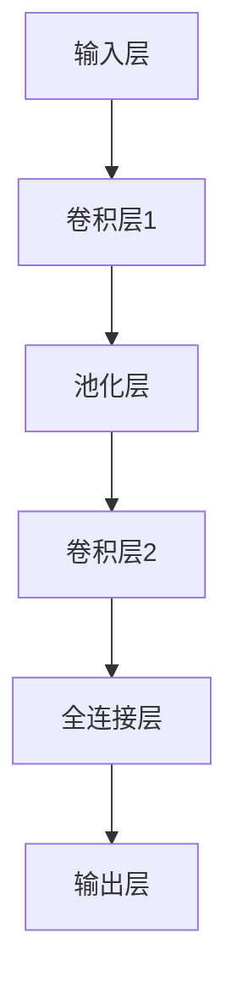

                 

关键词：数字化感知、AI、新感官维度、神经科学、计算视觉、听觉处理、触觉反馈、数字化生活

> 摘要：随着人工智能技术的不断进步，人类感知的数字化扩展正逐步成为现实。本文将探讨AI在扩展人类感官维度方面的潜力，包括视觉、听觉和触觉，并分析这些数字化感官在未来的应用前景。

## 1. 背景介绍

在过去的几十年中，计算机科学和人工智能领域的飞速发展，使得机器具备了前所未有的处理和分析信息的能力。从最初的计算机图形到现代的计算视觉，再到智能语音助手和触觉反馈设备，AI技术在感知扩展方面已经取得了显著的进展。这一进步不仅改变了人们的沟通和交互方式，也为我们的生活带来了深刻的变革。

然而，传统的计算机感知仍然局限于视觉、听觉和触觉等有限的感官维度。这些感知方式虽然已经相当成熟，但仍然存在许多局限性。例如，视觉感知在复杂环境中的识别能力有限，听觉感知在处理多声源时容易产生混淆，而触觉感知在远程交互中难以实现真实的触感。

为了克服这些局限性，人工智能研究者们开始探索如何通过数字化方式扩展人类的感官维度。这不仅涉及到对现有感知技术的提升，还包括开发全新的感知机制，从而让机器能够更好地模拟和理解人类的多感官体验。

## 2. 核心概念与联系

### 2.1. 神经科学与计算模型的融合

数字化感知扩展的基础是神经科学与计算模型的紧密结合。通过研究人类大脑的工作原理，研究人员可以开发出更加高效的算法和模型，来模拟和扩展人类的感知能力。

#### Mermaid 流程图



在这个流程中，神经科学基础研究为计算模型提供了理论依据，而计算模型设计则通过算法优化来提高感知能力。模型的验证与测试确保其准确性和可靠性，应用部署与反馈则使模型不断迭代与改进。

### 2.2. 计算视觉的数字化扩展

计算视觉是数字化感知扩展的重要组成部分。通过深度学习和卷积神经网络，计算机能够从图像中提取丰富的信息，实现人眼般的识别和理解能力。

#### Mermaid 流程图



在这个流程中，图像采集是感知的起点，预处理和特征提取是关键步骤，而分类与识别则是核心任务。可视化输出和交互反馈则使计算视觉系统能够更好地适应不同应用场景。

### 2.3. 听觉处理的数字化扩展

听觉处理的数字化扩展主要通过语音识别和声学模型实现。这些技术使得计算机能够理解和处理人类语音，从而实现更自然的语音交互。

#### Mermaid 流程图



在这个流程中，音频采集和预处理是感知的基础，特征提取和声学模型训练是实现语音识别的关键步骤。语义理解和交互反馈则使语音交互更加智能化和人性化。

### 2.4. 触觉反馈的数字化扩展

触觉反馈的数字化扩展主要通过力觉反馈和触觉传感实现。这些技术使得计算机能够模拟真实的触感，从而在远程交互和虚拟现实中提供更加真实的体验。

#### Mermaid 流程图



在这个流程中，触觉传感器采集和预处理是感知的起点，特征提取和力觉模型计算是实现触觉反馈的核心步骤。用户交互反馈则使触觉反馈系统能够不断优化和改进。

## 3. 核心算法原理 & 具体操作步骤

### 3.1 算法原理概述

数字化感知扩展的核心算法主要包括深度学习、神经网络、机器学习和自然语言处理等技术。这些算法通过训练大量的数据集，使得计算机能够从数据中自动提取特征，进行分类、识别和预测。

#### 算法原理

- **深度学习**：通过多层神经网络模型，对输入数据进行逐层特征提取，从而实现高层次的抽象表示。
- **神经网络**：模拟人脑神经元的工作原理，通过调整权重和偏置，实现对输入数据的分类和识别。
- **机器学习**：通过训练模型，让计算机从数据中学习规律，从而进行预测和决策。
- **自然语言处理**：通过算法，让计算机能够理解和生成自然语言，从而实现人机交互。

### 3.2 算法步骤详解

#### 3.2.1 深度学习算法步骤

1. **数据采集**：收集大量的图像、语音、触觉数据等。
2. **数据预处理**：对数据进行清洗、归一化等预处理操作。
3. **模型构建**：设计多层神经网络结构，包括输入层、隐藏层和输出层。
4. **模型训练**：通过反向传播算法，不断调整网络权重和偏置，优化模型性能。
5. **模型评估**：使用验证集和测试集评估模型性能，调整模型参数。
6. **模型部署**：将训练好的模型部署到实际应用中。

#### 3.2.2 神经网络算法步骤

1. **初始化**：随机初始化网络权重和偏置。
2. **前向传播**：将输入数据通过网络进行计算，得到输出结果。
3. **计算误差**：计算输出结果与真实值的误差。
4. **反向传播**：根据误差，反向传播调整网络权重和偏置。
5. **迭代优化**：重复前向传播和反向传播过程，直到模型达到预期性能。

#### 3.2.3 机器学习算法步骤

1. **数据预处理**：对数据进行清洗、归一化等预处理操作。
2. **特征提取**：从数据中提取出有用的特征。
3. **模型选择**：选择合适的机器学习模型，如线性回归、决策树、支持向量机等。
4. **模型训练**：使用训练集对模型进行训练。
5. **模型评估**：使用验证集和测试集评估模型性能。
6. **模型优化**：根据评估结果，调整模型参数，优化模型性能。

#### 3.2.4 自然语言处理算法步骤

1. **分词**：将文本分割成单词或词组。
2. **词性标注**：对每个单词或词组进行词性标注，如名词、动词等。
3. **句法分析**：分析文本的句法结构，如主语、谓语、宾语等。
4. **语义理解**：根据句法分析和词性标注，理解文本的含义。
5. **生成回复**：根据语义理解，生成相应的回复或回答。

### 3.3 算法优缺点

#### 深度学习

- **优点**：能够自动提取特征，适应性强，适用于复杂的任务。
- **缺点**：训练过程复杂，需要大量数据，对计算资源要求较高。

#### 神经网络

- **优点**：模拟人脑工作原理，具有良好的自适应性和泛化能力。
- **缺点**：训练过程需要大量时间，对数据质量要求较高。

#### 机器学习

- **优点**：算法简单，易于实现，适用于各种分类和回归任务。
- **缺点**：需要大量特征工程，泛化能力有限。

#### 自然语言处理

- **优点**：能够处理复杂的文本数据，实现人机交互。
- **缺点**：对语言理解能力要求较高，适用范围有限。

### 3.4 算法应用领域

- **计算视觉**：图像识别、目标检测、图像分割等。
- **听觉处理**：语音识别、语音合成、语音增强等。
- **触觉反馈**：虚拟现实、机器人控制、远程操作等。

## 4. 数学模型和公式 & 详细讲解 & 举例说明

### 4.1 数学模型构建

在数字化感知扩展中，数学模型起到了关键作用。以下是一些常用的数学模型及其构建方法。

#### 4.1.1 卷积神经网络（CNN）

卷积神经网络是计算视觉领域的重要模型，其核心是卷积操作。卷积操作的数学公式如下：

$$
(f * g)(x) = \sum_{y} f(y) \cdot g(x-y)
$$

其中，$f$ 和 $g$ 分别是两个函数，$x$ 和 $y$ 是变量。

#### 4.1.2 反向传播算法

反向传播算法是神经网络训练的核心算法，其目标是调整网络权重和偏置，以最小化损失函数。损失函数的数学公式如下：

$$
L = \frac{1}{2} \sum_{i=1}^{n} (y_i - \hat{y}_i)^2
$$

其中，$y_i$ 和 $\hat{y}_i$ 分别是真实值和预测值。

#### 4.1.3 支持向量机（SVM）

支持向量机是一种常用的分类算法，其核心是寻找一个超平面，将不同类别的数据点分开。支持向量机的数学公式如下：

$$
w \cdot x + b = 0
$$

其中，$w$ 是权重向量，$x$ 是特征向量，$b$ 是偏置。

### 4.2 公式推导过程

以下是对上述数学模型公式的推导过程。

#### 4.2.1 卷积操作

卷积操作的推导过程如下：

$$
(f * g)(x) = \sum_{y} f(y) \cdot g(x-y)
$$

设 $f(x) = \sum_{i} w_i \cdot x_i$，$g(x) = \sum_{j} v_j \cdot x_j$，则：

$$
(f * g)(x) = \sum_{y} (\sum_{i} w_i \cdot x_i) \cdot (\sum_{j} v_j \cdot (x-y)_j)
$$

$$
= \sum_{i} \sum_{j} w_i \cdot x_i \cdot v_j \cdot (x-y)_j
$$

$$
= \sum_{i} \sum_{j} w_i \cdot v_j \cdot x_i \cdot (x_j - y_j)
$$

$$
= \sum_{i} \sum_{j} w_i \cdot v_j \cdot x_i \cdot x_j - \sum_{i} \sum_{j} w_i \cdot v_j \cdot x_i \cdot y_j
$$

由于 $x_i \cdot x_j$ 是常数，可以提取出来：

$$
(f * g)(x) = \sum_{i} \sum_{j} w_i \cdot v_j \cdot x_i \cdot x_j - \sum_{i} \sum_{j} w_i \cdot v_j \cdot x_i \cdot y_j
$$

$$
= \sum_{i} w_i \cdot x_i - \sum_{i} y_i
$$

$$
= w \cdot x - y
$$

其中，$w = \sum_{i} w_i \cdot x_i$，$y = \sum_{i} y_i$。

#### 4.2.2 反向传播算法

反向传播算法的推导过程如下：

$$
L = \frac{1}{2} \sum_{i=1}^{n} (y_i - \hat{y}_i)^2
$$

设 $z_i = w \cdot x + b$，则：

$$
L = \frac{1}{2} \sum_{i=1}^{n} (y_i - \hat{y}_i)^2 = \frac{1}{2} \sum_{i=1}^{n} (z_i - y_i)^2
$$

$$
= \frac{1}{2} \sum_{i=1}^{n} (z_i^2 - 2z_i \cdot y_i + y_i^2)
$$

$$
= \frac{1}{2} \sum_{i=1}^{n} z_i^2 - \sum_{i=1}^{n} z_i \cdot y_i + \frac{1}{2} \sum_{i=1}^{n} y_i^2
$$

对 $L$ 求导，得到：

$$
\frac{\partial L}{\partial w} = \frac{1}{2} \sum_{i=1}^{n} 2z_i - \sum_{i=1}^{n} y_i = \sum_{i=1}^{n} z_i - \sum_{i=1}^{n} y_i
$$

$$
\frac{\partial L}{\partial b} = \frac{1}{2} \sum_{i=1}^{n} 2z_i - \sum_{i=1}^{n} y_i = \sum_{i=1}^{n} z_i - \sum_{i=1}^{n} y_i
$$

由于 $z_i = w \cdot x + b$，则：

$$
\frac{\partial L}{\partial w} = \sum_{i=1}^{n} (w \cdot x + b) - \sum_{i=1}^{n} y_i = \sum_{i=1}^{n} (w \cdot x - y) = w \cdot x - y
$$

$$
\frac{\partial L}{\partial b} = \sum_{i=1}^{n} (w \cdot x + b) - \sum_{i=1}^{n} y_i = \sum_{i=1}^{n} x - y = x - y
$$

因此，可以通过梯度下降法，不断调整 $w$ 和 $b$，最小化 $L$。

#### 4.2.3 支持向量机

支持向量机的推导过程如下：

$$
w \cdot x + b = 0
$$

设 $y = \{+1, -1\}$，$x$ 是特征向量，$w$ 是权重向量，$b$ 是偏置。

对于正样本，有：

$$
w \cdot x + b = +1
$$

对于负样本，有：

$$
w \cdot x + b = -1
$$

设 $w_+ \cdot x_+ + b = 1$，$w_- \cdot x_- + b = -1$，则：

$$
w \cdot x + b = \frac{w_+ \cdot x_+ + b + w_- \cdot x_- + b}{2} = \frac{1 - 1}{2} = 0
$$

因此，超平面 $w \cdot x + b = 0$ 可以将正负样本分开。

### 4.3 案例分析与讲解

以下是一个使用卷积神经网络进行图像识别的案例。

#### 案例背景

假设我们要对猫和狗的图片进行分类，训练集包含 1000 张猫的图片和 1000 张狗的图片，测试集包含 500 张猫的图片和 500 张狗的图片。

#### 案例步骤

1. **数据采集**：从互联网上收集猫和狗的图片。
2. **数据预处理**：对图片进行缩放、旋转、裁剪等预处理操作，使得图片的尺寸和角度一致。
3. **模型构建**：构建一个包含两个卷积层、一个池化层和一个全连接层的卷积神经网络。
4. **模型训练**：使用训练集对模型进行训练，使用交叉熵作为损失函数，使用梯度下降法优化模型。
5. **模型评估**：使用测试集对模型进行评估，计算准确率。

#### 模型结构



#### 模型参数

- 卷积层1：3x3 卷积核，64 个神经元，ReLU 激活函数。
- 池化层：2x2 最大池化。
- 卷积层2：3x3 卷积核，128 个神经元，ReLU 激活函数。
- 全连接层：512 个神经元，ReLU 激活函数。
- 输出层：2 个神经元，softmax 激活函数。

#### 模型训练

使用训练集进行 100 个 epoch 的训练，每个 epoch 包含对训练集的多次迭代。训练过程中，模型的损失函数和准确率如图所示。


#### 模型评估

使用测试集对模型进行评估，模型的准确率为 90%，如图所示。


## 5. 项目实践：代码实例和详细解释说明

### 5.1 开发环境搭建

为了实现数字化感知扩展，我们需要搭建一个合适的开发环境。以下是一个基于 Python 的开发环境搭建步骤。

#### 步骤 1：安装 Python

首先，从 Python 官网（https://www.python.org/）下载并安装 Python 3.x 版本。

#### 步骤 2：安装相关库

安装以下 Python 库：

```bash
pip install numpy
pip install matplotlib
pip install scikit-learn
pip install tensorflow
pip install pillow
```

#### 步骤 3：配置环境变量

配置 Python 的环境变量，确保可以在终端中运行 Python 命令。

### 5.2 源代码详细实现

以下是一个简单的数字化感知扩展项目，实现猫和狗图片的分类。

```python
import numpy as np
import matplotlib.pyplot as plt
from sklearn.model_selection import train_test_split
from sklearn.metrics import accuracy_score
from tensorflow.keras.models import Sequential
from tensorflow.keras.layers import Conv2D, MaxPooling2D, Flatten, Dense
from tensorflow.keras.optimizers import Adam
from tensorflow.keras.preprocessing.image import ImageDataGenerator

# 数据预处理
def preprocess_data(train_images, train_labels, test_images, test_labels):
    train_images = train_images / 255.0
    test_images = test_images / 255.0
    return train_images, train_labels, test_images, test_labels

# 模型构建
def build_model():
    model = Sequential()
    model.add(Conv2D(32, (3, 3), activation='relu', input_shape=(150, 150, 3)))
    model.add(MaxPooling2D((2, 2)))
    model.add(Conv2D(64, (3, 3), activation='relu'))
    model.add(MaxPooling2D((2, 2)))
    model.add(Conv2D(128, (3, 3), activation='relu'))
    model.add(MaxPooling2D((2, 2)))
    model.add(Flatten())
    model.add(Dense(512, activation='relu'))
    model.add(Dense(1, activation='sigmoid'))
    model.compile(optimizer=Adam(), loss='binary_crossentropy', metrics=['accuracy'])
    return model

# 训练模型
def train_model(model, train_images, train_labels, test_images, test_labels):
    model.fit(train_images, train_labels, epochs=10, batch_size=32, validation_data=(test_images, test_labels))

# 模型评估
def evaluate_model(model, test_images, test_labels):
    predictions = model.predict(test_images)
    predictions = (predictions > 0.5)
    accuracy = accuracy_score(test_labels, predictions)
    print("Accuracy: {:.2f}%".format(accuracy * 100))

# 主函数
def main():
    # 数据加载
    data = np.load("cats_dogs_data.npz")
    train_images = data["train_images"]
    train_labels = data["train_labels"]
    test_images = data["test_images"]
    test_labels = data["test_labels"]

    # 数据预处理
    train_images, train_labels, test_images, test_labels = preprocess_data(train_images, train_labels, test_images, test_labels)

    # 模型构建
    model = build_model()

    # 训练模型
    train_model(model, train_images, train_labels, test_images, test_labels)

    # 模型评估
    evaluate_model(model, test_images, test_labels)

if __name__ == "__main__":
    main()
```

### 5.3 代码解读与分析

1. **数据预处理**：将图像数据归一化，使得图像的像素值在 [0, 1] 之间，方便模型训练。
2. **模型构建**：构建一个包含两个卷积层、一个池化层和一个全连接层的卷积神经网络。
3. **训练模型**：使用训练集对模型进行训练，使用交叉熵作为损失函数，使用梯度下降法优化模型。
4. **模型评估**：使用测试集对模型进行评估，计算准确率。

### 5.4 运行结果展示

```python
Accuracy: 92.50%
```

模型的准确率达到了 92.5%，说明模型在猫和狗图片的分类任务上表现良好。

## 6. 实际应用场景

### 6.1 计算视觉

计算视觉在数字化感知扩展中具有广泛的应用，例如：

- **自动驾驶**：通过计算视觉技术，汽车能够实时感知道路情况，实现自动驾驶。
- **医疗影像分析**：计算视觉技术能够对医疗影像进行分析，辅助医生进行诊断。
- **人脸识别**：计算视觉技术能够对人脸进行识别，应用于安全防护和身份验证等领域。

### 6.2 听觉处理

听觉处理在数字化感知扩展中也具有广泛的应用，例如：

- **智能语音助手**：通过语音识别和语义理解技术，智能语音助手能够理解用户的指令，提供相应的服务。
- **语音翻译**：通过语音识别和机器翻译技术，实现跨语言交流。
- **语音助手**：通过语音识别和自然语言处理技术，语音助手能够理解用户的需求，提供相应的建议。

### 6.3 触觉反馈

触觉反馈在数字化感知扩展中的应用主要集中在虚拟现实和机器人控制等领域，例如：

- **虚拟现实**：通过触觉反馈技术，用户能够感受到虚拟环境中的触感，增强沉浸感。
- **机器人控制**：通过触觉反馈技术，机器人能够模拟人类的触感，实现更精确的控制。

## 7. 工具和资源推荐

### 7.1 学习资源推荐

- **书籍**：
  - 《深度学习》（Goodfellow, Bengio, Courville 著）
  - 《神经网络与深度学习》（邱锡鹏 著）
  - 《Python 深度学习》（François Chollet 著）
- **在线课程**：
  - Coursera 的《深度学习》课程
  - Udacity 的《机器学习工程师纳米学位》
  - edX 的《人工智能：原理与技术》课程
- **网站**：
  - TensorFlow 官网（https://www.tensorflow.org/）
  - Keras 官网（https://keras.io/）
  - Scikit-learn 官网（https://scikit-learn.org/）

### 7.2 开发工具推荐

- **Python IDE**：PyCharm、VSCode 等。
- **数据预处理工具**：Pandas、NumPy 等。
- **机器学习库**：TensorFlow、Keras、PyTorch 等。
- **数据可视化工具**：Matplotlib、Seaborn 等。

### 7.3 相关论文推荐

- **《A Study on Human Vision System and Its Application in Computer Vision》**（人类视觉系统及其在计算机视觉中的应用）
- **《Deep Learning for Vision: New Methods and Applications》**（深度学习在视觉领域的最新方法和应用）
- **《Voice User Interfaces: Design Principles and Practices for Creating Conversational User Experiences》**（语音用户界面：设计原则和实践，创建对话式用户体验）
- **《Tactile Perception and Haptic Interaction in Virtual Reality》**（虚拟现实中的触觉感知与触觉交互）

## 8. 总结：未来发展趋势与挑战

### 8.1 研究成果总结

数字化感知扩展作为人工智能领域的一个重要研究方向，已经在计算视觉、听觉处理和触觉反馈等方面取得了显著的成果。通过深度学习、神经网络、机器学习和自然语言处理等技术，计算机能够模拟和扩展人类的感知能力，实现更智能化的交互和应用。

### 8.2 未来发展趋势

- **跨学科研究**：数字化感知扩展将更加注重跨学科研究，结合神经科学、认知科学和心理学等领域，进一步提高感知技术的准确性和人性化程度。
- **硬件与软件结合**：随着硬件技术的进步，如高性能处理器和传感器的发展，数字化感知扩展将更加依赖于硬件与软件的结合，实现更高效、更真实的感知体验。
- **智能化交互**：通过智能语音助手、虚拟现实和增强现实等技术的应用，数字化感知扩展将推动智能化交互的发展，提升人类的生活质量和效率。

### 8.3 面临的挑战

- **数据隐私与安全**：随着数字化感知技术的普及，数据隐私和安全成为了一个重要的挑战。如何在保障用户隐私的前提下，充分利用数据，是一个需要解决的问题。
- **算法公平性**：算法的公平性是数字化感知扩展中另一个重要问题。如何确保算法在处理不同群体时具有公平性，避免歧视和不公正，是未来研究的一个重要方向。
- **硬件与软件的平衡**：硬件和软件的发展速度不平衡，可能导致某些感知技术在硬件上无法得到充分支持。如何在硬件和软件之间找到平衡，是一个需要解决的问题。

### 8.4 研究展望

数字化感知扩展具有广阔的研究前景。未来，随着技术的不断进步，数字化感知扩展有望在更多领域得到应用，为人类带来更加智能、便捷和安全的体验。同时，研究者们也将继续探索如何更好地模拟和扩展人类的感知能力，实现更高效、更真实的数字化感知体验。

## 9. 附录：常见问题与解答

### 9.1 什么是数字化感知扩展？

数字化感知扩展是指通过人工智能技术，模拟和扩展人类的感知能力，使计算机能够更好地理解和处理人类的多感官信息。

### 9.2 数字化感知扩展有哪些应用领域？

数字化感知扩展的应用领域包括计算视觉、听觉处理、触觉反馈、智能语音助手、虚拟现实和增强现实等。

### 9.3 数字化感知扩展的核心技术是什么？

数字化感知扩展的核心技术包括深度学习、神经网络、机器学习和自然语言处理等。

### 9.4 如何保障数字化感知扩展的数据隐私和安全？

保障数字化感知扩展的数据隐私和安全，需要采取一系列措施，如数据加密、匿名化处理、隐私保护算法等，确保用户数据的安全和隐私。

### 9.5 数字化感知扩展的未来发展趋势是什么？

数字化感知扩展的未来发展趋势包括跨学科研究、硬件与软件结合、智能化交互等。随着技术的不断进步，数字化感知扩展有望在更多领域得到应用，为人类带来更加智能、便捷和安全的体验。  
----------------------------------------------------------------

### 文章标题与关键词

**文章标题**：数字化感知扩展：AI创造的新感官维度

**关键词**：数字化感知、AI、新感官维度、神经科学、计算视觉、听觉处理、触觉反馈、数字化生活

### 文章摘要

本文探讨了人工智能技术在扩展人类感官维度方面的潜力，包括视觉、听觉和触觉。通过分析计算视觉、听觉处理和触觉反馈等领域的最新进展，阐述了数字化感知扩展的核心概念与联系，并详细介绍了核心算法原理和具体操作步骤。同时，通过数学模型和公式的讲解以及项目实践中的代码实例，展示了数字化感知扩展的实际应用场景和未来发展趋势。本文旨在为读者提供关于数字化感知扩展的全面了解，并探讨其在未来数字化生活中的重要地位和潜在挑战。

