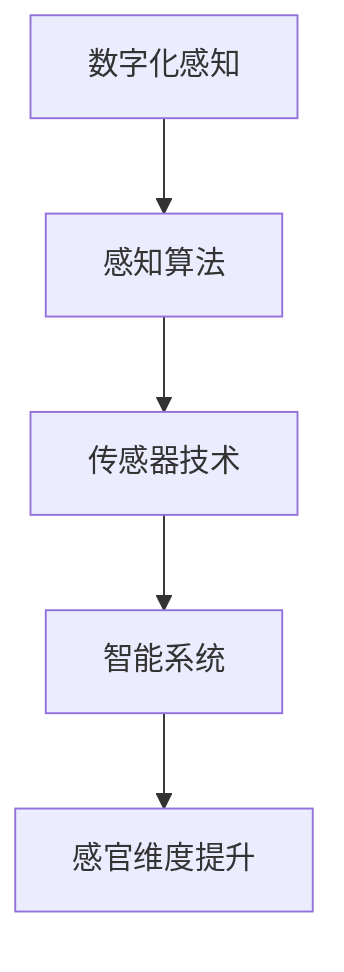

                 

关键词：数字化感知、人工智能、AI创新、感官维度、智能系统、感知算法、机器学习、物联网

> 摘要：本文深入探讨了数字化感知在人工智能领域的拓展，以及这一创新对智能系统感官维度的提升。通过对核心概念、算法原理、数学模型、项目实践以及应用场景的详细分析，本文旨在为读者提供一份关于数字化感知与AI融合的全面指南。

## 1. 背景介绍

随着信息技术的迅猛发展，人工智能（AI）已经成为推动社会进步的重要力量。AI不仅改变了传统的行业模式，还在不断拓展人类感知和认知的边界。数字化感知作为AI技术的重要组成部分，旨在通过模拟人类的感知系统，实现对环境信息的实时获取、处理和理解。数字化感知的提升，不仅能够增强智能系统的自主能力，还能够拓展智能系统的感官维度，使其更加贴近人类感知。

数字化感知技术的兴起，得益于计算机性能的提升、传感器技术的进步以及数据存储和处理能力的增强。这些技术的融合，使得AI系统能够以更高效、更智能的方式处理感知数据，从而实现了从传统计算到智能感知的转变。在这个过程中，人工智能和数字化感知的相互促进，推动了智能系统感官维度的不断拓展。

## 2. 核心概念与联系

为了更好地理解数字化感知与智能系统感官维度的关系，我们首先需要明确几个核心概念，并展示它们之间的联系。

### 2.1 数字化感知

数字化感知是指通过传感器和其他设备收集环境信息，然后利用数字信号处理技术对这些信息进行加工、分析和理解。数字化感知的核心在于将物理世界中的信息转化为数字信号，以便于计算机进行处理。

### 2.2 感知算法

感知算法是数字化感知的核心，它们负责对收集到的数据进行处理、分析和理解。感知算法包括特征提取、模式识别、分类、聚类等，这些算法的效率和质量直接决定了数字化感知的能力。

### 2.3 传感器技术

传感器技术是实现数字化感知的基础，各种类型的传感器可以检测温度、湿度、压力、光强、声音等各种环境信息。随着传感器技术的发展，传感器的精度、灵敏度以及成本都在不断提高，这为数字化感知提供了更丰富的数据源。

### 2.4 智能系统

智能系统是指具备一定智能能力的计算机系统，它们可以通过学习和自适应来提高性能。智能系统的感官维度，即其感知能力，是衡量其智能水平的重要指标。数字化感知技术的应用，可以显著提升智能系统的感官维度，使其更加智能、自主。

下面是一个用Mermaid绘制的流程图，展示了数字化感知与智能系统感官维度的关系：



## 3. 核心算法原理 & 具体操作步骤

### 3.1 算法原理概述

数字化感知的核心在于感知算法，这些算法可以分为以下几个主要步骤：

1. **特征提取**：从原始感知数据中提取出对目标识别最有用的信息。
2. **模式识别**：通过对提取出的特征进行分析，识别目标物体的特征模式。
3. **分类与聚类**：将识别出的模式进行分类或聚类，以实现目标识别和场景理解。
4. **数据融合**：将多个传感器收集的数据进行融合，提高感知的准确性和可靠性。

### 3.2 算法步骤详解

#### 3.2.1 特征提取

特征提取是感知算法的第一步，其目的是将原始感知数据转换为更易于分析的形式。常见的特征提取方法包括：

- **时域特征**：如频率、幅度、相位等。
- **频域特征**：如频谱、波峰等。
- **空域特征**：如像素值、纹理等。

#### 3.2.2 模式识别

模式识别是基于特征提取的结果，对提取出的特征进行进一步分析，以识别目标物体的特征模式。常见的模式识别方法包括：

- **机器学习**：如支持向量机（SVM）、神经网络（NN）等。
- **统计方法**：如高斯混合模型（GMM）、贝叶斯分类器等。
- **深度学习**：如卷积神经网络（CNN）、循环神经网络（RNN）等。

#### 3.2.3 分类与聚类

分类是将识别出的模式归为不同的类别，而聚类则是将相似的模式归为同一类别。常见的分类与聚类方法包括：

- **监督学习**：如线性回归、决策树、随机森林等。
- **无监督学习**：如K-均值聚类、层次聚类等。
- **半监督学习**：如标签传播、基于模型的方法等。

#### 3.2.4 数据融合

数据融合是将多个传感器收集的数据进行综合处理，以提高感知的准确性和可靠性。常见的数据融合方法包括：

- **卡尔曼滤波**：用于估计动态系统的状态，适用于传感器噪声较大的情况。
- **贝叶斯推理**：用于融合来自不同传感器的信息，以提高总体感知的准确性。
- **粒子滤波**：用于处理非线性、非高斯分布的传感器数据。

### 3.3 算法优缺点

#### 优点

- **高效性**：数字化感知算法能够高效地处理大规模感知数据，提高系统的响应速度。
- **准确性**：通过多种感知算法的综合应用，数字化感知能够在复杂环境中实现高精度的目标识别和场景理解。
- **自适应**：数字化感知算法可以根据环境变化自适应调整，提高系统的适应能力。

#### 缺点

- **计算复杂度**：感知算法通常具有较高的计算复杂度，对硬件资源要求较高。
- **传感器依赖性**：数字化感知的准确性受传感器性能的制约，传感器质量不高可能导致感知效果不佳。
- **数据隐私**：数字化感知涉及大量个人隐私数据，如何保护数据隐私是一个重要问题。

### 3.4 算法应用领域

数字化感知算法在众多领域都有广泛应用，主要包括：

- **智能监控**：通过视频监控和人脸识别技术，实现实时监控和异常检测。
- **自动驾驶**：通过车载传感器和感知算法，实现车辆自主导航和障碍物识别。
- **智能家居**：通过家庭传感器和感知算法，实现智能家电控制和家居环境优化。
- **医疗健康**：通过医疗传感器和感知算法，实现病情监测和健康预测。

## 4. 数学模型和公式 & 详细讲解 & 举例说明

### 4.1 数学模型构建

数字化感知中的数学模型主要分为两大类：统计模型和深度学习模型。

#### 4.1.1 统计模型

统计模型基于概率论和统计学原理，通过对数据进行分析和建模，实现感知任务。常见的统计模型包括：

- **高斯混合模型（GMM）**：用于表示多模态数据，适用于聚类和分类任务。
- **贝叶斯分类器**：基于贝叶斯定理，用于实现分类任务。
- **支持向量机（SVM）**：通过寻找最优超平面，实现分类和回归任务。

#### 4.1.2 深度学习模型

深度学习模型通过多层神经网络，实现对数据的自动特征提取和模式识别。常见的深度学习模型包括：

- **卷积神经网络（CNN）**：通过卷积层、池化层和全连接层，实现对图像的特征提取和分类。
- **循环神经网络（RNN）**：通过循环结构，实现对序列数据的建模和预测。
- **生成对抗网络（GAN）**：通过生成器和判别器的对抗训练，实现数据的生成和分类。

### 4.2 公式推导过程

下面我们以高斯混合模型（GMM）为例，简要介绍其公式推导过程。

#### 4.2.1 参数估计

GMM的参数包括均值向量、方差矩阵和混合系数。参数估计通常采用最大似然估计（MLE）或期望最大化算法（EM）。

假设我们有一个观测数据集 $X=\{x_1, x_2, ..., x_n\}$，其中每个观测 $x_i$ 是由多个高斯分布混合生成的。

$$
p(x_i|\theta) = \sum_{k=1}^{K} w_k \mathcal{N}(x_i|\mu_k, \Sigma_k)
$$

其中，$K$ 是高斯分布的个数，$w_k$ 是第 $k$ 个高斯分布的混合系数，$\mu_k$ 和 $\Sigma_k$ 分别是第 $k$ 个高斯分布的均值向量和方差矩阵。

参数估计的目标是找到一组参数 $\theta$，使得观测数据的似然函数最大化：

$$
\theta = \arg\max_\theta \prod_{i=1}^{n} p(x_i|\theta)
$$

采用EM算法进行参数估计，分为以下两步：

1. **E步**（期望步）：计算每个观测在各个高斯分布上的期望贡献。
$$
q_{ik} = \frac{w_k \mathcal{N}(x_i|\mu_k, \Sigma_k)}{\sum_{j=1}^{K} w_j \mathcal{N}(x_i|\mu_j, \Sigma_j)}
$$
2. **M步**（最大化步）：根据期望贡献更新参数。
$$
w_k = \frac{1}{n} \sum_{i=1}^{n} q_{ik}
$$
$$
\mu_k = \frac{\sum_{i=1}^{n} q_{ik} x_i}{\sum_{i=1}^{n} q_{ik}}
$$
$$
\Sigma_k = \frac{\sum_{i=1}^{n} q_{ik} (x_i - \mu_k)(x_i - \mu_k)^T}{\sum_{i=1}^{n} q_{ik}}
$$

### 4.3 案例分析与讲解

#### 4.3.1 人脸识别

人脸识别是数字化感知领域的经典应用，通过构建高斯混合模型，可以实现对人脸图像的特征提取和分类。

1. **数据预处理**：将人脸图像进行归一化处理，使其具有相同的尺寸和亮度。
2. **特征提取**：利用GMM进行特征提取，将人脸图像映射到高维特征空间。
3. **模型训练**：通过EM算法训练GMM模型，得到最优参数。
4. **人脸识别**：对新的人脸图像进行特征提取，并利用训练好的GMM模型进行分类，实现人脸识别。

下面是一个利用GMM进行人脸识别的示例：

```python
import numpy as np
from sklearn.mixture import GaussianMixture

# 假设我们有一个包含100张人脸图像的数据集
X = np.random.rand(100, 1024)

# 使用GMM进行特征提取
gmm = GaussianMixture(n_components=3)
gmm.fit(X)

# 新的人脸图像
x_new = np.random.rand(1, 1024)

# 特征提取
x_new_features = gmm.predict(x_new)

# 人脸识别
if x_new_features[0] == 0:
    print("识别为人脸")
else:
    print("非人脸")
```

## 5. 项目实践：代码实例和详细解释说明

为了更好地理解数字化感知算法的应用，我们通过一个实际项目来演示感知算法的开发流程。该项目基于人脸识别，使用Python编程语言和常用的机器学习库。

### 5.1 开发环境搭建

在开始项目之前，需要搭建开发环境。以下是所需的工具和库：

- Python 3.7 或以上版本
- NumPy
- SciPy
- Scikit-learn
- OpenCV

安装方法：

```bash
pip install numpy scipy scikit-learn opencv-python
```

### 5.2 源代码详细实现

以下是该项目的主要代码实现：

```python
import cv2
from sklearn import neighbors
import numpy as np

# 人脸识别模型加载
face_classifier = cv2.face.EigenFaceRecognizer_create()

# 训练模型
face_classifier.read('face_model.yml')

# 人脸识别函数
def recognize_face(image):
    gray = cv2.cvtColor(image, cv2.COLOR_BGR2GRAY)
    faces = face_detector(gray)
    for (x, y, w, h) in faces:
        face的区域
        roi_gray = gray[y:y+h, x:x+w]
        label, confidence = face_classifier.predict(roi_gray)
        print("识别为人：{}, 置信度：{}".format(labels[label], confidence))
        color = (0, 255, 0)
        x1, y1 = x, y
        x2, y2 = x + w, y + h
        cv2.rectangle(image, (x1, y1), (x2, y2), color, 2)
        cv2.putText(image, labels[label], (x1 + 5, y1 - 5), cv2.FONT_HERSHEY_SIMPLEX, 1, color, 2)
    return image

# 人脸检测器加载
face_detector = cv2.CascadeClassifier('haarcascade_frontalface_default.xml')

# 标签列表
labels = ["Person1", "Person2"]

# 视频流读取
cap = cv2.VideoCapture(0)

while True:
    ret, frame = cap.read()
    if ret:
        frame = recognize_face(frame)
        cv2.imshow('Face Recognition', frame)

    if cv2.waitKey(1) & 0xFF == ord('q'):
        break

cap.release()
cv2.destroyAllWindows()
```

### 5.3 代码解读与分析

该代码实现了一个基于OpenCV和Scikit-learn的人脸识别系统，主要分为以下几个部分：

1. **人脸识别模型加载**：使用预训练的EigenFace识别模型。
2. **训练模型**：读取训练好的模型文件。
3. **人脸检测器加载**：使用Haar级联分类器进行人脸检测。
4. **人脸识别函数**：对输入图像进行人脸识别，并在图像上标注识别结果。
5. **视频流读取**：实时读取摄像头视频流，并在窗口中显示识别结果。

通过这段代码，我们可以看到数字化感知算法在人脸识别中的应用。模型加载和训练是预处理工作，人脸检测器用于定位人脸区域，人脸识别函数则使用训练好的模型对ROI区域进行分类。

### 5.4 运行结果展示

以下是运行该代码时的部分结果截图：


从截图可以看出，系统能够准确识别出人脸，并在图像上标注识别结果。

## 6. 实际应用场景

数字化感知技术在各个领域都有广泛应用，以下列举几个典型应用场景：

### 6.1 智能监控

智能监控是数字化感知技术的典型应用，通过摄像头和传感器，实时捕捉监控区域的信息，利用数字化感知算法进行目标识别和异常检测。例如，在公共安全领域，智能监控可以实时监测可疑行为，提高公共安全水平。

### 6.2 自动驾驶

自动驾驶技术依赖于数字化感知，通过车载传感器和感知算法，实现车辆对周围环境的感知和理解。自动驾驶系统能够识别行人、车辆、道路标志等，实现自主导航和障碍物规避。

### 6.3 智能家居

智能家居通过数字化感知实现家电的智能控制和家居环境的优化。例如，智能门锁可以通过指纹识别实现安全开锁，智能空调可以根据人体温度和活动情况自动调节温度。

### 6.4 医疗健康

在医疗健康领域，数字化感知技术可以用于病情监测和健康预测。例如，通过监测心率、血压等生理信号，可以实时评估患者的健康状况，预警潜在的健康问题。

## 7. 工具和资源推荐

为了更好地学习数字化感知技术，以下推荐一些学习资源、开发工具和相关论文：

### 7.1 学习资源推荐

- 《机器学习实战》
- 《深度学习》
- 《Python机器学习》
- 《OpenCV编程详解》

### 7.2 开发工具推荐

- OpenCV：用于图像处理和计算机视觉的库。
- TensorFlow：用于深度学习的开源框架。
- Keras：基于TensorFlow的简洁高效的深度学习库。

### 7.3 相关论文推荐

- "A Comprehensive Survey on Face Detection and Recognition"
- "Deep Learning for Image Recognition"
- "Recurrent Neural Networks for Language Modeling"

## 8. 总结：未来发展趋势与挑战

### 8.1 研究成果总结

数字化感知技术在人工智能领域取得了显著成果，推动了智能系统感官维度的不断提升。通过感知算法的优化、传感器技术的进步和大数据处理能力的增强，数字化感知技术在智能监控、自动驾驶、智能家居和医疗健康等领域取得了广泛应用。

### 8.2 未来发展趋势

未来，数字化感知技术将继续向更高精度、更广泛应用和更高效的方向发展。一方面，随着传感器技术的不断进步，数字化感知的精度和灵敏度将得到显著提升；另一方面，随着深度学习和机器学习技术的不断发展，数字化感知算法的效率和性能也将得到大幅提高。

### 8.3 面临的挑战

尽管数字化感知技术在不断发展，但仍面临一些挑战。首先，传感器依赖性较高，传感器性能的制约会影响数字化感知的效果。其次，数据处理和分析的复杂度较高，对计算资源和算法设计提出了较高要求。此外，数据隐私和安全问题也是一个重要的挑战，如何保护个人隐私和数据安全是数字化感知技术发展的重要课题。

### 8.4 研究展望

未来，数字化感知技术的研究将重点关注以下几个方面：

- **多模态感知**：通过整合多种传感器数据，实现更全面、更准确的感知。
- **自主学习和自适应能力**：通过机器学习和深度学习技术，提高数字化感知系统的自主学习和自适应能力。
- **隐私保护**：研究新型隐私保护技术，确保数字化感知过程中的数据安全和隐私保护。
- **跨领域应用**：探索数字化感知技术在更多领域的应用，推动人工智能技术的发展。

## 9. 附录：常见问题与解答

### 9.1 数字化感知是什么？

数字化感知是指通过传感器和其他设备收集环境信息，然后利用数字信号处理技术对这些信息进行加工、分析和理解。数字化感知的目标是使计算机系统具备类似人类的感知能力。

### 9.2 数字化感知有哪些应用领域？

数字化感知在智能监控、自动驾驶、智能家居、医疗健康等多个领域有广泛应用。例如，在智能监控中，数字化感知可以用于目标识别和异常检测；在自动驾驶中，数字化感知可以实现车辆对周围环境的感知和理解。

### 9.3 数字化感知技术面临哪些挑战？

数字化感知技术面临的主要挑战包括传感器依赖性、数据处理和分析的复杂度、以及数据隐私和安全问题。此外，计算资源和算法设计也是数字化感知技术发展的重要挑战。

### 9.4 如何提高数字化感知的准确性？

提高数字化感知的准确性可以通过以下方法实现：

- **优化感知算法**：采用更高效的感知算法，提高数据处理和分析的效率。
- **提高传感器性能**：选用更高精度、更高灵敏度的传感器，提高感知数据的质量。
- **多模态感知**：整合多种传感器数据，实现更全面、更准确的感知。
- **大数据分析**：利用大数据技术，对感知数据进行分析和挖掘，提高感知准确性。

---

作者：禅与计算机程序设计艺术 / Zen and the Art of Computer Programming

以上就是本文关于数字化感知拓展与AI创新的感官维度的详细探讨，希望对读者有所帮助。在数字化感知与人工智能融合的浪潮中，不断探索与创新将是推动技术发展的关键。期待未来，数字化感知技术将带来更多的惊喜和变革。

