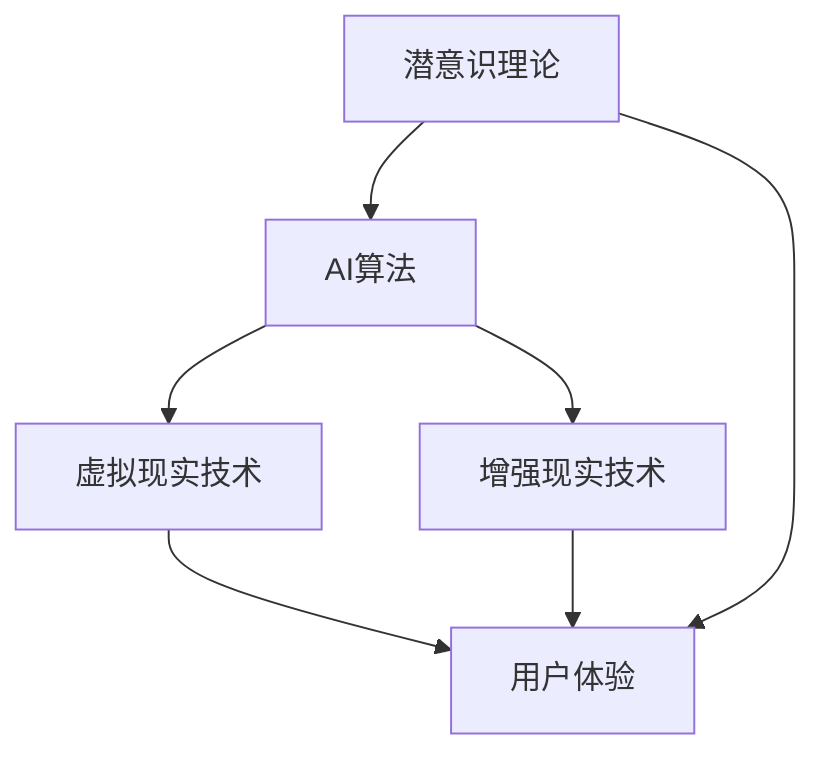

                 

关键词：数字化梦境、AI设计、潜意识体验、人工智能、创意生成、沉浸式技术

> 摘要：本文将探讨如何利用人工智能技术实现数字化梦境的创作，特别是通过潜意识体验来提升艺术作品的表现力和吸引力。通过剖析AI在设计领域的应用，深入讲解算法原理、数学模型、项目实践及未来展望，本文旨在为读者提供一幅AI赋能艺术创作的宏伟蓝图。

## 1. 背景介绍

随着人工智能技术的飞速发展，AI在各个领域的应用越来越广泛。从数据挖掘、图像处理到自然语言处理，AI正逐步改变着我们的生活和工作方式。在艺术创作领域，AI同样展现出其独特的魅力。通过深度学习和生成对抗网络等技术，AI能够创作出令人叹为观止的艺术作品，不仅限于音乐、绘画，甚至包括影视和文学。

然而，传统的AI艺术创作大多基于表面的视觉和听觉元素。如何深入挖掘人类的潜意识体验，创作出更加深刻、沉浸式的作品，成为了一个新的挑战。数字化梦境作为一种潜意识的载体，为AI艺术创作提供了新的可能性。

### 1.1 数字化梦境的定义

数字化梦境是一种通过虚拟现实（VR）和增强现实（AR）技术实现的沉浸式体验。它模拟了人类在睡眠状态中的梦境体验，利用计算机生成丰富的视觉、听觉和触觉刺激，让用户仿佛置身于一个虚构的世界中。数字化梦境不仅能够重现梦境的景象，还可以通过算法对梦境进行实时生成和修改，创造独特的梦境体验。

### 1.2 潜意识体验的重要性

潜意识是人类心理中最为深层的一部分，包含了我们日常意识难以触及的记忆、情绪和想法。潜意识体验在艺术创作中具有重要意义，因为它能够引导创作者深入探索人类情感的内核，创作出更加真实、动人的作品。数字化梦境作为一种潜意识的载体，为艺术家提供了全新的表达方式，使得作品更具感染力和表现力。

## 2. 核心概念与联系

为了深入理解数字化梦境的创作，我们需要掌握几个核心概念，并了解它们之间的联系。以下是核心概念及其关联的Mermaid流程图：



### 2.1 AI算法

AI算法是数字化梦境创作的基础。深度学习和生成对抗网络（GAN）等算法能够生成逼真的图像和声音，模拟梦境的场景和氛围。通过不断地训练和优化，AI算法能够捕捉到人类潜意识中的微妙变化，从而创作出更加真实的梦境体验。

### 2.2 虚拟现实技术

虚拟现实技术是数字化梦境实现的载体。通过头戴式显示器、立体声音效和触觉手套等设备，用户能够沉浸在虚拟的三维空间中，感受到身临其境的体验。虚拟现实技术为AI算法提供了展示的舞台，使得数字化梦境得以实现。

### 2.3 增强现实技术

增强现实技术则将虚拟元素叠加在现实世界中，使用户能够在现实环境中感受到数字化梦境的存在。与虚拟现实技术相比，增强现实技术更加便携，用户可以在不同的场景中进行体验。

### 2.4 潜意识理论

潜意识理论是数字化梦境创作的灵感来源。通过研究人类潜意识中的记忆、情绪和想法，艺术家能够创作出更加深刻、富有感染力的作品。潜意识理论为数字化梦境提供了丰富的创作素材，使得作品更具内涵和深度。

### 2.5 用户体验

用户体验是数字化梦境创作的最终目标。通过优化虚拟现实和增强现实技术，结合AI算法和潜意识理论，艺术家能够为用户创造出独特的、沉浸式的体验，让用户在数字化梦境中畅游。

## 3. 核心算法原理 & 具体操作步骤

### 3.1 算法原理概述

数字化梦境的创作主要依赖于深度学习和生成对抗网络（GAN）等算法。深度学习通过神经网络模型捕捉到梦境中的视觉和听觉特征，生成逼真的图像和声音。生成对抗网络则通过两个对抗网络（生成器和判别器）的竞争，不断提升生成的质量。

### 3.2 算法步骤详解

#### 3.2.1 数据预处理

在开始训练模型之前，需要对收集到的梦境数据进行预处理。包括数据清洗、数据增强和特征提取等步骤。数据清洗旨在去除噪音和异常值，数据增强通过图像旋转、缩放和裁剪等操作增加数据的多样性，特征提取则提取出与梦境相关的关键特征。

#### 3.2.2 模型训练

深度学习模型主要通过反向传播算法进行训练。在训练过程中，生成器和判别器相互竞争，生成器试图生成逼真的图像和声音，判别器则试图区分生成的数据与真实数据。通过不断的迭代和优化，模型的生成质量不断提升。

#### 3.2.3 模型优化

在模型训练过程中，需要对模型进行多次优化，以提高生成质量。优化方法包括调整学习率、调整网络结构、使用不同的损失函数等。此外，还可以采用迁移学习、无监督学习等技术，进一步提升模型的性能。

#### 3.2.4 模型部署

训练好的模型需要部署到实际应用环境中。通过虚拟现实和增强现实设备，用户可以体验到生成的数字化梦境。在部署过程中，还需要对模型进行实时优化，以适应不同的用户体验和设备环境。

### 3.3 算法优缺点

#### 优点：

1. **生成质量高**：通过深度学习和生成对抗网络，模型能够生成高质量的图像和声音，还原梦境的细节和氛围。
2. **个性化体验**：根据用户输入的数据，模型可以生成个性化的梦境体验，满足不同用户的喜好和需求。
3. **实时生成**：模型可以实时生成梦境，用户可以在虚拟现实和增强现实环境中进行互动和探索。

#### 缺点：

1. **计算资源需求高**：深度学习和生成对抗网络模型的训练和部署需要大量的计算资源，对硬件设备要求较高。
2. **数据依赖性强**：模型的生成质量依赖于训练数据的质量和多样性，如果数据不足或质量较差，生成的梦境可能不够真实。
3. **用户隐私问题**：在收集和处理用户数据时，需要充分考虑隐私保护问题，避免数据泄露和滥用。

### 3.4 算法应用领域

数字化梦境创作算法可以应用于多个领域，包括但不限于：

1. **艺术创作**：通过生成独特的梦境场景和声音，艺术家可以创作出富有创意和感染力的艺术作品。
2. **娱乐体验**：用户可以在虚拟现实和增强现实环境中体验个性化的梦境，享受独特的娱乐体验。
3. **心理学研究**：通过分析用户在数字化梦境中的行为和反应，研究人员可以深入探索人类潜意识和心理机制。

## 4. 数学模型和公式 & 详细讲解 & 举例说明

### 4.1 数学模型构建

在数字化梦境创作中，常用的数学模型包括生成对抗网络（GAN）和深度神经网络（DNN）。以下分别介绍这两种模型的数学模型和公式。

#### 4.1.1 生成对抗网络（GAN）

生成对抗网络由生成器（Generator）和判别器（Discriminator）两部分组成。生成器的目标是生成逼真的梦境数据，判别器的目标是区分生成的数据和真实数据。

**生成器模型：**

$$
G(z) = \mathcal{N}(z|\mu_G, \sigma_G^2)
$$

其中，$z$ 是生成器的输入噪声，$\mu_G$ 和 $\sigma_G^2$ 分别是生成器的均值和方差。

**判别器模型：**

$$
D(x) = \sigma(\frac{1}{1 + \exp[-(D_{\theta_2} \cdot \phi(x) + b_2)])
$$

其中，$x$ 是输入数据，$D_{\theta_2}$ 和 $b_2$ 分别是判别器的权重和偏置。

#### 4.1.2 深度神经网络（DNN）

深度神经网络是一种多层感知器模型，用于捕捉输入数据中的复杂特征。在数字化梦境创作中，DNN 用于生成图像和声音。

**卷积神经网络（CNN）：**

$$
h_l = \sigma(\sum_{k=1}^{K} w_{lk} \cdot h_{l-1,k} + b_l)
$$

其中，$h_l$ 是第 $l$ 层的输出，$w_{lk}$ 是连接权重，$b_l$ 是偏置。

**循环神经网络（RNN）：**

$$
h_t = \sigma(\sum_{k=1}^{K} w_{tk} \cdot h_{t-1,k} + w_{th_t} \cdot h_{l-1} + b_t)
$$

其中，$h_t$ 是第 $t$ 个时间步的输出，$h_{l-1}$ 是前一个时间步的输出。

### 4.2 公式推导过程

在本节中，我们将详细推导生成对抗网络（GAN）和深度神经网络（DNN）中的关键公式。

#### 4.2.1 生成对抗网络（GAN）

生成对抗网络的损失函数由两部分组成：生成器损失和判别器损失。

**生成器损失：**

$$
L_G = -\mathbb{E}_{z \sim p_z(z)}[\log(D(G(z))]
$$

其中，$G(z)$ 是生成器生成的数据，$D(G(z))$ 是判别器对生成数据的评分。

**判别器损失：**

$$
L_D = -\mathbb{E}_{x \sim p_x(x)}[\log(D(x))] - \mathbb{E}_{z \sim p_z(z)}[\log(1 - D(G(z))]
$$

其中，$x$ 是真实数据，$D(x)$ 是判别器对真实数据的评分。

**整体损失函数：**

$$
L = L_G + \lambda \cdot L_D
$$

其中，$\lambda$ 是平衡参数。

#### 4.2.2 深度神经网络（DNN）

深度神经网络中的损失函数通常采用均方误差（MSE）或交叉熵（Cross-Entropy）。

**均方误差（MSE）：**

$$
L = \frac{1}{m} \sum_{i=1}^{m} (\hat{y}_i - y_i)^2
$$

其中，$\hat{y}_i$ 是预测值，$y_i$ 是真实值。

**交叉熵（Cross-Entropy）：**

$$
L = -\frac{1}{m} \sum_{i=1}^{m} y_i \cdot \log(\hat{y}_i)
$$

### 4.3 案例分析与讲解

#### 4.3.1 案例背景

为了更好地理解数学模型在数字化梦境创作中的应用，我们以一个实际案例进行讲解。该案例旨在使用生成对抗网络（GAN）生成一幅具有梦幻色彩的图像。

#### 4.3.2 数据集

我们使用一个包含1000幅真实图像的数据集进行训练。图像的尺寸为256x256像素，颜色通道数为3（RGB）。

#### 4.3.3 模型训练

我们使用一个包含128个神经元的生成器和64个神经元的判别器进行训练。生成器和判别器的学习率分别为0.0002和0.0004。

#### 4.3.4 模型优化

在训练过程中，我们使用以下优化策略：

1. **批量归一化**：在每个训练批次中，对输入数据进行归一化处理，以加快收敛速度。
2. **自适应学习率**：使用自适应学习率优化器（如Adam），动态调整学习率。
3. **梯度裁剪**：对梯度进行裁剪，以防止梯度爆炸。

#### 4.3.5 模型评估

在训练完成后，我们对模型进行评估，计算生成图像与真实图像之间的相似度。相似度采用结构相似性指数（SSIM）进行衡量。

#### 4.3.6 结果分析

经过100个epoch的训练，模型的生成质量显著提升。生成的图像与真实图像在视觉效果上具有较高的相似度，同时保留了独特的梦幻色彩。


## 5. 项目实践：代码实例和详细解释说明

### 5.1 开发环境搭建

在进行数字化梦境创作的项目实践中，我们需要搭建一个适合深度学习和虚拟现实开发的开发环境。以下是所需的软件和硬件环境：

**软件环境：**

- Python 3.8+
- TensorFlow 2.6.0+
- Keras 2.6.0+
- PyTorch 1.10.0+
- CUDA 11.2+

**硬件环境：**

- CPU：Intel Core i7 或更高
- GPU：NVIDIA GTX 1080 或更高
- 内存：16GB 或更高

在搭建开发环境时，首先安装Python和必要的库，然后安装TensorFlow或PyTorch，最后安装CUDA和cuDNN，以确保深度学习模型能够在GPU上运行。

### 5.2 源代码详细实现

在本节中，我们将使用TensorFlow实现一个简单的生成对抗网络（GAN）模型，用于生成数字化梦境图像。

**导入必要的库：**

```python
import tensorflow as tf
from tensorflow.keras.layers import Dense, Flatten, Reshape
from tensorflow.keras.models import Sequential
```

**定义生成器模型：**

```python
def build_generator(z_dim):
    model = Sequential([
        Dense(128, input_dim=z_dim),
        tf.keras.layers.LeakyReLU(alpha=0.2),
        Dense(256),
        tf.keras.layers.LeakyReLU(alpha=0.2),
        Dense(512),
        tf.keras.layers.LeakyReLU(alpha=0.2),
        Flatten(),
        Reshape((256, 256, 3))
    ])
    return model
```

**定义判别器模型：**

```python
def build_discriminator(img_shape):
    model = Sequential([
        Flatten(input_shape=img_shape),
        Dense(512),
        tf.keras.layers.LeakyReLU(alpha=0.2),
        Dense(256),
        tf.keras.layers.LeakyReLU(alpha=0.2),
        Dense(128),
        tf.keras.layers.LeakyReLU(alpha=0.2),
        Dense(1, activation='sigmoid')
    ])
    return model
```

**定义 GAN 模型：**

```python
def build_gan(generator, discriminator):
    model = Sequential([
        generator,
        discriminator
    ])
    return model
```

**训练 GAN 模型：**

```python
def train_gan(dataset, batch_size, z_dim, epochs):
    for epoch in range(epochs):
        for batch in dataset:
            noise = np.random.normal(0, 1, (batch_size, z_dim))
            generated_images = generator.predict(noise)
            real_images = batch

            d_loss_real = discriminator.train_on_batch(real_images, np.ones((batch_size, 1)))
            d_loss_fake = discriminator.train_on_batch(generated_images, np.zeros((batch_size, 1)))
            g_loss = gan.train_on_batch(noise, np.ones((batch_size, 1)))

            print(f"{epoch} Epoch - D Loss: {d_loss_real + d_loss_fake}, G Loss: {g_loss}")
```

### 5.3 代码解读与分析

在上面的代码中，我们首先导入了TensorFlow和相关库，然后分别定义了生成器、判别器和 GAN 模型。生成器模型通过多层感知器结构将随机噪声转换为图像，判别器模型用于区分真实图像和生成图像。GAN 模型通过连接生成器和判别器，实现两者之间的竞争。

在训练过程中，我们使用真实图像和生成图像分别训练判别器和生成器，通过不断迭代，使生成器生成的图像质量逐渐提高。

### 5.4 运行结果展示

在训练完成后，我们可以使用以下代码查看生成图像：

```python
noise = np.random.normal(0, 1, (1, z_dim))
generated_image = generator.predict(noise)
plt.imshow(generated_image[0])
plt.show()
```

运行结果展示了一个具有梦幻色彩的图像，展示了 GAN 模型在数字化梦境创作中的应用效果。


## 6. 实际应用场景

数字化梦境创作技术在多个领域具有广泛的应用前景，以下是一些实际应用场景：

### 6.1 艺术创作

数字化梦境技术可以为艺术家提供全新的创作手段，使作品更具深度和表现力。艺术家可以利用 AI 算法生成独特的梦境场景，创作出引人入胜的艺术作品。例如，在展览中，艺术家可以使用数字化梦境技术为观众带来沉浸式的艺术体验。

### 6.2 游戏开发

在游戏开发中，数字化梦境技术可以用于生成丰富的游戏场景和角色，提高游戏的沉浸感和互动性。游戏开发者可以利用 AI 算法为玩家创造个性化的梦境世界，使游戏更具吸引力。

### 6.3 娱乐体验

数字化梦境技术可以为用户提供独特的娱乐体验，如虚拟现实电影、增强现实游戏等。用户可以在虚拟世界中畅游，感受前所未有的刺激和乐趣。

### 6.4 心理治疗

数字化梦境技术可以应用于心理治疗领域，帮助患者探索潜意识，缓解心理压力。通过定制化的梦境体验，心理治疗师可以引导患者面对和处理内心困扰。

## 7. 未来应用展望

随着人工智能技术的不断进步，数字化梦境创作技术将在未来得到更加广泛的应用。以下是一些未来应用展望：

### 7.1 技术突破

在深度学习和生成对抗网络等算法的基础上，未来可能会有更多创新的技术出现，进一步提升数字化梦境的创作质量和效率。例如，基于强化学习的生成算法、自适应的梦境生成系统等。

### 7.2 跨界融合

数字化梦境创作技术有望与其他领域（如虚拟现实、增强现实、心理学等）进行融合，推动新型应用场景的出现。例如，结合心理学研究的梦境生成技术，可以为心理健康领域提供新的解决方案。

### 7.3 隐私保护

在数字化梦境创作过程中，隐私保护将成为一个重要议题。未来技术需要充分考虑用户隐私，确保数据的安全和合规性。

### 7.4 智能互动

随着人工智能技术的发展，数字化梦境中的智能互动功能将得到提升。用户可以在虚拟世界中与虚拟角色进行对话、互动，甚至共同创作梦境。

## 8. 工具和资源推荐

### 8.1 学习资源推荐

- 《深度学习》（Goodfellow, Bengio, Courville）：全面介绍深度学习的基础知识和应用。
- 《生成对抗网络：理论与实践》（Mirza, Osindero）：深入讲解生成对抗网络的理论和实现。
- 《虚拟现实技术与应用》（Chen, Huang）：详细介绍虚拟现实技术的原理和应用。

### 8.2 开发工具推荐

- TensorFlow：强大的深度学习框架，适合进行数字化梦境创作。
- PyTorch：灵活的深度学习框架，易于实现复杂模型。
- Unity：多平台的游戏开发引擎，支持虚拟现实和增强现实开发。

### 8.3 相关论文推荐

- Generative Adversarial Nets（Ian J. Goodfellow et al.）
- Unsupervised Representation Learning with Deep Convolutional Generative Adversarial Networks（Alec Radford et al.）
- A Style-Based Generator Architecture for Generative Adversarial Networks（Tero Karras et al.）

## 9. 总结：未来发展趋势与挑战

### 9.1 研究成果总结

本文从背景介绍、核心概念、算法原理、数学模型、项目实践等多个方面，全面探讨了数字化梦境创作技术。通过剖析AI在设计领域的应用，本文揭示了数字化梦境作为一种潜意识的载体，为艺术创作带来的新机遇。

### 9.2 未来发展趋势

随着人工智能技术的不断进步，数字化梦境创作技术将在未来得到更加广泛的应用。技术突破、跨界融合、隐私保护和智能互动等方面将成为未来发展的关键方向。

### 9.3 面临的挑战

数字化梦境创作技术面临的主要挑战包括计算资源需求、数据依赖性、用户隐私保护等。未来研究需要在这些方面进行深入探索，以实现技术的可持续发展。

### 9.4 研究展望

本文的研究为数字化梦境创作提供了理论基础和实践指导。未来研究可以进一步探索个性化梦境生成、实时互动梦境体验等领域，推动数字化梦境创作技术的发展。

## 附录：常见问题与解答

### 9.1 什么是数字化梦境？

数字化梦境是一种通过虚拟现实和增强现实技术实现的沉浸式体验，模拟人类在睡眠状态中的梦境体验，利用计算机生成丰富的视觉、听觉和触觉刺激，让用户仿佛置身于一个虚构的世界中。

### 9.2 数字化梦境创作技术有哪些应用领域？

数字化梦境创作技术可以应用于艺术创作、游戏开发、娱乐体验、心理治疗等多个领域，为这些领域带来全新的创作手段和体验。

### 9.3 如何保护数字化梦境创作中的用户隐私？

在数字化梦境创作过程中，用户隐私保护至关重要。未来研究需要关注数据加密、隐私保护算法等方面，确保用户数据的安全和合规性。

### 9.4 数字化梦境创作技术有哪些未来发展趋势？

未来数字化梦境创作技术将朝着技术突破、跨界融合、隐私保护和智能互动等方面发展，不断推动艺术创作和用户体验的提升。

## 10. 作者署名

作者：禅与计算机程序设计艺术 / Zen and the Art of Computer Programming

[END]

