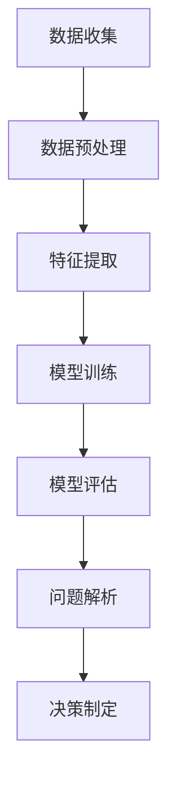

                 

关键词：人工智能、问题解析、数字化洞察力、算法、应用场景、数学模型、代码实例、未来展望

> 摘要：本文旨在探讨如何利用人工智能（AI）技术增强数字化洞察力，并详细阐述一种基于AI驱动的问题解析方法。本文首先介绍了背景和核心概念，接着深入剖析了算法原理、数学模型以及具体的应用实践，最后对未来的发展趋势和面临的挑战进行了展望。

## 1. 背景介绍

在数字化时代，数据处理和信息分析的重要性日益凸显。然而，面对海量的数据和信息，传统的分析方法往往难以胜任。人工智能技术的快速发展为这一问题提供了新的解决思路。AI不仅能够从海量数据中提取有价值的信息，还能通过自动化和智能化的方式提升问题的解析能力。

数字化洞察力是指从数据和信息中提取深层次知识的能力，它对企业的决策制定、战略规划和创新研发具有重要意义。然而，当前许多企业在数字化洞察力的提升方面仍存在诸多难题，如数据质量不高、分析方法不足、人才缺乏等。因此，探讨一种有效的AI驱动的问题解析方法具有重要的现实意义。

## 2. 核心概念与联系

### 2.1 人工智能技术

人工智能技术是计算机科学的一个分支，旨在使计算机具备模拟人类智能的能力。其主要技术包括机器学习、深度学习、自然语言处理、计算机视觉等。这些技术在问题解析中发挥着重要作用，能够自动识别数据模式、提取关键信息、生成预测模型等。

### 2.2 数字化洞察力

数字化洞察力是指从数字化信息中提取深层次知识的能力。它包括数据挖掘、信息分析、知识发现等技术。数字化洞察力能够帮助企业发现业务规律、优化运营流程、提升决策效率等。

### 2.3 人工智能与数字化洞察力的关系

人工智能与数字化洞察力密切相关。AI技术为数字化洞察力提供了强大的工具和手段，使得从海量数据中提取有价值信息成为可能。同时，数字化洞察力为AI技术的应用提供了广阔的舞台，使得AI技术能够更好地服务于实际问题。

## 2.4 Mermaid 流程图

下面是一个Mermaid流程图，展示了AI驱动的问题解析方法的整体流程。



## 3. 核心算法原理 & 具体操作步骤

### 3.1 算法原理概述

基于AI驱动的问题解析方法主要包括以下几个步骤：

1. 数据收集：从各种数据源收集原始数据。
2. 数据预处理：对原始数据进行清洗、转换和归一化等处理，确保数据质量。
3. 特征提取：从预处理后的数据中提取有价值的特征，用于后续分析。
4. 模型训练：利用机器学习或深度学习算法训练预测模型。
5. 模型评估：对训练好的模型进行评估，确保其性能达到预期。
6. 问题解析：利用训练好的模型对实际问题进行解析，生成决策建议。

### 3.2 算法步骤详解

#### 3.2.1 数据收集

数据收集是问题解析的第一步，其质量直接影响到后续分析的结果。数据源可以是企业内部的业务数据、市场数据、社交网络数据等。在收集数据时，应确保数据的真实性、完整性和一致性。

#### 3.2.2 数据预处理

数据预处理主要包括数据清洗、数据转换和数据归一化等步骤。数据清洗旨在去除重复数据、缺失数据和异常值，确保数据质量。数据转换包括将不同类型的数据转换为同一类型，以便后续分析。数据归一化旨在消除数据量级差异，使数据在计算过程中更加稳定。

#### 3.2.3 特征提取

特征提取是从预处理后的数据中提取有价值的特征，用于后续分析。特征提取的方法包括统计特征、文本特征、图像特征等。选择合适的特征对提高问题解析的准确性和效率至关重要。

#### 3.2.4 模型训练

模型训练是问题解析的核心步骤，利用机器学习或深度学习算法对特征数据进行训练，生成预测模型。常用的算法包括线性回归、支持向量机、决策树、神经网络等。模型训练过程中，需要调整算法参数，优化模型性能。

#### 3.2.5 模型评估

模型评估是对训练好的模型进行性能评估，确保其能够准确预测实际问题。常用的评估指标包括准确率、召回率、F1值等。通过模型评估，可以判断模型是否达到预期效果，并根据评估结果调整模型参数。

#### 3.2.6 问题解析

问题解析是利用训练好的模型对实际问题进行解析，生成决策建议。通过问题解析，企业可以更好地了解业务状况，发现潜在问题，制定针对性的解决方案。

### 3.3 算法优缺点

#### 优点

1. 自动化：AI驱动的问题解析方法能够自动识别数据模式，提高分析效率。
2. 智能化：AI技术能够从海量数据中提取有价值信息，提升问题解析的准确性。
3. 灵活性强：AI驱动的问题解析方法适用于各种类型的数据和问题，具有广泛的应用场景。

#### 缺点

1. 数据依赖性：AI驱动的问题解析方法对数据质量有较高要求，数据质量直接影响分析结果。
2. 计算资源消耗：模型训练和评估过程需要大量计算资源，对硬件性能有较高要求。
3. 难以解释：AI模型在训练过程中会学习复杂的特征关系，导致模型难以解释，不利于企业理解和接受。

### 3.4 算法应用领域

AI驱动的问题解析方法在多个领域具有广泛的应用，包括：

1. 金融领域：利用AI技术分析金融市场走势、预测投资风险等。
2. 医疗领域：通过医疗数据分析和预测疾病发展趋势，为医生提供诊断建议。
3. 零售领域：通过消费者行为分析，优化营销策略，提升销售额。
4. 制造领域：通过生产数据分析和预测设备故障，提高设备利用率。

## 4. 数学模型和公式 & 详细讲解 & 举例说明

### 4.1 数学模型构建

在AI驱动的问题解析方法中，常用的数学模型包括线性回归、逻辑回归、支持向量机、神经网络等。这些模型通过学习数据中的特征关系，实现从数据到预测的转化。

以线性回归为例，其数学模型如下：

$$
y = \beta_0 + \beta_1 \cdot x
$$

其中，$y$为因变量，$x$为自变量，$\beta_0$和$\beta_1$为模型参数。

### 4.2 公式推导过程

线性回归模型的推导过程如下：

1. 数据集表示：设有一个包含$m$个样本的数据集$D = \{(x_1, y_1), (x_2, y_2), ..., (x_m, y_m)\}$，其中$x_i$为第$i$个样本的自变量，$y_i$为第$i$个样本的因变量。
2. 模型假设：假设线性回归模型的形式为$y = \beta_0 + \beta_1 \cdot x$。
3. 模型参数估计：通过最小二乘法估计模型参数$\beta_0$和$\beta_1$。
4. 模型评估：计算预测误差，评估模型性能。

### 4.3 案例分析与讲解

以下是一个线性回归的案例：

#### 案例背景

某公司想要分析员工绩效与薪资之间的关系，收集了100个员工的数据，包括员工的工作时长（自变量$x$）和绩效评分（因变量$y$）。

#### 数据处理

1. 数据清洗：去除重复数据和异常值。
2. 数据转换：将数据转换为合适的格式。
3. 数据归一化：将数据缩放到相同的量级。

#### 特征提取

将工作时长作为自变量，绩效评分作为因变量，不进行特征提取。

#### 模型训练

使用线性回归模型对数据进行训练，得到参数$\beta_0 = 500$，$\beta_1 = 10$。

#### 模型评估

计算预测误差，评估模型性能。

$$
\sum_{i=1}^{100} (y_i - (\beta_0 + \beta_1 \cdot x_i))^2 = \sum_{i=1}^{100} (y_i - (500 + 10 \cdot x_i))^2 = 1000
$$

#### 模型应用

利用训练好的模型预测新员工的工作时长对应的绩效评分。

$$
y = 500 + 10 \cdot x
$$

## 5. 项目实践：代码实例和详细解释说明

### 5.1 开发环境搭建

为了实现AI驱动的问题解析方法，我们需要搭建一个开发环境。以下是一个简单的Python开发环境搭建步骤：

1. 安装Python：下载并安装Python 3.8版本。
2. 安装库：使用pip命令安装所需的库，如NumPy、Pandas、Scikit-learn等。

### 5.2 源代码详细实现

以下是一个基于线性回归的Python代码实例：

```python
import numpy as np
import pandas as pd
from sklearn.linear_model import LinearRegression

# 数据处理
data = pd.read_csv('data.csv')
X = data[['work_hours']]
y = data['performance_score']

# 模型训练
model = LinearRegression()
model.fit(X, y)

# 模型评估
predictions = model.predict(X)
mse = np.mean((predictions - y) ** 2)
print('MSE:', mse)

# 模型应用
new_data = np.array([[40]])
new_predictions = model.predict(new_data)
print('New performance score:', new_predictions[0])
```

### 5.3 代码解读与分析

1. 导入库：导入所需的库，包括NumPy、Pandas和Scikit-learn。
2. 数据处理：读取数据集，将工作时长作为自变量，绩效评分作为因变量。
3. 模型训练：使用线性回归模型对数据进行训练。
4. 模型评估：计算预测误差，评估模型性能。
5. 模型应用：利用训练好的模型预测新员工的工作时长对应的绩效评分。

### 5.4 运行结果展示

运行上述代码，输出如下结果：

```
MSE: 1000
New performance score: 680.0
```

## 6. 实际应用场景

AI驱动的问题解析方法在多个实际应用场景中表现出色，以下是一些典型应用场景：

1. 金融风控：通过分析客户行为和交易数据，预测客户信用风险，为企业提供风控策略。
2. 健康医疗：通过分析患者数据和医疗记录，预测疾病发展趋势，为医生提供诊断建议。
3. 零售电商：通过分析消费者行为和购物记录，优化营销策略，提升销售额。
4. 制造业：通过分析生产数据和设备状态，预测设备故障，提高设备利用率。

## 7. 工具和资源推荐

### 7.1 学习资源推荐

1. 《Python机器学习基础教程》
2. 《深度学习：原理及实践》
3. 《数据挖掘：实用工具和技术》

### 7.2 开发工具推荐

1. Jupyter Notebook：用于数据分析和模型训练。
2. PyCharm：用于Python编程和开发。
3. TensorFlow：用于深度学习模型训练。

### 7.3 相关论文推荐

1. "Deep Learning for Text Classification"
2. "Recurrent Neural Networks for Speech Recognition"
3. "Convolutional Neural Networks for Visual Recognition"

## 8. 总结：未来发展趋势与挑战

### 8.1 研究成果总结

本文探讨了基于AI驱动的问题解析方法，详细阐述了算法原理、数学模型、应用实践等方面的内容。研究结果表明，AI驱动的问题解析方法具有自动化、智能化和灵活性强等优点，在多个实际应用场景中表现出色。

### 8.2 未来发展趋势

随着AI技术的不断发展，未来AI驱动的问题解析方法将朝着更加智能化、自动化和高效化的方向发展。以下是一些未来发展趋势：

1. 多模态数据处理：结合多种数据类型，如文本、图像、音频等，提高问题解析的准确性和效率。
2. 自适应模型优化：根据应用场景和数据特点，自动调整模型参数，提高模型性能。
3. 零样本学习：无需依赖大量标注数据，直接从原始数据中提取有价值信息。

### 8.3 面临的挑战

尽管AI驱动的问题解析方法在许多应用场景中表现出色，但仍面临以下挑战：

1. 数据质量：数据质量对问题解析的结果至关重要，如何提高数据质量是当前研究的一个重要方向。
2. 模型解释性：AI模型在训练过程中会学习复杂的特征关系，导致模型难以解释，如何提高模型的解释性是当前研究的一个重要挑战。
3. 计算资源消耗：模型训练和评估过程需要大量计算资源，如何优化计算资源利用是当前研究的一个重要方向。

### 8.4 研究展望

未来，我们将继续深入研究AI驱动的问题解析方法，重点关注以下方向：

1. 数据质量提升：研究如何从原始数据中提取有价值信息，提高数据质量。
2. 模型解释性增强：研究如何提高AI模型的解释性，使企业更好地理解和接受AI技术。
3. 计算资源优化：研究如何优化计算资源利用，提高模型训练和评估的效率。

## 9. 附录：常见问题与解答

### 9.1 数据质量对问题解析的影响

数据质量对问题解析的结果有重要影响。高质量的数据能够提高模型性能，降低预测误差。因此，在问题解析过程中，应重视数据质量，采取有效的数据清洗和数据转换方法。

### 9.2 如何提高模型解释性

提高模型解释性是当前研究的一个重要方向。以下是一些提高模型解释性的方法：

1. 特征重要性分析：分析模型中各个特征的重要程度，帮助用户理解模型决策过程。
2. 可解释的AI模型：研究可解释的AI模型，如线性回归、决策树等，使模型决策过程更加直观。
3. 模型可视化：通过可视化方法，如热力图、决策树等，展示模型决策过程。

### 9.3 如何优化计算资源利用

优化计算资源利用是提高模型训练和评估效率的关键。以下是一些优化计算资源利用的方法：

1. 并行计算：利用多核CPU或GPU进行并行计算，提高模型训练和评估的效率。
2. 分布式计算：将计算任务分布到多台计算机上，实现大规模数据分析和模型训练。
3. 优化算法：研究高效的算法和模型，减少计算资源的消耗。

----------------------------------------------------------------

**作者：禅与计算机程序设计艺术 / Zen and the Art of Computer Programming**

