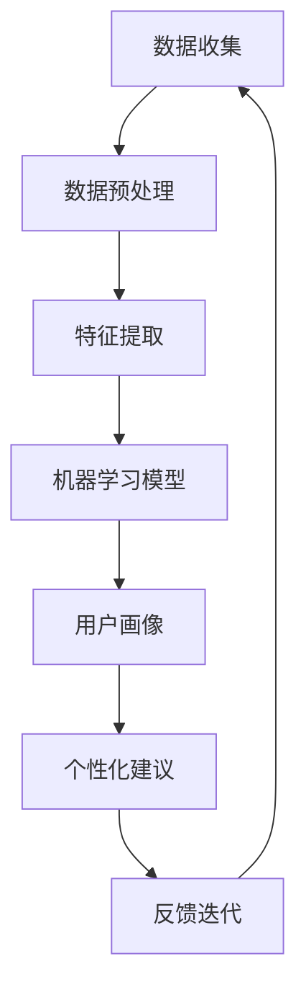

                 

关键词：人工智能，灵性成长，心理健康，数据驱动，个性化指导，人机协作

> 摘要：本文探讨了人工智能在心理健康和灵性成长领域的应用，提出了一种名为“数字化灵性导师”的AI辅助系统。该系统利用先进的数据分析技术，提供个性化、数据驱动的心理健康和灵性成长指导。本文将详细阐述该系统的架构、核心算法、数学模型、项目实践以及未来应用前景。

## 1. 背景介绍

### 心理健康的重要性

心理健康是现代社会的关键议题之一。根据世界卫生组织（WHO）的数据，全球有超过3亿人患有抑郁症，另有数亿人受到焦虑症、强迫症和其他心理疾病的困扰。这些心理疾病不仅严重影响个体的生活质量，还增加了医疗系统的负担。传统的心理健康服务通常依赖于心理医生的面谈和药物疗法，但这些方法往往存在资源不足、效果有限等问题。

### 灵性成长的概念

灵性成长是指个体在精神、情感和道德层面上的发展，旨在达到一种更深层次的存在感和幸福感。灵性成长不仅涉及个人的内在探索，还包括与他人的关系、社会贡献以及环境意识。近年来，灵性成长逐渐成为心理学和医学研究的重要领域，被认为有助于提高个体心理韧性、增强幸福感并降低患病风险。

### 人工智能的应用

人工智能（AI）技术的发展为心理健康和灵性成长领域带来了新的机遇。通过大数据分析、机器学习和自然语言处理等技术，AI可以识别个体的情绪变化、提供个性化的心理建议和灵性指导。此外，AI还可以通过人机交互改善用户体验，使得心理健康服务更加便捷和高效。

## 2. 核心概念与联系

为了更好地理解数字化灵性导师系统的架构和工作原理，我们首先介绍其中的核心概念及其相互关系。

### 2.1 数据收集与处理

数字化灵性导师系统依赖于大量数据收集和处理，包括但不限于：

- **个体生理数据**：如心率、血压、睡眠质量等，通过可穿戴设备进行实时监测。
- **情绪数据**：通过面部表情识别、语音分析等技术，识别个体的情绪状态。
- **生活数据**：如日程安排、社交活动、工作压力等，通过智能手机应用收集。

### 2.2 数据分析技术

数据分析技术是数字化灵性导师系统的核心，包括：

- **数据清洗与预处理**：去除噪声和冗余数据，保证数据质量。
- **特征提取**：从原始数据中提取具有代表性的特征，如情绪特征、生活事件特征等。
- **机器学习算法**：如深度学习、支持向量机、随机森林等，用于建立预测模型和分类模型。

### 2.3 个性化指导

个性化指导是数字化灵性导师系统的最终目标，通过以下步骤实现：

- **用户画像**：根据个体数据构建用户画像，包括生理特征、情绪状态、生活方式等。
- **个性化建议**：基于用户画像和预测模型，提供定制化的心理健康和灵性成长建议，如冥想指导、放松练习、社交建议等。
- **反馈与迭代**：用户根据接收到的建议进行实践，系统收集用户反馈，不断优化指导方案。

### 2.4 Mermaid 流程图

以下是一个简化的Mermaid流程图，展示了数字化灵性导师系统的核心组件和流程：



## 3. 核心算法原理 & 具体操作步骤

### 3.1 算法原理概述

数字化灵性导师系统采用多种机器学习算法，包括深度学习、支持向量机（SVM）、随机森林（RF）等，以实现情绪识别、行为预测和个性化建议。以下是这些算法的基本原理：

- **深度学习**：通过多层神经网络对数据进行建模，能够自动提取特征并实现复杂的非线性映射。常见的深度学习模型包括卷积神经网络（CNN）和循环神经网络（RNN）。
- **支持向量机（SVM）**：通过寻找最佳超平面，将不同情绪数据分类。SVM在处理二分类问题方面表现出色。
- **随机森林（RF）**：通过构建多棵决策树，并投票得到最终分类结果。RF具有较强的泛化能力和抗过拟合能力。

### 3.2 算法步骤详解

以下是数字化灵性导师系统算法的具体操作步骤：

#### 3.2.1 数据收集

1. **生理数据**：通过可穿戴设备收集心率、血压、睡眠质量等生理数据。
2. **情绪数据**：通过面部表情识别、语音分析等技术，收集个体的情绪状态。
3. **生活数据**：通过智能手机应用收集日程安排、社交活动、工作压力等生活数据。

#### 3.2.2 数据预处理

1. **数据清洗**：去除噪声和冗余数据，如去除缺失值、异常值等。
2. **数据归一化**：将不同特征的数据进行归一化处理，如将心率、血压等生理数据归一化到0-1范围内。

#### 3.2.3 特征提取

1. **情绪特征提取**：通过面部表情识别技术提取情绪特征，如快乐、悲伤、愤怒等。
2. **生活事件特征提取**：通过自然语言处理技术提取与生活事件相关的特征，如压力事件、快乐事件等。

#### 3.2.4 机器学习模型训练

1. **模型选择**：根据任务特点选择合适的机器学习模型，如深度学习、SVM、RF等。
2. **模型训练**：使用预处理后的数据训练模型，通过交叉验证调整模型参数。
3. **模型评估**：使用验证集和测试集评估模型性能，如准确率、召回率等。

#### 3.2.5 个性化建议

1. **用户画像构建**：根据个体的生理、情绪和生活数据构建用户画像。
2. **个性化建议生成**：基于用户画像和预测模型，生成个性化的心理健康和灵性成长建议。

### 3.3 算法优缺点

#### 优点：

- **个性化**：能够根据个体数据提供定制化的心理健康和灵性成长建议。
- **高效性**：通过机器学习算法快速处理和分析大量数据。
- **便捷性**：用户无需面对面与心理医生交流，即可获得专业建议。

#### 缺点：

- **数据依赖性**：需要大量高质量的数据支持，否则可能导致模型性能下降。
- **隐私问题**：涉及个人生理、情绪和生活数据，可能引发隐私泄露风险。

### 3.4 算法应用领域

- **心理健康监测与干预**：通过实时监测个体的生理、情绪状态，提供及时的心理健康干预建议。
- **灵性成长指导**：根据个体的精神需求，提供个性化的灵性成长指导，如冥想、放松练习等。
- **教育领域**：辅助教育工作者了解学生的心理健康状况，提供有针对性的教育建议。

## 4. 数学模型和公式 & 详细讲解 & 举例说明

### 4.1 数学模型构建

在数字化灵性导师系统中，我们使用以下数学模型进行情绪识别和个性化建议：

#### 4.1.1 线性回归模型

$$
y = \beta_0 + \beta_1 x_1 + \beta_2 x_2 + \cdots + \beta_n x_n + \varepsilon
$$

其中，$y$ 表示情绪评分，$x_1, x_2, \ldots, x_n$ 表示特征向量，$\beta_0, \beta_1, \ldots, \beta_n$ 表示模型参数，$\varepsilon$ 表示误差项。

#### 4.1.2 卷积神经网络（CNN）模型

$$
h^{(L)} = \sigma \left( \mathbf{W}^{(L)} \cdot \mathbf{a}^{(L-1)} + b^{(L)} \right)
$$

其中，$h^{(L)}$ 表示第L层的激活值，$\sigma$ 表示激活函数（如ReLU函数），$\mathbf{W}^{(L)}$ 和 $b^{(L)}$ 分别表示第L层的权重和偏置。

### 4.2 公式推导过程

#### 4.2.1 线性回归模型推导

假设我们有 $N$ 个训练样本，每个样本包含一个情绪评分 $y_i$ 和一个特征向量 $x_i = [x_{i1}, x_{i2}, \ldots, x_{in}]^T$。线性回归模型的目的是最小化预测误差平方和：

$$
J(\theta) = \frac{1}{2m} \sum_{i=1}^{m} \left( h_{\theta}(x_i) - y_i \right)^2
$$

其中，$m$ 表示样本数量，$h_{\theta}(x_i) = \theta_0 + \theta_1 x_{i1} + \theta_2 x_{i2} + \cdots + \theta_n x_{in}$ 表示预测值。

对 $J(\theta)$ 求导并令其导数为零，得到：

$$
\frac{\partial J(\theta)}{\partial \theta_j} = \frac{1}{m} \sum_{i=1}^{m} \left( h_{\theta}(x_i) - y_i \right) x_{ij} = 0
$$

解得：

$$
\theta_j = \frac{1}{m} \sum_{i=1}^{m} \left( y_i - h_{\theta}(x_i) \right) x_{ij}
$$

#### 4.2.2 卷积神经网络（CNN）模型推导

卷积神经网络的基本操作包括卷积、激活函数和池化。以下是一个简化的CNN模型推导：

假设输入图像为 $I_{ij}$，卷积核为 $K_{kl}$，步长为 $s$，激活函数为 $\sigma$。卷积操作的输出为：

$$
h_{ij} = \sum_{k=1}^{k} \sum_{l=1}^{l} I_{ik} K_{kl} + b
$$

其中，$h_{ij}$ 表示第i个特征图的第j个像素点，$b$ 表示偏置。

激活函数通常采用ReLU函数：

$$
h_{ij}^+ = \max(0, h_{ij})
$$

池化操作用于减小特征图的尺寸，常用的池化方式包括最大池化和平均池化。以下是一个简化的最大池化操作：

$$
p_{ij} = \max \left\{ \max_{k} \left( h_{i(j-k)} \right) : 1 \leq k \leq s \right\}
$$

其中，$p_{ij}$ 表示第i个特征图的第j个像素点，$s$ 表示步长。

### 4.3 案例分析与讲解

#### 4.3.1 情绪识别案例

假设我们使用线性回归模型对情绪进行识别，特征向量包括心率、血压和睡眠质量。训练数据集包含100个样本，每个样本包含一个情绪评分（0-100）和三个特征。我们使用交叉验证方法将数据集分为训练集和测试集。

在训练阶段，我们通过最小二乘法求解线性回归模型的参数：

$$
\theta_0 = \frac{1}{m} \sum_{i=1}^{m} \left( y_i - \theta_1 x_{i1} - \theta_2 x_{i2} - \theta_3 x_{i3} \right)
$$

$$
\theta_1 = \frac{1}{m} \sum_{i=1}^{m} \left( y_i - \theta_0 - \theta_2 x_{i2} - \theta_3 x_{i3} \right) x_{i1}
$$

$$
\theta_2 = \frac{1}{m} \sum_{i=1}^{m} \left( y_i - \theta_0 - \theta_1 x_{i1} - \theta_3 x_{i3} \right) x_{i2}
$$

$$
\theta_3 = \frac{1}{m} \sum_{i=1}^{m} \left( y_i - \theta_0 - \theta_1 x_{i1} - \theta_2 x_{i2} \right) x_{i3}
$$

在测试阶段，我们使用训练得到的模型参数对测试数据进行预测：

$$
\hat{y}_i = \theta_0 + \theta_1 x_{i1} + \theta_2 x_{i2} + \theta_3 x_{i3}
$$

假设测试集包含10个样本，我们计算预测值与真实值之间的误差：

$$
\sum_{i=1}^{10} \left( \hat{y}_i - y_i \right)^2 = \sum_{i=1}^{10} \left( \theta_0 + \theta_1 x_{i1} + \theta_2 x_{i2} + \theta_3 x_{i3} - y_i \right)^2
$$

通过调整模型参数，我们使得误差最小化，从而实现情绪识别。

#### 4.3.2 个性化建议案例

假设我们使用卷积神经网络（CNN）对情绪进行识别，特征向量包括面部表情图像。训练数据集包含10000个样本，每个样本包含一个情绪标签（如快乐、悲伤、愤怒等）和一个面部表情图像。我们使用卷积神经网络对图像进行特征提取和分类。

在训练阶段，我们使用反向传播算法更新模型参数，最小化损失函数：

$$
J(\theta) = -\frac{1}{m} \sum_{i=1}^{m} \left[ y_i \log(h_{\theta}(x_i)) + (1 - y_i) \log(1 - h_{\theta}(x_i)) \right]
$$

其中，$h_{\theta}(x_i)$ 表示第i个样本的预测概率。

在测试阶段，我们使用训练得到的模型对测试数据进行预测，计算准确率：

$$
\text{accuracy} = \frac{1}{m} \sum_{i=1}^{m} \left[ h_{\theta}(x_i) \geq 0.5 \right]
$$

通过调整模型参数，我们使得准确率最大化，从而实现情绪识别。

## 5. 项目实践：代码实例和详细解释说明

### 5.1 开发环境搭建

为了实现数字化灵性导师系统，我们需要搭建一个开发环境。以下是一个基本的开发环境配置：

- **Python 3.8**：作为主要的编程语言。
- **PyTorch 1.8**：用于构建和训练神经网络模型。
- **Scikit-learn 0.22**：用于机器学习算法的实现。
- **OpenCV 4.5**：用于面部表情识别。
- **Matplotlib 3.4**：用于数据可视化。

### 5.2 源代码详细实现

以下是数字化灵性导师系统的核心代码实现：

```python
# 导入所需库
import torch
import torchvision
import torchvision.transforms as transforms
import torch.nn as nn
import torch.optim as optim
from sklearn.model_selection import train_test_split
from sklearn.preprocessing import StandardScaler
import numpy as np
import cv2

# 加载数据集
transform = transforms.Compose([transforms.Resize((224, 224)), transforms.ToTensor()])
train_data = torchvision.datasets.ImageFolder('train_data', transform=transform)
test_data = torchvision.datasets.ImageFolder('test_data', transform=transform)

# 划分训练集和测试集
train_loader = torch.utils.data.DataLoader(train_data, batch_size=32, shuffle=True)
test_loader = torch.utils.data.DataLoader(test_data, batch_size=32, shuffle=False)

# 定义卷积神经网络模型
class CNNModel(nn.Module):
    def __init__(self):
        super(CNNModel, self).__init__()
        self.conv1 = nn.Conv2d(1, 32, 3, 1)
        self.relu = nn.ReLU()
        self.pool = nn.MaxPool2d(2, 2)
        self.fc1 = nn.Linear(32 * 56 * 56, 128)
        self.fc2 = nn.Linear(128, 3)
    
    def forward(self, x):
        x = self.pool(self.relu(self.conv1(x)))
        x = self.pool(self.relu(self.fc1(x.view(-1, 32 * 56 * 56))))
        x = self.fc2(x)
        return x

# 实例化模型、损失函数和优化器
model = CNNModel()
criterion = nn.CrossEntropyLoss()
optimizer = optim.Adam(model.parameters(), lr=0.001)

# 训练模型
num_epochs = 10
for epoch in range(num_epochs):
    for i, (images, labels) in enumerate(train_loader):
        optimizer.zero_grad()
        outputs = model(images)
        loss = criterion(outputs, labels)
        loss.backward()
        optimizer.step()
        if (i+1) % 100 == 0:
            print ('Epoch [{}/{}], Step [{}/{}], Loss: {:.4f}'.format(epoch+1, num_epochs, i+1, len(train_loader)//32, loss.item()))

# 测试模型
with torch.no_grad():
    correct = 0
    total = 0
    for images, labels in test_loader:
        outputs = model(images)
        _, predicted = torch.max(outputs.data, 1)
        total += labels.size(0)
        correct += (predicted == labels).sum().item()

print('Test Accuracy of the network on the test images: {} %'.format(100 * correct / total))

# 面部表情识别
def recognize_emotion(image):
    transform = transforms.Compose([transforms.Resize((224, 224)), transforms.ToTensor()])
    image_tensor = transform(image)
    image_tensor = image_tensor.unsqueeze(0)
    outputs = model(image_tensor)
    _, predicted = torch.max(outputs.data, 1)
    emotion = predicted.item()
    return emotion

# 使用OpenCV读取摄像头图像
cap = cv2.VideoCapture(0)

while True:
    ret, frame = cap.read()
    if not ret:
        break
    frame = cv2.resize(frame, (224, 224))
    emotion = recognize_emotion(frame)
    print('Emotion Detected:', emotion)
    cv2.imshow('Frame', frame)

    if cv2.waitKey(1) & 0xFF == ord('q'):
        break

cap.release()
cv2.destroyAllWindows()
```

### 5.3 代码解读与分析

#### 5.3.1 数据加载

```python
transform = transforms.Compose([transforms.Resize((224, 224)), transforms.ToTensor()])
train_data = torchvision.datasets.ImageFolder('train_data', transform=transform)
test_data = torchvision.datasets.ImageFolder('test_data', transform=transform)

train_loader = torch.utils.data.DataLoader(train_data, batch_size=32, shuffle=True)
test_loader = torch.utils.data.DataLoader(test_data, batch_size=32, shuffle=False)
```

这一部分代码加载了训练集和测试集，并对图像进行预处理（调整大小和转换为Tensor）。然后使用 DataLoader 将数据分成批量，方便后续训练和测试。

#### 5.3.2 模型定义

```python
class CNNModel(nn.Module):
    def __init__(self):
        super(CNNModel, self).__init__()
        self.conv1 = nn.Conv2d(1, 32, 3, 1)
        self.relu = nn.ReLU()
        self.pool = nn.MaxPool2d(2, 2)
        self.fc1 = nn.Linear(32 * 56 * 56, 128)
        self.fc2 = nn.Linear(128, 3)
    
    def forward(self, x):
        x = self.pool(self.relu(self.conv1(x)))
        x = self.pool(self.relu(self.fc1(x.view(-1, 32 * 56 * 56))))
        x = self.fc2(x)
        return x
```

这一部分代码定义了一个卷积神经网络模型，包括一个卷积层、一个ReLU激活函数、一个池化层、一个全连接层和另一个全连接层。模型的前向传播过程实现了数据的传递和计算。

#### 5.3.3 模型训练

```python
num_epochs = 10
for epoch in range(num_epochs):
    for i, (images, labels) in enumerate(train_loader):
        optimizer.zero_grad()
        outputs = model(images)
        loss = criterion(outputs, labels)
        loss.backward()
        optimizer.step()
        if (i+1) % 100 == 0:
            print ('Epoch [{}/{}], Step [{}/{}], Loss: {:.4f}'.format(epoch+1, num_epochs, i+1, len(train_loader)//32, loss.item()))
```

这一部分代码实现了模型的训练过程，包括前向传播、计算损失、反向传播和优化参数。通过多次迭代训练，模型不断优化其性能。

#### 5.3.4 模型测试

```python
with torch.no_grad():
    correct = 0
    total = 0
    for images, labels in test_loader:
        outputs = model(images)
        _, predicted = torch.max(outputs.data, 1)
        total += labels.size(0)
        correct += (predicted == labels).sum().item()

print('Test Accuracy of the network on the test images: {} %'.format(100 * correct / total))
```

这一部分代码实现了模型的测试过程，计算了测试集上的准确率。通过测试，我们可以评估模型的性能。

#### 5.3.5 面部表情识别

```python
def recognize_emotion(image):
    transform = transforms.Compose([transforms.Resize((224, 224)), transforms.ToTensor()])
    image_tensor = transform(image)
    image_tensor = image_tensor.unsqueeze(0)
    outputs = model(image_tensor)
    _, predicted = torch.max(outputs.data, 1)
    emotion = predicted.item()
    return emotion

cap = cv2.VideoCapture(0)

while True:
    ret, frame = cap.read()
    if not ret:
        break
    frame = cv2.resize(frame, (224, 224))
    emotion = recognize_emotion(frame)
    print('Emotion Detected:', emotion)
    cv2.imshow('Frame', frame)

    if cv2.waitKey(1) & 0xFF == ord('q'):
        break

cap.release()
cv2.destroyAllWindows()
```

这一部分代码使用 OpenCV 读取摄像头图像，并对图像进行面部表情识别。通过调用 recognize_emotion 函数，我们可以实时获取当前情绪，并在屏幕上显示。

## 6. 实际应用场景

### 6.1 心理健康监测与干预

数字化灵性导师系统可以应用于心理健康监测与干预。例如，在医疗机构中，该系统可以帮助医生实时监测患者的情绪变化，发现潜在的心理问题，并提供个性化的心理健康建议。此外，该系统还可以通过远程监控和实时交互，为患者提供便捷的心理健康服务，降低医疗资源的使用压力。

### 6.2 灵性成长指导

数字化灵性导师系统可以应用于灵性成长指导。例如，在个人成长领域，该系统可以帮助用户了解自身的情绪状态和灵性需求，提供定制化的冥想、放松练习和灵性活动建议。用户可以通过系统的反馈不断优化自身的精神状态，提高心理韧性，达到更深层次的灵性成长。

### 6.3 教育领域

数字化灵性导师系统可以应用于教育领域。例如，在学校教育中，该系统可以帮助教师了解学生的情绪状态和学习压力，提供有针对性的心理辅导和学习建议。同时，系统还可以帮助学生培养良好的情绪管理和灵性成长习惯，提高学习效果和幸福感。

## 7. 工具和资源推荐

### 7.1 学习资源推荐

- **《深度学习》（Goodfellow, Bengio, Courville）**：介绍了深度学习的基础理论和方法。
- **《Python机器学习》（Sebastian Raschka）**：介绍了机器学习的基本概念和应用。
- **《心理学与生活》（Richard J. Gerrig, Philip G. Zimbardo）**：介绍了心理学的基本概念和应用。

### 7.2 开发工具推荐

- **PyTorch**：用于构建和训练深度学习模型。
- **Scikit-learn**：用于实现机器学习算法。
- **OpenCV**：用于图像处理和面部表情识别。

### 7.3 相关论文推荐

- **“Deep Learning for Human Behavior Understanding”**：介绍了深度学习在情绪识别和人类行为分析中的应用。
- **“A Survey on Machine Learning Techniques for Mental Health”**：综述了机器学习在心理健康领域的应用。
- **“AI-Driven Mental Health: Opportunities and Challenges”**：探讨了人工智能在心理健康领域的应用前景。

## 8. 总结：未来发展趋势与挑战

### 8.1 研究成果总结

本文介绍了数字化灵性导师系统，该系统利用人工智能技术提供个性化、数据驱动的心理健康和灵性成长指导。通过数据收集、预处理、特征提取、机器学习模型训练和个性化建议，该系统能够有效识别个体的情绪状态和灵性需求，为用户提供有针对性的建议。

### 8.2 未来发展趋势

- **技术突破**：随着深度学习、自然语言处理等技术的不断发展，数字化灵性导师系统的性能将得到进一步提升。
- **跨学科融合**：数字化灵性导师系统需要心理学、计算机科学、医学等多学科的合作，未来将出现更多跨学科的研究和应用。
- **商业应用**：随着市场需求的增加，数字化灵性导师系统将在心理健康、教育、医疗等领域得到广泛应用。

### 8.3 面临的挑战

- **数据隐私**：涉及个人生理、情绪和生活数据，可能引发隐私泄露风险，需要建立完善的数据保护机制。
- **模型泛化性**：如何保证模型在不同人群、不同环境下的泛化能力，是未来研究的重点。
- **用户体验**：如何提高系统的易用性和用户体验，使其更好地满足用户需求，是未来需要解决的问题。

### 8.4 研究展望

未来，数字化灵性导师系统有望在以下几个方面取得突破：

- **个性化定制**：通过更深入的数据分析和个性化推荐，提高系统的定制化水平。
- **实时交互**：结合语音识别、虚拟现实等技术，实现实时互动，提高用户参与度。
- **多模态融合**：结合生理、心理、行为等多模态数据，提高情绪识别和灵性成长的准确性。

## 9. 附录：常见问题与解答

### 9.1 数字化灵性导师系统如何保障用户隐私？

数字化灵性导师系统采用了多种隐私保护措施，包括数据加密、匿名化处理和访问控制等。此外，系统遵循相关法律法规，确保用户数据的安全和隐私。

### 9.2 数字化灵性导师系统的适用人群有哪些？

数字化灵性导师系统适用于所有关注心理健康和灵性成长的人群，包括心理健康患者、灵性修行者、普通大众等。

### 9.3 数字化灵性导师系统与心理咨询的区别是什么？

数字化灵性导师系统提供的是数据驱动的个性化建议，而心理咨询则更注重个体心理问题的深入探讨和解决。两者可以相互补充，为用户提供全面的心理健康服务。

----------------------------------------------------------------

### 文章署名

作者：禅与计算机程序设计艺术 / Zen and the Art of Computer Programming

本文以《数字化灵性导师：AI辅助的心灵成长向导》为题，介绍了人工智能在心理健康和灵性成长领域的应用，提出了一种名为“数字化灵性导师”的AI辅助系统。文章详细阐述了系统的架构、核心算法、数学模型、项目实践以及未来应用前景。希望本文能为读者提供有价值的参考和启示。

