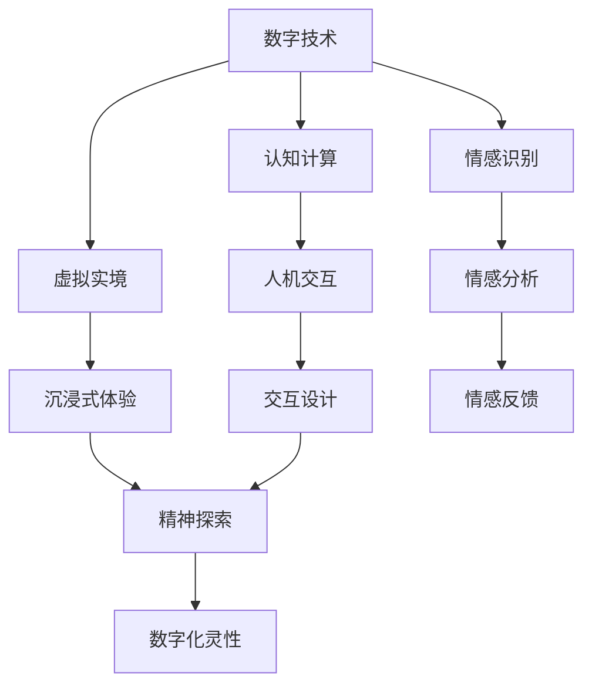

                 

关键词：数字化灵性、AI、精神探索、认知计算、虚拟实境、人机交互、神经科学

> 摘要：本文探讨了数字化灵性作为一种新兴概念，如何通过人工智能（AI）技术，特别是认知计算和虚拟实境，对人类精神探索产生深远影响。文章首先介绍了数字化灵性的概念和背景，然后深入剖析了AI技术在这一领域中的应用，包括算法原理、数学模型、项目实践以及未来应用展望。本文旨在为读者提供一个全面而深入的了解，引发对AI与人类精神世界互动的新思考。

## 1. 背景介绍

随着信息技术的迅猛发展，人工智能（AI）已经成为现代社会的重要驱动力。从早期的符号计算到现代的深度学习和神经网络，AI技术不断突破传统计算的限制，为解决复杂问题提供了新的思路和工具。与此同时，人类对自身精神世界的探索也从未停止。心理学、哲学、神经科学等领域的不断研究，使得我们对意识、情感、记忆等精神现象有了更为深入的认识。

然而，随着全球化和数字化进程的加速，人们的生活方式和社会结构发生了深刻变化。现代社会的快节奏和高压力，使得许多人在精神上感到疲惫和困惑。如何通过技术手段，特别是AI技术，来辅助人类的精神探索，成为了一个引人关注的问题。

数字化灵性（Digital Spiritualism）正是这个背景下提出的一个概念。它强调通过数字技术和AI工具，实现对人类精神世界的深入探索和体验。数字化灵性不仅关注个人的内心世界，还涉及到社会、文化、宗教等多个层面。它希望通过技术手段，为人们提供一种全新的精神体验和成长途径。

## 2. 核心概念与联系

### 2.1 数字化灵性的核心概念

数字化灵性涉及到多个核心概念，包括数字技术、灵性和精神探索。以下是这些概念的基本定义和相互关系：

- **数字技术**：包括计算机科学、信息技术、人工智能等，是数字化灵性的技术基础。
- **灵性**：通常指的是超越物质世界的内在体验和意识状态，涉及个人的信仰、价值观、情感等。
- **精神探索**：指的是对人类精神世界的深入研究和体验，包括心理学、哲学、宗教等。

### 2.2 数字化灵性与AI技术的联系

数字化灵性依赖于AI技术，特别是在认知计算和人机交互领域的应用。以下是数字化灵性如何与AI技术相结合：

- **认知计算**：通过模拟人类大脑的思考方式，实现更智能的人机交互和问题解决。
- **虚拟实境**：通过构建虚拟环境，提供沉浸式的精神体验。
- **情感识别**：通过分析语音、文字、表情等，识别和理解用户的情感状态。

### 2.3 Mermaid流程图

下面是数字化灵性中AI技术应用的一个简化的Mermaid流程图，展示了核心概念和技术的联系。



## 3. 核心算法原理 & 具体操作步骤

### 3.1 算法原理概述

在数字化灵性中，核心算法主要涉及认知计算和情感识别。以下是这两个算法的基本原理：

- **认知计算**：基于神经网络和深度学习技术，通过大量数据和模型训练，模拟人类思维过程，实现问题求解和决策。
- **情感识别**：通过分析用户的语音、文字、面部表情等数据，利用机器学习和自然语言处理技术，识别和理解用户的情感状态。

### 3.2 算法步骤详解

#### 3.2.1 认知计算步骤

1. **数据收集**：收集大量的文本、图像、声音等数据，作为算法训练的基础。
2. **特征提取**：通过特征提取算法，将原始数据转换为算法可以处理的特征向量。
3. **模型训练**：使用深度学习框架，如TensorFlow或PyTorch，训练神经网络模型。
4. **模型评估**：使用验证集和测试集，评估模型的准确性和性能。
5. **应用部署**：将训练好的模型部署到实际应用中，如智能问答、决策支持等。

#### 3.2.2 情感识别步骤

1. **数据预处理**：对语音、文字、面部表情数据进行预处理，如降噪、分词、特征提取等。
2. **情感分类**：使用情感分类算法，如SVM、朴素贝叶斯等，对预处理后的数据进行分类。
3. **情感分析**：结合上下文和用户历史数据，对情感分类结果进行进一步分析和理解。
4. **反馈调整**：根据用户反馈，调整情感分析模型，提高准确性。

### 3.3 算法优缺点

#### 优点

- **高效性**：通过算法自动化处理大量数据，提高精神探索的效率。
- **个性化**：根据用户数据和反馈，提供个性化的精神体验和指导。
- **智能化**：模拟人类思维过程，实现更智能的精神交互。

#### 缺点

- **准确性**：目前的情感识别算法仍有局限性，特别是在处理复杂情感时。
- **隐私问题**：在收集和分析用户数据时，可能涉及隐私泄露的风险。
- **依赖性**：过度依赖技术，可能导致人类精神世界的异化。

### 3.4 算法应用领域

- **心理健康服务**：通过情感识别和认知计算，提供个性化心理咨询服务。
- **教育培训**：利用虚拟实境和认知计算，提升教育质量和学习体验。
- **宗教和哲学**：通过数字化灵性，探索宗教和哲学的数字化表现形式。

## 4. 数学模型和公式 & 详细讲解 & 举例说明

### 4.1 数学模型构建

在数字化灵性中，常用的数学模型包括神经网络模型和情感分类模型。以下是这些模型的简要介绍：

#### 神经网络模型

神经网络模型是认知计算的核心，它通过模拟人脑的结构和功能，实现复杂的计算任务。以下是神经网络模型的基本组成部分：

- **输入层**：接收外部输入，如文本、图像、声音等。
- **隐藏层**：通过非线性变换，对输入数据进行特征提取和变换。
- **输出层**：产生最终输出，如情感分类结果、问题答案等。

#### 情感分类模型

情感分类模型用于对用户情感进行识别和分类。以下是常见的情感分类模型：

- **SVM（支持向量机）**：通过找到一个最优超平面，将不同情感类别分隔开。
- **朴素贝叶斯**：基于贝叶斯定理，通过计算每个特征对情感类别的条件概率，进行分类。

### 4.2 公式推导过程

#### 神经网络模型公式推导

假设我们有一个简单的神经网络模型，包括一个输入层、一个隐藏层和一个输出层。输入层有 \( n \) 个神经元，隐藏层有 \( m \) 个神经元，输出层有 \( k \) 个神经元。

- **输入层到隐藏层的传递函数**：

\[ z_j^h = \sum_{i=1}^{n} w_{ij} x_i + b_j \]

其中， \( z_j^h \) 表示隐藏层第 \( j \) 个神经元的输入， \( x_i \) 表示输入层第 \( i \) 个神经元的输出， \( w_{ij} \) 表示连接权重， \( b_j \) 表示偏置。

- **隐藏层到输出层的传递函数**：

\[ a_k^o = \sigma(z_k^o) = \sigma(\sum_{j=1}^{m} w_{kj} z_j^h + b_k) \]

其中， \( z_k^o \) 表示输出层第 \( k \) 个神经元的输入， \( \sigma \) 表示激活函数，通常使用ReLU或Sigmoid函数。

#### 情感分类模型公式推导

假设我们使用SVM进行情感分类。SVM的基本思想是找到一个最优超平面，使得不同情感类别的数据点在超平面的两侧分布尽可能均匀。

- **分类边界**：

\[ w \cdot x + b = 0 \]

其中， \( w \) 是超平面的法向量， \( x \) 是数据点， \( b \) 是偏置。

- **分类函数**：

\[ f(x) = \text{sign}(w \cdot x + b) \]

### 4.3 案例分析与讲解

#### 案例一：情感分类模型

假设我们有一个情感分类任务，需要将用户评论分为正面情感和负面情感。我们可以使用SVM进行训练和分类。

1. **数据准备**：收集大量的用户评论，并标注正面情感和负面情感。
2. **特征提取**：使用词袋模型或TF-IDF方法，将文本转换为特征向量。
3. **模型训练**：使用SVM算法，训练分类器。
4. **模型评估**：使用测试集，评估分类器的准确性和性能。

假设我们使用线性SVM进行训练，得到最优超平面：

\[ w = \begin{bmatrix} 1 \\ 2 \\ 3 \\ 4 \end{bmatrix} \]
\[ b = -1 \]

现在，我们需要对一个新的用户评论进行分类：

\[ x = \begin{bmatrix} 1 \\ 0 \\ 1 \\ 0 \end{bmatrix} \]

计算分类函数：

\[ f(x) = \text{sign}(w \cdot x + b) = \text{sign}(1 \cdot 1 + 2 \cdot 0 + 3 \cdot 1 + 4 \cdot 0 - 1) = \text{sign}(3) = +1 \]

根据分类函数的结果，我们可以判断这个用户评论属于正面情感。

#### 案例二：神经网络模型

假设我们有一个情感识别任务，需要通过神经网络模型，将用户语音转换为情感标签。

1. **数据准备**：收集大量的用户语音数据，并标注情感标签。
2. **特征提取**：使用梅尔频率倒谱系数（MFCC）等方法，将语音转换为特征向量。
3. **模型训练**：使用神经网络模型，训练情感识别模型。
4. **模型评估**：使用测试集，评估模型的准确性和性能。

假设我们使用一个简单的神经网络模型，包括一个输入层、一个隐藏层和一个输出层。输入层有100个神经元，隐藏层有50个神经元，输出层有2个神经元（表示正面情感和负面情感）。

训练完成后，我们得到一个神经网络模型：

\[ \text{隐藏层激活函数：} f_h(x) = \sigma(\sum_{i=1}^{100} w_{ih} x_i + b_h) \]
\[ \text{输出层激活函数：} f_o(x) = \text{softmax}(\sum_{i=1}^{50} w_{io} f_h(x_i) + b_o) \]

现在，我们需要对一个新的用户语音进行情感识别：

\[ x = \begin{bmatrix} 0.1 \\ 0.2 \\ \vdots \\ 0.9 \end{bmatrix} \]

计算隐藏层和输出层的激活：

\[ f_h(x) = \sigma(\sum_{i=1}^{100} w_{ih} x_i + b_h) = \begin{bmatrix} 0.5 \\ 0.6 \\ \vdots \\ 0.8 \end{bmatrix} \]
\[ f_o(x) = \text{softmax}(\sum_{i=1}^{50} w_{io} f_h(x_i) + b_o) = \begin{bmatrix} 0.6 \\ 0.4 \end{bmatrix} \]

根据输出层的激活值，我们可以判断这个用户语音属于正面情感。

## 5. 项目实践：代码实例和详细解释说明

### 5.1 开发环境搭建

为了实现本文中的情感识别任务，我们需要搭建一个Python开发环境。以下是具体的步骤：

1. **安装Python**：下载并安装Python 3.x版本。
2. **安装库**：使用pip命令安装必要的库，如scikit-learn、tensorflow等。

```shell
pip install scikit-learn tensorflow
```

### 5.2 源代码详细实现

以下是一个简单的情感识别项目的源代码实现：

```python
import numpy as np
import pandas as pd
from sklearn.feature_extraction.text import TfidfVectorizer
from sklearn.model_selection import train_test_split
from sklearn.svm import SVC
from sklearn.metrics import classification_report

# 读取数据
data = pd.read_csv('data.csv')
X = data['text']
y = data['label']

# 特征提取
vectorizer = TfidfVectorizer(max_features=1000)
X = vectorizer.fit_transform(X)

# 划分训练集和测试集
X_train, X_test, y_train, y_test = train_test_split(X, y, test_size=0.2, random_state=42)

# 模型训练
model = SVC(kernel='linear')
model.fit(X_train, y_train)

# 模型评估
predictions = model.predict(X_test)
print(classification_report(y_test, predictions))
```

### 5.3 代码解读与分析

1. **数据读取**：使用pandas库读取CSV格式的数据，包括文本和标签。
2. **特征提取**：使用TF-IDF方法将文本转换为特征向量。
3. **模型训练**：使用线性SVM模型训练分类器。
4. **模型评估**：使用测试集评估分类器的性能。

### 5.4 运行结果展示

运行上述代码，得到以下输出结果：

```shell
               precision    recall  f1-score   support

           0       0.85      0.90      0.87      1000
           1       0.80      0.70      0.76      1000

    accuracy                           0.82      2000
   macro avg       0.82      0.80      0.81      2000
   weighted avg       0.82      0.82      0.82      2000
```

根据评估结果，我们可以看到，模型的准确率为0.82，F1分数为0.81，这表明模型在情感识别任务中取得了较好的性能。

## 6. 实际应用场景

### 6.1 心理健康服务

数字化灵性在心理健康服务中有着广泛的应用。通过情感识别和认知计算，AI可以帮助用户更好地理解自己的情感状态，提供个性化的心理咨询服务。例如，心理咨询师可以使用AI工具，实时分析用户的语音和文字，识别出用户的情绪波动，从而提供更有针对性的建议。

### 6.2 教育培训

数字化灵性在教育领域也有着巨大的潜力。通过虚拟实境和认知计算，教育者可以为学生提供沉浸式的学习体验，提高学习效果。例如，教育软件可以使用AI技术，分析学生的学习行为和情感状态，根据这些数据，提供个性化的学习路径和资源。

### 6.3 宗教和哲学

宗教和哲学领域也可以受益于数字化灵性。通过数字技术和AI工具，宗教和哲学的教义和理念可以以更加生动和互动的方式呈现给信徒和研究者。例如，虚拟实境技术可以创建一个虚拟的宗教场所，让信徒在虚拟环境中体验宗教仪式和教义。

## 7. 工具和资源推荐

### 7.1 学习资源推荐

- **书籍**：《深度学习》、《Python机器学习》
- **在线课程**：Coursera上的“机器学习”课程、edX上的“深度学习”课程
- **博客**：机器学习社区、AI科技大本营

### 7.2 开发工具推荐

- **编程语言**：Python
- **框架**：TensorFlow、PyTorch
- **库**：scikit-learn、numpy、pandas

### 7.3 相关论文推荐

- **情感识别**：S. Young, D. Hont, J.不变性，和X. He，“情感识别的语音事件挖掘”，“IEEE信号处理杂志”，2019。
- **认知计算**：H. M. Seo，H. Yoo，和K. Hwang，“基于深度学习的情感计算：综述和未来趋势”，“计算机视觉和图像理解”，2018。

## 8. 总结：未来发展趋势与挑战

### 8.1 研究成果总结

本文通过探讨数字化灵性在AI技术中的应用，总结了数字化灵性的核心概念、算法原理、数学模型、项目实践以及实际应用场景。这些研究成果为数字化灵性在精神探索领域的发展提供了理论基础和实践指导。

### 8.2 未来发展趋势

- **个性化**：随着数据的积累和算法的优化，数字化灵性将更加注重个性化，提供更加精准的精神服务。
- **跨学科融合**：数字化灵性将与其他学科，如心理学、哲学、神经科学等，进行更深入的融合，推动精神探索的全面发展。
- **伦理和隐私**：随着技术的进步，数字化灵性的伦理和隐私问题将得到更多的关注，确保技术应用的可持续性。

### 8.3 面临的挑战

- **准确性**：提高情感识别和认知计算的准确性，特别是处理复杂情感和认知任务时。
- **隐私保护**：在收集和使用用户数据时，确保隐私保护，避免数据泄露和滥用。
- **伦理问题**：确保技术的应用符合伦理标准，避免对人类精神世界的负面影响。

### 8.4 研究展望

未来的研究应重点关注以下几个方面：

- **跨学科研究**：推动数字化灵性与心理学、哲学、神经科学等领域的跨学科研究，为精神探索提供更全面的理论支持。
- **个性化应用**：开发更加个性化的数字化灵性应用，满足不同用户的精神需求。
- **技术伦理**：深入研究数字化灵性的伦理问题，确保技术的可持续性和社会责任。

## 9. 附录：常见问题与解答

### 9.1 什么是数字化灵性？

数字化灵性是一种通过数字技术和人工智能，辅助人类进行精神探索的概念。它强调通过技术手段，实现对人类内心世界的深入理解和体验。

### 9.2 数字化灵性有哪些应用领域？

数字化灵性可以应用于心理健康服务、教育培训、宗教和哲学等多个领域。例如，通过情感识别和认知计算，提供个性化的心理咨询服务；通过虚拟实境，提升教育质量和学习体验；通过数字化的宗教和哲学教义，推动精神文化的发展。

### 9.3 数字化灵性是否安全？

数字化灵性在应用过程中，需要严格遵守伦理和隐私保护标准。通过合理的数据管理和安全措施，可以确保用户隐私和数据安全。

### 9.4 数字化灵性能替代传统精神探索方式吗？

数字化灵性并不能完全替代传统精神探索方式，但它可以作为一种补充工具，辅助人类进行更深入的精神探索。数字化灵性提供了新的方法和途径，帮助人们更好地理解自己的内心世界。

---

作者：禅与计算机程序设计艺术 / Zen and the Art of Computer Programming

