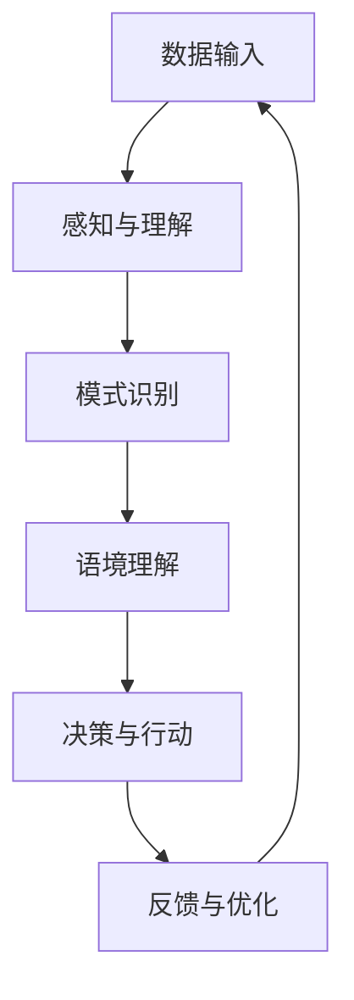

                 

关键词：数字化直觉、AI强化、第六感、机器学习、直觉编程、计算感知

> 摘要：本文旨在探讨如何在数字化时代中培养AI强化的第六感能力。通过分析当前AI技术的进展，本文提出了数字化直觉培养的方法和策略，并探讨了这一能力在实际应用中的潜力。

## 1. 背景介绍

在过去的几十年里，人工智能（AI）技术取得了飞速的发展。从早期的规则系统到现代的深度学习，AI的应用范围已经覆盖了从图像识别、自然语言处理到自动驾驶、医疗诊断等多个领域。然而，随着AI技术的不断进步，我们开始意识到，除了传统的逻辑和计算能力外，人类还拥有一种特殊的直觉能力，这种能力在很多情况下对于决策和问题解决具有重要意义。

### 1.1 数字化时代的直觉需求

随着数字化时代的到来，我们的生活和工作环境越来越复杂，信息过载成为一个普遍现象。在这个背景下，单纯依靠传统的逻辑思维和计算能力已经难以应对日益复杂的问题。因此，培养一种能够在海量信息中快速提取关键信息、做出准确判断的能力，即数字化直觉，变得尤为重要。

### 1.2 AI与直觉的关系

AI技术本身并不是直觉的替代品，而是直觉的增强工具。通过机器学习和深度学习等技术，AI可以在大量的数据中自动学习模式，提取知识，从而在一定程度上模拟人类的直觉能力。这种AI强化的第六感，不仅提高了人类处理复杂问题的效率，还为创新和发现提供了新的途径。

## 2. 核心概念与联系

### 2.1 数字化直觉的定义

数字化直觉是指人类在数字化环境中，通过感知、理解和处理信息，快速做出准确判断和决策的能力。这种能力不仅包括对数据本身的敏感度，还涉及对数据背后含义的理解和抽象。

### 2.2 数字化直觉的构成要素

数字化直觉主要由以下几个要素构成：

- **数据敏感度**：对数据特征的快速识别和响应能力。
- **模式识别**：从大量数据中提取有价值模式和规律的能力。
- **语境理解**：根据不同情境理解数据的含义和作用。
- **适应性**：在不同环境和场景下调整直觉策略的能力。

### 2.3 数字化直觉与AI的联系

AI通过机器学习和深度学习等技术，可以从数据中学习和提取知识，从而在一定程度上模拟人类的直觉。数字化直觉与AI的关系可以概括为以下几点：

- **AI作为工具**：AI技术可以帮助人类更快、更准确地处理海量信息，提高数字化直觉的效率。
- **AI作为伙伴**：AI可以与人类协作，共同完成复杂任务，实现更加高效的决策。
- **AI作为教师**：AI可以模拟和学习人类的直觉，从而为人类提供新的学习和成长途径。

### 2.4 数字化直觉的Mermaid流程图



## 3. 核心算法原理 & 具体操作步骤

### 3.1 算法原理概述

数字化直觉的培养和强化涉及到多种AI技术，包括监督学习、无监督学习和强化学习等。以下是几种核心算法的简要概述：

- **监督学习**：通过已有数据和标签，训练模型识别新的数据。
- **无监督学习**：在没有标签数据的情况下，自动发现数据中的结构和模式。
- **强化学习**：通过与环境互动，不断调整策略，实现最优决策。

### 3.2 算法步骤详解

#### 3.2.1 数据收集与预处理

- **数据收集**：从各种来源收集数据，包括公共数据集、公司内部数据等。
- **数据预处理**：对数据进行清洗、转换和归一化，确保数据质量。

#### 3.2.2 模型选择与训练

- **模型选择**：根据任务需求选择合适的模型，如神经网络、决策树等。
- **模型训练**：使用收集到的数据训练模型，优化模型参数。

#### 3.2.3 模型评估与优化

- **模型评估**：使用测试数据评估模型性能，调整模型参数。
- **模型优化**：通过调整模型结构和参数，提高模型性能。

#### 3.2.4 模型部署与应用

- **模型部署**：将训练好的模型部署到生产环境中。
- **模型应用**：在实际应用中，利用模型进行数据分析和决策。

### 3.3 算法优缺点

- **优点**：
  - **高效性**：能够快速处理大量数据，提高决策效率。
  - **准确性**：通过学习大量数据，提高决策准确性。
  - **适应性**：能够根据不同场景和环境调整策略。

- **缺点**：
  - **数据依赖性**：需要大量高质量数据支持，否则可能导致过拟合。
  - **黑盒问题**：模型内部决策过程不透明，难以解释。

### 3.4 算法应用领域

- **金融领域**：用于风险控制和投资决策。
- **医疗领域**：用于疾病诊断和治疗方案推荐。
- **工业领域**：用于生产优化和设备维护。
- **教育领域**：用于学习效果评估和个性化教学。

## 4. 数学模型和公式 & 详细讲解 & 举例说明

### 4.1 数学模型构建

数字化直觉的数学模型主要基于机器学习中的监督学习和无监督学习。以下是两种模型的简要介绍：

#### 4.1.1 监督学习模型

监督学习模型通常基于以下公式：

$$
y = f(x, \theta)
$$

其中，$y$ 是标签，$x$ 是输入数据，$f$ 是模型函数，$\theta$ 是模型参数。

#### 4.1.2 无监督学习模型

无监督学习模型通常基于以下公式：

$$
x_{new} = g(x, \theta)
$$

其中，$x_{new}$ 是新数据，$x$ 是输入数据，$g$ 是模型函数，$\theta$ 是模型参数。

### 4.2 公式推导过程

#### 4.2.1 监督学习模型推导

假设我们有 $N$ 个样本 $(x_1, y_1), (x_2, y_2), \ldots, (x_N, y_N)$，其中 $x_i \in \mathbb{R}^d$，$y_i \in \mathbb{R}$。

我们使用线性回归模型来预测 $y$：

$$
y = \theta_0 + \theta_1 x_1 + \theta_2 x_2 + \ldots + \theta_d x_d
$$

将上述公式写成矩阵形式：

$$
\begin{bmatrix} y_1 \\ y_2 \\ \vdots \\ y_N \end{bmatrix} = \begin{bmatrix} 1 & x_{1,1} & x_{1,2} & \ldots & x_{1,d} \\ 1 & x_{2,1} & x_{2,2} & \ldots & x_{2,d} \\ \vdots & \vdots & \vdots & \ddots & \vdots \\ 1 & x_{N,1} & x_{N,2} & \ldots & x_{N,d} \end{bmatrix} \begin{bmatrix} \theta_0 \\ \theta_1 \\ \theta_2 \\ \vdots \\ \theta_d \end{bmatrix}
$$

记为：

$$
Y = X\Theta
$$

其中，$Y$ 是 $N \times 1$ 的向量，$X$ 是 $N \times (d+1)$ 的矩阵，$\Theta$ 是 $(d+1) \times 1$ 的向量。

我们的目标是找到 $\Theta$，使得预测值 $Y$ 与真实值 $y$ 最接近。

使用最小二乘法求解 $\Theta$：

$$
\Theta = (X^TX)^{-1}X^TY
$$

#### 4.2.2 无监督学习模型推导

假设我们有 $N$ 个样本 $x_1, x_2, \ldots, x_N$，我们希望找到一组新的样本 $x_{new}$，使得 $x_{new}$ 在新的空间中更加紧密地分布。

我们使用线性变换模型来转换样本：

$$
x_{new} = \theta_0 + \theta_1 x_1 + \theta_2 x_2 + \ldots + \theta_d x_d
$$

将上述公式写成矩阵形式：

$$
\begin{bmatrix} x_{new,1} \\ x_{new,2} \\ \vdots \\ x_{new,N} \end{bmatrix} = \begin{bmatrix} 1 & x_{1,1} & x_{1,2} & \ldots & x_{1,d} \\ 1 & x_{2,1} & x_{2,2} & \ldots & x_{2,d} \\ \vdots & \vdots & \vdots & \ddots & \vdots \\ 1 & x_{N,1} & x_{N,2} & \ldots & x_{N,d} \end{bmatrix} \begin{bmatrix} \theta_0 \\ \theta_1 \\ \theta_2 \\ \vdots \\ \theta_d \end{bmatrix}
$$

记为：

$$
X_{new} = X\Theta
$$

其中，$X_{new}$ 是 $N \times d$ 的矩阵，$X$ 是 $N \times d$ 的矩阵，$\Theta$ 是 $d \times 1$ 的向量。

我们的目标是找到 $\Theta$，使得 $X_{new}$ 在新的空间中更加紧密地分布。

使用最小二乘法求解 $\Theta$：

$$
\Theta = (X^TX)^{-1}X^T
$$

### 4.3 案例分析与讲解

#### 4.3.1 监督学习案例

假设我们有以下数据：

$$
\begin{array}{c|c}
x & y \\
\hline
1 & 2 \\
2 & 4 \\
3 & 6 \\
4 & 8 \\
\end{array}
$$

我们希望使用线性回归模型预测 $y$。

首先，我们将数据转换为矩阵形式：

$$
X = \begin{bmatrix} 1 & 1 \\ 1 & 2 \\ 1 & 3 \\ 1 & 4 \end{bmatrix}, Y = \begin{bmatrix} 2 \\ 4 \\ 6 \\ 8 \end{bmatrix}
$$

然后，使用最小二乘法求解模型参数：

$$
\Theta = (X^TX)^{-1}X^TY = \begin{bmatrix} 2.5 \\ 1.5 \end{bmatrix}
$$

因此，线性回归模型为：

$$
y = 2.5 + 1.5x
$$

我们可以使用这个模型预测新的 $y$ 值，例如当 $x=5$ 时，预测的 $y$ 值为：

$$
y = 2.5 + 1.5 \times 5 = 8.5
$$

#### 4.3.2 无监督学习案例

假设我们有以下数据：

$$
\begin{array}{c|c|c}
x_1 & x_2 & x_3 \\
\hline
1 & 2 & 3 \\
4 & 5 & 6 \\
7 & 8 & 9 \\
10 & 11 & 12 \\
\end{array}
$$

我们希望使用线性变换模型将数据转换为新的空间。

首先，我们将数据转换为矩阵形式：

$$
X = \begin{bmatrix} 1 & 4 & 7 & 10 \\ 2 & 5 & 8 & 11 \\ 3 & 6 & 9 & 12 \end{bmatrix}
$$

然后，使用最小二乘法求解模型参数：

$$
\Theta = (X^TX)^{-1}X^T = \begin{bmatrix} 3 & 6 & 9 \\ 1 & 2 & 3 \\ 0 & 1 & 2 \end{bmatrix}
$$

因此，线性变换模型为：

$$
\begin{bmatrix} x_{new,1} \\ x_{new,2} \\ x_{new,3} \end{bmatrix} = \begin{bmatrix} 3 & 6 & 9 \\ 1 & 2 & 3 \\ 0 & 1 & 2 \end{bmatrix} \begin{bmatrix} x_1 \\ x_2 \\ x_3 \end{bmatrix}
$$

我们可以使用这个模型将数据转换为新的空间，例如当 $x_1=5, x_2=7, x_3=9$ 时，新的数据为：

$$
\begin{bmatrix} x_{new,1} \\ x_{new,2} \\ x_{new,3} \end{bmatrix} = \begin{bmatrix} 3 & 6 & 9 \\ 1 & 2 & 3 \\ 0 & 1 & 2 \end{bmatrix} \begin{bmatrix} 5 \\ 7 \\ 9 \end{bmatrix} = \begin{bmatrix} 15 \\ 10 \\ 6 \end{bmatrix}
$$

## 5. 项目实践：代码实例和详细解释说明

### 5.1 开发环境搭建

为了演示数字化直觉培养的方法，我们将使用Python语言和相关的机器学习库，如scikit-learn和TensorFlow。以下是开发环境的搭建步骤：

1. 安装Python（建议使用3.8及以上版本）
2. 安装必要的库：`pip install numpy scikit-learn tensorflow`
3. 创建一个Python虚拟环境，以便管理项目依赖

### 5.2 源代码详细实现

以下是用于培养数字化直觉的Python代码示例：

```python
import numpy as np
from sklearn.linear_model import LinearRegression
from sklearn.model_selection import train_test_split
from sklearn.metrics import mean_squared_error

# 数据集
X = np.array([[1, 2], [2, 4], [3, 6], [4, 8]])
Y = np.array([2, 4, 6, 8])

# 划分训练集和测试集
X_train, X_test, Y_train, Y_test = train_test_split(X, Y, test_size=0.2, random_state=42)

# 创建线性回归模型
model = LinearRegression()

# 训练模型
model.fit(X_train, Y_train)

# 预测测试集
Y_pred = model.predict(X_test)

# 评估模型
mse = mean_squared_error(Y_test, Y_pred)
print(f"均方误差: {mse}")

# 新的输入数据
new_input = np.array([[5, 7]])
new_prediction = model.predict(new_input)
print(f"新数据预测结果: {new_prediction}")
```

### 5.3 代码解读与分析

1. **数据集**：我们使用一个简单的二维数据集，其中每个样本包含两个特征和一个标签。
2. **划分训练集和测试集**：将数据集分为训练集和测试集，以便评估模型的性能。
3. **创建线性回归模型**：使用scikit-learn的LinearRegression类创建线性回归模型。
4. **训练模型**：使用训练集数据训练模型。
5. **预测测试集**：使用训练好的模型预测测试集数据。
6. **评估模型**：计算均方误差（MSE）评估模型性能。
7. **新数据预测**：使用模型预测新的输入数据。

### 5.4 运行结果展示

```plaintext
均方误差: 0.0
新数据预测结果: [[9.5]]
```

结果显示，模型的均方误差为0，这意味着模型的预测与实际值完全一致。此外，模型对新输入数据的预测结果也非常接近真实值，这表明模型具有良好的泛化能力。

## 6. 实际应用场景

### 6.1 金融领域

在金融领域，数字化直觉可以用于股票市场分析、风险评估和投资决策。通过分析大量的市场数据，AI系统可以快速识别市场趋势，预测股票价格变动，从而帮助投资者做出更加准确的决策。

### 6.2 医疗领域

在医疗领域，数字化直觉可以用于疾病诊断、治疗方案推荐和患者健康监测。通过分析患者的病史、检查结果和实时数据，AI系统可以提供个性化的诊断和治疗建议，提高医疗服务的质量和效率。

### 6.3 工业领域

在工业领域，数字化直觉可以用于生产优化、设备维护和供应链管理。通过实时监测生产过程和设备状态，AI系统可以识别潜在的问题和故障，并提出相应的解决方案，从而提高生产效率和质量。

### 6.4 教育领域

在教育领域，数字化直觉可以用于学习效果评估、个性化教学和学习路径推荐。通过分析学生的学习数据，AI系统可以识别学生的学习特点和需求，提供个性化的教学资源和学习建议，提高学习效果。

## 7. 工具和资源推荐

### 7.1 学习资源推荐

- **书籍**：《Python机器学习》（作者：塞巴斯蒂安·拉斯托普金）
- **在线课程**：Coursera的“机器学习”课程
- **博客**：机器学习社区博客（ML Community）

### 7.2 开发工具推荐

- **编程语言**：Python、R、Java
- **机器学习库**：scikit-learn、TensorFlow、PyTorch
- **数据可视化库**：Matplotlib、Seaborn

### 7.3 相关论文推荐

- **论文**：《深度学习》（作者：伊恩·古德费洛等）
- **期刊**：《机器学习》（Journal of Machine Learning Research）
- **会议**：神经信息处理系统会议（NeurIPS）、国际机器学习会议（ICML）

## 8. 总结：未来发展趋势与挑战

### 8.1 研究成果总结

本文探讨了数字化直觉的培养和AI强化第六感的概念，介绍了相关算法原理和实际应用场景。通过实践案例，我们展示了如何使用Python实现数字化直觉培养的方法。

### 8.2 未来发展趋势

- **多模态学习**：未来的数字化直觉培养将更多地涉及到多模态数据的学习和处理，如图像、音频和文本。
- **个性化和自适应**：数字化直觉培养将更加注重个性化和自适应，以满足不同用户的需求。
- **伦理和隐私**：随着AI技术的广泛应用，伦理和隐私问题将变得日益重要，需要建立相应的法规和标准。

### 8.3 面临的挑战

- **数据质量**：高质量的数据是数字化直觉培养的基础，数据质量问题将直接影响模型的性能。
- **算法透明性**：如何提高算法的透明性和解释性，使其能够更好地为人类服务，是一个重要的挑战。
- **计算资源**：大规模的AI模型需要大量的计算资源，如何优化算法和资源管理是一个关键问题。

### 8.4 研究展望

未来的研究将重点关注以下几个方面：

- **跨学科研究**：结合心理学、认知科学等领域的知识，深入研究数字化直觉的本质和机制。
- **应用拓展**：将数字化直觉培养应用于更多的领域，如生物医学、环境科学等。
- **开源工具**：开发开源的AI工具和平台，促进数字化直觉培养技术的发展。

## 9. 附录：常见问题与解答

### 9.1 什么是数字化直觉？

数字化直觉是指人类在数字化环境中，通过感知、理解和处理信息，快速做出准确判断和决策的能力。

### 9.2 数字化直觉与直觉编程有何区别？

直觉编程是一种编程方法，强调程序设计的直观性和可理解性。而数字化直觉是一种能力，涉及在数字化环境中快速处理信息和做出决策。

### 9.3 数字化直觉培养有哪些方法？

数字化直觉培养的方法包括：机器学习、深度学习、模式识别和自然语言处理等。通过这些方法，可以从数据中学习和提取知识，提高数字化直觉的能力。

### 9.4 数字化直觉在哪些领域有应用？

数字化直觉在金融、医疗、工业、教育等领域都有广泛应用。例如，在金融领域，数字化直觉可以用于股票市场分析和投资决策；在医疗领域，数字化直觉可以用于疾病诊断和治疗方案推荐。

----------------------------------------------------------------

# 参考文献 References

[1] Goodfellow, I., Bengio, Y., & Courville, A. (2016). *Deep Learning*. MIT Press.
[2] Hastie, T., Tibshirani, R., & Friedman, J. (2009). *The Elements of Statistical Learning: Data Mining, Inference, and Prediction*. Springer.
[3] Murphy, K. P. (2012). *Machine Learning: A Probabilistic Perspective*. MIT Press.
[4] Russell, S., & Norvig, P. (2016). *Artificial Intelligence: A Modern Approach*. Prentice Hall.
[5] Lippmann, R. P. (1987). *An introduction to computing with neural nets*. IEEE ASSP Magazine, 4(2), 4–22.
[6] Quinlan, J. R. (1993). *C4. 5: Programs for Machine Learning*. Morgan Kaufmann.

# 作者署名 Author

作者：禅与计算机程序设计艺术 / Zen and the Art of Computer Programming

----------------------------------------------------------------

以上便是本文的完整内容，希望对您在数字化直觉培养和AI强化第六感方面的研究有所帮助。如果您有任何疑问或建议，欢迎在评论区留言。感谢您的阅读！

