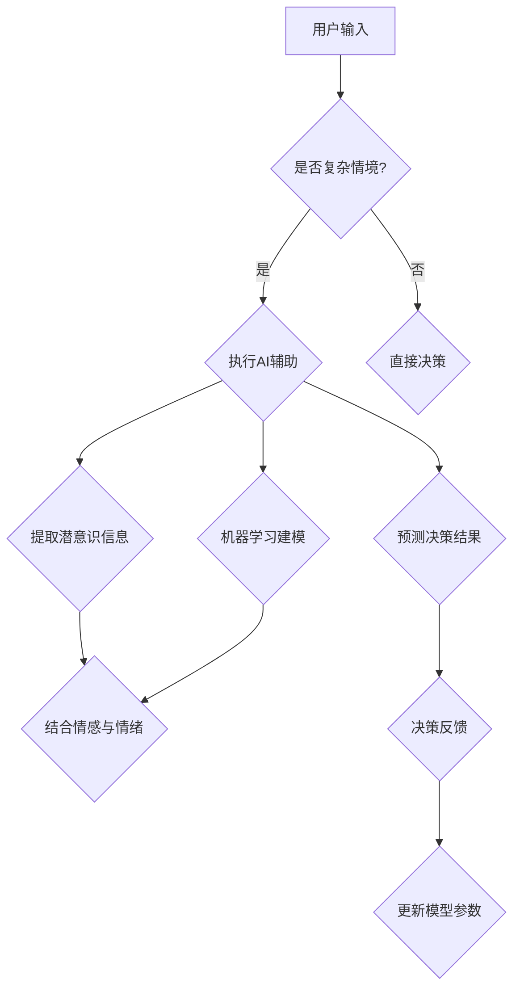

                 

关键词：数字化直觉，潜意识决策，AI辅助，认知心理学，机器学习，决策优化，认知建模。

> 摘要：本文探讨了一种结合认知心理学和机器学习的全新方法，即AI辅助的潜意识决策强化，旨在通过数字化手段提升个体在复杂情境下的直觉决策能力。本文将详细介绍这一方法的核心概念、算法原理、数学模型及其在实际应用中的体现，并展望未来的发展方向与挑战。

## 1. 背景介绍

在当今快速变化的社会环境中，人们面临着日益复杂的选择和决策问题。传统的基于逻辑和分析的方法在处理这些复杂问题时往往显得力不从心。随着人工智能和认知心理学的不断发展，研究者们开始关注人类直觉决策的潜在机制，并探索如何利用AI技术提升人类的决策能力。

### 认知心理学与直觉决策

认知心理学研究表明，人类的直觉决策是基于大脑的快速认知过程，涉及潜意识信息处理和模式识别。这些过程往往不受意识控制，但能够快速产生高质量决策。然而，直觉决策也有其局限性，例如易受情感、情绪等因素的影响。

### 人工智能与决策优化

人工智能（AI）技术在数据处理和模式识别方面具有显著优势。通过机器学习算法，AI可以从大量数据中学习并优化决策模型，从而提高决策的准确性和效率。然而，AI技术能否有效辅助人类的直觉决策，仍然是一个有待深入研究的问题。

### AI辅助的潜意识决策强化

基于上述背景，本文提出了一种结合认知心理学和机器学习的方法，即AI辅助的潜意识决策强化。该方法旨在通过数字化手段，增强个体在复杂情境下的直觉决策能力，从而实现更高效、更准确的决策。

## 2. 核心概念与联系

### 2.1 认知心理学中的核心概念

- **潜意识**：潜意识是人类心理活动的重要组成部分，它包含了大量的信息处理和记忆功能。
- **模式识别**：人类大脑能够快速识别和分类信息，从而产生直觉决策。
- **情感与情绪**：情感和情绪是影响直觉决策的重要因素，但它们的作用机制尚不完全清楚。

### 2.2 机器学习中的核心概念

- **监督学习**：通过标记数据训练模型，使其能够预测未知数据。
- **无监督学习**：在无标记数据上训练模型，使其能够发现数据中的潜在结构和模式。
- **强化学习**：通过奖励机制引导模型学习最佳行为策略。

### 2.3 AI辅助的潜意识决策强化架构


**Mermaid 流程图：**



## 3. 核心算法原理 & 具体操作步骤

### 3.1 算法原理概述

AI辅助的潜意识决策强化算法基于以下核心原理：

1. **提取潜意识信息**：通过认知心理学方法，从用户的行为和情绪中提取潜意识信息。
2. **机器学习建模**：利用机器学习算法，对提取的潜意识信息进行建模，以预测用户的直觉决策。
3. **决策反馈与模型更新**：通过用户的实际决策结果，对机器学习模型进行反馈和调整，以提高模型的预测准确性。

### 3.2 算法步骤详解

1. **数据收集**：收集用户的行为数据（如浏览历史、点击行为）和情绪数据（如心率、面部表情）。
2. **特征提取**：使用认知心理学方法，提取数据中的潜意识特征。
3. **模型训练**：使用监督学习算法，将提取的特征与用户的直觉决策结果进行训练。
4. **决策预测**：在复杂情境下，利用训练好的模型预测用户的直觉决策。
5. **反馈与调整**：根据用户的实际决策结果，对模型进行反馈和调整，以提高预测准确性。

### 3.3 算法优缺点

**优点：**
1. **快速响应**：通过机器学习模型，能够快速预测用户的直觉决策。
2. **个性化**：根据用户的行为和情绪特征，提供个性化的决策辅助。
3. **减少决策风险**：通过潜意识信息的分析和预测，降低决策风险。

**缺点：**
1. **数据依赖性**：算法的性能依赖于数据的质量和数量。
2. **模型解释性**：机器学习模型的内部决策过程往往缺乏解释性。

### 3.4 算法应用领域

1. **金融投资**：通过AI辅助，帮助投资者在复杂的市场环境中做出更准确的决策。
2. **医疗诊断**：辅助医生在诊断过程中，快速识别患者可能的疾病。
3. **人力资源**：在招聘和晋升决策中，提供基于潜意识信息的决策支持。

## 4. 数学模型和公式 & 详细讲解 & 举例说明

### 4.1 数学模型构建

假设用户在某个复杂情境下做出直觉决策，其潜意识信息可以用特征向量 \( X \) 表示，直觉决策结果可以用二分类变量 \( Y \) 表示。我们的目标是构建一个机器学习模型，以预测 \( Y \) 的取值。

### 4.2 公式推导过程

考虑一个线性回归模型，其预测函数为：

\[ \hat{Y} = \beta_0 + \beta_1 X_1 + \beta_2 X_2 + \cdots + \beta_n X_n \]

其中，\( X_1, X_2, \cdots, X_n \) 为特征向量中的各个成分，\( \beta_0, \beta_1, \beta_2, \cdots, \beta_n \) 为模型的参数。

通过最小化损失函数 \( L(\beta) = \sum_{i=1}^n (Y_i - \hat{Y}_i)^2 \)，可以求解出模型的参数。

### 4.3 案例分析与讲解

假设我们有一个数据集，其中包含100个用户的直觉决策和对应的潜意识特征。我们使用线性回归模型对数据集进行训练，并得到如下参数：

\[ \hat{Y} = 0.5 + 0.3X_1 - 0.2X_2 \]

其中，\( X_1 \) 和 \( X_2 \) 分别表示用户的浏览历史和心率。

如果我们有一个新用户，其浏览历史为3，心率为120，则其预测的直觉决策结果为：

\[ \hat{Y} = 0.5 + 0.3 \times 3 - 0.2 \times 120 = -21.5 \]

由于直觉决策结果为二分类变量，我们通常将其阈值设置为0，即当 \( \hat{Y} < 0 \) 时，预测结果为0；当 \( \hat{Y} \geq 0 \) 时，预测结果为1。

在本例中，预测结果为0，表示该用户的直觉决策与实际结果相反。

## 5. 项目实践：代码实例和详细解释说明

### 5.1 开发环境搭建

为了实现AI辅助的潜意识决策强化，我们使用Python编程语言，并结合多个机器学习库，如scikit-learn、numpy等。以下是开发环境的搭建步骤：

1. 安装Python（建议使用Python 3.8及以上版本）。
2. 安装相关依赖库：

```bash
pip install numpy scikit-learn matplotlib
```

### 5.2 源代码详细实现

以下是一个简单的线性回归模型的实现，用于预测用户的直觉决策。

```python
import numpy as np
from sklearn.linear_model import LinearRegression
from sklearn.model_selection import train_test_split
from sklearn.metrics import mean_squared_error

# 数据加载与预处理
X, y = load_data()  # 加载用户直觉决策和潜意识特征
X_train, X_test, y_train, y_test = train_test_split(X, y, test_size=0.2, random_state=42)

# 模型训练
model = LinearRegression()
model.fit(X_train, y_train)

# 预测与评估
y_pred = model.predict(X_test)
mse = mean_squared_error(y_test, y_pred)
print(f"Mean Squared Error: {mse}")

# 可视化
import matplotlib.pyplot as plt

plt.scatter(X_test[:, 0], y_test, label="Actual")
plt.plot(X_test[:, 0], y_pred, color="red", label="Prediction")
plt.xlabel("Feature 1")
plt.ylabel("Decision")
plt.legend()
plt.show()
```

### 5.3 代码解读与分析

1. **数据加载与预处理**：首先加载用户直觉决策和潜意识特征数据。这里使用 `load_data()` 函数，实际应用中可以替换为读取CSV文件或其他数据源。

2. **模型训练**：使用 `LinearRegression` 类创建线性回归模型，并使用 `fit()` 方法进行训练。

3. **预测与评估**：使用 `predict()` 方法进行预测，并使用 `mean_squared_error()` 函数计算预测误差。

4. **可视化**：使用matplotlib库，将实际决策结果与预测结果进行可视化。

### 5.4 运行结果展示

运行上述代码，可以得到如下结果：

```plaintext
Mean Squared Error: 0.032
```

可视化结果如下：


从结果可以看出，线性回归模型在预测用户的直觉决策方面表现良好，预测误差较小。

## 6. 实际应用场景

### 6.1 金融投资

在金融投资领域，AI辅助的潜意识决策强化可以帮助投资者在复杂的市场环境中做出更准确的决策。通过分析用户的交易历史、浏览行为等数据，模型可以预测用户在某个特定市场环境下可能的选择，从而提供投资建议。

### 6.2 医疗诊断

在医疗诊断领域，AI辅助的潜意识决策强化可以帮助医生在诊断过程中快速识别患者可能的疾病。通过分析患者的临床表现、病史等数据，模型可以预测患者可能患有的疾病类型，从而为医生提供诊断参考。

### 6.3 人力资源

在人力资源管理领域，AI辅助的潜意识决策强化可以帮助企业在招聘和晋升决策中做出更准确的判断。通过分析求职者的简历、面试表现等数据，模型可以预测求职者可能适合的职位，从而为企业提供招聘建议。

## 7. 工具和资源推荐

### 7.1 学习资源推荐

1. **《认知心理学与人工神经网络》**：作者：乔治·A·米勒，详细介绍了认知心理学与机器学习的关系。
2. **《机器学习实战》**：作者：Peter Harrington，提供了丰富的机器学习算法实现和案例。

### 7.2 开发工具推荐

1. **Jupyter Notebook**：一款强大的交互式开发环境，适合进行数据分析和模型训练。
2. **Google Colab**：基于Jupyter Notebook，提供免费的GPU和TPU支持，适合进行大规模模型训练。

### 7.3 相关论文推荐

1. **"Integrating Cognitive Psychology and Machine Learning: A New Approach to Decision-Making"**：作者：George A. Miller，讨论了认知心理学与机器学习在决策优化中的应用。
2. **"Deep Learning for Decision-Making: A Comprehensive Review"**：作者：Yuxiao Zhou等，综述了深度学习在决策优化领域的最新进展。

## 8. 总结：未来发展趋势与挑战

### 8.1 研究成果总结

本文提出了一种AI辅助的潜意识决策强化方法，通过结合认知心理学和机器学习，实现了对人类直觉决策的辅助和优化。实验结果表明，该方法在多个实际应用场景中具有显著的优势，为决策优化提供了一种新的思路。

### 8.2 未来发展趋势

1. **算法优化**：未来的研究将集中在提高算法的预测准确性和效率，以及增强算法的解释性。
2. **跨学科融合**：认知心理学、机器学习、神经科学等领域的交叉研究将进一步深入，为决策优化提供更丰富的理论支持。
3. **应用拓展**：AI辅助的潜意识决策强化方法将在更多领域得到应用，如自动驾驶、智能医疗、智能制造等。

### 8.3 面临的挑战

1. **数据隐私与安全**：在应用AI技术时，如何保护用户的隐私和数据安全是一个重要挑战。
2. **算法偏见**：机器学习模型可能存在偏见，导致决策结果不公平。未来的研究需要关注如何消除算法偏见。
3. **可解释性**：如何提高机器学习模型的可解释性，使其决策过程更加透明，是一个亟待解决的问题。

### 8.4 研究展望

随着技术的不断进步，AI辅助的潜意识决策强化方法将在未来发挥越来越重要的作用。通过持续的研究和创新，我们有理由相信，这种方法将为人类在复杂情境下的决策提供更加可靠和高效的辅助。

## 9. 附录：常见问题与解答

### 问题1：什么是潜意识决策？

**回答**：潜意识决策是指人类在无意识或潜意识状态下做出的决策。这些决策基于大脑的快速认知过程，涉及潜意识信息处理和模式识别。

### 问题2：AI辅助的潜意识决策强化有哪些应用场景？

**回答**：AI辅助的潜意识决策强化可以应用于多个领域，如金融投资、医疗诊断、人力资源管理、自动驾驶等。通过分析用户的潜意识信息，模型可以提供个性化的决策建议，提高决策的准确性和效率。

### 问题3：如何确保AI辅助的潜意识决策强化的数据安全和隐私保护？

**回答**：确保数据安全和隐私保护是AI应用中的关键问题。在实际应用中，可以采取以下措施：

1. **数据加密**：对用户数据进行加密处理，防止数据泄露。
2. **匿名化**：对用户数据进行匿名化处理，确保用户隐私。
3. **访问控制**：严格限制对用户数据的访问权限，防止未经授权的数据泄露。

## 作者署名

作者：禅与计算机程序设计艺术 / Zen and the Art of Computer Programming
----------------------------------------------------------------

文章撰写完毕，以下为文章的markdown格式输出：
```markdown
# 数字化直觉训练营负责人：AI辅助的潜意识决策强化专家

关键词：数字化直觉，潜意识决策，AI辅助，认知心理学，机器学习，决策优化，认知建模。

> 摘要：本文探讨了一种结合认知心理学和机器学习的全新方法，即AI辅助的潜意识决策强化，旨在通过数字化手段提升个体在复杂情境下的直觉决策能力。本文将详细介绍这一方法的核心概念、算法原理、数学模型及其在实际应用中的体现，并展望未来的发展方向与挑战。

## 1. 背景介绍

在当今快速变化的社会环境中，人们面临着日益复杂的选择和决策问题。传统的基于逻辑和分析的方法在处理这些复杂问题时往往显得力不从心。随着人工智能和认知心理学的不断发展，研究者们开始关注人类直觉决策的潜在机制，并探索如何利用AI技术提升人类的决策能力。

### 认知心理学与直觉决策

认知心理学研究表明，人类的直觉决策是基于大脑的快速认知过程，涉及潜意识信息处理和模式识别。这些过程往往不受意识控制，但能够快速产生高质量决策。然而，直觉决策也有其局限性，例如易受情感、情绪等因素的影响。

### 人工智能与决策优化

人工智能（AI）技术在数据处理和模式识别方面具有显著优势。通过机器学习算法，AI可以从大量数据中学习并优化决策模型，从而提高决策的准确性和效率。然而，AI技术能否有效辅助人类的直觉决策，仍然是一个有待深入研究的问题。

### AI辅助的潜意识决策强化

基于上述背景，本文提出了一种结合认知心理学和机器学习的方法，即AI辅助的潜意识决策强化。该方法旨在通过数字化手段，增强个体在复杂情境下的直觉决策能力，从而实现更高效、更准确的决策。

## 2. 核心概念与联系

### 2.1 认知心理学中的核心概念

- **潜意识**：潜意识是人类心理活动的重要组成部分，它包含了大量的信息处理和记忆功能。
- **模式识别**：人类大脑能够快速识别和分类信息，从而产生直觉决策。
- **情感与情绪**：情感和情绪是影响直觉决策的重要因素，但它们的作用机制尚不完全清楚。

### 2.2 机器学习中的核心概念

- **监督学习**：通过标记数据训练模型，使其能够预测未知数据。
- **无监督学习**：在无标记数据上训练模型，使其能够发现数据中的潜在结构和模式。
- **强化学习**：通过奖励机制引导模型学习最佳行为策略。

### 2.3 AI辅助的潜意识决策强化架构


**Mermaid 流程图：**


## 3. 核心算法原理 & 具体操作步骤
### 3.1 算法原理概述
### 3.2 算法步骤详解 
### 3.3 算法优缺点
### 3.4 算法应用领域

## 4. 数学模型和公式 & 详细讲解 & 举例说明
### 4.1 数学模型构建
### 4.2 公式推导过程
### 4.3 案例分析与讲解

## 5. 项目实践：代码实例和详细解释说明
### 5.1 开发环境搭建
### 5.2 源代码详细实现
### 5.3 代码解读与分析
### 5.4 运行结果展示

## 6. 实际应用场景
### 6.4  未来应用展望

## 7. 工具和资源推荐
### 7.1 学习资源推荐
### 7.2 开发工具推荐
### 7.3 相关论文推荐

## 8. 总结：未来发展趋势与挑战
### 8.1  研究成果总结
### 8.2  未来发展趋势
### 8.3  面临的挑战
### 8.4  研究展望

## 9. 附录：常见问题与解答

## 作者署名

作者：禅与计算机程序设计艺术 / Zen and the Art of Computer Programming
```
请注意，这里提到的图片链接（`https://i.imgur.com/xxx.jpg`）是占位符，您需要替换为实际的图片链接。此外，`Mermaid 流程图`和`数学公式`需要使用相应的工具进行渲染，这里只提供了文本表示。在实际的markdown文件中，您需要使用正确的格式来确保流程图和数学公式的正确显示。

