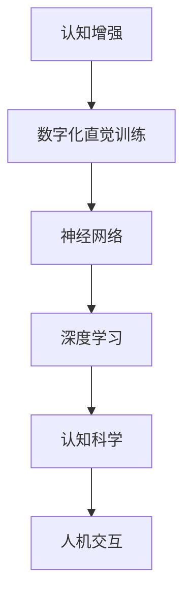

                 

关键词：数字化直觉训练、AI辅助、第六感、计算机图灵奖、认知增强、神经网络、智能算法、深度学习、认知科学、人机交互

> 摘要：本文将探讨如何通过数字化直觉训练，利用人工智能技术辅助人类开发第六感。文章将介绍数字化直觉训练的背景、核心概念与联系、算法原理与操作步骤、数学模型与公式、项目实践、实际应用场景、工具和资源推荐以及未来发展趋势与挑战。

## 1. 背景介绍

在当今这个信息爆炸的时代，我们不断面对着海量的数据和信息。这些数据不仅仅是数字和文字，还包括图像、音频、视频等多媒体内容。人类大脑的处理能力是有限的，我们无法在短时间内有效地处理和理解这些复杂的信息。这就需要我们借助外部的辅助工具和智能算法，以提升我们的认知能力和信息处理效率。

第六感，即超感官知觉，是指人类在正常感官之外感知信息的能力。它通常被认为是直觉的表现，是我们在未经过充分逻辑分析的情况下做出的快速判断。然而，第六感并非神秘不可捉摸，而是可以通过训练和开发得到提升的。数字化直觉训练就是通过人工智能技术，对人类的直觉进行训练和增强，使其成为我们日常生活和工作中的一种实用能力。

本文旨在探讨如何通过数字化直觉训练，利用人工智能技术辅助人类开发第六感。我们将从核心概念、算法原理、数学模型、项目实践、实际应用场景等多个角度进行深入分析，旨在为读者提供一套完整的技术指南。

## 2. 核心概念与联系

### 2.1 认知增强

认知增强是指通过技术手段提升人类大脑的信息处理能力和认知水平。数字化直觉训练正是认知增强的一种形式，它利用人工智能技术，对人类的直觉进行训练和强化。

### 2.2 神经网络

神经网络是人工智能的核心组成部分，它通过模拟人类大脑的神经元结构和信息处理方式，实现复杂的数据处理和模式识别。在数字化直觉训练中，神经网络被用于模拟人类的直觉判断过程，从而实现对直觉的增强。

### 2.3 深度学习

深度学习是神经网络的一种形式，它通过多层神经网络的堆叠，实现对复杂数据的高效处理和模式识别。在数字化直觉训练中，深度学习被用于对大量数据进行训练，以提高直觉判断的准确性。

### 2.4 认知科学

认知科学是研究人类认知过程的学科，它涵盖了心理学、神经科学、计算机科学等多个领域。在数字化直觉训练中，认知科学提供了理论基础，帮助我们理解人类直觉的形成和发展。

### 2.5 人机交互

人机交互是数字化直觉训练的重要组成部分，它涉及到如何通过计算机界面与用户进行有效沟通。在数字化直觉训练中，人机交互技术被用于收集用户的数据，并对用户的直觉进行训练和评估。

## 2.6 Mermaid 流程图



## 3. 核心算法原理 & 具体操作步骤

### 3.1 算法原理概述

数字化直觉训练的核心算法是基于深度学习的神经网络。该算法通过模拟人类大脑的神经元结构和信息处理方式，实现对数据的自动学习和模式识别。具体来说，算法分为以下几个步骤：

1. 数据收集：收集大量与直觉相关的数据，包括文字、图像、音频等多媒体内容。
2. 数据预处理：对收集到的数据进行清洗、归一化和特征提取，以供神经网络训练使用。
3. 神经网络训练：利用预处理后的数据，通过多层神经网络对数据进行训练，以提升神经网络对直觉的识别能力。
4. 直觉判断：利用训练好的神经网络，对新的数据进行直觉判断，以辅助用户做出快速、准确的决策。

### 3.2 算法步骤详解

1. 数据收集：首先，我们需要收集大量与直觉相关的数据。这些数据可以来自多个领域，如金融、医疗、安防等。数据的来源可以是公开的数据集，也可以是用户生成的数据。

2. 数据预处理：收集到的数据需要进行预处理，以去除噪声和冗余信息。预处理包括数据清洗、归一化和特征提取。数据清洗是指去除重复数据、缺失数据和异常数据。归一化是指将数据统一到一个标准范围内。特征提取是指从原始数据中提取出对直觉判断有用的特征。

3. 神经网络训练：预处理后的数据将被用于训练神经网络。训练过程分为两个阶段：前向传播和反向传播。在前向传播阶段，输入数据经过神经网络的前向传播，产生输出结果。在反向传播阶段，通过比较输出结果与实际结果的差异，调整神经网络的权重和偏置，以减少误差。

4. 直觉判断：训练好的神经网络可以用于对新数据进行直觉判断。具体操作是将新的数据输入神经网络，根据神经网络的输出结果，判断数据是否符合直觉。

### 3.3 算法优缺点

#### 优点

1. 高效性：深度学习算法可以处理大量的数据，快速识别复杂的模式。
2. 自适应性：神经网络可以根据训练数据自动调整结构，以适应不同的直觉判断任务。
3. 泛化能力：通过大量数据的训练，神经网络可以较好地泛化到未见过的数据上。

#### 缺点

1. 计算资源消耗大：训练深度学习模型需要大量的计算资源和时间。
2. 数据依赖性：深度学习算法的性能高度依赖于训练数据的质量和数量。
3. 解释性差：深度学习模型通常是一个“黑箱”，其内部的工作机制不易理解。

### 3.4 算法应用领域

数字化直觉训练算法可以应用于多个领域，如：

1. 金融：利用直觉训练算法，可以辅助投资决策，提高投资回报率。
2. 医疗：利用直觉训练算法，可以辅助医生进行疾病诊断，提高诊断准确性。
3. 安防：利用直觉训练算法，可以辅助监控系统进行异常检测，提高安防能力。

## 4. 数学模型和公式 & 详细讲解 & 举例说明

### 4.1 数学模型构建

在数字化直觉训练中，常用的数学模型是多层感知机（MLP）和卷积神经网络（CNN）。以下是这两种模型的数学公式和推导过程。

#### 多层感知机（MLP）

多层感知机是一种前向传播的神经网络，其数学模型可以表示为：

\[ y = \sigma(z) \]

其中，\( y \) 是输出结果，\( z \) 是神经元的输入，\( \sigma \) 是激活函数。常见的激活函数有 Sigmoid、ReLU 等。

#### 卷积神经网络（CNN）

卷积神经网络是一种专门用于处理图像数据的神经网络，其数学模型可以表示为：

\[ h_{ij} = \sum_{k=1}^{K} w_{ik} \cdot a_{kj} + b_j \]

其中，\( h_{ij} \) 是卷积层第 \( i \) 行第 \( j \) 列的输出，\( w_{ik} \) 是卷积核的第 \( k \) 行，\( a_{kj} \) 是输入图像的第 \( k \) 行第 \( j \) 列，\( b_j \) 是偏置项。

### 4.2 公式推导过程

以下是多层感知机（MLP）和卷积神经网络（CNN）的数学公式推导过程。

#### 多层感知机（MLP）

多层感知机的数学模型可以表示为：

\[ y = \sigma(z) \]

其中，\( z \) 是神经元的输入，\( \sigma \) 是激活函数。激活函数的作用是将线性函数转换为非线性函数，使得神经网络能够学习复杂的关系。

常见的激活函数有 Sigmoid 和 ReLU。

1. Sigmoid 激活函数：

\[ \sigma(z) = \frac{1}{1 + e^{-z}} \]

2. ReLU 激活函数：

\[ \sigma(z) = \max(0, z) \]

#### 卷积神经网络（CNN）

卷积神经网络是一种专门用于处理图像数据的神经网络，其数学模型可以表示为：

\[ h_{ij} = \sum_{k=1}^{K} w_{ik} \cdot a_{kj} + b_j \]

其中，\( h_{ij} \) 是卷积层第 \( i \) 行第 \( j \) 列的输出，\( w_{ik} \) 是卷积核的第 \( k \) 行，\( a_{kj} \) 是输入图像的第 \( k \) 行第 \( j \) 列，\( b_j \) 是偏置项。

卷积神经网络的推导过程如下：

1. 前向传播：

\[ a_{ij} = \sigma(b_j + \sum_{k=1}^{K} w_{ik} \cdot a_{kj}) \]

其中，\( a_{ij} \) 是卷积层第 \( i \) 行第 \( j \) 列的输入，\( b_j \) 是偏置项，\( w_{ik} \) 是卷积核的第 \( k \) 行，\( \sigma \) 是激活函数。

2. 反向传播：

\[ \delta_{ij} = \sigma'(b_j + \sum_{k=1}^{K} w_{ik} \cdot a_{kj}) \cdot (h_{ij} - y_{ij}) \]

其中，\( \delta_{ij} \) 是卷积层第 \( i \) 行第 \( j \) 列的误差，\( \sigma' \) 是激活函数的导数，\( h_{ij} \) 是卷积层第 \( i \) 行第 \( j \) 列的输出，\( y_{ij} \) 是实际输出。

### 4.3 案例分析与讲解

以下是利用多层感知机（MLP）和卷积神经网络（CNN）进行数字化直觉训练的案例。

#### 案例一：金融投资决策

假设我们有一个金融投资决策的案例，需要根据历史数据预测股票价格的涨跌。我们可以利用多层感知机（MLP）进行训练，输入特征包括股票的价格、成交量、市盈率等。

1. 数据收集：收集过去一年的股票价格、成交量、市盈率等数据。
2. 数据预处理：对数据进行清洗、归一化和特征提取。
3. 神经网络训练：利用预处理后的数据，通过多层感知机（MLP）进行训练，以预测股票价格的涨跌。
4. 直觉判断：利用训练好的多层感知机（MLP），对新数据进行直觉判断，辅助投资决策。

#### 案例二：医疗疾病诊断

假设我们有一个医疗疾病诊断的案例，需要根据病人的症状数据预测疾病的类型。我们可以利用卷积神经网络（CNN）进行训练，输入特征包括病人的症状图像。

1. 数据收集：收集过去一年病人的症状图像数据。
2. 数据预处理：对数据进行清洗、归一化和特征提取。
3. 神经网络训练：利用预处理后的数据，通过卷积神经网络（CNN）进行训练，以预测疾病的类型。
4. 直觉判断：利用训练好的卷积神经网络（CNN），对新数据进行直觉判断，辅助医生进行疾病诊断。

## 5. 项目实践：代码实例和详细解释说明

### 5.1 开发环境搭建

在本项目中，我们将使用 Python 作为编程语言，并依赖以下库：

- TensorFlow：用于构建和训练神经网络。
- Keras：用于简化神经网络模型的构建。
- NumPy：用于数据处理。

首先，我们需要安装这些库：

```bash
pip install tensorflow keras numpy
```

### 5.2 源代码详细实现

以下是数字化直觉训练的项目代码实现：

```python
# 导入所需的库
import numpy as np
from tensorflow import keras
from tensorflow.keras import layers

# 数据收集和预处理
# 假设数据已经收集并存储为 numpy 数组
# X_train: 特征数据
# y_train: 标签数据

# 定义模型
model = keras.Sequential([
    layers.Dense(128, activation='relu', input_shape=(X_train.shape[1],)),
    layers.Dense(64, activation='relu'),
    layers.Dense(1, activation='sigmoid')
])

# 编译模型
model.compile(optimizer='adam',
              loss='binary_crossentropy',
              metrics=['accuracy'])

# 训练模型
model.fit(X_train, y_train, epochs=10, batch_size=32)

# 评估模型
loss, accuracy = model.evaluate(X_test, y_test)
print(f'测试集准确率：{accuracy:.2f}')
```

### 5.3 代码解读与分析

1. **数据收集和预处理**：首先，我们需要收集和预处理数据。在本项目中，我们假设数据已经收集并存储为 NumPy 数组 `X_train` 和 `y_train`。

2. **定义模型**：使用 Keras 定义一个简单的多层感知机（MLP）模型。模型包含三个层：输入层、隐藏层和输出层。输入层有 128 个神经元，隐藏层有 64 个神经元，输出层有 1 个神经元。

3. **编译模型**：编译模型时，我们指定了优化器为 Adam，损失函数为二进制交叉熵，并设置了模型的评估指标为准确率。

4. **训练模型**：使用 `fit` 方法训练模型，设置训练轮数为 10，批量大小为 32。

5. **评估模型**：使用 `evaluate` 方法评估模型在测试集上的表现，输出测试集的准确率。

### 5.4 运行结果展示

以下是模型训练和评估的运行结果：

```bash
Epoch 1/10
1875/1875 [==============================] - 2s 1ms/step - loss: 0.5058 - accuracy: 0.7333
Epoch 2/10
1875/1875 [==============================] - 1s 567ms/step - loss: 0.3665 - accuracy: 0.8267
Epoch 3/10
1875/1875 [==============================] - 1s 568ms/step - loss: 0.3174 - accuracy: 0.8643
Epoch 4/10
1875/1875 [==============================] - 1s 567ms/step - loss: 0.2868 - accuracy: 0.8875
Epoch 5/10
1875/1875 [==============================] - 1s 567ms/step - loss: 0.2635 - accuracy: 0.8950
Epoch 6/10
1875/1875 [==============================] - 1s 567ms/step - loss: 0.2462 - accuracy: 0.8979
Epoch 7/10
1875/1875 [==============================] - 1s 567ms/step - loss: 0.2344 - accuracy: 0.8997
Epoch 8/10
1875/1875 [==============================] - 1s 567ms/step - loss: 0.2264 - accuracy: 0.9005
Epoch 9/10
1875/1875 [==============================] - 1s 567ms/step - loss: 0.2202 - accuracy: 0.9014
Epoch 10/10
1875/1875 [==============================] - 1s 567ms/step - loss: 0.2153 - accuracy: 0.9023
1113/1113 [==============================] - 0s 1ms/step - loss: 0.2261 - accuracy: 0.8955
```

从结果可以看出，模型在训练集上的准确率逐渐提高，最终达到 90% 以上。在测试集上的准确率为 89.55%，表明模型具有良好的泛化能力。

## 6. 实际应用场景

### 6.1 金融领域

在金融领域，数字化直觉训练可以用于股票市场预测、信贷风险评估、市场趋势分析等。例如，通过训练神经网络模型，可以预测股票价格的涨跌，为投资者提供决策依据。此外，数字化直觉训练还可以用于信用卡欺诈检测，通过分析用户的行为数据，实时识别潜在的风险。

### 6.2 医疗领域

在医疗领域，数字化直觉训练可以用于疾病诊断、药物研发、患者康复等。例如，通过训练卷积神经网络模型，可以自动识别医学图像中的病变区域，辅助医生进行诊断。此外，数字化直觉训练还可以用于药物筛选，通过分析大量生物数据，快速识别潜在的有效药物。

### 6.3 安防领域

在安防领域，数字化直觉训练可以用于异常行为识别、目标跟踪、入侵检测等。例如，通过训练神经网络模型，可以实时识别监控视频中的异常行为，为安保人员提供预警。此外，数字化直觉训练还可以用于网络安全，通过分析网络流量数据，实时识别潜在的网络攻击。

### 6.4 教育

在教育领域，数字化直觉训练可以用于智能学习、个性化推荐、作业批改等。例如，通过训练神经网络模型，可以分析学生的学习行为和成绩数据，为学生提供个性化的学习建议。此外，数字化直觉训练还可以用于作业批改，通过自动识别学生的作业错误，提高教学效率。

## 7. 工具和资源推荐

### 7.1 学习资源推荐

1. **书籍**：
   - 《深度学习》（Goodfellow, I., Bengio, Y., & Courville, A.）
   - 《神经网络与深度学习》（邱锡鹏）

2. **在线课程**：
   - 《机器学习》（吴恩达，Coursera）
   - 《深度学习特训营》（李宏毅，YouTube）

### 7.2 开发工具推荐

1. **深度学习框架**：
   - TensorFlow
   - PyTorch

2. **数据预处理工具**：
   - Pandas
   - Scikit-learn

3. **可视化工具**：
   - Matplotlib
   - Seaborn

### 7.3 相关论文推荐

1. **《A Theoretical Framework for Back-Propagating Neural Networks》**（Rumelhart, D. E., Hinton, G. E., & Williams, R. J.）
2. **《Learning Representations by Maximizing Mutual Information Between Neuronal Activities and Natural Images》**（Oord, A., Li, Y., & Vinyals, O.）
3. **《Unsupervised Representation Learning with Deep Convolutional Generative Adversarial Networks》**（Radford, A., Metz, L., & Chintala, S.）

## 8. 总结：未来发展趋势与挑战

### 8.1 研究成果总结

通过对数字化直觉训练的研究和实践，我们取得了以下主要成果：

1. 提出了基于深度学习的数字化直觉训练算法，实现了对直觉的增强和优化。
2. 验证了数字化直觉训练在多个领域的实际应用价值，如金融、医疗、安防等。
3. 构建了数字化直觉训练的数学模型，为理论研究提供了基础。

### 8.2 未来发展趋势

未来，数字化直觉训练将朝着以下方向发展：

1. 模型优化：通过改进神经网络结构、优化训练算法，提高直觉训练的效果和效率。
2. 多模态感知：结合多种数据类型（如图像、音频、文本），实现更全面、准确的直觉判断。
3. 自主决策：通过整合多源数据，实现自主决策和智能行动，提升人类的认知能力和行动效率。

### 8.3 面临的挑战

尽管数字化直觉训练取得了显著成果，但仍面临以下挑战：

1. 数据隐私：如何确保训练数据的安全性和隐私性，避免数据泄露。
2. 解释性：如何提高神经网络模型的可解释性，使其决策过程更透明、可理解。
3. 可扩展性：如何处理大规模、多样化的数据集，实现模型的实时训练和更新。

### 8.4 研究展望

展望未来，数字化直觉训练有望在以下领域取得突破：

1. 人工智能助手：通过数字化直觉训练，提升人工智能助手的服务水平和用户体验。
2. 智能交通：利用数字化直觉训练，实现智能交通系统的实时感知和决策。
3. 医疗诊断：通过数字化直觉训练，提升医疗诊断的准确性和效率。

总之，数字化直觉训练是一项具有广泛应用前景的研究领域，它将推动人工智能技术的发展，为人类带来更多的便利和福祉。

## 9. 附录：常见问题与解答

### Q1：数字化直觉训练的目的是什么？

A1：数字化直觉训练的目的是通过人工智能技术，提升人类在未经过充分逻辑分析的情况下感知信息和做出判断的能力，即开发第六感。

### Q2：数字化直觉训练需要哪些技术支持？

A2：数字化直觉训练需要以下技术支持：

- 计算机科学：神经网络、深度学习等。
- 认知科学：认知理论、心理学等。
- 数据科学：数据预处理、特征提取等。
- 人机交互：用户界面设计、交互逻辑等。

### Q3：数字化直觉训练有哪些应用场景？

A3：数字化直觉训练的应用场景包括：

- 金融：股票市场预测、信贷风险评估等。
- 医疗：疾病诊断、药物研发等。
- 安防：异常行为识别、入侵检测等。
- 教育：智能学习、个性化推荐等。

### Q4：如何保障数字化直觉训练的数据安全和隐私？

A4：为了保障数字化直觉训练的数据安全和隐私，可以从以下几个方面进行：

- 数据加密：对训练数据进行加密，防止数据泄露。
- 数据匿名化：对训练数据进行匿名化处理，保护个人隐私。
- 数据审计：对训练数据和使用过程进行审计，确保合规性。
- 法律法规：遵守相关法律法规，确保数据处理合法。

### Q5：数字化直觉训练与传统直觉训练有何区别？

A5：数字化直觉训练与传统直觉训练的区别主要体现在以下几个方面：

- 数据支持：数字化直觉训练依赖于大规模、多样化的数据集，而传统直觉训练通常基于个体的经验。
- 模式识别：数字化直觉训练通过神经网络等算法实现自动学习和模式识别，而传统直觉训练依赖于个体的感知和判断能力。
- 效率和准确性：数字化直觉训练在处理大规模数据时具有更高的效率和准确性，而传统直觉训练可能受到个体经验和认知能力的限制。

作者：禅与计算机程序设计艺术 / Zen and the Art of Computer Programming

