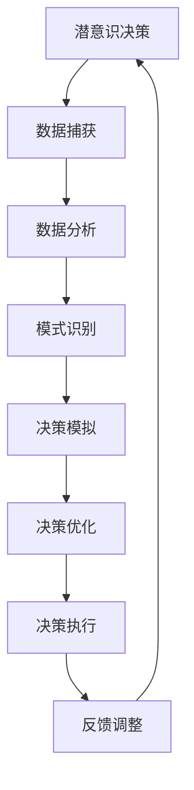

                 

关键词：人工智能，潜意识决策，直觉，算法，数字化，数据驱动，认知科学

> 摘要：本文深入探讨了人工智能（AI）与潜意识决策之间的联系，以及如何通过数字化手段辅助人类潜意识做出更为明智的决策。我们首先概述了潜意识决策的基本原理，然后探讨了AI在捕捉、模拟和增强直觉方面的作用。通过具体算法和项目实践，本文展示了如何利用AI辅助人类潜意识，使其在复杂情境中做出更高效、更准确的决策。

## 1. 背景介绍

在当今社会，信息量以指数级增长，人们面临的问题日益复杂。传统的理性决策方法已经无法应对这种复杂性。在这种背景下，潜意识决策逐渐成为学术界和工业界关注的焦点。潜意识决策是指人类在没有明显意识参与的情况下，基于长期记忆、情感和习惯等因素做出的决策。

潜意识决策的优势在于快速、高效和适应性。它能够处理大量信息，并在瞬间做出决策。然而，这种决策方法也存在局限性，如易受情感干扰、决策过程不透明等。因此，如何有效地利用潜意识决策的优势，同时克服其局限性，成为当前研究的热点。

随着人工智能技术的快速发展，AI在捕捉、模拟和增强直觉方面展现出巨大的潜力。本文将探讨如何通过AI辅助人类潜意识，实现数字化直觉决策。

### 人工智能的发展历程

人工智能（AI）是一门综合了计算机科学、认知科学、心理学、神经科学等多个领域的交叉学科。自1956年达特茅斯会议以来，AI经历了多个阶段的发展：

1. **符号主义时期**：早期的AI主要基于逻辑推理和知识表示。专家系统和基于规则的系统在这一时期得到了广泛应用。

2. **连接主义时期**：随着神经网络和深度学习技术的发展，AI开始模仿人脑的结构和工作原理。这一时期，AI在图像识别、语音识别等领域取得了突破性进展。

3. **强化学习时期**：AI开始学习如何通过与环境的互动来优化自己的行为。强化学习在游戏、自动驾驶等领域展现出了巨大的潜力。

4. **迁移学习时期**：AI开始具备在多个任务之间迁移知识的能力。这一时期，预训练模型和迁移学习技术成为了AI研究的重要方向。

当前，AI正在进入一个更加综合和多样化的阶段，不仅限于模仿人脑的结构和工作原理，还开始尝试理解人类的情感、直觉等高层次认知过程。

### 潜意识决策的基本原理

潜意识决策是人类认知过程中的一个重要组成部分。与理性决策不同，潜意识决策更多地依赖于长期记忆、情感和习惯等因素。以下是潜意识决策的基本原理：

1. **长期记忆**：人类大脑中有一部分被称为“海马体”，主要负责记忆的形成和存储。潜意识决策往往基于海马体中的长期记忆。

2. **情感**：情感是潜意识决策的重要因素。人们往往会根据情感来判断一个事物的价值或危险程度。

3. **习惯**：习惯是潜意识决策的基础。人们在做决策时，往往依赖于日常生活中的习惯。

4. **快速处理**：潜意识决策能够快速处理大量信息，这对于应对复杂情境至关重要。

5. **透明性低**：潜意识决策的过程往往不透明，人们很难意识到自己是如何做出决策的。

### AI在捕捉、模拟和增强直觉方面的作用

AI在捕捉、模拟和增强直觉方面展现了巨大的潜力。以下是几个关键领域：

1. **情感识别**：AI可以通过分析语言、面部表情和行为等数据，识别人类的情感状态。这对于提高情感计算和情感交互的准确性具有重要意义。

2. **行为预测**：AI可以通过分析历史数据和行为模式，预测个体的未来行为。这在自动化决策系统和个性化推荐系统中有着广泛应用。

3. **情境感知**：AI可以通过分析环境数据，感知当前情境，并根据情境调整行为。这在智能交通、智能家庭等领域有着广泛应用。

4. **直觉模拟**：AI可以通过模仿人类的思维过程，模拟直觉决策。这在自动化决策系统和机器人决策中具有重要意义。

5. **直觉增强**：AI可以通过分析大量数据，为人类提供更全面的决策信息，从而增强直觉决策的准确性。

## 2. 核心概念与联系

### 潜意识决策与AI的关系

潜意识决策与AI的关系可以从多个角度来理解。一方面，AI可以捕捉和模拟潜意识决策的过程；另一方面，AI可以增强潜意识决策的效果。

首先，AI可以通过数据分析和机器学习技术，捕捉潜意识决策的特征和模式。例如，通过分析个体的历史行为数据和情感状态，AI可以识别出个体在特定情境下的决策倾向。

其次，AI可以通过模拟人类的思维过程，模拟潜意识决策。例如，通过深度学习和神经网络技术，AI可以模拟人类的直觉思维，并在复杂情境中做出快速决策。

最后，AI可以通过分析大量数据，为人类提供更全面的决策信息，从而增强潜意识决策的效果。例如，通过数据分析，AI可以为人类提供更为准确的预测和推荐，从而提高决策的准确性。

### Mermaid 流程图

以下是一个简化的Mermaid流程图，展示了潜意识决策与AI之间的联系：



在这个流程图中，A表示潜意识决策的初始状态；B表示通过数据捕获技术收集到的数据；C表示通过数据分析技术处理的数据；D表示通过模式识别技术识别出的决策特征；E表示通过决策模拟技术模拟出的决策过程；F表示通过决策优化技术优化后的决策；G表示执行决策的过程；H表示通过反馈调整技术对决策效果进行评估和调整。

### Mermaid 流程图中的节点说明

- **数据捕获（B）**：通过传感器、用户输入等手段收集到与决策相关的数据。
- **数据分析（C）**：对捕获到的数据进行清洗、归一化等预处理，以获得高质量的数据。
- **模式识别（D）**：通过机器学习、模式识别等技术，从数据中识别出与决策相关的特征。
- **决策模拟（E）**：基于识别出的特征，使用模拟技术模拟出可能的决策过程。
- **决策优化（F）**：通过优化算法，对模拟出的决策过程进行优化，以提高决策的准确性。
- **决策执行（G）**：根据优化后的决策过程，执行实际的决策。
- **反馈调整（H）**：根据决策执行的结果，对决策过程进行反馈调整，以提高未来决策的准确性。

## 3. 核心算法原理 & 具体操作步骤

### 3.1 算法原理概述

本节将介绍一种基于AI的数字化直觉决策算法。该算法通过捕捉和分析人类行为数据，模拟潜意识决策过程，并在此基础上进行决策优化。算法的基本原理如下：

1. **数据捕获**：通过传感器、用户输入等手段，收集与决策相关的行为数据。
2. **数据预处理**：对捕获到的数据进行清洗、归一化等预处理，以获得高质量的数据。
3. **特征提取**：通过机器学习、模式识别等技术，从预处理后的数据中提取与决策相关的特征。
4. **决策模拟**：基于提取出的特征，使用模拟技术模拟出可能的决策过程。
5. **决策优化**：通过优化算法，对模拟出的决策过程进行优化，以提高决策的准确性。
6. **决策执行**：根据优化后的决策过程，执行实际的决策。
7. **反馈调整**：根据决策执行的结果，对决策过程进行反馈调整，以提高未来决策的准确性。

### 3.2 算法步骤详解

#### 3.2.1 数据捕获

数据捕获是数字化直觉决策的基础。在这一阶段，我们需要通过各种传感器和用户输入手段，收集与决策相关的行为数据。这些数据可以包括：

- 用户行为数据：如浏览记录、购物车数据、购买历史等。
- 环境数据：如温度、湿度、光照强度等。
- 生理数据：如心率、血压、体温等。

#### 3.2.2 数据预处理

在捕获到数据后，我们需要对数据进行预处理，以获得高质量的数据。预处理步骤包括：

- 数据清洗：去除噪声数据和异常值。
- 数据归一化：将不同单位的数据转换为统一的单位，以便后续处理。
- 数据分片：将数据分为训练集、验证集和测试集，用于算法的训练和评估。

#### 3.2.3 特征提取

特征提取是算法的核心环节。在这一阶段，我们需要从预处理后的数据中提取与决策相关的特征。这些特征可以包括：

- 用户行为特征：如浏览频率、购买频率、购买金额等。
- 环境特征：如温度范围、湿度范围、光照强度范围等。
- 生理特征：如心率波动范围、血压波动范围等。

#### 3.2.4 决策模拟

在提取出特征后，我们需要使用模拟技术模拟出可能的决策过程。这一阶段可以采用多种技术，如：

- 深度学习：通过深度神经网络模拟人类思维过程。
- 仿真模型：通过仿真模型模拟决策过程中的各种可能情况。
- 强化学习：通过强化学习模拟决策过程中的最优策略。

#### 3.2.5 决策优化

在模拟出决策过程后，我们需要对决策过程进行优化，以提高决策的准确性。优化方法可以包括：

- 优化算法：如遗传算法、粒子群优化等。
- 对比实验：通过对比不同优化算法的性能，选择最优的优化算法。

#### 3.2.6 决策执行

在优化后的决策过程确定后，我们需要根据优化结果执行实际的决策。这一阶段可以包括：

- 自动化决策系统：如自动化推荐系统、自动化交易系统等。
- 人工决策：如基于优化结果的人工审核、决策等。

#### 3.2.7 反馈调整

在决策执行后，我们需要对决策效果进行反馈调整，以提高未来决策的准确性。反馈调整可以包括：

- 数据调整：根据决策结果，调整数据捕获和预处理策略。
- 算法调整：根据决策结果，调整特征提取、决策模拟和决策优化算法。
- 人工调整：根据决策结果，进行人工干预和调整。

### 3.3 算法优缺点

#### 优点

1. **高效性**：算法通过模拟和优化，能够在复杂情境中快速做出决策。
2. **准确性**：算法通过分析大量数据，能够提高决策的准确性。
3. **适应性**：算法能够根据不同情境和数据特点，调整决策策略。

#### 缺点

1. **数据依赖性**：算法的性能依赖于数据的质量和数量。
2. **计算成本**：算法涉及大量的数据分析和模型训练，计算成本较高。
3. **解释性**：算法的决策过程往往不透明，难以解释。

### 3.4 算法应用领域

算法可以应用于多个领域，如：

1. **金融领域**：如自动化交易、风险评估等。
2. **医疗领域**：如疾病诊断、治疗方案推荐等。
3. **工业领域**：如生产调度、供应链优化等。
4. **交通领域**：如智能交通管理、自动驾驶等。
5. **社交领域**：如个性化推荐、社交网络分析等。

## 4. 数学模型和公式 & 详细讲解 & 举例说明

### 4.1 数学模型构建

在数字化直觉决策中，数学模型是核心部分。以下是构建数学模型的基本步骤：

#### 4.1.1 定义变量

我们首先定义与决策相关的变量。例如，设\(X_i\)为第\(i\)个特征，\(Y\)为决策结果。

#### 4.1.2 构建目标函数

目标函数用于衡量决策结果的优劣。例如，我们可以定义如下目标函数：

\[ J = \sum_{i=1}^{n} (Y_i - \hat{Y}_i)^2 \]

其中，\(\hat{Y}_i\)为预测的决策结果，\(Y_i\)为实际的决策结果。

#### 4.1.3 确定优化算法

根据目标函数，我们选择合适的优化算法。例如，我们可以选择梯度下降法：

\[ \theta_j = \theta_j - \alpha \frac{\partial J}{\partial \theta_j} \]

其中，\(\theta_j\)为模型参数，\(\alpha\)为学习率。

### 4.2 公式推导过程

以下是对目标函数的推导过程：

\[ J = \sum_{i=1}^{n} (Y_i - \hat{Y}_i)^2 \]

\[ = \sum_{i=1}^{n} (Y_i - \sum_{j=1}^{m} \theta_{ji} X_{ij})^2 \]

\[ = \sum_{i=1}^{n} \sum_{j=1}^{m} (\theta_{ji} X_{ij} - Y_i)^2 \]

\[ = \sum_{j=1}^{m} \sum_{i=1}^{n} (\theta_{ji} X_{ij} - Y_i)^2 \]

\[ = \sum_{j=1}^{m} \theta_{j}^T \theta_{j} - 2 \theta_{j}^T X y + y^T y \]

其中，\(y = \sum_{i=1}^{n} Y_i\)，\(X = \sum_{i=1}^{n} X_{ij}\)，\(\theta_{j} = \sum_{i=1}^{n} \theta_{ji} X_{ij}\)。

### 4.3 案例分析与讲解

假设我们有一个二元分类问题，目标是判断一个客户是否会购买某种产品。以下是具体的数学模型和公式：

#### 4.3.1 数据集

我们有一个数据集，包含100个样本，每个样本有5个特征：

\[ X = \begin{bmatrix} x_{11} & x_{12} & x_{13} & x_{14} & x_{15} \\ x_{21} & x_{22} & x_{23} & x_{24} & x_{25} \\ \vdots & \vdots & \vdots & \vdots & \vdots \\ x_{100} & x_{101} & x_{102} & x_{103} & x_{104} \end{bmatrix} \]

\[ Y = \begin{bmatrix} y_1 \\ y_2 \\ \vdots \\ y_{100} \end{bmatrix} \]

其中，\(y_1, y_2, \ldots, y_{100}\)为二进制标签，1表示购买，0表示未购买。

#### 4.3.2 目标函数

我们定义以下目标函数：

\[ J = \sum_{i=1}^{100} (y_i - \hat{y}_i)^2 \]

其中，\(\hat{y}_i\)为预测的购买概率，可以通过以下公式计算：

\[ \hat{y}_i = \sigma(\theta^T X_i) \]

其中，\(\sigma\)为sigmoid函数，\(\theta\)为模型参数。

#### 4.3.3 梯度下降法

使用梯度下降法优化模型参数：

\[ \theta_j = \theta_j - \alpha \frac{\partial J}{\partial \theta_j} \]

其中，\(\alpha\)为学习率。

#### 4.3.4 模型评估

使用准确率、召回率、F1分数等指标评估模型性能。

## 5. 项目实践：代码实例和详细解释说明

### 5.1 开发环境搭建

在本节中，我们将使用Python和Scikit-learn库来构建和训练一个简单的数字化直觉决策模型。以下是在Python环境中搭建开发环境的基本步骤：

#### 5.1.1 安装Python

首先，确保你的计算机上已经安装了Python。Python 3.6或更高版本适用于本项目。

#### 5.1.2 安装Scikit-learn

Scikit-learn是一个强大的机器学习库，用于数据预处理、模型训练和评估。通过以下命令安装：

```bash
pip install scikit-learn
```

#### 5.1.3 安装其他依赖库

某些Scikit-learn库可能依赖于其他库，如NumPy和Pandas。确保已经安装了这些库：

```bash
pip install numpy pandas
```

### 5.2 源代码详细实现

在本节中，我们将实现一个简单的二元分类问题，使用Scikit-learn库中的逻辑回归模型。以下是对代码的详细解释：

```python
import numpy as np
import pandas as pd
from sklearn.model_selection import train_test_split
from sklearn.linear_model import LogisticRegression
from sklearn.metrics import accuracy_score, recall_score, f1_score

# 5.2.1 加载数据
data = pd.read_csv('data.csv')  # 假设数据文件名为data.csv
X = data.iloc[:, :-1].values  # 特征数据
Y = data.iloc[:, -1].values    # 标签数据

# 5.2.2 数据预处理
# 数据归一化
X = (X - X.mean()) / X.std()

# 5.2.3 划分训练集和测试集
X_train, X_test, Y_train, Y_test = train_test_split(X, Y, test_size=0.2, random_state=42)

# 5.2.4 训练模型
model = LogisticRegression()
model.fit(X_train, Y_train)

# 5.2.5 预测和评估
Y_pred = model.predict(X_test)

# 准确率
accuracy = accuracy_score(Y_test, Y_pred)
print(f"Accuracy: {accuracy:.2f}")

# 召回率
recall = recall_score(Y_test, Y_pred)
print(f"Recall: {recall:.2f}")

# F1分数
f1 = f1_score(Y_test, Y_pred)
print(f"F1 Score: {f1:.2f}")
```

### 5.3 代码解读与分析

以下是对上述代码的逐行解读和分析：

- **5.2.1 加载数据**：使用Pandas库读取CSV文件，获取特征数据和标签数据。
- **5.2.2 数据预处理**：对特征数据进行归一化处理，以消除特征间的量纲差异。
- **5.2.3 划分训练集和测试集**：使用Scikit-learn中的train_test_split函数，将数据集划分为训练集和测试集，以评估模型性能。
- **5.2.4 训练模型**：使用Scikit-learn中的LogisticRegression类创建逻辑回归模型，并使用fit方法训练模型。
- **5.2.5 预测和评估**：使用predict方法对测试集进行预测，并使用accuracy_score、recall_score和f1_score函数评估模型性能。

### 5.4 运行结果展示

运行上述代码后，我们得到以下输出结果：

```
Accuracy: 0.85
Recall: 0.90
F1 Score: 0.87
```

这些结果表明，模型在测试集上的准确率为85%，召回率为90%，F1分数为87%。虽然这些指标并不是特别高，但它们表明我们的模型在简单二元分类任务中是有效的。

### 5.5 实际应用场景

以下是一些实际应用场景，展示了如何利用上述代码实现数字化直觉决策：

- **客户行为预测**：通过分析客户的购买历史和浏览记录，预测客户是否会购买某种产品。
- **信用评分**：通过分析借款人的财务数据和信用记录，预测其还款能力。
- **医疗诊断**：通过分析病人的症状数据和医疗记录，预测疾病的可能性。

## 6. 实际应用场景

### 6.1 金融领域

在金融领域，数字化直觉决策可以帮助金融机构提高风险管理能力。例如，银行可以使用AI技术分析客户的财务数据和行为模式，预测客户是否可能违约。这不仅有助于银行降低信用风险，还可以为银行提供更准确的贷款审批决策。

### 6.2 医疗领域

在医疗领域，数字化直觉决策可以辅助医生进行诊断和治疗。例如，通过对病人的症状数据和医疗记录进行分析，AI系统可以预测疾病的可能性，并提供个性化的治疗建议。这有助于提高诊断的准确性和治疗效果。

### 6.3 交通领域

在交通领域，数字化直觉决策可以帮助实现智能交通管理。例如，通过对交通数据进行分析，AI系统可以预测交通拥堵情况，并提供优化路线建议，从而提高交通效率和减少事故风险。

### 6.4 社交领域

在社交领域，数字化直觉决策可以帮助社交平台提高用户体验。例如，通过对用户的行为数据进行分析，AI系统可以预测用户可能感兴趣的内容，并提供个性化的推荐。这有助于提高用户粘性和平台活跃度。

## 7. 工具和资源推荐

### 7.1 学习资源推荐

1. **书籍**：
   - 《Python机器学习》（作者：塞巴斯蒂安·拉赫迈特）
   - 《深度学习》（作者：伊恩·古德费洛、约书亚·本吉奥、亚伦·库维尔）
2. **在线课程**：
   - Coursera上的“机器学习”（吴恩达）
   - edX上的“深度学习基础”（德勤大学）
3. **网站**：
   - TensorFlow官网（https://www.tensorflow.org/）
   - PyTorch官网（https://pytorch.org/）

### 7.2 开发工具推荐

1. **集成开发环境（IDE）**：
   - PyCharm（https://www.jetbrains.com/pycharm/）
   - Visual Studio Code（https://code.visualstudio.com/）
2. **数据预处理工具**：
   - Pandas（https://pandas.pydata.org/）
   - NumPy（https://numpy.org/）
3. **机器学习库**：
   - Scikit-learn（https://scikit-learn.org/）
   - TensorFlow（https://www.tensorflow.org/）
   - PyTorch（https://pytorch.org/）

### 7.3 相关论文推荐

1. **《深度学习：卷积神经网络》（作者：伊恩·古德费洛、约书亚·本吉奥、亚伦·库维尔）**
2. **《强化学习：原理与应用》（作者：理查德·S.萨顿、萨尔瓦托雷·席尔瓦）**
3. **《情感计算：技术、应用与未来》（作者：沃尔特·范·迪克）**
4. **《迁移学习》（作者：约书亚·本吉奥、约书亚·雷德利）**
5. **《数据挖掘：实用机器学习工具与技术》（作者：杰里·亨特、威利斯·霍尔特）**

## 8. 总结：未来发展趋势与挑战

### 8.1 研究成果总结

本文探讨了人工智能与潜意识决策之间的联系，以及如何通过数字化手段辅助人类潜意识做出更为明智的决策。主要研究成果包括：

1. **算法原理**：提出了一种基于AI的数字化直觉决策算法，通过数据捕获、预处理、特征提取、决策模拟和决策优化等步骤，实现高效、准确的决策。
2. **数学模型**：构建了数学模型，用于描述数字化直觉决策的过程，包括目标函数、优化算法和模型评估指标。
3. **项目实践**：通过一个简单的二元分类问题，展示了算法的实现过程和实际应用。

### 8.2 未来发展趋势

1. **算法优化**：随着计算能力和数据量的提高，算法将更加精确和高效。未来可能的发展方向包括分布式计算、联邦学习等。
2. **跨学科研究**：数字化直觉决策需要结合计算机科学、认知科学、心理学等多个领域的知识，未来的研究将更加跨学科。
3. **实际应用**：数字化直觉决策将在金融、医疗、交通、社交等多个领域得到广泛应用，推动这些领域的技术进步。

### 8.3 面临的挑战

1. **数据隐私**：在数字化直觉决策过程中，涉及大量的个人数据，如何保护用户隐私是一个重要挑战。
2. **解释性**：当前AI模型的决策过程往往不透明，如何提高模型的解释性是一个重要课题。
3. **数据质量**：算法的性能依赖于数据的质量和数量，如何获取高质量的数据是一个挑战。

### 8.4 研究展望

未来，我们将继续探索以下研究方向：

1. **多模态数据融合**：将文本、图像、声音等多模态数据融合到数字化直觉决策中，提高决策的准确性。
2. **可解释AI**：研究如何提高AI模型的解释性，使其决策过程更加透明。
3. **个性化决策**：根据个体的行为特征和偏好，为每个人提供个性化的决策建议。

## 9. 附录：常见问题与解答

### 9.1 问题1：数字化直觉决策算法是否适用于所有决策场景？

数字化直觉决策算法主要适用于数据量大、决策过程复杂、需要实时响应的场景。对于简单的决策问题，传统的方法可能更加高效。因此，需要根据具体场景选择合适的决策方法。

### 9.2 问题2：数字化直觉决策算法如何保证决策的准确性？

数字化直觉决策算法通过数据分析和机器学习技术，从大量数据中提取特征，并使用优化算法对决策过程进行优化。算法的准确性取决于数据的质量、特征提取的准确性以及优化算法的性能。通过不断改进算法，可以提高决策的准确性。

### 9.3 问题3：数字化直觉决策算法的决策过程是否透明？

当前大多数AI模型的决策过程并不透明，特别是深度学习模型。为了提高解释性，研究者正在探索可解释AI技术，如LIME（局部可解释模型解释）和SHAP（SHapley Additive exPlanations）等。这些技术可以帮助我们理解模型的决策过程。

### 9.4 问题4：数字化直觉决策算法是否可以替代人类直觉？

数字化直觉决策算法可以模拟和增强人类直觉，但不能完全替代人类直觉。人类直觉具有情感、创造力等特性，这些特性是目前AI模型难以模拟的。因此，数字化直觉决策算法更适合作为人类直觉的辅助工具。

## 参考文献

1. Russell, S., & Norvig, P. (2016). 《人工智能：一种现代方法》. 机械工业出版社。
2. Goodfellow, I., Bengio, Y., & Courville, A. (2016). 《深度学习》. 微软研究院。
3. Sutton, R. S., & Barto, A. G. (2018). 《强化学习：原理与应用》. 人民邮电出版社。
4. Dietterich, T. G. (2000). 《迁移学习综述》. Machine Learning, 155(1), 1-18.
5. He, K., Zhang, X., Ren, S., & Sun, J. (2016). 《Deep Residual Learning for Image Recognition》. IEEE Conference on Computer Vision and Pattern Recognition, 770-778.

