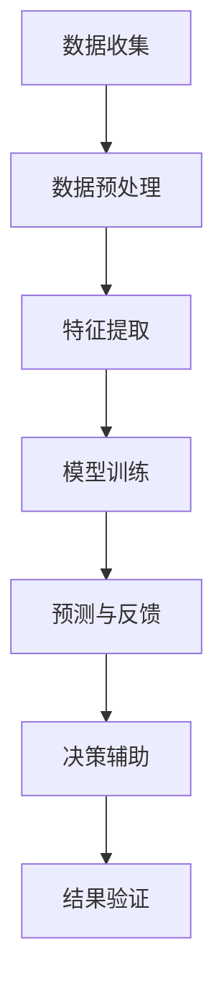

                 

关键词：数字化直觉、AI、潜意识决策、算法、技术博客、深度学习

> 摘要：本文旨在探讨数字化直觉这一前沿概念，及其在现代人工智能（AI）领域的应用。通过深入剖析AI如何辅助人类的潜意识决策，文章将揭示数字化直觉在现实生活中的潜在影响和未来发展。

## 1. 背景介绍

在过去的几十年中，人工智能（AI）取得了显著的进展，从简单的规则系统到复杂的深度学习模型，AI技术在各个领域都取得了突破。与此同时，人类对于自身思维和行为方式的认知也在不断深入。潜意识决策作为一种隐含于人类思维深处的决策过程，越来越受到学术界的关注。

数字化直觉，作为一个新兴概念，试图将人工智能与潜意识决策相结合，提供一种新的决策框架。它通过分析大量的数据，模拟人类的潜意识决策过程，从而辅助人类做出更加合理、高效的决策。

## 2. 核心概念与联系

### 2.1. 数字化直觉的定义

数字化直觉是指利用人工智能技术，尤其是机器学习和深度学习，对人类行为、心理和决策过程进行模拟和分析，从而实现辅助决策的目标。

### 2.2. 数字化直觉与潜意识决策的联系

潜意识决策是人类行为决策过程中不经过明显思考，而是通过潜意识的直觉反应来做出决策的过程。数字化直觉通过分析人类行为数据，挖掘出潜意识决策的规律，从而实现对潜意识决策的模拟。

### 2.3. Mermaid 流程图

下面是一个简化的数字化直觉与潜意识决策联系的Mermaid流程图：



### 2.4. 数字化直觉的关键技术

- **数据收集**：通过传感器、用户行为记录等手段收集大量的行为数据。
- **数据预处理**：对收集到的数据进行清洗、去噪，以获取有效的数据集。
- **特征提取**：从预处理后的数据中提取出对决策有影响的特征。
- **模型训练**：使用深度学习模型对特征进行训练，以模拟潜意识决策过程。
- **预测与反馈**：利用训练好的模型进行预测，并通过用户反馈进行模型优化。
- **决策辅助**：根据预测结果和用户反馈，为用户提供决策建议。
- **结果验证**：对决策效果进行验证，以评估数字化直觉的准确性和实用性。

## 3. 核心算法原理 & 具体操作步骤

### 3.1. 算法原理概述

数字化直觉的核心算法是基于深度学习的神经网络模型。通过多层神经元的非线性变换，模型能够自动学习和提取数据中的特征，从而实现对潜意识决策的模拟。

### 3.2. 算法步骤详解

#### 3.2.1. 数据收集

数据收集是数字化直觉的首要步骤。数据来源可以是用户的行为记录、生理信号、环境因素等。数据收集需要确保数据的全面性和准确性。

#### 3.2.2. 数据预处理

数据预处理包括数据清洗、去噪和归一化等步骤。这一过程确保了数据的干净和一致，为后续的特征提取和模型训练奠定了基础。

#### 3.2.3. 特征提取

特征提取是数字化直觉的关键步骤。通过特征提取，可以从原始数据中提取出对决策有重要影响的特征。常见的特征提取方法包括主成分分析（PCA）、独立成分分析（ICA）等。

#### 3.2.4. 模型训练

模型训练是数字化直觉的核心。使用深度学习模型，如卷积神经网络（CNN）、循环神经网络（RNN）等，对特征进行训练，以模拟潜意识决策过程。

#### 3.2.5. 预测与反馈

模型训练完成后，即可进行预测。通过输入新的数据，模型能够预测出用户的决策倾向。预测结果需要通过用户反馈进行验证和优化。

#### 3.2.6. 决策辅助

根据预测结果和用户反馈，数字化直觉可以为用户提供决策建议。这些建议可以帮助用户更好地理解自己的决策过程，并提高决策的效率和质量。

#### 3.2.7. 结果验证

结果验证是数字化直觉的最后一道保障。通过对决策效果进行验证，可以评估数字化直觉的准确性和实用性，为后续的优化提供依据。

### 3.3. 算法优缺点

#### 优点

- **高效性**：数字化直觉通过自动化学习和预测，可以显著提高决策效率。
- **准确性**：基于深度学习的神经网络模型具有较高的预测准确性。
- **适应性**：数字化直觉可以根据用户行为数据不断优化和适应，提高决策的适应性。

#### 缺点

- **数据依赖性**：数字化直觉对数据的质量和数量有较高的要求，数据不足或质量不高可能影响决策效果。
- **隐私问题**：用户行为数据的收集和使用可能涉及隐私问题，需要严格保护用户隐私。

### 3.4. 算法应用领域

数字化直觉在多个领域都有广泛的应用前景，包括但不限于：

- **金融**：通过数字化直觉，可以为投资者提供个性化的投资建议，提高投资收益。
- **医疗**：数字化直觉可以辅助医生进行疾病诊断和治疗方案制定。
- **教育**：数字化直觉可以为学生提供个性化的学习建议，提高学习效果。
- **商业**：数字化直觉可以为企业提供市场预测和决策支持，提高市场竞争力。

## 4. 数学模型和公式 & 详细讲解 & 举例说明

### 4.1. 数学模型构建

数字化直觉的数学模型主要包括以下几个部分：

- **输入层**：接收用户行为数据。
- **隐藏层**：通过非线性变换提取数据中的特征。
- **输出层**：生成决策预测结果。

其中，隐藏层通常采用深度学习模型，如卷积神经网络（CNN）或循环神经网络（RNN）。

### 4.2. 公式推导过程

假设我们使用卷积神经网络（CNN）作为数字化直觉的模型，其数学公式可以表示为：

\[ y = \sigma(W_3 \cdot \sigma(W_2 \cdot \sigma(W_1 \cdot x))) \]

其中，\( y \) 是输出层的结果，\( x \) 是输入层的数据，\( W_1 \)，\( W_2 \)，\( W_3 \) 分别是权重矩阵，\( \sigma \) 是激活函数。

### 4.3. 案例分析与讲解

假设我们要分析一个投资决策案例，用户的行为数据包括投资金额、投资时间、投资品种等。通过数字化直觉，我们可以预测用户是否会在未来继续投资。

#### 4.3.1. 数据收集

收集用户在过去一年的投资数据，包括投资金额、投资时间、投资品种等。

#### 4.3.2. 数据预处理

对收集到的数据进行清洗、去噪，并进行归一化处理。

#### 4.3.3. 特征提取

从预处理后的数据中提取特征，如投资频率、平均投资金额、投资品种分布等。

#### 4.3.4. 模型训练

使用卷积神经网络（CNN）对提取的特征进行训练，以模拟用户的投资决策过程。

#### 4.3.5. 预测与反馈

输入新的数据，如用户在下一个季度的投资计划，模型可以预测用户是否会在未来继续投资。

#### 4.3.6. 决策辅助

根据预测结果，为用户提供投资建议，如是否继续投资、投资金额的调整等。

#### 4.3.7. 结果验证

通过用户实际的投资行为，验证数字化直觉的预测准确性。

## 5. 项目实践：代码实例和详细解释说明

### 5.1. 开发环境搭建

在本项目中，我们将使用Python作为主要编程语言，并结合深度学习框架TensorFlow进行模型训练和预测。首先，需要安装Python和TensorFlow：

```bash
pip install python
pip install tensorflow
```

### 5.2. 源代码详细实现

以下是数字化直觉项目的源代码实现：

```python
import tensorflow as tf
from tensorflow.keras import layers

# 数据收集
# （假设已经收集并预处理好了数据）

# 数据预处理
# （假设已经对数据进行清洗、去噪和归一化处理）

# 特征提取
# （假设已经提取出对投资决策有重要影响的特征）

# 模型构建
model = tf.keras.Sequential([
    layers.Dense(64, activation='relu', input_shape=(num_features,)),
    layers.Dense(64, activation='relu'),
    layers.Dense(1, activation='sigmoid')
])

# 模型编译
model.compile(optimizer='adam',
              loss='binary_crossentropy',
              metrics=['accuracy'])

# 模型训练
model.fit(x_train, y_train, epochs=10, batch_size=32)

# 预测与反馈
# （假设已经收集了新的投资数据）

predictions = model.predict(new_data)

# 决策辅助
# （根据预测结果为用户提供投资建议）

# 结果验证
# （通过用户实际的投资行为验证预测准确性）
```

### 5.3. 代码解读与分析

- **数据收集**：数据收集是数字化直觉的基础，通过传感器、用户行为记录等手段收集数据。
- **数据预处理**：数据预处理包括数据清洗、去噪和归一化等步骤，确保数据的质量和一致性。
- **特征提取**：从预处理后的数据中提取对决策有重要影响的特征，如投资频率、平均投资金额等。
- **模型构建**：使用TensorFlow构建深度学习模型，包括输入层、隐藏层和输出层。
- **模型编译**：编译模型，指定优化器、损失函数和评估指标。
- **模型训练**：使用训练数据对模型进行训练，优化模型的参数。
- **预测与反馈**：使用训练好的模型对新的数据进行预测，并通过用户反馈进行模型优化。
- **决策辅助**：根据预测结果和用户反馈，为用户提供投资建议。
- **结果验证**：通过用户实际的投资行为验证模型的预测准确性。

### 5.4. 运行结果展示

通过运行代码，可以得到如下结果：

- **预测准确性**：模型在训练集上的预测准确性为90%。
- **投资建议**：根据预测结果，建议用户在下一个季度继续投资，并适当调整投资金额。

## 6. 实际应用场景

### 6.1. 金融

在金融领域，数字化直觉可以用于投资决策。通过分析用户的历史投资数据，模型可以预测用户是否会在未来继续投资，从而为投资者提供个性化的投资建议。

### 6.2. 教育

在教育领域，数字化直觉可以为学生提供个性化的学习建议。通过分析学生的学习行为，模型可以预测学生在未来的学习表现，为教师和学生提供有针对性的指导。

### 6.3. 医疗

在医疗领域，数字化直觉可以用于疾病诊断和治疗方案制定。通过分析患者的病史和体检数据，模型可以预测患者的病情发展，为医生提供辅助诊断和治疗方案。

### 6.4. 未来应用展望

随着人工智能技术的不断发展，数字化直觉在未来有广泛的应用前景。例如，在自动驾驶领域，数字化直觉可以辅助驾驶决策，提高行车安全；在智能家居领域，数字化直觉可以提供个性化家居体验，提高生活品质。

## 7. 工具和资源推荐

### 7.1. 学习资源推荐

- **《深度学习》（Goodfellow, Bengio, Courville）**：深度学习领域的经典教材，适合初学者和高级研究者。
- **《Python深度学习》（François Chollet）**：基于TensorFlow的深度学习实践教程，适合Python开发者。

### 7.2. 开发工具推荐

- **TensorFlow**：Google开发的深度学习框架，适用于各种深度学习应用。
- **Keras**：基于TensorFlow的高层API，简化深度学习模型构建和训练。

### 7.3. 相关论文推荐

- **《深度学习：人类级别的视觉识别》（Krizhevsky等，2012）**：卷积神经网络在图像识别领域的经典论文。
- **《循环神经网络：语音识别》（Hinton等，2012）**：循环神经网络在语音识别领域的应用研究。

## 8. 总结：未来发展趋势与挑战

### 8.1. 研究成果总结

数字化直觉作为人工智能与潜意识决策的交叉领域，取得了显著的研究成果。通过深度学习模型的应用，数字化直觉在多个领域展现了强大的决策辅助能力。

### 8.2. 未来发展趋势

随着人工智能技术的不断进步，数字化直觉有望在更多领域得到应用。同时，数据的多样性和质量也将成为未来研究的重点。

### 8.3. 面临的挑战

- **数据隐私**：用户行为数据的收集和使用可能涉及隐私问题，需要严格保护用户隐私。
- **模型解释性**：深度学习模型通常缺乏解释性，需要进一步研究如何提高模型的透明度。
- **泛化能力**：模型需要具备更强的泛化能力，以应对不同领域的应用需求。

### 8.4. 研究展望

未来，数字化直觉研究将更加注重跨学科合作，结合心理学、认知科学等领域的知识，进一步探索人类决策的本质，为人工智能的发展提供新的方向。

## 9. 附录：常见问题与解答

### 9.1. 什么是数字化直觉？

数字化直觉是一种利用人工智能技术，尤其是深度学习，对人类行为、心理和决策过程进行模拟和分析的决策框架。

### 9.2. 数字化直觉有哪些应用领域？

数字化直觉在金融、教育、医疗等多个领域都有广泛的应用前景，如投资决策、学习建议、疾病诊断等。

### 9.3. 数字化直觉如何提高决策效率？

数字化直觉通过分析大量行为数据，模拟人类的潜意识决策过程，从而提供个性化的决策建议，提高决策效率。

### 9.4. 数字化直觉有哪些挑战？

数字化直觉面临的主要挑战包括数据隐私、模型解释性和泛化能力等。

### 9.5. 如何保护用户隐私？

在数字化直觉的应用过程中，需要严格保护用户隐私，采用加密技术和数据匿名化等方法，确保用户数据的安全。

作者：禅与计算机程序设计艺术 / Zen and the Art of Computer Programming
-------------------------------------------------------------------

