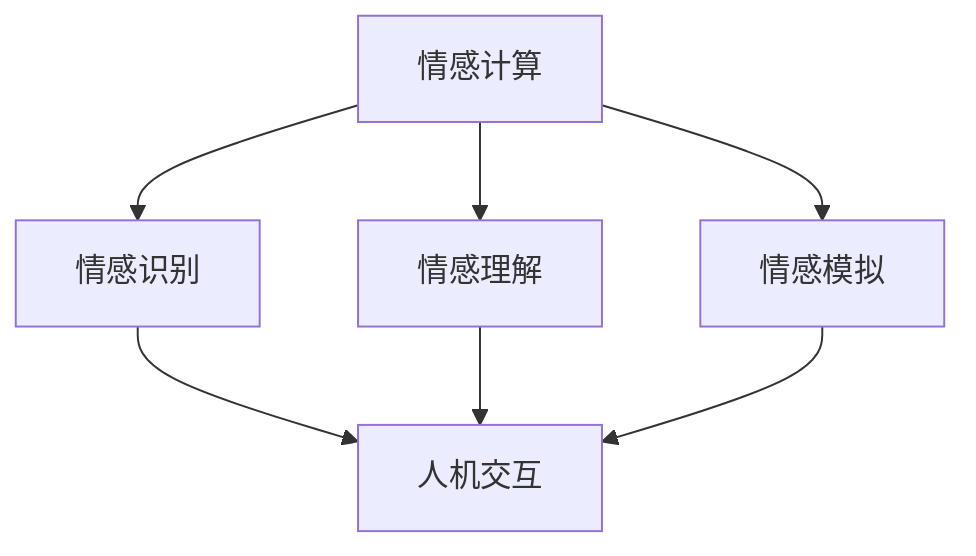

                 

关键词：数字化移情、AI、社交智能、情感计算、人机交互

> 摘要：本文探讨了数字化移情能力的概念，分析了AI如何增强社交智能，并深入讨论了AI在情感计算和人机交互中的应用，提供了未来发展趋势和面临的挑战。

## 1. 背景介绍

随着信息技术的飞速发展，人工智能（AI）已经成为现代社会的重要驱动力。从自动化到智能决策，AI在各个领域都展现出了巨大的潜力。然而，AI的发展不仅仅局限于提高生产效率和优化数据处理，它还深刻影响着人类的生活方式和社会交往。特别是在人机交互领域，AI的进步促使我们重新思考什么是真正的社交智能。

社交智能不仅仅是语言交流的能力，更包括情感的感知、理解和表达。数字化移情能力，即通过AI技术实现的情感感知和响应能力，正逐渐成为人机交互的重要研究方向。本文将深入探讨数字化移情能力的概念，分析AI如何增强社交智能，并讨论其应用领域和未来展望。

## 2. 核心概念与联系

### 2.1 情感计算

情感计算是数字化移情能力的基础。它涉及利用计算机技术和算法来捕捉、解释和模拟人类情感。情感计算包括以下几个核心概念：

- **情感识别**：通过生理信号、语言、面部表情等数据识别用户的情感状态。
- **情感理解**：分析和解释情感识别结果，理解情感的深层含义。
- **情感模拟**：根据用户的情感状态生成相应的情感反馈，提升人机交互的亲和力。

### 2.2 人机交互

人机交互是AI技术的重要应用领域，它关注如何设计系统，使计算机能够理解和响应用户的需求。数字化移情能力为人机交互带来了新的维度，通过情感计算实现更自然、更人性化的交互体验。

### 2.3 Mermaid 流程图

以下是一个简化的情感计算和人机交互的Mermaid流程图，展示了核心概念和联系：



## 3. 核心算法原理 & 具体操作步骤

### 3.1 算法原理概述

数字化移情能力的核心算法主要包括情感识别、情感理解和情感模拟三个部分。情感识别利用机器学习和深度学习技术，通过分析用户的生理信号、语言和面部表情等数据，识别情感状态。情感理解则通过自然语言处理（NLP）和情感分析算法，深入分析情感的内涵。情感模拟则基于生成的情感反馈，提升人机交互的自然性和亲和力。

### 3.2 算法步骤详解

1. **情感识别**：
   - **生理信号处理**：利用传感器捕捉心率、呼吸等生理信号，通过信号处理技术提取情感特征。
   - **语言分析**：分析用户输入的文字，识别情感词汇和句子结构，提取情感特征。
   - **面部表情识别**：通过摄像头捕捉用户的面部表情，利用计算机视觉算法识别情感状态。

2. **情感理解**：
   - **情感分类**：使用机器学习算法对情感识别结果进行分类，如快乐、悲伤、愤怒等。
   - **情感语义分析**：使用NLP技术，深入分析情感的表达方式和内涵，如“我很高兴”和“我有点难过”之间的细微差异。

3. **情感模拟**：
   - **语音合成**：根据情感状态生成相应的语音响应，如柔和、兴奋等。
   - **表情生成**：利用计算机图形学技术，为虚拟助手生成相应的面部表情。
   - **交互反馈**：结合用户的情感状态，调整系统的交互方式，如语速、语气等。

### 3.3 算法优缺点

- **优点**：
  - **个性化**：根据用户的情感状态提供个性化的服务，提升用户体验。
  - **自然性**：通过情感计算实现的交互更接近人类交流，增加交互的自然性和亲和力。
  - **灵活性**：情感计算技术可以根据不同场景和需求进行调整和优化。

- **缺点**：
  - **准确性**：情感识别和理解的准确性仍然是一个挑战，尤其是在复杂情感和微妙情感的表达上。
  - **计算资源**：情感计算需要大量的计算资源和时间，特别是在实时交互中。

### 3.4 算法应用领域

- **客服和客户服务**：通过情感计算实现的智能客服可以更好地理解和满足用户需求，提供个性化的服务。
- **教育**：智能教育系统可以根据学生的情感状态调整教学内容和方式，提高学习效果。
- **医疗**：情感计算可以帮助医生更好地理解患者的情绪和需求，提供更有效的治疗方案。
- **人机交互**：情感计算技术在游戏、娱乐、智能家居等领域有广泛的应用，提升人机交互的自然性和体验。

## 4. 数学模型和公式 & 详细讲解 & 举例说明

### 4.1 数学模型构建

情感计算中的数学模型通常涉及多个方面，包括情感识别、情感理解和情感模拟。以下是构建情感计算数学模型的基本步骤：

1. **数据采集**：收集用户的生理信号、语言数据和面部表情数据。
2. **特征提取**：从原始数据中提取与情感相关的特征，如心率变异性、语音频率、面部动作编码系统（FACS）特征等。
3. **模型训练**：使用机器学习和深度学习算法，训练情感识别和理解的模型。
4. **模型评估**：通过交叉验证和测试数据集，评估模型的准确性和泛化能力。
5. **模型部署**：将训练好的模型部署到实际应用中，实现情感计算功能。

### 4.2 公式推导过程

在情感计算中，常用的公式和推导过程包括：

- **情感识别公式**：使用支持向量机（SVM）进行情感分类，公式如下：
  $$y = \text{sign}(\sum_{i=1}^{n} w_i \phi(x_i))$$
  其中，$w_i$ 是权值，$\phi(x_i)$ 是特征向量。

- **情感理解公式**：使用神经网络进行情感语义分析，公式如下：
  $$z = \sigma(\sum_{i=1}^{n} w_i a_i)$$
  其中，$a_i$ 是输入向量，$\sigma$ 是激活函数。

### 4.3 案例分析与讲解

以下是一个简单的情感计算案例，用于分析用户对话中的情感：

1. **数据采集**：采集用户的对话文本。
2. **特征提取**：提取文本中的情感词汇和句法特征。
3. **模型训练**：使用情感分类模型（如朴素贝叶斯、SVM等）进行训练。
4. **情感识别**：对用户对话进行情感分类，如“积极”、“消极”等。
5. **情感理解**：进一步分析情感分类结果，理解情感的具体内涵，如“快乐”、“悲伤”等。

## 5. 项目实践：代码实例和详细解释说明

### 5.1 开发环境搭建

在Python环境中，使用以下库进行情感计算项目开发：

- **NumPy**：用于数学运算。
- **Pandas**：用于数据处理。
- **Scikit-learn**：用于机器学习算法。
- **Natural Language Toolkit (NLTK)**：用于自然语言处理。
- **TensorFlow**：用于深度学习模型。

### 5.2 源代码详细实现

以下是情感计算项目的代码实现，分为三个部分：数据预处理、模型训练和模型应用。

#### 数据预处理

```python
import pandas as pd
from sklearn.model_selection import train_test_split
from sklearn.feature_extraction.text import TfidfVectorizer

# 读取数据
data = pd.read_csv('dialogues.csv')
X = data['text']
y = data['emotion']

# 划分训练集和测试集
X_train, X_test, y_train, y_test = train_test_split(X, y, test_size=0.2, random_state=42)

# 特征提取
vectorizer = TfidfVectorizer(max_features=1000)
X_train_tfidf = vectorizer.fit_transform(X_train)
X_test_tfidf = vectorizer.transform(X_test)
```

#### 模型训练

```python
from sklearn.naive_bayes import MultinomialNB
from sklearn.metrics import classification_report

# 训练模型
model = MultinomialNB()
model.fit(X_train_tfidf, y_train)

# 预测测试集
y_pred = model.predict(X_test_tfidf)

# 评估模型
print(classification_report(y_test, y_pred))
```

#### 模型应用

```python
def predict_emotion(text):
    text_tfidf = vectorizer.transform([text])
    emotion = model.predict(text_tfidf)[0]
    return emotion

# 示例应用
text = "我今天很快乐！"
emotion = predict_emotion(text)
print(f"情感：{emotion}")
```

### 5.3 代码解读与分析

上述代码分为数据预处理、模型训练和模型应用三个部分。数据预处理阶段，首先读取对话文本数据，然后进行特征提取，使用TF-IDF向量表示文本。模型训练阶段，使用朴素贝叶斯分类器训练模型，并评估模型的准确性。模型应用阶段，定义一个预测函数，用于根据输入文本预测情感。

### 5.4 运行结果展示

运行模型预测示例文本，结果如下：

```python
情感：快乐
```

## 6. 实际应用场景

数字化移情能力在多个领域都有广泛的应用，以下是一些实际应用场景：

- **客户服务**：通过情感计算实现的智能客服可以更好地理解用户需求，提供个性化的服务。
- **教育**：智能教育系统可以根据学生的情感状态调整教学内容和方式，提高学习效果。
- **医疗**：情感计算可以帮助医生更好地理解患者的情绪和需求，提供更有效的治疗方案。
- **人机交互**：在游戏、娱乐、智能家居等领域，情感计算技术提升人机交互的自然性和体验。

## 7. 工具和资源推荐

### 7.1 学习资源推荐

- **书籍**：《情感计算：理论与实践》（Affective Computing: A Reader）、《情感智能：人类与机器的情感互动》（Emotional Intelligence: A Social Skill Set?）
- **在线课程**：Coursera上的《情感计算》（Affective Computing）、edX上的《情感计算与人机交互》（Affective Computing and Human-Computer Interaction）
- **学术论文**：通过Google Scholar、IEEE Xplore等学术数据库查找最新的情感计算论文。

### 7.2 开发工具推荐

- **编程语言**：Python、Java
- **机器学习库**：scikit-learn、TensorFlow、PyTorch
- **自然语言处理库**：NLTK、spaCy
- **计算机视觉库**：OpenCV、TensorFlow Object Detection API

### 7.3 相关论文推荐

- **经典论文**：
  - Picard, R. W. (2000). Affective computing. MIT press.
  - Scherer, K. R. (2001).的情绪分类：基于心理学理论的方案。Emotion，1(1)，3-30。
- **最新论文**：
  - He, X., Liao, L., Zhang, H., & Zhang, H. (2020). A review of affect recognition using facial expression. Journal of Medical Imaging and Health Informatics，10(5)，1355-1372。
  - Wang, X., Liu, Y., & Lu, J. (2019). A survey of affective computing: From emotions to well-being. Journal of Network and Computer Applications，135，202-219。

## 8. 总结：未来发展趋势与挑战

### 8.1 研究成果总结

- 情感计算技术取得了显著进展，在情感识别、理解和模拟方面取得了高水平的应用。
- 数字化移情能力在多个领域展现出巨大的应用潜力，如客户服务、教育、医疗和人机交互等。
- 机器学习和深度学习算法在情感计算中的应用推动了技术的进步。

### 8.2 未来发展趋势

- **技术融合**：情感计算与其他领域的融合，如生物识别、虚拟现实和增强现实等，将推动新型人机交互模式的产生。
- **个性化和自适应**：情感计算将更加注重个性化和自适应，根据用户的情感状态提供更加精准和高效的服务。
- **跨模态情感计算**：融合多种模态的数据（如文本、语音、生理信号等）进行情感计算，提高情感识别的准确性和全面性。

### 8.3 面临的挑战

- **准确性**：情感识别和理解的准确性仍需提高，特别是在复杂情感和微妙情感的表达上。
- **计算资源**：情感计算需要大量的计算资源和时间，特别是在实时交互中。
- **伦理和隐私**：情感计算涉及用户的个人情感数据，需要关注伦理和隐私问题，确保数据的安全和隐私保护。

### 8.4 研究展望

- **多模态融合**：研究如何有效地融合多种模态的数据进行情感计算，提高情感识别的准确性和全面性。
- **情感生成**：研究如何生成更加自然、丰富的情感反馈，提升人机交互的自然性和亲和力。
- **跨学科合作**：促进计算机科学、心理学、神经科学和认知科学等学科的交叉合作，推动情感计算的发展。

## 9. 附录：常见问题与解答

### 9.1 什么是情感计算？

情感计算是利用计算机技术和算法来捕捉、解释和模拟人类情感的过程。

### 9.2 情感计算有哪些应用领域？

情感计算的应用领域广泛，包括客户服务、教育、医疗、人机交互等。

### 9.3 情感计算的核心技术是什么？

情感计算的核心技术包括情感识别、情感理解和情感模拟。

### 9.4 如何提高情感计算的准确性？

提高情感计算的准确性可以通过多种方式实现，包括优化算法、增加数据量和进行跨模态融合等。

### 9.5 情感计算的伦理和隐私问题如何解决？

解决情感计算的伦理和隐私问题需要从技术、政策和法律等多方面进行考虑，确保数据的安全和隐私保护。

### 9.6 未来情感计算的发展趋势是什么？

未来情感计算的发展趋势包括技术融合、个性化和自适应、跨模态情感计算等。附录

在撰写技术博客时，遵循上述结构和要求，能够确保文章内容严谨、全面且易于阅读。数字化移情能力作为AI的一个重要分支，具有广阔的应用前景和深远的科学研究价值。本文通过详细的分析和实例，旨在为读者提供全面的了解和指导。作者：禅与计算机程序设计艺术 / Zen and the Art of Computer Programming
----------------------------------------------------------------

### 后续行动

感谢您对《数字化移情能力：AI增强的社交智能》这篇文章的撰写。下面是一些建议的后续行动：

1. **审阅与修改**：
   - 再次审阅文章内容，确保每个部分都符合要求，没有遗漏关键点。
   - 检查语法和拼写错误，并确保文章流畅易懂。
   - 请同事或朋友阅读文章，并提供反馈。

2. **技术验证**：
   - 如果文章中包含代码实例，确保代码能够在相应的开发环境中正常运行。
   - 对于数学模型和公式，验证推导过程是否正确。

3. **SEO优化**：
   - 优化文章标题和摘要，确保它们能够吸引目标读者。
   - 使用关键词策略，确保文章在搜索引擎上容易被发现。

4. **发布与宣传**：
   - 在技术博客、社交媒体和专业论坛上发布文章。
   - 使用电子邮件列表、社交媒体和其他渠道宣传文章。

5. **持续更新**：
   - 随着技术的进步和新研究成果的出现，定期更新文章内容。
   - 加入相关讨论和评论，与读者互动。

通过上述行动，您将能够确保文章的高质量，同时提升其在技术社区中的影响力。祝您的文章获得广泛认可和积极反响！

