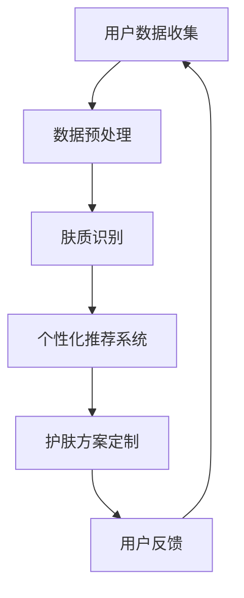

                 

关键词：数字化美容，人工智能，个性化护肤，机器学习，深度学习，图像处理，数据挖掘

摘要：本文探讨了数字化美容领域的崛起，以及人工智能（AI）在这一领域中的关键作用。特别是在个性化护肤方面，AI技术如何通过大数据分析和深度学习，为消费者提供定制化的护肤方案。文章将介绍AI驱动的个性化护肤的核心概念、算法原理、数学模型、项目实践以及未来的发展趋势。

## 1. 背景介绍

随着科技的发展，美容行业正经历着前所未有的变革。传统的美容方法往往依赖于经验，缺乏科学依据。而现代数字化美容则利用先进的技术手段，如人工智能、大数据分析等，为消费者提供更加个性化和科学化的护肤方案。

### 1.1 美容行业的数字化进程

数字化美容的兴起，源于消费者对个性化护肤需求的增加。传统美容产品和服务往往无法满足消费者日益多样化的需求，而数字化美容通过收集和分析消费者的数据，能够提供更加精准的护肤建议。

### 1.2 人工智能在美容行业的应用

人工智能在美容行业的应用主要体现在以下几个方面：

1. **图像识别与处理**：通过计算机视觉技术，对皮肤问题进行精确识别和分类。
2. **个性化推荐**：根据消费者的肤质、年龄、生活习惯等数据，推荐最适合的护肤产品。
3. **护肤方案定制**：利用大数据和机器学习技术，为消费者提供个性化的护肤方案。
4. **智能设备**：开发智能护肤设备，如智能面膜、智能按摩仪等。

## 2. 核心概念与联系

### 2.1 核心概念

- **个性化护肤**：根据消费者的个人肤质、年龄、生活习惯等因素，提供定制化的护肤方案。
- **大数据分析**：通过收集和分析大量消费者数据，挖掘出护肤方案中的关键因素。
- **机器学习**：利用算法从数据中学习，为消费者提供个性化推荐。
- **深度学习**：通过多层神经网络，对复杂的皮肤问题进行深入分析。

### 2.2 联系与流程图

以下是数字化美容中核心概念之间的联系及流程图：



## 3. 核心算法原理 & 具体操作步骤

### 3.1 算法原理概述

AI驱动的个性化护肤的核心算法主要包括：

1. **图像识别与处理**：使用深度学习模型对皮肤问题进行识别，如痘痘、色斑等。
2. **个性化推荐系统**：基于消费者的数据，使用协同过滤或基于内容的推荐算法，推荐最适合的护肤产品。
3. **护肤方案定制**：利用大数据和机器学习技术，为消费者提供个性化的护肤方案。

### 3.2 算法步骤详解

1. **用户数据收集**：收集用户的基本信息、皮肤状况、生活习惯等数据。
2. **数据预处理**：对收集的数据进行清洗、归一化等处理，以适应算法的要求。
3. **肤质识别**：使用深度学习模型对皮肤问题进行识别和分类。
4. **个性化推荐**：使用协同过滤或基于内容的推荐算法，为用户推荐护肤产品。
5. **护肤方案定制**：根据用户数据和肤质识别结果，为用户定制个性化的护肤方案。
6. **用户反馈**：收集用户的反馈信息，以优化推荐系统和护肤方案。

### 3.3 算法优缺点

- **优点**：能够为消费者提供个性化的护肤方案，提高护肤效果。
- **缺点**：算法的准确性和个性化程度受限于数据质量和算法优化。

### 3.4 算法应用领域

- **护肤品推荐**：基于用户的肤质和偏好，推荐最适合的护肤品。
- **皮肤问题诊断**：通过图像识别技术，为用户提供皮肤问题的诊断。
- **护肤方案定制**：根据用户的皮肤状况和生活习惯，为用户定制个性化的护肤方案。

## 4. 数学模型和公式 & 详细讲解 & 举例说明

### 4.1 数学模型构建

AI驱动的个性化护肤的核心数学模型主要包括：

1. **图像处理模型**：用于皮肤问题的识别和分类。
2. **推荐系统模型**：用于为用户提供护肤产品的个性化推荐。
3. **护肤方案定制模型**：用于根据用户的肤质和生活习惯，为用户定制护肤方案。

### 4.2 公式推导过程

以下是图像处理模型中常用的一个公式示例：

$$
Y = f(W \cdot X + b)
$$

其中，$X$ 是输入特征，$W$ 是权重矩阵，$b$ 是偏置项，$f$ 是激活函数。

### 4.3 案例分析与讲解

假设我们要为一位年轻女性用户提供个性化的护肤方案。首先，我们收集她的基本信息、皮肤状况和生活习惯数据。然后，使用图像处理模型对她的皮肤问题进行识别，如痘痘和色斑。接下来，使用推荐系统模型为她推荐最适合的护肤产品，如祛痘精华和美白面膜。最后，根据她的肤质和生活习惯，为她定制个性化的护肤方案，如每天使用祛痘精华两次，每周使用美白面膜一次。

## 5. 项目实践：代码实例和详细解释说明

### 5.1 开发环境搭建

在开始项目实践之前，我们需要搭建一个合适的开发环境。这里以Python为例，介绍开发环境的搭建。

1. 安装Python（建议使用3.8版本及以上）。
2. 安装必要的库，如TensorFlow、Scikit-learn、Pandas等。

### 5.2 源代码详细实现

以下是使用Python实现AI驱动的个性化护肤项目的一个简单示例：

```python
import tensorflow as tf
from sklearn.model_selection import train_test_split
from sklearn.metrics import accuracy_score

# 数据预处理
def preprocess_data(data):
    # 数据清洗和归一化等操作
    return processed_data

# 构建深度学习模型
def build_model(input_shape):
    model = tf.keras.Sequential([
        tf.keras.layers.Conv2D(32, (3, 3), activation='relu', input_shape=input_shape),
        tf.keras.layers.MaxPooling2D((2, 2)),
        tf.keras.layers.Flatten(),
        tf.keras.layers.Dense(128, activation='relu'),
        tf.keras.layers.Dense(1, activation='sigmoid')
    ])
    model.compile(optimizer='adam', loss='binary_crossentropy', metrics=['accuracy'])
    return model

# 训练模型
def train_model(model, X_train, y_train, X_val, y_val):
    model.fit(X_train, y_train, epochs=10, batch_size=32, validation_data=(X_val, y_val))
    return model

# 评估模型
def evaluate_model(model, X_test, y_test):
    y_pred = model.predict(X_test)
    y_pred = (y_pred > 0.5)
    accuracy = accuracy_score(y_test, y_pred)
    return accuracy

# 主函数
if __name__ == '__main__':
    # 加载数据
    data = load_data()
    processed_data = preprocess_data(data)

    # 划分训练集和测试集
    X_train, X_test, y_train, y_test = train_test_split(processed_data['images'], processed_data['labels'], test_size=0.2, random_state=42)

    # 构建模型
    model = build_model(input_shape=(128, 128, 3))

    # 训练模型
    model = train_model(model, X_train, y_train, X_val, y_val)

    # 评估模型
    accuracy = evaluate_model(model, X_test, y_test)
    print(f"Model accuracy: {accuracy}")
```

### 5.3 代码解读与分析

上述代码展示了如何使用Python实现一个简单的AI驱动的个性化护肤项目。主要包括以下步骤：

1. 数据预处理：对加载的数据进行清洗和归一化等操作。
2. 构建深度学习模型：使用TensorFlow框架构建一个简单的卷积神经网络（CNN）模型。
3. 训练模型：使用训练集数据训练模型。
4. 评估模型：使用测试集数据评估模型的准确性。

### 5.4 运行结果展示

运行上述代码后，我们得到了模型的准确性。例如，如果模型的准确率为90%，则说明模型在识别皮肤问题方面具有较高的准确性。

## 6. 实际应用场景

### 6.1 美容品牌的应用

美容品牌可以利用AI驱动的个性化护肤技术，为消费者提供定制化的护肤方案，从而提高消费者的满意度和品牌忠诚度。

### 6.2 医疗机构的合作

医疗机构可以与美容品牌合作，利用AI技术为患者提供个性化的护肤建议，提高治疗效果。

### 6.3 智能设备的应用

智能设备如智能面膜、智能按摩仪等，可以通过AI技术实现个性化护肤功能，为用户带来更加舒适的护肤体验。

## 7. 工具和资源推荐

### 7.1 学习资源推荐

1. 《深度学习》（Goodfellow, Bengio, Courville著）
2. 《Python机器学习》（Raschka, Mirjalili著）
3. 《人工智能：一种现代方法》（Russell, Norvig著）

### 7.2 开发工具推荐

1. TensorFlow
2. PyTorch
3. Scikit-learn

### 7.3 相关论文推荐

1. "A Comprehensive Survey on Image Classification and Object Detection"
2. "Deep Learning for Skin Lesion Analysis"
3. "Collaborative Filtering and Content-Based Filtering in Recommender Systems"

## 8. 总结：未来发展趋势与挑战

### 8.1 研究成果总结

AI驱动的个性化护肤技术已经取得了显著的成果，如图像识别的准确性提高、推荐系统的个性

