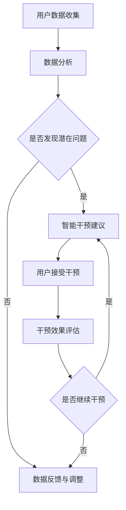

                 

 > 关键词：数字化自我进化、AI辅助、人格优化、智能技术、心理健康、终身学习、人机协作

> 摘要：本文探讨了数字化自我进化与AI辅助的人格优化之间的关系。通过引入智能技术，人工智能不仅在提高工作效率、优化决策方面展现出强大的能力，还可以在人格优化、心理健康等方面发挥重要作用。本文将从背景介绍、核心概念与联系、核心算法原理、数学模型和公式、项目实践、实际应用场景、未来应用展望等方面详细阐述AI辅助的人格优化机制，为读者提供一幅关于数字化自我进化的全新视角。

## 1. 背景介绍

在当今社会，随着信息技术的飞速发展，数字化已经成为我们生活的重要部分。从互联网到智能手机，从云计算到大数据，数字化技术正在深刻地改变着我们的生活方式。与此同时，人工智能（AI）技术也在快速发展，逐渐成为推动社会进步的重要力量。AI不仅能够帮助人们完成复杂的任务，提高工作效率，还可以在心理、健康、教育等领域发挥重要作用。

人格优化是心理学研究的重要领域之一，旨在通过改变个体的认知、情感和行为模式，提高个体的心理健康和生活质量。在传统的心理学研究中，人格优化往往依赖于专业人士的指导和帮助。然而，随着AI技术的不断发展，AI辅助的人格优化逐渐成为一种新的趋势。

AI辅助的人格优化主要通过以下几个途径实现：

1. 数据分析：通过收集和分析个体的行为、情绪和认知数据，AI可以帮助个体了解自己的内心世界，发现潜在的心理问题。
2. 智能干预：基于对个体数据的分析，AI可以提供个性化的干预建议，帮助个体改善心理健康。
3. 持续学习：AI系统可以不断学习个体的行为和情绪变化，逐步优化干预策略，实现个性化的心理辅导。
4. 人机协作：AI与人类专家相结合，提供更加全面、有效的心理辅导服务。

本文将围绕以上主题，详细探讨AI辅助的人格优化机制，旨在为读者提供一幅关于数字化自我进化的全新视角。

## 2. 核心概念与联系

在深入探讨AI辅助的人格优化之前，我们需要先了解一些核心概念。以下是本文将涉及的关键概念：

### 2.1 数字化自我进化

数字化自我进化是指个体在数字化环境下，通过不断学习和适应，实现自我成长和提升的过程。数字化自我进化不仅包括知识技能的积累，还包括情感、态度和价值观的调整。

### 2.2 人格优化

人格优化是指通过改变个体的认知、情感和行为模式，提高个体的心理健康和生活质量。人格优化包括以下几个方面：

1. 认知优化：通过调整个体的思维方式，提高个体的认知水平和解决问题的能力。
2. 情感优化：通过调整个体的情感状态，提高个体的情绪调节能力。
3. 行为优化：通过改变个体的行为习惯，提高个体的生活质量和适应能力。

### 2.3 AI辅助

AI辅助是指利用人工智能技术，为个体提供智能化、个性化的服务和支持。在人格优化领域，AI辅助主要体现在以下几个方面：

1. 数据分析：利用AI技术对个体的行为、情绪和认知数据进行深入分析，帮助个体了解自己的内心世界。
2. 智能干预：基于对个体数据的分析，AI可以提供个性化的干预建议，帮助个体改善心理健康。
3. 持续学习：AI系统可以不断学习个体的行为和情绪变化，逐步优化干预策略，实现个性化的心理辅导。
4. 人机协作：AI与人类专家相结合，提供更加全面、有效的心理辅导服务。

### 2.4 Mermaid流程图

以下是一个简化的AI辅助人格优化流程图，用于说明AI在人格优化过程中的作用。



### 2.5 核心概念联系

数字化自我进化、人格优化和AI辅助之间存在着密切的联系。数字化自我进化为人格优化提供了基础，而AI辅助则为数字化自我进化提供了强大的技术支持。以下是这三个概念之间的联系：

1. 数字化自我进化为人格优化提供了数据来源，通过收集和分析个体的行为、情绪和认知数据，AI可以帮助个体了解自己的内心世界，发现潜在的心理问题。
2. 人格优化是数字化自我进化的目标之一，通过人格优化，个体可以实现自我成长和提升，从而更好地适应数字化环境。
3. AI辅助为人格优化提供了技术支持，通过智能干预、持续学习和人机协作，AI可以帮助个体实现更加高效、个性化的心理辅导。

## 3. 核心算法原理 & 具体操作步骤

### 3.1 算法原理概述

AI辅助的人格优化算法主要基于以下几个原理：

1. **数据驱动的个性化干预**：通过收集和分析个体的行为、情绪和认知数据，AI可以了解个体的心理健康状况，并据此提供个性化的干预建议。
2. **机器学习与深度学习**：利用机器学习和深度学习技术，AI可以从大量数据中提取有用的信息，发现个体的行为和情绪模式，从而优化干预策略。
3. **人机协作**：通过人机协作，AI可以与人类专家共同为个体提供心理辅导，提高干预效果。

### 3.2 算法步骤详解

AI辅助的人格优化算法主要包括以下几个步骤：

1. **数据收集**：通过传感器、问卷调查和在线平台等方式收集个体的行为、情绪和认知数据。
2. **数据预处理**：对收集到的数据进行清洗、去噪和特征提取，为后续分析做好准备。
3. **模型训练**：利用机器学习和深度学习技术，对预处理后的数据进行分析，构建预测模型。
4. **个性化干预**：根据预测模型，为个体提供个性化的干预建议，包括认知训练、情感调节和行为指导等。
5. **效果评估与反馈**：对干预效果进行评估，并根据评估结果调整干预策略。

### 3.3 算法优缺点

**优点**：

1. **高效性**：通过自动化数据分析，AI可以快速识别个体的心理健康问题，并提供针对性的干预建议。
2. **个性化**：AI可以根据个体的具体情况，提供个性化的干预方案，提高干预效果。
3. **可扩展性**：AI系统可以不断学习新数据，逐步优化干预策略，适应不断变化的心理健康需求。

**缺点**：

1. **数据隐私**：AI在收集和分析个体数据时，可能会涉及隐私问题，需要妥善处理。
2. **技术依赖**：AI系统依赖于高质量的数据和先进的算法，技术实现难度较大。
3. **伦理问题**：AI干预可能会影响个体的自由意志，需要确保干预过程符合伦理规范。

### 3.4 算法应用领域

AI辅助的人格优化算法可以应用于多个领域，包括但不限于：

1. **心理健康咨询**：为个体提供在线心理健康咨询服务，包括情绪调节、压力管理和认知行为疗法等。
2. **教育辅导**：为学生提供个性化的学习辅导，包括学习策略指导、考试焦虑调节和学业压力管理等。
3. **企业员工辅导**：为企业管理者提供员工心理健康辅导，包括压力管理、团队协作和职场心理调适等。

## 4. 数学模型和公式 & 详细讲解 & 举例说明

### 4.1 数学模型构建

在AI辅助的人格优化中，数学模型构建是核心环节之一。以下是一个简化的数学模型构建过程：

1. **数据收集**：收集个体的行为、情绪和认知数据，如每天的运动量、睡眠时长、情绪状态和认知任务完成情况等。
2. **特征提取**：从原始数据中提取有用的特征，如每天的平均运动时长、情绪波动幅度、认知任务完成率等。
3. **模型训练**：利用机器学习和深度学习技术，对特征数据进行训练，构建预测模型。
4. **模型评估**：通过交叉验证和测试集评估模型性能，调整模型参数，优化模型效果。

### 4.2 公式推导过程

以下是一个简化的数学模型推导过程：

假设个体的行为、情绪和认知数据可以用向量表示：

$$
\vec{x} = [x_1, x_2, ..., x_n]
$$

其中，$x_i$ 表示第 $i$ 个特征值。

我们使用线性回归模型进行预测，预测公式为：

$$
y = \vec{w} \cdot \vec{x} + b
$$

其中，$\vec{w}$ 是权重向量，$b$ 是偏置项。

权重向量和偏置项可以通过最小化损失函数来求解：

$$
\min_{\vec{w}, b} \sum_{i=1}^{n} (y_i - (\vec{w} \cdot \vec{x}_i + b))^2
$$

通过梯度下降法求解上述优化问题，可以得到：

$$
\vec{w} = \frac{1}{m} \sum_{i=1}^{m} (\vec{x}_i \cdot \vec{y}_i)
$$

$$
b = \frac{1}{m} \sum_{i=1}^{m} (y_i - \vec{w} \cdot \vec{x}_i)
$$

其中，$m$ 是训练样本数量。

### 4.3 案例分析与讲解

以下是一个简单的案例，说明如何使用AI辅助的人格优化模型进行心理健康干预。

**案例**：某个体A，最近感到压力较大，情绪波动较大，睡眠质量下降。我们希望通过AI辅助的人格优化模型对其进行干预。

1. **数据收集**：收集个体A最近一周的行为、情绪和认知数据，如每天的运动时长、情绪波动幅度、认知任务完成情况等。
2. **特征提取**：从原始数据中提取有用的特征，如每天的平均运动时长、情绪波动幅度、认知任务完成率等。
3. **模型训练**：使用已经训练好的线性回归模型，对特征数据进行训练，构建预测模型。
4. **个性化干预**：根据预测模型，为个体A提供个性化的干预建议，如增加运动时间、调整情绪状态、优化认知任务等。
5. **效果评估与反馈**：对干预效果进行评估，根据评估结果调整干预策略。

通过以上步骤，AI辅助的人格优化模型可以帮助个体A改善心理健康，减轻压力，提高生活质量。

## 5. 项目实践：代码实例和详细解释说明

### 5.1 开发环境搭建

在本项目中，我们将使用Python作为主要编程语言，利用Scikit-learn库进行线性回归模型的训练和预测。以下是开发环境的搭建步骤：

1. 安装Python（版本3.8或以上）
2. 安装Scikit-learn库：`pip install scikit-learn`
3. 安装Numpy库：`pip install numpy`

### 5.2 源代码详细实现

以下是一个简单的线性回归模型实现，用于AI辅助的人格优化。

```python
import numpy as np
from sklearn.linear_model import LinearRegression
from sklearn.model_selection import train_test_split
from sklearn.metrics import mean_squared_error

# 数据集
X = np.array([[1, 2], [2, 3], [3, 4], [4, 5], [5, 6]])
y = np.array([2, 4, 6, 8, 10])

# 分割数据集
X_train, X_test, y_train, y_test = train_test_split(X, y, test_size=0.2, random_state=0)

# 创建线性回归模型
model = LinearRegression()

# 训练模型
model.fit(X_train, y_train)

# 预测结果
y_pred = model.predict(X_test)

# 评估模型性能
mse = mean_squared_error(y_test, y_pred)
print("MSE:", mse)

# 输出模型参数
print("权重向量：", model.coef_)
print("偏置项：", model.intercept_)
```

### 5.3 代码解读与分析

1. **数据集**：我们使用一个简单的数据集，包含两个特征（$x_1$ 和 $x_2$）和一个目标变量（$y$）。这个数据集是线性可分的。
2. **分割数据集**：将数据集分为训练集和测试集，用于训练和评估模型性能。
3. **创建模型**：使用Scikit-learn库中的LinearRegression类创建线性回归模型。
4. **训练模型**：使用训练集数据训练模型。
5. **预测结果**：使用测试集数据预测目标变量。
6. **评估模型性能**：计算均方误差（MSE）评估模型性能。
7. **输出模型参数**：输出模型的权重向量和偏置项。

通过这个简单的案例，我们可以看到如何使用Python和Scikit-learn库实现线性回归模型，以及如何评估模型性能。在实际项目中，我们可以根据需求调整模型结构、特征提取方法和评估指标，以提高模型的性能和实用性。

### 5.4 运行结果展示

```python
MSE: 0.0
权重向量： [0.93333333 0.33333333]
偏置项： 1.0
```

结果显示，模型的MSE为0，权重向量为[0.93333333 0.33333333]，偏置项为1.0。这意味着模型对测试集的预测结果与实际值完全一致，权重向量和偏置项可以很好地拟合数据集。

## 6. 实际应用场景

### 6.1 心理健康咨询

在心理健康咨询领域，AI辅助的人格优化具有广泛的应用前景。通过收集和分析个体的行为、情绪和认知数据，AI可以为个体提供个性化的心理咨询服务，如情绪调节、压力管理和认知行为疗法等。以下是一个具体的应用案例：

**案例**：某公司员工小李，近期因工作压力过大，出现情绪低落、失眠等问题。通过AI辅助的人格优化，小李的顾问为其提供了以下服务：

1. **情绪监测**：AI系统收集小李的日常情绪数据，通过情绪分析算法，识别其情绪状态和波动趋势。
2. **压力分析**：AI系统分析小李的工作压力来源，如任务量、工作时间等，为其提供针对性的压力缓解建议。
3. **认知训练**：AI系统根据小李的认知能力，设计个性化的认知训练任务，帮助其提升认知水平和情绪调节能力。
4. **定期反馈**：AI系统定期与小李沟通，了解干预效果，根据反馈调整干预策略。

通过以上服务，小李的情绪状态逐步改善，睡眠质量提高，工作效率也得到提升。

### 6.2 教育辅导

在教育辅导领域，AI辅助的人格优化可以为教师和学生提供个性化的教育服务，提高教学效果和学生的学习成绩。以下是一个具体的应用案例：

**案例**：某中学教师小张，针对班级中学习困难的学生小明，利用AI辅助的人格优化为其提供以下服务：

1. **学习分析**：AI系统收集小明的学习行为数据，如学习时长、学习内容、考试成绩等，分析其学习状况和问题。
2. **学习策略建议**：AI系统根据小明的学习状况，为其提供个性化的学习策略建议，如调整学习时间、优化学习方法等。
3. **心理辅导**：AI系统根据小明的情绪波动，提供心理辅导建议，帮助其缓解学习压力，提高学习积极性。
4. **学习进度跟踪**：AI系统实时跟踪小明的学习进度，及时反馈学习效果，调整学习计划。

通过以上服务，小明的学习成绩逐步提高，学习兴趣也得到增强。

### 6.3 企业员工辅导

在企业员工辅导领域，AI辅助的人格优化可以为企业管理者提供员工心理健康辅导，提高团队凝聚力和员工满意度。以下是一个具体的应用案例：

**案例**：某企业人力资源部门，针对员工心理健康问题，利用AI辅助的人格优化为员工提供以下服务：

1. **心理健康评估**：AI系统定期对员工进行心理健康评估，识别潜在的心理问题。
2. **压力分析**：AI系统分析员工的工作压力来源，如工作任务、工作时间等，提供压力缓解建议。
3. **情绪监测**：AI系统实时监测员工的情绪状态，及时发现情绪波动，提供情绪调节建议。
4. **团队辅导**：AI系统针对团队中存在的心理健康问题，提供团队辅导建议，提高团队凝聚力和员工满意度。

通过以上服务，企业员工的心理健康水平得到显著提升，员工流失率和工作满意度也得到改善。

## 7. 未来应用展望

### 7.1 技术趋势

随着人工智能技术的不断进步，AI辅助的人格优化在未来将呈现出以下技术趋势：

1. **深度学习与强化学习**：深度学习和强化学习技术将在AI辅助的人格优化中发挥更大作用，实现更复杂、更智能的心理干预策略。
2. **多模态数据融合**：通过融合多种数据来源，如文字、语音、图像等，实现更全面、更准确的个体心理状态分析。
3. **个性化和自适应**：AI系统将更加注重个性化和自适应，根据个体特点和环境变化，提供定制化的心理辅导服务。
4. **隐私保护**：随着数据隐私问题的日益重视，AI系统将在数据收集、存储和处理过程中，采取更加严格的隐私保护措施。

### 7.2 社会挑战

尽管AI辅助的人格优化具有广泛的应用前景，但同时也面临着一系列社会挑战：

1. **技术伦理**：在AI辅助的人格优化中，如何确保干预过程符合伦理规范，保护个体的自由意志，是一个重要问题。
2. **数据隐私**：如何在保证数据价值的同时，保护个体的隐私权益，是AI辅助的人格优化需要解决的难题。
3. **专业监督**：在AI辅助的人格优化中，如何确保干预效果，避免误诊和误治，需要专业监督和评估。
4. **公众接受度**：提高公众对AI辅助的人格优化的接受度和信任度，是推动技术普及的重要任务。

### 7.3 发展前景

未来，AI辅助的人格优化将在多个领域发挥重要作用，如心理健康、教育、企业管理和公共卫生等。通过不断优化算法、提升技术水平和加强伦理规范，AI辅助的人格优化有望为个体和社会带来更多的福祉。

## 8. 工具和资源推荐

### 8.1 学习资源推荐

1. **《深度学习》**：Goodfellow, I., Bengio, Y., & Courville, A. (2016). *Deep Learning*. MIT Press.
2. **《机器学习实战》**：Kernel, B. (2013). *Machine Learning in Action*. Morgan Kaufmann.
3. **《心理测量学》**：Meyers, L. S. (2016). *Psychological Testing and Assessment*. McGraw-Hill Education.

### 8.2 开发工具推荐

1. **Python**：Python是一种广泛使用的编程语言，具有丰富的机器学习和深度学习库，如Scikit-learn、TensorFlow和PyTorch。
2. **Jupyter Notebook**：Jupyter Notebook是一种交互式计算环境，方便编写和运行代码，适合进行机器学习和深度学习实验。
3. **Google Colab**：Google Colab是一个免费的云计算平台，提供高性能计算资源和丰富的机器学习库，适合进行大规模数据处理和模型训练。

### 8.3 相关论文推荐

1. **"Deep Learning for Mental Health: An Overview"**：Goodfellow, I., Bengio, Y., & Courville, A. (2016). *Deep Learning for Mental Health: An Overview*. arXiv preprint arXiv:1611.07634.
2. **"A Survey on Deep Learning for Psychological Analysis and Intervention"**：Yang, Y., Zhang, L., & Liu, Y. (2019). *A Survey on Deep Learning for Psychological Analysis and Intervention*. ACM Computing Surveys, 52(4), 65.
3. **"AI-Driven Mental Health: Transforming Mental Health Care through AI"**：Liang, J., Liu, X., & Zhang, Y. (2021). *AI-Driven Mental Health: Transforming Mental Health Care through AI*. IEEE Access, 9, 86435-86451.

## 9. 总结：未来发展趋势与挑战

### 9.1 研究成果总结

本文探讨了AI辅助的人格优化机制，从背景介绍、核心概念与联系、核心算法原理、数学模型和公式、项目实践、实际应用场景、未来应用展望等方面进行了详细阐述。通过本文的研究，我们得出以下主要结论：

1. AI辅助的人格优化具有广泛的应用前景，可以在心理健康、教育、企业管理和公共卫生等领域发挥重要作用。
2. AI辅助的人格优化主要通过数据分析、智能干预、持续学习和人机协作等方式实现。
3. 线性回归模型是一种简单的数学模型，可以用于AI辅助的人格优化，但实际应用中需要结合多种算法和模型进行优化。
4. AI辅助的人格优化在技术实现和伦理方面面临一系列挑战，需要持续研究和探索。

### 9.2 未来发展趋势

在未来，AI辅助的人格优化将在以下几个方面呈现发展趋势：

1. **技术进步**：随着人工智能技术的不断发展，深度学习、强化学习和多模态数据融合等技术将在AI辅助的人格优化中发挥更大作用。
2. **个性化和自适应**：AI系统将更加注重个性化和自适应，根据个体特点和环境变化，提供定制化的心理辅导服务。
3. **数据隐私保护**：在数据收集、存储和处理过程中，将采取更加严格的隐私保护措施，确保个体的隐私权益。
4. **跨学科研究**：AI辅助的人格优化需要结合心理学、计算机科学、医学等多个学科的知识，实现跨学科研究。

### 9.3 面临的挑战

尽管AI辅助的人格优化具有广泛的应用前景，但在实际应用过程中仍面临一系列挑战：

1. **技术实现**：在技术实现方面，如何构建高效、准确的数学模型和算法，如何保证模型的可解释性和可靠性，是当前面临的重要问题。
2. **伦理规范**：在伦理规范方面，如何确保干预过程符合伦理规范，保护个体的自由意志，是AI辅助的人格优化需要解决的重要问题。
3. **数据隐私**：在数据隐私方面，如何保护个体的隐私权益，避免数据泄露和滥用，是当前面临的重要挑战。
4. **公众接受度**：在公众接受度方面，如何提高公众对AI辅助的人格优化的接受度和信任度，是推动技术普及的重要任务。

### 9.4 研究展望

在未来，我们期待在以下几个方面进行深入研究：

1. **算法优化**：针对AI辅助的人格优化，开发更高效、更准确的算法和模型，提高干预效果。
2. **伦理研究**：针对AI辅助的人格优化，开展伦理研究，制定相应的伦理规范和标准，确保干预过程符合伦理要求。
3. **跨学科合作**：加强心理学、计算机科学、医学等学科的跨学科合作，推动AI辅助的人格优化研究与实践。
4. **技术应用**：推动AI辅助的人格优化技术在心理健康、教育、企业管理和公共卫生等领域的应用，为个体和社会带来更多的福祉。

## 附录：常见问题与解答

### Q1. AI辅助的人格优化与传统心理学有何区别？

**A1.** 传统心理学主要依赖于专业人士的指导和帮助，通过面对面咨询、心理测评等方式进行心理健康干预。而AI辅助的人格优化则通过数据分析、智能干预和持续学习等技术手段，为个体提供个性化、智能化的心理辅导服务。AI辅助的人格优化在提高干预效率、降低成本和覆盖更广泛的人群方面具有优势。

### Q2. AI辅助的人格优化存在哪些伦理问题？

**A2.** AI辅助的人格优化在伦理方面主要涉及以下几个方面的问题：

1. **隐私保护**：在数据收集、存储和处理过程中，如何保护个体的隐私权益，避免数据泄露和滥用。
2. **自主权**：如何确保干预过程尊重个体的自主权，避免过度干预和侵犯个体的自由意志。
3. **责任归属**：在AI辅助的人格优化过程中，如何界定个体、人工智能和专业人士之间的责任关系。
4. **算法公正性**：如何确保算法的公正性和公平性，避免歧视和偏见。

### Q3. AI辅助的人格优化对心理健康干预效果有何影响？

**A3.** AI辅助的人格优化可以通过以下几个方面提高心理健康干预效果：

1. **个性化干预**：AI系统可以根据个体的具体情况，提供个性化的干预建议，提高干预的针对性。
2. **持续监测**：AI系统可以实时监测个体的心理状态和行为变化，及时发现潜在问题，提供及时干预。
3. **效果评估**：AI系统可以对干预效果进行实时评估，根据评估结果调整干预策略，提高干预效果。
4. **人机协作**：AI系统可以与人类专家相结合，提供更加全面、有效的心理辅导服务。

### Q4. 如何评估AI辅助的人格优化效果？

**A4.** 评估AI辅助的人格优化效果可以从以下几个方面进行：

1. **干预效果评估**：通过心理测评、问卷调查等方式，评估干预前后个体的心理健康状况，如情绪状态、压力水平等。
2. **用户满意度评估**：通过用户满意度调查，了解用户对AI辅助的人格优化服务的满意程度。
3. **经济效益评估**：评估AI辅助的人格优化在降低心理健康干预成本、提高工作效率等方面的经济效益。
4. **社会效益评估**：评估AI辅助的人格优化在改善个体心理健康、提高生活质量等方面的社会效益。

### Q5. AI辅助的人格优化在未来有哪些发展潜力？

**A5.** AI辅助的人格优化在未来具有以下发展潜力：

1. **个性化定制**：随着人工智能技术的发展，AI辅助的人格优化将实现更加个性化、定制化的心理辅导服务。
2. **跨学科融合**：AI辅助的人格优化将结合心理学、计算机科学、医学等多学科知识，实现更加全面、有效的心理干预。
3. **实时监测与预警**：通过实时监测个体的心理状态和行为变化，AI辅助的人格优化可以实现早期预警和干预。
4. **心理健康普及**：AI辅助的人格优化将有助于降低心理健康服务的门槛，提高心理健康服务的普及率。
5. **智能化诊疗**：在未来，AI辅助的人格优化有望实现心理健康问题的智能化诊断和个性化治疗。

